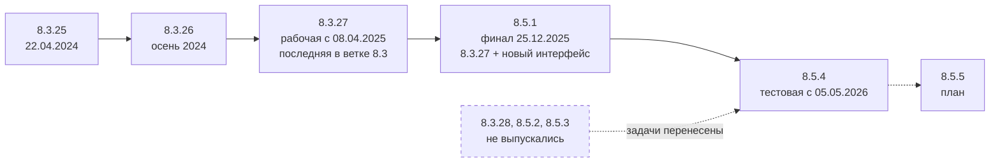

# Стратегия освоения 1С в 2026 году

[← Предыдущий](README.md) | [🗺 Оглавление](README.md) | [Следующий →](02_Timeline.md)

> Актуализировано: сентябрь 2026.

Этот файл описывает обстановку перед стартом. В нём собрано, на чём держится разработка на 1С в 2026 году, где работают 1С-разработчики, как выбрать направление и какие популярные утверждения устарели. Подробный план по этапам лежит в [02_Timeline.md](02_Timeline.md), матрица навыков — в [03_Competencies.md](03_Competencies.md), первая работа и зарплаты — в [13_Career.md](13_Career.md).

Легенда: 🔴 обязательно · 🟡 желательно · 🔵 по контексту (нужно в инхаусе, продукте или проекте). Версии, даты и цифры сверены на 29.09.2026; всё, что быстро устаревает, перепроверяйте по ссылкам из раздела «Источники».

## Содержание

- [Принципы](#-принципы)
- [Ландшафт 1С на сентябрь 2026](#-ландшафт-1с-на-сентябрь-2026)
- [Контексты работы и роли](#-контексты-работы-и-роли)
- [Как выбрать трек](#-как-выбрать-трек)
- [Фокусы 2026](#-фокусы-2026)
- [Мифы, в которые не стоит верить](#-мифы-в-которые-не-стоит-верить)
- [Целевые результаты](#-целевые-результаты)
- [Источники](#-источники)

---

## 🧭 Принципы

1. **Три опоры: платформа, предметная область, коммуникация.** Официальная модель компетенций разработчика 1С (MC-6-001, 2025) уже от Junior ждёт понимания процессов клиента: торговли, производства, бухгалтерского и налогового учёта, кадров и зарплаты. В тестовых заданиях джунам дают проводки и расчёт средней себестоимости. Поэтому предметную область изучают с первого месяца, параллельно с языком.
2. **Уровень определяют навыки, а не стаж.** В модели MC-6-001 уровни Junior, Middle и Senior описаны через компетенции, сроков там нет. Сроки в этом роудмапе — ориентиры и оценка авторов.
3. **Практика с первого этапа.** Каждый этап заканчивается проектом с критериями приёмки (P0–P17 в [07_Projects.md](07_Projects.md)) и вопросами самопроверки. В тестовых заданиях для джунов чаще всего встречаются задачи трёх типов: алгоритмы на коллекциях, мини-конфигурация «склад и продажи», внешняя обработка с клиент-серверным взаимодействием.
4. **Стандарты с первой строки кода.** Опора — система стандартов [its.1c.ru/db/v8std](https://its.1c.ru/db/v8std). Основные правила: не выполнять запросы в цикле (стандарт 436), задавать условия в параметрах виртуальных таблиц (657), сокращать число серверных вызовов (487), не вызывать модальные окна (703), использовать управляемые блокировки (460). Свой код проверяйте BSL Language Server или плагином «1C:Code style V8» в EDT.
5. **Контекст определяет стек.** У франчайзи работают в Конфигураторе с хранилищем, сопровождают типовые и обновляют их. В продуктах и инхаусе нужны EDT, Git, CI и автотесты. Базу учат все, инструменты подбирают под контекст.
6. **Дорабатывайте типовую в правильном порядке.** Сначала настройки и функциональные опции, затем дополнительные отчёты и обработки БСП, затем расширение. Основную конфигурацию меняют с сохранением поддержки, только когда расширение не справляется. После каждого обновления проверяйте, применимы ли расширения.
7. **У каждой возможности есть версия.** Прежде чем использовать механизм, выясните, с какой версии платформы он появился и в каком режиме совместимости работает. Частая ошибка в статьях и ответах ИИ — возможности 8.3.x, которые приписывают 8.5.
8. **ИИ ускоряет работу, но автор кода — вы.** Черновик от ИИ проходит BSL LS, тесты и ревью. Персональные данные и код клиента не отправляют во внешние сервисы без разрешения (152-ФЗ, 98-ФЗ).
9. **Сертификат — промежуточная цель, а не главная.** 1С:Профессионал по платформе сдают после этапа 2, 1С:Специалист — после этапа 5 по желанию. В вакансиях сертификаты обычно «желательны», а не обязательны.
10. **Проверяйте факты по первоисточнику.** Платформа, законы и рынок меняются, поэтому рядом с фактом держите дату проверки. Так устроен и этот роудмап (реестр утверждений — в [SOURCES.md](SOURCES.md)).

---

## 🌐 Ландшафт 1С на сентябрь 2026

| Область | Состояние на 29.09.2026 | Что это значит для вас |
|---|---|---|
| Платформа | Рабочие линии — 8.3.27 и 8.5.1, версия 8.5.4 тестовая | Учиться можно на любой линии. Большие типовые пока работают на 8.3.27 |
| Среда разработки | Конфигуратор развивается, стабильная ветка 1C:EDT — 2026.1, ветка 2026.2 — релиз-кандидат | Начните с Конфигуратора. EDT и Git осваивайте на этапе 6 или раньше, если цель — продукт |
| ИИ | 1С:Напарник в EDT, MCP-серверы от сообщества, открытый бенчмарк PRISM | Умение проверить код ИИ важнее умения его сгенерировать |
| Инфраструктура | Linux (Astra, РЕД ОС, Альт), PostgreSQL в сборках для 1С, MS SQL | Основы Linux и PostgreSQL — плюс для Junior и обязательный минимум для администратора |
| Рынок труда | Рынок работодателя. Вакансий «без опыта» 5–7%, чаще всего упоминается 1С:ERP | Сертификаты в вакансиях обычно «желательны», поэтому готовьте портфолио и учите учёт. Подробнее — [13_Career.md](13_Career.md) |
| Законодательство | НДС 22%, НДС на УСН, ЭПД, маркировка, цифровой рубль, ФСБУ с 2027 года | Постоянный поток задач по обновлению и доработке типовых |

### Платформа 8.3.27 и 8.5.1

- **Ветка 8.3 закончилась на 8.3.27.** Версия 8.3.28 не выходила, её задачи перенесли в линию 8.5. Промежуточных 8.5.2 и 8.5.3 тоже не было: их задачи вошли в 8.5.4.
- **8.5 — не отдельная платформа**, а новая нумерация той же платформы 8.x: 8.5.1 = возможности 8.3.27 + новый интерфейс. Базу конвертировать не нужно. Но если снять режим совместимости ради новых возможностей, вернуться на старую платформу уже не получится.
- **Интерфейс «Версия 8.5»**: новый визуальный стиль, векторные картинки, тёмная тема, стандартный и компактный масштаб, оконная система «В диалоговых окнах». Интерфейс продолжает развиваться: в финальной 8.5.1 фирма «1С» называла его бета-функциональностью. Для перехода есть режимы совместимости «Такси. Разрешить Версия 8.5» и «Версия 8.5. Разрешить Такси».
- **Сборки на конец сентября 2026 года:** 8.3.27.2342 (в перечне рабочих с 31.08.2026) и 8.5.1.1529 (с 07.09.2026). Версия 8.5.4 тестовая с 05.05.2026, её рабочий выпуск на 29.09.2026 не подтверждён. Версия 8.5.5 есть в плане, по оценкам — ближе к 2027 году.
- **Официальной политики сроков поддержки версий платформы не найдено.** На практике минимальную версию задают типовые конфигурации и БСП.

### Какую версию ставить

| Задача | Что ставить | Комментарий |
|---|---|---|
| Учёба по книгам и курсам | Учебная версия 8.5.1 или 8.3.27 с [online.1c.ru](https://online.1c.ru/catalog/free/learning.php) | Бесплатно после анкеты. Только файловый вариант, некоммерческое использование. Если курс записан в «Такси», берите 8.3.27 |
| Эксперименты разработчика | Community-лицензия на [developer.1c.ru](https://developer.1c.ru/applications/Console?state=community) | Срочная лицензия, нужна учётная запись на портале разработчиков |
| Базы с БП, ЗУП, УТ, КА, ERP, УХ, ДО | 8.3.27, последняя рабочая сборка | Точный минимум указан в требованиях релиза конфигурации |
| УНФ, «Розница» 3.0.13+, решения на БСП 3.2 | 8.5.1 | УНФ и «Розница» 3.0.13 требуют сборку не ниже 8.5.1.1150 |
| 8.5.4 | Только на копии базы | Тестовая версия: в рабочие базы её не ставят |

Полные дистрибутивы доступны на releases.1c.ru по подписке ИТС. Сайт v8.1c.ru информационный, дистрибутивов там нет.

### Типовые конфигурации и БСП

- БСП выходит в двух редакциях, обе обновлены 23–24.09.2026: **3.1.12** для платформ 8.3.24–8.3.27 и **3.2.1** только для 8.5.1. По функциям они почти одинаковы.
- Большие типовые (БП, ЗУП, УТ, КА, ERP, УХ, ДО) в 2026 году работают на 8.3.27. На 8.5 перешли УНФ и «Розница» начиная с 3.0.13. Официального плана перевода остальных нет: сроки ищите в разделе ИТС [«Информация об обновлениях»](https://its.1c.ru/db/updinfo).
- УТ 11.5, КА 2.5 и ERP 2.5 — одна кодовая база, поэтому опыт в УТ напрямую переносится на ERP.
- Официальные исправления фирма «1С» выпускает как расширения с назначением «Исправление». Расширения — штатный механизм и для самой «1С».
- Новые инструменты уже требуют 8.5: 1С:СППР 2.1 работает только на 8.5.1 и выше.

### Инструменты разработчика

- **Конфигуратор развивается.** Хранилище конфигурации работает, обычные формы редактируются только в Конфигураторе.
- **1C:EDT** нумеруется как ГГГГ.N, и год в номере не совпадает с годом выхода. Стабильная ветка — **2026.1** (патч 2026.1.3). **2026.2** — релиз-кандидат на Eclipse 2025-12 и Java 25. Проекты 8.5 EDT поддерживает с версии 2025.1. Скачать EDT можно бесплатно после регистрации на [edt.1c.ru](https://edt.1c.ru/docs/new/download.php). Новичку лучше брать последний стабильный патч, а не RC.
- **Командная строка EDT — `1cedtcli`.** Утилита ring для EDT с 2024.1 не поддерживается, но для активации программных лицензий её используют и дальше. Встроенной интеграции EDT с Jenkins, GitLab CI или GitHub Actions нет: CI собирают внешними средствами (`1cedtcli`, `ibcmd`, vanessa-runner, jenkins-lib).
- **Из хранилища в Git.** Официальный бесплатный [1С:ГитКонвертер](https://github.com/1C-Company/GitConverter) переносит историю в формат EDT. gitsync от сообщества делает коммит из каждой версии хранилища.
- **VS Code.** Официального расширения от «1С» нет. Есть расширения сообщества: «Language 1C (BSL)» и BSL Language Server.
- **1С:Исполнитель переименован в «1С:Предприятие.Элемент Скрипт»** (актуальная линейка 9.x, распространяется свободно).
- **Тестирование.** 1С:Тестировщик и 1С:Сценарное тестирование — официальные продукты «1С». Из открытых инструментов популярны Vanessa Automation и YAxUnit.
- **Чем пользуются на практике.** Ориентир — опрос Landscape1C 2026 (313 участников на 25.09.2026, выборка смещена к активной части сообщества): 1C:EDT пользовались 47,3% респондентов, GitLab — 47,0%, плагином 1С:Напарник — 35,5%, Cursor — 34,2%, 1С:Элементом — 7,3%.

### ИИ в разработке

- **1С:Напарник (1C:Workmate)** — ИИ-ассистент **разработчика** в 1C:EDT, плагин входит в поставку EDT 2026. Он дописывает код, анализирует его в фоне, а в агентном чате правит код и метаданные. Токен выдаётся на [code.1c.ai](https://code.1c.ai/) по учётной записи 1С:ИТС, нужна подписка ИТС. Сервис облачный: код уходит на серверы «1С», варианта для своих серверов нет, в Конфигураторе Напарника нет. Условия доступа смотрите на code.1c.ai.
- Официального ИИ-ассистента «1С» для бухгалтера или менеджера не найдено. В типовых есть облачные ИИ-сервисы «1С»: распознавание первичных документов, прогнозирование и др.
- **Инструменты сообщества:** каталог MCP-серверов [Untru/1c-mcp](https://github.com/Untru/1c-mcp), MCP-сервер в Vanessa Automation (с 1.2.043.12), экспериментальный режим MCP в BSL LS, vrunner-mcp, наборы правил и skills (cc-1c-skills, ai_rules_1c, 1c-ai-development-kit для Claude Code).
- **Качество измеримо.** Бенчмарк [PRISM](https://github.com/genlab-1c/prism) (прогон 25.09.2026: 57 моделей, 35 задач, код исполняется в 1С 8.3.27) даёт такие доли решённых задач: лучшие модели — 85–100%, GigaChat и YandexGPT — 0–13%, малые локальные модели — 0–27%. Сильным open-weight моделям нужен серверный GPU.
- **Ограничения.** По данным каталога Landscape1C, доступ к Cursor, Claude Code, Codex и Copilot из РФ ограничен: проверяйте условия сервиса и политику работодателя. MCP не защищает данные сам по себе: доступ ограничивают права пользователя 1С, обезличенная копия базы и учётная запись только для чтения.
- **Право.** Отправка персональных данных во внешнюю LLM — трансграничная передача по 152-ФЗ. Код и данные клиента защищены NDA и режимом коммерческой тайны (98-ФЗ). Для ГИС и информационных систем госорганов действует прямой запрет по п. 60 Приказа ФСТЭК № 117 (с 01.03.2026). Подробнее — [09_AI_Development.md](09_AI_Development.md).

### Импортозамещение, Linux и СУБД

- **Linux:** Astra Linux, РЕД ОС, Альт (метапакет `1c-preinstall`), Debian, Ubuntu. Есть сборки для ARM.
- **PostgreSQL — только в сборках для 1С**: от «1С», Postgres Pro, ALT и managed-сервисов с суффиксом «-1c». Ванильный PostgreSQL не используют. В официальном тестовом стенде `1C-Company/docker_fresh` работают платформа 8.5.1.1302 и PostgreSQL 18.3-5.1C.
- **MS SQL Server по-прежнему используется**, но SQL Server 2016 Microsoft сняла с поддержки 14.07.2026. Oracle и IBM Db2 формально поддерживаются в 8.5.1, на практике это ниша.
- **Что меняется для кода на Linux:** важен регистр имён файлов, UNC-путей нет, COM и OLE недоступны (вместо них внешние компоненты Native API), разделитель пути получают через `ПолучитьРазделительПути()`, на сервере нужны шрифты.
- **SAP → 1С:ERP.** По данным Росатома (вторичный пересказ), к ноябрю 2025 года на 1С:ERP работали 150 организаций, к 2027 году планируется более 230 предприятий. В вакансиях 2026 года встречаются проекты «перехода с SAP на 1С» и «миграции с УПП на ERP.УХ».

### Рынок труда

- **Рынок работодателя.** hh-индекс в ИТ в III квартале 2025 года — 16,1 против 8,2 годом ранее (по данным SENSE IT, вторичный пересказ). Джунам войти стало сложнее.
- **Выгрузка hh.ru за 10.08–07.09.2026** (452 вакансии «1С» после удаления дублей; данные собрали третьи лица, это ориентир, а не статистика рынка). Вакансий «без опыта» — 5–7%, удалённый формат разрешают около 50%. 1С:ERP лидирует по упоминаниям, но среди вакансий разработчиков УТ, ERP, ЗУП, БП и ДО идут почти вровень. 1С:Элемент упомянут в одной вакансии, мобильная разработка — в единичных.
- **Чего ждут работодатели.** Чаще всего в требованиях встречаются учёт (БУ и НУ), ТЗ и BPMN, обмены и интеграции, тестирование. Git, CI и EDT видны в продуктовых и крупных инхаус-командах. Гибридные роли («Программист-аналитик 1С») тоже встречаются.
- Зарплаты с методикой и оговорками собраны только в [13_Career.md](13_Career.md).

### Законодательство

Каждое изменение закона превращается в релизы типовых, обновления у клиентов, доработку печатных форм и обменов. Главное на сентябрь 2026 года:

- **НДС 22%** с 01.01.2026 (Федеральный закон № 425-ФЗ от 28.11.2025).
- **НДС на УСН.** Порог освобождения — 20 млн ₽ дохода за 2025–2028 годы, 15 млн ₽ — за 2029 год, 10 млн ₽ — за 2030 год (Федеральный закон № 228-ФЗ от 04.07.2026). Упрощенцы сверх порога остаются на УСН и платят НДС 5% или 7% без вычетов либо 22% с вычетами.
- **ЭПД** (электронные перевозочные документы) обязательны с 01.09.2026 (140-ФЗ).
- **Маркировка «Честный ЗНАК».** Главная тема 2026 года — ТС ПИоТ и разрешительный режим на кассе. Старый протокол с токеном X-API-KEY работает до 01.10.2026.
- **Цифровой рубль.** С 01.09.2026 начался первый этап: крупнейшие банки и торговцы с выручкой более 120 млн ₽.
- **ФСБУ 9/2025 «Доходы» и ФСБУ 10/2026 «Расходы»** обязательны с отчётности за 2027 год.
- **Персональные данные.** 152-ФЗ с оборотными штрафами по 420-ФЗ. Для ГИС с 01.03.2026 действует Приказ ФСТЭК № 117.

Актуальную редакцию проверяйте на [consultant.ru](https://www.consultant.ru) и [nalog.gov.ru](https://www.nalog.gov.ru/new2026/). Разбор для программиста — в [10_Domain_and_Law.md](10_Domain_and_Law.md).

### Как следить за изменениями

- **Статус сборки.** Бывают тестовые, ознакомительные и рабочие сборки. В рабочие базы ставят только рабочие сборки, а тестовые пробуют на копиях.
- **Что нового в платформе.** Смотрите страницы «Новое в платформе» на v8.1c.ru (например, [8.5.1](https://v8.1c.ru/platforma/news/novoe-v-platforme-8-5-1/) и [8.5.4](https://v8.1c.ru/platforma/news/novoe-v-platforme-8-5-4/)) и планы задач в блоге «Зазеркалье» (например, [план 8.5.5](https://wonderland.v8.1c.ru/blog/plan-zadach-na-versiyu-8-5-5-platformy-1s-predpriyatie/)).
- **Требования типовых.** Раздел ИТС «Информация об обновлениях» ([its.1c.ru/db/updinfo](https://its.1c.ru/db/updinfo)) и информационные письма на 1c.ru. Большая часть ИТС доступна только по платной подписке.
- **Перед обновлением EDT** просмотрите публичный трекер [1C-Company/1c-edt-issues](https://github.com/1C-Company/1c-edt-issues).

---

## 💼 Контексты работы и роли

Каталог сообщества Landscape1C делит работу 1С-специалиста на четыре контекста (франчайзи, инхаус, продукты, проекты) и четыре роли (разработчик, администратор, тестировщик, аналитик). Официальная модель MC-6-001 написана для специалистов франчайзи, но составлена с запасом («по принципу избыточности»): каждая компания вычёркивает лишнее под себя.

| Контекст | Чем занимаются | Типичный стек | Что важно для новичка |
|---|---|---|---|
| Франчайзи | Сопровождение клиентов по ИТС, обновления типовых, внешние отчёты и печатные формы, расширения, обмены, подключение оборудования и маркировки по инструкции | Конфигуратор, хранилище, БП, УТ, ЗУП, БСП, СКД | Самый массовый вход в профессию: много разных задач и быстрый рост в учёте |
| Инхаус | Развитие учётной системы своей компании (часто ERP, ЗУП, ДО), интеграции с другими системами | Конфигуратор или EDT, Git, CI, автотесты, 1С:Шина и брокеры сообщений | Глубокое погружение в одну систему и бизнес. В крупных компаниях есть отдельные QA и DevOps 1С |
| Продукт | Тиражные и отраслевые решения, библиотеки | EDT, GitLab или GitHub, CI, Vanessa Automation, YAxUnit, АПК | Сильная инженерная культура (ревью, тесты, стандарты) и более высокий порог входа |
| Проекты | Внедрение ERP и УХ, миграции (SAP → 1С:ERP, УПП → ERP), интеграции, нагрузка | EDT, Git, CI, ERP, УХ, шины, компетенции 1С:Эксперта | Сроки, требования и работа в команде с аналитиками и архитекторами |

В каталоге Landscape1C ни один «продвинутый» инструмент (EDT, GitLab, Jenkins, Vanessa Automation, YAxUnit) не отмечен для контекста «франчайзи». Это не значит, что там их не используют, но на входе у франчайзи главное — типовые и учёт.

### Роли и лестница

| Роль | Что делает | Трек |
|---|---|---|
| Разработчик (программист 1С) | Дорабатывает конфигурации, пишет отчёты, обмены и интеграции | [у франчайзи](tracks/developer-franchise.md), [в продукте](tracks/developer-product.md), [интеграции](tracks/integration.md) |
| Аналитик или консультант | Разбирает процессы и требования, пишет ТЗ, настраивает типовые | [аналитик и консультант](tracks/analyst-consultant.md) |
| Тестировщик, QA или SDET 1С | Пишет сценарии и автотесты | [QA и автотесты](tracks/qa-automation.md) |
| Администратор или DevOps 1С | Отвечает за кластер, СУБД, Linux, обновления и мониторинг | [администратор и эксплуатация](tracks/administrator-operator.md) |
| Эксперт по производительности | Разбирает ТЖ, блокировки, проводит нагрузочные тесты | [производительность](tracks/performance-expert.md) |
| Архитектор (технический или функциональный) | Проектирует решение целиком. Функциональных архитекторов в вакансиях больше | Вырастает из разработчика или аналитика |
| Техлид, руководитель группы, РП | Отвечает за команду, сроки и качество | Вырастает из Senior |

Типичная лестница: стажёр → Junior → Middle → Senior → лид, архитектор или эксперт. Уровни описаны в [03_Competencies.md](03_Competencies.md), переходы между ролями — в [13_Career.md](13_Career.md).

---

## 🧩 Как выбрать трек

До этапа 4 путь у всех общий: это «Минимальный путь до первой работы». Трек выбирают на этапе 7, но присмотреться стоит раньше. От трека зависят дополнительные проекты и экзамен. Индекс треков — [tracks/README.md](tracks/README.md).

| Трек | Кому подходит | Ключевые темы | Сертификация | Спрос |
|---|---|---|---|---|
| [Разработчик у франчайзи](tracks/developer-franchise.md) | Первая работа; вам нравятся разнообразные задачи и учёт | Типовые БП, УТ, ЗУП, обновления, внешние формы, расширения, обмены, сервисы ИТС | Профессионал по платформе → Специалист по платформе | Массовый вход в профессию |
| [Разработчик в продукте или инхаусе](tracks/developer-product.md) | Вам важна инженерная культура | EDT, Git, код-ревью, тесты, CI, архитектура | Профессионал → Специалист по платформе | Крупные компании и разработчики решений |
| [Интеграции](tracks/integration.md) | Вам интересно связывать системы | HTTP и SOAP, OData, КД3 и EnterpriseData, 1С:Шина, брокеры через компоненты, идемпотентность | Профессионал → Специалист по платформе (как база) | Обмены и интеграции — частое требование вакансий |
| [Производительность и 1С:Эксперт](tracks/performance-expert.md) | Вы любите расследовать, почему система тормозит | ТЖ, кластер, СУБД, блокировки, нагрузочное тестирование, APDEX | Профессионал по технологическим вопросам → Эксперт по технологическим вопросам | Ниша высокого уровня, вилки публикуют редко |
| [Администратор, DevOps, Эксплуататор](tracks/administrator-operator.md) | Вам ближе серверы, Linux и надёжность | Установка, кластер, PostgreSQL для 1С, лицензии, резервирование, мониторинг, безопасность | Профессионал по эксплуатации ИС → 1С:Эксплуататор | Прежде всего крупный инхаус |
| [QA и автотесты](tracks/qa-automation.md) | Вам важны качество и сценарии | Vanessa Automation, YAxUnit, 1С:Тестировщик, 1С:Сценарное тестирование, Allure, CI | Отдельного экзамена нет | Продукты и крупный инхаус (QA и SDET 1С) |
| [Аналитик или консультант](tracks/analyst-consultant.md) | Вам интересны процессы, учёт и работа с людьми | Требования, ТЗ, гэп-анализ, методология типовых, BPMN, BDD-сценарии | Профессионал по конфигурации → Специалист-консультант | Высокий в проектах ERP и УХ |
| [1С:Элемент и мобильная разработка](tracks/element-and-mobile.md) | Вы делаете задел на будущее | Язык Элемента, декларативный интерфейс, мобильная платформа, автономный режим | Аттестация по Элементу (формат уточняйте в УЦ №1) | Ниша, вакансии единичные |

Ориентир по выгрузке hh.ru за 10.08–07.09.2026 (452 вакансии «1С»): 19 вакансий архитекторов (13 функциональных и 5 технических), 40 руководителей и лидов, 16 администраторов и DevOps 1С, 11 QA и SDET, 1 вакансия по Элементу. Выгрузка неполная, аналитики в ней перепредставлены.

Как определиться:

- **Что приносит удовольствие?** Писать код, разбираться в учёте, искать причину торможения, настраивать серверы или искать ошибки. Попробуйте по одному проекту из разных треков (P10, P13, P14, P15 в [07_Projects.md](07_Projects.md)).
- **Где хотите работать?** Контекст сужает выбор (см. таблицу контекстов выше).
- **Трек можно сменить.** База у треков общая, а гибридные роли вроде «программиста-консультанта» остаются востребованными.

---

## 🚀 Фокусы 2026

| Фокус | Метка | С какого этапа | Подробнее |
|---|---|---|---|
| Предметная область и законы 2026 | 🔴 | Этап 0 | [10_Domain_and_Law.md](10_Domain_and_Law.md) |
| Клиент-сервер, немодальность, стандарты | 🔴 | Этап 1 | [06_FAQ_and_Tips.md](06_FAQ_and_Tips.md), [11_Checklists.md](11_Checklists.md) |
| Версии платформы и режимы совместимости | 🔴 | Этап 1 | [all.md](all.md) |
| Типовые, БСП, расширения | 🔴 | Этап 4 | [tracks/developer-franchise.md](tracks/developer-franchise.md) |
| Транзакции, блокировки, интеграции | 🔴 | Этап 5 | [tracks/integration.md](tracks/integration.md) |
| Безопасность | 🔴 основы, 🟡 настройка | Этап 5 | [SECURITY.md](SECURITY.md) |
| Командная разработка и качество | 🟡 (в продукте 🔴) | Этап 6 | [tracks/developer-product.md](tracks/developer-product.md), [tracks/qa-automation.md](tracks/qa-automation.md) |
| ИИ в разработке | 🟡 | Этап 6 | [09_AI_Development.md](09_AI_Development.md) |
| Linux и PostgreSQL | 🟡 (для администратора 🔴) | Этап 5 | [tracks/administrator-operator.md](tracks/administrator-operator.md) |
| 1С:Элемент и мобильная разработка | 🔵 | Этап 7 | [tracks/element-and-mobile.md](tracks/element-and-mobile.md) |
| Коммуникация, ТЗ, оценка задач | 🔴 | С первого дня | [03_Competencies.md](03_Competencies.md) |

### Версии и режимы совместимости

- У конфигурации три режима совместимости: самой конфигурации, расширений и интерфейса (в `Configuration.xml` это `CompatibilityMode`, `ConfigurationExtensionCompatibilityMode`, `InterfaceCompatibilityMode`).
- От версии платформы зависит версия формата XML-выгрузки: у 8.3.27 это 2.20, у 8.5.1 — 2.21. Учитывайте это, когда храните выгрузку в Git.
- Возможности последних лет с версией появления: хранилище двоичных данных — 8.3.23; уведомления клиента (`УведомленияКлиента.ОтправитьУведомление`) и чтение архивов GZIP, RAR, 7-ZIP, XZ, TAR — 8.3.26; WebSocket-клиент (объект метаданных) — 8.3.27.
- Версия появления — ещё не вся история. Например, БСП 3.1.12.335 (сентябрь 2026) считает уведомления клиента доступными в клиент-серверном варианте только начиная со сборок 8.3.27.2130 или 8.5.1.1343, хотя сам механизм появился в 8.3.26. Такие пороги сверяют с помощью `ОбщегоНазначенияКлиентСервер.СравнитьВерсии`.
- Базовые механизмы не новые: немодальный режим есть с 8.3.3, `Асинх` и `Ждать` — с 8.3.18. Руководство по немодальности — [its.1c.ru/docs/v8nonmodal](https://its.1c.ru/docs/v8nonmodal/).

### Безопасность с правильными версиями

| Возможность | Версия платформы |
|---|---|
| Второй фактор аутентификации; OpenID Connect (не позже) | 8.3.14 |
| Блокировка аутентификации | 8.3.16 |
| Политики паролей | 8.3.17 |
| JWT (`ТокенДоступа`) | 8.3.21 |
| Выбор алгоритма хеширования паролей, проверка раскрытия пароля, вход по QR-коду, «Время завершения сеанса при бездействии», поддержка ЕСИА 3.34 | 8.3.26 |
| Вход по одноразовому коду из электронной почты | 8.3.27 |

- Из доступных алгоритмов для паролей рекомендуется только PBKDF2-HMAC-SHA256. SHA-256 и SHA-512 — быстрые хеши, для паролей их не рекомендуют (OWASP). MD5 в платформе нет.
- Если откатиться на версию ниже 8.3.26, база откроется, но пользователи с новыми хешами не смогут войти по паролю. Перед откатом верните SHA-1 и переустановите пароли.
- Правила для кода:
  - в запросах только параметры, без склейки текста; параметры не экранируют спецсимволы шаблона `ПОДОБНО` (стандарт 726);
  - `РАЗРЕШЕННЫЕ` не используют в запросах для расчётов и проведения (стандарт 415);
  - внешние обработки запускают в безопасном режиме;
  - секреты кладут в безопасное хранилище БСП (данные там сжаты, но не зашифрованы).
- Об уязвимостях платформы сообщают на [bugboard.v8.1c.ru](https://bugboard.v8.1c.ru/). Справочник — [SECURITY.md](SECURITY.md).

### Командная разработка и качество

- По модели MC-6-001 Junior работает с Git «в режиме исполнителя», Middle ведёт групповую разработку в EDT, Senior организует её для команды.
- Статический анализ: BSL Language Server 1.0.7, плагин SonarQube `sonar-bsl-plugin-community` 1.20.0, «1C:Code style V8», АПК.
- Тесты: YAxUnit 25.12 для модульных тестов в EDT и Vanessa Automation 1.2.043.42 для BDD- и UI-тестов через клиент тестирования с отчётами Allure. Официальные продукты — 1С:Тестировщик и 1С:Сценарное тестирование.
- CI собирают из vanessa-runner 3.0.2 (нужен OneScript 2), `1cedtcli`, `ibcmd` и jenkins-lib.

### ИИ: проверка важнее генерации

- Рабочий цикл: черновик от ИИ → синтакс-контроль и BSL LS → тесты → ревью человеком.
- Используйте инструменты, которые разрешил работодатель. Работайте на обезличенной копии базы под учётной записью только для чтения.
- Как ИИ меняет требования к джуну (оценка авторов): набирать код стало проще, поэтому больше ценятся знание платформы и учёта, умение читать чужой код, писать тесты и формулировать задачу.

### Интеграции

- HTTP-клиент: `HTTPСоединение` + `HTTPЗапрос` → `HTTPОтвет`, обязательно с таймаутом. На клиенте — асинхронный `ВызватьHTTPМетодАсинх`. В HTTP-сервисах используются `HTTPСервисЗапрос` и `HTTPСервисОтвет`. Типа `ОбъектHTTPЗапроса` не существует.
- Обмены: планы обмена, OData, КД3 и EnterpriseData. 1С:Шина подключается через объект «Сервисы интеграции» (8.3.17+, AMQP 1.0), в БСП есть транспорт обмена через Шину.
- Kafka и RabbitMQ в платформу не встроены. Их подключают через внешние компоненты Native API, HTTP-шлюз или 1С:Шину.
- Надёжность обмена держится на идемпотентности, таймаутах, повторах с журналом и мониторинге доставки.

### 1С:Элемент — понимать, где он нужен

- Это самостоятельная платформа приложений: своя БД, справочники, документы, регистры, транзакции, RLS (ключи доступа), HTTP- и SOAP-сервисы, планы обмена. Актуальная версия — 10.0, в ней появились расширения. Работает в облаке [1cmycloud.com](https://1cmycloud.com/welcome/) или в собственной установке.
- Язык — «язык 1С:Элемент» (в сообществе xBSL, файлы `.xbsl`) со статической типизацией. Интерфейс описывается декларативно в YAML, HTML и JS встраиваются только через `КонтейнерHtml`.
- Типичная схема: учёт остаётся в 8.x, на Элементе делают веб- и мобильные приложения для внешних пользователей. Для каждого объекта определяют мастер-систему, обмен идёт по HTTP, через планы обмена или 1С:Шину.

---

## ❌ Мифы, в которые не стоит верить

| Миф | Как на самом деле | Подробнее |
|---|---|---|
| «8.5 — новая платформа, базы придётся конвертировать» | Это новая нумерация той же платформы: 8.5.1 = возможности 8.3.27 + новый интерфейс. Конвертация не нужна, но после снятия режима совместимости на старую платформу не вернуться | [all.md](all.md) |
| «Немодальность, экранные дикторы, выбор хеша паролей и завершение сеанса при бездействии — новинки 8.5» | Немодальный режим появился в 8.3.3, `Асинх`/`Ждать` — в 8.3.18, поддержка NVDA — в 8.3.8, хеши и бездействие — в 8.3.26 | [06_FAQ_and_Tips.md](06_FAQ_and_Tips.md) |
| «Скоро выйдет 8.3.28» | Не выйдет: ветка 8.3 закончилась на 8.3.27, новые возможности появляются только в 8.5.x | Раздел «Ландшафт» выше |
| «ИИ заменит программиста 1С» | ИИ ускоряет рутину, но по замерам сообщества (PRISM и др.) платформенные задачи модели в среднем решают хуже алгоритмических. За учёт, данные клиента и результат отвечает человек, а требования к джуну смещаются к проверке кода | [09_AI_Development.md](09_AI_Development.md) |
| «Без EDT нельзя работать в команде» | Конфигуратор развивается, хранилище конфигурации работает, обычные формы правят только в Конфигураторе. EDT и Git — стандарт в продуктах и инхаусе, у франчайзи массово работают с хранилищем | [tracks/developer-product.md](tracks/developer-product.md) |
| «Типовые дорабатывают только расширениями» | Порядок: настройки → дополнительные отчёты и обработки БСП → расширение → изменение конфигурации с сохранением поддержки. Модель 1С ждёт от Junior обоих навыков | [tracks/developer-franchise.md](tracks/developer-franchise.md) |
| «С расширением типовая обновляется сама за минуты» | После обновления проверяют применимость расширений. Обновление большой базы может идти часами | [11_Checklists.md](11_Checklists.md) |
| «Фоновое обновление конфигурации — обновление без простоя» | Это давняя возможность, и только в КОРП. Финальная фаза требует монопольного доступа | [tracks/administrator-operator.md](tracks/administrator-operator.md) |
| «Junior — до 6 месяцев, Middle — через 1–2 года» | В модели MC-6-001 уровни определяются компетенциями, сроков там нет. В вакансиях Middle часто просят 3–6 лет опыта | [03_Competencies.md](03_Competencies.md) |
| «Без сертификата не возьмут, а с ним возьмут точно» | В вакансиях сертификаты чаще «желательны». 1С:Профессионал — 14 вопросов за 30 минут, нужно не менее 12 верных ответов (сверяйте на 1c.ru/prof/) | [04_Certifications.md](04_Certifications.md) |
| «1С:Напарник — ИИ-помощник для бухгалтера» | Это ассистент разработчика в 1C:EDT, доступ по учётной записи ИТС через code.1c.ai | [09_AI_Development.md](09_AI_Development.md) |
| «MCP-сервер делает доступ ИИ к базе безопасным» | MCP сам по себе данные не защищает. Доступ ограничивают права пользователя 1С, обезличенная копия и учётная запись только для чтения | [SECURITY.md](SECURITY.md) |
| «1С:Элемент — HTML/CSS/JS-фронтенд только для Senior+» | Это самостоятельная платформа со своей БД, регистрами и RLS, интерфейс описывается в YAML. Её изучают и студенты. Спрос пока нишевый | [tracks/element-and-mobile.md](tracks/element-and-mobile.md) |
| «Kafka и RabbitMQ встроены в платформу» | Нет: их подключают через внешние компоненты Native API, HTTP-шлюз или 1С:Шину | [tracks/integration.md](tracks/integration.md) |
| «Эпоха универсального программиста-внедренца прошла» | Рынок ценит специализацию, но гибридные роли в вакансиях есть, а у франчайзи это массовая роль | [13_Career.md](13_Career.md) |
| «БП — самая востребованная конфигурация» | Чаще всего упоминается 1С:ERP. Среди вакансий разработчиков УТ, ERP, ЗУП, БП и ДО идут почти вровень. БП остаётся лучшей учебной базой по учёту | [13_Career.md](13_Career.md) |
| «1С занимает 75% рынка ERP», «УПП снимают с поддержки весной 2027» | Первоисточников нет, такие цифры не используйте. Срок поддержки конфигурации смотрите в информационных письмах «1С» | [SOURCES.md](SOURCES.md) |

---

## 🎯 Целевые результаты

Сроки ниже — ориентир, а не обещание (оценка авторов): около 6–9 месяцев до конца этапа 4 при 15–20 часах в неделю и около 12–18 месяцев на весь путь. Этапы и проекты подробно расписаны в [02_Timeline.md](02_Timeline.md) и [07_Projects.md](07_Projects.md).

| Этап | Что вы умеете после этапа | Проекты | Метка |
|---|---|---|---|
| 0. Подготовка | Ставите учебную платформу, создаёте файловую базу, ведёте репозиторий на GitHub, объясняете проводку «оплата поставщику» | — | 🔴 |
| 1. Язык и платформа | Пишете на встроенном языке с правильными директивами компиляции и без модальных вызовов, работаете с коллекциями | P0 | 🔴 |
| 2. Учётные механизмы | Проектируете справочники, документы, регистры накопления и сведений; проводите документы с контролем остатков и управляемыми блокировками; пишете запросы с параметрами виртуальных таблиц. Сдан 1С:Профессионал по платформе | P1, P2 | 🔴 |
| 3. Отчёты и интерфейс | Строите отчёты на СКД, печатные формы, внешние отчёты и обработки, настраиваете права и роли | P3, P7 | 🔴 |
| 4. Типовые конфигурации — вход в работу | Работаете с БСП, подключаете дополнительные отчёты и обработки, пишете расширение, обновляете доработанную типовую на копии. Готовы резюме и портфолио | P8, P9 | 🔴 |
| 5. Надёжность и интеграции | Пишете транзакции по стандарту 783 с блокирующим чтением остатков (661), фоновые и регламентные задания, HTTP-сервисы, обмены. По желанию сдаёте 1С:Специалиста | P4–P6, P10–P12 | 🔴 (экзамен 🟡) |
| 6. Командная разработка и качество | Работаете в EDT и Git, проходите код-ревью, пишете тесты YAxUnit и Vanessa Automation, настраиваете CI, проверяете код ИИ | P13, P17 (опц.) | 🟡 |
| 7. Специализация | Делаете проект трека и готовитесь к экзамену трека | P14–P16 (по треку) | 🔵 |

Минимальный путь до первой работы — этапы 0–4. После них можно откликаться на позиции стажёра или Junior у франчайзи, на первой линии поддержки или в инхаусе. Этапы 5–7 ведут к уровню Middle в выбранном треке.

Чего роудмап не обещает: грейд к определённой дате, одинаковую глубину во всех треках и конкретную зарплату. Рынок и требования работодателей описаны в [13_Career.md](13_Career.md).

---

## 🔗 Источники

Платформа и типовые:
- [Сообщение «1С» о бете 8.5.1 и новой нумерации](https://1c.ru/news/info.jsp?id=32567)
- [Выпущена финальная версия 8.5.1 (Зазеркалье)](https://wonderland.v8.1c.ru/blog/vypushchena-finalnaya-versiya-platformy-1s-predpriyatie-8-5-1/)
- [Новое в платформе 8.5.1](https://v8.1c.ru/platforma/news/novoe-v-platforme-8-5-1/) · [Новое в платформе 8.5.4](https://v8.1c.ru/platforma/news/novoe-v-platforme-8-5-4/) · [Новый интерфейс 8.5](https://v8.1c.ru/platforma/new-ui-85/)
- [Тестовый релиз 8.5.4 (Инфостарт)](https://infostart.ru/journal/news/mir-1s/opublikovan-testovyy-reliz-tekhnologicheskoy-platformy-1s-predpriyatie-8-5-4_2683946/) · [План задач 8.5.5](https://wonderland.v8.1c.ru/blog/plan-zadach-na-versiyu-8-5-5-platformy-1s-predpriyatie/)
- [Перечень рабочих сборок releases.1c.ru (конвейер namespace-forest)](https://raw.githubusercontent.com/yellow-hammer/namespace-forest/HEAD/schemas/designer/processed-versions.json)
- [Исходники БСП 3.1](https://github.com/1c-syntax/ssl_3_1) · [БСП 3.2](https://github.com/1c-syntax/ssl_3_2) · [ИТС: информация об обновлениях](https://its.1c.ru/db/updinfo)
- [Разработка в немодальном режиме](https://its.1c.ru/docs/v8nonmodal/) · [Стандарты разработки](https://its.1c.ru/db/v8std)

Инструменты:
- [Скачать 1C:EDT](https://edt.1c.ru/docs/new/download.php) · [FAQ EDT](https://edt.1c.ru/faq/) · [Трекер EDT](https://github.com/1C-Company/1c-edt-issues)
- [1С:ГитКонвертер](https://github.com/1C-Company/GitConverter) · [1C:Code style V8](https://github.com/1C-Company/v8-code-style)
- [Учебная версия платформы](https://online.1c.ru/catalog/free/learning.php) · [Community-лицензия](https://developer.1c.ru/applications/Console?state=community)

ИИ:
- [1С:Напарник (code.1c.ai)](https://code.1c.ai/) · [Бенчмарк PRISM](https://github.com/genlab-1c/prism) · [Каталог MCP-серверов для 1С](https://github.com/Untru/1c-mcp)

Рынок, роли и компетенции:
- [Landscape1C: контексты, роли, опрос 2026, модель MC-6-001](https://github.com/Oxotka/Landscape1C)
- [Выгрузка вакансий hh.ru, 10.08–07.09.2026](https://github.com/kr1p043k/compare_competencies)
- [SENSE IT: зарплаты и hh-индекс, III квартал 2025](https://sense-it.ru/mediacenter/zarplaty-it-spetsialistov-v-rf-osnovnye-trendy-iii-kvartala-2025-goda)
- [Росатом: переход на отечественную ERP](https://www.atomic-energy.ru/news/2026/03/27/164698)

Элемент и законодательство:
- [1С:Предприятие.Элемент](https://1cmycloud.com/welcome/) · [ФНС: налоги 2026](https://www.nalog.gov.ru/new2026/) · [КонсультантПлюс](https://www.consultant.ru)

Полный реестр утверждений с датами проверки — [SOURCES.md](SOURCES.md).

---

[← Предыдущий](README.md) | [🗺 Оглавление](README.md) | [Следующий →](02_Timeline.md)
