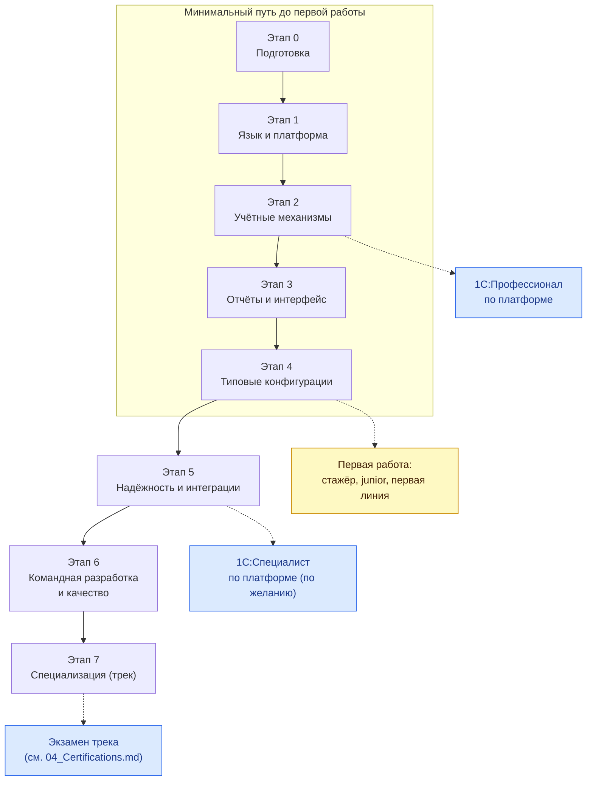

# План обучения по этапам

[← Предыдущий](01_Strategy.md) | [🗺 Оглавление](README.md) | [Следующий →](03_Competencies.md)

> Актуализировано: сентябрь 2026.

Здесь описан путь от установки учебной платформы до выбранной специализации. Он разбит на восемь этапов (0–7). У каждого этапа есть цель, темы с метками важности, практика (проекты P0–P17 из [07_Projects.md](07_Projects.md)), ресурсы, критерии выхода, вопросы для самопроверки и ориентир по времени. Для этапов 0–2 дан план по неделям: на этих этапах новички чаще всего теряют темп.

Легенда: 🔴 обязательно · 🟡 желательно · 🔵 по контексту (нужно в инхаусе, продукте или проекте).

Версии, даты и условия экзаменов сверены на 29.09.2026. Сроки в этом файле — оценка авторов, а не норматив: официальная модель компетенций 1С (MC-6-001, 2025) описывает уровни Junior, Middle и Senior через навыки и сроков не задаёт.

## Содержание

- [Как пользоваться планом](#-как-пользоваться-планом)
- [Карта этапов](#-карта-этапов)
- [Две дорожки: part-time и full-time](#-две-дорожки-part-time-и-full-time)
- [Этап 0. Подготовка](#-этап-0-подготовка)
- [Этап 1. Язык и платформа](#-этап-1-язык-и-платформа)
- [Этап 2. Учётные механизмы](#-этап-2-учётные-механизмы)
- [Этап 3. Отчёты и интерфейс](#-этап-3-отчёты-и-интерфейс)
- [Этап 4. Типовые конфигурации — вход в работу](#-этап-4-типовые-конфигурации--вход-в-работу)
- [Этап 5. Надёжность и интеграции](#-этап-5-надёжность-и-интеграции)
- [Этап 6. Командная разработка и качество](#-этап-6-командная-разработка-и-качество)
- [Этап 7. Специализация](#-этап-7-специализация)
- [Экзамены по ходу пути](#-экзамены-по-ходу-пути)
- [Как подстроить план под себя](#-как-подстроить-план-под-себя)
- [Что исправлено в этой версии](#-что-исправлено-в-этой-версии)
- [Источники](#-источники)

---

## 🧭 Как пользоваться планом

- **Переходите к следующему этапу по критериям выхода, а не по календарю.** Когда выполнены все критерии выхода, двигайтесь дальше. Темы 🟡 можно добирать параллельно со следующим этапом.
- **Практика важнее чтения.** Рабочая пропорция недели (оценка авторов): около 60% времени на код и проекты, 25% на теорию, 15% на повторение и самопроверку.
- **Предметную область и Git ведите с первой недели.** Работодатели дают джунам тестовые задания с проводками и средней себестоимостью, а модель MC-6-001 ждёт от Junior понимания процессов клиента.
- **Минимальный путь до первой работы — этапы 0–4.** Полный роадмап — этапы 0–7 плюс один трек из [tracks/README.md](tracks/README.md).
- **Уже работаете с 1С?** Пройдите критерии выхода сверху вниз и начните с первого этапа, где не выполнен хотя бы один критерий выхода.
- **Самопроверка.** Вопросы в конце каждого этапа — минимум. Полные чек-листы — в [11_Checklists.md](11_Checklists.md), банк вопросов с ответами — в [08_Interview.md](08_Interview.md), матрица навыков по уровням — в [03_Competencies.md](03_Competencies.md).

## 🗺 Карта этапов



## ⏰ Две дорожки: part-time и full-time

Выберите темп, который выдержите полгода и больше. Рывок на 50 часов в неделю, после которого наступает перерыв на месяц, даёт меньше, чем ровные 15 часов.

- **Part-time, 15–20 часов в неделю** — если совмещаете учёбу с работой. Например, три вечера по 2–3 часа и один выходной день на 6–8 часов. В выходной удобно делать проекты: для них нужны длинные непрерывные отрезки.
- **Full-time, 35–40 часов в неделю** — если учитесь полный день. Каждый день пишите код, а раз в неделю устраивайте самопроверку по критериям выхода. Главный риск этой дорожки — проскочить этап, не выполнив проект.

| Этап | Проекты | Метка | Part-time 15–20 ч/нед | Full-time 35–40 ч/нед |
|---|---|---|---|---|
| 0. Подготовка | — | 🔴 | 2–3 недели | 1 неделя |
| 1. Язык и платформа | P0 | 🔴 | 5–7 недель | 3 недели |
| 2. Учётные механизмы (+1С:Профессионал) | P1, P2 | 🔴 | 7–10 недель | 4–5 недель |
| 3. Отчёты и интерфейс | P3, P7 | 🔴 | 5–7 недель | 3 недели |
| 4. Типовые конфигурации — вход в работу | P8, P9 | 🔴 | 7–10 недель | 4–5 недель |
| **Итого до первой работы (этапы 0–4)** | | | **26–37 недель, ≈6–9 месяцев** | **15–17 недель, ≈3,5–4 месяца** |
| 5. Надёжность и интеграции (+1С:Специалист) | P4–P6, P10–P12 | 🔴 (экзамен 🟡) | 10–14 недель | 5–7 недель |
| 6. Командная разработка и качество | P13, P17 (опц.) | 🟡 (в продукте 🔴) | 6–8 недель | 3–4 недели |
| 7. Специализация | P14, P15, P16 (опц.) | 🔵 | 13–17 недель | 7–9 недель |
| **Итого весь путь (этапы 0–7)** | | | **55–76 недель, ≈12–18 месяцев** | **30–37 недель, ≈7–9 месяцев** |

Это оценка авторов. Реальный срок зависит от прошлого опыта, регулярности занятий и объёма практики. Поиск работы можно начинать на этапе 4, не дожидаясь конца плана.

## 🧰 Этап 0. Подготовка

**Цель.** Поставить учебную платформу, понять, из чего состоит 1С:Предприятие, завести репозиторий и разобраться в основах бухучёта.

**Ориентир.** Part-time 2–3 недели · full-time около 1 недели · входит в минимальный путь.

**Темы**
- 🔴 **Учебная версия платформы.** Скачивается бесплатно на [online.1c.ru](https://online.1c.ru/catalog/free/learning.php) после анкеты; описание есть и на [странице УЦ №1](https://uc1.1c.ru/uchebnaya-versiya-1s/). Доступны учебные 8.5.1 и 8.3.27 для Windows, Linux и macOS. Ограничения: только файловый вариант, лимиты на число записей (точные цифры — на странице загрузки), некоммерческое использование. Сайт v8.1c.ru — информационный, дистрибутивы там не скачивают.
- 🟡 **Community-лицензия** на [developer.1c.ru](https://developer.1c.ru) — срочная лицензия для разработчиков, которую нужно периодически обновлять. По вторичным источникам, она не имеет части ограничений учебной версии (например, позволяет задать пароль пользователя), но предназначена для некоммерческого использования: условия читайте в соглашении на developer.1c.ru. Полные дистрибутивы выдаёт releases.1c.ru, и только по подписке ИТС.
- 🔴 **Какую версию ставить.** 8.5 — не новая платформа, а новая нумерация той же самой: 8.5.1 = возможности 8.3.27 + новый интерфейс. Большие типовые (БП, ЗУП, УТ, КА, ERP) в 2026 году работают на 8.3.27. Если книга или курс написаны под 8.3, начните с учебной 8.3.27, а 8.5.1 поставьте второй, чтобы посмотреть новый интерфейс.
- 🔴 **Базовые понятия:** платформа, конфигурация, информационная база, режимы запуска «Конфигуратор» и «1С:Предприятие», файловый и клиент-серверный варианты, тонкий клиент и веб-клиент.
- 🔴 **Конфигуратор:** дерево метаданных, синтакс-помощник, запуск отладки, выгрузка конфигурации в файлы (XML).
- 🔴 **Git:** `init`, `add`, `commit`, `branch`, `push`, файл `.gitignore`. В репозитории храните выгрузку конфигурации в файлы: в `.cf` или `.dt` не видно изменений между версиями.
- 🔴 **Бухучёт для программиста:** счёт, дебет и кредит, двойная запись, проводка, сальдо, оборотно-сальдовая ведомость. Счета 41 «Товары», 51 «Расчётные счета», 60 «Расчёты с поставщиками», 62 «Расчёты с покупателями», 90 «Продажи». Подробнее — [10_Domain_and_Law.md](10_Domain_and_Law.md).
- 🔵 **Linux.** Учебная версия работает и на Linux. Помните, что там важен регистр в именах файлов.

**Практика**
- Создать пустую файловую базу, добавить справочник «Товары» с реквизитом «Артикул», запустить базу в режиме «1С:Предприятие» и ввести три элемента.
- Выгрузить конфигурацию в файлы, создать репозиторий на GitHub, сделать первый коммит и написать README: что это за база и как её открыть.
- На бумаге составить проводки пяти операций: поступление товара от поставщика (Д41 К60), оплата поставщику (Д60 К51), продажа покупателю (Д62 К90.1), списание себестоимости проданного (Д90.2 К41), оплата от покупателя (Д51 К62). Свести их в оборотно-сальдовую ведомость.

**Ресурсы**
- [Учебная версия платформы](https://online.1c.ru/catalog/free/learning.php) и [community-лицензия](https://developer.1c.ru) — официально, бесплатно.
- М.Г. Радченко, «1С:Программирование для начинающих» (2-е изд.), электронная версия — [its.1c.ru/db/pubprogforbeginners](https://its.1c.ru/db/pubprogforbeginners). Книги «1С-Паблишинг» из этого плана есть на ИТС, но большая часть ИТС доступна только по платной подписке; печатные издания продаются отдельно.
- [Схема подготовки программистов УЦ №1](https://uc1.1c.ru/poster/poster-prog/) — официальный постер, для сравнения с этим планом.
- Основы Git — роадмап git-github на [roadmap.sh](https://roadmap.sh).

**Критерии выхода**
- [ ] Учебная платформа установлена, файловая база создана, вы запускаете её в обоих режимах.
- [ ] Конфигурация выгружена в файлы и лежит на GitHub вместе с README.
- [ ] Вы объясняете проводки «оплата поставщику» и «продажа покупателю» и знаете, зачем нужна ОСВ.
- [ ] Вы находите в синтакс-помощнике описание любого метода и его параметров.

**Вопросы для самопроверки**
1. Чем конфигурация отличается от информационной базы?
2. Чем файловый вариант отличается от клиент-серверного и какой из них доступен в учебной версии?
3. Почему 8.5 — не отдельная платформа? На какой версии работают большие типовые в 2026 году?
4. Какой счёт дебетуется при поступлении товара от поставщика и почему?
5. Зачем держать исходники в Git, если есть выгрузка `.dt`?

### 📝 Неделя за неделей: этап 0

| Неделя | Что изучаете | Что делаете | Результат недели |
|---|---|---|---|
| 1 | Платформа, конфигурация, база, режимы запуска; установка Git | Ставите учебную платформу, создаёте базу и справочник «Товары» | База открывается в двух режимах |
| 2 | Синтакс-помощник, отладка, выгрузка в файлы; бухучёт: счета, дебет и кредит, проводки | Первый репозиторий и коммит; пять проводок и ОСВ на бумаге | Репозиторий на GitHub, проводки разобраны |
| 3 (резерв) | Первые главы книги Радченко | Добираете то, что не успели | Все критерии выхода выполнены |

При full-time две недели плана укладываются примерно в одну. Нумерация недель в таблицах этапов 0–2 сквозная и рассчитана на две недели этапа 0: если вы взяли резервную неделю, все следующие недели сдвигаются на одну.

## 🧱 Этап 1. Язык и платформа

**Цель.** Писать на встроенном языке, понимать объекты метаданных и модули, правильно разделять код между клиентом и сервером.

**Ориентир.** Part-time 5–7 недель · full-time 3 недели · входит в минимальный путь.

**Темы**
- 🔴 **Объекты метаданных:** константы, справочники, документы, перечисления, общие модули, роли, подсистемы, формы, команды. Регистры — обзорно, подробно на этапе 2.
- 🔴 **Синтаксис:** примитивные типы, `Неопределено` и `NULL`, условия, циклы, процедуры и функции, передача параметров по значению (`Знач`) и по ссылке, исключения `Попытка … Исключение`.
- 🔴 **Универсальные коллекции:** `Массив`, `Структура`, `Соответствие`, `СписокЗначений`, `ТаблицаЗначений` (с индексами), `ДеревоЗначений`, фиксированные коллекции.
- 🔴 **Модули:** управляемого приложения, сеанса, внешнего соединения, общие модули и их флаги («Клиент», «Сервер», «Вызов сервера», «Привилегированный», «Глобальный», повторное использование возвращаемых значений), модули объекта, менеджера, формы и команды.
- 🔴 **Клиент-серверное взаимодействие.** Директивы `&НаКлиенте`, `&НаСервере`, `&НаСервереБезКонтекста`, `&НаКлиентеНаСервереБезКонтекста`. Контекстный и внеконтекстный вызов ([std 636](https://its.1c.ru/db/v8std/content/636/hdoc)), минимум серверных вызовов ([std 487](https://its.1c.ru/db/v8std/content/487/hdoc)), флаг «Вызов сервера» — только там, где он нужен ([std 679](https://its.1c.ru/db/v8std/content/679/hdoc)). Что можно передать между клиентом и сервером: `ТаблицаЗначений` на клиент не вернуть, вместо неё — `Массив`, `Структура`, `Соответствие` или реквизит формы.
- 🔴 **Управляемые формы:** реквизиты и элементы, команды, события `ПриСозданииНаСервере`, `ПриОткрытии`, `ПриИзменении`; методы формы `РеквизитФормыВЗначение` и `ЗначениеВРеквизитФормы`.
- 🔴 **Немодальный режим.** Свойство конфигурации «Режим использования модальности» есть с 8.3.3, асинхронные `Асинх` и `Ждать` — с 8.3.18. Это не новинка 8.5. Модальные окна не поддерживаются в веб-клиенте, поэтому вместо `Вопрос()` и `Предупреждение()` используйте `ПоказатьВопрос` и `ПоказатьПредупреждение` с `ОписаниеОповещения` или `ВопросАсинх` ([std 703](https://its.1c.ru/db/v8std/content/703/hdoc)).
- 🔴 **Алгоритмы.** Уже от Junior модель MC-6-001 ждёт, что вы объясните базовые алгоритмы поиска и сортировки и оцените сложность простого алгоритма. На собеседованиях дают задачи на коллекциях без готовых функций.
- 🟡 **Интерфейс 8.5** на учебной 8.5.1: новый визуальный стиль, векторные картинки, тёмная тема, стандартный и компактный масштаб, переходные режимы «Такси. Разрешить Версия 8.5» и «Версия 8.5. Разрешить Такси».
- 🟡 **Оформление кода:** тексты модулей ([std 456](https://its.1c.ru/db/v8std/content/456/hdoc)), имена ([std 647](https://its.1c.ru/db/v8std/content/647/hdoc)), параметры ([std 640](https://its.1c.ru/db/v8std/content/640/hdoc)), тексты интерфейса через `НСтр` ([std 761](https://its.1c.ru/db/v8std/content/761/hdoc)).
- 🔵 **Обычное приложение и обычные формы** — встречаются в старых базах и редактируются только в Конфигураторе.

**Практика**
- **P0 «Разминка на коллекциях»** — шесть задач с проверкой граничных случаев (пустая коллекция, нули, ведущие нули). Условия — в [07_Projects.md](07_Projects.md).
- Форма документа: команда на клиенте спрашивает подтверждение без модального окна и один раз вызывает сервер без контекста. Образец для сверки:

```bsl
&НаКлиенте
Асинх Процедура ЗаполнитьНоменклатуру(Команда)
    Ответ = Ждать ВопросАсинх(НСтр("ru = 'Заменить номенклатуру?'"), РежимДиалогаВопрос.ДаНет);
    Если Ответ <> КодВозвратаДиалога.Да Тогда
        Возврат;
    КонецЕсли;
    НайденныйТовар = НоменклатураПоНаименованию(СтрокаПоиска); // СтрокаПоиска — реквизит формы
    Если ЗначениеЗаполнено(НайденныйТовар) Тогда
        Объект.Номенклатура = НайденныйТовар;
    Иначе
        ПоказатьПредупреждение(, НСтр("ru = 'Номенклатура не найдена'"));
    КонецЕсли;
КонецПроцедуры

&НаСервереБезКонтекста
Функция НоменклатураПоНаименованию(Знач Наименование)
    Возврат Справочники.Номенклатура.НайтиПоНаименованию(Наименование, Истина);
КонецФункции
```

Напишите тот же диалог и через `ПоказатьВопрос` с `ОписаниеОповещения`: процедура-обработчик ответа должна быть экспортной. Поиск по наименованию неоднозначен: в рабочем коде ищут по коду или берут ссылку из выбора пользователя. Здесь он нужен только для иллюстрации вызова.

**Ресурсы**
- М.Г. Радченко, Е.Ю. Хрусталева, «1С:Предприятие 8.3. Практическое пособие разработчика. Примеры и типовые приемы» (3-е изд., 2023), на ИТС — [its.1c.ru/db/pubdevguide83](https://its.1c.ru/db/pubdevguide83).
- [Немодальный режим работы](https://its.1c.ru/docs/v8nonmodal/) — методическая статья на ИТС.
- Бесплатное видео IRONSKILLS «Азы программирования в 1С за 3 часа» — канал [@ironskills-1c](https://www.youtube.com/@ironskills-1c).
- Бесплатный курс «1С с нуля. Первые шаги в программировании» на [Stepik](https://stepik.org/course/279107).
- Домашние задания курса Нетологии «1С-разработчик» — [netology-code/1c-homeworks](https://github.com/netology-code/1c-homeworks), открыты на GitHub.

**Критерии выхода**
- [ ] Решены все шесть задач P0, к каждой есть проверки граничных случаев.
- [ ] Вы объясняете разницу между четырьмя директивами компиляции и знаете, когда вызов сервера контекстный.
- [ ] Вы пишете диалог через `ПоказатьВопрос` с экспортной процедурой-обработчиком и через `Асинх`/`Ждать`.
- [ ] В вашей конфигурации включён режим модальности «Не использовать», и синтаксический контроль проходит без ошибок.

**Вопросы для самопроверки**
1. Что передаётся на сервер при вызове `&НаСервере` из клиентской процедуры формы и почему `&НаСервереБезКонтекста` дешевле?
2. Какие флаги бывают у общего модуля? Почему «Вызов сервера» ставят только при необходимости?
3. Как удалить элементы массива в цикле, не создавая новый массив?
4. Чем `Структура` отличается от `Соответствия`? Когда нужна `ТаблицаЗначений` с индексом?
5. С какой версии есть немодальный режим и почему `Вопрос()` нельзя вызывать в веб-клиенте?
6. Чем ссылка отличается от объекта? Что происходит при обращении к реквизиту ссылки через точку?

### 📝 Неделя за неделей: этап 1

| Неделя | Что изучаете | Что делаете | Результат недели |
|---|---|---|---|
| 3 | Типы, переменные, условия, циклы, процедуры и функции | P0: задачи 1–2 (удаление элементов из массива и из других коллекций) | Первые задачи в репозитории |
| 4 | Универсальные коллекции, индексы таблицы значений | P0: задачи 3–4 (распределение суммы без потери копеек, сравнение версий) | Можете выбрать коллекцию под задачу |
| 5 | Объекты метаданных, виды модулей, общие модули и их флаги | P0: задачи 5–6 (число прописью, «змейка») | P0 закрыт |
| 6 | Управляемые формы: реквизиты, элементы, команды, события | Форма документа учебной конфигурации: реквизиты, команды, обработчики событий | Форма работает в тонком и веб-клиенте |
| 7 | Клиент-сервер: директивы, передача параметров; немодальность, `ОписаниеОповещения`, `Асинх`/`Ждать` | Переделываете форму: один серверный вызов, диалоги без модальности | Образец выше написан самостоятельно |
| 8 | Отладка, замер производительности, стандарты оформления | Прогоняете свой код по стандартам 456, 640, 647; повторение | Критерии выхода выполнены |

## 📦 Этап 2. Учётные механизмы

**Цель.** Проектировать справочники, документы и регистры, проводить документы с контролем остатков, писать запросы без типовых ошибок. В конце этапа — экзамен 1С:Профессионал по платформе.

**Ориентир.** Part-time 7–10 недель, включая 1–2 недели подготовки к экзамену · full-time 4–5 недель · входит в минимальный путь.

**Темы**
- 🔴 **Справочники:** иерархия, подчинение владельцу, предопределённые элементы, табличные части. **Документы:** нумерация, проведение, события `ОбработкаПроведения`, `ОбработкаЗаполнения`, `ОбработкаПроверкиЗаполнения`, ввод на основании.
- 🔴 **Регистры накопления:** остатки и обороты, измерения, ресурсы, реквизиты, регистратор, движения. Виртуальные таблицы `Остатки`, `Обороты`, `ОстаткиИОбороты`. По модели MC-6-001 Junior знает, какие изменения структуры регистров считаются грубейшими ошибками.
- 🔴 **Регистры сведений:** периодические и непериодические, подчинённые регистратору; срез последних и срез первых. Типовые данные — цены, курсы, статусы клиентов.
- 🔴 **Назначение регистров бухгалтерии и расчёта.** По модели MC-6-001 Junior понимает, зачем нужны все три вида учётных регистров. Глубоко эти регистры разбираются на этапе 5.
- 🔴 **Язык запросов:** выборка полей с псевдонимами ([std 437](https://its.1c.ru/db/v8std/content/437/hdoc)), соединения, группировки и агрегатные функции, `ИМЕЮЩИЕ`, `ИТОГИ`, объединения, вложенные запросы, временные таблицы ([std 777](https://its.1c.ru/db/v8std/content/777/hdoc)), пакетные запросы, конструктор и консоль запросов.
- 🔴 **Три правила запросов:** не выполнять запросы в цикле ([std 436](https://its.1c.ru/db/v8std/content/436/hdoc)); условия на измерения передавать в параметры виртуальной таблицы, а не в `ГДЕ` ([std 657](https://its.1c.ru/db/v8std/content/657/hdoc)); значения передавать параметрами, а не склеивать с текстом запроса.
- 🔴 **Контроль остатков при проведении.** Движения записываются с `БлокироватьДляИзменения = Истина`, затем запросом ищутся отрицательные остатки; при их наличии проведение отменяют ([std 661](https://its.1c.ru/db/v8std/content/661/hdoc)). Явная запись движений в `ОбработкаПроведения` — исключение из [std 450](https://its.1c.ru/db/v8std/content/450/hdoc): оно допустимо, когда данные регистров нужны дальше в этой же процедуре. Конфигурация должна работать в управляемом режиме блокировки ([std 460](https://its.1c.ru/db/v8std/content/460/hdoc)). Старую методику, когда остатки читают под явной управляемой блокировкой до записи движений, тоже нужно знать: о ней спрашивают на собеседованиях.
- 🔴 **Момент времени и граница:** остаток на момент документа, `Новый Граница(МоментВремени(), ВидГраницы.Включая)`.
- 🟡 **Разыменование полей составного типа** ([std 654](https://its.1c.ru/db/v8std/content/654/hdoc)), порядок записи движений ([std 450](https://its.1c.ru/db/v8std/content/450/hdoc)), требования к проведению ([std 603](https://its.1c.ru/db/v8std/content/603/hdoc)).
- 🟡 **Перепроведение задним числом** — что меняется в остатках и как это проверить.

**Практика**
- **P1 «Справочники „Управление ИТ-фирмой“»** — метаданные, формы, проверки ИНН и КПП, пользователи с разными ролями.
- **P2 «Склад: приход, расход, остатки»** — проведение с контролем остатков и управляемыми блокировками, простой отчёт на СКД.
- Образец проведения расходного документа по [std 661](https://its.1c.ru/db/v8std/content/661/hdoc) (документ «РасходТовара» со складом в шапке и табличной частью «Товары», регистр накопления «ОстаткиТоваров» с измерениями «Номенклатура» и «Склад»):

```bsl
Процедура ОбработкаПроведения(Отказ, РежимПроведения)

    // 1. Движения по табличной части; записываем их с блокировкой изменяемых остатков
    Движения.ОстаткиТоваров.Записывать = Истина;
    Для Каждого СтрокаТоваров Из Товары Цикл
        Движение = Движения.ОстаткиТоваров.ДобавитьРасход();
        Движение.Период = Дата;
        Движение.Номенклатура = СтрокаТоваров.Номенклатура;
        Движение.Склад = Склад;
        Движение.Количество = СтрокаТоваров.Количество;
    КонецЦикла;
    Движения.ОстаткиТоваров.БлокироватьДляИзменения = Истина;
    Движения.Записать();

    // 2. Одним запросом ищем позиции, ушедшие в минус
    Запрос = Новый Запрос;
    Запрос.Текст =
        "ВЫБРАТЬ
        |    Остатки.Номенклатура КАК Номенклатура,
        |    Остатки.КоличествоОстаток КАК КоличествоОстаток
        |ИЗ
        |    РегистрНакопления.ОстаткиТоваров.Остатки(
        |            &МоментВремени,
        |            Склад = &Склад
        |                И Номенклатура В (&Номенклатура)) КАК Остатки
        |ГДЕ
        |    Остатки.КоличествоОстаток < 0";
    Запрос.УстановитьПараметр("МоментВремени", Новый Граница(МоментВремени(), ВидГраницы.Включая));
    Запрос.УстановитьПараметр("Склад", Склад);
    Запрос.УстановитьПараметр("Номенклатура", Товары.ВыгрузитьКолонку("Номенклатура"));
    ВыборкаНехватки = Запрос.Выполнить().Выбрать();

    Пока ВыборкаНехватки.Следующий() Цикл
        Отказ = Истина;
        Сообщение = Новый СообщениеПользователю;
        Сообщение.Текст = СтрШаблон(НСтр("ru = 'Не хватает %1 ед. товара «%2»'"),
            -ВыборкаНехватки.КоличествоОстаток, ВыборкаНехватки.Номенклатура);
        Сообщение.Сообщить();
    КонецЦикла;

КонецПроцедуры
```

Обратите внимание: условие на ресурс (`КоличествоОстаток < 0`) стоит в `ГДЕ`, а условия на измерения — в параметрах виртуальной таблицы, причём простые, без подзапросов и соединений ([std 657](https://its.1c.ru/db/v8std/content/657/hdoc)): список номенклатуры передан массивом. Если выставить `Отказ = Истина`, транзакция проведения отменяется вместе с записанными движениями. Регистр должен быть создан с включённым разделением итогов; порядок записи нескольких регистров должен быть одинаковым во всех документах ([std 661](https://its.1c.ru/db/v8std/content/661/hdoc)).

**Ресурсы**
- Е.Ю. Хрусталева, «Язык запросов „1С:Предприятия 8“» (3-е изд.), на ИТС — [its.1c.ru/db/pubqlang](https://its.1c.ru/db/pubqlang).
- Практическое пособие разработчика Радченко и Хрусталевой — главы о регистрах, запросах и оптимизации проведения.
- Бесплатное видео IRONSKILLS «Запросы в 1С за 3 часа» — канал [@ironskills-1c](https://www.youtube.com/@ironskills-1c).
- Стандарты [436](https://its.1c.ru/db/v8std/content/436/hdoc) (запросы в цикле), [657](https://its.1c.ru/db/v8std/content/657/hdoc) и [733](https://its.1c.ru/db/v8std/content/733/hdoc) (виртуальные таблицы), [661](https://its.1c.ru/db/v8std/content/661/hdoc) (контроль остатков).
- Подготовка к экзамену — раздел [«Экзамены по ходу пути»](#-экзамены-по-ходу-пути) ниже.

**Критерии выхода**
- [ ] P1 и P2 сделаны по критериям приёмки из [07_Projects.md](07_Projects.md).
- [ ] Расходный документ не проводится при нехватке и сообщает, сколько не хватает. Два сеанса, одновременно проводящие документы по одному товару, не уводят остаток в минус.
- [ ] В коде нет запросов в цикле, условия на измерения стоят в параметрах виртуальных таблиц.
- [ ] Сдан 1С:Профессионал по платформе. Если экзамен пока недоступен — в учебном тестировании стабильно 13–14 верных ответов из 14.

**Вопросы для самопроверки**
1. Чем регистр накопления остатков отличается от оборотного? Какие виртуальные таблицы есть у каждого?
2. Почему условие на измерения передают в параметры виртуальной таблицы, а не в `ГДЕ`?
3. Что возвращает срез последних и на какую дату его берут, чтобы подставить цену в документ?
4. Как два пользователя уводят остаток в минус и как этому мешает блокирующее чтение?
5. Чем левое соединение отличается от внутреннего? Когда нужна функция `ЕСТЬNULL`?
6. Зачем нужны временные таблицы и пакетный запрос?
7. Для каких задач предназначены регистры бухгалтерии и регистры расчёта?

### 📝 Неделя за неделей: этап 2

| Неделя | Что изучаете | Что делаете | Результат недели |
|---|---|---|---|
| 9 | Справочники: иерархия, владельцы, табличные части, предопределённые элементы; перечисления | P1: контрагенты, ИНН и КПП, полное наименование | Справочники P1 готовы |
| 10 | Документы, события записи, проверка заполнения, роли | P1: проверки при записи и вводе, пользователи «Администратор» и «Менеджер» | P1 закрыт |
| 11 | Регистры накопления, движения, проведение | P2: документ «Поступление» и регистр остатков | Приход пишет движения |
| 12 | Язык запросов: выборка, соединения, группировки, итоги; консоль запросов | 10–15 запросов к своей базе: остатки, обороты, продажи по контрагентам | Запросы без ошибок и с псевдонимами |
| 13 | Виртуальные таблицы и их параметры, временные таблицы, пакеты; регистры сведений и срез последних | Переписываете запросы по std 657; добавляете регистр цен | Нет условий на измерения в `ГДЕ` |
| 14 | Контроль остатков по std 661, управляемые блокировки, граница и момент времени | P2: расходный документ с контролем остатков (образец выше) | Проверка двумя сеансами пройдена |
| 15 | СКД на уровне конструктора; обзор регистров бухгалтерии и расчёта | P2: отчёт «Остатки и обороты по складам», README и скриншоты | P2 закрыт |
| 16 | Подготовка к 1С:Профессионалу: учебное тестирование | Прогоны теста, разбор каждой ошибки по документации | 13–14 из 14 в учебном тесте |
| 17 (резерв) | Слабые темы по итогам тестов | Сдача экзамена или ещё неделя подготовки | Критерии выхода выполнены |

## 📊 Этап 3. Отчёты и интерфейс

**Цель.** Строить отчёты на СКД, делать печатные формы, внешние отчёты и обработки, настраивать права пользователей.

**Ориентир.** Part-time 5–7 недель · full-time 3 недели · входит в минимальный путь.

**Темы**
- 🔴 **СКД:** схема, наборы данных (запрос, объект, объединение), связи наборов, поля, ресурсы, параметры, отборы, группировки, вычисляемые поля, условное оформление, пользовательские настройки и варианты, язык выражений СКД. По модели MC-6-001 Junior настраивает отчёты типовой без программирования.
- 🟡 **СКД программно.** Цепочка объектов: `СхемаКомпоновкиДанных` → `КомпоновщикНастроекКомпоновкиДанных` → `КомпоновщикМакетаКомпоновкиДанных` → `ПроцессорКомпоновкиДанных` → `ПроцессорВыводаРезультатаКомпоновкиДанныхВТабличныйДокумент`. По модели это уровень Middle, но знать цепочку полезно раньше.
- 🔴 **Печатные формы:** макет, области, параметры областей, `ТабличныйДокумент`, `ПолучитьОбласть` и `Вывести`; сортировка строк без изменения данных объекта.
- 🔴 **Внешние отчёты и обработки** (`.erf`, `.epf`). В типовых их подключают через подсистему БСП «Дополнительные отчеты и обработки» и запускают в безопасном режиме.
- 🔴 **Права:** роли, права на объекты, пользователи, функциональные опции. RLS на этом этапе — на уровне «зачем нужно»: права зависят от данных.
- 🟡 **Динамические списки**, условное оформление в списках, командный интерфейс и подсистемы.
- 🟡 **Ставки налогов храните как данные**, а не как числа в коде. Основная ставка НДС с 01.01.2026 — 22% (Федеральный закон № 425-ФЗ); актуальную редакцию проверяйте на consultant.ru или nalog.gov.ru.
- 🔵 **Дашборды 1С:Аналитики** — нужны в компаниях, которые её используют.

**Практика**
- **P3 «Цены, скидки, продажи, печатная форма»** — периодический регистр цен, пересчёт суммы и НДС, печатная форма с сортировкой строк по выбору пользователя.
- **P7 «Внешняя печатная форма и отчёт для типовой»** — нужна типовая конфигурация: подойдёт [учебная версия «1С:Бухгалтерии 8»](https://v8.1c.ru/podderzhka-i-obuchenie/uchebnye-versii/1s-bukhgalteriya-8-uchebnaya-versiya/) или демо-база, если на курсе или на работе есть доступ к ИТС. Если P7 не успеваете, перенесите его на начало этапа 4.
- Выведите отчёт СКД в табличный документ программно, по цепочке объектов из раздела «Темы», и сравните результат с выводом через форму отчёта.

**Ресурсы**
- Е.Ю. Хрусталева, «Разработка сложных отчетов в 1С:Предприятии 8. Система компоновки данных» (2-е изд.), на ИТС — [its.1c.ru/db/pubcomplexreports](https://its.1c.ru/db/pubcomplexreports).
- М.Г. Радченко, В.А. Ажеронок, «Разработка интерфейса прикладных решений на платформе „1С:Предприятие 8“».
- YouTube-канал «Жёлтый чайник 1С» — [@JuniorOneS](https://www.youtube.com/@JuniorOneS): СКД и малоизвестные возможности платформы.

**Критерии выхода**
- [ ] P3 и P7 сделаны; внешняя печатная форма появляется в подменю «Печать» нужного документа типовой.
- [ ] Отчёт на СКД с параметром, отбором, вычисляемым полем и условным оформлением собран без единой строки кода.
- [ ] Вы выводите отчёт СКД программно и объясняете, за что отвечает каждый объект цепочки.
- [ ] Пользователь с ролью «Менеджер» не видит объекты, на которые у него нет прав.

**Вопросы для самопроверки**
1. Из каких частей состоит СКД: схема, настройки, макет компоновки, результат? Что происходит на каждом шаге?
2. Чем ресурс отличается от поля группировки? Как посчитать рентабельность в итоговой строке?
3. Чем связь наборов данных в СКД отличается от соединения в запросе?
4. Зачем внешнюю обработку подключают через «Дополнительные отчеты и обработки» и что даёт безопасный режим?
5. Чем роль отличается от функциональной опции?

## 💼 Этап 4. Типовые конфигурации — вход в работу

**Цель.** Понять устройство типовых конфигураций, дорабатывать их так, чтобы не ломались обновления, подготовить резюме и портфолио.

**Ориентир.** Part-time 7–10 недель · full-time 4–5 недель · последний этап минимального пути.

**Темы**
- 🔴 **Типовые на уровне пользователя:** «1С:Бухгалтерия предприятия» 3.0 — учёт и регламентированная отчётность; «1С:Управление торговлей» 11.5 — торговля и склад. УТ 11.5, КА 2.5 и ERP 2.5 — одна кодовая база, поэтому изучение УТ даёт задел для ERP.
- 🔴 **Ландшафт 2026.** Большие типовые (БП, ЗУП, УТ, КА, ERP, УХ, ДО) работают на 8.3.27. На 8.5 перешли УНФ и «Розница», начиная с 3.0.13. Официального плана перевода остальных нет.
- 🔴 **Режимы работы и поставки:** файловый и клиент-серверный, облачный и локальный; базовые, ПРОФ и КОРП версии. Вопросы лицензирования — на уровне «что спросит клиент».
- 🔴 **БСП.** Две редакции, обе обновлены 23–24.09.2026: 3.1.12 для 8.3.24–8.3.27 и 3.2.1 только для 8.5.1; функционально они почти одинаковы. Ключевые подсистемы: базовая функциональность, пользователи, печать, варианты отчётов, дополнительные отчёты и обработки, управление доступом, длительные операции. Поведение БСП настраивают через общие модули `*Переопределяемый` (в БСП 3.2.1 их 78), а в расширении — обработчиками `&После` к их процедурам. Подписки на события — объект платформы, а не механизм переопределения БСП.
- 🔴 **Порядок доработки типовой:** настройки и функциональные опции → дополнительные отчёты и обработки БСП → расширение → изменение основной конфигурации с сохранением поддержки, если расширение не справляется.
- 🔴 **Расширения.** Назначение («Исправление», «Адаптация», «Дополнение»), заимствование объектов, префикс имён расширения (например, `Расш1_`) для собственных методов и объектов, собственные роли. Аннотации `&Перед`, `&После`, `&Вместо` и `&ИзменениеИКонтроль` (с 8.3.16, с директивами `#Вставка` и `#Удаление`). `&Вместо` с `ПродолжитьВызов` применяют, только когда другие способы не подходят. Официальные исправления 1С тоже поставляются расширениями с назначением «Исправление».
- 🔴 **Обновление доработанной конфигурации:** резервная копия, конфигурация поставщика и конфигурация базы данных, правила поддержки, сравнение и объединение на копии, проверка применимости расширений. Обновление большой базы может идти часами.
- 🟡 **Хранилище конфигурации:** захват, помещение, сравнение, история. У франчайзи это часто 🔴.
- 🟡 **Обмены между типовыми** (синхронизация данных, выгрузка и загрузка XML) и **загрузка данных из Excel**.
- 🟡 **Законодательство в типовых.** Типовые решения обновляются под изменения законов, поэтому программист должен понимать, откуда берётся требование. Для ориентира: основная ставка НДС с 01.01.2026 — 22% (Федеральный закон № 425-ФЗ от 28.11.2025); для упрощенцев порог освобождения от НДС изменён Федеральным законом № 228-ФЗ от 04.07.2026; электронные перевозочные документы обязательны с 01.09.2026 (140-ФЗ). Календарь изменений и разбор — в [10_Domain_and_Law.md](10_Domain_and_Law.md); актуальную редакцию проверяйте на consultant.ru или nalog.gov.ru.
- 🟡 **1C:EDT** — представление о среде: что это, чем отличается от Конфигуратора. Работа в EDT — этап 6.
- 🔵 **Работа у франчайзи:** маркировка по инструкции, подключение оборудования через БПО (библиотеку подключаемого оборудования), сервисы ИТС («1С-Отчетность», «1С-ЭДО»). Подробности — [tracks/developer-franchise.md](tracks/developer-franchise.md).

**Практика**
- **P8 «Расширение типовой»** — новый реквизит в документе и на форме, проверка при проведении, обновление демо-базы на следующий релиз с проверкой применимости расширения.
- **P9 «Загрузка из Excel/CSV с поиском дублей»** — выбор файла на клиенте, передача на сервер через временное хранилище, поиск дублей одним запросом.
- Образец обработчика в расширении: реквизит расширения становится обязательным, типовой код не меняется.

```bsl
// Расширение «Расш1», назначение «Адаптация».
// Модуль объекта заимствованного документа «РеализацияТоваровУслуг»;
// реквизит «Расш1_ОснованиеОтгрузки» добавлен в этот документ в расширении.
&Перед("ОбработкаПроверкиЗаполнения")
Процедура Расш1_ОбработкаПроверкиЗаполнения(Отказ, ПроверяемыеРеквизиты)
    ПроверяемыеРеквизиты.Добавить("Расш1_ОснованиеОтгрузки");
КонецПроцедуры
```

- Резюме, портфолио на GitHub и первые отклики — по [13_Career.md](13_Career.md). Вакансий «без опыта» немного, поэтому рассматривайте стажировки, первую линию поддержки и франчайзи в своём городе.

**Ресурсы**
- Е.Ю. Хрусталева, «Расширения конфигураций», на ИТС — [its.1c.ru/db/pubextensions](https://its.1c.ru/db/pubextensions).
- Документация БСП на ИТС — [its.1c.ru/db/bsp321doc](https://its.1c.ru/db/bsp321doc); исходники БСП без подписки — зеркала [1c-syntax/ssl_3_1](https://github.com/1c-syntax/ssl_3_1) и [1c-syntax/ssl_3_2](https://github.com/1c-syntax/ssl_3_2).
- Официальные проверки стандартов для EDT, в том числе правила для расширений, — [1C-Company/v8-code-style](https://github.com/1C-Company/v8-code-style).
- Как устроен трек у франчайзи — [tracks/developer-franchise.md](tracks/developer-franchise.md).

**Критерии выхода**
- [ ] P8 и P9 сделаны; расширение переживает обновление демо-базы, а вы можете объяснить, что проверили после обновления.
- [ ] Вы обновили доработанную учебную конфигурацию через сравнение и объединение на копии, предварительно сделав резервную копию.
- [ ] Вы объясняете порядок доработки типовой и можете назвать случаи, когда меняют основную конфигурацию.
- [ ] Резюме и портфолио готовы, отправлены первые отклики.

**Вопросы для самопроверки**
1. Чем отличаются `&Перед`, `&После`, `&Вместо` и `&ИзменениеИКонтроль`? Почему `&Вместо` — крайний случай?
2. Как изменить поведение подсистемы БСП, не трогая её код?
3. Что такое конфигурация поставщика и правила поддержки?
4. Что проверить в расширении после обновления типовой?
5. Какую редакцию БСП встраивать в конфигурацию на 8.3.27, а какую — на 8.5.1?
6. Как подключить внешнюю печатную форму к документу типовой?

## 🌐 Этап 5. Надёжность и интеграции

**Цель.** Писать надёжный серверный код (транзакции, блокировки, фоновые задания), освоить регистры бухгалтерии и расчёта и научиться связывать 1С с другими системами. По желанию — сдать 1С:Специалиста.

**Ориентир.** Part-time 10–14 недель, из них 3–4 недели на подготовку к 1С:Специалисту, если решили сдавать · full-time 5–7 недель.

**Темы**
- 🔴 **Транзакции** по [std 783](https://its.1c.ru/db/v8std/content/783/hdoc): начало и фиксацию выполняют в одном методе; `НачатьТранзакцию` стоит прямо перед `Попытка`, `ЗафиксироватьТранзакцию` — последней строкой в `Попытка`, `ОтменитьТранзакцию` — первой строкой в `Исключение`, затем запись в журнал регистрации и `ВызватьИсключение` в конце блока. Вложенных транзакций платформа не поддерживает. Исключение не отменяет транзакцию сразу, а запрещает её успешное завершение; отсюда ошибка «В этой транзакции уже происходили ошибки».
- 🔴 **Управляемые блокировки:** `БлокировкаДанных`, разделяемый и исключительный режимы, единый порядок блокировок против взаимоблокировок, избыточные блокировки ([std 659](https://its.1c.ru/db/v8std/content/659/hdoc)).
- 🔴 **Регистры бухгалтерии:** план счетов, субконто через план видов характеристик, проводки, виртуальные таблицы, оборотно-сальдовая ведомость.
- 🔴 **Регистры расчёта:** план видов расчёта, вытеснение, базовый период, период действия, виртуальные таблицы.
- 🔴 **Себестоимость:** средняя по складу и по компании. По ФСБУ 5/2019 запасы при выбытии оценивают по себестоимости каждой единицы, по средней себестоимости или по ФИФО. ЛИФО не было уже в ПБУ 5/01.
- 🔴 **Фоновые и регламентные задания.** Серверный вызов, который может идти дольше 8 секунд, выполняют в фоне ([std 642](https://its.1c.ru/db/v8std/content/642/hdoc)). `ФоновыеЗадания.Выполнить` вызывает экспортный метод неглобального серверного общего модуля; результат функции не возвращается, его кладут во временное хранилище. В конфигурациях на БСП используют `ДлительныеОперации` и `ДлительныеОперацииКлиент.ОжидатьЗавершение`.
- 🔴 **HTTP-клиент:** `HTTPСоединение` + `HTTPЗапрос` → `HTTPОтвет`, таймаут обязателен ([std 748](https://its.1c.ru/db/v8std/content/748/hdoc)), `ЗащищенноеСоединениеOpenSSL`, коды ответа, повторные попытки. На клиенте запрос выполняют асинхронно (`ВызватьHTTPМетодАсинх`). Типа `ОбъектHTTPЗапроса` в платформе нет.
- 🔴 **HTTP-сервисы (REST):** шаблоны URL, `HTTPСервисЗапрос` и `HTTPСервисОтвет`, коды 2xx/4xx/5xx, публикация на веб-сервере.
- 🔴 **JSON и XML:** `ЧтениеJSON`, `ЗаписьJSON`, `ПрочитатьJSON`, `ЗаписатьJSON`, `СериализаторXDTO`; пакеты XDTO для строгого XML.
- 🔴 **Обмены:** планы обмена, регистрация изменений, флаг `ОбменДанными.Загрузка`: при загрузке данных обмена он равен `Истина`, а обработчики `ПередЗаписью` и `ПриЗаписи` проверяют его первым действием и пропускают бизнес-логику ([std 464](https://its.1c.ru/db/v8std/content/464/hdoc)).
- 🟡 **EnterpriseData и 1С:Конвертация данных 3** — правила обмена между типовыми; **OData** (`УстановитьСоставСтандартногоИнтерфейсаOData`); **SOAP**: WS-ссылки и собственные веб-сервисы.
- 🟡 **Бизнес-процессы и задачи:** карта маршрута, точки, ролевая адресация. Для экзамена 1С:Специалист это 🔴.
- 🟡 **Безопасность:** привилегированный режим — только обоснованно ([std 485](https://its.1c.ru/db/v8std/content/485/hdoc)), `РАЗРЕШЕННЫЕ` не используют в запросах для расчётов и проведения ([std 415](https://its.1c.ru/db/v8std/content/415/hdoc)), пароли и токены — в безопасном хранилище БСП, а не в коде. Подробно — [SECURITY.md](SECURITY.md).
- 🟡 **Уведомления клиента** (`УведомленияКлиента`, с 8.3.26) — доставка сообщения с сервера в сеанс пользователя.
- 🔵 **WebSocket-клиент** (с 8.3.27), **1С:Шина** через «Сервисы интеграции» (8.3.17+, AMQP 1.0). Kafka и RabbitMQ в платформу 8 не встроены, их подключают через внешние компоненты, HTTP-шлюз или 1С:Шину. Это темы трека [tracks/integration.md](tracks/integration.md).
- 🔵 **Клиент-серверный вариант, Linux и PostgreSQL** в сборке для 1С — темы трека [tracks/administrator-operator.md](tracks/administrator-operator.md).
- 🔵 **Основы производительности:** замер времени выполнения, технологический журнал, план запроса, разбор блокировок — тема трека [tracks/performance-expert.md](tracks/performance-expert.md) и проекта P14.

**Практика**
- **P4** «Взаиморасчёты и история статусов клиента», **P5** «Себестоимость и рентабельность», **P6** «Бухучёт на плане счетов» (проводки Д41 К60, Д62 К90.1, Д90.2 К41, Д50 К62; решение параллельно на регистре накопления и регистре бухгалтерии).
- **P10** «REST HTTP-сервис каталога», **P11** «Клиент внешнего API с регламентным заданием», **P12** «Обмен между двумя базами».
- Мини-задача на регистр расчёта: начисления «Оклад» и «Больничный», больничный вытесняет оклад, премия считается от базы за прошлый месяц.
- Образец для P11: загрузка курсов с таймаутом и повторным запуском без дублей (регистр сведений «КурсыВалют» с измерением «КодВалюты» и ресурсом «Курс»):

```bsl
// Общий модуль «КурсыВалютСервер» (Сервер = Истина). Вызывается из регламентного задания.
Процедура ЗагрузитьКурсы(Знач ДатаКурса) Экспорт

    Соединение = Новый HTTPСоединение("api.example.com", , , , , 30, Новый ЗащищенноеСоединениеOpenSSL);
    Запрос = Новый HTTPЗапрос("/rates?date=" + Формат(ДатаКурса, "ДФ=yyyy-MM-dd"));
    Ответ = Соединение.Получить(Запрос);
    Если Ответ.КодСостояния <> 200 Тогда
        ВызватьИсключение СтрШаблон(НСтр("ru = 'Сервис курсов вернул код %1'"), Ответ.КодСостояния);
    КонецЕсли;

    ЧтениеJSON = Новый ЧтениеJSON;
    ЧтениеJSON.УстановитьСтроку(Ответ.ПолучитьТелоКакСтроку());
    Данные = ПрочитатьJSON(ЧтениеJSON, Истина); // Соответствие
    ЧтениеJSON.Закрыть();

    // Набор с отбором по дате: повторная загрузка за ту же дату заменяет записи, а не дублирует их
    Набор = РегистрыСведений.КурсыВалют.СоздатьНаборЗаписей();
    Набор.Отбор.Период.Установить(ДатаКурса);
    Для Каждого Элемент Из Данные.Получить("rates") Цикл
        Запись = Набор.Добавить();
        Запись.Период = ДатаКурса;
        Запись.КодВалюты = Элемент.Получить("code");
        Запись.Курс = Элемент.Получить("rate");
    КонецЦикла;
    Набор.Записать();

КонецПроцедуры
```

Адрес `api.example.com` условный. Ошибка сети или таймаут вызовет исключение; платформа запишет его в журнал регистрации как ошибку регламентного задания.

**Ресурсы**
- Стандарты [783](https://its.1c.ru/db/v8std/content/783/hdoc), [460](https://its.1c.ru/db/v8std/content/460/hdoc), [642](https://its.1c.ru/db/v8std/content/642/hdoc), [748](https://its.1c.ru/db/v8std/content/748/hdoc).
- Е.Ю. Хрусталева, «Технологии интеграции „1С:Предприятия 8.3“».
- Документация 1С:Конвертации данных 3 — [its.1c.ru/db/metod8dev/content/5846/hdoc](https://its.1c.ru/db/metod8dev/content/5846/hdoc).
- Библиотеки сообщества: HTTP-клиент [«Коннектор»](https://github.com/vbondarevsky/Connector), описание HTTP-сервисов в OpenAPI — [swagger-1c](https://github.com/zerobig/swagger-1c).
- Бесплатное видео IRONSKILLS «HTTP в 1С за 3 часа» — канал [@ironskills-1c](https://www.youtube.com/@ironskills-1c).

**Критерии выхода**
- [ ] P4–P6 и P10–P12 сделаны по критериям приёмки из [07_Projects.md](07_Projects.md).
- [ ] Транзакции в вашем коде написаны по шаблону std 783; параллельное проведение двух документов не приводит к взаимоблокировке (проверено двумя сеансами).
- [ ] HTTP-сервис P10 отвечает 400 на неверные параметры и 404 на несуществующий объект, описан в OpenAPI и проверен из Postman или другого HTTP-клиента.
- [ ] Повторная загрузка P11 за ту же дату не создаёт дублей, у всех внешних вызовов задан таймаут.
- [ ] Вы отвечаете на вопросы уровня Middle по транзакциям, блокировкам и интеграциям из [08_Interview.md](08_Interview.md).
- [ ] По желанию: сдан 1С:Специалист по платформе.

**Вопросы для самопроверки**
1. Почему исключение внутри транзакции не отменяет её сразу? Откуда берётся ошибка «В этой транзакции уже происходили ошибки»?
2. Чем разделяемая блокировка отличается от исключительной? Как порядок блокировок связан с взаимоблокировками?
3. Как работают вытеснение и базовый период в регистре расчёта?
4. Почему функция фонового задания не возвращает результат напрямую и как передать его клиенту?
5. Какие объекты нужны для запроса к внешнему API? Что будет без таймаута?
6. Что такое идемпотентность и как обеспечить её при повторной загрузке?
7. Зачем при загрузке данных обмена ставят `ОбменДанными.Загрузка = Истина`?
8. Когда выбрать HTTP-сервис, OData, веб-сервис или обмен через план обмена?

## 🧪 Этап 6. Командная разработка и качество

**Цель.** Работать в команде по Git-процессу, проходить код-ревью, писать модульные и сценарные тесты, собирать проект в CI, проверять код, написанный с помощью ИИ.

**Ориентир.** Part-time 6–8 недель · full-time 3–4 недели. Для продуктовой и инхаус-разработки этап обязателен, у франчайзи он полезен, но часто не нужен с первого дня. Метки ниже даны для тех, кто проходит этап.

**Темы**
- 🔴 **1C:EDT.** Скачивается бесплатно после регистрации на [edt.1c.ru](https://edt.1c.ru/docs/new/download.php). Стабильная ветка — 2026.1, ветка 2026.2 пока в статусе релиз-кандидата (Eclipse 2025-12, Java 25): новичку лучше ставить последний патч стабильной ветки. Проекты 8.5 поддерживаются с EDT 2025.1. По требованиям EDT нужно от 8 ГБ ОЗУ, для конфигураций уровня ERP — от 16 ГБ. Изучите импорт XML в проект, синхронизацию с базой, встроенный Git, сравнение и объединение.
- 🔴 **Git в команде:** ветки `feature/*`, pull request, разрешение конфликтов в модулях и метаданных, код-ревью.
- 🔴 **Конфигуратор и хранилище никуда не делись.** Конфигуратор развивается, обычные формы редактируются только в нём, многие команды работают на хранилище конфигурации. Историю хранилища переносят в Git официальным [1С:ГитКонвертером](https://github.com/1C-Company/GitConverter) (в формате EDT) или утилитой [gitsync](https://github.com/oscript-library/gitsync) (каждая версия хранилища становится коммитом).
- 🔴 **Стандарты и статический анализ:** [its.1c.ru/db/v8std](https://its.1c.ru/db/v8std), плагин EDT «1C:Code style V8», 1С:АПК, [BSL Language Server](https://github.com/1c-syntax/bsl-language-server), SonarQube с плагином [sonar-bsl-plugin-community](https://github.com/1c-syntax/sonar-bsl-plugin-community) (нужны SonarQube 25.4+ и Java 21).
- 🟡 **Тесты:** модульные — [YAxUnit](https://github.com/bia-technologies/yaxunit); сценарные UI- и end-to-end-тесты — [Vanessa Automation](https://github.com/Pr-Mex/vanessa-automation) (сценарии на Gherkin в диалекте Turbo Gherkin, шаги выполняются через клиент тестирования); отчёты Allure. Официальные продукты 1С — 1С:Тестировщик и 1С:Сценарное тестирование.
- 🟡 **CI.** Встроенной интеграции с CI в EDT нет, конвейер собирают внешними средствами: `1cedtcli` (командная строка EDT), `ibcmd`, [vanessa-runner](https://github.com/vanessa-opensource/vanessa-runner) (версия 3 требует OneScript 2), [jenkins-lib](https://github.com/firstBitMarksistskaya/jenkins-lib). Агенту сборки нужны установленная платформа и лицензии.
- 🟡 **ИИ-ассистенты.** 1С:Напарник — ассистент разработчика внутри EDT: автодополнение, фоновый анализ, агентный чат. Доступ даёт токен на [code.1c.ai](https://code.1c.ai) по учётной записи ИТС (нужна подписка ИТС); сервис облачный, код уходит на серверы 1С, в Конфигураторе Напарника нет. Условия доступа смотрите на code.1c.ai. Любой ИИ-черновик проходит BSL LS, тесты и ревью. Персональные данные и код клиента во внешние модели не отправляют (152-ФЗ, 98-ФЗ). Подробно — [09_AI_Development.md](09_AI_Development.md).
- 🔵 **1С:СППР 2.1** (работает только на 8.5.1+) — в проектных командах, где требования, функциональную модель и тестирование ведут в СППР.

**Практика**
- **P13 «Качество и CI»** — проект P2 или P3 в EDT на GitHub; на каждый pull request запускаются синтаксический контроль, BSL LS, тест YAxUnit на расчёт себестоимости и сценарий Vanessa Automation «Реализация при нехватке остатка»; отчёт Allure сохраняется как артефакт сборки.
- Перенос истории: локальное хранилище с 3–5 версиями → Git через 1С:ГитКонвертер. Сравните модель захвата объектов с моделью веток.
- **P17 (опц.) «Решение с ИИ-ассистентом и разбор ошибок ИИ»** — решите P0 и P2 с ассистентом, прогоните код через BSL LS и тесты, запишите, что ассистент сделал неправильно.

**Ресурсы**
- М.Г. Радченко, Е.Ю. Хрусталева, «Практическое пособие разработчика. Используем 1C:EDT» (изд. 2, 2026), на ИТС — [its.1c.ru/db/pubdevguideedt](https://its.1c.ru/db/pubdevguideedt).
- Курс УЦ №1 [«Курс по работе в EDT: от установки до командной разработки»](https://uc1.1c.ru/course/kurs-po-rabote-v-edt-ot-ustanovki-do-komandnoj-razrabotki/) — условия и стоимость смотрите на странице курса.
- Официальный трекер ошибок EDT — [1C-Company/1c-edt-issues](https://github.com/1C-Company/1c-edt-issues): перед обновлением EDT посмотрите свежие проблемы.
- Бенчмарк [PRISM](https://github.com/genlab-1c/prism): прогон 25.09.2026, 57 моделей, код исполняется в 1С 8.3.27. Лучшие модели решают 85–100% задач, GigaChat и YandexGPT — 0–13%, малые локальные модели — 0–27%.
- Треки [tracks/developer-product.md](tracks/developer-product.md) и [tracks/qa-automation.md](tracks/qa-automation.md).

**Критерии выхода**
- [ ] P13 сделан: pull request в вашем репозитории проходит CI, отчёт Allure доступен.
- [ ] Вы сделали ревью чужого pull request и получили ревью своего, например от знакомого разработчика или в сообществе.
- [ ] Вы исправили не меньше 10 замечаний BSL LS или «Code style V8» и для каждого знаете номер стандарта.
- [ ] По желанию: P17 сделан, ошибки ИИ описаны.

**Вопросы для самопроверки**
1. Чем разработка на хранилище конфигурации отличается от Git-процесса в EDT?
2. Как перенести историю хранилища в Git и что при этом теряется?
3. Что проверяет YAxUnit и что — Vanessa Automation?
4. Из каких шагов состоит конвейер CI для 1С? Какой инструмент выполняет каждый шаг?
5. Какие проверки вы запускаете до отправки pull request?
6. Какие данные нельзя передавать в облачного ИИ-ассистента и почему?

## 🚀 Этап 7. Специализация

**Цель.** Выбрать трек и выйти в нём на уровень самостоятельной работы: сделать проект трека и разобрать его темы.

**Ориентир.** Part-time 13–17 недель (3–4 месяца) · full-time 7–9 недель. В файлах треков план рассчитан на 3–6 месяцев: верхняя граница — для тех, кто входит в трек без опыта работы.

| Трек | Кому подходит | Проекты | Экзамены трека | Файл |
|---|---|---|---|---|
| Разработчик у франчайзи | Первая работа, сопровождение и обновление типовых | P7, P8, P15 | 1С:Профессионал → 1С:Специалист | [developer-franchise.md](tracks/developer-franchise.md) |
| Разработчик в продукте или инхаусе | Команды с Git, код-ревью, тестами и CI | P13 и проект трека | 1С:Специалист — по желанию | [developer-product.md](tracks/developer-product.md) |
| Интеграции | Обмены, HTTP, брокеры сообщений | P10–P12 | — | [integration.md](tracks/integration.md) |
| Производительность / 1С:Эксперт | ТЖ, кластер, СУБД, блокировки | P14 | 1С:Профессионал по технологическим вопросам → 1С:Эксперт по технологическим вопросам | [performance-expert.md](tracks/performance-expert.md) |
| Администратор / эксплуатация | Установка, кластер, Linux, СУБД, резервирование | Проект трека | 1С:Профессионал по эксплуатации ИС → 1С:Эксплуататор | [administrator-operator.md](tracks/administrator-operator.md) |
| QA и автотесты | Тестирование, сценарии, CI | P13 | — | [qa-automation.md](tracks/qa-automation.md) |
| Аналитик / консультант | Процессы, требования, методология типовых | Проект трека | 1С:Профессионал по конфигурации → 1С:Специалист-консультант | [analyst-consultant.md](tracks/analyst-consultant.md) |
| 1С:Элемент и мобильная разработка | Опциональная ветка на будущее | P16 (опц.) | См. файл трека | [element-and-mobile.md](tracks/element-and-mobile.md) |

**Темы** (общие для всех треков; специфичные темы — в файле выбранного трека)
- 🔴 **Выбор трека.** Сверьтесь с таблицей выше, прочтите [tracks/README.md](tracks/README.md) и файл выбранного трека, определите для себя первые три темы уровня Middle из [03_Competencies.md](03_Competencies.md).
- 🔴 **Один проект трека до конца.** Проект с критериями приёмки, README и демонстрацией результата важнее, чем поверхностный обзор всех тем.
- 🟡 **Экзамен трека.** Он нужен, если его требуют работодатель или партнёрский статус; условия и пререквизиты — в [04_Certifications.md](04_Certifications.md). У Эксперта пререквизит не 1С:Специалист, а 1С:Профессионал по технологическим вопросам.
- 🔵 **Смежные треки.** Знание соседней роли (например, интеграции + администрирование или QA + разработка) полезно в команде, но не заменяет глубины в основном треке.
- 🔵 **Спрос и зарплаты по трекам** смотрите в [13_Career.md](13_Career.md): рынок ориентировочный, он зависит от региона и формата работы.

**Практика.** Проект своего трека: P14 «Найди и почини (производительность)», P15 «RLS и роли», P16 «Мобильное приложение „Торговый агент“» или проект из файла трека.

**Ресурсы**
- Файлы треков из таблицы выше: каждый содержит свой список ресурсов и план входа на 3–6 месяцев.
- [05_Resources.md](05_Resources.md) — проверенные ресурсы: официальные сайты, книги, курсы, сообщества.
- [08_Interview.md](08_Interview.md) — вопросы по темам трека и задачи для собеседования.
- [Landscape1C](https://github.com/Oxotka/Landscape1C) — каталог инструментов и опрос сообщества; на нём же лежит модель компетенций MC-6-001.

**Критерии выхода**
- [ ] Проект трека сдан по критериям приёмки.
- [ ] Вы отвечаете на вопросы своего трека из [08_Interview.md](08_Interview.md) и умеете объяснить решение в проекте.
- [ ] У вас есть план развития на следующие полгода: экзамен трека, темы уровня Senior из [03_Competencies.md](03_Competencies.md), следующий проект.

**Вопросы для самопроверки**
1. Почему вы выбрали именно этот трек и какие две задачи из реальных вакансий он закрывает?
2. Какие три темы вашего трека у вас сильнее всего и какие три слабее всего? Как вы это проверили?
3. Что вы покажете на собеседовании из проекта трека: какое решение приняли и от какой альтернативы отказались?
4. Какой экзамен трека вам нужен, какой у него пререквизит и когда вы к нему подойдёте?
5. Какой смежный трек даст вам больше всего пользы в команде?

## 🎓 Экзамены по ходу пути

Сертификаты фирмы «1С» — промежуточные цели, а не главная. Ниже — два экзамена, которые встречаются в основной линии плана. Экзамены треков описаны в [04_Certifications.md](04_Certifications.md). Цены экзаменов здесь не приводятся: они меняются, уточняйте их в центре сертификации.

### 1С:Профессионал по платформе — после этапа 2

- **Формат:** компьютерный тест, 14 вопросов, 30 минут, для сертификата нужно не менее 12 верных ответов. Цифры совпадают в нескольких вторичных источниках, но перед записью сверьте их на [1c.ru/prof](https://1c.ru/prof/prof.htm).
- **Где сдавать:** в центрах сертификации, авторизованных фирмой «1С»; список — на [1c.ru/prof](https://1c.ru/prof/prof.htm). В некоторые курсы УЦ №1 и центров сертифицированного обучения (ЦСО) входит бесплатная попытка в ограниченный срок после окончания курса: проверяйте это в описании курса. О дистанционной сдаче и пересдаче узнавайте в центре сертификации.
- **Редакция экзамена:** перед записью проверьте, по какой редакции принимают тест, на странице [«Актуальные редакции экзаменов»](https://1c.ru/prof/examred.jsp).
- **План подготовки на 1–2 недели:**
  1. Прорешивайте бесплатное [учебное тестирование УЦ №1](https://uc1.1c.ru/uchebnoe-testirovanie/), пока результат не станет стабильно 13–14 из 14.
  2. Каждую ошибку разбирайте по документации и проверяйте в своей учебной базе. Заучивание ответов без понимания не поможет ни на экзамене, ни на работе.
  3. По желанию — платные инструменты: [учебное тестирование с показом правильных ответов](https://uc1.1c.ru/course/platnoe-1s-uchebnoe-testirovanie/) и мобильный тренажёр [«1С:НИК»](https://uc1.1c.ru/mobile/), вход в него — по учётной записи УЦ №1.
  4. Запишитесь на экзамен, когда три прогона подряд дают не меньше 13 верных ответов.

### 1С:Специалист по платформе — после этапа 5, по желанию

- **Для кого:** для тех, кто хочет подтвердить практический уровень. Особенно он полезен у франчайзи: по вторичному источнику, наличие сертифицированных сотрудников — одно из условий партнёрских статусов фирмы «1С» (квоты и точные условия уточняйте у «1С»).
- **Пререквизит:** сертификат 1С:Профессионал по платформе.
- **Формат:** практическая задача на выдаваемой каркасной конфигурации, около 4–5 часов; точное время указано в регламенте на [1c.ru/spec](https://1c.ru/spec/texts/how_to_get.htm). Темы — пять блоков по конспекту курса УЦ №1 (2025): оперативный учёт, бухгалтерский учёт, сложные периодические расчёты, бизнес-процессы, разработка форм. По умолчанию экзамен сдают в Конфигураторе; возможность сдать его в EDT не подтверждена, уточняйте в центре сертификации.
- **Материалы:** официальный [«Сборник задач для подготовки к экзамену 1С:Специалист по платформе»](https://uc1.1c.ru/product/sbornik-zadach-dlya-podgotovki-k-ekzamenu-1s-spetsialist-po-platforme-1s-predpriyatie-8-3/) и [консультация к экзамену](https://1c.ru/rus/partners/training/uc1/course.jsp?id=160) от УЦ №1.
- **План подготовки на 3–4 недели:**
  1. Недели 1–2: задачи сборника по блокам — оперативный учёт, бухгалтерский учёт и периодические расчёты. Для каждой задачи засекайте время.
  2. Неделя 3: бизнес-процессы и задачи, разработка форм, повторение слабых мест.
  3. Неделя 4: два полных прогона на время по 4–5 часов, без интернета и ИИ-ассистентов. Какими материалами разрешено пользоваться на экзамене, смотрите в регламенте.
- **На что обращать внимание.** Официальные критерии оценки не опубликованы. Проверяйте себя по рабочим стандартам: движения корректны при повторном проведении, контроль остатков с блокировками, нет запросов в цикле, код разделён между клиентом и сервером. Задача по платформе решается на выдаваемой каркасной конфигурации, то есть это разработка собственной конфигурации, а не доработка типовой через расширения.

## 💡 Как подстроить план под себя

- **Есть опыт программирования на другом языке.** Этап 1 можно пройти за 2–3 недели, но P0 и клиент-серверную часть не пропускайте: именно на них спотыкаются опытные программисты. Больше времени отдайте этапам 2 и 4 — учёту и типовым.
- **Вы бухгалтер или работали с 1С как пользователь.** Предметная область у вас сильнее, поэтому основное время тратьте на этапы 1–2: язык, запросы, клиент-сервер.
- **Отстаёте от ориентира.** Не ускоряйтесь за счёт проектов. Лучше сократите 🟡-темы и вернитесь к ним после первой работы. Если один критерий выхода не даётся больше двух недель, вернитесь к теме этапа, которая лежит под ним.
- **Идёте быстрее.** Добавляйте «звёздочки» проектов из [07_Projects.md](07_Projects.md), а не перепрыгивайте этапы.
- **ИИ на первых этапах.** На этапах 1–2 пишите код сами, а ИИ используйте как справочник, который тоже может ошибаться. Иначе пробелы вскроются на собеседовании. С этапа 6 ИИ становится рабочим инструментом с обязательной проверкой.
- **Ведите журнал.** Раз в неделю коммит в портфолио и короткая запись: что изучили, что не получилось, какие вопросы остались. Журнал пригодится на собеседовании, где просят рассказать о проектах.
- **Ищите работу с этапа 4.** Рабочие задачи обычно учат быстрее, чем самостоятельные занятия. Этапы 5–7 можно проходить уже в должности. План первых 90 дней — в [13_Career.md](13_Career.md).

## ✅ Что исправлено в этой версии

Прошлая версия файла была планом на 48 недель. При актуализации в сентябре 2026 года исправлено следующее.

- Учебная версия скачивается на online.1c.ru или со страницы УЦ №1, а не с v8.1c.ru. Немодальный режим появился в 8.3.3, `Асинх` и `Ждать` — в 8.3.18: это не новинки 8.5.
- 1С:Профессионал — 14 вопросов, 30 минут, не менее 12 верных ответов (было «30 вопросов, порог 90%»). «1С:НИК» — платный тренажёр УЦ №1, а не «официальная база ответов»; ссылки на магазины приложений удалены.
- HTTP-запросы делают через `HTTPСоединение`, `HTTPЗапрос` и `HTTPОтвет`, программный вывод СКД — через `КомпоновщикНастроекКомпоновкиДанных` и связанные объекты. Типов `ОбъектHTTPЗапроса` и `КомпоновщикНастроекDCS` не существует.
- БСП настраивают через общие модули `*Переопределяемый`, а не через подписки на события. Правило «только расширения» заменено порядком доработки типовой, добавлена аннотация `&ИзменениеИКонтроль`.
- По ФСБУ 5/2019 допустимы оценка по себестоимости каждой единицы, по средней себестоимости и ФИФО; ЛИФО не было уже в ПБУ 5/01. Связь этой темы с билетами 1С:Специалиста не подтверждена.
- Предметная область начинается с этапа 0, назначение регистров бухгалтерии и расчёта — с этапа 2, а не в конце года.
- Интеграции Системы взаимодействия (Webhook, мессенджеры) подключают внешние каналы к обсуждениям и не являются основным механизмом интеграции.
- Удалены ссылки на несуществующие MCP-инструменты, шаг «установить Cursor IDE» (доступ к зарубежным ИИ-инструментам из России ограничен) и неподтверждённые критерии 1С:Специалиста («штрафная система баллов», обязательность расширений). Полный список удалённых утверждений — в [SOURCES.md](SOURCES.md).

## 🔗 Источники

- Модель профессиональных компетенций разработчика 1С MC-6-001 (2025), файл xlsx — [Oxotka/Landscape1C](https://github.com/Oxotka/Landscape1C) (docs/competencies/sources).
- Учебная версия платформы — [online.1c.ru](https://online.1c.ru/catalog/free/learning.php), [uc1.1c.ru/uchebnaya-versiya-1s](https://uc1.1c.ru/uchebnaya-versiya-1s/); community-лицензия — [developer.1c.ru](https://developer.1c.ru).
- Стандарты разработки — [its.1c.ru/db/v8std](https://its.1c.ru/db/v8std); немодальный режим — [its.1c.ru/docs/v8nonmodal](https://its.1c.ru/docs/v8nonmodal/).
- 1C:EDT — [edt.1c.ru](https://edt.1c.ru/docs/new/download.php), [требования](https://edt.1c.ru/docs/intro/requirements.php); трекер — [1C-Company/1c-edt-issues](https://github.com/1C-Company/1c-edt-issues).
- БСП — [1c-syntax/ssl_3_1](https://github.com/1c-syntax/ssl_3_1), [1c-syntax/ssl_3_2](https://github.com/1c-syntax/ssl_3_2); проверки стандартов — [1C-Company/v8-code-style](https://github.com/1C-Company/v8-code-style).
- Сертификация — [1c.ru/prof](https://1c.ru/prof/prof.htm), [1c.ru/spec](https://1c.ru/spec/texts/how_to_get.htm), [учебное тестирование УЦ №1](https://uc1.1c.ru/uchebnoe-testirovanie/); сводка сообщества — [Oxotka/StackTechnologies1C](https://github.com/Oxotka/StackTechnologies1C).
- Программы курсов, на которые опираются этапы: [Нетология, 1c-homeworks](https://github.com/netology-code/1c-homeworks), [курс УЦ №1 «Интенсивное обучение программированию в 1С»](https://uc1.1c.ru/course/intensivnoe-obuchenie-programmirovaniyu-v-1s-onlajn-video/).
- 1С:Напарник — [code.1c.ai](https://code.1c.ai); бенчмарк PRISM — [genlab-1c/prism](https://github.com/genlab-1c/prism).
- Инструменты качества и CI — [BSL Language Server](https://github.com/1c-syntax/bsl-language-server), [YAxUnit](https://github.com/bia-technologies/yaxunit), [Vanessa Automation](https://github.com/Pr-Mex/vanessa-automation), [vanessa-runner](https://github.com/vanessa-opensource/vanessa-runner), [1С:ГитКонвертер](https://github.com/1C-Company/GitConverter).

Полный реестр утверждений с датами проверки — в [SOURCES.md](SOURCES.md).

---

[← Предыдущий](01_Strategy.md) | [🗺 Оглавление](README.md) | [Следующий →](03_Competencies.md)
