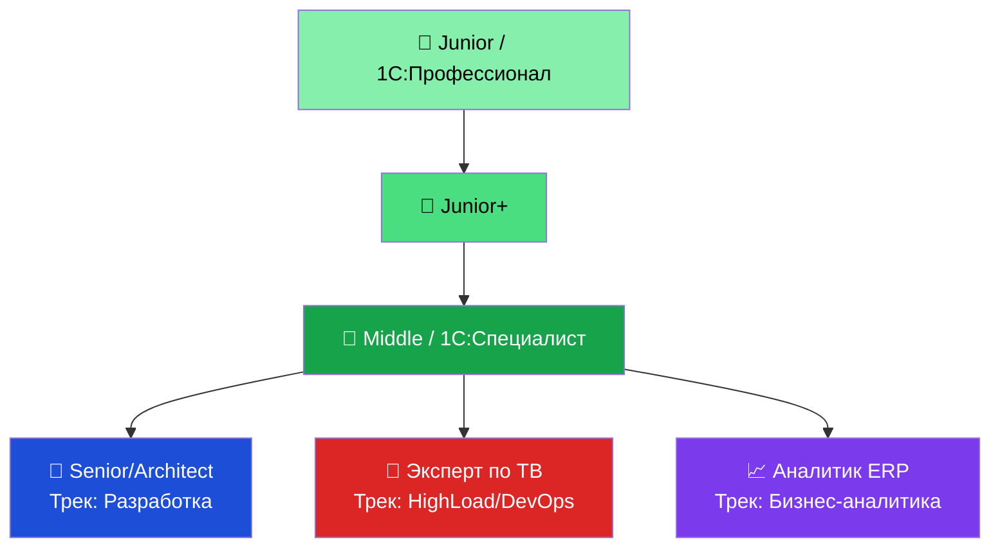

# 📊 Матрица компетенций 1С-специалиста 2026

[← Timeline](02_Timeline.md) | [Сертификации →](04_Certifications.md)

---

> Карьерный трек в экосистеме 1С — это не просто выслуга лет, а осознанное движение по одному из четырёх специализированных направлений. Временны́е рамки — ориентировочные; реальный переход определяется компетенциями, а не стажем.

---

## Четыре карьерных трека

---

## 🌱 Junior (0–6 месяцев)

**Фокус:** Освоить инструментарий платформы и создать первую рабочую конфигурацию.

### Ключевые технические компетенции

- **Платформа:** Уверенная навигация в Конфигураторе. Понимание объектной модели: Справочники, Документы, Регистры сведений и накопления.
- **Язык BSL:** Переменные, циклы, процедуры и функции. Строгое понимание контекста выполнения (`&НаКлиенте` / `&НаСервере`).
- **Язык запросов:** Базовые `ВЫБРАТЬ...ИЗ`, соединения (ЛЕВОЕ, ВНУТРЕННЕЕ), группировки, агрегатные функции, виртуальные таблицы.
- **Формы:** Разработка форм в немодальном режиме (платформа 8.5). Печатные формы (Макеты, Табличный документ).
- **Инструментарий:** Отладчик, Консоль запросов, знакомство с 1С:EDT.
- **Предметная область:** Базовые понятия бухучёта: счёт, проводка, двойная запись. Суть налоговой реформы 2026 (НДС 22%).

### Soft Skills

- Умение читать поставленную задачу и задавать уточняющие вопросы.
- Базовая работа с Git (коммиты, история).

### Сертификация

- ✅ **1С:Профессионал по платформе** (после изучения BSL и запросов, ≈ 2-й месяц).

**💰 Зарплатная вилка:** 50 000 – 90 000 ₽ (Регионы), 80 000 – 130 000 ₽ (Москва/удалёнка)

---

## 🌿 Junior+ (6–12 месяцев)

**Фокус:** Самостоятельное решение типовых задач, работа с чужим кодом, строгая архитектурная гигиена.

### Ключевые технические компетенции

- **Расширения (Extensions):** Исключительно через них — модификация типовых конфигураций (без снятия с поддержки). Аннотации `&Вместо`, `&После`, `&Перед`.
- **БСП (Библиотека Стандартных Подсистем):** Понимание принципов работы, переопределение типовых механизмов через подписки на события.
- **Механизмы проведения:** Движения документов по регистрам, контроль остатков.
- **Базовая СКД:** Простые отчёты, параметры, отборы.
- **DevOps и Git:** Ветки, Pull Requests, 1С:EDT в командной разработке.
- **RLS (начало):** Понимание принципа ограничения доступа на уровне записей.

### Soft Skills

- Декомпозиция задачи на подзадачи.
- Участие в Code Review (как ревьюируемый).

**💰 Зарплатная вилка:** 90 000 – 140 000 ₽ (Регионы), 120 000 – 180 000 ₽ (Москва/удалёнка)

---

## 🍃 Middle (1–2 года)

**Фокус:** Самостоятельное проектирование подсистем, сложные интеграции, автоматизированное тестирование.

### Ключевые технические компетенции

- **Интеграции и API:** Разработка HTTP-сервисов (REST) и Web-сервисов (SOAP). JSON, XML, XDTO-фабрики.
- **BDD и тестирование:** Vanessa Automation + TurboGherkin. Написание `.feature`-сценариев и программных шагов.
- **Продвинутая СКД:** Сложные связи наборов данных, программное формирование отчётов.
- **Управляемые блокировки:** Понимание конфликтов блокировок, диагностика дедлоков.
- **RLS:** Уверенная настройка прав доступа на уровне записей в типовых и собственных конфигурациях.
- **Linux:** Базовое развёртывание сервера 1С в Linux-среде. Осознание case-sensitivity.
- **Маркировка и ЭДО:** Интеграция с «Честный ЗНАК», настройка МЧД, 1С-ЭДО.
- **AI-инструменты:** Cursor IDE + `1c-ai-development-kit` — использование в повседневной разработке.
- **Сертификация:** ✅ **1С:Специалист по платформе**.

### Soft Skills

- Оценка трудозатрат (estimation).
- Коммуникация с бизнес-заказчиком и аналитиком.
- Самостоятельное проведение Code Review.

**💰 Зарплатная вилка:** 150 000 – 220 000 ₽ (Регионы), 200 000 – 300 000 ₽ (Москва/удалёнка)

---

## 🌳 Трек «Разработка»: Senior / Tech Lead (3–5 лет)

**Фокус:** Проектирование Enterprise-ландшафтов, управление качеством, гибридные архитектуры.

### Ключевые компетенции

- **Гибридные ландшафты:** Разделение функционала между тяжёлым бэкендом (1С:ERP) и лёгким фронтендом (1С:Элемент, B2B-кабинеты).
- **1С:Элемент:** Уверенная разработка на платформе (JS/HTML UI, строгая типизация, асинхронность), связка с 1С:ERP через 1С:Шину и REST API.
- **Асинхронные интеграции:** RabbitMQ, Kafka, 1С:Шина.
- **CI/CD:** Настройка полных пайплайнов (сборка → статический анализ → BDD-тесты → деплой). SonarQube + BSL Language Server.
- **Инструментарий BSL-сообщества:** `oscript-library`, `deployka`, `gitsync`, `bsp-tools`, `1cca`.
- **Менторство:** Code Review, выстраивание процессов EDT-разработки в команде.
- **Мобильная платформа:** Знакомство с разработкой нативных iOS/Android приложений средствами 1С (offline-режим, синхронизация).

### Soft Skills

- Ведение технических переговоров с заказчиком.
- Составление технических заданий (ТЗ) и архитектурных решений (ADR).
- Agile/Scrum: спринты, ретроспективы, ведение бэклога.

**💰 Зарплатная вилка:** 220 000 – 380 000 ₽

---

## 🌋 Трек «HighLoad / DevOps»: 1С:Эксперт по технологическим вопросам (5+ лет)

**Фокус:** Оптимизация производительности СУБД, решение инфраструктурных проблем при тысячах одновременных пользователей.

> ⚠️ Это узкоспециализированная роль. Эксперт **не пишет бизнес-функционал** (кнопки, отчёты) — он расследует падение производительности и обеспечивает отказоустойчивость.

### Ключевые компетенции

- **СУБД:** Виртуозное администрирование PostgreSQL (на Linux) и MS SQL Server. Планы выполнения запросов, создание индексов, `EXPLAIN ANALYZE`.
- **Linux CLI:** `bash`, `grep`, `awk`, `sed` — анализ гигантских логов Технологического журнала 1С.
- **Кластер серверов 1С:** Балансировка нагрузки, управление памятью `rphost`, **фоновая реструктуризация БД** (zero-downtime обновления), экспорт/импорт настроек кластера (IaC).
- **Дедлоки:** Расследование причин взаимных блокировок, оптимизация логики транзакций.
- **Нагрузочное тестирование:** «Тест-Центр» из пакета **1С:КИП** (Корпоративный инструментальный пакет).
- **Безопасность:** Настройка PBKDF2-HMAC-SHA256, Idle Timeout, аудит журнала регистрации, SSL-сертификаты.
- **Сертификация:** ✅ **1С:Эксперт по технологическим вопросам** (экзамен — многодневная процедура с очной защитой практического кейса перед комиссией, включает задачи по HighLoad, TJ, СУБД).

**💰 Зарплатная вилка:** 300 000 – 500 000+ ₽

---

## 📈 Трек «Бизнес-аналитика»: 1С:Аналитик (Консультант ERP, 2+ года)

**Фокус:** Связующее звено между бизнесом и разработкой. Моделирование процессов.

### Ключевые компетенции

- **Предметная экспертиза:** Глубокое знание флагманских решений (1С:ERP, 1С:ЗУП, 1С:УХ) — управление производством, МСФО, казначейство, P&L.
- **СКД в пользовательском режиме:** Конструирование сложных отчётов без кода.
- **BDD / TurboGherkin:** Написание бизнес-сценариев (`.feature`) через Vanessa ADD — формализация ТЗ для программистов.
- **1С:СППР:** Визуальное моделирование архитектуры предприятия, генерация ТЗ.
- **Маркировка и регуляторика:** Жизненный цикл товаров в «Честный ЗНАК», ЕГАИС, КЭДО/СЭДО.
- **Сертификация:** ✅ **1С:Специалист-Консультант** (по соответствующей конфигурации).

### Soft Skills

- Интервьюирование бизнес-пользователей, составление протоколов.
- Управление ожиданиями заказчика.

**💰 Зарплатная вилка:** 150 000 – 320 000 ₽

---

## 📚 Рекомендуемые ресурсы по грейдам

| Грейд | Книги | Курсы / Ссылки |
|---|---|---|
| Junior | Радченко «1С:Программирование для начинающих» | [uc1.1c.ru/poster/shema-start](https://uc1.1c.ru/poster/shema-start/) |
| Junior+ | Радченко + Хрусталева «Практическое пособие разработчика» | [uc1.1c.ru/poster/shema-izucheniya-1s](https://uc1.1c.ru/poster/shema-izucheniya-1s/) |
| Middle | Хрусталева «СКД — Разработка сложных отчётов» | Vanessa Automation GitHub, SonarQube BSL plugin |
| Senior+ | «Настольная книга 1С:Эксперта по технологическим вопросам» | Infostart Конференция, 1С:КИП документация |
| Expert | 1С:Эксперт — официальные материалы подготовки | [uc1.1c.ru/course](https://uc1.1c.ru) — курсы по HighLoad |

---

[← Timeline](02_Timeline.md) | [🏆 Сертификации →](04_Certifications.md)