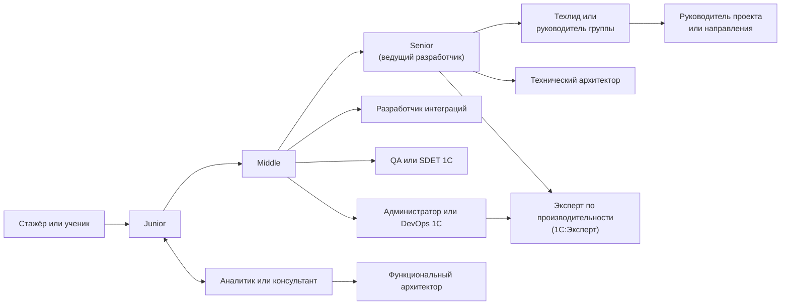

# Матрица компетенций 1С-разработчика

[← Предыдущий](02_Timeline.md) | [🗺 Оглавление](README.md) | [Следующий →](04_Certifications.md)

> Актуализировано: сентябрь 2026.

Этот файл отвечает на два вопроса: что нужно уметь на своём уровне и что учить дальше. Основа — официальная «Модель профессиональных компетенций Разработчика» фирмы «1С» (индекс MC-6-001, версия 1, 2025). В ней три уровня: Junior, Middle и Senior. Уровни определяются навыками, стаж в модели не указан. Роадмап добавляет к модели уровень Senior+ по матрицам сообщества, метки важности, несколько строк по современной практике, самооценку и карьерную лестницу.

Зарплаты по уровням здесь не приводятся, они собраны в [13_Career.md](13_Career.md). Этапы обучения описаны в [02_Timeline.md](02_Timeline.md), проекты P0–P17 — в [07_Projects.md](07_Projects.md).

## Содержание

- [Как устроена матрица](#-как-устроена-матрица)
- [Матрица компетенций](#-матрица-компетенций)
- [Продукция и контекст организации](#-продукция-и-контекст-организации)
- [Soft skills по уровням](#-soft-skills-по-уровням)
- [Как оценить свой уровень](#-как-оценить-свой-уровень)
- [Карьерная лестница и роли](#-карьерная-лестница-и-роли)
- [Треки: где углубляться](#-треки-где-углубляться)
- [Частые заблуждения об уровнях](#-частые-заблуждения-об-уровнях)
- [Источники](#-источники)

---

## 🧭 Как устроена матрица

### Официальная модель MC-6-001

- **Кто составил.** Модель подготовили специалисты фирмы «1С», «1С:Северо-запад» и «1С-Рарус». Файл xlsx опубликован в репозитории сообщества [Landscape1C](https://github.com/Oxotka/Landscape1C/tree/main/docs/competencies/sources).
- **Принцип избыточности.** Модель написана с запасом. Из неё можно собрать и программиста для работы по Стандарту ИТС, и разработчика для КОРП-проектов. Авторы прямо предлагают компаниям вычёркивать неактуальные компетенции и дописывать недостающие.
- **Три раздела.**
  - «Продажа продукции и оказание услуг» — программирование и проектирование, интеграция, инструменты разработчика, мобильные приложения, 1С:Предприятие.Элемент, технологии внедрения и сопровождения.
  - «Продукция, которую компания предлагает рынку» — лицензирование, режимы работы, официальная поддержка и 1С:ИТС, сервисы.
  - «Контекст организации» — система франчайзинга, ГИС и контролирующие органы, 152-ФЗ и 98-ФЗ, процессы и роли в компании клиента.
- **Для кого.** Классификатор общий для специалистов фирм-франчайзи. В инхаусе и продуктовых компаниях модель тоже годится как чек-лист: разделы про ИТС и сервисы там просто весят меньше.
- **Личностные компетенции** вынесены в отдельную модель MC-2-001. Её адрес указан в самой модели: [consulting.1c.ru/knowledge_base/10](https://consulting.1c.ru/knowledge_base/10/). В этом роадмапе она не разбиралась.

### Что добавляет роадмап

- **Senior+.** В официальной модели его нет. Описание собрано по матрицам сообщества из того же репозитория Landscape1C: весовой матрице на 7 грейдов и отметочной матрице «Программисты». Правило сведения шкал взято из Landscape1C: Senior+ = архитектор + ведущий архитектор + эксперт.
- **Метки важности** 🔴🟡🔵. Модель описывает всё, что может понадобиться, а метки показывают, без чего нельзя обойтись. Это оценка авторов роадмапа, а не часть модели.
- **Строки, которых нет в модели.** Это транзакции и блокировки (в модели они внутри «Оптимизации»), безопасность кода и данных, CI/CD и ИИ-ассистенты. Такие строки помечены «дополнение роадмапа».
- **Обозначения в таблицах:** «=» — как на предыдущем уровне, «—» — требований нет.

| Метка | Значение |
|---|---|
| 🔴 обязательно | Без этого не выполнить типовую задачу уровня и не пройти собеседование на этот уровень |
| 🟡 желательно | Ускоряет рост и часто встречается в вакансиях, но можно отложить |
| 🔵 по контексту | Нужно в определённом контексте: у франчайзи, в инхаусе, в продукте, в проекте или в отрасли |

### Уровни коротко

- **Junior** выполняет задачи по заданию и по образцу. Он понимает механизмы платформы и не ломает типовую конфигурацию. Модель ждёт от Junior больше, чем принято думать: расширения, обновление со сравнением и объединением, внешние обработки через БСП, базовые интеграции, маркировку по инструкции, знание процессов клиента.
- **Middle** решает задачи самостоятельно. Он проектирует метаданные под нетиповые задачи, пишет сложные запросы и отчёты, отвечает за блокировки и производительность своего кода, работает в команде и оценивает ТЗ.
- **Senior** отвечает за решение целиком. Он проектирует функциональность и права в контексте проекта, организует групповую разработку и статический анализ, ревьюирует чужой код, составляет план обновления и управляет сроками группы.
- **Senior+** — это архитектор, ведущий архитектор или эксперт. Его зона — ландшафт систем, интеграционная архитектура, производительность на уровне СУБД и кластера, развитие практики в компании.

### Уровень, этапы и стаж

Уровень не выдаётся за прохождение этапов роадмапа. Этапы дают знания и проекты, а уровень подтверждают задачи, решённые на реальной работе. Сроки в таблице не указаны намеренно: в модели 1С их нет, а в вакансиях названия уровней используются по-разному. В объявлениях hh.ru встречаются вакансии «Middle» с требованием опыта 3–6 лет, а встречаются и с 1–3 годами. Промежуточные названия вроде «Junior+» каждая компания трактует по-своему, поэтому роадмап их не выделяет.

| Уровень | Этапы роадмапа | Проекты | Сертификация |
|---|---|---|---|
| Стажёр → Junior | Этапы 0–4 («Минимальный путь до первой работы») | P0–P3, P7–P9 | 1С:Профессионал по платформе — после этапа 2 |
| Middle | Этапы 5–6 и начало этапа 7 | P4–P6, P10–P13, P15; по желанию P16, P17 | 1С:Специалист по платформе — по желанию после этапа 5 |
| Senior | Этап 7 и опыт на реальных проектах | P14 (Middle–Senior) и проекты трека | Экзамен трека: Специалист, Специалист-консультант, Эксплуататор |
| Senior+ | За пределами этапов | Реальные системы | 1С:Эксперт по технологическим вопросам — для экспертного трека |

Подробно об экзаменах — в [04_Certifications.md](04_Certifications.md).

---

## 📊 Матрица компетенций

34 компетенции сгруппированы в 8 блоков. Формулировки для Junior, Middle и Senior — сжатый пересказ модели MC-6-001 с уточнениями роадмапа и ссылками на стандарты ИТС там, где они есть. Колонка Senior+ собрана по матрицам сообщества. После каждого блока есть упражнения «Как проверить себя». Вопросы для собеседования по тем же темам собраны в [08_Interview.md](08_Interview.md), определения терминов — в [12_Glossary.md](12_Glossary.md).

### Язык, платформа и интерфейс

| Компетенция | Junior | Middle | Senior | Senior+ |
|---|---|---|---|---|
| Встроенный язык и алгоритмы | 🔴 Типы данных, коллекции, процедуры и функции. Объясняет базовые алгоритмы поиска и сортировки, оценивает сложность простых алгоритмов | 🔴 Продвинутые подходы: динамическое программирование, жадные алгоритмы, графы, НОД и НОК. Трассировка, отладка, замер производительности | 🔴 Оценивает вычислительную сложность, выбирает, пишет и оптимизирует алгоритм под задачу | 🔴 Алгоритмы для нагруженных участков, разбор чужих решений на ревью |
| Интерфейсы и клиент-серверное взаимодействие | 🔴 Модули форм и команд, обработчики событий, связь формы с модулями объекта и менеджера, директивы компиляции. Работа в веб- и мобильном клиенте, в разных ОС. Немодальный код: `ОписаниеОповещения`, `Асинх`/`Ждать` ([std 703](https://its.1c.ru/db/v8std/content/703/hdoc)) | 🔴 = на сложных формах. Минимум серверных вызовов и трафика ([std 487](https://its.1c.ru/db/v8std/content/487/hdoc)) | 🔴 = | 🔴 Правила клиент-серверного кода для команды |
| Объекты метаданных и проектирование | 🔴 Подбирает объекты метаданных и структуру алгоритма под задачу, знает основные обработчики событий объектов | 🔴 Проектирует метаданные под нетиповые задачи: денормализация для отчётов, асинхронная обработка, конвейеры. Выявляет, где типовая не покрывает процесс | 🔴 Проектирует функциональность в контексте проекта: требования, ограничения доступа, документация | 🔴 Архитектура системы и ландшафта: платформа 8, 1С:Элемент, внешние системы |
| Требования к ИС | 🟡 Представление о функциональных и нефункциональных требованиях | 🔴 Проверяет реализуемость требований, приоритизирует, закрывает функциональные разрывы по модели аналитика, проверяет нефункциональные требования | 🔴 Ищет противоречия требований между собой и с архитектурой, фиксирует анализ в системе управления проектами | 🔴 Сбор требований к архитектуре, аудит системы |

**Как проверить себя**

- Junior: решите P0 без подсказок и готовых функций вроде `ЧислоПрописью`. Объясните разницу между `&НаСервере`, `&НаСервереБезКонтекста` и `&НаКлиентеНаСервереБезКонтекста`. Замените модальный `Вопрос()` на `ПоказатьВопрос()` с `ОписаниеОповещения`.
- Middle: найдите в своей форме цепочку серверных вызовов и сократите её до одного. Оцените сложность вашего алгоритма распределения суммы по строкам.
- Senior: спроектируйте метаданные для задачи, где отчёт строится по миллионам строк, и обоснуйте денормализацию.

### Данные, учёт и отчёты

| Компетенция | Junior | Middle | Senior | Senior+ |
|---|---|---|---|---|
| Язык запросов | 🔴 Простые запросы: выборка, функции, условия, группировки, итоги. Виртуальные таблицы с параметрами вместо `ГДЕ` ([std 657](https://its.1c.ru/db/v8std/content/657/hdoc)). Консоль запросов, обход и поиск в результате | 🔴 Соединения, объединения, вложенные запросы, временные таблицы и пакеты ([std 777](https://its.1c.ru/db/v8std/content/777/hdoc)). Нет запросов в цикле ([std 436](https://its.1c.ru/db/v8std/content/436/hdoc)) и разыменования составных типов ([std 654](https://its.1c.ru/db/v8std/content/654/hdoc)) | 🔴 = плюс 🟡 план запроса в СУБД, индексы, селективность | 🔴 Низкоуровневый SQL: планы, индексы, статистика СУБД |
| Учётные регистры и проведение | 🔴 Назначение и механизм регистров накопления, бухгалтерии и расчёта. Правильно получает данные, дорабатывает простые механизмы заполнения, знает, какие изменения структуры регистров — грубые ошибки | 🔴 Проектирует структуру регистров под новые задачи, сложные механизмы заполнения и получения данных, оценивает и оптимизирует их, контролирует качество кода | 🔴 Проектирует «с нуля» объекты большой и сложной системы | 🔴 Учётная модель крупной системы, разбор узких мест |
| Транзакции и блокировки (дополнение роадмапа, в модели — «Оптимизация») | 🔴 Контроль остатков при проведении по образцу. Понимает, зачем транзакция и блокировка. В модели это уровень Middle, но в тестовых заданиях для джунов контроль остатков встречается регулярно | 🔴 Управляемые блокировки ([std 460](https://its.1c.ru/db/v8std/content/460/hdoc)), блокирующее чтение остатков в начале транзакции ([std 661](https://its.1c.ru/db/v8std/content/661/hdoc)), правила транзакций ([std 783](https://its.1c.ru/db/v8std/content/783/hdoc)), уровни изоляции СУБД | 🔴 Рекомендации для многопользовательской работы, избыточные блокировки ([std 659](https://its.1c.ru/db/v8std/content/659/hdoc)) | 🔴 Расследование взаимоблокировок по ТЖ и СУБД |
| СКД и средства аналитики | 🔴 Схема, настройки, макет и элементы результата. Без программирования настраивает отчёты типовой, язык выражений СКД, пользовательские поля. 🔵 Дашборды в 1С:Аналитике | 🔴 Схемы с запросами, макеты оформления, хранилища вариантов и пользовательских настроек, программная работа с СКД. 🔵 Копии баз данных и Дата акселератор | 🔴 = | 🟡 Архитектура отчётности большой системы |
| Внешние отчёты, обработки, печатные формы | 🔴 Делает по заданию. Подключает через подсистему БСП «Дополнительные отчеты и обработки» с работой в безопасном режиме. Создаёт и правит макеты, настраивает области табличного документа | 🔴 = со сложными алгоритмами, запросами и интерфейсами | 🔴 = | — |

**Как проверить себя**

- Junior: сделайте P2 и P3. Получите остаток на момент документа без его собственных движений: параметр `Период` = `Новый Граница(МоментВремени(), ВидГраницы.Исключая)`. Настройте отчёт типовой с пользовательским полем и условным оформлением без кода.
- Middle: сделайте P4–P6. Перепишите запрос в цикле на один запрос с временной таблицей. Объясните сценарий из std 661: двое читают остаток 10, списывают 8 и 6 и получают −4.
- Senior: ускорьте отчёт по большому регистру накопления и покажите замеры до и после.

### Типовые конфигурации и доработка

| Компетенция | Junior | Middle | Senior | Senior+ |
|---|---|---|---|---|
| Прикладные решения (типовые) | 🔴 Назначение основных типовых, соответствие типа организации и конфигурации. Одна типовая на уровне пользовательских настроек: партионный и серийный учёт, резервы, себестоимость, многофирменный учёт. Как узнать, в какой конфигурации работает клиент | 🔴 Та же функциональность на уровне объектов и модулей, использование этих знаний в разработке | 🔴 Методические принципы решения, демонстрация, варианты адаптации под заказчика | 🔴 Функциональная архитектура на базе типовых (ERP, УХ) |
| Доработка конфигураций и расширения | 🔴 Создаёт объекты, формы, предопределённые данные и модули. Создаёт и подключает расширения, знает их ограничения и заимствование, учитывает порядок исполнения нескольких расширений. Аннотации `&Перед`, `&После`, `&ИзменениеИКонтроль`; `&Вместо` — когда другие не подходят | 🔴 = | 🔴 Расследует ошибки кода и архитектуры, проверяет и оптимизирует свой и чужой код | 🔴 Стратегия доработок: что в расширении, что в основной конфигурации с сохранением поддержки |
| БСП, БПО, БЭД и другие библиотеки | 🔴 Структура библиотек, вызов их методов в коде, обновление библиотек в типовых и нетиповых, выбор релиза БПО. 🟡 Знает, что поведение БСП настраивают через общие модули `*Переопределяемый` | 🔴 Отличает самостоятельные подсистемы от интегрируемых, встраивает библиотеку в нетиповую конфигурацию. Обработчики `&После` к `*Переопределяемый` в расширении | 🔴 Архитектура ИС с учётом возможностей всех библиотек | 🔴 = |
| Управление доступом | 🔴 Права, роли, функциональные опции, ограничение доступа. В пользовательском режиме — пользователи, профили групп доступа и группы доступа БСП, дата запрета изменений, защита ПДн | 🔴 Меняет ограничения доступа в типовых по стандартным и производительным шаблонам (в конфигурации или расширении) | 🔴 Проектирует «с нуля» архитектуру доступа большой системы | 🔴 = плюс производительность RLS под нагрузкой |
| Обновление конфигураций | 🔴 Источники обновлений, текущий релиз, резервная копия, разница конфигурации БД и конфигурации поставщика, правила поддержки, сравнение и объединение, ссылочная целостность. Проверка расширений после обновления | 🔴 Пишет код для корректного обновления (обработчики обновления, [std 690](https://its.1c.ru/db/v8std/content/690/hdoc)), обновляет в команде по ТЗ | 🔴 План обновления и перехода на новую конфигурацию, управление работами | 🔴 Стратегия миграций между конфигурациями и системами |

Порядок доработки типовой, которого придерживается роадмап: настройки и функциональные опции → дополнительные отчёты и обработки БСП → расширение → изменение основной конфигурации с сохранением поддержки, если расширение не справляется. Официальные исправления фирма «1С» сама поставляет расширениями с назначением «Исправление».

Какие типовые знать, модель оставляет на усмотрение компании. Для разработчика в вакансиях августа–сентября 2026 года УТ, ERP, ЗУП, БП и ДО упоминаются почти вровень. УТ 11.5, КА 2.5 и ERP 2.5 построены на одной кодовой базе, поэтому знание УТ даёт задел для ERP. Подробнее о спросе — в [13_Career.md](13_Career.md).

**Как проверить себя**

- Junior: сделайте P7 и P8. На копии демо-базы обновите типовую на новый релиз и проверьте, что расширение применяется. Объясните клиенту, как отличить изменённую конфигурацию от типовой.
- Middle: сделайте P15 (RLS и роли). Добавьте в P8 или P5 обработчик обновления, который заполняет новый реквизит в существующих данных.
- Senior: составьте план обновления доработанной типовой: риски, проверка на копии, время простоя, откат.

### Интеграции и обмены

| Компетенция | Junior | Middle | Senior | Senior+ |
|---|---|---|---|---|
| Интеграция ИС | 🔴 Регистрация изменений и расписания, синхронизация типовых, обработка «Выгрузка и загрузка данных XML», XML и JSON, HTTP-сервисы (`HTTPСервисЗапрос` → `HTTPСервисОтвет`) и вызов внешних API (`HTTPСоединение` + `HTTPЗапрос`). 🟡 Web-сервисы, OData, почта. 🔵 Схемы обмена в 1С:Шине, загрузка НСИ при запуске системы | 🔴 = уверенно, плюс устойчивость: таймауты, повторы, идемпотентность, журналирование (дополнение роадмапа) | 🔴 Проектирует обмены, в том числе через 1С:Шину и между территориально распределёнными ИС, методология миграции НСИ | 🔴 Интеграционная архитектура ландшафта. Kafka и RabbitMQ — через внешние компоненты, HTTP-шлюз или 1С:Шину, в платформу они не встроены |
| Конвертация данных 2.x и 3.x | 🔴 Терминология обеих версий. КД2: регистрация и расписание. КД3: правила обмена между типовыми, обработка «Универсальный обмен данными» | 🔴 Разница архитектур КД2 и КД3, правила конвертации и обработки данных любой сложности | 🔴 Протоколы обмена и методология миграции НСИ на КД | 🔴 = |
| Подключаемое оборудование | 🔵 Виды оборудования и способы подключения, установка и настройка по Справочнику торгового оборудования или БПО, обновление драйверов | 🔵 Стандарты обмена с оборудованием, настройка и диагностика | 🔵 Подбор оборудования под задачи пользователя | — |
| Маркировка | 🔵 Правила маркировки. По инструкции подключает тестовый контур ГИС МТ или ФГИС МДЛП, ставит сертификаты и ПО для электронной подписи, настраивает конфигурацию и оборудование | 🔵 Настраивает и диагностирует обмены с ГИС МТ и МДЛП | 🔵 Техническое решение для прослеживаемости от производства до продажи | — |

**Как проверить себя**

- Junior: сделайте P9 (загрузка из файла). Опубликуйте базу на веб-сервере и вызовите из браузера простой HTTP-сервис, затем разберите P10. Настройте синхронизацию двух демо-баз типовых.
- Middle: сделайте P10–P12. Повторный запуск загрузки в P11 не должен создавать дубли.
- Senior: спроектируйте обмен трёх систем: формат, транспорт, идемпотентность, мониторинг доставки, разбор коллизий.

Маркировка и законодательство подробно разобраны в [10_Domain_and_Law.md](10_Domain_and_Law.md), интеграции — в треке [tracks/integration.md](tracks/integration.md).

### Инфраструктура и производительность

| Компетенция | Junior | Middle | Senior | Senior+ |
|---|---|---|---|---|
| Рабочее место и инфраструктура | 🔴 Ставит платформу в локальном, сетевом и клиент-серверном вариантах, ставит СУБД по инструкции, создаёт файловые и клиент-серверные ИБ. Публикует базы, веб-сервисы и OData на готовом веб-сервере. Знает, как активировать лицензии, в том числе community-лицензию для разработчиков | 🔴 Windows и Linux в виртуализации. Настраивает кластер серверов, профили безопасности, ограничения ресурсов, сбор технологического журнала | 🔴 = | 🔴 Архитектура кластера и СУБД. PostgreSQL — только в сборках для 1С |
| Оптимизация и производительность | 🟡 Отличия ПРОФ и КОРП. Оценка производительности по методике APDEX | 🔴 Анализ ТЖ и загрузки оборудования, настройка кластера, нагрузочное тестирование, оптимизация кода по результатам анализа | 🔴 Рекомендации по архитектуре и коду, оптимизация в сложных случаях | 🔴 Уровень 1С:Эксперта: ТЖ, СУБД, 1С:КИП, расследование инцидентов |

**Как проверить себя**

- Junior: создайте клиент-серверную ИБ и опубликуйте её. Объясните риски файлового режима при многопользовательской работе.
- Middle: включите сбор ТЖ, найдите самый долгий запрос и объясните его план.
- Senior и Senior+: сделайте P14. Покажите замеры до и после, фрагменты ТЖ и исправление взаимоблокировки.

Особенности Linux, лицензирования и кластера — в треках [tracks/administrator-operator.md](tracks/administrator-operator.md) и [tracks/performance-expert.md](tracks/performance-expert.md).

### Инструменты, качество и командная разработка

| Компетенция | Junior | Middle | Senior | Senior+ |
|---|---|---|---|---|
| Стандарты разработки и статический анализ | 🔴 Знает систему стандартов (код, интерфейсы, метаданные, запросы, обмен, права, клиент-сервер) и следит за её обновлениями. Сам проверяет код через АПК, 1C:EDT или SonarQube; в сообществе — BSL Language Server | 🔴 Плюс стандарты по оптимизации запросов и избыточным блокировкам | 🔴 Организует групповой статический анализ | 🔴 = |
| Хранилище конфигурации | 🔵 Подключение, захват и отмена захвата, помещение, сравнение с объектом хранилища, история. Обязательно в командах на Конфигураторе, типично у франчайзи | 🔵 = | 🔵 Организует групповую разработку, в том числе разветвлённую ([std 709](https://its.1c.ru/db/v8std/content/709/hdoc)) | 🔵 = |
| Git | 🔴 Термины (локальный и удалённый репозиторий, commit, branch, fork). Работает с Git как исполнитель над своими задачами и портфолио | 🔴 Совместная работа над кодом с командой: ветки, слияния, запросы на слияние | 🔴 Организует групповую разработку с Git | 🔴 Процесс разработки и выпуска релизов |
| 1C:EDT | 🟡 Представление о назначении | 🔵 Проект, связь с ИБ, групповая разработка конфигураций и расширений с Git, отладка. В продукте и инхаусе — 🔴 | 🔵 Организует разработку в EDT | 🔵 = |
| Автотесты | 🟡 Создаёт сценарии автотестов в 1С:Тестировщике, 1С:Сценарном тестировании или Vanessa Automation, готовит пользовательскую документацию | 🟡 Более сложные сценарии. Модульные тесты — YAxUnit (сообщество) | 🔵 Определяет, какие сценарии нужно тестировать. В продукте — 🔴 | 🔵 Стратегия тестирования |
| CI/CD (дополнение роадмапа) | — | 🔵 Понимает конвейер: сборка, синтаксический контроль, BSL LS, тесты | 🔵 Настраивает конвейер внешними средствами: 1cedtcli, ibcmd, vanessa-runner, jenkins-lib | 🔵 Процесс поставки и релизов |
| 1С:СППР | 🔵 Получает проектные материалы, тестирует по сценариям СППР, регистрирует ошибки | 🔵 Разрабатывает по модели ИС в СППР | 🔵 Логическое проектирование, функциональная архитектура, контроль стандартов через СППР | 🔵 = |
| ИИ-ассистенты (дополнение роадмапа) | 🟡 Использует для объяснения кода и черновиков. Не передаёт персональные данные и код клиента во внешние сервисы | 🟡 1С:Напарник в EDT или другие инструменты. Любой черновик проходит BSL LS, тесты и ревью | 🟡 Правила применения ИИ в команде | 🟡 Выбор и оценка инструментов, политика безопасности |

Пояснения к блоку:

- **EDT не обязателен для Middle.** Конфигуратор развивается, хранилище конфигурации работает, командная разработка без EDT возможна. EDT и Git — стандарт в продуктовых, инхаус- и крупных проектных командах. В каталоге Landscape1C ни один «продвинутый» инструмент не отмечен для контекста «франчайзи».
- **ИИ-инструментов в модели 1С нет**, поэтому в матрице они только 🟡. 1С:Напарник работает в 1C:EDT и требует подписки ИТС, условия доступа смотрите на [code.1c.ai](https://code.1c.ai/). Правила безопасной работы с ИИ — в [09_AI_Development.md](09_AI_Development.md).
- **1С:СППР 2.1** работает только на платформе 8.5.1 и выше.

**Как проверить себя**

- Junior: подключитесь к хранилищу учебной базы, захватите объект, измените его и поместите обратно. Выложите проект на GitHub с понятной историей коммитов. Прогоните свой код через АПК, EDT или BSL LS и исправьте замечания.
- Middle: сделайте P13 — pull request с зелёной проверкой.
- Senior: настройте групповую проверку стандартов в команде и договоритесь о правилах ревью. Сделайте P17 и разберите ошибки ИИ.

### Мобильная разработка и 1С:Элемент

| Компетенция | Junior | Middle | Senior | Senior+ |
|---|---|---|---|---|
| Мобильные приложения на платформе 8 | 🔵 Эмулятор, мобильная платформа, настройка устройства, объекты мобильной ИБ, адаптация форм под разные экраны, сервис сборки и публикации | 🔵 Мобильный клиент с автономным режимом, синхронизация с основной базой | 🔵 = | — |
| 1С:Предприятие.Элемент | 🔵 Приложение и базовый интерфейс, синтаксис языка, права, импорт и экспорт проекта, внутренний Git-репозиторий, справочники, документы, формы | 🔵 RLS, отчёты и 1С:Аналитика, HTTP-сервисы, мобильная сборка, ветки, задачи и контроль изменений | 🔵 Код-ревью и приём задач, слияние веток, выпуск стабильных версий | 🔵 Выбор между платформой 8 и Элементом в ландшафте |

Модель описывает обе компетенции начиная с Junior, но нужны они по контексту. На рынке это ниша: в выгрузке hh.ru за август–сентябрь 2026 года среди 452 вакансий «1С» была одна позиция по Элементу. Мобильное приложение на платформе 8 не компилируется в нативный код: это мобильная платформа плюс конфигурация. Практика — проект P16, подробности — в треке [tracks/element-and-mobile.md](tracks/element-and-mobile.md).

### Процессы, команда и безопасность

| Компетенция | Junior | Middle | Senior | Senior+ |
|---|---|---|---|---|
| Работа в команде проекта | 🔴 Понимает, что такое проект и роль программиста в нём. Знает правила компании, эскалирует проблемы, соблюдает сроки | 🔴 = | 🔴 Управляет приоритетами и сроками групповой разработки | 🔴 Наставничество, участие в найме и оценке, развитие практики |
| Оценка работ | — (в модели требований нет) | 🔴 Знает способы оценки, принятые в компании, выбирает способ выполнения, оценивает ТЗ по трудозатратам | 🔴 Выбирает метод оценки, оценивает сложные и групповые задачи | 🔴 Оценка проектов и участие в пресейлах |
| Технологии внедрения и сопровождения | 🔵 Обязанности своей роли по Стандарту ИТС, 1С:ТСВ, 1С:ТКВ ЛАЙТ, 1С:ТКВ, 1С:ТКС и регламенты компании | 🔵 = | 🔵 = | — |
| Безопасность кода и данных (дополнение роадмапа) | 🔴 Параметры запроса вместо склейки текста, безопасный режим для внешних обработок, 152-ФЗ и 98-ФЗ, хранение паролей по правилам компании | 🔴 Привилегированный режим точечно ([std 485](https://its.1c.ru/db/v8std/content/485/hdoc)), без `Выполнить`/`Вычислить` на внешних данных ([std 770](https://its.1c.ru/db/v8std/content/770/hdoc)), `РАЗРЕШЕННЫЕ` по [std 415](https://its.1c.ru/db/v8std/content/415/hdoc), безопасное хранилище БСП | 🔴 Архитектура доступа, аудит решения | 🔴 Политика безопасности решения и кластера |

**Как проверить себя**

- Junior: перед каждой задачей запишите свою оценку, после — фактическое время. Через месяц посчитайте, насколько вы ошибаетесь. Требования к оценке нет, но привычка пригодится на Middle.
- Middle: оцените P5 целиком до начала работы и сравните с фактом. Найдите в своём коде места, где привилегированный режим включён «на всякий случай».
- Senior: напишите для команды короткий регламент ревью и работы с ИИ.

Подробные чек-листы ревью, безопасности и проведения — в [11_Checklists.md](11_Checklists.md), справочник по безопасности — в [SECURITY.md](SECURITY.md).

---

## 💼 Продукция и контекст организации

Этот раздел модели почти целиком задан на уровне Junior, на уровнях выше в нём стоит «аналогично». По сути это программа онбординга у франчайзи: именно эти вопросы новичку задают в первые недели работы. В инхаусе и продуктовых командах часть пунктов не нужна.

| Тема | Что должен уметь Junior | Где изучать |
|---|---|---|
| Платформа и прикладные решения | Без подсказки объясняет разницу между технологической платформой и прикладным решением, называет основные характеристики платформы | [02_Timeline.md](02_Timeline.md), этап 0 |
| Лицензирование | Основная поставка, лицензия на рабочее место и на сервер, специальные поставки, отраслевые решения. Программная и аппаратная защита, службы ОС для аппаратных ключей, активация лицензий | Материалы компании, ИТС (большая часть — по подписке) |
| Версии продуктов | Отличия базовых, ПРОФ и КОРП версий и выбор версии под запрос клиента | [tracks/administrator-operator.md](tracks/administrator-operator.md) |
| Режимы работы | Файловый и клиент-серверный режимы, облачный и локальный. Риски неподходящего режима для конкретной ситуации | [12_Glossary.md](12_Glossary.md) |
| Поставки | Физическая и электронная поставка, порядок установки | Материалы компании |
| Типовой и изменённый функционал | Как отличить изменённую конфигурацию по «замочку», как изменения влияют на условия поддержки и обновления | P8 в [07_Projects.md](07_Projects.md) |
| Официальная поддержка и 1С:ИТС | Что такое официальная поддержка, виды договоров 1С:ИТС, состав услуг по тарифам. Какие доработки решаются в рамках ИТС | its.1c.ru |
| Сервисы | Назначение сервисов минимального пакета: «1С-Отчетность», «1С-ЭДО», «1С:Контрагент», «1СПАРК Риски», «1С:Кабинет сотрудника», «1С-ОФД», «1С:Распознавание первичных документов», «1С:Подпись», «1С:СБП», ИС «1С:ИТС» | Материалы компании и ИТС |
| Фирма «1С» и франчайзинг | Разница между вендором, дистрибьютором и фирмой-франчайзи | [01_Strategy.md](01_Strategy.md) |
| Информационные ресурсы | Быстро находит ответ на ресурсах фирмы «1С», хранит логины и пароли по правилам ИБ компании | [05_Resources.md](05_Resources.md) |
| ГИС и регуляторы | Основные контролирующие органы и принципы работы ГИС | [10_Domain_and_Law.md](10_Domain_and_Law.md) |
| 152-ФЗ и 98-ФЗ | Правила обработки и защиты персональных данных, сроки хранения, обезличивание баз. Что такое коммерческая тайна и почему базу клиента нельзя выносить | [10_Domain_and_Law.md](10_Domain_and_Law.md), [09_AI_Development.md](09_AI_Development.md) |
| Процессы и роли клиента | Основные процессы (производство, услуги, торговля) и вспомогательные (бухгалтерский и налоговый учёт, кадры, зарплата, логистика, ИТ, юридическое сопровождение). Для каждого — административная и исполнительская роль, например главный бухгалтер и бухгалтер на участке | [10_Domain_and_Law.md](10_Domain_and_Law.md) |
| Своя компания | Статусы и направления компании, оргструктура, к кому из коллег-«смежников» идти с вопросом, стандарт взаимодействия | Онбординг в компании |

Middle в «Процессах клиента» идёт дальше: понимает, как разные группы сотрудников клиента работают в 1С, и предлагает улучшения процессов. План первых 90 дней у франчайзи — в [13_Career.md](13_Career.md).

---

## 🧠 Soft skills по уровням

В официальной модели «мягких» навыков немного: работа в команде проекта, оценка работ, поиск информации, взаимодействие со «смежниками». Остальные личностные компетенции вынесены в MC-2-001. Для полноты картины роадмап опирается на весовую матрицу сообщества (веса требований от 0 до 3, семь грейдов):

- у младшего разработчика требования к коммуникациям и бизнес-навыкам нулевые, к аналитическому складу ума, креативности и любознательности — уровень 1;
- у ведущего разработчика появляются наставничество, постановка и контроль задач, работа с возражениями, управление ожиданиями;
- у старшего разработчика и архитектора — фасилитация новых практик, участие в пресейлах, подбор и развитие людей;
- суммарный вес требований по грейдам растёт так: 10 → 18 → 37 → 61 → 64 → 91 → 99. У ведущего разработчика он вдвое больше, чем у разработчика (37 против 18): здесь впервые появляются командные навыки и DevOps.

| Навык | Junior | Middle | Senior | Senior+ |
|---|---|---|---|---|
| Работа с постановкой | Задаёт уточняющие вопросы, фиксирует допущения письменно | Обсуждает реализуемость и альтернативы с аналитиком и заказчиком | Ведёт технические переговоры, работает с возражениями | Защищает архитектурные решения, участвует в пресейлах |
| Сроки и ответственность | Соблюдает сроки, вовремя эскалирует проблемы | Оценивает свои задачи и держит оценку | Управляет приоритетами и сроками группы | Планирует развитие направления |
| Работа с кодом команды | Спокойно принимает замечания ревью | Ревьюирует коллег, объясняет замечания со ссылкой на стандарт | Задаёт правила ревью, наставляет младших | Внедряет новые практики в компании |
| Общение с пользователем | Простыми словами объясняет бухгалтеру, почему документ не проводится и сколько товара не хватает | Предлагает решения с учётом процесса клиента | Предлагает улучшение процессов | — |
| Обучение и обмен знаниями | Ищет ответ в синтакс-помощнике, на ИТС и в стандартах, прежде чем спрашивать | Следит за изменениями платформы и законодательства | Делится опытом на внутренних демо и разборах | Выступает, пишет статьи, участвует в найме |

Как показать эти навыки на собеседовании, разобрано в [08_Interview.md](08_Interview.md).

---

## 🔍 Как оценить свой уровень

### Шкала 0–3

Шкала — методика авторов роадмапа. Она похожа на веса 0–3 в матрицах сообщества, но не совпадает с ними.

| Балл | Значение | Пример для «Язык запросов» |
|---|---|---|
| 0 | Не знаю или не пробовал | Не писал запросов |
| 1 | Понимаю и делаю по образцу или инструкции | Пишу запрос через конструктор, правлю готовый |
| 2 | Делаю самостоятельно в типовых ситуациях и объясняю решение | Пишу пакет с временными таблицами, заполняю параметры виртуальных таблиц |
| 3 | Справляюсь с нестандартными случаями, проектирую, учу других, ревьюирую | Нахожу причину медленного запроса по плану и учу этому коллег |

### Карта самооценки

Скопируйте таблицу в свои заметки, поставьте баллы и в последней колонке укажите доказательство: проект, задачу с работы или ревью. Целевые баллы — ориентир авторов по модели MC-6-001.

| Компетенция | Цель Junior | Цель Middle | Цель Senior | Мой балл | Доказательство |
|---|---|---|---|---|---|
| Встроенный язык и алгоритмы | 2 | 3 | 3 | | P0 |
| Интерфейсы и клиент-сервер | 2 | 3 | 3 | | P1, P3 |
| Язык запросов | 2 | 3 | 3 | | P2–P5 |
| Учётные регистры и проведение | 2 | 3 | 3 | | P2, P6 |
| Транзакции и блокировки | 1 | 2 | 3 | | P2, P14 |
| СКД и отчёты | 1 | 2 | 3 | | P2, P5, P7 |
| Внешние отчёты, обработки, печатные формы | 2 | 3 | 3 | | P7 |
| Расширения и доработка типовых | 1 | 2 | 3 | | P8 |
| БСП и библиотеки | 1 | 2 | 3 | | P7, P8 |
| Обновление конфигураций | 1 | 2 | 3 | | Обновление демо-базы |
| Управление доступом | 1 | 2 | 3 | | P1, P15 |
| Интеграции и обмены | 1 | 2 | 3 | | P9–P12 |
| Рабочее место и инфраструктура | 1 | 2 | 2 | | Своя клиент-серверная ИБ |
| Производительность | 0 | 2 | 3 | | P14 |
| Стандарты и статический анализ | 1 | 2 | 3 | | P13 |
| Версионирование (Git или хранилище) | 1 | 2 | 3 | | GitHub, P13 |
| Одна типовая конфигурация | 1 | 2 | 3 | | Работа или демо-база |
| Предметная область (учёт) | 1 | 2 | 2 | | [10_Domain_and_Law.md](10_Domain_and_Law.md) |
| Работа в команде и оценка | 1 | 2 | 3 | | Задачи с работы |

Правило чтения (оценка авторов): уровень достигнут, если по всем строкам балл не ниже цели. Допускается отставание на 1 балл в двух строках, но не в первых четырёх — это ядро, которое проверяют на любом собеседовании.

### Как оценивать честно

- **Подтверждайте баллы артефактами.** «2» без проекта, задачи или ревью — это «1». Проекты P0–P17 специально сделаны доказуемыми: у каждого есть критерии приёмки в [07_Projects.md](07_Projects.md).
- **Попросите внешнюю оценку.** Наставник, руководитель группы или коллега поставят баллы независимо от вас, потом сравните. Разница больше 1 балла — тема для разговора.
- **Сравните себя с вакансиями.** Выгрузите 30–50 вакансий своего города на hh.ru, выпишите требования в таблицу, сравните со своими баллами и закройте три главных пробела.
- **Проверьте базу тестом.** 1С:Профессионал по платформе подтверждает теорию уровня Junior. Независимый онлайн-тест [1С-ТестЦентр](https://1c-tc.ru) присваивает грейд по баллам, но это не сертификация фирмы «1С». Смежные навыки (Git, SQL, PostgreSQL, Linux) можно проверить тестами ИТ-компетенций на [Госуслугах](https://www.gosuslugi.ru/itskills): тестов по 1С там нет, актуальность списка на 2026 год не проверялась.
- **Повторяйте раз в квартал.** Сохраняйте старые карты: рост видно по сдвигу баллов, а не по стажу.
- **Пройдите чек-лист этапа.** Самопроверка по этапам 0–7 — в [11_Checklists.md](11_Checklists.md).
- **Подберите материалы под пробелы.** Книги, курсы и инструменты по темам собраны в [05_Resources.md](05_Resources.md).

---

## 📈 Карьерная лестница и роли

Названия должностей у работодателей разные: «ведущий» и «старший» разработчик в одной компании означают Senior, в другой — сильного Middle. Ориентируйтесь на содержание задач, а не на название.

```mermaid
flowchart LR
    ST["Стажёр или ученик"] --> JR["Junior"]
    JR --> MD["Middle"]
    MD --> SR["Senior<br/>(ведущий разработчик)"]
    SR --> TL["Техлид или<br/>руководитель группы"]
    SR --> TA["Технический архитектор"]
    SR --> EX["Эксперт по производительности<br/>(1С:Эксперт)"]
    MD --> INT["Разработчик интеграций"]
    JR <--> AN["Аналитик или консультант"]
    AN --> FA["Функциональный архитектор"]
    MD --> QA["QA или SDET 1С"]
    MD --> ADM["Администратор или DevOps 1С"]
    ADM --> EX
    TL --> RP["Руководитель проекта<br/>или направления"]
```

| Роль | Чем отличается | Опора в матрице | Куда расти |
|---|---|---|---|
| Стажёр, ученик, первая линия поддержки | Учится на реальных задачах под присмотром. Типичные названия в вакансиях: «Стажер-разработчик 1С», «Программист-стажер 1С», «1С разработчик (ученик)», «Помощник программиста 1С», «Начинающий специалист 1С (первая линия поддержки)» | Язык, запросы, одна типовая на уровне пользователя, контекст организации | Junior. Вакансий «без опыта» — 5–7% от вакансий 1С, поэтому стажировки и первая линия — реальный вход |
| Junior | Делает задачи по заданию: печатные формы, отчёты, небольшие доработки, обновления | Все 🔴 в колонке Junior | Middle |
| Middle | Решает задачи самостоятельно, отвечает за качество и производительность своего кода | Все 🔴 в колонке Middle | Senior или смежная роль |
| Senior (ведущий разработчик) | Отвечает за решение целиком, ревьюирует, наставляет, планирует обновления | Колонка Senior, soft skills Senior | Техлид, архитектор, эксперт |
| Техлид или руководитель группы | Организует разработку: процесс, ревью, приоритеты и сроки группы | Работа в команде, оценка, Git или хранилище, стандарты | Руководитель направления или проекта |
| Технический архитектор | Проектирует систему и ландшафт: метаданные, интеграции, производительность, безопасность | Senior+ в блоках «Язык и платформа», «Интеграции», «Инфраструктура» | Ведущий архитектор |
| Функциональный архитектор | Проектирует решение на базе типовых (часто ERP и УХ) с точки зрения процессов и учёта. В вакансиях таких позиций больше, чем технических архитекторов (13 против 5 в выгрузке hh.ru за август–сентябрь 2026) | Прикладные решения, требования, процессы клиента | Руководитель практики |
| Эксперт по производительности | Расследует торможения, блокировки и сбои на уровне кластера и СУБД | Оптимизация, транзакции и блокировки, инфраструктура, SQL | 1С:Эксперт по технологическим вопросам, консалтинг |
| Аналитик или консультант | Разбирает процессы, пишет требования и ТЗ, настраивает типовые | Требования, прикладные решения, СКД без кода, процессы клиента | Ведущий аналитик, методолог, функциональный архитектор |
| QA или SDET 1С | Пишет сценарии и автотесты, встраивает их в CI | Автотесты, CI/CD, требования | Лид QA, разработчик в продукте |
| Администратор или DevOps 1С | Отвечает за кластер, СУБД, Linux, обновления, мониторинг и резервирование | Инфраструктура, производительность, безопасность | 1С:Эксплуататор, эксперт |

Рост идёт не только вверх. Горизонтальные переходы тоже нормальны: разработчик ↔ аналитик, разработчик → интеграции, администратор → эксперт. Гибридные роли вроде «программиста-консультанта» на рынке по-прежнему встречаются. Переходы между ролями, поиск работы и зарплаты по уровням — в [13_Career.md](13_Career.md).

---

## 🧩 Треки: где углубляться

Трек — это набор строк матрицы, которые нужно прокачать глубже остальных. До этапа 4 путь общий, трек выбирают на этапе 7. Сравнение треков и советы по выбору — в [01_Strategy.md](01_Strategy.md) и [tracks/README.md](tracks/README.md).

| Трек | Какие строки матрицы углубляются | Экзамены |
|---|---|---|
| [Разработчик у франчайзи](tracks/developer-franchise.md) | Прикладные решения, обновление, внешние отчёты и обработки, расширения, КД, оборудование, маркировка, контекст организации | 1С:Профессионал по платформе → 1С:Специалист по платформе |
| [Разработчик в продукте или инхаусе](tracks/developer-product.md) | Проектирование, стандарты и статический анализ, Git, EDT, автотесты, CI/CD, код-ревью | 1С:Профессионал → 1С:Специалист по платформе |
| [Интеграции](tracks/integration.md) | Интеграция ИС, КД, 1С:Шина, HTTP-сервисы и OData, устойчивость обменов, безопасность | 1С:Профессионал → 1С:Специалист по платформе как база |
| [Производительность и 1С:Эксперт](tracks/performance-expert.md) | Оптимизация, транзакции и блокировки, SQL и планы запросов, кластер | 1С:Профессионал по технологическим вопросам → 1С:Эксперт по технологическим вопросам |
| [Администратор, DevOps, Эксплуататор](tracks/administrator-operator.md) | Рабочее место и инфраструктура, безопасность, обновление, лицензирование | 1С:Профессионал по эксплуатации ИС → 1С:Эксплуататор |
| [QA и автотесты](tracks/qa-automation.md) | Автотесты, CI/CD, требования, СППР | Отдельного экзамена фирмы «1С» по тестированию в перечне не найдено, уточняйте в УЦ №1 |
| [Аналитик или консультант](tracks/analyst-consultant.md) | Требования, прикладные решения, СКД без программирования, процессы клиента, СППР | 1С:Профессионал по конфигурации → 1С:Специалист-консультант |
| [1С:Элемент и мобильная разработка](tracks/element-and-mobile.md) | Мобильные приложения, 1С:Предприятие.Элемент | Аттестация по Элементу, формат уточняйте в УЦ №1 |

---

## ❌ Частые заблуждения об уровнях

- **«Уровень равен стажу».** В модели MC-6-001 сроков нет. Два года сопровождения одной базы и два года в продуктовой команде дают разный набор компетенций. Считайте баллы, а не месяцы.
- **«Junior только пишет код по ТЗ».** Модель ждёт от Junior обновления со сравнением и объединением, расширений, внешних обработок через БСП, настройки синхронизации типовых и понимания процессов клиента.
- **«Типовые можно дорабатывать только расширениями».** Расширение — приоритетный, но не единственный способ. Сначала настройки и функциональные опции, затем дополнительные отчёты и обработки, затем расширение. Изменение основной конфигурации с сохранением поддержки допустимо, если расширение не справляется.
- **«БСП переопределяют через подписки на события».** Поведение БСП настраивают через общие модули `*Переопределяемый` (в БСП 3.2.1 их 78) и обработчики `&После` к ним в расширении. Подписка на событие — объект платформы, а не механизм переопределения БСП.
- **«Без EDT нельзя быть Middle».** По модели Middle работает в EDT с Git, но модель избыточна. У франчайзи и в сопровождении массово работают в Конфигураторе с хранилищем.
- **«ИИ-инструменты — обязательное требование Middle».** В модели и в ключевых навыках вакансий их нет. Это полезный навык, а проверять результат ИИ всё равно придётся по стандартам и тестам.
- **«Маркировка и мобильная разработка — для опытных».** По инструкции маркировку настраивает уже Junior, мобильная разработка в модели тоже начинается с Junior. Обе компетенции нужны по контексту: маркировка — в торговле и у франчайзи, мобильная разработка — в редких B2B-проектах.
- **«Сертификат определяет уровень».** 1С:Профессионал подтверждает теорию, 1С:Специалист — умение решить задачу на каркасной конфигурации. Уровень на работе определяют задачи, которые вы решаете без помощи.

---

## 🔗 Источники

- Официальная модель MC-6-001 (2025) и матрицы сообщества — [Oxotka/Landscape1C, docs/competencies/sources](https://github.com/Oxotka/Landscape1C/tree/main/docs/competencies/sources) (коммит от 28.09.2026).
- Разбор матриц и правило сведения шкал — [docs/competencies/README.md](https://github.com/Oxotka/Landscape1C/blob/main/docs/competencies/README.md), анализ покрытия — [docs/competencies/coverage.md](https://github.com/Oxotka/Landscape1C/blob/main/docs/competencies/coverage.md).
- Личностные компетенции MC-2-001 — [consulting.1c.ru/knowledge_base/10](https://consulting.1c.ru/knowledge_base/10/) (адрес указан в модели).
- Система стандартов и методик разработки — [its.1c.ru/db/v8std](https://its.1c.ru/db/v8std); технология разветвлённой разработки — [std 709](https://its.1c.ru/db/v8std/content/709/hdoc).
- Выгрузка вакансий hh.ru за 10.08–07.09.2026 (роли и конфигурации, ориентир, а не статистика рынка) — [kr1p043k/compare_competencies](https://github.com/kr1p043k/compare_competencies).
- Официальные проверки стандартов для 1C:EDT — [1C-Company/v8-code-style](https://github.com/1C-Company/v8-code-style).
- Независимая проверка грейда — [1С-ТестЦентр](https://1c-tc.ru); тесты ИТ-компетенций — [gosuslugi.ru/itskills](https://www.gosuslugi.ru/itskills).
- Полный реестр утверждений и дат проверки — [SOURCES.md](SOURCES.md).

---

[← Предыдущий](02_Timeline.md) | [🗺 Оглавление](README.md) | [Следующий →](04_Certifications.md)
