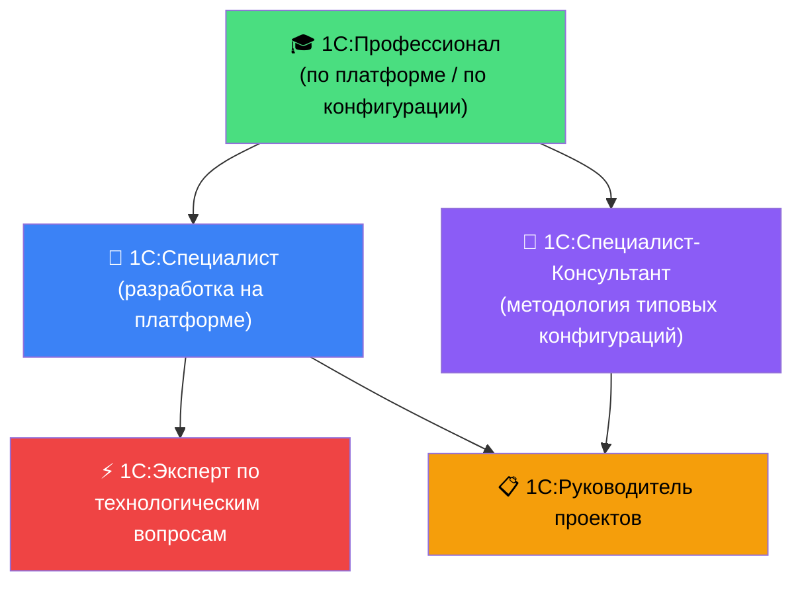

# 🏆 Система сертификации 1С в 2026 году

[← Компетенции](03_Competencies.md) | [Ресурсы →](05_Resources.md)

---

> Официальная сертификация фирмы «1С» — это объективное подтверждение квалификации, ценное как для личного развития, так и для карьеры в компаниях-франчайзи (выполнение партнёрских квот для получения статусов «Центр ERP», «Центр компетенций»).

---

## Карта пререквизитов и треков

---

## Три карьерных сертификационных трека

| Трек | Профессионал | Специалист | Высшая ступень |
|---|---|---|---|
| **🔧 Разработчик** | 1С:Профессионал по платформе | 1С:Специалист по платформе | 1С:Эксперт по ТВ |
| **💼 Консультант/Аналитик** | 1С:Профессионал по конфигурации | 1С:Специалист-Консультант (по БП/УТ/ERP/ЗУП) | 1С:Руководитель проектов |
| **👔 Управление** | — | — | 1С:Руководитель проектов |

---

## 🎓 1С:Профессионал

Базовое тестирование знаний платформы или конфигурации. Первая ступень на любом треке.

- **Формат:** 30 вопросов, 30 минут, порог — 90% правильных ответов. Тест в автоматической системе.
- **Виды:**
  - **По платформе** — знание архитектуры 1С:Предприятия, объектов метаданных, языка BSL, языка запросов.
  - **По конфигурации** (БП, УТ, ERP, ЗУП и др.) — знание конкретного прикладного решения.
- **Когда сдавать:** После изучения BSL, основных объектов метаданных и базового языка запросов (≈ 2–3 месяц обучения).
- **Стоимость:** уточняйте на [1c.ru/prof](https://www.1c.ru/prof/).

**💡 Стратегия подготовки:**
- Приложение **1С:Ник** (iOS/Android) — база вопросов с объяснениями.
- Разберите каждый вопрос, вызвавший сомнение — не просто запомните ответ, поймите суть.
- Рекомендуемая подготовка: 3–4 недели после изучения материала платформы.

> ⚠️ Не путайте подготовку к «1С:Профессионал» с подготовкой к «1С:Специалист». Заучивание ответов из тестов без понимания платформы приведёт к провалу на практическом экзамене.

---

## 🔧 1С:Специалист (Разработчик)

Практический экзамен для разработчиков. Самый весомый сертификат в треке разработки.

- **Формат:** 3–5 часов. Практическое задание за компьютером: реализовать функциональность конфигурации «с нуля» или доработать существующую. Сдача возможна в Конфигураторе (основной вариант); сдача в 1С:EDT — уточняйте актуальный регламент на сайте.
- **Виды:** По платформе 8.3, по конкретным конфигурациям (1С:БП, 1С:УТ, 1С:ERP и др.).
- **Дистанционная сдача:** Доступна через авторизованные инфогруппы с ограниченным доступом к справочным материалам — уточняйте актуальный регламент.

**Критерии оценки (на что смотрит комиссия):**
- ✅ Корректность движений по регистрам и проводок
- ✅ Применение **управляемых блокировок** (а не автоматических)
- ✅ Соответствие **стандартам разработки 1С** (ИТС: именование переменных, комментарии, клиент-серверная модель)
- ✅ Применение **Расширений** вместо прямого изменения типовых модулей
- ❌ Штрафы за «грязный код», избыточные серверные вызовы, нарушение клиент-серверной модели

**💡 Стратегия подготовки:**
- Практика решения реальных задач (не только «галочка» тестов).
- Изучение стандартов разработки 1С на ИТС: [its.1c.ru/db/v8std](https://its.1c.ru/db/v8std).
- Курсы «Подготовка к 1С:Специалист» от [Учебного центра №1](https://uc1.1c.ru).
- Разборы экзаменационных билетов на YouTube (1С:УЦ1, Желтый Чайник).

---

## 💼 1С:Специалист-Консультант

Экзамен для аналитиков и консультантов по внедрению типовых конфигураций.

- **Формат:** Практическое задание по настройке и методологии конкретного прикладного решения (не написание кода, а конфигурирование). Включает собеседование.
- **Виды:** По 1С:БП, 1С:УТ, 1С:ERP, 1С:ЗУП, 1С:УХ, 1С:КА и другим решениям.
- **Ключевые темы:** Методология учёта, настройка учётной политики, регламентированная отчётность, МСФО, маркировка.

---

## ⚡ 1С:Эксперт по технологическим вопросам

Высшая инженерная ступень. Для HighLoad-специалистов с многолетним практическим опытом.

- **Формат:** Многодневная процедура (не «4–5 часов» — это миф). Включает письменный экзамен, практические кейсы и **очную или дистанционную защиту перед комиссией** фирмы «1С». Ожидается реальный опыт работы с высоконагруженными системами.
- **Темы:** Технологический журнал 1С, анализ планов запросов СУБД, расследование дедлоков, настройка кластера серверов, нагрузочное тестирование (1С:КИП/Тест-Центр), Linux CLI, PostgreSQL/MS SQL Server tuning.
- **Пререквизит:** Опыт 1С:Специалист + несколько лет работы с HighLoad.

**💡 Стратегия подготовки:**
- «Настольная книга 1С:Эксперта по технологическим вопросам».
- Практический опыт запуска нагрузочных тестов (1С:КИП).
- Курсы по технологиям HighLoad на [uc1.1c.ru](https://uc1.1c.ru).

---

## 📋 1С:Руководитель проектов

Сертификация для управленцев, внедряющих корпоративные системы.

- **Формат:** Тестирование + собеседование / защита проекта по методологии ТКВ (Технология Корпоративного Внедрения 1С).
- **Для кого:** Руководители проектов (PM), IT-директора.
- **Темы:** Управление проектом внедрения, работа с рисками, организация CI/CD в проектном управлении, BDD-сценарии как живая документация проекта.

---

## 💰 Коммерческая ценность для франчайзи

Сертификаты 1С напрямую влияют на партнёрский статус компании:
- Каждый сертифицированный специалист в штате — это «очки» в рейтинге партнёра.
- Статус **«Центр ERP»** и **«Центр компетенций по КОРП»** требует наличия определённого количества 1С:Специалистов и 1С:Экспертов.
- Пересдача: при провале экзамена — повторная сдача через определённый срок (уточняйте на официальном сайте).

**Официальные ресурсы:**
- [1c.ru/prof](https://www.1c.ru/prof/) — «1С:Профессионал».
- [1c.ru/spec](https://www.1c.ru/spec/) — «1С:Специалист» и «1С:Специалист-Консультант».
- [Учебный центр №1](https://uc1.1c.ru) — официальная подготовка и курсы.

---

[← Компетенции](03_Competencies.md) | [📚 Ресурсы →](05_Resources.md)
