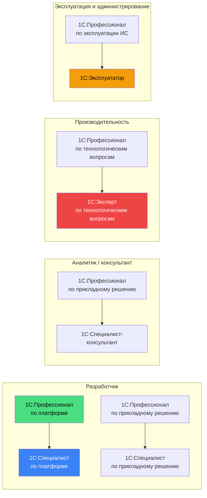

# Сертификация 1С в 2026 году

[← Предыдущий](03_Competencies.md) | [🗺 Оглавление](README.md) | [Следующий →](05_Resources.md)

> Актуализировано: сентябрь 2026.

Сертификаты фирмы «1С» — документ о квалификации, который работодатель может проверить, например по «Паспорту квалификации 1С». В этом файле описаны четыре трека сертификации, форматы экзаменов, планы подготовки к 1С:Профессионалу и 1С:Специалисту по неделям, тренажёры (включая «1С:НИК»), «Паспорт квалификации 1С», центры сертифицированного обучения (ЦСО) и то, какую пользу сертификаты дают в карьере.

> ⚠️ **Как проверяли.** При подготовке этой версии официальные страницы 1c.ru и uc1.1c.ru открыть не удалось. Условия экзаменов взяты из материалов курсов УЦ №1 (конспекты слушателей 2024–2026), каталогов сообщества StackTechnologies1C и Landscape1C (2025–2026) и более ранних публикаций. В таблицах указано, сколько источников подтверждает каждую цифру. Перед записью на экзамен сверяйте условия на официальной странице — ссылка есть у каждого экзамена. Цены экзаменов в роудмапе не приводятся.

Легенда важности: 🔴 обязательно · 🟡 желательно · 🔵 по контексту (зависит от трека и работодателя).

## Содержание

- [Как устроена сертификация](#-как-устроена-сертификация)
- [Сводная таблица экзаменов](#-сводная-таблица-экзаменов)
- [1С:Профессионал](#-1спрофессионал)
- [1С:Специалист](#-1сспециалист)
- [1С:Специалист-консультант](#-1сспециалист-консультант)
- [1С:Эксперт по технологическим вопросам](#-1сэксперт-по-технологическим-вопросам)
- [1С:Эксплуататор](#-1сэксплуататор)
- [Другие сертификаты и проверки](#-другие-сертификаты-и-проверки)
- [«Паспорт квалификации 1С»](#-паспорт-квалификации-1с)
- [УЦ №1, ЦСО и центры сертификации](#-уц-1-цсо-и-центры-сертификации)
- [Ценность для карьеры и франчайзи](#-ценность-для-карьеры-и-франчайзи)
- [Что не подтверждено и где уточнять](#-что-не-подтверждено-и-где-уточнять)
- [Источники](#-источники)

## 🧭 Как устроена сертификация

У всех треков две ступени:

1. **1С:Профессионал** — компьютерный тест на знание платформы или прикладного решения. Это первая ступень любого трека.
2. **Экзамен второй ступени** — практическая работа на компьютере: 1С:Специалист, 1С:Специалист-консультант, 1С:Эксперт по технологическим вопросам или 1С:Эксплуататор. Допуск к нему даёт сертификат 1С:Профессионал **того же направления**.

В каталоге Landscape1C (июнь–июль 2026) в категории «Сертификация от 1С» ровно пять экзаменов: 1С:Профессионал, 1С:Специалист, 1С:Специалист-консультант, 1С:Эксперт по технологическим вопросам и 1С:Эксплуататор. Они складываются в четыре трека:


```mermaid
flowchart LR
    subgraph DEV["Разработчик"]
        PP["1С:Профессионал<br/>по платформе"] --> SP["1С:Специалист<br/>по платформе"]
        PR1["1С:Профессионал<br/>по прикладному решению"] --> SR["1С:Специалист<br/>по прикладному решению"]
    end
    subgraph AN["Аналитик / консультант"]
        PR2["1С:Профессионал<br/>по прикладному решению"] --> SC["1С:Специалист-консультант"]
    end
    subgraph EXPT["Производительность"]
        PT["1С:Профессионал<br/>по технологическим вопросам"] --> EX["1С:Эксперт<br/>по технологическим вопросам"]
    end
    subgraph OPS["Эксплуатация и администрирование"]
        PE["1С:Профессионал<br/>по эксплуатации ИС"] --> EO["1С:Эксплуататор"]
    end
    style PP fill:#4ade80,color:#000
    style SP fill:#3b82f6,color:#fff
    style EX fill:#ef4444,color:#fff
    style EO fill:#f59e0b,color:#000
```

Что важно понимать о схеме:

- **1С:Эксперт по технологическим вопросам не надстраивается над 1С:Специалистом.** Его формальный пререквизит — 1С:Профессионал по технологическим вопросам. Опыт крупных внедрений желателен, но сертификат 1С:Специалист не требуется.
- **Для администраторов и DevOps есть свой трек** — 1С:Профессионал по эксплуатации ИС → 1С:Эксплуататор.
- **Трека «Руководитель проектов» в актуальных перечнях нет.** Сертификат «1С:Руководитель проекта» встречается в перечнях партнёров, последняя датированная запись — 2016 год.
- Треки независимы. Можно получить 1С:Эксперта, не сдавая 1С:Специалиста, и наоборот.

## 📊 Сводная таблица экзаменов

| Экзамен | Ступень | Пререквизит | Формат по данным источников | Подтверждение | Официальная страница |
|---|---|---|---|---|---|
| 1С:Профессионал по платформе | 1, тест | — | 14 вопросов, 30 минут, не менее 12 верных ответов | пять источников 2016–2026 | [1c.ru/prof](https://1c.ru/prof/prof.htm) |
| 1С:Профессионал по прикладному решению | 1, тест | — | тест по конкретной редакции решения (БП, ЗУП, УТ, ERP и др.) | несколько источников | [Редакции экзаменов](https://1c.ru/prof/examred.jsp) |
| 1С:Профессионал по технологическим вопросам | 1, тест | — | тест; условия уточняйте на официальной странице | схема треков и сборник вопросов | [1c.ru/prof](https://1c.ru/prof/prof.htm) |
| 1С:Профессионал по эксплуатации ИС | 1, тест | — | тест; условия уточняйте на официальной странице | схема треков | [1c.ru/prof](https://1c.ru/prof/prof.htm) |
| 1С:Специалист по платформе | 2, практика | Профессионал по платформе | задачи на выдаваемой «каркасной конфигурации», около 4–5 часов | несколько источников, длительность расходится (4 ч и ~5 ч) | [Как получить](https://1c.ru/spec/texts/how_to_get.htm) |
| 1С:Специалист по прикладному решению | 2, практика | Профессионал по тому же решению | учётные задачи и доработка типовой конфигурации | источник ≈2016 и перечни сообщества | [Как получить](https://1c.ru/spec/texts/how_to_get.htm) |
| 1С:Специалист-консультант | 2, практика | Профессионал по тому же решению | практические задачи по внедрению и сопровождению, около 3–5 часов | один источник (2025) | [УЦ №1](https://uc1.1c.ru/ekzameny-1s/spec-konsultant/) |
| 1С:Эксперт по технологическим вопросам | 2, практика и защита | Профессионал по технологическим вопросам | сложные практические задания и защита решений перед комиссией | один источник и каталог 2026 | [Экзамены УЦ №1](https://uc1.1c.ru/ekzameny-1s/) |
| 1С:Эксплуататор | 2, практика и теория | Профессионал по эксплуатации ИС | практика — не менее 3 из 5 задач; теория — 14 из 20 письменных и 3 из 3 устных вопросов | один источник (2025) | [УЦ №1](https://uc1.1c.ru/ekzameny-1s/expluatator/) |

Все экзамены платные. Суммы меняются, поэтому их здесь нет: смотрите на официальных страницах или спрашивайте в центре сертификации.

### Когда сдавать по этапам роудмапа

| Экзамен | Когда | Важность | Что должно быть готово |
|---|---|---|---|
| 1С:Профессионал по платформе | после Этапа 2 | 🔴 | Сделаны P1–P2, в учебном тесте стабильно 13–14 верных ответов из 14 |
| 1С:Профессионал по прикладному решению | Этап 4 и позже, когда работаете с конкретной типовой | 🔵 | Опыт с этой типовой; нужен, если хотите сдавать 1С:Специалиста или консультанта по ней |
| 1С:Специалист по платформе | после Этапа 5 | 🟡 | Сделаны P2–P6, прорешан сборник задач, два полных прогона на время |
| 1С:Специалист-консультант | после опыта внедрения | 🔵 | Трек [аналитика и консультанта](tracks/analyst-consultant.md) |
| 1С:Профессионал по ТВ → 1С:Эксперт | Этап 7, трек производительности | 🔵 | Проект P14, стенд с кластером и СУБД, опыт разбора ТЖ — см. [трек](tracks/performance-expert.md) |
| 1С:Профессионал по эксплуатации ИС → 1С:Эксплуататор | Этап 7, трек администрирования | 🔵 | Кластер, СУБД, Linux, резервирование — см. [трек](tracks/administrator-operator.md) |

Этапы подробно описаны в [02_Timeline.md](02_Timeline.md), проекты P0–P17 — в [07_Projects.md](07_Projects.md).

## 🎓 1С:Профессионал

### Формат и правила

- **Формат.** Компьютерный тест: 14 вопросов, выбранных случайно из базы, 30 минут. Для сертификата нужно не менее 12 верных ответов, то есть допускается не более двух ошибок. Эти цифры совпадают в пяти независимых источниках за 2016–2026 годы, включая материалы курса УЦ №1 2026 года. Встречающиеся в сети «30 вопросов, порог 90%» неверны.
- **Виды:** по платформе «1С:Предприятие 8.3»; по прикладным решениям с привязкой к редакции (например, «1С:Бухгалтерия 8», ЗУП, УТ 11, ERP 2, Розница, УНФ); по технологическим вопросам; по эксплуатации информационных систем.
- **Редакция.** Базы вопросов привязаны к редакциям решений. Перед записью проверьте, по какой редакции принимают тест, на странице [«Актуальные редакции экзаменов»](https://1c.ru/prof/examred.jsp).
- **Версия 8.5.** Упоминаний тестов по «1С:Предприятию 8.5» не найдено. Готовьтесь по 8.3 и сверяйте редакцию на examred.jsp.
- **Пересдача.** По данным сообщества (публикации 2016 и 2025 годов), при неудаче вторая попытка бесплатна и её можно пройти сразу в том же центре. Официально это не подтверждено — уточните на [1c.ru/prof](https://1c.ru/prof/prof.htm).
- **Дистанционная сдача.** Единственное упоминание — «для удалённых регионов доступны дистанционные экзамены через франчайзи» (StackTechnologies1C, 2025). Спрашивайте в центре сертификации.
- **Попытка в составе курса.** В некоторые курсы УЦ №1 (например, «Интенсивное обучение программированию в 1С», поток лета 2026) и ЦСО входила бесплатная попытка сдать 1С:Профессионал в ограниченный срок после курса. Проверьте описание курса, прежде чем оплачивать экзамен отдельно.

### Инструменты подготовки и 1С:НИК

| Инструмент | Что даёт | Доступ |
|---|---|---|
| [1С:Учебное тестирование](https://uc1.1c.ru/uchebnoe-testirovanie/) | По данным сообщества, тот же формат, что на экзамене, и неограниченное число попыток | Бесплатно |
| [Платное учебное тестирование](https://uc1.1c.ru/course/platnoe-1s-uchebnoe-testirovanie/) | Показывает правильные ответы, доступ на ограниченный срок | Платно |
| Мобильный тренажёр [«1С:НИК»](https://uc1.1c.ru/mobile/) | Вопросы из базы на смартфоне | Вход по учётной записи УЦ №1, тренажёр внутри приложения платный |
| Сборник вопросов с ответами | Печатный сборник к тесту; по технологическим вопросам есть отдельный сборник 1С-Паблишинг | Платно |
| Учебная база на своём компьютере | Проверка спорного вопроса на практике | [Учебная версия](https://online.1c.ru/catalog/free/28765768/) — бесплатно |

**Про «1С:НИК».** Это мобильный тренажёр УЦ №1 для подготовки к 1С:Профессионалу, а не «официальная база ответов». Ссылки на магазины приложений, которые раньше гуляли по роудмапам, подтвердить не удалось. Устанавливайте приложение только по ссылкам со страницы [uc1.1c.ru/mobile](https://uc1.1c.ru/mobile/).

### План подготовки на две недели

План рассчитан на тех, кто прошёл Этапы 0–2 и занимается 15–20 часов в неделю. Сообщество называет похожий срок: 1,5–2 недели интенсивной подготовки после базового курса.

| Когда | Что делать | Результат |
|---|---|---|
| День 1 | Два прогона бесплатного учебного теста без подготовки. Заведите журнал ошибок: вопрос, тема, почему ошиблись, где проверили ответ | Исходный балл и список слабых тем |
| Неделя 1 | Каждый день 2 прогона. Каждую ошибку разберите по документации или книге и воспроизведите в учебной базе. Повторяйте по 1–2 слабые темы в день (объекты метаданных, запросы, формы, регистры, права) | Журнал ошибок сгруппирован по темам |
| Неделя 2 | Каждый день 3 прогона, за 30 минут, без подсказок. Проверьте редакцию экзамена на examred.jsp, выберите центр и запишитесь | Стабильно 13–14 из 14 |
| Перед записью | Три прогона подряд дают не меньше 13 верных ответов | Можно сдавать |
| На экзамене | На вопрос в среднем около двух минут. Не задерживайтесь на одном вопросе | — |

Заучивание ответов без понимания помогает сдать тест, но не помогает на собеседовании и на 1С:Специалисте. Если ошибка повторяется, откройте учебную базу и проверьте поведение платформы руками.

## 🔧 1С:Специалист

### Формат

- **Для кого:** разработчики, которые хотят подтвердить практический уровень. В треке [разработчика у франчайзи](tracks/developer-franchise.md) это основной сертификат второй ступени.
- **Пререквизит:** 1С:Профессионал по тому же направлению. Для 1С:Специалиста по платформе нужен Профессионал по платформе, для 1С:Специалиста по «1С:Бухгалтерии» — Профессионал по «1С:Бухгалтерии 8».
- **По платформе:** нужно спроектировать и запрограммировать конфигурацию почти с нуля на основе выдаваемой «каркасной конфигурации».
- **По прикладным решениям:** нужно решить учётные задачи и доработать выбранную типовую конфигурацию. Встречаются направления БП, ЗУП, УТ, УНФ, ЗКГУ.
- **Длительность:** около 4–5 часов. В 2025 году источники называют «4 часа» и «около 5 часов», в описаниях 2016 года — «3–5 часов». Точное время указано в регламенте на [1c.ru/spec](https://1c.ru/spec/texts/how_to_get.htm).
- **Среда разработки:** по умолчанию экзамен сдают в Конфигураторе. Возможность сдавать в 1C:EDT не подтверждена ни одним источником, уточняйте в центре сертификации. Каркасная конфигурация распространяется в формате Конфигуратора. В копиях, которые слушатели выложили на GitHub, поставщик — «УЦ №1», режим совместимости — 8.3.12. Это говорит о режиме учебной конфигурации, а не о версии платформы на экзамене.
- **Версия платформы:** официальный сборник называется «…по платформе «1С:Предприятие 8.3»». Экзаменов по 8.5 не найдено.
- **Оценка.** Официальная шкала в доступных источниках не опубликована. В статьях сообщества разбирают ошибки, за которые снижают оценку: смотрите подборку Инфостарта [«Подготовка к аттестации»](https://infostart.ru/public/all/priemy_i_metody_razrabotki/podgotovka_k_attestacii/). Расширения на экзамене по платформе не нужны: там разрабатывают собственную конфигурацию.

**Материалы:**

- [«Сборник задач для подготовки к экзамену «1С:Специалист» по платформе «1С:Предприятие 8.3»»](https://uc1.1c.ru/product/sbornik-zadach-dlya-podgotovki-k-ekzamenu-1s-spetsialist-po-platforme-1s-predpriyatie-8-3/) — официальное издание фирмы «1С»;
- [консультация к экзамену](https://1c.ru/rus/partners/training/uc1/course.jsp?id=160) и [курс подготовки](https://uc1.1c.ru/course/podgotovka-k-ekzamenu-1s-spetsialist-po-platforme/) УЦ №1;
- чат [@spec1c](https://t.me/spec1c) — «Аттестация 1С:Специалист по платформе», около 13 тыс. участников по данным каталога сообщества за 2024–2025 годы;
- видеокурсы [IRONSKILLS](https://www.youtube.com/@ironskills-1c) с задачами уровня 1С:Специалиста; решения задач с этих курсов — в [university-1c-developer-tools](https://github.com/nikitagordeev10/university-1c-developer-tools);
- неофициальные решения задач сборника: [GoncharovNN/1C-Specialist-for-the-platform](https://github.com/GoncharovNN/1C-Specialist-for-the-platform) и [zeltyr/1c_platforma_spec](https://github.com/zeltyr/1c_platforma_spec). Решения не эталонные и могут содержать ошибки: сначала решите задачу сами, потом сравните. Репозитории с «готовыми ответами 2026», созданные случайными аккаунтами, обходите стороной.

### Пять тематических блоков

По материалам курса УЦ №1 (2025) задачи экзамена по платформе делятся на пять блоков:

| Блок | Что уметь | Объекты платформы | Практика в роудмапе |
|---|---|---|---|
| Оперативный учёт | Проведение, остатки и обороты, контроль остатков, списание себестоимости | Документы, регистры накопления, виртуальные таблицы, управляемые блокировки | P2, P3, P5 |
| Бухгалтерский учёт | Проводки, аналитика по субконто, остатки и обороты по счетам | План счетов, план видов характеристик для субконто, регистр бухгалтерии | P6 |
| Сложные периодические расчёты | Начисления с базой, вытеснение по периоду действия, перерасчёты | План видов расчёта, регистр расчёта | задачи сборника |
| Бизнес-процессы | Маршрут, точки, задачи исполнителям, ролевая адресация | Бизнес-процесс, карта маршрута, задача | задачи сборника |
| Разработка форм | Формы документов и справочников, команды, клиент-серверное взаимодействие | Управляемые формы, реквизиты и команды формы, директивы компиляции | P1, P3 |

Регистры бухгалтерии и расчёта, а также бизнес-процессы в рабочих задачах начинающего разработчика встречаются реже. К экзамену их приходится подтягивать отдельно.

### План подготовки на четыре недели

План рассчитан на 15–20 часов в неделю после Этапа 5. Если регистры бухгалтерии и расчёта вы раньше не использовали, выделите на каждый по отдельной неделе: получится шесть недель.

| Неделя | Темы | Практика | Результат недели |
|---|---|---|---|
| 1 | Оперативный учёт, формы | Разберите каркасную конфигурацию. Решите 3–4 задачи сборника на проведение с контролем остатков, каждую по таймеру. Соберите свой шаблон проведения (пример ниже) | Задачи на проведение решаются без подсказок и в пределах времени, которое вы себе задали |
| 2 | Бухгалтерский учёт, периодические расчёты | 2–3 задачи на проводки и субконто, 2–3 задачи на начисления с базой и вытеснением, перерасчёт при изменении данных | Уверенно работаете с регистрами бухгалтерии и расчёта |
| 3 | Бизнес-процессы, повторение слабых мест | 2 задачи на бизнес-процессы с ролевой адресацией. В конце недели — первый полный прогон билета на время (4–5 часов) | Список ошибок по чек-листу ниже |
| 4 | Закрепление | Разбор первого прогона, второй полный прогон. Уточните регламент: время, версию платформы, разрешённые материалы. Запишитесь на экзамен | Билет решается целиком в отведённое время |

Тренируйтесь в Конфигураторе, даже если в работе используете EDT. Решайте без интернета и ИИ-ассистентов: какими материалами можно пользоваться на экзамене, написано в регламенте. Если на экзамене окажется тот же режим совместимости, что в копиях каркаса (8.3.12), возможности более новых режимов могут быть недоступны. Поэтому тренируйтесь на каркасе, не меняя его режим совместимости.

### Чек-лист самопроверки решения

Это не официальные критерии оценки, а рабочие стандарты, по которым удобно проверять себя (подробнее — [11_Checklists.md](11_Checklists.md)):

- [ ] В свойствах конфигурации проверен режим управления блокировкой данных. Контроль остатков сделан с управляемой блокировкой или по схеме стандарта [#661](https://its.1c.ru/db/v8std/content/661/hdoc).
- [ ] Повторное проведение не дублирует движения, при отмене проведения движения очищаются.
- [ ] Нет запросов в цикле: данные собираются одним запросом или пакетом с временными таблицами.
- [ ] Отборы по измерениям заданы в параметрах виртуальных таблиц, а не в `ГДЕ`.
- [ ] Значения передаются параметрами запроса, а не склейкой строк.
- [ ] Серверных вызовов из формы минимум, где контекст формы не нужен — `&НаСервереБезКонтекста`, модальных вызовов нет.
- [ ] Проводки идут по правильным счетам и субконто; у расчётов учтены базовый период и вытеснение.
- [ ] Задачи бизнес-процесса адресованы по ролям, маршрут проходит все ветки.
- [ ] Проверены граничные случаи: пустая табличная часть, повторяющиеся строки, проведение задним числом, нехватка остатка.

### Пример: контроль остатков при проведении

Шаблон для блока «Оперативный учёт» по стандарту #661: сначала записываются движения с блокировкой изменяемых остатков, затем выполняется запрос по отрицательным остаткам. В каркасной конфигурации БСП нет, поэтому сообщение выводится через `СообщениеПользователю`.

```bsl
// Модуль объекта документа РасходТовара (выполняется на сервере).
Процедура ОбработкаПроведения(Отказ, РежимПроведения)

	Движения.ОстаткиТоваров.Записывать = Истина;
	Для Каждого СтрокаТовары Из Товары Цикл
		Движение = Движения.ОстаткиТоваров.ДобавитьРасход();
		Движение.Период = Дата;
		Движение.Склад = Склад;
		Движение.Номенклатура = СтрокаТовары.Номенклатура;
		Движение.Количество = СтрокаТовары.Количество;
	КонецЦикла;

	// Запись с блокировкой изменяемых остатков до конца транзакции.
	Движения.ОстаткиТоваров.БлокироватьДляИзменения = Истина;
	Движения.ОстаткиТоваров.Записать();

	// Остаток на момент документа с учётом его движений.
	Запрос = Новый Запрос;
	Запрос.Текст =
	"ВЫБРАТЬ
	|	ОстаткиТоваровОстатки.Номенклатура КАК Номенклатура,
	|	ОстаткиТоваровОстатки.КоличествоОстаток КАК КоличествоОстаток
	|ИЗ
	|	РегистрНакопления.ОстаткиТоваров.Остатки(
	|			&МоментКонтроля,
	|			Склад = &Склад
	|				И Номенклатура В (&СписокНоменклатуры)) КАК ОстаткиТоваровОстатки
	|ГДЕ
	|	ОстаткиТоваровОстатки.КоличествоОстаток < 0";
	Запрос.УстановитьПараметр("МоментКонтроля", Новый Граница(МоментВремени(), ВидГраницы.Включая));
	Запрос.УстановитьПараметр("Склад", Склад);
	Запрос.УстановитьПараметр("СписокНоменклатуры", Товары.ВыгрузитьКолонку("Номенклатура"));

	Выборка = Запрос.Выполнить().Выбрать();
	Пока Выборка.Следующий() Цикл
		Сообщение = Новый СообщениеПользователю;
		Сообщение.Текст = СтрШаблон(НСтр("ru = 'Не хватает товара %1: %2'"),
			Выборка.Номенклатура, -Выборка.КоличествоОстаток);
		Сообщение.Сообщить();
		Отказ = Истина;
	КонецЦикла;

КонецПроцедуры
```

Условие `КоличествоОстаток < 0` стоит в `ГДЕ` правильно: это отбор по ресурсу результата, в параметры виртуальной таблицы его не перенести. Отбор по складу и номенклатуре — в параметрах. Разбор типичных ошибок проведения есть в [06_FAQ_and_Tips.md](06_FAQ_and_Tips.md).

## 💼 1С:Специалист-консультант

- **Для кого:** консультанты и аналитики, которые внедряют и сопровождают типовые решения. Подробнее о роли — в [треке аналитика и консультанта](tracks/analyst-consultant.md).
- **Что проверяет:** знание типового решения на уровне, достаточном, чтобы внедрить новую функциональность и поставить задачу программисту. Экзамен фокусируется на внедрении, сопровождении и анализе бизнес-процессов.
- **Формат:** решение реальных задач по автоматизации деятельности организации, около 3–5 часов (один источник, 2025). Собеседование в составе экзамена не подтверждено.
- **Пререквизит:** 1С:Профессионал по тому же прикладному решению.
- **Направления**, по которым есть сообщества подготовки (данные 2024–2025): БП, ЗУП, УТ, УНФ, ДО, БГУ, ЗКГУ, УХ (МСФО, бюджетирование) и ERP (регламентированный учёт, управленческий учёт, бюджетирование, управление производством и ремонтами).
- **Материалы:** описание экзамена и примеры билетов на [странице УЦ №1](https://uc1.1c.ru/ekzameny-1s/spec-konsultant/), подборка Инфостарта [«Подготовка к аттестации»](https://infostart.ru/public/all/priemy_i_metody_razrabotki/podgotovka_k_attestacii/), [общий чат групп по аттестациям](https://t.me/+R8HUAlQqeGbU3VbA).
- **Как готовиться:** решайте примеры билетов в демобазе нужной типовой. Повторите методологию учёта: план счетов, типовые проводки, налоги (см. [10_Domain_and_Law.md](10_Domain_and_Law.md)). Для каждой задачи сначала ищите решение настройкой, а не доработкой.

## ⚡ 1С:Эксперт по технологическим вопросам

- **Для кого:** специалисты по производительности и архитекторы крупных внедрений. Трек — [performance-expert.md](tracks/performance-expert.md).
- **Что проверяет:** умение находить и устранять проблемы производительности и принимать нестандартные технические решения. Landscape1C описывает его как «экзамен по оптимизации и нестандартным техническим решениям».
- **Пререквизит:** 1С:Профессионал по технологическим вопросам.
- **Формат:** сложные практические задания и защита решений перед комиссией. Длительность, число этапов и возможность дистанционной защиты не подтверждены. Регламент уточняйте в УЦ №1.

**Путь подготовки:**

1. Сдать 1С:Профессионал по технологическим вопросам. Для него есть сборник «Комплект вопросов сертификационного экзамена 1С:Профессионал по технологическим вопросам» (1С-Паблишинг).
2. Изучить базу знаний [«Технологические вопросы крупных внедрений»](https://kb.1c.ru) и [«Настольную книгу 1С:Эксперта по технологическим вопросам»](https://online.1c.ru/books/book/20752408/) (Е.В. Филиппов, 2-е изд.).
3. Пройти курсы УЦ №1 [«Подготовка к 1С:Эксперту… Основной курс»](https://uc1.1c.ru/course/podgotovka-k-1s-ekspertu-po-tehnologicheskim-voprosam-osnovnoj-kurs/) и [«…Применение методик»](https://uc1.1c.ru/course/podgotovka-k-1s-ekspertu-po-tehnologicheskim-voprosam-primenenie-metodik/).
4. Бесплатно разобрать задачи прошлых экзаменов на developer.1c.ru: [«Разбор задач с экзамена 1С:Эксперт»](https://developer.1c.ru/applications/Console?state=expertcourse).
5. Обсуждать задачи в чате [@OneC_Expert](https://t.me/OneC_Expert) и прочитать личный опыт подготовки: [«Как я стал Экспертом по технологическим вопросам за 3 месяца»](https://infostart.ru/1c/articles/2027654/).

**Типичные темы подготовки** (сводка по методикам ИТС и каталогу Landscape1C, а не официальная программа экзамена):

- классификация проблем производительности (медленно всё, одна операция или отдельные пользователи), APDEX и ключевые операции, счётчики ОС;
- технологический журнал (`logcfg.xml`, события запросов к СУБД, ожиданий, взаимоблокировок, серверных вызовов, исключений);
- управляемые блокировки и блокировки СУБД, уровни изоляции, планы запросов и индексы в PostgreSQL и MS SQL;
- кластер серверов (память, балансировка, отказоустойчивость, требования назначения функциональности), нагрузочное тестирование, обслуживание СУБД и обновление больших баз.

**Практика:** поднимите стенд с кластером 1С и PostgreSQL в сборке для 1С, включите технологический журнал, воспроизведите взаимоблокировку и таймаут на управляемой блокировке и разберите их по журналу. Это ядро проекта P14 из [07_Projects.md](07_Projects.md).

## 🧰 1С:Эксплуататор

- **Для кого:** администраторы и DevOps-инженеры крупных внедрений. Трек — [administrator-operator.md](tracks/administrator-operator.md).
- **Что проверяет:** умение настраивать и поддерживать крупные информационные системы на решениях «1С», находить в них проблемы и устранять их.
- **Пререквизит:** 1С:Профессионал по эксплуатации информационных систем.
- **Формат** (один источник со ссылкой на [страницу УЦ №1](https://uc1.1c.ru/ekzameny-1s/expluatator/), 2025): практическая часть — решить не менее 3 из 5 задач; теоретическая — правильно ответить на 14 из 20 письменных вопросов и на 3 из 3 устных.
- **Что нужно знать:** особенности настройки «1С:Предприятия 8» для крупной системы; администрирование с максимальной доступностью и пропускной способностью при одновременной работе большого числа пользователей; методики базы знаний kb.1c.ru по эксплуатации.

**Материалы:**

- курс УЦ №1 [«Эксплуатация крупных информационных систем»](https://uc1.1c.ru/course/ekspluatatsiya-krupnyh-informatsionnyh-sistem/);
- [база знаний по технологическим вопросам](https://kb.1c.ru);
- [«Методическое пособие по эксплуатации крупных информационных систем на платформе «1С:Предприятие 8»»](https://online.1c.ru/books/book/25227623/);
- [пример вопросов билета](https://static.1c.ru/rus/partners/training/files/exam_expl.docx) (файл .docx);
- технология публикации решений [1cFresh](https://releases.1c.ru/project/FreshPublic) (доступ по подписке ИТС).

## 🧩 Другие сертификаты и проверки

- **1С:Предприятие.Элемент.** Фирма «1С» выпустила сборник «Комплект вопросов сертификационного экзамена на знание ключевых инструментов технологии «1С:Предприятие.Элемент 5.0»» (май 2024). У УЦ №1 есть страница [«Аттестация 1С:Специалист по технологии 1С:Предприятие.Элемент»](https://uc1.1c.ru/course/attestatsiya-1s-spetsialist-po-tehnologii-1s-predpriyatie-element/), но формат, длительность и пререквизиты установить не удалось. Есть неофициальный тренажёр [verDenoise/prof-element](https://github.com/verDenoise/prof-element) по вопросам версии 5.0. Актуальная версия Элемента — 10.0, так что сверяйте, не устарели ли вопросы. Ветка описана в [element-and-mobile.md](tracks/element-and-mobile.md).
- **«1С:Руководитель проекта».** Встречается в перечнях сертификатов партнёров (последняя датированная запись — 2016 год). В перечнях 2025–2026 годов его нет. Об актуальности спрашивайте в УЦ №1.
- **1С-ТестЦентр** ([1c-tc.ru](https://1c-tc.ru)) — независимая онлайн-проверка знаний разработчика с грейдом по баллам. Ниже уровня Middle выдаётся заключение, от Middle и выше — сертификат. Это не сертификация фирмы «1С», связь сервиса с «1С» не проверена. Может пригодиться для самооценки, в дополнение к матрице из [03_Competencies.md](03_Competencies.md).
- **Тесты ИТ-компетенций на Госуслугах** ([gosuslugi.ru/itskills](https://www.gosuslugi.ru/itskills)) — тесты от hh.ru с сертификатом Минцифры. Тестов по 1С там нет (данные на май 2025). Зато можно подтвердить смежные навыки: SQL, PostgreSQL, Git, Linux, Docker.

## 📝 «Паспорт квалификации 1С»

В личном кабинете УЦ №1 можно получить публичную ссылку «Паспорт квалификации 1С» вида `uc1.1c.ru/account/summary/?token=…` и QR-код к ней. По ссылке видны сертификаты и пройденные курсы. Разработчики размещают её в резюме и в профиле на GitHub.

Как использовать:

1. Войдите в личный кабинет на uc1.1c.ru и найдите паспорт квалификации. Название раздела может отличаться.
2. Скопируйте ссылку и сохраните QR-код.
3. Откройте ссылку в режиме инкогнито и убедитесь, что она работает без входа в кабинет.
4. Добавьте ссылку в резюме на hh.ru, в README профиля GitHub и на сайт-портфолио, а QR-код — в печатное резюме.

Работодатель может сам проверить сертификаты по ссылке, без сканов и фотографий бланков. По данным публикаций сообщества, сведения о сертификатах хранятся в базе «1С», поэтому утерянный бланк можно восстановить. О резюме и портфолио подробнее — в [13_Career.md](13_Career.md) и [07_Projects.md](07_Projects.md).

## 🗂 УЦ №1, ЦСО и центры сертификации

- **1С:Учебный центр №1** (uc1.1c.ru, [раздел экзаменов](https://uc1.1c.ru/ekzameny-1s/)) — учебный центр фирмы «1С». Здесь курсы, учебное тестирование, тренажёр «1С:НИК», описания экзаменов второй ступени, личный кабинет с паспортом квалификации. Карта курсов для разработчиков — [постер «Схема подготовки программистов»](https://uc1.1c.ru/poster/poster-prog/).
- **ЦСО — центр сертифицированного обучения.** Это партнёр «1С», который ведёт курсы по программам фирмы «1С» очно или дистанционно. Статус ЦСО относится к обучению, а не к приёму экзаменов. Но у некоторых ЦСО в сертифицированный курс входит тест 1С:Профессионал: при успешной сдаче слушатель получает сертификат.
- **Где сдают экзамены.** Экзамены принимают центры, авторизованные фирмой «1С». В описаниях около 2016 года они названы «авторизованный центр сертификации» (АЦС) и «сертифицированный экзаменационный центр» (СЭЦ), экзамены проходили в компьютерных классах. Актуальный список центров и порядок подачи заявки — на [1c.ru/prof](https://1c.ru/prof/prof.htm) и [1c.ru/spec](https://1c.ru/spec/texts/how_to_get.htm).

## 📈 Ценность для карьеры и франчайзи

**Для соискателя.** В вакансиях 1С сертификаты обычно указаны как «желательные», а не обязательные. 1С:Профессионал — быстрый способ показать базовые знания: он помогает пройти фильтр резюме, особенно у франчайзи. Решение о найме всё равно принимают по тестовому заданию, собеседованию и портфолио (см. [08_Interview.md](08_Interview.md)).

**Для франчайзи.** Наличие сертифицированных сотрудников — одно из условий партнёрских статусов фирмы «1С». Например, статус «1С:Кандидат в Центр ERP» в описании партнёра (около 2017 года) предполагал специалистов по платформе и профессионалов по ERP-решениям. Партнёры указывают число сертификатов как конкурентное преимущество. Конкретные требования к статусам меняются, поэтому цифр здесь нет. Спросите на собеседовании, оплачивает ли компания экзамены и курсы.

Какие сертификаты полезны в разных контекстах работы (оценка авторов):

| Контекст | Что ценится | Комментарий |
|---|---|---|
| Франчайзи | Профессионал по платформе и по решениям, Специалист, Специалист-консультант | Сертификаты работают на статус компании |
| Инхаус | Специалист — плюс; Эксплуататор или Эксперт — для администраторов и экспертов по производительности | Важнее опыт с конкретной системой |
| Продуктовая команда | Сертификаты вторичны | Решают EDT, Git, тесты, код-ревью и портфолио (трек [developer-product.md](tracks/developer-product.md)) |
| Крупные внедрения | Эксперт по технологическим вопросам, Эксплуататор | Подтверждают навыки, которые трудно показать в портфолио |

Зарплаты по уровням собраны в [13_Career.md](13_Career.md). Надёжных данных о том, насколько сертификат повышает зарплату, нет.

## 🔍 Что не подтверждено и где уточнять

| Вопрос | Что известно | Где уточнять |
|---|---|---|
| Условия 1С:Профессионала (14 вопросов, 30 минут, ≥12 верных) | Совпадают в пяти вторичных источниках | [1c.ru/prof/prof.htm](https://1c.ru/prof/prof.htm) |
| Бесплатная вторая попытка | Данные сообщества 2016 и 2025 годов | [1c.ru/prof/prof.htm](https://1c.ru/prof/prof.htm) |
| Дистанционная и онлайн-сдача | Одно упоминание 2025 года, прокторинг нигде не описан | Центр сертификации |
| Экзамены по 8.5 | Упоминаний не найдено | [examred.jsp](https://1c.ru/prof/examred.jsp) |
| 1C:EDT на 1С:Специалисте, версия платформы на экзамене | Не подтверждено | [how_to_get.htm](https://1c.ru/spec/texts/how_to_get.htm), [экзамены УЦ №1](https://uc1.1c.ru/ekzameny-1s/) |
| Длительность 1С:Специалиста | 4 часа или около 5 часов по разным источникам | Регламент экзамена |
| Критерии оценки 1С:Специалиста | Официальная шкала не найдена | Регламент, консультация УЦ №1 |
| Формат 1С:Эксплуататора | Один источник | [Страница УЦ №1](https://uc1.1c.ru/ekzameny-1s/expluatator/) |
| Длительность и этапы 1С:Эксперта | Не подтверждены | УЦ №1 |
| Аттестация по 1С:Элементу | Формат не установлен | [Страница УЦ №1](https://uc1.1c.ru/course/attestatsiya-1s-spetsialist-po-tehnologii-1s-predpriyatie-element/) |
| «1С:НИК» в магазинах приложений | Идентификаторы не найдены | [uc1.1c.ru/mobile](https://uc1.1c.ru/mobile/) |
| Цены экзаменов, требования партнёрских статусов | Не приводим | Официальные страницы, партнёрский отдел франчайзи |

### Что исправлено при актуализации

- Формат 1С:Профессионала — 14 вопросов, 30 минут, не менее 12 верных (было «30 вопросов, порог 90%»); длительность 1С:Специалиста — около 4–5 часов (было «3–5 часов», формулировка около 2016 года).
- Схема треков: убрано ребро «1С:Специалист → 1С:Эксперт», добавлен трек 1С:Эксплуататора, удалён трек «Руководитель проектов» с форматом «ТКВ, CI/CD, BDD».
- Удалены неподтверждённые утверждения: ссылки на магазины приложений для «1С:НИК», «авторизованные инфогруппы», «многодневная процедура» у Эксперта, «штрафная система баллов» и обязательность расширений на 1С:Специалисте, «очки в рейтинге партнёра», статус «Центр компетенций по КОРП».

## 🔗 Источники

Официальные страницы (при актуализации не открывались, сверяйте перед записью): 1С:Профессионал — https://1c.ru/prof/prof.htm и https://1c.ru/prof/examred.jsp; 1С:Специалист — https://1c.ru/spec/texts/how_to_get.htm; экзамены УЦ №1 — https://uc1.1c.ru/ekzameny-1s/ (страницы Специалиста-консультанта и Эксплуататора — в разделах выше); учебное тестирование — https://uc1.1c.ru/uchebnoe-testirovanie/; «1С:НИК» — https://uc1.1c.ru/mobile/.

Вторичные источники, по которым сверены факты:

- Раздел «Сертификация» в [Oxotka/StackTechnologies1C](https://github.com/Oxotka/StackTechnologies1C) (добавлен 18.05.2025) — форматы экзаменов, треки, материалы.
- Каталог [Oxotka/Landscape1C](https://github.com/Oxotka/Landscape1C) — перечень экзаменов «Сертификация от 1С» (карточки июнь–июль 2026), независимые проверки.
- Конспекты курса УЦ №1 «Интенсивное обучение программированию в 1С» (2024–2026) в [OlSiv/my_notes_leaning](https://github.com/OlSiv/my_notes_leaning) — формат теста, средства подготовки.
- Зеркало статей 1clenta.ru (около 2016 года) в [legioner9/d1cv8](https://github.com/legioner9/d1cv8) — исторические описания экзаменов.
- Реестр Telegram-сообществ [SeiOkami/links-one-s](https://github.com/SeiOkami/links-one-s) — чаты подготовки к аттестациям (данные 2024–2025).
- Стандарты разработки — https://its.1c.ru/db/v8std

Полный реестр утверждений с датами проверки — [SOURCES.md](SOURCES.md).

---

[← Предыдущий](03_Competencies.md) | [🗺 Оглавление](README.md) | [Следующий →](05_Resources.md)
