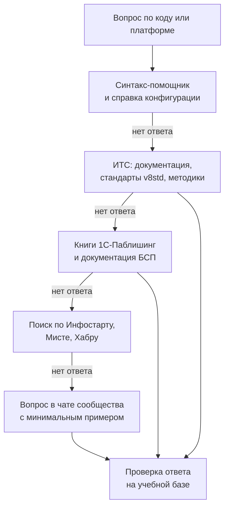

# Ресурсы 1С-разработчика

[← Предыдущий](04_Certifications.md) | [🗺 Оглавление](README.md) | [Следующий →](06_FAQ_and_Tips.md)

> Актуализировано: сентябрь 2026.

Здесь собраны ресурсы, которые мы проверили при актуализации в сентябре 2026 года: официальные сайты, книги, курсы, видео, сообщества, инструменты и конференции. Из прежней версии удалены выдуманные инструменты и неверные ссылки (список — в разделе [Чего избегать](#-чего-избегать)). Каждая позиция помечена тегами, у изменчивых фактов указаны версия или дата.

Если ресурс не открывается или устарел, сообщите через Issue с шаблоном broken_link или outdated, правила — в [CONTRIBUTING.md](CONTRIBUTING.md). Реестр источников и дат проверки ведётся в [SOURCES.md](SOURCES.md).

## Содержание

- [Как пользоваться списком](#-как-пользоваться-списком)
- [Бесплатный старт за один вечер](#-бесплатный-старт-за-один-вечер)
- [Официальные ресурсы фирмы «1С»](#-официальные-ресурсы-фирмы-1с)
- [Книги](#-книги)
- [Курсы и учебные программы](#-курсы-и-учебные-программы)
- [Видео](#-видео)
- [Сообщества, форумы и Telegram](#-сообщества-форумы-и-telegram)
- [Инструменты разработчика от «1С»](#-инструменты-разработчика-от-1с)
- [Open source и DevOps](#-open-source-и-devops)
- [ИИ-инструменты](#-ии-инструменты)
- [Подготовка к экзаменам](#-подготовка-к-экзаменам)
- [Конференции и митапы 2026](#-конференции-и-митапы-2026)
- [Каталоги и навигаторы по экосистеме](#-каталоги-и-навигаторы-по-экосистеме)
- [Смежные роадмапы roadmap.sh](#-смежные-роадмапы-roadmapsh)
- [Ресурсы по трекам](#-ресурсы-по-трекам)
- [Чего избегать](#-чего-избегать)
- [Источники](#-источники)

---

## 🧭 Как пользоваться списком

### Теги

| Тег | Значение |
|---|---|
| [офиц.] | Ресурс фирмы «1С» или её учебного центра |
| [сообщество] | Автор — независимый разработчик, компания-партнёр или сообщество |
| [бесплатно] | Доступно без оплаты, иногда после регистрации |
| [платно] | Нужна оплата или подписка 1С:ИТС. Цены не приводим: они меняются |
| [книга] [видео] [курс] | Формат ресурса |

Если тега цены нет, условия мы не проверили: смотрите их на странице ресурса.

### Правила, по которым составлен список

- **Первоисточник важнее пересказа.** Синтакс-помощник, документация на ИТС и стандарты разработки первичны. Статьи, видео и чаты помогают понять, но спорный вопрос решает первоисточник.
- **Большая часть ИТС платная.** Основные разделы its.1c.ru и дистрибутивы на releases.1c.ru доступны по подписке 1С:ИТС. Для старта хватает бесплатных материалов, а подписка обычно есть у работодателя.
- **Числа с датой.** Число подписчиков Telegram-каналов взято из реестра SeiOkami/links-one-s и отражает май 2025 года. Версии инструментов проверены по релизам на GitHub в сентябре 2026 года.
- **Материалы по 8.2 и обычным формам — не основной источник.** Современная разработка идёт на управляемых формах, в клиент-серверной модели и с расширениями. Материалы старше нескольких лет сверяйте с документацией рабочих линий 8.3.27 и 8.5.1.

### Какие ресурсы нужны на каком этапе

Этапы 0–7 описаны в [02_Timeline.md](02_Timeline.md). В таблице — ядро, остальное добирайте из разделов ниже.

| Этап | Главное | Дополнительно |
|---|---|---|
| Этап 0. Подготовка | Учебная версия платформы, книга Радченко «1С:Программирование для начинающих», постер УЦ №1 [poster-prog](https://uc1.1c.ru/poster/poster-prog/) | Роадмап git-github на [roadmap.sh](https://roadmap.sh); основы учёта — [10_Domain_and_Law.md](10_Domain_and_Law.md) |
| Этап 1. Язык и платформа | «Практическое пособие разработчика», синтакс-помощник, статья ИТС о [немодальном режиме](https://its.1c.ru/docs/v8nonmodal/) | IRONSKILLS «Азы программирования в 1С за 3 часа», Stepik «1С с нуля», домашние задания Нетологии |
| Этап 2. Учётные механизмы | «Практическое пособие разработчика», «Язык запросов», [учебное тестирование](https://uc1.1c.ru/uchebnoe-testirovanie/) УЦ №1 | IRONSKILLS «Запросы в 1С за 3 часа», роадмап sql |
| Этап 3. Отчёты и интерфейс | Книга Хрусталевой по СКД, [новый интерфейс 8.5](https://v8.1c.ru/platforma/new-ui-85/) на v8.1c.ru | Канал «Жёлтый чайник 1С» |
| Этап 4. Типовые конфигурации | «Расширения конфигураций», документация БСП, исходники БСП, учебная «1С:Бухгалтерия 8» | [Информация об обновлениях](https://its.1c.ru/db/updinfo) на ИТС |
| Этап 5. Надёжность и интеграции | [Стандарты разработки](https://its.1c.ru/db/v8std), «Технологии интеграции», сборник задач 1С:Специалист | IRONSKILLS «HTTP в 1С за 3 часа», роадмап api-design |
| Этап 6. Командная разработка | Документация EDT, книга «Используем 1C:EDT», YAxUnit, Vanessa Automation, BSL Language Server | Вебинары «1С:Парк аттракционов», роадмапы code-review и docker |
| Этап 7. Специализация | Раздел [Ресурсы по трекам](#-ресурсы-по-трекам) | Файлы в [tracks/](tracks/README.md) |

### Где искать ответ на вопрос



Прежде чем задать вопрос в чате, воспроизведите проблему на учебной базе и уберите из примера данные клиента: имена, ИНН, суммы и адреса.

---

## 🚀 Бесплатный старт за один вечер

1. Зарегистрируйтесь на [login.1c.ru](https://login.1c.ru/registration): эта учётная запись нужна для учебной версии, портала разработчиков и EDT.
2. Скачайте учебную платформу на [online.1c.ru](https://online.1c.ru/catalog/free/learning.php) после анкеты [офиц.] [бесплатно]. Доступны учебные 8.5.1 и 8.3.27 для Windows, Linux и macOS. Описание есть и на [странице УЦ №1](https://uc1.1c.ru/uchebnaya-versiya-1s/).
3. Когда упрётесь в ограничения учебной версии, получите community-лицензию на [developer.1c.ru](https://developer.1c.ru/applications/Console?state=community): раздел «Лицензии» → «Комьюнити» [офиц.] [бесплатно].
4. Поставьте 1C:EDT через лаунчер 1C:EDT Start с [edt.1c.ru](https://edt.1c.ru/docs/new/download.php) [офиц.] [бесплатно]. Стабильная ветка — 2026.1, ветка 2026.2 пока в статусе релиз-кандидата. До Этапа 6 можно работать в Конфигураторе.
5. Откройте официальную демо-конфигурацию [1C-Company/dt-demo-configuration](https://github.com/1C-Company/dt-demo-configuration) и учебную [«1С:Бухгалтерию 8»](https://v8.1c.ru/podderzhka-i-obuchenie/uchebnye-versii/1s-bukhgalteriya-8-uchebnaya-versiya/), чтобы увидеть код типовых решений.

| | Учебная версия | Community-лицензия |
|---|---|---|
| Где взять | online.1c.ru, после анкеты | developer.1c.ru, раздел «Лицензии» |
| Варианты работы | Только файловый | Шире учебной; точные условия — в лицензионном соглашении на портале |
| Ограничения | Лимиты на число записей в таблицах, нельзя вести реальный учёт, нельзя собирать мобильные приложения для публикации | Лицензия срочная, её нужно продлевать |
| Для чего | Этапы 0–3, книги и курсы | Эксперименты с клиент-серверным вариантом и EDT |

Полные дистрибутивы платформы и типовых конфигураций выдаёт [releases.1c.ru](https://releases.1c.ru) только по подписке 1С:ИТС. Сайт [v8.1c.ru](https://v8.1c.ru) — информационный, платформу оттуда не скачивают.

---

## 🌐 Официальные ресурсы фирмы «1С»

| Ресурс | Что там | Теги |
|---|---|---|
| [its.1c.ru](https://its.1c.ru) | Документация платформы и конфигураций, методики, книги «1С-Паблишинг», информация об обновлениях | [офиц.] [платно], часть разделов открыта |
| [its.1c.ru/db/v8std](https://its.1c.ru/db/v8std) | Система стандартов и методик разработки. Изменения — в разделе [«Новые и измененные разделы»](https://its.1c.ru/db/v8std/content/788/hdoc). Ссылка на стандарт: `its.1c.ru/db/v8std/content/NNN/hdoc` | [офиц.] |
| [its.1c.ru/db/bsp321doc](https://its.1c.ru/db/bsp321doc) | Документация БСП 3.2.1. БСП выходит в редакциях 3.1.12 (для 8.3.24–8.3.27) и 3.2.1 (для 8.5.1) | [офиц.] |
| [its.1c.ru/db/updinfo](https://its.1c.ru/db/updinfo) | Информация об обновлениях типовых конфигураций: что изменилось в релизе, порядок обновления | [офиц.] |
| [v8.1c.ru](https://v8.1c.ru) | Сайт платформы: описания технологий, новости «Новое в платформе», учебные версии | [офиц.] [бесплатно] |
| [wonderland.v8.1c.ru](https://wonderland.v8.1c.ru) | Блог «Заметки из Зазеркалья»: разработчики платформы рассказывают о новых механизмах и планах версий | [офиц.] [бесплатно] |
| [developer.1c.ru](https://developer.1c.ru) | Портал для разработчиков: community-лицензия, вебинары, бесплатные курсы, конференции 1С DevCon и TestCon | [офиц.] [бесплатно] |
| [edt.1c.ru](https://edt.1c.ru/docs/new/download.php) | Скачивание 1C:EDT, [системные требования](https://edt.1c.ru/docs/intro/requirements.php), [FAQ](https://edt.1c.ru/faq/), описания версий | [офиц.] [бесплатно] |
| [online.1c.ru](https://online.1c.ru/catalog/free/learning.php) | Учебные версии платформы и конфигураций, книги | [офиц.] [бесплатно] / [платно] |
| [releases.1c.ru](https://releases.1c.ru) | Дистрибутивы платформы, конфигураций, 1С:Тестировщика, 1С:Сценарного тестирования и других продуктов | [офиц.] [платно] |
| [code.1c.ai](https://code.1c.ai) | 1С:Напарник — ИИ-ассистент разработчика в 1C:EDT, токены доступа по учётной записи 1С:ИТС | [офиц.] |
| [kb.1c.ru](https://kb.1c.ru) | База знаний «Технологические вопросы крупных внедрений»: производительность, блокировки, эксплуатация | [офиц.] |
| [kb.1ci.com](https://kb.1ci.com) | Официальная англоязычная база знаний 1Ci: руководства по платформе и стандарты разработки на английском | [офиц.] |
| [bugboard.v8.1c.ru](https://bugboard.v8.1c.ru/) | Каталог ошибок платформы; для просмотра нужна подписка ИТС. Как сообщать об уязвимостях — в [SECURITY.md](SECURITY.md) | [офиц.] [платно] |
| [github.com/1C-Company](https://github.com/1C-Company) | Официальные репозитории: трекер EDT, плагины EDT, ГитКонвертер, демо-конфигурация, стенд docker_fresh | [офиц.] [бесплатно] |
| [Хабр, блог «1С»](https://habr.com/ru/companies/1c/) | Статьи разработчиков фирмы о платформе и кластере | [офиц.] [бесплатно] |
| [1С:Лекторий](https://portal.1c.ru/applications/1C-Lecture-hall) | Семинары о законодательстве и его отражении в программах 1С. Рассчитаны на бухгалтеров, разработчику дают предметную область | [офиц.] |

Официальные Telegram-каналы и чаты перечислены в разделе [Сообщества](#-сообщества-форумы-и-telegram).

---

## 📚 Книги

Книги издательства «1С-Паблишинг» продаются в печатном виде, многие есть в электронной версии на ИТС. Порядок чтения из конспекта слушателя курса УЦ №1: «Практическое пособие разработчика» (параллельно видеокурс) → «Язык запросов» → книга по СКД → «Разработка интерфейса». После первых двух пунктов уже можно пробовать устроиться к франчайзи и готовиться к 1С:Профессионалу.

| Книга | Автор | Издание | Где читать | Этап |
|---|---|---|---|---|
| «1С:Программирование для начинающих. Детям и родителям, менеджерам и руководителям. Разработка в системе «1С:Предприятие 8.3»» | М.Г. Радченко | 2-е, стереотипное | [its.1c.ru/db/pubprogforbeginners](https://its.1c.ru/db/pubprogforbeginners) | 0–1 |
| «1С:Предприятие 8.3. Практическое пособие разработчика. Примеры и типовые приемы» | М.Г. Радченко, Е.Ю. Хрусталева | 3-е, 2023 | [its.1c.ru/db/pubdevguide83](https://its.1c.ru/db/pubdevguide83) | 1–2 |
| «Язык запросов «1С:Предприятия 8»» | Е.Ю. Хрусталева | 3-е, 2025 | [its.1c.ru/db/pubqlang](https://its.1c.ru/db/pubqlang) | 2–3 |
| «Разработка сложных отчетов в «1С:Предприятии 8». Система компоновки данных» | Е.Ю. Хрусталева | 2-е | [its.1c.ru/db/pubcomplexreports](https://its.1c.ru/db/pubcomplexreports) | 3 |
| «Разработка интерфейса прикладных решений на платформе «1С:Предприятие 8»» | М.Г. Радченко, В.А. Ажеронок | 2-е, стереотипное | печатное издание | 3 |
| «Расширения конфигураций» | Е.Ю. Хрусталева | — | [its.1c.ru/db/pubextensions](https://its.1c.ru/db/pubextensions) | 4 |
| «Практическое пособие разработчика. Используем 1C:EDT» | М.Г. Радченко, Е.Ю. Хрусталева | 2-е, 2026 | [its.1c.ru/db/pubdevguideedt](https://its.1c.ru/db/pubdevguideedt), [страница книги](https://v8.1c.ru/metod/books/208899.htm) | 4–6 |
| «Технологии интеграции «1С:Предприятия 8.3»» | Е.Ю. Хрусталева | карточка ЛитРес — 2023 | печатное и электронное издание | 5 |
| «Сборник задач для подготовки к экзамену «1С:Специалист» по платформе «1С:Предприятие 8.3»» | Фирма «1С» | — | [страница УЦ №1](https://uc1.1c.ru/product/sbornik-zadach-dlya-podgotovki-k-ekzamenu-1s-spetsialist-po-platforme-1s-predpriyatie-8-3/) | 5 |
| «Настольная книга 1С:Эксперта по технологическим вопросам» | Е.В. Филиппов | 2-е | [online.1c.ru](https://online.1c.ru/books/book/20752408/) | 7 |
| Книга по языку 1С:Элемент | Фирма «1С» | — | [its.1c.ru/db/pubelementlang](https://its.1c.ru/db/pubelementlang) | 7 |

Пояснения к таблице:

- Все книги — [офиц.] [книга] [платно]: печатные издания продаются, электронные версии лежат на ИТС, большая часть которого доступна по подписке.
- «Разработка интерфейса…» вышла до интерфейса «Версия 8.5». О новом интерфейсе читайте на [v8.1c.ru](https://v8.1c.ru/platforma/new-ui-85/) и в документации платформы.
- «Настольная книга 1С:Эксперта» — второе издание середины 2010-х. Методики расследования в ней полезны, а версии платформы и СУБД сверяйте с kb.1c.ru и актуальной документацией.
- Книги по платформе 8.2, например «Реализация прикладных задач в системе «1С:Предприятие 8.2»», не берите основным источником. «Азбуку программирования в 1С:Предприятие 8.3» (И. Ощенко, 2015) в список не включаем: это старая коммерческая книга.

---

## 🎓 Курсы и учебные программы

### Официальные

| Курс или материал | Для чего | Теги |
|---|---|---|
| «Интенсивное обучение программированию в 1С» на [uc1.1c.ru](https://uc1.1c.ru) | Программа для начинающих из базового и профильного модулей. В ряд курсов УЦ №1 и ЦСО может входить попытка сдачи 1С:Профессионала: смотрите описание курса | [офиц.] [курс] [платно] |
| [Курс по работе в EDT: от установки до командной разработки](https://uc1.1c.ru/course/kurs-po-rabote-v-edt-ot-ustanovki-do-komandnoj-razrabotki/) | Этап 6: EDT, Git, групповая разработка | [офиц.] [курс] |
| [Из конфигуратора в EDT](https://uc1.1c.ru/course/iz-konfiguratora-v-edt-organizatsiya-protsessa-podgotovki-i-perehoda/) | Переход команды с хранилища на EDT и Git | [офиц.] [курс] |
| [Знакомство с 1С:Напарником](https://uc1.1c.ru/course/znakomstvo-s-1s-naparnik/) | ИИ-ассистент в EDT | [офиц.] [курс] [платно] |
| [Знакомство с 1С:Тестировщиком](https://uc1.1c.ru/course/znakomstvo-s-1s-testirovschikom/) | Официальный инструмент функционального тестирования | [офиц.] [курс] |
| [Тестирование в 1С и создание документации с Vanessa Automation](https://uc1.1c.ru/course/testirovanie-v-1s-i-sozdanie-dokumentatsii-c-ispolzovaniem-vanessa-automation) | BDD-сценарии и документация по ним | [офиц.] [курс] |
| Подготовка к 1С:Эксперту по технологическим вопросам: [основной курс](https://uc1.1c.ru/course/podgotovka-k-1s-ekspertu-po-tehnologicheskim-voprosam-osnovnoj-kurs/) и [применение методик](https://uc1.1c.ru/course/podgotovka-k-1s-ekspertu-po-tehnologicheskim-voprosam-primenenie-metodik/) | Трек производительности | [офиц.] [курс] [платно] |
| [Эксплуатация крупных информационных систем](https://uc1.1c.ru/course/ekspluatatsiya-krupnyh-informatsionnyh-sistem/) | Трек администратора и 1С:Эксплуататора | [офиц.] [курс] |
| [1C:Предприятие.Элемент Скрипт. Знакомство со встроенным языком](https://uc1.1c.ru/course/1c-predpriyatie-element-skript-znakomstvo-so-vstroennym-yazykom-krossplatformennogo-instrumenta-na-prostyh-primerah/) | Скрипты развёртывания и администрирования | [офиц.] [курс] |
| Бесплатные курсы developer.1c.ru: [планы запросов](https://developer.1c.ru/applications/Console?state=queryplancource), [PostgreSQL](https://developer.1c.ru/applications/Console?state=postgresqlcourse), [разбор задач экзамена 1С:Эксперт](https://developer.1c.ru/applications/Console?state=expertcourse) | Производительность и СУБД, Этапы 5–7 | [офиц.] [курс] [бесплатно] |
| Серия вебинаров «1С:Парк аттракционов» на developer.1c.ru, материалы — [matvey-seregin/amusement-park](https://github.com/matvey-seregin/amusement-park) | Разработка в EDT с нуля, git flow, обновления. Записи — на YouTube-канале @e1c_community и в VK Видео | [офиц.] [видео] [бесплатно] |
| [«Раскладка Чистова»](https://uc1.1c.ru/raskladka_chistova) | Бесплатный материал УЦ №1 для программиста 1С | [офиц.] [бесплатно] |
| Постеры УЦ №1: [схема подготовки программистов](https://uc1.1c.ru/poster/poster-prog/), [схема изучения курсов](https://uc1.1c.ru/poster/shema-start/), [стандарты квалификации](https://uc1.1c.ru/poster/poster-standarts/) | Сравнить свой план с официальной схемой | [офиц.] [бесплатно] |
| 1С:Учебный центр №3 ([1c-uc3.ru](https://1c-uc3.ru)) | Курсы для администраторов, в том числе по MS SQL Server для 1С | [офиц.] [курс] |

### Независимые школы и открытые курсы

| Школа или курс | Что даёт | Теги |
|---|---|---|
| IRONSKILLS: канал [@ironskills-1c](https://www.youtube.com/@ironskills-1c) и [сайт](https://ironskills.by) | Бесплатные видео «Азы программирования в 1С за 3 часа», «Запросы в 1С за 3 часа», «HTTP в 1С за 3 часа»; платная подготовка к 1С:Специалисту | [сообщество] [видео] [курс] |
| [«1С с нуля. Первые шаги в программировании»](https://stepik.org/course/279107) на Stepik | Первые задачи на встроенном языке | [сообщество] [курс] [бесплатно] |
| «Василий Про 1С» на Stepik: [основы](https://stepik.org/course/185939), [запросы](https://stepik.org/course/218864), [СКД](https://stepik.org/course/187221) | Короткие курсы для Этапов 1–3 | [сообщество] [курс] |
| [Нетология, домашние задания](https://github.com/netology-code/1c-homeworks) | Три блока заданий и дипломы на сквозной конфигурации «Управление ИТ-фирмой». Хороший набор практики с требованиями к качеству кода | [сообщество] [бесплатно] |
| [Курсы-по-1С.рф](https://xn----1-bedvffifm4g.xn--p1ai/courses/dev-edt-and-git/) (Е. Гилёв, Ф. Насипов) | «Профессиональная разработка в 1С:EDT + Git», «Сценарное тестирование в 1С»; на сайте есть бесплатные статьи | [сообщество] [курс] [платно] |
| [Инфостарт, обучение](https://infostart.ru/edu/) | Бесплатный мини-курс [«Разработчик 1С»](https://infostart.ru/edu/2188818/), [курс по автотестированию](https://infostart.ru/va-course) | [сообщество] [курс] |
| [SilverBulleters](https://silverbulleters.org/courses-bbd) | «Тестирование в 1С — от простого к сложному» | [сообщество] [курс] |
| Николай Габур, [курс на RUTUBE](https://rutube.ru/channel/48987331/) | Курс «с нуля в 1С» 2025 года | [сообщество] [видео] [бесплатно] |

Как выбрать курс: спросите, на какой версии платформы идёт обучение, есть ли проверка домашних заданий с разбором кода и учат ли стандартам: запросы вне цикла, клиент-серверное разделение, управляемые блокировки. Курс без практики с обратной связью заменяется книгой и учебным тестированием. Пиратские раздачи курсов не используйте: материалы в них часто устаревшие, а сами раздачи нарушают права авторов.

---

## 📺 Видео

| Канал | Автор | Темы | Для кого |
|---|---|---|---|
| [Курсы 1С и экзамены (1С:Учебный центр №1)](https://www.youtube.com/channel/UCY5KNuYZAp2a67pOZGdpdDg) [офиц.] | УЦ №1 | Официальный канал учебного центра | Все уровни |
| [Сообщество 1С-разработчиков](https://www.youtube.com/@e1c_community) [офиц.] | developer.1c.ru | Вебинары портала разработчиков, «Getting Started with 1C:EDT», «1С:Парк аттракционов» | Этапы 4–6 |
| [IRONSKILLS - Курсы по 1С](https://www.youtube.com/@ironskills-1c) [сообщество] | IRONSKILLS | Язык, запросы, HTTP, БСП, подготовка к Специалисту | Этапы 1–5 |
| [Жёлтый чайник 1С](https://www.youtube.com/@JuniorOneS) [сообщество] | Виталий Черненко | СКД, недокументированные приёмы, проверка знаний | Этапы 2–5 |
| Желтый клуб — 1С программирование [сообщество] | Евгений Шилов | Обзорные видео, например «Суть 1С программирования за 25 минут» | Этап 0 |
| Лапицкий, что не так с этим кодом? [сообщество] | Алексей Лапицкий | Разбор кода, запросы для начинающих | Этапы 1–3 |
| [Василий Про 1С](https://www.youtube.com/@VasiliiPro1C) [сообщество] | — | Основы для начинающих, есть курсы на Stepik | Этапы 0–2 |
| [Е.БУДНИ программиста 1С](https://www.youtube.com/@e_budni_programmer_1C) [сообщество] | Роман Чумадин | Разборы и эфиры с ответами на вопросы (2026) | Этапы 3–6 |
| Программирование в 1С с Ильясом Низамутдиновым [сообщество] | Ильяс Низамутдинов | Курс «Объекты 1С», марафон по основам | Этапы 1–2 |
| [1С:Сценарное тестирование](https://www.youtube.com/channel/UCbdRui0PGMp9lqhvnVJcRzA) | — | Ролики по 1С:Сценарному тестированию; официальность канала не проверена | Трек QA |

Записи конференций Инфостарта и 1С DevCon 2026 выкладываются в [VK Видео](https://vkvideo.ru) (сообщества Инфостарта и developer.1c.ru) и на [infostart.ru](https://infostart.ru). Канал «Илья Леонтьев Про 1С» переименован в «Бывший 1Сник», автор ушёл из 1С: как актуальный источник его не рекомендуем.

---

## 💬 Сообщества, форумы и Telegram

### Порталы и форумы

| Ресурс | Что там | Теги |
|---|---|---|
| [Инфостарт](https://infostart.ru) | Статьи, публикации и обработки, [форум](https://forum.infostart.ru), журнал, курсы, конференции | [сообщество] |
| [Миста](https://mista.ru/) | Один из старейших форумов по 1С, темы вида `www.mista.ru/topic/ID`. Старые ссылки на forum.mista.ru ещё встречаются | [сообщество] [бесплатно] |
| [FastCode](https://fastcode.im) | Шаблоны кода и каталог разработок | [сообщество] [бесплатно] |
| [Хабр](https://habr.com/ru/companies/1c/) | Блог фирмы «1С» и статьи сообщества | [бесплатно] |
| [1c-dn.com](https://1c-dn.com) | Англоязычные обзоры «New features in 8.3.x» и форум с ответами сотрудников «1С» | [бесплатно] |
| [helpme1c.ru](https://helpme1c.ru) | Статьи Владимира Милькина для начинающих; актуальность в 2026 году не проверяли | [сообщество] [бесплатно] |

### Telegram

Численность — по реестру [SeiOkami/links-one-s](https://github.com/SeiOkami/links-one-s), данные на май 2025 года (у части каналов — январь 2025). Активность в сентябре 2026 года мы не проверяли.

| Группа | Каналы и чаты |
|---|---|
| Официальные | [@company1c](https://t.me/company1c) — новости «1С» для разработчиков (около 5 тыс.); [@e1c_community](https://t.me/e1c_community) — «Сообщество 1С-разработчиков», чат (около 11 тыс.); [@e1c_edt](https://t.me/e1c_edt) — группа 1C:EDT (около 4 тыс.); [@e1c_edt_plugindev](https://t.me/e1c_edt_plugindev) — плагины EDT; [@e1c_element](https://t.me/e1c_element) — 1С:Предприятие.Элемент (около 2 тыс.) |
| Общие | [@yellowclub_official](https://t.me/yellowclub_official) — «Желтый клуб», сообщество программистов 1С с офлайн-встречами (около 10 тыс.); [@onecv8](https://t.me/onecv8) — «1С:Предприятие 8» (около 11 тыс.); [@FastCodeIM](https://t.me/FastCodeIM) — FastCode (около 9 тыс.); [@ru_1c](https://t.me/ru_1c) — чат «1C Россия» (около 8 тыс.); [@ssl1c](https://t.me/ssl1c) — БСП, DevOps и архитектура (около 3 тыс.) |
| Авторские | [@JuniorOneS](https://t.me/JuniorOneS) — Виталий Черненко; [@kuntashov_devnotes](https://t.me/kuntashov_devnotes) — Александр Кунташов: VA, DevOps, OneScript; [@nixel2007_thoughts](https://t.me/nixel2007_thoughts) — Никита Федькин; [@AriN1C](https://t.me/AriN1C) — Никита Арипов, автор Landscape1C; [@e_budni_programmer](https://t.me/e_budni_programmer) — Роман Чумадин |
| Тестирование и DevOps | [@testspro1c](https://t.me/testspro1c) — тестирование, чат авторов VA (около 3 тыс.); [@VanessaAutomation](https://t.me/VanessaAutomation); [@oscript_library](https://t.me/oscript_library) — OneScript; [@bsl_language_server](https://t.me/bsl_language_server); [@edt1c](https://t.me/edt1c) — неофициальный чат по EDT; [@devops1c](https://t.me/devops1c) |
| Специализация | [@OneC_Expert](https://t.me/OneC_Expert) — подготовка к 1С:Эксперту (около 3 тыс.); [@spec1c](https://t.me/spec1c) — аттестация 1С:Специалист по платформе (около 13 тыс.); [@PostgreSQL_1C_Linux](https://t.me/PostgreSQL_1C_Linux); [@adm_1c](https://t.me/adm_1c) — администрирование; [@analyst_1c](https://t.me/analyst_1c) — аналитики и архитекторы; [@SPPR1c](https://t.me/SPPR1c) — СППР; [@onec_neurofish](https://t.me/onec_neurofish) — LLM и 1С |
| Начинающим | [@razrab1c](https://t.me/razrab1c) — «Junior 1С / Стажёры» (около 4 тыс.); [@sobes1c](https://t.me/sobes1c) — подготовка к собеседованиям |

Каналы вакансий (@jobs1c, @esres_1c и другие) собраны в [13_Career.md](13_Career.md). Неофициальное зеркало блога Зазеркалья — [@wonderland_1C](https://t.me/wonderland_1C).

Правила хорошего вопроса в чате: сначала поиск по чату и ИТС, затем версия платформы и конфигурации, минимальный пример кода, текст ошибки целиком, что уже пробовали. Не выкладывайте код и данные клиента без разрешения.

---

## 🔧 Инструменты разработчика от «1С»

| Инструмент | Что это | Статус на сентябрь 2026 | Теги |
|---|---|---|---|
| Конфигуратор | Базовая среда разработки, входит в платформу | Развивается; обычные формы редактируются только в нём; хранилище конфигурации работает | [офиц.] |
| [1C:EDT](https://edt.1c.ru/docs/new/download.php) | IDE на Eclipse со встроенным Git | Стабильная ветка 2026.1 (патч 2026.1.3), 2026.2 — релиз-кандидат (Java 25). Проекты 8.5 — с EDT 2025.1 | [офиц.] [бесплатно] |
| 1cedtcli | Командная строка EDT: `import`, `export`, `build` и другие команды | Заменила утилиту ring для EDT; ring по-прежнему активирует программные лицензии | [офиц.] [бесплатно] |
| ibcmd | Утилита автономного сервера: выгрузка и загрузка конфигурации в XML без кластера | Входит в платформу | [офиц.] |
| [1С:ГитКонвертер](https://github.com/1C-Company/GitConverter) | Перенос истории хранилища конфигурации в Git в формате EDT | Официальный, бесплатный | [офиц.] [бесплатно] |
| [1C:Code style V8](https://github.com/1C-Company/v8-code-style) | Плагин EDT с проверками по стандартам v8std | Встроен в EDT; версия 0.8.0 собрана под EDT 2026.2 | [офиц.] [бесплатно] |
| [ssl-support](https://github.com/1C-Company/ssl-support), [dt-project-checks](https://github.com/1C-Company/dt-project-checks) | Плагины EDT для разработки на БСП и проверки целостности проекта | Последний релиз ssl-support рассчитан на EDT 2022.1 — проверяйте совместимость | [офиц.] [бесплатно] |
| [1С:АПК](https://v8.1c.ru/tekhnologii/1s-avtomatizirovannaya-proverka-konfiguratsiy/) | Автоматизированная проверка конфигураций на соответствие стандартам | Версию не называем; замечания импортируются в SonarQube | [офиц.] |
| 1С:Тестировщик и 1С:Сценарное тестирование | Функциональное тестирование. Сценарное тестирование входит в КИП ([документация](https://its.1c.ru/db/kip/content/66/hdoc)), Тестировщик — облегчённая версия для знакомства | Дистрибутивы на releases.1c.ru; версии не называем | [офиц.] |
| 1С:КИП ([документация](https://its.1c.ru/db/kip)) | Корпоративный инструментальный пакет: ЦУП, ЦКК, Тест-центр | Версию не называем | [офиц.] [платно] |
| [1С:Предприятие.Элемент Скрипт](https://1cmycloud.com/console/help/lang/docs/topics/what-is-1c-element-script/) | Бывший 1С:Исполнитель: скрипты развёртывания и администрирования, своя IDE с отладчиком | Линейка 9.x, распространяется свободно | [офиц.] [бесплатно] |
| [1С:СППР](https://its.1c.ru/db/sppr2doc) | Проектирование решений: требования, функциональная модель, тестирование | Редакция 2.1 работает только на 8.5.1+ | [офиц.] [платно] |
| [1С:Напарник](https://code.1c.ai) | ИИ-ассистент разработчика в EDT | Подробнее — в разделе [ИИ-инструменты](#-ии-инструменты) | [офиц.] |
| [1c-edt-issues](https://github.com/1C-Company/1c-edt-issues) | Публичный трекер пожеланий и ошибок EDT | Читайте перед обновлением EDT | [офиц.] [бесплатно] |

Официального расширения VS Code от «1С» нет. Для чтения кода в VS Code используют расширение сообщества [Language 1C (BSL)](https://github.com/1c-syntax/vsc-language-1c-bsl).

---

## 🧰 Open source и DevOps

Версии — по релизам на GitHub в сентябре 2026 года. Подробно о процессах качества — в [tracks/developer-product.md](tracks/developer-product.md) и [tracks/qa-automation.md](tracks/qa-automation.md).

| Проект | Назначение | Версия и статус |
|---|---|---|
| [Vanessa Automation](https://github.com/Pr-Mex/vanessa-automation) | BDD- и UI/E2E-тесты: сценарии на Turbo Gherkin, шаги выполняются через клиент тестирования; отчёты Allure | 1.2.043.42 (09.09.2026); с 1.2.043.12 встроен MCP-сервер |
| [YAxUnit](https://github.com/bia-technologies/yaxunit) + [edt-test-runner](https://github.com/bia-technologies/edt-test-runner) | Модульные тесты в виде расширения, моки, запуск из EDT, отчёты jUnit и Allure | 25.12 |
| [vanessa-runner](https://github.com/vanessa-opensource/vanessa-runner) | CLI для CI: сборка cf и cfe, операции с базой, запуск тестов, покрытие, vrunner-mcp | 3.0.2 (25.09.2026), нужен OneScript 2; ветка 2.6 — LTS |
| [OneScript](https://github.com/EvilBeaver/OneScript) + [oscript-library](https://github.com/oscript-library) | Скрипты на языке 1С без платформы, пакетный менеджер opm | 2.2.0 (05.09.2026), на .NET 8 |
| [BSL Language Server](https://github.com/1c-syntax/bsl-language-server) | LSP и статический анализ BSL, CLI-отчёты для CI | 1.0.7, в разработке 1.1.0; нужен JDK 21; экспериментальный режим MCP |
| [sonar-bsl-plugin-community](https://github.com/1c-syntax/sonar-bsl-plugin-community) | BSL в SonarQube, импорт замечаний АПК и EDT | 1.20.0; SonarQube 25.4+ и Java 21 |
| [Coverage41C](https://github.com/1c-syntax/Coverage41C) | Замер покрытия через сервер отладки | Последний релиз — декабрь 2024, развивается слабо |
| [precommit4onec](https://github.com/bia-technologies/precommit4onec) | Git-хуки: разбор и проверки исходников при коммите | 25.12 |
| [gitsync](https://github.com/oscript-library/gitsync) | Синхронизация хранилища конфигурации с Git: каждая версия хранилища — коммит | 3.8.0 |
| [jenkins-lib](https://github.com/firstBitMarksistskaya/jenkins-lib) + [onec-docker](https://github.com/firstBitMarksistskaya/onec-docker) | Готовый Jenkins-пайплайн и Docker-образы для CI | jenkins-lib 0.16.2, нужен Jenkins 2.524+ |
| [Тестер](https://github.com/grumagargler/tester) | Независимая система сценарного тестирования с записью действий пользователя | Не продукт «1С» |
| [Универсальные инструменты](https://github.com/cpr1c/tools_ui_1c) | Набор инструментов разработчика «Универсальные инструменты» | Один из самых популярных проектов сообщества на GitHub |
| [OpenIntegrations](https://github.com/Bayselonarrend/OpenIntegrations) | «Открытый пакет интеграций» для 1С и OneScript | Есть CLI и MCP |
| [1c-syntax/ssl_3_1](https://github.com/1c-syntax/ssl_3_1), [ssl_3_2](https://github.com/1c-syntax/ssl_3_2) | Исходники БСП для изучения и поиска примеров | Зеркала сообщества |
| [vscode-turbogherkin-support](https://github.com/ChernyakAI/vscode-turbogherkin-support) | Подсветка и сниппеты Turbo Gherkin в VS Code | Расширение сообщества |
| [docker_fresh](https://github.com/1C-Company/docker_fresh) | Официальный стенд 1С:Фреш в контейнерах | Для разработки и тестирования, не для продуктива |

Все проекты в таблице — [сообщество] [бесплатно], кроме docker_fresh, это [офиц.]. В EDT нет встроенной интеграции с Jenkins, GitLab CI или GitHub Actions: пайплайн собирают из 1cedtcli, ibcmd, vanessa-runner и jenkins-lib. Официального production-образа Docker для сервера 1С нет. Дистрибутивы для образов скачиваются с releases.1c.ru по учётной записи ИТС.

Стартовый набор утилит OneScript для Этапа 6 (сначала установите OneScript 2.x):

```bash
# Пакеты ставятся пакетным менеджером opm из OneScript
opm install vanessa-runner
opm install gitsync
opm install precommit4onec
```

Устаревшие и коммерческие проекты:

- **Vanessa ADD** ([vanessa-opensource/add](https://github.com/vanessa-opensource/add)) — отдельный старый фреймворк, релизов с 2023 года нет. Для новых проектов берите YAxUnit и Vanessa Automation.
- **deployka** ([oscript-library/deployka](https://github.com/oscript-library/deployka)) — устарел, последний релиз 2021 года, функции перенесены в vanessa-runner.
- **Infostart Toolkit** — коммерческий набор инструментов разработчика, не open source.

---

## 🤖 ИИ-инструменты

Как встроить ИИ в работу и где проходят правовые границы, описано в [09_AI_Development.md](09_AI_Development.md). Здесь только список проверенных инструментов.

| Инструмент | Что это | Теги |
|---|---|---|
| [1С:Напарник](https://code.1c.ai) | ИИ-ассистент разработчика в 1C:EDT: автодополнение, фоновый анализ кода, агентный чат, который правит код и метаданные. Плагин входит в поставку EDT 2026, токен выдаётся на code.1c.ai по учётной записи 1С:ИТС. Сервис облачный: код уходит на серверы «1С», self-hosted нет, в Конфигураторе Напарника нет. Условия доступа — на code.1c.ai | [офиц.] |
| [Untru/1c-mcp](https://github.com/Untru/1c-mcp) | Курируемый каталог MCP-серверов для 1С | [сообщество] [бесплатно] |
| [cc-1c-skills](https://github.com/Nikolay-Shirokov/cc-1c-skills), [ai_rules_1c](https://github.com/comol/ai_rules_1c) | Наборы skills и правил для агентов: работа с XML-выгрузкой, сборка обработок и расширений, режимы проверки | [сообщество] [бесплатно] |
| [1c-ai-development-kit](https://github.com/Arman-Kudaibergenov/1c-ai-development-kit) | Набор skills для Claude Code под лицензией AGPL-3.0. Это инструкции для агента, а не обученная модель | [сообщество] [бесплатно] |
| [mcp-bsl-platform-context](https://github.com/alkoleft/mcp-bsl-platform-context) | Поиск по синтакс-помощнику для агента, чтобы он не выдумывал методы | [сообщество] [бесплатно] |
| [EDT-MCP](https://github.com/DitriXNew/EDT-MCP) | MCP-сервер к 1C:EDT 2026.1 и 2026.2 с пресетами инструментов Analysis Only, Code Review и Development | [сообщество] [бесплатно] |
| [mcp-onec-test-runner](https://github.com/alkoleft/mcp-onec-test-runner) | Сборка и запуск тестов YAxUnit из агента | [сообщество] [бесплатно] |
| [claude-code-bsl-lsp](https://github.com/1c-syntax/claude-code-bsl-lsp) | Плагин BSL Language Server для Claude Code: диагностика после каждой правки | [сообщество] [бесплатно] |
| [1c_mcp](https://github.com/vladimir-kharin/1c_mcp) | MCP-сервер к живой базе 1С; подключайте только к обезличенной копии под пользователем без прав записи | [сообщество] [бесплатно] |
| [PRISM](https://github.com/genlab-1c/prism) | Открытый бенчмарк LLM на задачах BSL | [сообщество] [бесплатно] |
| [1c-ai-guide](https://github.com/Aleksandr-Litvinenko/1c-ai-guide) | Базовые правила безопасности при подключении ИИ к 1С | [сообщество] [бесплатно] |
| [Ollama](https://github.com/ollama/ollama), [vLLM](https://github.com/vllm-project/vllm) | Запуск open-weight-моделей в своём контуре | [бесплатно] |

Что важно знать при выборе:

- **Качество моделей на BSL разное.** В прогоне PRISM от 25.09.2026 (57 моделей, 35 задач исполняются в 1С 8.3.27) лучшие модели решают 85–100% задач, GigaChat и YandexGPT — 0–13%, малые локальные модели — 0–27%. Сильные open-weight-модели требуют серверного GPU.
- **Доступ к зарубежным агентам ограничен.** По данным каталога Landscape1C, Cursor, Claude Code, Codex и Copilot помечены «доступ из РФ ограничен». Российские ассистенты кода — [GigaCode](https://gitverse.ru/features/gigacode) и [Koda](https://kodacode.ru); их качество на BSL мы не проверяли.
- **MCP не граница безопасности.** Доступ ограничивают права пользователя 1С, обезличенная копия базы и учётная запись только для чтения.
- **Не используйте сторонние мосты к API Напарника**: пользовательское соглашение сервиса допускает работу только из 1C:EDT.

Больше ссылок по теме собрано в подборке [awesome-onec-neurofish](https://github.com/1c-neurofish/awesome-onec-neurofish).

---

## 🏆 Подготовка к экзаменам

Система сертификации, форматы экзаменов и планы подготовки — в [04_Certifications.md](04_Certifications.md). Здесь только инструменты.

| Ресурс | Для чего | Теги |
|---|---|---|
| [1c.ru/prof/prof.htm](https://1c.ru/prof/prof.htm) | Описание экзамена 1С:Профессионал и центры сертификации | [офиц.] |
| [Актуальные редакции экзаменов](https://1c.ru/prof/examred.jsp) | По какой редакции конфигурации принимают тест | [офиц.] |
| [1С:Учебное тестирование](https://uc1.1c.ru/uchebnoe-testirovanie/) | Бесплатный тренировочный тест в формате экзамена | [офиц.] [бесплатно] |
| [Платное учебное тестирование](https://uc1.1c.ru/course/platnoe-1s-uchebnoe-testirovanie/) | Расширенный режим тренировки | [офиц.] [платно] |
| [Мобильный тренажёр «1С:НИК»](https://uc1.1c.ru/mobile/) | Тренажёр УЦ №1, вход по учётной записи УЦ №1, сам тренажёр платный. Это тренажёр, а не официальная база ответов | [офиц.] [платно] |
| [Как получить сертификат 1С:Специалист](https://1c.ru/spec/texts/how_to_get.htm) | Порядок и регламент практического экзамена | [офиц.] |
| Сборник задач 1С:Специалист | См. раздел [Книги](#-книги) | [офиц.] [книга] [платно] |
| [Экзамены на сайте УЦ №1](https://uc1.1c.ru/ekzameny-1s/) | Страницы экзаменов, в том числе [Специалист-консультант](https://uc1.1c.ru/ekzameny-1s/spec-konsultant/) и [Эксплуататор](https://uc1.1c.ru/ekzameny-1s/expluatator/) | [офиц.] |
| [Аттестация по 1С:Предприятие.Элемент](https://uc1.1c.ru/course/attestatsiya-1s-spetsialist-po-tehnologii-1s-predpriyatie-element/) | Для ветки Элемента | [офиц.] |
| Чаты [@spec1c](https://t.me/spec1c) и [@OneC_Expert](https://t.me/OneC_Expert) | Опыт сдававших: Специалист по платформе и Эксперт | [сообщество] |
| [1С-ТестЦентр](https://1c-tc.ru), [тесты ИТ-компетенций на Госуслугах](https://www.gosuslugi.ru/itskills) | Независимая оценка: в ТестЦентре — онлайн-тест разработчика с грейдом; на Госуслугах тестов по 1С нет, но есть Git, SQL, PostgreSQL и Linux | — |

Тренируйтесь решать задачи без интернета и ИИ-ассистентов: правила допустимых материалов определяет регламент экзамена, уточняйте их в центре сертификации.

---

## 🎤 Конференции и митапы 2026

Календарь событий ведёт сообщество на [onevents.ru](https://github.com/bestuzheff/OnEvents). Даты сверены по нему 29.09.2026, перед поездкой проверьте на сайте события.

| Дата | Событие | Город | Кому |
|---|---|---|---|
| 12–14.03.2026 (прошла) | [INFOSTART TEAM EVENT 2026](https://event.infostart.ru/2026team/) | Москва | Разработка, управление проектами, аналитика, ИБ |
| 04.04.2026 (прошла) | [1С DevCon 2026](https://developer.1c.ru/devcon), 6-я, впервые офлайн | Москва | Разработчики; записи — в VK Видео developer.1c.ru |
| 22–23.05.2026 (прошла) | [1CVibeConf 2026](https://vibecoding1c.ru/conference-2) | Онлайн | ИИ в разработке на 1С |
| 14–15.08.2026 (прошла) | [INFOSTART CIO CAMP 2026](https://infostart.ru/event/2408623) | Санкт-Петербург | Руководители ИТ |
| 18.09.2026 (прошла) | [«Жёлтая конфа»](https://cors.su/zhyoltaya-konfa) | Москва | Разработчики |
| 01.10.2026 | Митапы «Желтого клуба» | Москва, Воронеж | Все уровни, особенно начинающие |
| 08–10.10.2026 | [Infostart Tech Event 2026](https://infostart.ru/event/tech2026/), 16-я | Санкт-Петербург | Разработчики, архитекторы, тестировщики |
| 12–14.11.2026 | [Infostart A&PM Event 2026](https://infostart.ru/event/apm2026/) | Санкт-Петербург | Аналитики и руководители проектов |
| 18.11.2026 | [«Безопасная 1С»](https://sec.ussc.ru/1c-security-meetup) | Москва | Безопасность ERP-систем |
| 26.11.2026 | [13-й Бизнес-форум 1С:ERP](https://1c.ru/bf/) | Москва | Внедрение ERP, аналитики, руководители |

Официальная конференция по тестированию [TestCon](https://developer.1c.ru/applications/Console/testcon/) проводится фирмой «1С»; дату в 2026 году мы не нашли. «Желтый клуб» регулярно проводит встречи во многих городах: формат — три доклада и общение.

Что выбрать по уровню:

- **Этапы 0–4.** Городские митапы «Желтого клуба» и записи докладов в VK Видео. Живой митап полезен и для поиска первой работы.
- **Этапы 5–7.** Infostart Tech Event и 1С DevCon. Выступление с коротким докладом на городском митапе — сильная строка в резюме.
- **Аналитики и руководители проектов.** Infostart A&PM Event и Бизнес-форум 1С:ERP.
- **Смежные.** PGConf и PGMeetup для PostgreSQL, если вы идёте в трек производительности или администрирования.

---

## 🧩 Каталоги и навигаторы по экосистеме

| Каталог | Что даёт | Теги |
|---|---|---|
| [Landscape1C](https://github.com/Oxotka/Landscape1C) (landscape1c.ru) | Карта из 229 инструментов в 24 категориях, у каждого — «с чего начать». Страница «Путь» по ролям, опрос сообщества 2026 года. В репозитории лежит официальная модель компетенций MC-6-001 | [сообщество] [бесплатно] |
| [StackTechnologies1C](https://github.com/Oxotka/StackTechnologies1C) | Стек технологий 1С с разделом «С чего начать» и описанием сертификации | [сообщество] [бесплатно] |
| [SeiOkami/links-one-s](https://github.com/SeiOkami/links-one-s) | Реестр 241 Telegram-канала и чата по 1С с тегами | [сообщество] [бесплатно] |
| [OnEvents](https://github.com/bestuzheff/OnEvents) (onevents.ru) | Календарь конференций, митапов и вебинаров | [сообщество] [бесплатно] |
| [OpenYellow](https://github.com/OpenBSL/OpenYellow) (openyellow.org) | Агрегатор open source для 1С | [сообщество] [бесплатно] |
| [v8std](https://github.com/zeegin/v8std) (v8std.ru) | Неофициальное зеркало стандартов разработки с поиском и MCP-сервером. Первоисточник — its.1c.ru/db/v8std | [сообщество] [бесплатно] |

Подборка artbear/awesome-1c не обновлялась с февраля 2021 года: ссылки в ней проверяйте.

---

## 🔗 Смежные роадмапы roadmap.sh

На [roadmap.sh](https://roadmap.sh) 94 роадмапа, отдельного роадмапа по 1С или ERP нет. Смежные темы берите оттуда: адрес роадмапа — `roadmap.sh/` плюс его имя из таблицы.

| Роадмап | Зачем 1С-разработчику | Когда |
|---|---|---|
| `sql` | Язык запросов 1С транслируется в SQL; соединения, группировки и индексы понятнее через SQL | Этапы 2–3 |
| `postgresql-dba` | PostgreSQL — основная СУБД для 1С на Linux; планы запросов, блокировки, обслуживание | Этап 7, треки производительности и администрирования |
| `git-github` | Портфолио, EDT, код-ревью через pull request | С Этапа 0 |
| `linux` | Сервер 1С на Astra Linux, РЕД ОС, Альт, Debian и Ubuntu; права, пути, службы | Этапы 5–7 |
| `docker` | Стенды и CI на onec-docker | Этап 6 |
| `api-design` | HTTP-сервисы 1С, REST, версии API, коды ответов | Этап 5, трек интеграций |
| `code-review` | Как проводить и принимать ревью | Этап 6 |

По контексту пригодятся также `qa`, `devops`, `software-architect` и `prompt-engineering`.

---

## 🗺 Ресурсы по трекам

Подробные планы входа в трек — в [tracks/README.md](tracks/README.md).

| Трек | Официальное | Сообщество | Файл |
|---|---|---|---|
| Разработчик у франчайзи | ИТС, [информация об обновлениях](https://its.1c.ru/db/updinfo), книга «Расширения конфигураций», [1С:Лекторий](https://portal.1c.ru/applications/1C-Lecture-hall) | Инфостарт, Миста, @yellowclub_official | [tracks/developer-franchise.md](tracks/developer-franchise.md) |
| Разработчик в продукте и инхаусе | [edt.1c.ru](https://edt.1c.ru/faq/), книга «Используем 1C:EDT», 1C:Code style V8 | Vanessa Automation, YAxUnit, vanessa-runner, BSL Language Server, @kuntashov_devnotes | [tracks/developer-product.md](tracks/developer-product.md) |
| Интеграции | «Технологии интеграции», [документация КД3](https://its.1c.ru/db/metod8dev/content/5846/hdoc), [1С:Шина на ИТС](https://its.1c.ru/db/esbdoc4) | OpenIntegrations, IRONSKILLS «HTTP в 1С за 3 часа» | [tracks/integration.md](tracks/integration.md) |
| Производительность и 1С:Эксперт | [kb.1c.ru](https://kb.1c.ru), [документация КИП](https://its.1c.ru/db/kip), «Настольная книга 1С:Эксперта», курсы УЦ №1 и developer.1c.ru | @OneC_Expert, @PostgreSQL_1C_Linux, [prometheus_1C_exporter](https://github.com/LazarenkoA/prometheus_1C_exporter), [logt](https://github.com/rdv-team/logt) | [tracks/performance-expert.md](tracks/performance-expert.md) |
| Администратор и 1С:Эксплуататор | Курс «Эксплуатация крупных информационных систем», УЦ №3, [docker_fresh](https://github.com/1C-Company/docker_fresh), Элемент Скрипт | @adm_1c, @devops1c, [onec-docker](https://github.com/firstBitMarksistskaya/onec-docker), [Zabbix-шаблоны](https://github.com/slothfk/1c_zabbix_template_ce) | [tracks/administrator-operator.md](tracks/administrator-operator.md) |
| QA и автотесты | 1С:Тестировщик, 1С:Сценарное тестирование, курс УЦ №1 по Vanessa Automation | Vanessa Automation, YAxUnit, Тестер, @testspro1c | [tracks/qa-automation.md](tracks/qa-automation.md) |
| Аналитик и консультант | [Документация СППР](https://its.1c.ru/db/sppr2doc), 1С:Лекторий, экзамен Специалист-консультант | @analyst_1c, @SPPR1c, Infostart A&PM Event | [tracks/analyst-consultant.md](tracks/analyst-consultant.md) |
| 1С:Элемент и мобильная разработка | [1cmycloud.com](https://1cmycloud.com/welcome/), [книга по языку Элемента](https://its.1c.ru/db/pubelementlang), [демо-конфигурация](https://github.com/1C-Company/dt-demo-configuration) с примером обмена с мобильным приложением | @e1c_element | [tracks/element-and-mobile.md](tracks/element-and-mobile.md) |

Для предметной области и законодательства первоисточники — [nalog.gov.ru](https://www.nalog.gov.ru/new2026/) и [consultant.ru](https://www.consultant.ru); что из этого нужно программисту, разобрано в [10_Domain_and_Law.md](10_Domain_and_Law.md).

---

## ❌ Чего избегать

При актуализации в сентябре 2026 года из списка удалены позиции, которые не существуют или описаны неверно. Если встретите их в старых статьях и чатах, не тратьте время на поиски.

| Было в старых версиях | Что на самом деле |
|---|---|
| Утилиты `1cca`, `bsp-tools`, MCP-сервер `spremotely-vanessa-app-mcp` | Таких проектов на GitHub нет |
| `silverbulleters/deployka` | Репозиторий — oscript-library/deployka, он устарел; замена — vanessa-runner |
| «Vanessa Automation = Vanessa ADD + TurboGherkin» | Это разные проекты; Turbo Gherkin — диалект сценариев VA |
| «gitsync синхронизирует конфигурацию из CF или EDT» | gitsync переносит в Git историю хранилища конфигурации |
| 1С:Напарник как ассистент для конечных пользователей со ссылкой на 1c.ru | Ассистент разработчика в EDT, сайт — code.1c.ai |
| 1c-ai-development-kit как «правила, обученные синтаксису BSL» | Набор skills и правил для агентов, а не обученная модель |
| Ссылки на 1С:Ник в App Store и Google Play | Не подтверждены; официальная страница тренажёра — uc1.1c.ru/mobile/ |
| Постер `uc1.1c.ru/poster/shema-izucheniya-1s/` и адрес курса УЦ №1 по Элементу | Адреса не подтверждены; постер для программистов — poster-prog |
| Хэндл `@yellowclub`, «@esres_1c для вопросов» | Правильно @yellowclub_official; @esres_1c — канал вакансий |
| Канал Ильи Леонтьева как актуальный | Канал переименован, автор ушёл из 1С |
| Стандарты v8std «обязательны на экзамене 1С:Специалист» | Официально не подтверждено; стандарты нужны для качества кода и на собеседовании |
| forum.mista.ru как основной адрес | Основной адрес — mista.ru |

Ещё несколько правил: не скачивайте платформу и конфигурации с неофициальных сайтов, не пользуйтесь «слитыми» курсами и не вставляйте в публичные чаты и ИИ-сервисы код и данные клиента без разрешения.

---

## 🔗 Источники

Сторонние сайты при проверке были недоступны, поэтому факты сверялись по машиночитаемым каталогам сообщества и репозиториям на GitHub. Полный реестр — в [SOURCES.md](SOURCES.md).

- Реестр Telegram-каналов — [SeiOkami/links-one-s](https://github.com/SeiOkami/links-one-s) (данные на 01.2025 и 05.2025).
- Каталог инструментов и модель компетенций MC-6-001 — [Oxotka/Landscape1C](https://github.com/Oxotka/Landscape1C); стек технологий и сертификация — [Oxotka/StackTechnologies1C](https://github.com/Oxotka/StackTechnologies1C).
- Календарь событий 2026 — [bestuzheff/OnEvents](https://github.com/bestuzheff/OnEvents) (коммит 29.09.2026).
- Подборка учебных видео — [Red1an/LifeHub](https://github.com/Red1an/LifeHub).
- Издания книг — выгрузки каталога ЛитРес: [IvanIksanov/ivaniksanov.github.io](https://github.com/IvanIksanov/ivaniksanov.github.io), [whyynoot/hse-litres-test](https://github.com/whyynoot/hse-litres-test).
- Версии open source — релизы репозиториев [Pr-Mex/vanessa-automation](https://github.com/Pr-Mex/vanessa-automation), [vanessa-opensource/vanessa-runner](https://github.com/vanessa-opensource/vanessa-runner), [EvilBeaver/OneScript](https://github.com/EvilBeaver/OneScript), [1c-syntax/bsl-language-server](https://github.com/1c-syntax/bsl-language-server), [bia-technologies/yaxunit](https://github.com/bia-technologies/yaxunit).
- 1C:EDT и Напарник — [1C-Company/1c-edt-issues](https://github.com/1C-Company/1c-edt-issues), [edt.1c.ru](https://edt.1c.ru/docs/new/download.php), [code.1c.ai](https://code.1c.ai).
- ИИ и бенчмарк — [genlab-1c/prism](https://github.com/genlab-1c/prism), [Untru/1c-mcp](https://github.com/Untru/1c-mcp).
- Учебные версии — [online.1c.ru](https://online.1c.ru/catalog/free/learning.php), [uc1.1c.ru](https://uc1.1c.ru/uchebnaya-versiya-1s/).
- Формат roadmap.sh — [kamranahmedse/developer-roadmap](https://github.com/kamranahmedse/developer-roadmap) (коммит 29.09.2026).

---

[← Предыдущий](04_Certifications.md) | [🗺 Оглавление](README.md) | [Следующий →](06_FAQ_and_Tips.md)
