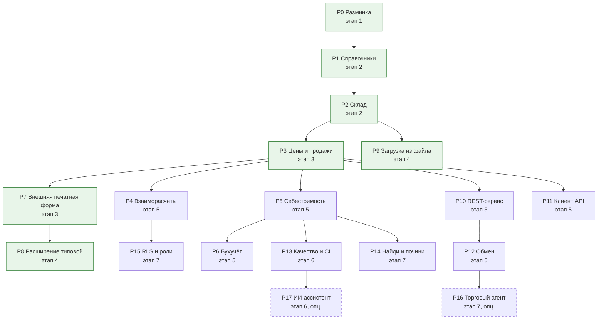

# Практические проекты и портфолио

[← Предыдущий](06_FAQ_and_Tips.md) | [🗺 Оглавление](README.md) | [Следующий →](08_Interview.md)

> Актуализировано: сентябрь 2026.

Здесь 18 учебных проектов P0–P17. Их постановки собраны из трёх источников: открытые тестовые задания работодателей 2021–2026 годов, уровни официальной «Модели профессиональных компетенций Разработчика» фирмы «1С» (MC-6-001, 2025) и требования к дипломам курса Нетологии «1С-программист». У каждого проекта есть уровень, этап, постановка, критерии приёмки, подсказки, усложнение и связанные стандарты разработки.

Работодатели проверяют начинающих разработчиков тестовыми заданиями. В открытых репозиториях с заданиями 2021–2026 годов повторяются три типа задач:
- алгоритмы на коллекциях без готовых функций;
- мини-конфигурация «склад и продажи»: контроль остатков, себестоимость, отчёт на СКД, печатная форма, часто проводки;
- внешняя обработка, в которой смотрят на клиент-серверное взаимодействие.

Проекты этого файла покрывают все три типа. Они сгруппированы по этапам из [02_Timeline.md](02_Timeline.md), поэтому номера внутри разделов идут не подряд.

## Содержание

- [Как пользоваться](#-как-пользоваться)
- [Все проекты на одной странице](#-все-проекты-на-одной-странице)
- [Как вести портфолио](#-как-вести-портфолио)
- [Общие критерии приёмки](#-общие-критерии-приёмки)
- [Проекты этапов 1 и 2](#-проекты-этапов-1-и-2)
- [Проекты этапов 3 и 4](#-проекты-этапов-3-и-4)
- [Проекты этапа 5](#-проекты-этапа-5)
- [Проекты этапа 6](#-проекты-этапа-6)
- [Проекты этапа 7](#-проекты-этапа-7)
- [Карта проектов, компетенций и вопросов собеседования](#-карта-проектов-компетенций-и-вопросов-собеседования)
- [Для наставников и работодателей](#-для-наставников-и-работодателей)
- [Источники](#-источники)

## 🧭 Как пользоваться

- Делайте проекты по порядку этапов. «Минимальный путь до первой работы» (этапы 0–4) — это P0–P3 и P7–P9, их хватает для первого портфолио. Полный роадмап — P0–P15, по желанию P16 и P17.
- Метки важности: 🔴 обязательно · 🟡 желательно · 🔵 по контексту. Уровни Junior, Middle и Senior взяты из модели MC-6-001. Стаж в модели не указан, уровень определяют навыки. Подробнее — в [03_Competencies.md](03_Competencies.md).
- Сначала прочитайте постановку и критерии приёмки и попробуйте сделать сами. Подсказки открывайте, когда застряли: на собеседовании их не будет.
- Проект готов, когда выполнены [общие критерии приёмки](#-общие-критерии-приёмки) и критерии самого проекта. «У меня работает» критерием не считается.
- Сроков у проектов нет: они сильно зависят от опыта. Ориентиры по этапам — в [02_Timeline.md](02_Timeline.md).
- Экзамены. После P1–P2 и этапа 2 — 1С:Профессионал по платформе. После этапа 5 (P4–P6, P10–P12) по желанию — 1С:Специалист по платформе. Сложные периодические расчёты и бизнес-процессы с экзамена Специалиста проекты не закрывают: для них есть мини-задачи в [02_Timeline.md](02_Timeline.md). Подробно — в [04_Certifications.md](04_Certifications.md).

**Где делать проекты**
- **Учебная версия платформы** (8.5.1 и 8.3.27) бесплатна на [online.1c.ru](https://online.1c.ru/catalog/free/28765768/) после анкеты. Ограничения: только файловый вариант и некоммерческое использование. По данным сообщества, в ней также ограничено число сеансов и нельзя задать пароль пользователю.
- **Community-лицензия для разработчиков** выдаётся на [developer.1c.ru](https://developer.1c.ru). Она срочная, её нужно периодически обновлять. Берите её, где нужны несколько сеансов, клиент-серверный вариант или публикация на веб-сервере, если учебная версия этого не даёт: проверка P2 двумя сеансами, P10–P12, P14.
- **Для P7 и P8 нужна типовая конфигурация:** [учебная версия «1С:Бухгалтерии 8»](https://v8.1c.ru/podderzhka-i-obuchenie/uchebnye-versii/1s-bukhgalteriya-8-uchebnaya-versiya/) или демо-база, если на курсе или на работе есть доступ к ИТС.
- **Версия платформы.** Большие типовые (БП, ЗУП, УТ, КА, ERP) в 2026 году работают на 8.3.27, УНФ и Розница — на 8.5. Для учебных проектов подходит любая из рабочих линий 8.3.27 и 8.5.1. Версию платформы и режим совместимости укажите в README.

## 📊 Все проекты на одной странице

| ID | Проект | Уровень | Этап | Метка | Основа |
|---|---|---|---|---|---|
| [P0](#p0-разминка-на-коллекциях) | Разминка на коллекциях | Junior | 1 | 🔴 | Тестовые задания 2021–2026 |
| [P1](#p1-справочники-управление-ит-фирмой) | Справочники «Управление ИТ-фирмой» | Junior | 2 | 🔴 | Диплом А Нетологии |
| [P2](#p2-склад-приход-расход-остатки) | Склад: приход, расход, остатки | Junior | 2 | 🔴 | Тестовые задания 2024–2026 |
| [P3](#p3-цены-скидки-продажи-печатная-форма) | Цены, скидки, продажи, печатная форма | Junior | 3 | 🔴 | Диплом Б Нетологии, задание 01.2026 |
| [P7](#p7-внешняя-печатная-форма-и-отчёт-для-типовой) | Внешняя печатная форма и отчёт для типовой | Junior | 3 | 🔴 | Модель MC-6-001 |
| [P8](#p8-расширение-типовой) | Расширение типовой | Junior | 4 | 🔴 | Модель MC-6-001 |
| [P9](#p9-загрузка-из-excelcsv-с-поиском-дублей) | Загрузка из Excel/CSV с поиском дублей | Junior | 4 | 🔴 | Портфолио и задания 2026 |
| [P4](#p4-взаиморасчёты-и-история-статусов-клиента) | Взаиморасчёты и история статусов клиента | Junior–Middle | 5 | 🔴 | Задание для стажёра 11.2024 |
| [P5](#p5-себестоимость-и-рентабельность) | Себестоимость и рентабельность | Junior–Middle | 5 | 🔴 | Задания 2024 и 2026 |
| [P6](#p6-бухучёт-на-плане-счетов) | Бухучёт на плане счетов | Middle | 5 | 🔴 | Диплом В Нетологии, задание 02.2026 |
| [P10](#p10-rest-http-сервис-каталога) | REST HTTP-сервис каталога | Middle | 5 | 🔴 | Задание 03.2025 |
| [P11](#p11-клиент-внешнего-api-с-регламентным-заданием) | Клиент внешнего API с регламентным заданием | Middle | 5 | 🔴 | Задание 2021 |
| [P12](#p12-обмен-между-двумя-базами) | Обмен между двумя базами | Middle | 5 | 🔴 | Модель MC-6-001 |
| [P13](#p13-качество-и-ci) | Качество и CI | Middle | 6 | 🟡 | Задание на BDD 07.2024 |
| [P17](#p17-решение-с-ии-ассистентом-и-разбор-ошибок-ии) | Решение с ИИ-ассистентом и разбор ошибок ИИ | Junior–Middle | 6 | 🔵 опц. | Бенчмарк PRISM |
| [P14](#p14-найди-и-почини-производительность) | Найди и почини (производительность) | Middle–Senior | 7 | 🔵 | Вопросы собеседований, модель MC-6-001 |
| [P15](#p15-rls-и-роли) | RLS и роли | Middle | 7 | 🔵 | Модель MC-6-001 |
| [P16](#p16-мобильное-приложение-торговый-агент) | Мобильное приложение «Торговый агент» | Middle | 7 | 🔵 опц. | Модель MC-6-001, демо-конфигурация 1С |

Проекты продолжают друг друга. P1–P6 удобно вести в одной сквозной конфигурации: ИТ-фирма продаёт оборудование и лицензии со склада и оказывает услуги. Стрелка на схеме означает «использует результат предыдущего проекта». Зелёным выделен «Минимальный путь до первой работы», пунктиром — опциональные проекты.



## 💼 Как вести портфолио

Портфолио на GitHub показывает работодателю навыки, которые новичок ещё не может подтвердить опытом работы. В тестовых заданиях 2024–2026 годов работодатели всё чаще просят выложить решение на GitHub или прислать выгрузку `.dt` со скриншотами или видео.

### Что положить в репозиторий

- **Исходники в текстовом виде.** Выгрузка конфигурации в XML-файлы (Конфигуратор: «Конфигурация → Выгрузить конфигурацию в файлы», или `ibcmd`) либо проект 1C:EDT. Бинарные `.cf`, `.cfe`, `.epf` и `.dt` в Git не храните: в них не видно diff.
- **Сборки — в Releases.** К релизу GitHub приложите `.dt` с тестовыми данными и собранные `.cf`, `.cfe`, `.epf`, `.erf`, чтобы проект можно было развернуть за несколько минут.
- **README** по шаблону ниже, скриншоты или короткий GIF: форма документа, сообщение о нехватке остатка, отчёт, печатная форма.
- **Тесты и описание API**, когда они появятся: YAxUnit, `.feature`-сценарии Vanessa Automation, OpenAPI для P10.
- **Честная история коммитов.** Небольшие коммиты с понятными сообщениями («Контроль остатков при проведении реализации») показывают, как вы работаете. Один коммит «всё» не показывает ничего.

Структура репозитория:

```text
it-firm-1c/
├── src/            # выгрузка конфигурации в XML или проект EDT
├── tests/          # YAxUnit-тесты и .feature-сценарии (с P13)
├── docs/           # скриншоты, схема метаданных, OpenAPI
├── .gitignore      # *.cf, *.cfe, *.epf, *.erf, *.dt, *.1CD, логи
└── README.md
```

Шаблон README:

```markdown
# Управление ИТ-фирмой (учебные проекты P1–P6)

Платформа 8.3.27, режим совместимости 8.3.27. Постановки — из роадмапа 1С, проекты P1–P6.

## Что сделано
- [x] Поступление и реализация с контролем остатков и управляемыми блокировками
- [ ] Себестоимость по всей компании — в работе

## Как развернуть
1. Создайте пустую файловую базу.
2. Загрузите .dt из Releases или конфигурацию из каталога src.
3. Войдите как «Менеджер» или «Администратор» (тестовые пользователи).

## Решения
Почему контроль остатков сделан именно так, какие стандарты соблюдены, что бы улучшили.

## Скриншоты

```

### Чего не выкладывать

- Код и базы клиентов и работодателя, даже «для примера»: это коммерческая тайна (98-ФЗ) и обычно NDA.
- Персональные данные реальных людей (152-ФЗ). В тестовых данных — только вымышленные ФИО, ИНН и телефоны.
- Пароли, токены, ключи API, файлы лицензий, логины к ИТС и releases.1c.ru ([std 740](https://its.1c.ru/db/v8std/content/740/hdoc)).
- Выгрузку типовой конфигурации целиком. Для P7 и P8 публикуйте только свою обработку или расширение; условия использования типовых определяет лицензионное соглашение фирмы «1С».
- Решение тестового задания конкретного работодателя, если он против публикации. Уточните это заранее.

### Как показать работу

- В резюме дайте ссылки на 2–4 лучших репозитория и по одной строке о каждом: что сделано и чему вы научились. Подробнее о резюме — в [13_Career.md](13_Career.md).
- Закрепите эти репозитории в профиле GitHub.
- На собеседовании будьте готовы открыть код и объяснить решения. Какие вопросы задают по каждому проекту, показано в [карте](#-карта-проектов-компетенций-и-вопросов-собеседования) ниже и в [08_Interview.md](08_Interview.md).

## ✅ Общие критерии приёмки

Эти требования действуют для всех проектов. Они опираются на стандарты разработки 1С и на технические требования к диплому В курса Нетологии.

- [ ] Код оформлен по стандартам: тексты модулей ([std 456](https://its.1c.ru/db/v8std/content/456/hdoc)), имена ([std 647](https://its.1c.ru/db/v8std/content/647/hdoc)) и параметры ([std 640](https://its.1c.ru/db/v8std/content/640/hdoc)) процедур и функций, тексты запросов ([std 437](https://its.1c.ru/db/v8std/content/437/hdoc)).
- [ ] Нет запросов в цикле, в том числе неявных, через точку ([std 436](https://its.1c.ru/db/v8std/content/436/hdoc)).
- [ ] Условия на измерения виртуальных таблиц переданы в их параметры ([std 657](https://its.1c.ru/db/v8std/content/657/hdoc)). Поля составного типа приводятся через `ВЫРАЗИТЬ` ([std 654](https://its.1c.ru/db/v8std/content/654/hdoc)). В запросах нет `ВЫБРАТЬ *` ([std 729](https://its.1c.ru/db/v8std/content/729/hdoc)).
- [ ] Серверных вызовов минимум ([std 487](https://its.1c.ru/db/v8std/content/487/hdoc)). Где контекст формы не нужен, стоит `&НаСервереБезКонтекста` ([std 636](https://its.1c.ru/db/v8std/content/636/hdoc)). В модулях форм нет экспортных методов, кроме обработчиков оповещений ([std 630](https://its.1c.ru/db/v8std/content/630/hdoc)).
- [ ] Нет модальных окон и синхронных вызовов ([std 703](https://its.1c.ru/db/v8std/content/703/hdoc)): только `ПоказатьВопрос` с `ОписаниеОповещения` или `Асинх`/`Ждать`.
- [ ] Параметры запросов передаются через `УстановитьПараметр`, пользовательские строки в текст запроса не попадают.
- [ ] Транзакции и блокировки там, где они нужны, оформлены по [std 783](https://its.1c.ru/db/v8std/content/783/hdoc) и [std 460](https://its.1c.ru/db/v8std/content/460/hdoc).
- [ ] BSL Language Server или проверки 1C:EDT не находят ошибок; предупреждения разобраны.
- [ ] Проверены негативные сценарии: пустые поля, нулевые количества, нехватка данных, повторный запуск.
- [ ] В репозитории есть тестовые данные, README со скриншотами и релиз с `.dt`.

**Как проверить себя без наставника.** Откройте исходники в VS Code с расширением [«Language 1C (BSL)»](https://github.com/1c-syntax/vsc-language-1c-bsl): оно подключает [BSL Language Server](https://github.com/1c-syntax/bsl-language-server) и показывает замечания прямо в коде. В 1C:EDT те же стандарты проверяет встроенный плагин [1C:Code style V8](https://github.com/1C-Company/v8-code-style). Если есть доступ к АПК, прогоните проект и через него.

## 🧱 Проекты этапов 1 и 2

### P0. Разминка на коллекциях

**Уровень:** Junior · **Этап:** 1 · 🔴 · **Основа:** тестовые задания 2021 года ([вариант 1](https://github.com/pomoykaLTD/1C-interview.v1), [вариант 2](https://github.com/pomoykaLTD/1C-interview.v3)), [«Лаборатория ИТ», 2023](https://github.com/vospan4ik/lab_1C), [задание 2026 года](https://github.com/AlxTrube/1s_test)

**Что тренирует:** массив, структуру, соответствие, список значений и таблицу значений; строки и числа; граничные случаи; оценку сложности. Официальная модель ждёт от Junior умения объяснить базовые алгоритмы поиска и сортировки и оценить сложность простого алгоритма.

**Постановка.** Шесть функций в общем модуле или во внешней обработке с формой для запуска:
1. Удалить из массива отрицательные числа, не создавая нового массива и сохранив порядок остальных.
2. Удалить строки длиннее двух символов из массива, списка значений и таблицы значений.
3. Распределить 100 ₽ между строками пропорционально количеству так, чтобы сумма частей была ровно 100,00.
4. Сравнить номера версий `8.1.13.41` и `8.1.009.125` без библиотек; ведущие нули не должны влиять на результат.
5. Записать число до 100 млн прописью без `ЧислоПрописью` так, чтобы новый разряд добавлялся одной строкой настройки.
6. Заполнить матрицу 12×10 числами «змейкой» и вывести её в табличный документ.

**Критерии приёмки**
- [ ] Каждая задача — отдельная функция с параметрами и возвращаемым значением, без сообщений пользователю внутри.
- [ ] Для каждой функции проверены граничные случаи: пустая коллекция, один элемент, «подходят все» и «не подходит ни один», нули, ведущие нули, числа 0, 1, 11, 21 и 100 000 000.
- [ ] Не используются готовые функции, которые решают задачу целиком (`ЧислоПрописью`, функции БСП).
- [ ] В комментарии к каждой функции указана сложность алгоритма.

**Подсказки**
- Задача 1: обходите массив с конца циклом `Пока`. У цикла `Для` нет шага, а при удалении во время обхода вперёд индексы сдвигаются.
- Задача 3: округлите доли до копеек, а разницу от округления добавьте к самой большой доле. Отдельно обработайте случай, когда все количества нулевые.
- Задача 4: разбейте строку через `СтрРазделить` и сравнивайте части как числа, а не как строки. Учтите разное число частей.
- Задача 5: разбейте число на тройки разрядов. У тысяч женский род («одна тысяча», «две тысячи»), у слов разрядов три формы («тысяча», «тысячи», «тысяч»).
- После своего решения сравните его с `ОбщегоНазначенияКлиентСервер.РаспределитьСуммуПропорциональноКоэффициентам` и `ОбщегоНазначенияКлиентСервер.СравнитьВерсии` из БСП.

**Усложнение.** Ещё две задачи из тех же заданий: найти циклическую ссылку (например, элемент, который через цепочку родителей ссылается сам на себя) и посчитать гласные в каждом втором слове фразы. На этапе 6 перенесите проверки в модульные тесты YAxUnit (P13).

**Стандарты:** [456](https://its.1c.ru/db/v8std/content/456/hdoc) тексты модулей, [647](https://its.1c.ru/db/v8std/content/647/hdoc) имена, [640](https://its.1c.ru/db/v8std/content/640/hdoc) параметры.

### P1. Справочники «Управление ИТ-фирмой»

**Уровень:** Junior · **Этап:** 2 · 🔴 · **Основа:** диплом А курса [Нетологии «1С-программист»](https://github.com/netology-code/1c-homeworks), учебное задание курса УЦ №1

**Что тренирует:** перечисления и справочники, формы и их события, проверку заполнения, клиент-серверное взаимодействие, роли и пользователей.

**Постановка.** Начните сквозную конфигурацию. Создайте перечисление «ЮрФизЛицо»; справочники «Контрагенты» (тип, ИНН, КПП, полное наименование), «Номенклатура» (товар или услуга) и «Склады»; роли «Администратор» и «Менеджер» и двух пользователей с этими ролями.

**Критерии приёмки**
- [ ] Поле КПП доступно только юрлицам: и после смены типа контрагента, и при открытии уже записанного элемента.
- [ ] Полное наименование разворачивает сокращение организационно-правовой формы: «АО» → «Акционерное общество».
- [ ] ИНН проверяется при вводе (подсветка без запрета) и при записи (отказ с сообщением у поля).
- [ ] Менеджер не может менять роли и список пользователей, администратор может всё.
- [ ] Есть тестовые контрагенты: юрлицо, ИП, физлицо и элемент с ошибочным ИНН.

**Подсказки**
- Доступность КПП после смены типа меняйте на клиенте, без вызова сервера. При открытии формы её задаёт `ПриСозданииНаСервере`.
- Проверку ИНН держите в общем модуле с флагами «Клиент» и «Сервер». На клиенте она подсвечивает ошибку, а решение о записи принимает сервер в `ОбработкаПроверкиЗаполнения`.
- Контрольные цифры ИНН считаются по опубликованному алгоритму. После своей реализации сравните её с `РегламентированныеДанныеКлиентСервер.ИННСоответствуетТребованиям` из БСП.
- Пары «сокращение — полное название» удобнее хранить в `Соответствие`, чем в цепочке `Если`.
- В учебной версии, по данным сообщества, пароли пользователям задать нельзя. Проверять роли это не мешает.

**Усложнение.** Контроль дублей ИНН с учётом филиалов: у головной организации и её обособленных подразделений ИНН один, а КПП разные (по мотивам [задания DexSys, 2024](https://github.com/Nerby01/DexSys_job_test)). Условное оформление списка: контрагенты без ИНН выделены цветом.

**Стандарты:** [487](https://its.1c.ru/db/v8std/content/487/hdoc) серверные вызовы, [636](https://its.1c.ru/db/v8std/content/636/hdoc) контекстные вызовы, [689](https://its.1c.ru/db/v8std/content/689/hdoc) роли и права.

### P2. Склад: приход, расход, остатки

**Уровень:** Junior · **Этап:** 2 · 🔴 · **Основа:** [«СофтСервис», 02.2026](https://github.com/fox5CnH/SoftService-testinFile-), [«кондитерская», 09.2026](https://github.com/romankitaev526-prog/1C-Skvoznaya-avtomatizaciya-ucheta-konditerskoy), [задание для стажёра, 11.2024](https://github.com/svrv1/TestTask1)

**Что тренирует:** регистр накопления остатков, проведение, виртуальные таблицы, контроль остатков, управляемые блокировки, отчёт на СКД.

**Постановка.** Документы «Поступление товаров» и «Реализация товаров и услуг»: склад в шапке, товары и услуги в одной табличной части. Регистр накопления «Остатки товаров» с измерениями «Номенклатура» и «Склад» и ресурсом «Количество». Реализация не проводится, если товара не хватает. Отчёт на СКД «Остатки и обороты по складам».

**Критерии приёмки**
- [ ] Движения по регистру пишут только товары, услуги в остатках не участвуют.
- [ ] При нехватке реализация не проводится и сообщает по каждой строке, сколько не хватает.
- [ ] Остаток не уходит в минус при одновременном проведении двух документов из двух сеансов.
- [ ] Используется управляемый режим блокировок, запросов в цикле нет, условия на измерения переданы в параметры виртуальной таблицы.
- [ ] Повторное проведение и отмена проведения оставляют правильные движения.
- [ ] Отчёт показывает начальный остаток, приход, расход и конечный остаток, есть быстрые отборы по складу и номенклатуре.

**Подсказки**
- Есть два рабочих способа контроля остатков, и оба стоит уметь объяснить. Первый — заблокировать и прочитать остатки в начале транзакции, потом записать движения ([std 661](https://its.1c.ru/db/v8std/content/661/hdoc)). Второй — записать движения с `БлокироватьДляИзменения`, затем одним запросом найти позиции в минусе и отказать в проведении. Образец второго способа есть в [02_Timeline.md](02_Timeline.md).
- Без блокировки двое прочитают остаток 10, спишут 8 и 6 и получат −4. Этот сценарий разобран в std 661.
- Остаток на момент документа без его собственных движений даёт параметр `Новый Граница(МоментВремени(), ВидГраницы.Исключая)`.
- Условие на ресурс (`КоличествоОстаток < 0`) ставится в `ГДЕ`, условия на измерения — в параметры виртуальной таблицы.
- Для проверки двумя сеансами может понадобиться community-лицензия (см. [«Где делать проекты»](#-как-пользоваться)).

**Усложнение.** Подбор в табличную часть только тех товаров, что есть на складе, как в задании «СофтСервис». Документ «Выпуск продукции», который списывает ингредиенты по составу в одной транзакции, как в задании «кондитерская».

**Стандарты:** [603](https://its.1c.ru/db/v8std/content/603/hdoc) проведение, [450](https://its.1c.ru/db/v8std/content/450/hdoc) порядок записи движений, [460](https://its.1c.ru/db/v8std/content/460/hdoc) управляемые блокировки, [661](https://its.1c.ru/db/v8std/content/661/hdoc) блокирующее чтение остатков, [733](https://its.1c.ru/db/v8std/content/733/hdoc) обращение к таблице «Остатки».

## 🧩 Проекты этапов 3 и 4

### P3. Цены, скидки, продажи, печатная форма

**Уровень:** Junior · **Этап:** 3 · 🔴 · **Основа:** диплом Б [Нетологии](https://github.com/netology-code/1c-homeworks), [«Бест Бизнес Софт», 01.2026](https://github.com/AndreyVoenkov/testovoe-zadanie-best-business-soft)

**Что тренирует:** периодический регистр сведений, срез последних, события формы документа, печатную форму на макете.

**Постановка.** Документ «Установка цен» пишет в периодический регистр сведений «Цены», подчинённый регистратору. Реализация из P2 подставляет цену на дату документа, учитывает процент скидки в строке и пересчитывает сумму и НДС. Реализация также пишет оборотный регистр накопления «Продажи»: он понадобится в P4 и P5. Печатная форма «Расходная накладная».

**Критерии приёмки**
- [ ] Цена подставляется на дату документа, а не на текущую. Если цены нет, строка подсвечивается.
- [ ] Сумма, скидка и НДС пересчитываются при изменении количества, цены, скидки или ставки. НДС считается «в том числе» по ставке строки: 22%, 10%, 0% или «Без НДС».
- [ ] Цены для всех подобранных строк читаются одним серверным вызовом, а не вызовом на строку.
- [ ] Печатная форма получает данные одним запросом, печатает несколько документов сразу и сортирует строки по выбору пользователя, не меняя документ.

**Подсказки**
- Цены на дату — виртуальная таблица `СрезПоследних(&Дата, Номенклатура В (&Товары))`. Отбор передавайте в параметры, а не в `ГДЕ`.
- Пересчёт суммы в строке — клиентская процедура без серверного вызова. Сервер нужен только, чтобы прочитать цены.
- НДС «в том числе» по ставке 22% — сумма × 22 / 122. Ставки и правила 2026 года — в [10_Domain_and_Law.md](10_Domain_and_Law.md).
- Сортировку делайте в запросе печати (`УПОРЯДОЧИТЬ ПО`) или в таблице значений на сервере. Документ при этом не записывается.

**Усложнение.** Скидки по правилам: регистр сведений «Скидки по статусам» со статусом клиента из P4. Отчёт «Продажи за период» с отборами по клиенту и товару, как в задании «Бест Бизнес Софт».

**Стандарты:** [548](https://its.1c.ru/db/v8std/content/548/hdoc) формирование печатных форм, [487](https://its.1c.ru/db/v8std/content/487/hdoc) серверные вызовы, [657](https://its.1c.ru/db/v8std/content/657/hdoc) виртуальные таблицы, [761](https://its.1c.ru/db/v8std/content/761/hdoc) интерфейсные тексты в коде.

### P7. Внешняя печатная форма и отчёт для типовой

**Уровень:** Junior · **Этап:** 3 (можно перенести в начало этапа 4) · 🔴 · **Основа:** модель MC-6-001, компетенция «Внешние отчёты, обработки, печатные формы»

**Что тренирует:** подсистему БСП «Дополнительные отчеты и обработки», безопасный режим, подсистему «Печать», СКД во внешнем отчёте.

**Постановка.** Для учебной или демо-базы «1С:Бухгалтерии 8» сделайте две вещи. Первая — внешнюю печатную форму (`.epf`) к документу реализации. Вторая — внешний отчёт на СКД (`.erf`), например «Продажи по контрагентам за период». Подключите обе через справочник «Дополнительные отчеты и обработки» в разделе администрирования.

**Критерии приёмки**
- [ ] Обработка регистрируется без ошибок, печатная форма появляется в подменю «Печать» нужного документа.
- [ ] Обе обработки работают в безопасном режиме: без COM, файлов и интернета.
- [ ] Данные для печати нескольких документов получаются одним запросом ([std 548](https://its.1c.ru/db/v8std/content/548/hdoc)).
- [ ] У отчёта есть пользовательские настройки: период и отбор по контрагенту.
- [ ] Типовая конфигурация не изменена. В README есть инструкция для пользователя: как подключить и где найти.

**Подсказки**
- Регистрацию и печать берёт на себя БСП, от обработки нужны два экспортных метода в модуле объекта. Имена ниже сверены с исходниками БСП 3.2:

```bsl
// Модуль объекта внешней обработки: печатная форма для документа реализации
Функция СведенияОВнешнейОбработке() Экспорт

    ПараметрыРегистрации = ДополнительныеОтчетыИОбработки.СведенияОВнешнейОбработке(
        СтандартныеПодсистемыСервер.ВерсияБиблиотеки());
    ПараметрыРегистрации.Вид = ДополнительныеОтчетыИОбработкиКлиентСервер.ВидОбработкиПечатнаяФорма();
    ПараметрыРегистрации.Версия = "1.0";
    ПараметрыРегистрации.Назначение.Добавить("Документ.РеализацияТоваровУслуг");
    // БезопасныйРежим по умолчанию Истина: не отключайте его без причины

    Команда = ПараметрыРегистрации.Команды.Добавить();
    Команда.Представление = НСтр("ru = 'Накладная с подписями'");
    Команда.Идентификатор = "НакладнаяСПодписями"; // имя печатной формы, его проверяет НужноПечататьМакет
    Команда.Использование = ДополнительныеОтчетыИОбработкиКлиентСервер.ТипКомандыВызовСерверногоМетода();
    Команда.Модификатор = "ПечатьMXL";

    Возврат ПараметрыРегистрации;

КонецФункции

Процедура Печать(МассивОбъектов, КоллекцияПечатныхФорм, ОбъектыПечати, ПараметрыВывода) Экспорт

    Если УправлениеПечатью.НужноПечататьМакет(КоллекцияПечатныхФорм, "НакладнаяСПодписями") Тогда
        УправлениеПечатью.ВывестиТабличныйДокументВКоллекцию(КоллекцияПечатныхФорм,
            "НакладнаяСПодписями", НСтр("ru = 'Накладная с подписями'"),
            СформироватьНакладные(МассивОбъектов, ОбъектыПечати));
    КонецЕсли;

КонецПроцедуры
```

- `СформироватьНакладные` пишете вы: один запрос по всему `МассивОбъектов`, вывод областей макета (`ПолучитьМакет`) и вызов `УправлениеПечатью.ЗадатьОбластьПечатиДокумента` после каждого документа. Имена документа и его реквизитов сверьте со своей версией типовой.
- Внешний отчёт регистрируется так же, но с видом `ДополнительныеОтчетыИОбработкиКлиентСервер.ВидОбработкиДополнительныйОтчет()`.

**Усложнение.** Обработка вида «Заполнение объекта», которая заполняет табличную часть документа по данным другого документа. Внешний отчёт с несколькими вариантами и условным оформлением.

**Стандарты:** [548](https://its.1c.ru/db/v8std/content/548/hdoc) печатные формы, [645](https://its.1c.ru/db/v8std/content/645/hdoc) названия печатных форм, [669](https://its.1c.ru/db/v8std/content/669/hdoc) ограничение на выполнение внешнего кода.

### P8. Расширение типовой

**Уровень:** Junior · **Этап:** 4 · 🔴 · **Основа:** модель MC-6-001, компетенции «Доработка конфигураций и расширения» и «Обновление нетиповых конфигураций»

**Что тренирует:** расширения конфигурации, заимствование объектов, аннотации `&Перед`, `&После`, `&Вместо` и `&ИзменениеИКонтроль`, обновление типовой с доработками.

**Постановка.** В демо-базе типовой добавьте расширением реквизит в документ реализации и выведите его на форму. Сделайте его обязательным при проведении для контрагентов с определённым признаком. Затем обновите типовую на следующий релиз и убедитесь, что расширение работает.

**Критерии приёмки**
- [ ] Основная конфигурация не изменена. Объекты и методы расширения названы с префиксом, например `Расш1_`.
- [ ] Для логики «до типовой» используется `&Перед`. Если где-то нужен `&Вместо`, причина объяснена в README.
- [ ] Показано обновление на новый релиз и проверка применимости расширения после него.
- [ ] В README описано, что сломается, если в новом релизе переименуют перехваченный метод или изменят текст метода под `&ИзменениеИКонтроль`.

**Подсказки**
- Порядок доработки типовой: настройки и функциональные опции → дополнительные отчёты и обработки → расширение → изменение основной конфигурации с сохранением поддержки.
- Образец `&Перед` для проверки заполнения есть в [02_Timeline.md](02_Timeline.md), разбор `&Вместо` и `ПродолжитьВызов` — в [06_FAQ_and_Tips.md](06_FAQ_and_Tips.md).
- `&ИзменениеИКонтроль` (платформа 8.3.16+) хранит текст исходного метода. Если в новом релизе метод изменился, проверка применимости покажет расхождение, и метод в расширении придётся адаптировать.
- Назначение вашего расширения — «Адаптация». Назначение «Исправление» фирма «1С» использует для официальных исправлений, которые поставляет расширениями.
- Если доступа к новым релизам нет, смоделируйте обновление на своей конфигурации из P2–P3: подключите к ней расширение, измените перехваченный метод в основной конфигурации и проверьте применимость.

**Усложнение.** Подключите свою логику к БСП обработчиком `&После` к процедуре общего модуля `…Переопределяемый`, например `УправлениеПечатьюПереопределяемый.ПередДобавлениемКомандПечати`. Обновите копию типовой, частично снятой с поддержки, через сравнение и объединение.

**Стандарты:** [690](https://its.1c.ru/db/v8std/content/690/hdoc) обработчики обновления (если заполняете новый реквизит в существующих данных), [464](https://its.1c.ru/db/v8std/content/464/hdoc) обработчик `ПередЗаписью`.

### P9. Загрузка из Excel/CSV с поиском дублей

**Уровень:** Junior · **Этап:** 4 · 🔴 · **Основа:** [учебное портфолио, 04.2026](https://github.com/darya-1c/darya-1c), [«кондитерская», 09.2026](https://github.com/romankitaev526-prog/1C-Skvoznaya-avtomatizaciya-ucheta-konditerskoy), вопрос «передать файл на сервер» из [interview-1c](https://github.com/1823244/interview-1c)

**Что тренирует:** работу с файлами на клиенте и сервере, временное хранилище, табличный документ, временные таблицы в запросах, форму обработки.

**Постановка.** Внешняя обработка загружает номенклатуру из файла `.xlsx` или `.csv`. Пользователь выбирает файл, видит предпросмотр, загружает и получает итог: сколько создано, пропущено и сколько строк с ошибками. Отдельная команда ищет дубли в справочнике.

**Критерии приёмки**
- [ ] Файл выбирается без модальных окон и передаётся на сервер через временное хранилище, поэтому код работает и в тонком, и в веб-клиенте.
- [ ] Существующие элементы находятся одним запросом по всем строкам файла, а не поиском в цикле.
- [ ] Повторная загрузка того же файла не создаёт дублей.
- [ ] Ошибочные строки (пустое наименование, неверный код) не прерывают загрузку и попадают в итоговый отчёт.
- [ ] Поиск дублей — один запрос с `СГРУППИРОВАТЬ ПО … ИМЕЮЩИЕ`.
- [ ] Временные файлы на сервере удаляются, пути собираются без ручных разделителей ([std 723](https://its.1c.ru/db/v8std/content/723/hdoc)).

**Подсказки**
- На клиенте используйте `ФайловаяСистемаКлиент.ЗагрузитьФайл` из БСП или методы платформы `НачатьПомещениеФайла` и `НачатьПомещениеФайлов`. На сервере двоичные данные берутся через `ПолучитьИзВременногоХранилища`.
- Файл `.xlsx` сохраните во временный файл (`ПолучитьИмяВременногоФайла("xlsx")`) и прочитайте в `ТабличныйДокумент` методом `Прочитать`.
- Проверка «что уже есть в базе» — один пакетный запрос с временной таблицей:

```bsl
// ТаблицаЗагрузки — ТаблицаЗначений с колонкой «Код». Тип колонки задан явно, как у кода справочника:
// Новый ОписаниеТипов("Строка", , Новый КвалификаторыСтроки(9))
Запрос = Новый Запрос;
Запрос.Текст =
    "ВЫБРАТЬ
    |    Загрузка.Код КАК Код
    |ПОМЕСТИТЬ ВТ_Загрузка
    |ИЗ
    |    &ТаблицаЗагрузки КАК Загрузка
    |
    |ИНДЕКСИРОВАТЬ ПО
    |    Код
    |;
    |
    |////////////////////////////////////////////////////////////////////////////////
    |ВЫБРАТЬ
    |    Номенклатура.Код КАК Код,
    |    Номенклатура.Ссылка КАК Ссылка
    |ИЗ
    |    ВТ_Загрузка КАК Загрузка
    |        ВНУТРЕННЕЕ СОЕДИНЕНИЕ Справочник.Номенклатура КАК Номенклатура
    |        ПО Загрузка.Код = Номенклатура.Код";
Запрос.УстановитьПараметр("ТаблицаЗагрузки", ТаблицаЗагрузки);
Существующие = Запрос.Выполнить().Выгрузить();
Существующие.Индексы.Добавить("Код"); // дальше — поиск в памяти методом Найти, без запросов в цикле
```

- Если строк тысячи, серверный вызов может идти дольше 8 секунд. Такую загрузку выносят в фоновое задание ([std 642](https://its.1c.ru/db/v8std/content/642/hdoc)).

**Усложнение.** Загрузка в фоне через `ДлительныеОперации` БСП с индикатором прогресса. Задание в стиле [Effective Mobile, 2025–2026](https://github.com/fox5CnH/-EffectiveMobile-): внешняя обработка читает из константы типа `ХранилищеЗначения` данные разного вида (строка GUID, массив ссылок или таблица значений), отбирает нужные и выводит кликабельные ссылки одной строкой. Работодатель оценивает интерфейс, клиент-серверное взаимодействие и понятность кода.

**Стандарты:** [436](https://its.1c.ru/db/v8std/content/436/hdoc) запросы в цикле, [777](https://its.1c.ru/db/v8std/content/777/hdoc) временные таблицы, [642](https://its.1c.ru/db/v8std/content/642/hdoc) длительные операции, [723](https://its.1c.ru/db/v8std/content/723/hdoc) Linux и macOS.

## 🔧 Проекты этапа 5

### P4. Взаиморасчёты и история статусов клиента

**Уровень:** Junior–Middle · **Этап:** 5 · 🔴 · **Основа:** [задание для стажёра, 11.2024](https://github.com/svrv1/TestTask1)

**Что тренирует:** остатки и обороты по договорам, периодический регистр сведений, соединения в запросах, динамический список с произвольным запросом.

**Постановка.** Справочник «Договоры» (владелец — контрагент), документы «Поступление денег» и «Списание денег», регистр накопления «Взаиморасчёты» (контрагент, договор; сумма). Реализация из P3 увеличивает долг клиента. Статус клиента («Новый», «Постоянный», «Ключевой», «Потерянный») хранится с историей в периодическом регистре сведений.

**Критерии приёмки**
- [ ] Долг виден в разрезе контрагента и договора на любую дату.
- [ ] Текущий статус виден в карточке и в списке контрагентов, история — в отдельной форме.
- [ ] Отчёт «Ведомость по взаиморасчётам» показывает начальный долг, увеличение, уменьшение и конечный долг за период.
- [ ] Отчёт «Клиенты без покупок за период» строится одним запросом.
- [ ] Список контрагентов со статусом открывается без запроса на каждую строку.

**Подсказки**
- Ведомость — виртуальная таблица `ОстаткиИОбороты` с периодом в параметрах.
- Статус в списке — левое соединение основной таблицы динамического списка со `СрезПоследних` регистра статусов.
- «Клиенты без покупок» — левое соединение контрагентов с продажами за период и условие `Продажи.Контрагент ЕСТЬ NULL`.

**Усложнение.** Регламентное задание раз в сутки пересчитывает статусы (например, «Потерянный» — нет покупок 90 дней) и не пишет новую запись, если статус не изменился.

**Стандарты:** [657](https://its.1c.ru/db/v8std/content/657/hdoc) виртуальные таблицы, [654](https://its.1c.ru/db/v8std/content/654/hdoc) составные типы, [540](https://its.1c.ru/db/v8std/content/540/hdoc) регламентные задания.

### P5. Себестоимость и рентабельность

**Уровень:** Junior–Middle · **Этап:** 5 · 🔴 · **Основа:** [задание для стажёра, 11.2024](https://github.com/svrv1/TestTask1), [«СофтСервис», 02.2026](https://github.com/fox5CnH/SoftService-testinFile-)

**Что тренирует:** расчёт средней себестоимости, суммовой учёт в регистре, момент времени, последовательность проведения, отчёт с вычисляемыми полями.

**Постановка.** Добавьте в «Остатки товаров» ресурс «Сумма» или заведите отдельный регистр себестоимости. Поступление приходует количество и сумму, реализация списывает себестоимость по средней на момент продажи. Сделайте два варианта: средняя по складу и средняя по всей компании. Отчёт на СКД «Рентабельность»: выручка, себестоимость, прибыль и рентабельность = прибыль / выручка.

**Критерии приёмки**
- [ ] Себестоимость списания = сумма остатка × списываемое количество / количество остатка. При списании всего остатка списывается вся сумма, копейки на складе не остаются.
- [ ] Вариант «по складу» или «по компании» выбирается настройкой, например константой.
- [ ] Рентабельность — вычисляемое поле отчёта без деления на ноль.
- [ ] В README объяснено, что происходит с себестоимостью следующих продаж при проведении документа задним числом и как вы обеспечиваете правильный результат.

**Подсказки**
- Средняя «по всей компании» — это сумма остатков всех складов: `СУММА` по количеству и сумме с группировкой по номенклатуре.
- Остаток читайте на момент документа без его собственных движений (`ВидГраницы.Исключая`) и под блокировкой, как в P2.
- Документ задним числом меняет среднюю для всех последующих продаж. Варианты решения: перепровести последующие документы по порядку, использовать последовательность документов ([std 662](https://its.1c.ru/db/v8std/content/662/hdoc)) или считать себестоимость регламентной операцией в конце месяца. Выберите один и обоснуйте выбор.

**Усложнение.** Списание по ФИФО: ФСБУ 5/2019 допускает оценку по себестоимости каждой единицы, по средней себестоимости и ФИФО. Регламентная операция «Расчёт себестоимости за месяц» с пересчётом всех продаж месяца.

**Стандарты:** [661](https://its.1c.ru/db/v8std/content/661/hdoc) блокирующее чтение остатков, [662](https://its.1c.ru/db/v8std/content/662/hdoc) граница последовательности, [733](https://its.1c.ru/db/v8std/content/733/hdoc) таблица «Остатки», [783](https://its.1c.ru/db/v8std/content/783/hdoc) транзакции.

### P6. Бухучёт на плане счетов

**Уровень:** Middle · **Этап:** 5 · 🔴 · **Основа:** диплом В [Нетологии](https://github.com/netology-code/1c-homeworks), [«СофтСервис», 02.2026](https://github.com/fox5CnH/SoftService-testinFile-)

**Что тренирует:** план счетов, виды субконто через ПВХ, регистр бухгалтерии, проводки, оборотно-сальдовую ведомость.

**Постановка.** План счетов «Управленческий» со счетами 41, 50, 51, 60, 62 и 90 (субсчета 90.1 и 90.2). Субконто «Номенклатура», «Контрагенты» и «Договоры» задаются через ПВХ «Виды субконто». Документы P2–P4 формируют проводки:
- закупка товара — Д41 К60;
- выручка — Д62 К90.1;
- себестоимость проданного — Д90.2 К41;
- оплата от покупателя — Д50 (или Д51) К62;
- оплата поставщику — Д60 К51.

**Критерии приёмки**
- [ ] Каждая операция из P2–P4 даёт правильную проводку. Сальдо счёта 41 по количеству и сумме совпадает с остатками регистра накопления из P5.
- [ ] Решение ведётся параллельно на регистре накопления и регистре бухгалтерии и даёт одинаковый результат, как требовалось в задании «СофтСервис».
- [ ] ОСВ на СКД: сальдо на начало, обороты, сальдо на конец, развёртка по субконто.
- [ ] Данные регистра бухгалтерии читаются только через виртуальные таблицы с параметрами.

**Подсказки**
- Какие счета активные, пассивные и активно-пассивные и почему у счёта 62 обычно дебетовое сальдо, объяснено в [10_Domain_and_Law.md](10_Domain_and_Law.md).
- ОСВ строится на виртуальной таблице `ОстаткиИОбороты` регистра бухгалтерии.
- Для количественного учёта на счёте 41 заведите признак учёта «Количественный» и ресурс «Количество», который зависит от этого признака.

**Усложнение.** Мини-расчёт зарплаты на регистре расчёта: оклад, больничный, который вытесняет оклад, и проводка начисления (для торговой фирмы — Д44 К70). Эта тема есть на экзамене 1С:Специалист («сложные периодические расчёты»).

**Стандарты:** [657](https://its.1c.ru/db/v8std/content/657/hdoc) виртуальные таблицы, [663](https://its.1c.ru/db/v8std/content/663/hdoc) разделение итогов регистров бухгалтерии.

### P10. REST HTTP-сервис каталога

**Уровень:** Middle · **Этап:** 5 · 🔴 · **Основа:** [тестовое задание 03.2025](https://github.com/KaratovTech/SelectionTaskOneC) («Каталог товаров для мобильного приложения»)

**Что тренирует:** HTTP-сервисы, шаблоны URL, JSON, коды ответа, пагинацию, публикацию на веб-сервере, описание API.

**Постановка.** HTTP-сервис отдаёт каталог номенклатуры из P1–P3 с ценой на текущую дату:
- `GET /catalog/products?page=1&size=20&sort=name&order=asc` — страница списка;
- `GET /catalog/products/{id}` — один товар.

**Критерии приёмки**
- [ ] Ответ соответствует описанию OpenAPI, описание лежит в репозитории.
- [ ] Неверные `page`, `size`, `sort` или `order` дают код 400 с понятным текстом. Несуществующий `id` даёт 404, некорректный — 400, но никогда не 500.
- [ ] Пагинация стабильна: одинаковые параметры возвращают одинаковые элементы, порядок сортировки однозначный.
- [ ] Поле сортировки выбирается из белого списка, пользовательские строки в текст запроса не попадают.
- [ ] Сервис опубликован на веб-сервере и работает под отдельным пользователем с минимальными правами. Коллекция запросов Postman или Bruno лежит в репозитории.

**Подсказки**
- Обработчик получает `HTTPСервисЗапрос` и возвращает `HTTPСервисОтвет`. Параметры строки запроса читаются из `ПараметрыЗапроса`, части шаблона URL — из `ПараметрыURL`:

```bsl
// Модуль HTTP-сервиса «Каталог», шаблон URL /products/{id}, метод GET
Функция ТоварGET(Запрос)

    Данные = КаталогСервер.ТоварПоИдентификатору(Запрос.ПараметрыURL["id"]); // Структура или Неопределено
    Если Данные = Неопределено Тогда
        Возврат ОтветJSON(404, Новый Структура("error", "product not found"));
    КонецЕсли;
    Возврат ОтветJSON(200, Данные);

КонецФункции

Функция ОтветJSON(КодСостояния, Данные)

    ЗаписьJSON = Новый ЗаписьJSON;
    ЗаписьJSON.УстановитьСтроку();
    ЗаписатьJSON(ЗаписьJSON, Данные);

    Ответ = Новый HTTPСервисОтвет(КодСостояния);
    Ответ.Заголовки.Вставить("Content-Type", "application/json; charset=utf-8");
    Ответ.УстановитьТелоИзСтроки(ЗаписьJSON.Закрыть(), КодировкаТекста.UTF8, ИспользованиеByteOrderMark.НеИспользовать);
    Возврат Ответ;

КонецФункции
```

- `ТоварПоИдентификатору` сами пишете в серверном общем модуле. Строку, которая не является UUID, отсекайте проверкой и отвечайте 400, иначе конструктор `УникальныйИдентификатор` вызовет исключение и клиент получит 500.
- В `id` отдавайте UUID ссылки (`Ссылка.УникальныйИдентификатор()`), а не код и не внутреннее представление ссылки.
- В языке запросов нет `OFFSET`. Два варианта пагинации: выбрать `ПЕРВЫЕ` (страница × размер) строк и пропустить лишние на сервере или отдавать страницу «после последнего ключа» по уникальному полю. Число в `ПЕРВЫЕ` пишется прямо в тексте запроса, поэтому подставляйте туда только проверенное целое.

**Усложнение.** Аутентификация по токену JWT (`ТокенДоступа`, платформа 8.3.21+) или через OpenID Connect. Описание API библиотекой [swagger-1c](https://github.com/zerobig/swagger-1c). Автотест, который вызывает сервис и проверяет коды ответа.

**Стандарты:** [436](https://its.1c.ru/db/v8std/content/436/hdoc) запросы в цикле, [729](https://its.1c.ru/db/v8std/content/729/hdoc) оптимальные запросы, [737](https://its.1c.ru/db/v8std/content/737/hdoc) проверка прав доступа.

### P11. Клиент внешнего API с регламентным заданием

**Уровень:** Middle · **Этап:** 5 · 🔴 · **Основа:** [тестовое задание 2021](https://github.com/pomoykaLTD/1C-interview.v1), задача «продажи в рублях, курсы только на банковские дни»

**Что тренирует:** `HTTPСоединение`, `HTTPЗапрос` и `HTTPОтвет`, таймауты, JSON, регламентные задания, журнал регистрации, идемпотентность, срез последних.

**Постановка.** Регламентное задание раз в день загружает курсы валют из внешнего API в периодический регистр сведений «Курсы валют». Отчёт «Продажи в валюте» пересчитывает выручку из P3 по курсу на дату каждой продажи. Если на эту дату курса нет (выходной), берётся последний известный.

**Критерии приёмки**
- [ ] У соединения задан таймаут, код ответа проверяется, ошибки пишутся в журнал регистрации с понятным именем события.
- [ ] Повторный запуск за ту же дату не создаёт дублей и не портит данные.
- [ ] Загрузку за любую дату можно запустить из формы, она идёт в фоне и не блокирует интерфейс.
- [ ] Отчёт берёт курс на дату каждой продажи одним запросом, без запроса в цикле.
- [ ] Ключ API не зашит в код и не лежит в репозитории, например хранится в безопасном хранилище БСП.

**Подсказки**
- Образец загрузки с таймаутом и перезаписью набора записей за дату есть в [02_Timeline.md](02_Timeline.md).
- Синхронный HTTP-вызов допустим только на сервере. На клиенте используют асинхронный `ВызватьHTTPМетодАсинх`, но регламентному заданию клиент не нужен.
- `СрезПоследних` принимает одну дату, а у продаж даты разные. Соедините продажи с таблицей регистра по условию «период курса ≤ дата продажи», найдите максимальный период для каждой продажи и вторым соединением возьмите курс.
- Ошибку 4xx повторять бесполезно. При таймауте или коде 5xx сделайте ограниченное число повторов или повторите загрузку при следующем запуске задания.

**Усложнение.** Сообщите пользователю о завершении загрузки через уведомления клиента (`УведомленияКлиента.ОтправитьУведомление`, платформа 8.3.26+). Для сравнения подключитесь к тестовому echo-серверу через WebSocket-клиент (объект метаданных, платформа 8.3.27+) и обработайте входящие сообщения.

**Стандарты:** [748](https://its.1c.ru/db/v8std/content/748/hdoc) таймауты, [498](https://its.1c.ru/db/v8std/content/498/hdoc) журнал регистрации, [540](https://its.1c.ru/db/v8std/content/540/hdoc) регламентные задания, [740](https://its.1c.ru/db/v8std/content/740/hdoc) хранение паролей.

### P12. Обмен между двумя базами

**Уровень:** Middle · **Этап:** 5 · 🔴 · **Основа:** модель MC-6-001, компетенции «Интеграция ИС» и «Конвертация данных 2.x и 3.x»; тема 7 курса [Нетологии](https://github.com/netology-code/1c-homeworks)

**Что тренирует:** план обмена, регистрацию изменений, сообщения обмена в XML, `ОбменДанными.Загрузка`, коллизии; основы EnterpriseData и 1С:Конвертации данных 3.

**Постановка.** Две копии конфигурации из P1–P3: «Центр» и «Магазин». Центр передаёт справочники и цены, магазин — реализации. Обмен идёт файлами через каталог по кнопке и регламентным заданием.

**Критерии приёмки**
- [ ] Выгружаются только данные, изменённые с прошлого обмена. После подтверждения приёма регистрация снимается.
- [ ] При загрузке устанавливается `ОбменДанными.Загрузка = Истина`, поэтому бизнес-логика в `ПередЗаписью` и `ПриЗаписи` не выполняется.
- [ ] Загрузка не зависит от порядка объектов в сообщении: документ может прийти раньше справочника, на который ссылается.
- [ ] Повторная загрузка того же сообщения ничего не ломает.
- [ ] В README описано, что происходит, если один элемент изменили в обеих базах, и какое правило вы выбрали.

**Подсказки**
- Схема на платформе: `ПланыОбмена.СоздатьЗаписьСообщения` и `ПланыОбмена.ВыбратьИзменения` при выгрузке, `ПланыОбмена.СоздатьЧтениеСообщения` и `ПланыОбмена.УдалитьРегистрациюИзменений` при загрузке. Так устроен обмен с мобильным приложением в [демо-конфигурации 1С](https://github.com/1C-Company/dt-demo-configuration) (план обмена «Мобильные»).
- Логику «кому регистрировать изменения» пишите в коде по [std 701](https://its.1c.ru/db/v8std/content/701/hdoc) и [std 799](https://its.1c.ru/db/v8std/content/799/hdoc), а не в макете плана обмена.

**Усложнение.** Повторите обмен на формате [EnterpriseData](https://v8.1c.ru/tekhnologii/obmen-dannymi-i-integratsiya/standarty-i-formaty/format-enterprisedata/) с правилами в [1С:Конвертации данных 3](https://its.1c.ru/db/metod8dev/content/5846/hdoc) и транспортом БСП. Или замените файлы на HTTP-сервис из P10. Брокеры сообщений в платформу 8 не встроены: RabbitMQ и Kafka подключают через внешние компоненты, HTTP-шлюз или 1С:Шину. Это темы трека [tracks/integration.md](tracks/integration.md).

**Стандарты:** [464](https://its.1c.ru/db/v8std/content/464/hdoc) `ПередЗаписью`, [465](https://its.1c.ru/db/v8std/content/465/hdoc) `ПриЗаписи`, [701](https://its.1c.ru/db/v8std/content/701/hdoc) планы обмена с отборами, [799](https://its.1c.ru/db/v8std/content/799/hdoc) правила регистрации.

## 🧪 Проекты этапа 6

### P13. Качество и CI

**Уровень:** Middle · **Этап:** 6 · 🟡 (в продуктовой разработке 🔴) · **Основа:** [тестовое задание на BDD, 07.2024](https://github.com/johnnyshut/test-task-for-ones-dev)

**Что тренирует:** 1C:EDT и Git, pull request и ревью, статический анализ, модульные и сценарные тесты, CI, отчёт Allure.

**Постановка.** Переведите конфигурацию из P2–P5 в проект 1C:EDT и храните его в Git на GitHub или GitLab. На каждый pull request запускайте проверки и тесты.

**Критерии приёмки**
- [ ] Проект открывается в EDT стабильной ветки 2026.1. Работа идёт в ветках через pull request.
- [ ] Пайплайн на каждый pull request: синтаксический контроль, BSL Language Server или проверки EDT без ошибок, модульные тесты, сценарные тесты.
- [ ] Модульные тесты [YAxUnit](https://github.com/bia-technologies/yaxunit) покрывают расчёт себестоимости из P5 и функции из P0 (распределение суммы, сравнение версий).
- [ ] Сценарий [Vanessa Automation](https://github.com/Pr-Mex/vanessa-automation) «Реализация при нехватке остатка» проверяет, что документ не проводится и пользователь видит сообщение.
- [ ] Отчёт Allure сохраняется как артефакт сборки, красный пайплайн блокирует слияние.

**Подсказки**
- Встроенной интеграции с CI в EDT нет. Пайплайн собирают внешними средствами: `1cedtcli`, `ibcmd`, vanessa-runner, jenkins-lib.
- [vanessa-runner](https://github.com/vanessa-opensource/vanessa-runner) 3.0.2 работает на OneScript 2 и принимает каталог EDT-проекта напрямую. Тесты запускаются командами `vrunner test yaxunit` и `vrunner test vanessa`, покрытие включает опция `--coverage-report`. В 3.0 команды сгруппированы иначе, чем в 2.x, поэтому сверяйтесь с документацией.
- Шагам с тестами нужны установленная платформа и лицензия. Поэтому нужен свой (self-hosted) агент или образы [onec-docker](https://github.com/firstBitMarksistskaya/onec-docker). Облачные раннеры подходят только для задач без платформы: BSL LS, SonarScanner, скрипты OneScript.
- YAxUnit не поддерживает веб-клиент, тесты запускайте в тонком клиенте. В EDT удобно запускать их плагином [edt-test-runner](https://github.com/bia-technologies/edt-test-runner).
- BSL LS 1.0 требует JDK 21.
- Для Jenkins есть готовая библиотека [jenkins-lib](https://github.com/firstBitMarksistskaya/jenkins-lib) 0.16.2 (нужен Jenkins 2.524+) со стадиями edtValidate, syntaxCheck, smoke, yaxunit, bdd и sonarqube.

**Усложнение.** Покрытие кода и SonarQube с плагином [sonar-bsl-plugin-community](https://github.com/1c-syntax/sonar-bsl-plugin-community) 1.20.0 (SonarQube 25.4+, Java 21) и Quality Gate на новый код. В бесплатной редакции SonarQube нет анализа веток и pull request. Git-хуки [precommit4onec](https://github.com/bia-technologies/precommit4onec). Перенос истории учебного хранилища конфигурации в Git через [1С:ГитКонвертер](https://github.com/1C-Company/GitConverter) или [gitsync](https://github.com/oscript-library/gitsync).

**Стандарты:** многие стандарты проверяет автоматически плагин [1C:Code style V8](https://github.com/1C-Company/v8-code-style) в EDT; [783](https://its.1c.ru/db/v8std/content/783/hdoc) и [499](https://its.1c.ru/db/v8std/content/499/hdoc) — транзакции и перехват исключений, которые часто всплывают на ревью.

### P17. Решение с ИИ-ассистентом и разбор ошибок ИИ

**Уровень:** Junior–Middle · **Этап:** 6 · 🔵 опционально · **Основа:** бенчмарк [PRISM](https://github.com/genlab-1c/prism) (прогон 25.09.2026)

**Что тренирует:** проверку чужого кода, знание типовых ошибок генерации на BSL, работу с BSL LS и тестами, правила обращения с данными.

**Постановка.** Решите заново P0 и P2 (или новую задачу того же размера) с ИИ-ассистентом. Официальный вариант — 1С:Напарник в 1C:EDT: доступ даёт токен на code.1c.ai по учётной записи 1С:ИТС, сервис облачный, в Конфигураторе его нет. Другие агенты и IDE тоже подходят, но доступ к части зарубежных сервисов из России ограничен. Весь сгенерированный код проходит BSL LS, синтаксический контроль и тесты из P13.

**Критерии приёмки**
- [ ] Итоговый код выполняет общие критерии приёмки и проходит тесты P13.
- [ ] В README есть таблица ошибок ИИ: что сгенерировано, в чём ошибка и как её нашли (BSL LS, тест, ревью, синтакс-помощник). Каждая ошибка отнесена к одной из осей PRISM: синтаксис, смысл, оптимальность, платформа.
- [ ] Посчитана доля строк, которые пришлось исправить вручную.
- [ ] В ассистент не передавались персональные данные и чужой код. В pull request отмечено, какие фрагменты написал ИИ.

**Подсказки**
- Типичные ошибки на BSL: выдуманные типы и методы, запрос в цикле, условия виртуальной таблицы в `ГДЕ`, путаница клиента и сервера, модальные вызовы, лишний контекстный `&НаСервере`. В прошлой версии этого роадмапа, например, встречались типы `КомпоновщикНастроекDCS` и `ОбъектHTTPЗапроса`, которых в платформе нет.
- По данным PRISM (57 моделей, 35 задач, код исполняется в 1С 8.3.27) лучшие модели решают 85–100% задач, GigaChat и YandexGPT — 0–13%, малые локальные модели — 0–27%. У многих моделей платформенные задачи получаются хуже алгоритмических.
- MCP не является границей безопасности. Если агент получает доступ к базе, то только к обезличенной копии и под пользователем без прав записи.

**Усложнение.** Сравните 2–3 доступные модели на пяти своих задачах: половина алгоритмических, половина платформенных. Попросите агента написать `.feature`-сценарий через MCP-сервер, встроенный в Vanessa Automation с версии 1.2.043.12, потом проверьте и исправьте его вручную. Инструменты, правовые ограничения и правила — в [09_AI_Development.md](09_AI_Development.md).

**Стандарты:** все из общих критериев приёмки. Правовые требования (152-ФЗ, 98-ФЗ) разобраны в [09_AI_Development.md](09_AI_Development.md).

## 🚀 Проекты этапа 7

### P14. Найди и почини (производительность)

**Уровень:** Middle–Senior · **Этап:** 7, трек [«Производительность»](tracks/performance-expert.md) · 🔵 · **Основа:** практические задачи из [interview-1c](https://github.com/1823244/interview-1c) («устранить взаимоблокировку», «убрать запросы в цикле»), модель MC-6-001, компетенция «Оптимизация»

**Что тренирует:** замер производительности, технологический журнал (ТЖ), планы запросов, управляемые блокировки, взаимоблокировки.

**Постановка.** Сделайте «испорченную» копию конфигурации P2–P5. В ней должны быть: запрос в цикле при проведении, разыменование реквизита составного типа в отчёте и два документа, которые блокируют одни и те же остатки в разном порядке. Нагрузите базу параллельным проведением из нескольких сеансов, найдите проблемы по замерам и ТЖ и почините их.

**Критерии приёмки**
- [ ] База в клиент-серверном варианте: PostgreSQL в сборке для 1С или MS SQL Server. ТЖ настроен в `logcfg.xml`.
- [ ] Для каждой проблемы есть замер «до» и «после» (время операции, число запросов) и фрагмент ТЖ: события TLOCK, TTIMEOUT, TDEADLOCK и запросы к СУБД.
- [ ] Взаимоблокировка устранена единым порядком блокировок и блокирующим чтением остатков в начале транзакции (std 661), транзакции короткие.
- [ ] Запрос в цикле заменён одним запросом, разыменование — приведением через `ВЫРАЗИТЬ`.
- [ ] В README есть отчёт о расследовании: симптом → гипотеза → доказательство → исправление → результат.

**Подсказки**
- Начните с замера производительности в отладчике: он показывает строки, на которые уходит время.
- На ИТС есть методики расследования проблем производительности и ошибок блокировок. В них описано, какие события ТЖ собирать.
- Используйте только PostgreSQL в сборке для 1С (от 1С, Postgres Pro, ALT и т. п.), ванильный не подходит. Для учебного сервера обычно берут community-лицензию; условия её использования проверяйте на developer.1c.ru.
- Параллельную нагрузку можно дать сценариями Vanessa Automation, запущенными в нескольких сеансах.

**Усложнение.** APDEX для трёх ключевых операций через подсистему БСП «Оценка производительности». Сравнение плана запроса в СУБД до и после исправления.

**Стандарты:** [436](https://its.1c.ru/db/v8std/content/436/hdoc) запросы в цикле, [654](https://its.1c.ru/db/v8std/content/654/hdoc) составные типы, [659](https://its.1c.ru/db/v8std/content/659/hdoc) избыточные блокировки, [661](https://its.1c.ru/db/v8std/content/661/hdoc) блокирующее чтение, [783](https://its.1c.ru/db/v8std/content/783/hdoc) транзакции.

### P15. RLS и роли

**Уровень:** Middle · **Этап:** 7, треки [у франчайзи](tracks/developer-franchise.md) и [в продукте](tracks/developer-product.md) · 🔵 · **Основа:** модель MC-6-001, компетенция «Управление доступом»

**Что тренирует:** роли и права, ограничение доступа на уровне записей (RLS), `РАЗРЕШЕННЫЕ`, привилегированный режим, подсистему БСП «Управление доступом».

**Постановка.** В конфигурации P1–P4 менеджер видит только своих контрагентов и документы по ним, руководитель видит всё. Затем настройте то же в демо-базе типовой без программирования: профилями групп доступа и группами доступа БСП.

**Критерии приёмки**
- [ ] Ограничение задано условием RLS в роли по полю «Менеджер» и параметру сеанса с текущим пользователем, а не отборами в формах.
- [ ] Списки, отчёты и печатные формы под менеджером работают без ошибок доступа. `РАЗРЕШЕННЫЕ` стоит в запросах для вывода данных и отсутствует в запросах проведения и расчётов ([std 415](https://its.1c.ru/db/v8std/content/415/hdoc)).
- [ ] Проведение под менеджером не ломается из-за RLS. Привилегированный режим включается точечно, и причина описана.
- [ ] Права проверены под пользователем: сценарием или ручным чек-листом входа под менеджером.
- [ ] В README ваше решение сравнивается со стандартным и производительным вариантами ограничения доступа в БСП.

**Подсказки**
- RLS нужен, когда права зависят от данных. Если достаточно запретить объект целиком, хватает ролей.
- Привилегированный режим отключает RLS. Используйте его точечно и только в серверном коде ([std 485](https://its.1c.ru/db/v8std/content/485/hdoc)).
- Параметры сеанса заполняются в модуле сеанса, в `УстановкаПараметровСеанса`. Как их изменение влияет на производительность ограничения доступа, описывает [std 491](https://its.1c.ru/db/v8std/content/491/hdoc).

**Усложнение.** Сравните время открытия списка и отчёта под администратором и под менеджером. Настройте дату запрета изменения данных в типовой.

**Стандарты:** [415](https://its.1c.ru/db/v8std/content/415/hdoc), [485](https://its.1c.ru/db/v8std/content/485/hdoc), [491](https://its.1c.ru/db/v8std/content/491/hdoc), [689](https://its.1c.ru/db/v8std/content/689/hdoc) настройка ролей, [737](https://its.1c.ru/db/v8std/content/737/hdoc) проверка прав доступа.

### P16. Мобильное приложение «Торговый агент»

**Уровень:** Middle · **Этап:** 7, ветка [«1С:Элемент и мобильная разработка»](tracks/element-and-mobile.md) · 🔵 опционально · **Основа:** модель MC-6-001, компетенция «Мобильные приложения»; [демо-конфигурация 1С](https://github.com/1C-Company/dt-demo-configuration)

**Что тренирует:** мобильную платформу и мобильный клиент, адаптацию форм, работу без связи, синхронизацию через план обмена, отладку на устройстве.

**Постановка.** Торговый агент работает без стабильной связи. Он видит своих клиентов и номенклатуру с ценами, оформляет заказы и отправляет их в центральную базу из P1–P3, когда связь появляется. Выберите вариант и обоснуйте его: мобильный клиент с автономным режимом (обмен выполняет платформа) или мобильное приложение на мобильной платформе (обмен пишете вы: план обмена плюс HTTP- или веб-сервис).

**Критерии приёмки**
- [ ] Заказ оформляется без связи и уходит в центр при синхронизации. Повторная синхронизация не создаёт дублей.
- [ ] Агент получает только своих клиентов. Отбор делает план обмена на стороне центра: в мобильном приложении RLS нет.
- [ ] Формы удобны на телефоне и проверены на эмуляторе или устройстве Android.
- [ ] Модули проходят пакетную проверку в мобильных режимах: `/CheckModules` с ключами `-MobileClient`, `-MobileClientStandalone`, `-MobileAppClient`, `-MobileAppServer`.
- [ ] В README перечислено, какие объекты не поддерживаются в выбранном варианте и как вы обошли ограничения.

**Подсказки**
- Мобильное приложение — это мобильная платформа плюс конфигурация, упакованные «Сборщиком мобильных приложений» в `.apk` или `.ipa`. В нативный код оно не компилируется.
- В мобильном приложении нет RLS, регламентных заданий, бухгалтерского учёта и периодических расчётов. РИБ не поддерживается, другие планы обмена — поддерживаются.
- На Android отладка идёт через ADB и мобильную платформу разработчика. Для сборки и подписи под iOS нужен Mac с Xcode.
- Образец обмена — демо-конфигурация 1С: план обмена «Мобильные» и веб-сервис `MAExchange`.
- Спрос на мобильную разработку на 1С — ниша: B2B- и B2E-приложения для торговых агентов, склада и выездных сотрудников.

**Усложнение.** Сканирование штрихкодов камерой (`ПоказатьСканированиеШтрихКодов`) и геометка заказа (`СредстваГеопозиционирования`). Автотест мобильного клиента в Vanessa Automation по [инструкции проекта](https://github.com/Pr-Mex/vanessa-automation/blob/master/docs/mobile/mobile.md) (подключение через adb, у способа есть ограничения).

**Стандарты:** [703](https://its.1c.ru/db/v8std/content/703/hdoc) модальные окна и синхронные вызовы, [701](https://its.1c.ru/db/v8std/content/701/hdoc) планы обмена с отборами.

## 🗺 Карта проектов, компетенций и вопросов собеседования

Компетенции названы по модели MC-6-001. Вопросы — те, что чаще всего задают по теме проекта. Краткие ответы и другие вопросы собраны в [08_Interview.md](08_Interview.md), матрица компетенций — в [03_Competencies.md](03_Competencies.md).

| Проект | Компетенции | Что спросят на собеседовании |
|---|---|---|
| P0 | Алгоритмы на встроенном языке | Как удалить элементы массива в цикле? Чем соответствие отличается от структуры, зачем индекс в таблице значений? |
| P1 | Проектирование архитектуры, интерфейсы клиентского приложения | Справочник, перечисление или ПВХ — когда что? Чем `&НаСервере` отличается от `&НаСервереБезКонтекста`? |
| P2 | Учётные регистры, язык запросов | Почему условия виртуальной таблицы задают в параметрах? Как контролировать остатки, чтобы двое не списали один товар? |
| P3 | Язык запросов, внешние отчёты и печатные формы | Как получить цену на дату документа? Из чего состоит печатная форма? |
| P7 | Внешние отчёты, обработки, печатные формы; БСП | Как подключить внешнюю печатную форму к типовой? Что запрещено в безопасном режиме? |
| P8 | Доработка конфигураций и расширения, обновление нетиповых конфигураций | Что можно и чего нельзя в расширении? Когда `&Перед`, когда `&Вместо`? Как отличить изменённую типовую от типовой? |
| P9 | Интерфейсы клиентского приложения, язык запросов | Как передать файл на сервер? Как найти дубли без запроса в цикле? |
| P4 | Учётные регистры, язык запросов | Остатки, обороты или остатки и обороты — какую таблицу брать? Как найти клиентов без покупок одним запросом? |
| P5 | Учётные регистры, процессы клиента | Как считается средняя себестоимость? Что ломает проведение задним числом? |
| P6 | Учётные регистры, процессы клиента | Какие проводки у закупки, продажи и оплаты? Что такое субконто? |
| P10 | Интеграция ИС | Как устроен HTTP-сервис? Какие коды ответа и когда возвращать? |
| P11 | Интеграция ИС | Что будет с внешним вызовом без таймаута? Как сделать загрузку идемпотентной? |
| P12 | Интеграция ИС, Конвертация данных 2.x и 3.x | Как работает план обмена? Зачем проверять `ОбменДанными.Загрузка`? Чем КД3 отличается от КД2? |
| P13 | GIT, 1C:EDT, стандарты разработки, тестирование | Какие виды автотестов есть в 1С? На что вы смотрите на код-ревью? |
| P17 | Стандарты разработки, контекст организации (152-ФЗ, 98-ФЗ) | Какие ошибки ИИ на BSL вы встречали? Какие правила работы с ИИ ввели бы в команде? |
| P14 | Оптимизация | Откуда берутся взаимоблокировки? Как найти медленное место? Что такое «В данной транзакции уже происходили ошибки»? |
| P15 | Управление доступом | Как устроен RLS в типовых? Где нельзя писать `РАЗРЕШЕННЫЕ`? |
| P16 | Мобильные приложения | Мобильный клиент или мобильное приложение — что выбрать? Чего нет в мобильном приложении? |

## 🎓 Для наставников и работодателей

- Проекты P0–P15 подходят как учебные и тестовые задания: критерии приёмки можно использовать как чек-лист проверки.
- При проверке смотрите не только на то, что всё работает. Важнее клиент-серверное взаимодействие, запросы, блокировки, README и история коммитов.
- Материалы репозитория распространяются по лицензии MIT. Предложить новый проект или исправить постановку можно через Issue или pull request по правилам [CONTRIBUTING.md](CONTRIBUTING.md).

## 🔗 Источники

- Официальная модель компетенций разработчика 1С MC-6-001 (2025), файл xlsx: [Oxotka/Landscape1C](https://github.com/Oxotka/Landscape1C) (docs/competencies/sources).
- Курс Нетологии «1С-программист», дипломы А, Б и В: [netology-code/1c-homeworks](https://github.com/netology-code/1c-homeworks).
- Тестовые задания и вопросы собеседований 2021–2026: [pomoykaLTD/1C-interview.v1](https://github.com/pomoykaLTD/1C-interview.v1), [pomoykaLTD/1C-interview.v3](https://github.com/pomoykaLTD/1C-interview.v3), [vospan4ik/lab_1C](https://github.com/vospan4ik/lab_1C), [Nerby01/DexSys_job_test](https://github.com/Nerby01/DexSys_job_test), [svrv1/TestTask1](https://github.com/svrv1/TestTask1), [KaratovTech/SelectionTaskOneC](https://github.com/KaratovTech/SelectionTaskOneC), [fox5CnH/-EffectiveMobile-](https://github.com/fox5CnH/-EffectiveMobile-), [AndreyVoenkov/testovoe-zadanie-best-business-soft](https://github.com/AndreyVoenkov/testovoe-zadanie-best-business-soft), [fox5CnH/SoftService-testinFile-](https://github.com/fox5CnH/SoftService-testinFile-), [AlxTrube/1s_test](https://github.com/AlxTrube/1s_test), [romankitaev526-prog/1C-Skvoznaya-avtomatizaciya-ucheta-konditerskoy](https://github.com/romankitaev526-prog/1C-Skvoznaya-avtomatizaciya-ucheta-konditerskoy), [johnnyshut/test-task-for-ones-dev](https://github.com/johnnyshut/test-task-for-ones-dev), [darya-1c/darya-1c](https://github.com/darya-1c/darya-1c), [1823244/interview-1c](https://github.com/1823244/interview-1c).
- Стандарты разработки: [its.1c.ru/db/v8std](https://its.1c.ru/db/v8std) (большая часть ИТС доступна по подписке), открытое зеркало [zeegin/v8std](https://github.com/zeegin/v8std).
- Исходники БСП: [1c-syntax/ssl_3_1](https://github.com/1c-syntax/ssl_3_1), [1c-syntax/ssl_3_2](https://github.com/1c-syntax/ssl_3_2). Демо-конфигурация 1С: [1C-Company/dt-demo-configuration](https://github.com/1C-Company/dt-demo-configuration).
- Инструменты качества и CI: [Vanessa Automation](https://github.com/Pr-Mex/vanessa-automation), [YAxUnit](https://github.com/bia-technologies/yaxunit), [edt-test-runner](https://github.com/bia-technologies/edt-test-runner), [vanessa-runner](https://github.com/vanessa-opensource/vanessa-runner), [OneScript](https://github.com/EvilBeaver/OneScript), [BSL Language Server](https://github.com/1c-syntax/bsl-language-server), [sonar-bsl-plugin-community](https://github.com/1c-syntax/sonar-bsl-plugin-community), [jenkins-lib](https://github.com/firstBitMarksistskaya/jenkins-lib), [onec-docker](https://github.com/firstBitMarksistskaya/onec-docker), [precommit4onec](https://github.com/bia-technologies/precommit4onec), [1С:ГитКонвертер](https://github.com/1C-Company/GitConverter), [gitsync](https://github.com/oscript-library/gitsync), [1C:Code style V8](https://github.com/1C-Company/v8-code-style).
- Интеграции: [swagger-1c](https://github.com/zerobig/swagger-1c), формат [EnterpriseData](https://v8.1c.ru/tekhnologii/obmen-dannymi-i-integratsiya/standarty-i-formaty/format-enterprisedata/), документация [1С:Конвертации данных 3](https://its.1c.ru/db/metod8dev/content/5846/hdoc).
- ИИ: бенчмарк [PRISM](https://github.com/genlab-1c/prism), каталог MCP-серверов для 1С [Untru/1c-mcp](https://github.com/Untru/1c-mcp).
- Мобильная платформа: тестирование мобильного клиента в [Vanessa Automation](https://github.com/Pr-Mex/vanessa-automation/blob/master/docs/mobile/mobile.md).
- Учебная версия платформы: [online.1c.ru](https://online.1c.ru/catalog/free/28765768/); community-лицензия: [developer.1c.ru](https://developer.1c.ru); [учебная версия «1С:Бухгалтерии 8»](https://v8.1c.ru/podderzhka-i-obuchenie/uchebnye-versii/1s-bukhgalteriya-8-uchebnaya-versiya/).

Полный реестр утверждений с датами проверки — в [SOURCES.md](SOURCES.md).

---

[← Предыдущий](06_FAQ_and_Tips.md) | [🗺 Оглавление](README.md) | [Следующий →](08_Interview.md)
