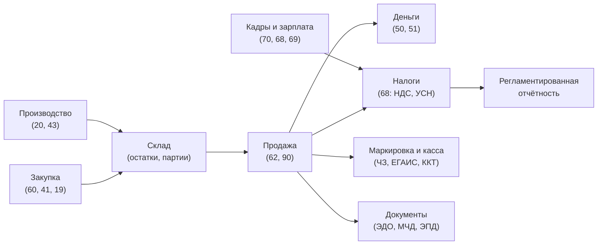
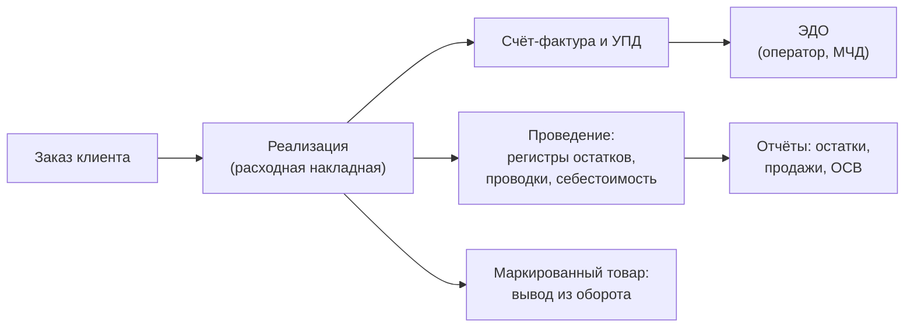
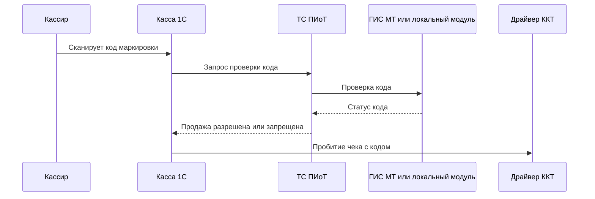
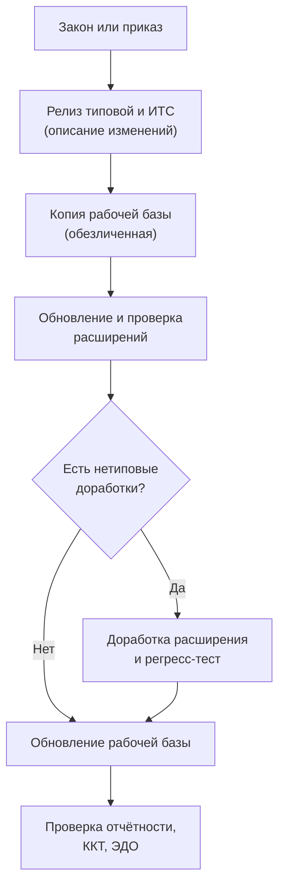

# Предметная область и законодательство для 1С-разработчика

[← Предыдущий](09_AI_Development.md) | [🗺 Оглавление](README.md) | [Следующий →](11_Checklists.md)

> Актуализировано: сентябрь 2026. Правовые факты сверены 29.09.2026 по досье проекта; первоисточники (nalog.gov.ru, consultant.ru, publication.pravo.gov.ru) при проверке напрямую не открывались. Перед тем как закладывать дату, ставку или номер акта в код, откройте первоисточник и запишите дату сверки.

Сильный разработчик 1С отличается от программиста общего профиля тем, что понимает, **что именно** он автоматизирует: бухгалтерию, склад, зарплату, налоги, маркировку. В официальной модели компетенций MC-6-001 (2025) от Junior уже ждут понимания основных и вспомогательных процессов компании-клиента (производство, торговля, услуги, бухгалтерский и налоговый учёт, кадры, зарплата, логистика). На тестовых заданиях при найме проверяют проводки и среднюю себестоимость (см. `08_Interview.md`). Этот файл даёт минимум предметной области и юридический контекст 2026 года, без которых типовые конфигурации читаются как набор непонятных ограничений.

Как читать:

- Новичок, этапы 0–2 (`02_Timeline.md`): разделы 2, 3, 5 и практикумы П1, П3, П10.
- Работаете у франчайзи или в инхаусе, этап 4 и дальше: разделы 6–11, 13 и практикумы П2, П4–П6.
- Ведёте расчёты, обмены, ЭДО: разделы 8–9 и практикумы П7, П8.
- Уровни достоверности юридических фактов: **[А]** — подтверждено артефактом (код типовой, XSD) или тремя независимыми источниками; **[Б]** — один-два согласованных вторичных источника; **[—]** — не подтверждено, в код не закладывать.

## 📊 Оглавление

- [1. Зачем программисту предметная область](#1-зачем-программисту-предметная-область)
- [2. Бухгалтерский учёт для программиста](#2-бухгалтерский-учёт-для-программиста)
- [3. Склад и торговля](#3-склад-и-торговля)
- [4. Производство](#4-производство)
- [5. Зарплата и кадры](#5-зарплата-и-кадры)
- [6. Налоги 2026](#6-налоги-2026)
- [7. Маркировка, ККТ и ЕГАИС](#7-маркировка-ккт-и-егаис)
- [8. ЭДО, МЧД, ЭПД и КЭП](#8-эдо-мчд-эпд-и-кэп)
- [9. Цифровой рубль](#9-цифровой-рубль)
- [10. ФСБУ и учётная политика](#10-фсбу-и-учётная-политика)
- [11. Персональные данные и безопасность](#11-персональные-данные-и-безопасность)
- [12. Регуляторный календарь 2025–2030](#12-регуляторный-календарь-20252030)
- [13. Как 1С выпускает обновления под законы](#13-как-1с-выпускает-обновления-под-законы)
- [14. Практикумы](#-14-практикумы)
- [15. Чего не писать](#15-чего-не-писать)
- [16. Самопроверка](#16-самопроверка)
- [Источники](#-источники)

## 1. Зачем программисту предметная область

Типовая конфигурация 1С — это закодированные правила учёта. Если вы не знаете, зачем нужна проводка Д19 К60 или почему остаток не может стать отрицательным, вы не сможете ни доработать конфигурацию, ни понять, что сломалось после обновления.



Чему это соответствует в конфигурациях (подробнее о линейках — в `05_Resources.md` и `tracks/`):

| Область | Типовые конфигурации | Что вы делаете как разработчик |
|---|---|---|
| Бухгалтерия и налоги | 1С:Бухгалтерия предприятия 3.0, УНФ | Печатные формы, обмены, доработки проведения, отчёты |
| Торговля и склад | УТ 11.5, Розница, УНФ | Документы, контроль остатков, цены, маркировка, интеграции |
| Производство и холдинг | КА 2.5, ERP 2.5, УХ | Спецификации, расчёт себестоимости, обмены, производительность |
| Зарплата и кадры | ЗУП 3.1 | Регистры расчёта, отчётность в СФР, КЭДО |
| Документооборот | ДО 3.0 | Процессы, обмен, права доступа |

УТ 11.5, КА 2.5 и ERP 2.5 — одна кодовая база (синхронные номера сборок), поэтому опыт в одной переносится на другие. Большие типовые (БП, ЗУП, УТ, КА, ERP, УХ, ДО) в 2026 году работают на платформе 8.3.27; на 8.5 перешли УНФ и Розница начиная с 3.0.13. Официального плана перевода остальных нет, подробности — в `01_Strategy.md`.

## 2. Бухгалтерский учёт для программиста

### Двойная запись в двух минутах

- Каждая операция отражается **проводкой**: по дебету (Д) одного счёта и кредиту (К) другого на одну и ту же сумму.
- Активные счета (касса, товары, основные средства) имеют дебетовое сальдо. Пассивные (расчёты с поставщиками, капитал) — кредитовое. Активно-пассивные (расчёты с покупателями, налоги) — любое.
- **ОСВ** (оборотно-сальдовая ведомость): сальдо на начало, обороты по Д и К, сальдо на конец. Если у вас в БД правильные проводки, ОСВ сходится: сумма оборотов по дебету равна сумме оборотов по кредиту.
- **Субконто** — аналитика счёта (контрагент, договор, номенклатура, склад, статья затрат). В 1С аналитика задаётся планом видов характеристик (ПВХ).
- Забалансовые счета ведут по простой записи и в ОСВ по сумме не сходятся — это нормально.

### Счета, которые нужно знать

| Счёт | Название | Тип |
|---|---|---|
| 01, 02 | Основные средства, амортизация ОС | А, П |
| 08 | Вложения во внеоборотные активы | А |
| 10 | Материалы | А |
| 19 | НДС по приобретённым ценностям | А |
| 20, 26 | Основное производство, общехозяйственные расходы | А |
| 41 | Товары | А |
| 43 | Готовая продукция | А |
| 44 | Расходы на продажу | А |
| 50, 51 | Касса, расчётные счета | А |
| 58 | Финансовые вложения | А |
| 60 | Расчёты с поставщиками и подрядчиками | А-П |
| 62 | Расчёты с покупателями и заказчиками | А-П |
| 66, 67 | Кредиты и займы | П |
| 68 | Налоги и сборы (68.01 НДФЛ, 68.02 НДС) | А-П |
| 69 | Социальное страхование и обеспечение | А-П |
| 70 | Расчёты с персоналом по оплате труда | П |
| 71 | Расчёты с подотчётными лицами | А-П |
| 76 | Расчёты с разными дебиторами и кредиторами | А-П |
| 80 | Уставный капитал | П |
| 84 | Нераспределённая прибыль (непокрытый убыток) | А-П |
| 90 | Продажи (90.01 выручка, 90.02 себестоимость, 90.03 НДС, 90.09 результат) | А-П |
| 91 | Прочие доходы и расходы | А-П |
| 99 | Прибыли и убытки | А-П |

### Проводки, которые нужно помнить наизусть

Пример на числах 2026 года: товар куплен за 122 000 ₽ с НДС 22% (расчётная ставка 22/122, то есть НДС 22 000, стоимость 100 000).

| Операция | Проводка | Сумма, ₽ |
|---|---|---|
| Поступление товара от поставщика | Д41 К60 | 100 000 |
| Входной НДС | Д19 К60 | 22 000 |
| Принят к вычету входной НДС | Д68.02 К19 | 22 000 |
| Оплата поставщику с расчётного счёта | Д60 К51 | 122 000 |
| Поступление материалов | Д10 К60 | по накладной |
| Продажа: выручка, включая НДС | Д62 К90.01 | 183 000 |
| Продажа: начислен НДС | Д90.03 К68.02 | 33 000 |
| Продажа: списана себестоимость | Д90.02 К41 | 100 000 |
| Оплата от покупателя на р/с | Д51 К62 | 183 000 |
| Розничная выручка в кассу | Д50 К90.01 | по кассе |
| Материалы в производство | Д20 К10 | по норме |
| Выпуск готовой продукции | Д43 К20 | по себестоимости |
| Отгрузка готовой продукции: себестоимость | Д90.02 К43 | по себестоимости |
| Начислена зарплата | Д20 (26, 44) К70 | по ведомости |
| Удержан НДФЛ | Д70 К68.01 | по шкале |
| Начислены страховые взносы | Д20 (26, 44) К69 | по тарифу |
| Выплата зарплаты | Д70 К50 (51) | к выплате |
| Выдача подотчёта | Д71 К50 | по РКО |
| Авансовый отчёт | Д10 (26, 44) К71 | по отчёту |
| Закупка ОС, ввод в эксплуатацию | Д08 К60, затем Д01 К08 | по акту |
| Амортизация | Д20 (26, 44) К02 | по графику |
| Закрытие месяца: результат продаж | Д90.09 К99 (или Д99 К90.09) | прибыль или убыток |

Продажа на 183 000 в таблице — это 150 000 без НДС плюс 33 000 НДС 22%. Оплата, налоговые вычеты, НДС с авансов, УСН и учёт при спецставках НДС устроены сложнее, чем в таблице. Смотрите, как это делает типовая, и не переписывайте правила по памяти.

### Как это выглядит в 1С

- **План счетов** — объект метаданных `ПланСчетов` (в типовых — `Хозрасчетный`). Каждому счёту заданы виды субконто, признаки валютного и количественного учёта, забалансовость.
- **Регистр бухгалтерии** хранит проводки и итоги, ведёт `Корреспонденция` (проводка Д–К) и одиночные записи по счёту.
- **ПВХ** «Виды субконто» определяет типы значений аналитики.

Проводка в модуле документа, для учебной конфигурации (имена предопределённых элементов у вас могут отличаться):

```bsl
Процедура ОбработкаПроведения(Отказ, РежимПроведения)

	Движения.Хозрасчетный.Записывать = Истина;

	Для Каждого СтрокаТовары Из Товары Цикл

		Проводка = Движения.Хозрасчетный.Добавить();
		Проводка.Период = Дата;
		Проводка.Организация = Организация;
		Проводка.СчетДт = ПланыСчетов.Хозрасчетный.Товары;
		Проводка.СчетКт = ПланыСчетов.Хозрасчетный.РасчетыСПоставщиками;
		Проводка.Сумма = СтрокаТовары.Сумма;
		Проводка.Содержание = НСтр("ru = 'Поступление товаров'");

		Проводка.СубконтоДт[ПланыВидовХарактеристик.ВидыСубконто.Номенклатура] = СтрокаТовары.Номенклатура;
		Проводка.СубконтоДт[ПланыВидовХарактеристик.ВидыСубконто.Склады] = Склад;
		Проводка.СубконтоКт[ПланыВидовХарактеристик.ВидыСубконто.Контрагенты] = Контрагент;

	КонецЦикла;

КонецПроцедуры
```

Практические замечания:

- Субконто заполняйте после того, как задан счёт: количество доступных субконто определяется счётом.
- На реальных задачах документы формируют проводки не вручную, а через типовые механизмы конфигурации (например, «Учётная политика» и модули учёта). Учебный пример нужен, чтобы понять механику (проект P6 в `07_Projects.md`).
- Цепочка «закупка → продажа → оплата» с проводками Д10–К60, Д90–К10, Д62–К90 встречается в реальных тестовых заданиях. Ждут, что вы выполните проводки и параллельно ведёте оперативный учёт в регистре накопления с одинаковым результатом.

## 3. Склад и торговля

### Что должен понимать разработчик

- **Оперативный учёт** (регистры накопления «остатки»): сколько товара лежит на складе прямо сейчас. Это данные для контроля остатков при проведении.
- **Бухгалтерский учёт** (регистр бухгалтерии): стоимость запасов на счёте 41 и прочих.
- **Партионный учёт**: остаток разбит по партиям поступления, у каждой своя стоимость. От выбранного способа списания зависит себестоимость проданного.
- **Резервы и заказы**: товар зарезервирован под заказ покупателя, но ещё лежит на складе. Регистры остатков и резервов ведутся отдельно.
- **Характеристики, серии, упаковки**: вариации одной номенклатуры (размер и цвет, срок годности, коробка и штука).
- **Цены и скидки**: типы цен, история цен (периодический регистр сведений), автоматические скидки.
- **Ордерная схема склада** в УТ: товар проходит через складские ордера, а не сразу одним документом. Включается функциональной опцией; на собеседованиях обычно спрашивают про идею, а не про детали.

### Способы оценки запасов по ФСБУ 5/2019

При выбытии запасов допустимы три способа: **по себестоимости каждой единицы**, **по средней себестоимости**, **ФИФО**. ЛИФО в российском бухучёте не применяется (его не было уже в ПБУ 5/01, которое ФСБУ 5/2019 заменил; утверждение «ФСБУ 5/2019 исключил ЛИФО» неверно).

Числовой пример (используйте его как тест в П10): приход 10 шт по 100 ₽, затем приход 10 шт по 120 ₽; продано 15 шт.

| Метод | Себестоимость продажи | Остаток 5 шт |
|---|---|---|
| ФИФО | 10 × 100 + 5 × 120 = 1 600 ₽ | 5 × 120 = 600 ₽ |
| Средняя (после обоих приходов) | 15 × 110 = 1 650 ₽ | 5 × 110 = 550 ₽ |

В сумме оба способа дают 2 200 ₽: разница только в том, как стоимость делится между расходом и остатком. Какой из вариантов средней оценки (взвешенная за период при закрытии месяца или скользящая) использует ваша типовая, смотрите в её учётной политике и документации.

### Контроль остатков и блокировки

Запрещать отрицательные остатки нужно так, чтобы два пользователя не списали один и тот же остаток одновременно. Правила из стандарта #661 (`its.1c.ru/db/v8std/content/661/hdoc`):

1. Читайте остатки блокирующим способом и как можно ближе к концу транзакции проведения, чтобы блокировка не держалась долго.
2. Движения регистров, где контроль не нужен (приход, перепроведение без увеличения расхода), записывайте в начале явно, с `БлокироватьДляИзменения = Ложь`.
3. Всегда пишите регистры в одном порядке (например, алфавитном).
4. Регистры с контролем записывайте в самом конце с `БлокироватьДляИзменения = Истина` (это снижает риск взаимоблокировок), затем запросом ищите отрицательные остатки. Если нашли — `Отказ = Истина`, транзакция отменяется.
5. У записываемых регистров накопления и бухгалтерии должно быть включено разделение итогов.

Готовый пример — в практикуме П3. Про транзакции см. также стандарт #783.

### Цикл торгового документа



## 4. Производство

Достаточно понимать логику, чтобы читать типовую и говорить с технологом.

- **Спецификация** (состав изделия): какие материалы и в каком количестве идут на единицу продукции.
- **Выпуск** продукции: документ списывает материалы по спецификации (Д20 К10) и оприходует продукцию (Д43 К20).
- **Полуфабрикаты и этапы**: продукция может выпускаться в несколько переделов.
- **Распределение затрат**: косвенные расходы (26) распределяются между видами продукции по выбранной базе (по прямым затратам, по выручке и т. п.). Реализуется регламентными операциями закрытия месяца.
- **Давальческое сырьё**: материалы принадлежат заказчику, собственный учёт ведётся на забалансовом счёте. Полезно знать, что такое бывает.
- Для разработчика главное — производственные документы работают на регистрах остатков, партий и затрат, так что все правила контроля остатков и блокировок (раздел 3) применимы и здесь. Производственные сценарии — зона КА 2.5 и ERP 2.5.

## 5. Зарплата и кадры

### Идеи, которые нужно понять

- **Расчёт зарплаты** строится на регистрах расчёта: начисление, удержание, базовый период, вытеснение (одно начисление отменяет другое на пересечении периодов), ведущие виды расчёта. Это самый сложный механизм платформы, его готовят перед 1С:Специалистом по платформе (`04_Certifications.md`).
- **Кадровый учёт**: приём, перевод, увольнение, отпуска, больничные, графики работы. Кадровые документы меняют состояние сотрудника на дату.
- **КЭДО** (кадровый электронный документооборот) — это **право** работодателя (ст. 22.1–22.3 ТК РФ, 377-ФЗ от 22.11.2021), а не обязанность [А]. Есть бесплатная государственная платформа «Работа в России».
- **Регламентированная отчётность в СФР**: с 30.12.2025 действует новая форма ЕФС-1 (приказ СФР от 17.11.2025 № 1462, зарегистрирован Минюстом 18.12.2025 № 84665). Второй приказ той же даты № 1463 существует, его предмет не установлен; путаница с номерами встречается в блогах [А−].

### Налоги и взносы с зарплаты в 2026 году

**НДФЛ** (пятиступенчатая шкала с 01.01.2025, Федеральный закон № 176-ФЗ от 12.07.2024) [А]. Повышенная ставка применяется только к сумме превышения порога:

| Годовой доход | Ставка |
|---|---|
| До 2,4 млн ₽ | 13% |
| От 2,4 до 5 млн ₽ | 15% |
| От 5 до 20 млн ₽ | 18% |
| От 20 до 50 млн ₽ | 20% |
| Свыше 50 млн ₽ | 22% |

**Страховые взносы 2026** [А для базы и МРОТ, Б для тарифов льготников]:

| Параметр | Значение |
|---|---|
| Единый тариф | 30% в пределах базы, 15,1% сверх базы |
| Единая предельная база | 2 979 000 ₽ (ПП № 1705 от 31.10.2025) |
| МРОТ | 27 093 ₽ (429-ФЗ от 28.11.2025); 1,5 МРОТ = 40 639,50 ₽ |
| МСП | Пониженный тариф (30% до 1,5 МРОТ, 15% сверх) только для МСП из перечня ОКВЭД по распоряжению Правительства № 4125-р от 27.12.2025 (54 кода), доля дохода от этого вида деятельности не менее 70% (п. 13.3 ст. 427 НК РФ) |
| IT-компании | 15% в пределах базы, 7,6% сверх (раньше 7,6% со всей суммы); условия применения сверяйте с НК |

Для разработчика ЗУП это регламентное изменение: коды тарифов в РСВ, проверка доли дохода для МСП, перечень ОКВЭД. IT-тариф затрагивает и компании-разработчиков, в том числе франчайзи, если они подпадают под условия НК РФ.

Налог на прибыль с 2025 года — 25% (176-ФЗ) [Б].

### Что смотреть в ЗУП

- Регистры расчёта и виды расчёта: начисления, удержания, взносы.
- Тарифы взносов, коды тарифов в РСВ, доля дохода для МСП.
- Формы отчётности в СФР (ЕФС-1) и КЭДО.
- Практикум П5: тарифы взносов в виде функции от параметров.

## 6. Налоги 2026

### НДС 22%

- Основная ставка НДС — **22%** с 01.01.2026 (Федеральный закон от 28.11.2025 № 425-ФЗ; п. 3 ст. 164 НК РФ) [А]. Ставки 10% и 0% сохранены; расчётные ставки 22/122 и 10/110.
- В ККТ реквизит «ставка НДС» (тег 1199) получил значения **11** (22%) и **12** (22/122). Ранее добавлены 7 (5%), 8 (7%), 9 (5/105), 10 (7/107) [А]. Для остальных значений тега смотрите таблицу требований ФФД, а не память.
- В типовых конфигурациях (по коду УНФ 3.0.12.237 и УТ 11.5.25.105) есть значения `НДС22`, `НДС22_122`, `НДС5`, `НДС5_105`, `НДС7`, `НДС7_107` в перечислении `СтавкиНДС`. Ставка по умолчанию определяется **функцией от даты**: в УНФ это `УчетНДСКлиентСервер.ОбщаяСтавкаНДС(Период)` (НДС18 до 2019 года, НДС20 до 01.01.2026, далее НДС22). Имена в вашей версии могут отличаться — проверяйте в своей конфигурации.
- Переходные случаи (аванс получен в 2025-м, отгрузка в 2026-м; корректировочные документы; длящиеся договоры) в проверке досье по существу не сверены [—]. Не выводите их правила сами: ищите методические рекомендации ФНС «НДС по новым правилам с 2026» и релиз-ноты типовой.
- Входной НДС у плательщика с правом вычета в себестоимость не входит. Входной НДС попадает в стоимость при спецставках 5%/7% без вычета (см. ниже) и в ряде других случаев.

### УСН и НДС

С 2025 года упрощенцы — плательщики НДС (Федеральный закон № 176-ФЗ), но освобождены, пока доход ниже порога (ст. 145 НК РФ).

| Параметр | Значение | Уровень |
|---|---|---|
| Порог освобождения | 20 млн ₽ по доходам за 2025–2028 годы, 15 млн ₽ — за 2029 год, 10 млн ₽ — за 2030 год (Федеральный закон от 04.07.2026 № 228-ФЗ) | [А] по совокупности |
| Прежний график 425-ФЗ (15 млн, затем 10 млн в 2027–2028) | Отменён 228-ФЗ | [А] |
| Спецставки без вычетов | 5% при доходе от 20 до 272,5 млн ₽; 7% от 272,5 до 490,5 млн ₽ | [Б] |
| Альтернатива | Общая ставка 22% с правом на вычеты | [Б] |
| Выбор ставки | Применяется 12 кварталов подряд (с оговорками) | [Б] |
| Превышение порога в течение года | Обязанности по НДС возникают с 1-го числа следующего месяца | [Б] |
| Лимит дохода для УСН на 2026 год | 490,5 млн ₽ | [Б] |
| Патент (ПСН) | Лимит дохода 20 млн ₽ в 2026-м, 15 млн в 2027-м, 10 млн с 2028-го; 228-ФЗ патент не затронул | [Б] |

Важно:

- В 228-ФЗ годы означают **годы дохода**. Разбор источников даёт такую интерпретацию по годам применения: освобождение в 2026–2029 годах при доходе не выше 20 млн ₽, в 2030-м не выше 15 млн ₽, с 2031-го не выше 10 млн ₽. Формулировки в новостях двусмысленны, всегда уточняйте, о каком годе речь: о годе дохода или о годе применения.
- Упрощенцы сверх порога **остаются на УСН** и платят НДС 5%/7% без вычетов или 22% с вычетами. «Массовый переход на ОСНО» источниками не подтверждён, а лимит самой УСН на 2026 год вырос до 490,5 млн ₽.
- В УНФ 3.0.12.237 пороги оформлены функциями `ПорогОсвобожденияОтНДС(Период)`, `ПорогПримененияПониженнойСтавкиНДСПриУСН(Период)`, `ПорогПримененияОбщейСтавкиНДСПриУСН(Период)`, и на 2026 год там ещё значения прежнего графика (60/250/450 млн) с комментарием, что точной информации на момент релиза нет. Законодательная константа — это функция от периода, и её уточняют следующие релизы. 228-ФЗ принят 04.07.2026, спустя полгода после 425-ФЗ, и отменил заложенный им график.

### Форматы и отчётность, которые изменились в 2026 году

| Что | Когда | Основание | Уровень |
|---|---|---|---|
| Новые форматы книги покупок, книги продаж и журнала учёта счетов-фактур | 01.07.2026 | Приказ ФНС от 17.03.2026 № ЕД-1-26/186@ | [Б] |
| Единая форма уведомления по УСН КНД 1154004 (заменила пять форм) | 01.07.2026 | Приказ ФНС от 30.04.2026 № ЕД-1-3/285@ | [Б] |
| Новая ЕФС-1 | 30.12.2025 | Приказ СФР от 17.11.2025 № 1462 | [А−] |
| Отмена штрафа по п. 1 ст. 119 НК РФ за несвоевременную подачу нулевых деклараций | 26.06.2026 | Законы № 201-ФЗ и № 220-ФЗ (2026) | [Б] |

Смысл для разработчика: XML-форматы и формы меняются каждый год, поэтому регресс-тесты выгрузок и отчётов — обязательная часть любого обновления.

### НДС на лицензии 1С и услуги (вывод, не факт)

Права на ПО из реестра российского ПО облагаются в порядке пп. 26 п. 2 ст. 149 НК РФ (освобождение от НДС) [Б]; услуги внедрения и сопровождения облагаются по общей ставке. Сузил ли 425-ФЗ состав льготы и как рост ставки сказался на ценах 1С, ИТС и франчайзи, в проверке **не подтверждено** [—]. Актуальные условия смотрите в прайсе 1С и в НК РФ.

## 7. Маркировка, ККТ и ЕГАИС

### Как устроена продажа маркированного товара

Товар получает код маркировки в системе «Честный ЗНАК» (ГИС МТ). Жизненный цикл: эмиссия кода производителем, ввод в оборот, приёмка по ЭДО (УПД), продажа с выводом из оборота через кассу.



- **ТС ПИоТ** — «Технические средства получения информации о товаре» (формулировка из панели администрирования ИСМП в типовых УТ и УНФ) [А]. Это программный модуль у кассы, который перед пробитием чека проверяет код в ГИС МТ и работает также офлайн через локальный модуль ЧЗ. Печать чека идёт отдельным каналом через драйвер ККТ [А по документации].
- Основание разрешительного режима — ПП № 1944 от 21.11.2023; изменения — ПП № 1674 от 29.11.2024 [Б].
- **Сроки перехода** по разъяснению «Честного ЗНАКа» от 10.09.2026: прежний протокол с токеном X-API-KEY технически доступен до **01.10.2026**; с 01.07.2026 фиксируются отклонения, которые могут передаваться контролирующим органам [А по трём независимым источникам]. Утверждение блогов «с 01.07.2026 касса без ТС ПИоТ не пробьёт чек» разъяснением не подтверждено.
- В типовых УНФ 3.0.12.237 и УТ 11.5.25.105 есть модули `ИнтеграцияТСПИоТКлиентСервер`, `ИнтеграцияТСПИоТВызовСервера`, `ИнтеграцияТСПИоТВебКлиент` (в УТ ещё `МенеджерОборудованияТСПИоТ`), функции вроде `ПолучитьНастройкиЭкземпляраТСПИоТ` и `ДанныеПоКодуМаркировкиПриРозничнойПродаже` (учитывает аварийный режим). Настройки подключения — в панели администрирования ИСМП («Настройки подключения к ТС ПИоТ»).
- Новая товарная группа в типовой — это, как правило, новое значение перечисления `ВидыПродукцииИС`. Например, `РадиоэлектроннаяПродукция`, `ТелефоныИНоутбуки`, `ПечатныеПлаты` есть в коде УНФ и УТ [А]. Обязательная маркировка радиоэлектроники с 01.05.2026 — по ПП № 1954 от 28.11.2025 [Б, один фактчек].
- Другие товарные группы (пиво, безалкогольные напитки, косметика и бытовая химия, игрушки, консервы, молочная продукция) приходят поэтапно в течение 2026 года, но даты в доступных источниках расходятся между собой. Актуальные сроки берите в разделе «Товарные группы» на сайте «Честного ЗНАКа», а не из блогов.
- Одежда и обувь маркируются давно (ПП № 1956 от 31.12.2019 и ПП № 860 от 05.07.2019 соответственно). «Четвёртая волна одежды» и «мех как новинка» подтверждения не нашли.
- Штрафы по ст. 15.12 КоАП РФ (по отраслевому блогу): для ИП 5–10 тыс. ₽, для юрлиц 50–300 тыс. ₽ с конфискацией [Б/—].
- Закон о платформенной экономике (289-ФЗ от 31.07.2025) вступает в силу 01.10.2026; порядок применения ККТ он не меняет [Б]. Точное название закона сверьте по первоисточнику. Для 1С это интеграции с маркетплейсами.

**Оборудование.** Для новой ставки НДС в ККТ нужны обновлённые прошивка ККТ, драйвер (ревизия интерфейса) и компонента. Пример: для обработки «ККТ-ОНЛАЙН» для 22% указана ревизия интерфейса компоненты не ниже 4007; кассы без прошивки работают в специальном режиме [А по документации обработки]. Правило: ничего не обновляйте в рабочем контуре без тестовой кассы.

### ЕГАИС

Бумажный журнал розничных продаж алкоголя отменён. С 2026 года розничное выбытие маркированного пива передаётся из «Честного ЗНАКа» в ЕГАИС автоматически, по кегам остаются акты вскрытия [Б/—]. Других подтверждённых изменений ЕГАИС на 2025–2026 годы найти не удалось, поэтому в роудмапе достаточно связки «ЕГАИС ↔ ЧЗ для пива» и понимания роли УТМ.

## 8. ЭДО, МЧД, ЭПД и КЭП

### ЭДО и форматы

- Для счёта-фактуры и передаточного документа применяется формат **УПД 5.03** (приказ ФНС от 19.12.2023 № ЕД-7-26/970@ в редакции от 15.11.2024) [А]. В УТ форматы электронных документов описаны в регистре `ФорматыЭлектронныхДокументов`.
- Обмен идёт через оператора ЭДО. В типовых за обмен отвечает библиотека электронных документов (БЭД) и интернет-поддержка пользователей (БИП); версии библиотек привязаны к версии типовой, проверяйте в `05_Resources.md` и в релиз-нотах.

### МЧД (машиночитаемая доверенность)

- Единый формат — версия 003, схема `EMCHD_1` (файл XSD `ON_EMCHD_1_928_00_01_01_01.xsd`, пространство имён `urn://x-artefacts/EMCHD_1`) [А].
- В XSD у физлица-представителя (`СвФЛТип`) атрибуты **`ИННФЛ`, `СНИЛС`, `Должность` — необязательные** (`use="optional"`). Утверждение «в МЧД обязательно поле „Должность“» **опровергнуто**: отдельные получатели или сценарии могут требовать больше, но форматом это не установлено. Для ИП обязательны `ОГРНИП`, `ИННФЛ` и `СНИЛС` (`СведИПТип`), для физлица-доверителя (`ФЛДоверТип`) — `СНИЛС`. Обязательны реквизиты `ВидДовер`, `ПрПередов`, `ВнНомДовер`, `ТипПолн`, `ПрСовмПолн`.
- Правовая основа — ст. 17.2–17.3 Федерального закона № 63-ФЗ «Об электронной подписи» [Б].
- В БСП 3.1 есть справочник `МашиночитаемыеДоверенности` с загрузкой формата 003 и разбором сведений о должностном лице (`СНИЛС`, `Должность`, `СведФЛ`) [А]. Сроки переходного периода по МЧД (формат 002, подписи без МЧД) в проверке не подтверждены — не указывайте их.
- Сервис ФНС «Создание и проверка доверенности» формирует XML и регистрирует его в распределённом реестре [Б].

### ЭПД и ЭТрН

- Федеральный закон от 07.06.2025 № 140-ФЗ: с **01.09.2026** перевозочные документы обязательны в электронном виде (ЭТрН, заказ-наряд, договор-заявка, сопроводительная ведомость, документы экспедитора). Электронный путевой лист остаётся правом [А].
- Обмен идёт через операторов ИС ЭПД из реестра Минтранса и ГИС ЭПД. Формат ЭТрН — приказ ФНС от 09.12.2021 № ЕД-7-26/1065@. Реестр экспедиторов «ГосЛог» — с 01.03.2026 [Б].
- В УНФ и УТ есть обработка `ЭлектронныеПеревозочныеДокументы` и модули `СервисВзаимодействияМПЭПД`, `СервисВзаимодействияМПЭПДКлиент` [А]. Штрафы — ст. 11.14.3 КоАП РФ [Б].

### КЭП

- КЭП руководителя юрлица и ИП выдаёт УЦ ФНС. **Перевыпуск** доступен в личном кабинете юрлица или ИП. «Госключ» — приложение для подписей физлица; утверждение «удалённый выпуск КЭП руководителя через Госключ без посещения УЦ» не подтверждено [—].
- Для отчётности в СФР с 01.09.2026 в сертификате обязателен атрибут «Согласование ключей» (`keyAgreement`); сертификаты УЦ ФНС, выпущенные после 28.08.2025, его содержат [Б]. Для 1С это проверка сертификатов клиентов до сдачи отчётности.

## 9. Цифровой рубль

Федеральный закон от 23.07.2025 № 248-ФЗ установил поэтапное внедрение при приёме безналичной оплаты [Б]:

| Этап | Дата | Кто обязан |
|---|---|---|
| 1 | 01.09.2026 | Крупнейшие банки и торговые компании с выручкой более 120 млн ₽ в год |
| 2 | 01.09.2027 | Банки с универсальной лицензией и торговцы с выручкой более 30 млн ₽ |
| 3 | 01.09.2028 | Банки с базовой лицензией и остальные торговцы (порог в источниках расходится, не указывать) |

На 22–23.09.2026 открыто около 200 тыс. счетов [Б]. Поддержку приёма цифрового рубля в типовых УТ, Розница и УНФ поиск по коду не подтвердил [—]: пишите «проверяйте по релиз-нотам» и не обещайте клиенту готовую функцию.

## 10. ФСБУ и учётная политика

| Стандарт | Что важно | Статус |
|---|---|---|
| ФСБУ 5/2019 «Запасы» | Три способа оценки при выбытии (см. раздел 3) | Действует [А] |
| ФСБУ 4/2023 «Бухгалтерская (финансовая) отчётность», приказ Минфина от 04.10.2023 № 157н | Применяется с 2025 года | Действует [А] |
| ФСБУ 28/2023 «Инвентаризация», приказ от 13.01.2023 № 4н | Применяется с 2025 года | Действует [А] |
| ФСБУ 14/2022 «Нематериальные активы» (приказ от 30.05.2022 № 86н) и изменения ФСБУ 26/2020 | Обязательны с 2024 года | Действуют [Б] |
| **ФСБУ 9/2025 «Доходы»**, приказ Минфина № 56н | Обязателен с отчётности за 2027 год, досрочное применение разрешено; заменяет ПБУ 9/99 | [А] по совокупности |
| **ФСБУ 10/2026 «Расходы»**, приказ Минфина от 24.04.2026 № 53н | Вступает в силу с 01.01.2027, заменит ПБУ 10/99; досрочное применение не подтверждено | [Б+] |

«ФСБУ 10/2025» не существует, правильное название — ФСБУ 10/2026. В 2026 году новых обязательных федеральных стандартов бухучёта не вводилось. В коде типовых на GitHub упоминаний ФСБУ 9/2025 и 10/2026 найдено не было, и релизы БП, КА и ERP с их поддержкой не подтверждены — следите за релиз-нотами. Для БП, КА и ERP это крупное изменение учёта доходов и расходов, которое ожидается к 2027 году.

## 11. Персональные данные и безопасность

### 152-ФЗ и оборотные штрафы

С 30.05.2025 действует ст. 13.11 КоАП РФ в редакции 420-ФЗ от 30.11.2024 [А]. Утечка ПДн: от 3 до 15 млн ₽ в зависимости от числа субъектов и категорий, биометрия — 15–20 млн ₽. **Повторная утечка — оборотный штраф 1–3% годовой выручки, от 20 до 500 млн ₽** (минимум 25 млн ₽ — за специальные категории и биометрию; в роудмапе достаточно «от 20 млн ₽»). Уголовная ответственность — ст. 272.1 УК РФ (421-ФЗ) [А]. Уведомление РКН об инциденте — в течение 24 часов, о результатах расследования — в течение 72 часов [Б].

Что это значит на практике для разработчика 1С:

- Копию рабочей базы (ЗУП, КЭДО, CRM) нельзя отдавать в разработку, тестирование и внешним LLM без **обезличивания**. Практикум П9.
- Данные клиента — предмет NDA и коммерческой тайны (98-ФЗ). Передача ПДн во внешние LLM — трансграничная передача (152-ФЗ). Подробнее — `09_AI_Development.md`.
- Пароли и ключи интеграций в базе хранятся в безопасном хранилище БСП (данные там сжаты, но **не зашифрованы**); при копировании базы их нужно чистить. См. также `SECURITY.md`.

### Госзаказчики: приказ ФСТЭК № 117

Приказ ФСТЭК России от 11.04.2025 № 117 действует с **01.03.2026**, заменил приказ № 17 и распространяется **только** на ГИС и иные информационные системы госорганов, ГУП и госучреждений [А]; на обычные коммерческие компании не распространяется. Значимое для разработчика [Б+]:

- п. 60: не допускается передача лицу, разработавшему модель ИИ, информации ограниченного доступа, в том числе для улучшения модели;
- п. 50: при собственной разработке ПО нужна безопасная разработка по ГОСТ Р 56939-2024;
- п. 58: запрет разработки и тестирования в промышленных средах;
- п. 38: сроки устранения уязвимостей (критические — 24 часа, высокие — 7 дней).

Для решений госучреждений стандарт #785 (`its.1c.ru/db/v8std/content/785/hdoc`) требует ориентироваться на последний сертифицированный релиз платформы 1С:Предприятие 8.3z; номер релиза публикуется на странице 8.3z на online.1c.ru. Номер сертификата ФСТЭК и уровень доверия в проверке **не найдены** [—], не указывайте их.

### Импортозамещение

Указ Президента от 30.03.2022 № 166 запрещает с 01.01.2025 использовать иностранное ПО на значимых объектах КИИ [Б, один источник]. Платформа 1С и российские ОС (Astra Linux, РЕД ОС) входят в контекст импортозамещения. Формулируйте без номеров актов, которые вы не проверили.

## 12. Регуляторный календарь 2025–2030

| Дата | Событие | Что затрагивает в 1С | Уровень |
|---|---|---|---|
| 01.01.2025 | НДФЛ 13–22%, налог на прибыль 25%, НДС на УСН (порог 60 млн ₽) | ЗУП и БП: шкала НДФЛ, ставки 5/7% | [А]/[Б] |
| 01.01.2025 | Указ № 166: запрет иностранного ПО на значимых объектах КИИ | Импортозамещение, выбор ОС и СУБД | [Б] |
| 30.05.2025 | Оборотные штрафы за повторную утечку ПДн (420-ФЗ) | Обезличивание копий, права, журналы | [А] |
| 30.12.2025 | Новая ЕФС-1 (приказ СФР № 1462) | Отчётность в СФР | [А−] |
| 01.01.2026 | НДС 22%; порог НДС на УСН 20 млн ₽; взносы (МСП по 4125-р, IT 15%/7,6%), база 2 979 000 ₽ | Ставки, ККТ (тег 1199 = 11/12), ЗУП | [А] |
| 01.03.2026 | Приказ ФСТЭК № 117 (ГИС); реестр экспедиторов «ГосЛог» | Требования госзаказчика; ЭПД | [А]/[Б] |
| 01.05.2026 | Маркировка радиоэлектроники (ПП № 1954) | `ВидыПродукцииИС` | [Б] |
| 01.07.2026 | ЧЗ фиксирует отклонения без ТС ПИоТ; новые форматы книг покупок и продаж; КНД 1154004 | ИСМП, регламентированная отчётность | [Б] |
| 04.07.2026 | 228-ФЗ: порог НДС на УСН 20 млн ₽ по доходам 2025–2028 годов | Функции-пороги (`ПорогОсвобожденияОтНДС`) | [А] |
| 01.09.2026 | ЭПД и ЭТрН обязательны (140-ФЗ); цифровой рубль, этап 1; КЭП для СФР с `keyAgreement` | `ЭлектронныеПеревозочныеДокументы`, подписи | [А]/[Б] |
| 01.10.2026 | Отключение X-API-KEY, проверка кодов на кассе через ТС ПИоТ; 289-ФЗ | Настройки ТС ПИоТ в панели ИСМП | [А]/[Б] |
| 01.01.2027 | ФСБУ 9/2025 «Доходы» и ФСБУ 10/2026 «Расходы» | Переделка учёта доходов и расходов в БП, КА, ERP | [А]/[Б+] |
| 2027–2028 | Лимит ПСН 15 млн ₽ (2027), 10 млн ₽ (с 2028) | Патент, лимиты режимов | [Б] |
| 01.09.2027 | Цифровой рубль, этап 2 (более 30 млн ₽) | Эквайринг и касса | [Б+] |
| 01.09.2028 | Цифровой рубль, этап 3 (порог не установлен) | Эквайринг и касса | [—] |
| 2029 | Порог НДС на УСН 15 млн ₽ (доход за 2029 год) | Функции-пороги | [А] |
| 2030 | Порог НДС на УСН 10 млн ₽ (доход за 2030 год) | Функции-пороги | [А] |

Календарь — повод завести привычку: раз в квартал открывайте раздел мониторинга законодательства на ИТС и релиз-ноты типовой (раздел 13) и обновляйте свои заметки.

## 13. Как 1С выпускает обновления под законы



- Фирма «1С» выпускает **релизы** типовых конфигураций (новые сборки появляются в течение всего года; номера сборок и даты смотрите на releases.1c.ru и в «Информации об обновлениях» ИТС — `https://its.1c.ru/db/updinfo`). Подписчики ИТС получают их через сайт и через БИП. Большая часть ИТС доступна по платной подписке.
- В релизе законодательные изменения описаны в «Описании изменений». Читайте его перед каждым обновлением: там перечислены форматы, которые изменились, и то, что нужно перенастроить.
- Исправления выходят и **патчами-расширениями** (назначение расширения «Исправление»). Их подключает и удаляет БСП.
- Законодательные константы в типовых реализованы **функциями от даты** (пример выше: ставка НДС, пороги НДС на УСН). Значения уточняются в следующих релизах: в УНФ 3.0.12.237 на 2026 год пороги ещё старого графика, а закон уже изменился. Следовательно, никогда не хардкодьте ставки и лимиты в нескольких местах.
- Что происходит с нетиповой конфигурацией: правки типового кода при обновлении надо сливать вручную. Пример из открытого репозитория: в нетиповой конфигурации ставку 22% пришлось вписывать вручную в несколько модулей (`УчетНДСКлиентСервер`, `ПечатьЧека` и др.). Расширение с префиксом, `&Перед` и `&После` и настройки через `*Переопределяемый` снижают трудоёмкость. Слова «изменение типовой запрещено» не используйте.
- Обновление большой базы может идти часами: планируйте окно, копию и откат. Фраза «обновляется автоматически за минуты» неверна.
- Оборудование и внешние компоненты обновляются отдельно (прошивки ККТ, драйверы БПО, локальный модуль ЧЗ).

Что делает программист, когда выходит закон:

1. Определяет, затронуты ли его базы, и с какой даты действует норма.
2. Читает «Описание изменений» релиза и первоисточник.
3. Проверяет на обезличенной копии, с расширениями и внешними обработками.
4. Смотрит регламентированные отчёты, форматы выгрузок, кассу и ЭДО.
5. Фиксирует в журнале изменений: дата, номер акта, версия релиза, кто проверил.

## 🧪 14. Практикумы

Практикумы упорядочены от простого к сложному. Общий формат: цель, что сделать, критерии готовности. Связь с проектами `07_Projects.md`: П1, П2 и П4 дополняют P3 (ставки НДС в продажах); П3 — P2 и P6; П5 — самостоятельное упражнение без проекта; П6 — P10 и P11; П7–П8 — аналитические задания без проекта; П9 — P15 и P17; П10 — P5.

### П1. Ставка НДС по дате

**Цель:** понять, что законодательная константа — функция от периода. **Что сделать:** в общем модуле «Сервер и клиент» (без глобального контекста) реализовать ставку по умолчанию по образцу типовой и расчёт НДС из суммы «с НДС».

```bsl
// Общий модуль НДСУчебныйКлиентСервер (флажки: Сервер, Клиент).

// Общая ставка НДС в процентах на дату.
Функция ОбщаяСтавкаНДСПроцент(Знач Период) Экспорт

	Если Период < '20190101' Тогда
		Возврат 18;
	ИначеЕсли Период < '20260101' Тогда
		Возврат 20;
	Иначе
		Возврат 22;
	КонецЕсли;

КонецФункции

// НДС из суммы, включающей налог (расчётная ставка 22/122, 20/120).
Функция СуммаНДСИзСуммыСНДС(Знач СуммаСНДС, Знач СтавкаПроцент) Экспорт

	Возврат Окр(СуммаСНДС * СтавкаПроцент / (100 + СтавкаПроцент), 2);

КонецФункции
```

Тест на границе, который можно запустить из внешней обработки или в тестовом фреймворке (см. `07_Projects.md`):

```bsl
Процедура ПроверитьНДСНаГраницеГода() Экспорт

	ПроверитьРавенство(НДСУчебныйКлиентСервер.ОбщаяСтавкаНДСПроцент('20251231'), 20, "31.12.2025");
	ПроверитьРавенство(НДСУчебныйКлиентСервер.ОбщаяСтавкаНДСПроцент('20260101'), 22, "01.01.2026");
	ПроверитьРавенство(НДСУчебныйКлиентСервер.СуммаНДСИзСуммыСНДС(122000, 22), 22000, "22/122");
	ПроверитьРавенство(НДСУчебныйКлиентСервер.СуммаНДСИзСуммыСНДС(120000, 20), 20000, "20/120");

КонецПроцедуры

Процедура ПроверитьРавенство(Фактическое, Ожидаемое, Пояснение)

	Если Фактическое <> Ожидаемое Тогда
		ВызватьИсключение СтрШаблон(
			НСтр("ru = 'Тест не пройден (%1): ожидалось %2, получено %3'"),
			Пояснение, Ожидаемое, Фактическое);
	КонецЕсли;

КонецПроцедуры
```

**Готово, когда:** тест зелёный; вы нашли в вашей учебной конфигурации (или в открытом коде типовой) аналог функции и объяснили, чем он отличается. **Звёздочка:** учесть переходные случаи можно только по методическим рекомендациям ФНС — сначала найдите их, не придумывайте.

### П2. Порог НДС на УСН по году дохода

**Цель:** сделать функцию, устойчивую к путанице «год дохода — год применения». **Что сделать:**

```bsl
// Порог освобождения от НДС для УСН по году, за который считается доход (рубли).
// Основание: п. 1 ст. 145 НК РФ в редакции 228-ФЗ от 04.07.2026.
// Проверьте актуальную редакцию на nalog.gov.ru или consultant.ru.
Функция ПорогОсвобожденияОтНДСПоГодуДохода(Знач ГодДохода) Экспорт

	Если ГодДохода < 2025 Тогда
		ВызватьИсключение НСтр("ru = 'До 2025 года порог определяется прежними правилами'");
	ИначеЕсли ГодДохода <= 2028 Тогда
		Возврат 20000000;
	ИначеЕсли ГодДохода = 2029 Тогда
		Возврат 15000000;
	Иначе
		Возврат 10000000;
	КонецЕсли;

КонецФункции

// С какой даты возникают обязанности по НДС, если порог превышен на указанную дату.
// Правило: с 1-го числа следующего месяца (проверьте по разъяснениям ФНС).
Функция ДатаНачалаОбязанностейПоНДС(Знач ДатаПревышения) Экспорт

	Возврат НачалоМесяца(ДобавитьМесяц(ДатаПревышения, 1));

КонецФункции
```

Дальше сделайте регистр сведений «Применение НДС на УСН» с периодичностью «по месяцам», измерением «Организация» и ресурсом-перечислением (освобождение, 5%, 7%, 22%). Реализуйте: накопленный доход (запрос к обороту), контроль превышения и предложение поменять режим. Проверьте: превышение 15 марта → обязанности с 1 апреля; год дохода 2029 → 15 млн ₽.

**Готово, когда:** есть тесты на границы годов 2028/2029/2030 и на переход в начале и в конце месяца; в комментарии указана дата сверки с первоисточником.

### П3. Проведение расходной накладной с контролем остатков

**Цель:** правильно организовать контроль остатков (стандарт #661) и блокировки. Предпосылки: документ `РасходнаяНакладная` с табличной частью `Товары` (реквизиты `Номенклатура`, `Количество`), регистр накопления `ТоварыНаСкладах` (вид «Остатки», измерения `Склад`, `Номенклатура`, ресурс `Количество`).

```bsl
Процедура ОбработкаПроведения(Отказ, РежимПроведения)

	// Порядок записи регистров одинаков во всех документах (например, алфавитный).
	// Регистры без контроля остатков записываются раньше с БлокироватьДляИзменения = Ложь.
	Движения.ТоварыНаСкладах.Записывать = Истина;
	Движения.ТоварыНаСкладах.БлокироватьДляИзменения = Истина;

	Для Каждого СтрокаТовары Из Товары Цикл
		Движение = Движения.ТоварыНаСкладах.Добавить();
		Движение.ВидДвижения = ВидДвиженияНакопления.Расход;
		Движение.Период = Дата;
		Движение.Склад = Склад;
		Движение.Номенклатура = СтрокаТовары.Номенклатура;
		Движение.Количество = СтрокаТовары.Количество;
	КонецЦикла;

	// Регистр с контролем остатков записывается в самом конце транзакции проведения.
	Движения.ТоварыНаСкладах.Записать();

	КонтрольОтрицательныхОстатков(Отказ);

КонецПроцедуры

Процедура КонтрольОтрицательныхОстатков(Отказ)

	Запрос = Новый Запрос;
	Запрос.УстановитьПараметр("Склад", Склад);
	Запрос.УстановитьПараметр("Номенклатура", Товары.ВыгрузитьКолонку("Номенклатура"));
	Запрос.Текст =
	"ВЫБРАТЬ
	|	Остатки.Номенклатура КАК Номенклатура,
	|	-Остатки.КоличествоОстаток КАК Нехватка
	|ИЗ
	|	РегистрНакопления.ТоварыНаСкладах.Остатки(
	|		,
	|		Склад = &Склад
	|		И Номенклатура В (&Номенклатура)) КАК Остатки
	|ГДЕ
	|	Остатки.КоличествоОстаток < 0";

	Выборка = Запрос.Выполнить().Выбрать();
	Пока Выборка.Следующий() Цикл
		Сообщение = Новый СообщениеПользователю;
		Сообщение.Текст = СтрШаблон(
			НСтр("ru = 'Не хватает %1 ед. товара %2'"),
			Выборка.Нехватка, Выборка.Номенклатура);
		Сообщение.Сообщить();
		Отказ = Истина;
	КонецЦикла;

КонецПроцедуры
```

Обратите внимание: условие по измерениям стоит в параметре виртуальной таблицы `Остатки`, а не в `ГДЕ` (стандарт #657); запрос один, вне цикла; данные для проверки берутся из БД после записи движений в той же транзакции. Сообщения показывайте не модальными окнами (в серверном коде модальных вызовов нет вообще).

**Готово, когда:** два одновременных сеанса, проводящих накладные на один остаток, не приводят к отрицательному остатку (проверьте вручную на клиент-серверной базе); перепроведение неизменённой накладной проходит; отчёт о нехватке показывает и название товара, и количество. **Звёздочка:** добавьте проводки Д90.02 К41 в регистр бухгалтерии в том же документе и сравните оперативный и бухгалтерский остаток.

### П4. Книга продаж по ставкам и сверка с кассой

**Цель:** научиться собирать отчёт по нескольким ставкам НДС, включая 22%, 20%, 10%, 5% и 7%. **Что сделать:** регистр накопления `НДСПродажи` вида «Обороты» (измерения — `Организация`, `СтавкаНДС`; ресурсы — `СуммаБезНДС`, `СуммаНДС`) наполняется при проведении реализаций. Запрос:

```sql
ВЫБРАТЬ
	Обороты.СтавкаНДС КАК СтавкаНДС,
	Обороты.СуммаБезНДСОборот КАК СуммаБезНДС,
	Обороты.СуммаНДСОборот КАК СуммаНДС
ИЗ
	РегистрНакопления.НДСПродажи.Обороты(&Начало, &Конец, , Организация = &Организация) КАК Обороты
УПОРЯДОЧИТЬ ПО
	Обороты.СтавкаНДС
```

Отдельно составьте таблицу соответствия «значение перечисления `СтавкиНДС` → код тега 1199» (для 22% это 11, для 22/122 — 12, для 5% — 7, для 7% — 8) и проверьте, что итоги отчёта совпадают с итогами по кассовым чекам за период.

**Готово, когда:** отчёт сходится с оборотами по счёту 68.02 (или 90.03) на тестовых данных, ставка определяется по дате документа, а не по текущей.

### П5. Тариф страховых взносов

**Цель:** отделить правила от кода. **Что сделать:** функция расчёта за год для двух категорий плательщика; предельная база и МРОТ хранятся не в коде, а в периодическом регистре сведений (здесь для простоты вынесены в функцию).

```bsl
// Предельная база на год (2026: ПП № 1705 от 31.10.2025). Для других лет — из соответствующих актов.
Функция ПредельнаяБазаВзносов(Знач Год)

	Если Год = 2026 Тогда
		Возврат 2979000;
	КонецЕсли;

	ВызватьИсключение СтрШаблон(
		НСтр("ru = 'Предельная база на %1 год не задана'"), Формат(Год, "ЧГ=0"));

КонецФункции

// Взносы за год по одному работнику. Категория: "Общий" или "IT".
// Тарифы по состоянию на 2026 год, условия льготного тарифа сверьте с НК РФ.
Функция ВзносыЗаГод(Знач ВыплатыЗаГод, Знач Год, Знач Категория) Экспорт

	База = ПредельнаяБазаВзносов(Год);
	ВПределах = Мин(ВыплатыЗаГод, База);
	Сверх = Макс(ВыплатыЗаГод - База, 0);

	Если Категория = "IT" Тогда
		Возврат Окр(ВПределах * 0.15 + Сверх * 0.076, 2);
	КонецЕсли;

	Возврат Окр(ВПределах * 0.30 + Сверх * 0.151, 2);

КонецФункции
```

**Готово, когда:** тесты — выплаты 1 млн ₽ (общий тариф даёт 300 000 ₽), 3 млн ₽ (893 700 + 21 000 × 0,151 = 896 871 ₽) и граница 2 979 000 ₽. Проверьте арифметику самостоятельно, а не доверяйте таблице. **Звёздочка:** реализуйте МСП из перечня 4125-р: 30% до 1,5 МРОТ (40 639,50 ₽ в месяц) и 15% сверх, с проверкой доли дохода не менее 70%. Помните, что тариф МСП считается по месяцам, а не за год.

### П6. Заглушка ТС ПИоТ

**Цель:** отработать HTTP-сервис и сценарий «проверка кода на кассе» без реального оборудования. Важно: это **учебный эмулятор**, а не реальный API ТС ПИоТ и не реальный протокол «Честного ЗНАКа». **Что сделать:** HTTP-сервис `ТСПИоТЭмулятор`, шаблон URL `/check/{КодМаркировки}`, метод `GET`, обработчик:

```bsl
Функция ПроверкаКодаGET(Запрос)

	КодМаркировки = Запрос.ПараметрыURL.Получить("КодМаркировки");
	АварийныйРежим = Запрос.ПараметрыЗапроса.Получить("offline") = "1";

	Результат = Новый Структура;
	Результат.Вставить("Статус", СтатусКодаВЭмуляторе(КодМаркировки, АварийныйРежим));
	Результат.Вставить("ПродажаРазрешена", Результат.Статус = "в обороте" ИЛИ Результат.Статус = "аварийный режим");

	Запись = Новый ЗаписьJSON;
	Запись.УстановитьСтроку();
	ЗаписатьJSON(Запись, Результат);

	Ответ = Новый HTTPСервисОтвет(200);
	Ответ.Заголовки.Вставить("Content-Type", "application/json; charset=utf-8");
	Ответ.УстановитьТелоИзСтроки(Запись.Закрыть(), КодировкаТекста.UTF8, ИспользованиеByteOrderMark.НеИспользовать);

	Возврат Ответ;

КонецФункции

Функция СтатусКодаВЭмуляторе(КодМаркировки, АварийныйРежим)

	Если АварийныйРежим Тогда
		Возврат "аварийный режим";
	ИначеЕсли ПустаяСтрока(КодМаркировки) Тогда
		Возврат "недействителен";
	ИначеЕсли СтрЗаканчиваетсяНа(КодМаркировки, "0") Тогда
		Возврат "выбыл";
	ИначеЕсли СтрЗаканчиваетсяНа(КодМаркировки, "1") Тогда
		Возврат "заблокирован";
	КонецЕсли;

	Возврат "в обороте";

КонецФункции
```

Клиентская часть: функция «можно ли использовать прежний протокол на дату» (`Дата < '20261001'`), выбор маршрута «прежний протокол или ТС ПИоТ», обработка пяти статусов и таймаута. Реальные коды маркировки длиннее и содержат служебные символы, поэтому в эмуляторе они упрощены. **Готово, когда:** эмулятор отвечает на все пять статусов, клиент не блокируется при недоступности сервиса (таймаут и понятное сообщение), а ошибки пишутся в журнал регистрации. Сравните структуру с модулем `ИнтеграцияТСПИоТКлиентСервер` в открытой копии типовой.

### П7. МЧД: разбор доверенности

**Цель:** прочитать реальный формат и понять, какие поля обязательны. **Что сделать:**

1. Возьмите XSD `ON_EMCHD_1_928_00_01_01_01.xsd` (пространство имён `urn://x-artefacts/EMCHD_1`) и найдите типы `СвФЛТип`, `СведИПТип`, `ФЛДоверТип`.
2. Составьте таблицу «поле — обязательность» и сверьте с разделом 8.
3. Загрузите XSD как пакет XDTO в учебной конфигурации и прочитайте тестовую доверенность, проверьте срок действия и полномочия.
4. Прочитайте справочник `МашиночитаемыеДоверенности` в БСП: как разбираются `СНИЛС`, `Должность`, `СведФЛ`.

**Готово, когда:** ваша таблица не требует поля «Должность» как обязательного, а разбор корректно обрабатывает доверенности без него. Для реальной проверки полномочий используйте сервис ФНС «Создание и проверка доверенности».

### П8. ЭТрН: цепочка титулов

**Цель:** понять предметную область до кода. **Что сделать:** по описанию формата (приказ ФНС от 09.12.2021 № ЕД-7-26/1065@) составьте диаграмму титулов ЭТрН (грузоотправитель, перевозчик, грузополучатель) и роль оператора ИС ЭПД. Найдите в открытой копии типовой обработку `ЭлектронныеПеревозочныеДокументы` и модули `СервисВзаимодействияМПЭПД`, выпишите обращения к оператору. **Готово, когда:** вы можете объяснить, какие документы с 01.09.2026 обязательны в электронном виде, а какие остались правом (электронный путевой лист).

### П9. Обезличивание копии базы

**Цель:** научиться безопасно готовить базу для разработки, тестирования и работы с ИИ (см. `09_AI_Development.md`). **Что сделать:** обработка для учебного справочника `Сотрудники` (реквизиты `ИНН`, `СНИЛС`, `Телефон`), работающая пакетами и в транзакциях.

```bsl
Процедура ОбезличитьСотрудников() Экспорт

	РазмерПорции = 500;
	Счетчик = 0;

	Запрос = Новый Запрос(
	"ВЫБРАТЬ
	|	Сотрудники.Ссылка КАК Ссылка
	|ИЗ
	|	Справочник.Сотрудники КАК Сотрудники");
	Выборка = Запрос.Выполнить().Выбрать();

	НачатьТранзакцию();
	Попытка
		Пока Выборка.Следующий() Цикл
			Счетчик = Счетчик + 1;
			Объект = Выборка.Ссылка.ПолучитьОбъект();
			Объект.Наименование = СтрШаблон(НСтр("ru = 'Сотрудник %1'"), Формат(Счетчик, "ЧЦ=6; ЧВН=; ЧГ=0"));
			Объект.ИНН = Формат(Счетчик, "ЧЦ=12; ЧВН=; ЧГ=0");
			Объект.СНИЛС = Формат(Счетчик, "ЧЦ=11; ЧВН=; ЧГ=0");
			Объект.Телефон = "";
			Объект.ОбменДанными.Загрузка = Истина;
			Объект.Записать();

			Если Счетчик % РазмерПорции = 0 Тогда
				ЗафиксироватьТранзакцию();
				НачатьТранзакцию();
			КонецЕсли;
		КонецЦикла;
		ЗафиксироватьТранзакцию();
	Исключение
		ОтменитьТранзакцию();
		ЗаписьЖурналаРегистрации(
			НСтр("ru = 'Обезличивание'", ОбщегоНазначения.КодОсновногоЯзыка()),
			УровеньЖурналаРегистрации.Ошибка, , ,
			ПодробноеПредставлениеОшибки(ИнформацияОбОшибке()));
		ВызватьИсключение;
	КонецПопытки;

КонецПроцедуры
```

Пояснения: код использует `ОбщегоНазначения.КодОсновногоЯзыка()` из БСП; в базе без БСП подставьте `"ru"`. Если исключение случится после промежуточной фиксации, ранее зафиксированные пакеты останутся обезличенными, а откатится только текущий; повторный запуск безопасен, потому что обработка перезаписывает значения. Обработку запускайте только на **копии** базы, в монопольном режиме, до передачи копии кому-либо; `ОбменДанными.Загрузка = Истина` отключает прикладные обработчики записи (при этом теряются и контроли — это допустимо для разовой обработки). Кроме справочников, чистите комментарии, присоединённые файлы, реквизиты в неструктурированных полях, настройки почты и интеграций, логины пользователей и данные безопасного хранилища, а также логи и дампы. Формат ИНН и СНИЛС сохраняйте, если в базе включены проверки контрольных сумм.

**Готово, когда:** в копии нет ни одного реального ФИО, ИНН, СНИЛС, телефона (проверка запросами и полнотекстовым поиском), а исходная база не изменена. Добавьте в описание ссылку на 420-ФЗ и объясните, почему копию нельзя загружать во внешние LLM без обезличивания.

### П10. Себестоимость: ФИФО против средней

**Цель:** прочувствовать разницу методов. **Что сделать:** в учебной конфигурации сделайте два расчёта на тех же данных: приход 10 шт по 100 ₽, приход 10 шт по 120 ₽, расход 15 шт. Реализуйте ФИФО через партии (регистр накопления «Партии товаров») и среднюю через отношение суммы остатка к количеству. Ожидаемый результат — таблица в разделе 3 (1 600 и 1 650 ₽; остаток 600 и 550 ₽).

**Готово, когда:** оба метода дают ожидаемое, сумма расхода и остатка равна 2 200 ₽ в обоих случаях, а на другом наборе данных (приход, расход, ещё приход, ещё расход) вы объясняете разницу. **Звёздочка:** добавьте способ «по себестоимости каждой единицы».

## 15. Чего не писать

Распространённые ошибки в статьях, курсах и чатах. В коде и документации на такие утверждения полагаться нельзя.

| Утверждение | Почему неверно, как правильно |
|---|---|
| «ФСБУ 5/2019 исключил ЛИФО» | ЛИФО в РСБУ не применялся ещё по ПБУ 5/01; ФСБУ 5/2019 допускает три способа (по единице, средняя, ФИФО) |
| «ФСБУ 10/2025» | Стандарт называется ФСБУ 10/2026 «Расходы» (приказ № 53н от 24.04.2026) |
| «В МЧД обязательно поле „Должность“» | В XSD единого формата `Должность` и `ИННФЛ` у физлица-представителя необязательны |
| «Удалённый выпуск КЭП руководителя через Госключ» | Не подтверждено; КЭП юрлица и ИП выдаёт УЦ ФНС, перевыпуск доступен в личном кабинете |
| «Порог НДС на УСН: 15 млн в 2027, 10 млн в 2028» | Устарело после 228-ФЗ от 04.07.2026 (20 млн за 2025–2028, 15 млн за 2029, 10 млн за 2030) |
| «После снижения порога средние компании массово ушли на ОСНО» | Упрощенцы остаются на УСН и платят НДС 5%/7% или 22%; лимит УСН на 2026 год вырос до 490,5 млн ₽ |
| «С 01.07.2026 касса без ТС ПИоТ технически не пробьёт чек» | Старый протокол доступен до 01.10.2026; с 01.07.2026 фиксируются отклонения |
| «Маркировка: четвёртая волна одежды, мех как новинка» | Не подтверждено; одежда и мех маркируются давно, повестка 2026 года — ТС ПИоТ и новые товарные группы |
| «Штраф за утечку ПДн — минимум 25 млн» | Для повторной утечки — от 20 млн ₽; 25 млн ₽ — для специальных категорий и биометрии |
| «Приказ ФСТЭК № 117 запрещает передавать код в любые ИИ» | Действует для ГИС и ИС госорганов, ГУП, госучреждений; для коммерции рамки — NDA, коммерческая тайна, 152-ФЗ |
| «У 8.3.27 есть сертификат ФСТЭК с таким-то номером» | Номер и срок в проверке не найдены; не указывать |
| «КЭДО обязателен» | Это право работодателя (ст. 22.1–22.3 ТК РФ) |
| «Цифровой рубль: на третьем этапе порог 5 (или 20) млн ₽» | Порог в источниках расходится, не указывать |
| «Типовые 1С уже поддерживают ФСБУ 9/2025 и 10/2026» | Не подтверждено; проверяйте релиз-ноты |

## 16. Самопроверка

Отвечайте письменно, без подсказок. Ответы на большую часть — в разделах выше.

1. Какие проводки даёт закупка товара за 122 000 ₽ с НДС 22%, продажа за 183 000 ₽ и оплата покупателем?
2. Чем ФИФО отличается от средней себестоимости? Что происходит с суммой остатка?
3. Почему остатки нужно читать блокирующим способом в конце транзакции проведения? Что делают с регистрами, где контроль не нужен?
4. Как определяется ставка НДС по умолчанию в типовой и почему её нельзя хардкодить в нескольких местах?
5. Что такое порог освобождения от НДС на УСН, чему он равен для дохода 2029 года и с какого дня возникают обязанности после превышения?
6. Что означают значения 11 и 12 в теге 1199?
7. Зачем нужен ТС ПИоТ и какая дата связана с отключением X-API-KEY?
8. Какие поля МЧД обязательны по XSD, а какие нет?
9. Что вы сделаете, если пришёл закон с датой вступления в силу через две недели?
10. Как обезличить копию базы ЗУП, чтобы передать её подрядчику?

## 🔗 Источники

Правовые факты в файле опираются на досье проекта (`research/law_2026.md`, `research/gap_law_primary_verification.md`), в которых первоисточники подтверждены косвенно. Открывайте первоисточники и фиксируйте дату сверки.

Первоисточники (ссылки из вторичных источников):

- 228-ФЗ от 04.07.2026: http://publication.pravo.gov.ru/document/0001202607040017
- ФНС, налоги 2026: https://www.nalog.gov.ru/new2026/
- УФНС о пороге 20 млн ₽: https://www.nalog.gov.ru/rn50/news/activities_fts/16635909/
- ФНС, чеки с НДС 22%: https://www.nalog.gov.ru/rn59/news/activities_fts/16598241/
- ФНС, новые форматы книг с 01.07.2026: https://www.nalog.gov.ru/rn59/news/activities_fts/16635792/
- ФНС, уведомление по УСН КНД 1154004: https://www.nalog.gov.ru/rn12/news/activities_fts/16636919/
- ФНС, сервис МЧД: https://www.nalog.gov.ru/rn48/news/activities_fts/16628960/
- ФНС, КЭП для СФР: https://www.nalog.gov.ru/rn77/news/activities_fts/16642473/
- Разъяснение «Честного ЗНАКа» о ТС ПИоТ: https://markirovka.ru/knowledge/tovarnye-gruppy/obschie-voprosy-gis/obyazatelno-li-ustanavlivat-ts-piot-esli-kassa-vzaimodeystvuet-s-sistemoy-markirovki-i-lokalnym-modu
- ПП № 1944: https://www.consultant.ru/document/cons_doc_LAW_462894/
- 140-ФЗ: http://www.kremlin.ru/acts/bank/51991
- 420-ФЗ: https://www.consultant.ru/document/cons_doc_LAW_493063/
- 248-ФЗ: https://www.consultant.ru/law/hotdocs/90109.html
- Распоряжение № 4125-р: https://www.consultant.ru/law/hotdocs/92298.html
- Приказ СФР по ЕФС-1: http://publication.pravo.gov.ru/document/0001202512190019
- ФСБУ 4/2023: https://rg.ru/documents/2024/03/25/minfin-prikaz157-site-dok.html
- ФСБУ 28/2023: https://www.consultant.ru/document/cons_doc_LAW_443995/
- ФСБУ 9/2025: https://rg.ru/documents/2025/08/11/minfin-prikaz56-site-dok.html
- ФСБУ 10/2026: https://minfin.gov.ru/ru/document/?id_4=316957-prikaz_minfina_rossii_ot_24.04.2026__53n_federalnyi_standart_bukhgalterskogo_ucheta_fsbu_102026_raskhody

Стандарты разработки и обновлений 1С:

- Блокирующее чтение остатков, стандарт #661 (в зеркале стандартов он озаглавлен «Блокирующее чтение остатков в начале транзакции», по тексту регистры с контролем записываются в конце): https://its.1c.ru/db/v8std/content/661/hdoc
- Обращения к виртуальным таблицам, стандарт #657: https://its.1c.ru/db/v8std/content/657/hdoc
- Транзакции, стандарт #783: https://its.1c.ru/db/v8std/content/783/hdoc
- Платформа 8.3z, стандарт #785: https://its.1c.ru/db/v8std/content/785/hdoc
- Информация об обновлениях на ИТС: https://its.1c.ru/db/updinfo

Артефакты открытого кода (прикладные примеры для чтения):

- XSD МЧД EMCHD_1: https://github.com/3036662/pdf_scp/blob/5316912352ab2dd21bb335719ad10375470a4e06/test_files/mrpa/valid/ON_EMCHD_1_928_00_01_01_01.xsd
- БСП 3.1, справочник МЧД: https://github.com/1c-syntax/ssl_3_1/blob/da8aa1fcef273f6e61bbb7ec9ea3107cac32cabc/src/cf/Catalogs/МашиночитаемыеДоверенности/Ext/ManagerModule.bsl
- УНФ, `УчетНДСКлиентСервер`: https://github.com/Iglatypov/UNF_BSL_EDT/blob/27fb35e0cab8392d84f8e2e902e68a2dece1f5cc/src/CommonModules/УчетНДСКлиентСервер/Module.bsl

[← Предыдущий](09_AI_Development.md) | [🗺 Оглавление](README.md) | [Следующий →](11_Checklists.md)
