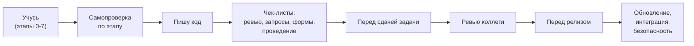

# Чек-листы

[← Предыдущий](10_Domain_and_Law.md) | [🗺 Оглавление](README.md) | [Следующий →](12_Glossary.md)

> Актуализировано: сентябрь 2026.

Файл собирает проверочные списки, которые нужны в работе: самопроверка по этапам плана, ревью кода, запросы, проведение документов, расширения, обновления, интеграции, безопасность, производительность, релиз. Списки короткие, каждый пункт проверяется за минуту и, где есть стандарт разработки 1С, привязан к его номеру.

Копируйте нужный раздел в описание merge request или тикета и отмечайте `- [x]`. Номера вида `#436` — это стандарты разработки на ИТС: `https://its.1c.ru/db/v8std/content/436/hdoc` (подставляйте номер; каталог — [its.1c.ru/db/v8std](https://its.1c.ru/db/v8std)). Официального требования «на экзамене нужны стандарты v8std» нет: они нужны для работы, а не для билета.

## Содержание

- [Как пользоваться](#-как-пользоваться)
- [Самопроверка по этапам 0–7](#-самопроверка-по-этапам-07)
- [Код-ревью BSL](#-код-ревью-bsl)
- [Запросы](#-запросы)
- [Клиент-сервер и формы](#-клиент-сервер-и-формы)
- [Проведение документа и блокировки](#-проведение-документа-и-блокировки)
- [Расширение конфигурации](#-расширение-конфигурации)
- [Обновление типовой и нетиповой конфигурации](#-обновление-типовой-и-нетиповой-конфигурации)
- [Интеграция](#-интеграция)
- [Безопасность](#-безопасность)
- [Производительность](#-производительность)
- [Работа с ИИ-ассистентом](#-работа-с-ии-ассистентом)
- [Перед сдачей задачи](#-перед-сдачей-задачи)
- [Перед релизом](#-перед-релизом)
- [Первые 90 дней у франчайзи](#-первые-90-дней-у-франчайзи)
- [Подготовка к экзамену](#-подготовка-к-экзамену)
- [Источники](#-источники)

---

## 🧭 Как пользоваться



- Чек-лист не заменяет знания: он ловит то, что забывается в спешке. Если пункт непонятен, откройте стандарт по номеру или профильный файл роадмапа.
- Пункт, который в вашем проекте не применим, вычеркните с пометкой «не применимо», не оставляйте пустым.
- Автоматические проверки (BSL Language Server, АПК, 1C:EDT с плагином «1C:Code style V8», тесты в CI) закрывают часть пунктов. Про настройку — `tracks/qa-automation.md` и `07_Projects.md` (проект P13).
- Сроки и объём этапов — в `02_Timeline.md`, список проектов — в `07_Projects.md`, вопросы для собеседования — в `08_Interview.md`.

---

## ✅ Самопроверка по этапам 0–7

Подробные критерии выхода и вопросы — в `02_Timeline.md`. Здесь короткая версия: если хотя бы один пункт «нет», вернитесь к теме, а не переходите дальше. Привязка проектов к этапам — по `07_Projects.md`.

| Этап | Проекты | Что должно быть готово |
|---|---|---|
| 0. Подготовка | — | Платформа, конфигурация в Git, синтакс-помощник |
| 1. Язык и платформа | P0 | Коллекции, запросы, клиент и сервер |
| 2. Учётные механизмы | P1, P2 | Документы, регистры, проведение (+1С:Профессионал) |
| 3. Отчёты и интерфейс | P3 | СКД, печатные формы, формы |
| 4. Типовые конфигурации | P7, P8, P9 | Внешние отчёты, расширение, загрузка данных |
| 5. Надёжность и интеграции | P4, P5, P6, P10, P11, P12 | HTTP, обмены, транзакции, блокировки |
| 6. Командная разработка и качество | P13, P17 | Git-процесс, статический анализ, тесты |
| 7. Специализация | P14, P15, P16 по треку | Углубление по одному из треков |

### Этап 0. Подготовка

- [ ] Учебная платформа установлена, файловая база открывается в режимах «Конфигуратор» и «1С:Предприятие».
- [ ] Я объясняю, чем конфигурация отличается от информационной базы и почему 8.5 — новая нумерация той же платформы, а не отдельный продукт.
- [ ] Конфигурация выгружена в файлы и лежит в Git с README.
- [ ] Я нахожу в синтакс-помощнике метод и его параметры, не гугля.
- [ ] Я могу составить проводки для поступления, оплаты и продажи.

### Этап 1. Язык и платформа

- [ ] Пишу процедуры и функции с параметрами и возвратом значения, различаю передачу по значению и по ссылке (`Знач`).
- [ ] Свободно работаю с `Структура`, `Соответствие`, `Массив`, `ТаблицаЗначений`, `ДеревоЗначений`.
- [ ] Знаю разницу `&НаКлиенте`, `&НаСервере`, `&НаСервереБезКонтекста`, `&НаКлиентеНаСервереБезКонтекста` и объясняю, что передаётся между клиентом и сервером.
- [ ] Пишу простой запрос с параметрами, соединением и группировкой и не соединяю строки в текст запроса.
- [ ] Отлаживаю код: точки останова, вычисление выражения, просмотр стека вызовов.
- [ ] Проект P0 сдан и разобран.

### Этап 2. Учётные механизмы

- [ ] Различаю справочник, документ, регистры сведений, накопления и бухгалтерии и объясняю, когда какой нужен.
- [ ] Пишу `ОбработкаПроведения` и проверяю, что при отмене проведения и перепроведении движения корректны.
- [ ] Понимаю, что такое итоги регистра накопления и почему остатки читают через виртуальную таблицу `Остатки`.
- [ ] Объясняю управляемые блокировки на примере контроля остатков.
- [ ] P1 и P2 сданы, при желании — сдан экзамен «1С:Профессионал» по платформе (условия — в разделе про экзамен ниже).

### Этап 3. Отчёты и интерфейс

- [ ] Строю отчёт на СКД: набор данных, ресурсы, группировки, параметры, отбор, условное оформление.
- [ ] Делаю печатную форму на макете и подключаю её через БСП (проект P3).
- [ ] Управляемую форму собираю так, чтобы серверные вызовы были осмысленными, а данные передавались минимальными порциями.
- [ ] Не использую модальные вызовы: `Асинх`/`Ждать` (с 8.3.18) или оповещения.

### Этап 4. Типовые конфигурации — вход в работу

- [ ] Я нахожу нужную типовую процедуру или форму в типовой конфигурации и понимаю, где безопасное место для расширения.
- [ ] Делаю расширение (P8): перехват `&Перед`/`&После`/`&Вместо`, свой префикс объектов и методов.
- [ ] Делаю внешнюю печатную форму или отчёт для типовой и подключаю через «Дополнительные отчеты и обработки» (P7).
- [ ] Загружаю данные из Excel и CSV с поиском дублей (P9).
- [ ] Ориентируюсь в настройках БСП и знаю, что поведение подсистем настраивается через общие модули `*Переопределяемый`.

### Этап 5. Надёжность и интеграции

- [ ] Пишу транзакцию по шаблону (#783) и объясняю, почему исключение не отменяет транзакцию сразу.
- [ ] Поднял HTTP-сервис (P10) и клиент внешнего API с регламентным заданием (P11) с таймаутами и логированием.
- [ ] Настроил обмен между двумя базами (P12), понимаю `ОбменДанными.Загрузка` и конфликты.
- [ ] Читаю журнал регистрации и умею воспроизвести ошибку блокировки.
- [ ] Прошёл проекты P4, P5, P6; при желании готов к «1С:Специалист по платформе».

### Этап 6. Командная разработка и качество

- [ ] Веду работу в ветках, оформляю коммиты и merge request с понятным описанием.
- [ ] Настроил BSL Language Server и/или проверки EDT, разбираю замечания и не глушу их без причины.
- [ ] Написал хотя бы несколько автоматических тестов (P13) и запускаю их в CI.
- [ ] Знаю, как перенести хранилище конфигурации в Git (1С:ГитКонвертер — официальный бесплатный инструмент, github.com/1C-Company/GitConverter).
- [ ] Могу проверить код ИИ-ассистента и объяснить его ошибки (P17).

### Этап 7. Специализация

- [ ] Выбран трек из `tracks/README.md`, у него есть план на 3 месяца.
- [ ] Сделан хотя бы один проект специализации: P14 (производительность), P15 (RLS и роли) или P16 (мобильное приложение, опционально).
- [ ] Есть один публичный результат: репозиторий, статья, доклад или пул-реквест в open source.

---

## 🔍 Код-ревью BSL

Список для автора кода перед отправкой на ревью и для ревьюера. Проверять на диффе, а не «по ощущениям».

**Запросы и данные**

- [ ] Нет запросов и обращений к данным ИБ в цикле, в том числе неявных (`ЗначениеРеквизитаОбъекта`, `Ссылка.Реквизит` для каждой строки) (#436, #729).
- [ ] Нет разыменования полей составного типа в запросах (#654).
- [ ] Параметры виртуальных таблиц заполнены, отбор не вынесен в `ГДЕ` поверх виртуальной таблицы (#657).
- [ ] Нет `ВЫБРАТЬ *` (#729) и лишних полей.
- [ ] Записи наборов регистров идут набором, а не по одной записи в цикле (#792).

**Клиент и сервер**

- [ ] Серверных вызовов минимум, данные передаются пачками (#487).
- [ ] У общих модулей нет лишнего признака «Вызов сервера» (#679).
- [ ] Нет модальных окон и синхронных вызовов (#703).
- [ ] Обработчики частых событий формы (например, `ПриАктивизацииСтроки`, `ОбновлениеОтображения`) не ходят в базу данных (#522).

**Транзакции и безопасность**

- [ ] Транзакции оформлены по шаблону: начало и конец в одном методе, парные `ЗафиксироватьТранзакцию` и `ОтменитьТранзакцию`, исключение пробрасывается (#783, #499).
- [ ] Блокировки управляемые, установлены до чтения данных, которые будут изменены (#460), остатки читаются с блокировкой (#661).
- [ ] Привилегированный режим включён только там, где нужен, и снят после (#485).
- [ ] `Выполнить`/`Вычислить` не применяются к внешним данным (#770); внешний код не запускается без безопасного режима (#669).
- [ ] Нет паролей, токенов и ключей в коде, макетах и реквизитах (#740).

**Оформление**

- [ ] Имена процедур и параметров по стандарту (#647, #640), тексты модулей оформлены (#456), запросы оформлены (#437).
- [ ] Экспортные методы обоснованы (#544), директивы компиляции и препроцессор не перегружены (#439).
- [ ] Нет закомментированного кода и отладочных `Сообщить`, тексты для пользователя — через `НСтр`.
- [ ] Комментарии описывают «зачем», а не «что».

**Проверки**

- [ ] BSL Language Server или АПК без критичных и блокирующих замечаний.
- [ ] Тесты проходят, новый код покрыт хотя бы одним сценарием.
- [ ] Ревью-комментарии закрыты ответом или правкой.

---

## 🧪 Запросы

- [ ] Значения передаются параметрами (`&Параметр`), а не конкатенацией: это защита от инъекций и условие кэширования плана.
- [ ] `ПОДОБНО`: спецсимволы `%`, `_`, `[`, `]`, `^` в пользовательском вводе экранированы (`ОбщегоНазначения.СформироватьСтрокуДляПоискаВЗапросе` + `СПЕЦСИМВОЛ`), параметр сам их не экранирует (#726).
- [ ] Отбор по виртуальной таблице (`Остатки`, `Обороты`, `СрезПоследних`) задан её параметрами, а не условием `ГДЕ` (#657).
- [ ] Условия в `ГДЕ` позволяют использовать индекс: нет функций над индексным полем, нет `ИЛИ` по разным полям без необходимости (#658, #652).
- [ ] Нет соединения с вложенными запросами и виртуальными таблицами там, где можно использовать временную таблицу (#655, #777).
- [ ] Нет вложенных запросов в условии, которые можно заменить соединением (#656).
- [ ] Упорядочивание задано, если порядок важен, и отсутствует, если нет (#412).
- [ ] Для «есть ли записи» используется `ВЫБРАТЬ ПЕРВЫЕ 1` или `Запрос.Выполнить().Пустой()` (#438), а не выборка всего набора.
- [ ] Количество записей считается запросом, а не выгрузкой в таблицу значений (#787).
- [ ] Псевдонимы источников осмысленные и не совпадают с именами полей (#758).
- [ ] `ОБЪЕДИНИТЬ` заменён на `ОБЪЕДИНИТЬ ВСЕ`, если дубликаты не нужны (#434).
- [ ] `РАЗРЕШЕННЫЕ` не используется в запросах для расчётов и проведения (#415).
- [ ] Динамический текст запроса собирается из констант, пользовательский ввод в него не попадает.

Эталонная форма запроса с параметрами и параметрами виртуальной таблицы:

```bsl
&НаСервере
Функция ОстаткиТоваровНаСкладе(Склад, Номенклатура)
	
	Запрос = Новый Запрос;
	Запрос.Текст =
	"ВЫБРАТЬ
	|	ТоварыНаСкладахОстатки.Номенклатура КАК Номенклатура,
	|	ТоварыНаСкладахОстатки.КоличествоОстаток КАК Количество
	|ИЗ
	|	РегистрНакопления.ТоварыНаСкладах.Остатки(
	|			,
	|			Склад = &Склад
	|				И Номенклатура В (&Номенклатура)) КАК ТоварыНаСкладахОстатки";
	Запрос.УстановитьПараметр("Склад", Склад);
	Запрос.УстановитьПараметр("Номенклатура", Номенклатура);
	
	Возврат Запрос.Выполнить().Выгрузить();
	
КонецФункции
```

Имена регистра и измерений здесь учебные (проект P2), у вас они свои.

---

## 🧱 Клиент-сервер и формы

**Разделение контекста**

- [ ] Каждый метод формы имеет директиву компиляции; методы, не использующие данные формы, помечены `&НаСервереБезКонтекста`.
- [ ] Через границу клиент-сервер передаются нужные значения, а не весь объект формы или большие таблицы.
- [ ] Один серверный вызов вместо нескольких подряд (#487).
- [ ] Проверка прав и данных выполняется на сервере: клиентская проверка защищает только от ошибок, но не от злоумышленника.
- [ ] Данные, которые пользователю не положены, не передаются на клиент даже скрытыми реквизитами.

**Поведение формы**

- [ ] Нет модальных методов `Вопрос`, `Предупреждение`, `ВвестиЗначение`, `ОткрытьЗначение`; используется `ПоказатьВопрос`, `ПоказатьПредупреждение` с `ОписаниеОповещения` или `Асинх`/`Ждать` (#703).
- [ ] Чтение и запись в базу в обработчиках частых событий минимальны (#522).
- [ ] Обработчики событий формы, подключаемые из кода, согласованы с директивами (#492).
- [ ] Форма объекта открывается корректно при создании, копировании и открытии по ссылке; `Параметры.Ключ` не подменяется.
- [ ] Условное оформление, заголовки и подсказки не дублируются кодом (#710, #721).
- [ ] Список открывается с отбором, а не читает всю таблицу; динамический список настроен на основную таблицу и нужные поля.
- [ ] Команды формы списка работают с выделенными строками, а не с одной текущей (#495).
- [ ] Вёрстка проверена в тонком и веб-клиенте; при работе с новым интерфейсом 8.5 проверены оба режима совместимости («Такси. Разрешить Версия 8.5» и «Версия 8.5. Разрешить Такси»), если они используются.

**Табличные части и печать**

- [ ] Табличная часть заполняется одним серверным вызовом, итоги считаются на клиенте только для отображения.
- [ ] Печатная форма собирается по БСП («Печать»), макет не содержит вычислений (#548, #789).
- [ ] Формирование печатной формы не пишет в базу.

---

## 📝 Проведение документа и блокировки

- [ ] Проверки заполнения находятся в `ОбработкаПроверкиЗаполнения`, а не в `ОбработкаПроведения`.
- [ ] Документ проводится: свойство `Проведение` = `Разрешить`, если он влияет на учёт (#603).
- [ ] Движения формируются в `ОбработкаПроведения` и не пишутся явным `Записать()`, кроме случая, когда данные регистра нужны дальше в этой же процедуре, например для контроля остатков (#450).
- [ ] Контроль остатков читает данные с блокировкой: перед проверкой установлена управляемая блокировка на регистр по нужным измерениям, режим блокировки данных в конфигурации управляемый (#460, #661).
- [ ] Не используется конструкция `ДЛЯ ИЗМЕНЕНИЯ` в запросе: в управляемом режиме она бесполезна (#460).
- [ ] Повторное проведение даёт тот же результат; перепроведение задним числом пересчитывает и последующие данные, если они зависят.
- [ ] Отмена проведения очищает все движения, включая регистры бухгалтерии и сведений.
- [ ] Порядок захвата блокировок одинаков во всех документах, чтобы не порождать взаимоблокировки.
- [ ] Блокировки короткие: тяжёлые расчёты и обращения к внешним системам вынесены за пределы транзакции.
- [ ] Отдельная проверка: проведение двух документов на один остаток параллельно (два сеанса) не даёт минуса.

Пример: блокировка по измерениям из табличной части и контроль остатков в проведении.

```bsl
Процедура ОбработкаПроведения(Отказ, РежимПроведения)
	
	// Блокировка ставится до чтения остатков и записи движений.
	Блокировка = Новый БлокировкаДанных;
	ЭлементБлокировки = Блокировка.Добавить("РегистрНакопления.ТоварыНаСкладах");
	ЭлементБлокировки.Режим = РежимБлокировкиДанных.Исключительный;
	ЭлементБлокировки.УстановитьЗначение("Склад", Склад);
	ЭлементБлокировки.ИсточникДанных = Товары;
	ЭлементБлокировки.ИспользоватьИзИсточникаДанных("Номенклатура", "Номенклатура");
	Блокировка.Заблокировать();
	
	Движения.ТоварыНаСкладах.Записывать = Истина;
	Для Каждого СтрокаТовара Из Товары Цикл
		Движение = Движения.ТоварыНаСкладах.ДобавитьРасход();
		Движение.Период = Дата;
		Движение.Склад = Склад;
		Движение.Номенклатура = СтрокаТовара.Номенклатура;
		Движение.Количество = СтрокаТовара.Количество;
	КонецЦикла;
	
	// Явная запись допустима здесь, потому что контроль остатков ниже читает регистр (#450).
	Движения.ТоварыНаСкладах.Записать();
	
	Запрос = Новый Запрос;
	Запрос.Текст =
	"ВЫБРАТЬ
	|	ТоварыНаСкладахОстатки.Номенклатура КАК Номенклатура,
	|	ТоварыНаСкладахОстатки.КоличествоОстаток КАК Остаток
	|ИЗ
	|	РегистрНакопления.ТоварыНаСкладах.Остатки(
	|			,
	|			Склад = &Склад
	|				И Номенклатура В (&Номенклатура)) КАК ТоварыНаСкладахОстатки
	|ГДЕ
	|	ТоварыНаСкладахОстатки.КоличествоОстаток < 0";
	Запрос.УстановитьПараметр("Склад", Склад);
	Запрос.УстановитьПараметр("Номенклатура", Товары.ВыгрузитьКолонку("Номенклатура"));
	
	Выборка = Запрос.Выполнить().Выбрать();
	Пока Выборка.Следующий() Цикл
		ОбщегоНазначения.СообщитьПользователю(
			СтрШаблон(НСтр("ru = 'Не хватает товара ""%1"" на складе'"), Выборка.Номенклатура),
			Ссылка,
			,
			,
			Отказ);
	КонецЦикла;
	
КонецПроцедуры
```

Пример учебный (проект P2): имена регистра и измерений условные, реальная схема блокировок зависит от вашей конфигурации. Перед применением сверьтесь с #450, #460 и #661.

---

## 🧩 Расширение конфигурации

- [ ] Доработка сделана расширением, а не правкой типового кода, если конфигурация на поддержке. 1С рекомендует «сначала расширение»; формулировку «правка типовых модулей запрещена» не используйте.
- [ ] У расширения есть префикс, у всех добавленных объектов, методов и переменных он есть (проверки EDT `extension-md-object-prefix`, `extension-method-prefix`, `extension-variable-prefix`).
- [ ] Поведение БСП настраивается через модули `*Переопределяемый` и обработчики `&После` к ним, а не копированием модулей БСП.
- [ ] Для перехвата без `ПродолжитьВызов` используется `&ИзменениеИКонтроль` с `#Вставка`/`#Удаление` (с 8.3.16), а не `&Вместо`.
- [ ] Расширение подключается в безопасном режиме, если содержит внешний код; «Небезопасное подключение расширения» проверено АПК (#669).
- [ ] Свои роли добавлены в расширение, чтобы оно работало и в конфигурациях без БСП (#488).
- [ ] Назначение расширения выбрано осознанно: «Исправление», «Адаптация» или «Дополнение».
- [ ] Расширение не ломается после перехода на новый релиз типовой: есть тест или ручной сценарий проверки.
- [ ] Есть документ: что расширяет, зачем, кто автор, как отключать.
- [ ] Не менять расширением поставляемые объекты БСП, которые нужно «переопределять» через `*Переопределяемый` (#553).

Подробнее о разработке расширений — проект P8 в `07_Projects.md`.

---

## 🔧 Обновление типовой и нетиповой конфигурации

**Общие пункты для любого обновления**

- [ ] Создана резервная копия базы (выгрузка `.dt` для небольших баз или копия на уровне СУБД), проверено, что восстановление работает.
- [ ] Определён текущий релиз конфигурации и целевой релиз, проверена совместимость с версией платформы: типовые большие конфигурации в 2026 году работают на 8.3.27, УНФ и «Розница» с 3.0.13 — и на 8.5; официального плана перевода остальных на 8.5 нет.
- [ ] Прочитан список изменений и, при необходимости, порядок обновления через промежуточные релизы.
- [ ] Обновление сначала выполнено на копии базы.
- [ ] Есть план отката и зафиксировано «окно» обслуживания, монопольный доступ к базе в нём предусмотрен.
- [ ] Пользователи знают о времени недоступности.

**Типовая без доработок**

- [ ] Установлен релиз через обновление конфигурации по шаблонам, запущена обработка обновления информационной базы.
- [ ] Официальные исправления от 1С поставляются расширениями с назначением «Исправление»; устаревшие исправления перед обновлением удалены или отключены (БСП делает это сама при обновлении).
- [ ] Проверены ключевые сценарии: проведение, ключевые отчёты, обмены, интеграции, печатные формы.

**Типовая с доработками**

- [ ] Сравнение и объединение выполнено на копии, конфликты разобраны, а не приняты «по умолчанию».
- [ ] Расширения проверены на совместимость с новым релизом, сломанные исправлены до боевого обновления.
- [ ] БСП обновлена до редакции, соответствующей платформе: 3.1.12 — для 8.3.24–8.3.27, 3.2.1 — только для 8.5.1.
- [ ] Обработчики обновления информационной базы своих подсистем проверены и идемпотентны (#690).
- [ ] Автоматические или ручные тесты ключевых сценариев пройдены после обновления.

**Нетиповая (собственная) конфигурация**

- [ ] Ветки и версии в Git соответствуют релизу, у релиза есть тег.
- [ ] Настройки в `Версия`, `Поставщик`, режим совместимости и минимальная версия платформы заданы осознанно (#482, #785).
- [ ] Обновление ИБ записывается обработчиками обновления и не «зашито» в ручные обработки.
- [ ] Если меняется алгоритм хеширования паролей или платформа откатывается ниже 8.3.26, учтена оговорка: при откате пользователи с новыми хешами не смогут войти по паролю, пока не вернуть SHA-1 и не переустановить пароли (рекомендуемый алгоритм для паролей — PBKDF2-HMAC-SHA256, доступен с 8.3.26).
- [ ] «Фоновое обновление конфигурации БД» доступно только в КОРП-лицензировании, финальная фаза всё равно требует монопольного доступа, это не обновление без простоя.

---

## 🌐 Интеграция

**HTTP-клиент и внешние API**

- [ ] У каждого `HTTPСоединение`, `WSПрокси`, `FTPСоединение` и почтового профиля задан таймаут (#748).
- [ ] Ошибки и коды ответов обрабатываются: 4xx и 5xx различаются, для временных ошибок предусмотрена повторная отправка с ограничением числа попыток.
- [ ] Обращения к внешним системам выполняются вне транзакций и вне блокирующей части проведения.
- [ ] Секреты (токены, пароли) хранятся в безопасном хранилище БСП, а не в константах и не в логе (#740).
- [ ] Логируется запрос и результат без секретов и без персональных данных, есть идентификатор корреляции.
- [ ] Формат обмена описан: OpenAPI, XDTO или схема; есть версия формата.
- [ ] Регламентное задание не зависит от того, что кто-то его запустил, и его можно запустить вручную (#539, #540).

**HTTP-сервис 1С как сервер**

- [ ] Идемпотентность: повторный запрос с тем же ключом не создаёт дубль документа или справочника.
- [ ] Аутентификация и права проверены: сервис работает под ограниченным пользователем, а не под администратором.
- [ ] Входные данные валидируются, ошибки возвращаются с понятным статусом и телом.
- [ ] Ответ не содержит лишних полей и данных, которые вызывающему не положены.
- [ ] Большие выборки возвращаются страницами.
- [ ] Есть контрактный тест или коллекция запросов в репозитории.

**Обмены данными (планы обмена, EnterpriseData)**

- [ ] При загрузке проверяется `ОбменДанными.Загрузка` в `ПередЗаписью` и `ПриЗаписи`: бизнес-логика, не относящаяся к загрузке, не срабатывает (#464, #465).
- [ ] Отбор плана обмена сделан по стандарту (#701), правила конвертации в выгрузке проверены на разных версиях приёмника.
- [ ] Исправления ошибок в правилах обмена поставляются расширениями-патчами (#799).
- [ ] Конфликты и коллизии описаны: кто «выигрывает» и что пишется в журнал.
- [ ] Обмен можно перезапустить с точки останова, а повторная загрузка того же сообщения безопасна.
- [ ] Для форматов интеграции прикладных решений используется EnterpriseData, если это уместно (#771).

Пример клиента с таймаутом, безопасным хранилищем и разбором кода ответа:

```bsl
&НаСервере
Функция СоздатьЗаказВовнешнейСистеме(Настройка, Тело, КлючИдемпотентности)
	
	УстановитьПривилегированныйРежим(Истина);
	Токен = ОбщегоНазначения.ПрочитатьДанныеИзБезопасногоХранилища(Настройка, "ТокенAPI");
	УстановитьПривилегированныйРежим(Ложь);
	
	// Последний параметр Таймаут (сек) обязателен по стандарту #748.
	Соединение = Новый HTTPСоединение(
		"api.example.com", , , , , 30, Новый ЗащищенноеСоединениеOpenSSL);
	
	Запрос = Новый HTTPЗапрос("/v1/orders");
	Запрос.Заголовки.Вставить("Authorization", "Bearer " + Токен);
	Запрос.Заголовки.Вставить("Idempotency-Key", КлючИдемпотентности);
	Запрос.Заголовки.Вставить("Content-Type", "application/json; charset=utf-8");
	Запрос.УстановитьТелоИзСтроки(Тело, КодировкаТекста.UTF8);
	
	Попытка
		Ответ = Соединение.ВызватьHTTPМетод("POST", Запрос);
	Исключение
		ЗаписьЖурналаРегистрации(НСтр("ru = 'Интеграция.Заказы'"),
			УровеньЖурналаРегистрации.Ошибка, , ,
			ОбработкаОшибок.ПодробноеПредставлениеОшибки(ИнформацияОбОшибке()));
		ВызватьИсключение;
	КонецПопытки;
	
	Если Ответ.КодСостояния <> 201 И Ответ.КодСостояния <> 200 Тогда
		ЗаписьЖурналаРегистрации(НСтр("ru = 'Интеграция.Заказы'"),
			УровеньЖурналаРегистрации.Ошибка, , ,
			СтрШаблон("Код %1", Ответ.КодСостояния));
		ВызватьИсключение НСтр("ru = 'Внешняя система отклонила запрос'");
	КонецЕсли;
	
	Возврат Ответ.ПолучитьТелоКакСтроку(КодировкаТекста.UTF8);
	
КонецФункции
```

Пример намеренно короткий: повторные попытки, разбор тела и запись результата вынесите в отдельные методы. Адрес `api.example.com` условный.

---

## 🔐 Безопасность

**Код и данные**

- [ ] Запросы параметризованы, пользовательский ввод не попадает в текст запроса, в `Выполнить`/`Вычислить` и в командную строку.
- [ ] Пароли, токены и ключи API не лежат в коде, макетах, константах, реквизитах форм и логах. Для секретов используется безопасное хранилище БСП: `ОбщегоНазначения.ЗаписатьДанныеВБезопасноеХранилище`, `ПрочитатьДанныеИзБезопасногоХранилища`, `УдалитьДанныеИзБезопасногоХранилища` в привилегированном режиме. Хранилище защищено правами, но данные там не зашифрованы.
- [ ] Права проверяются на сервере через `ПравоДоступа`, а не `РольДоступна`.
- [ ] Привилегированный режим отключает RLS: полученные в нём данные на клиент не отдаются.
- [ ] Внешние отчёты, обработки и расширения подключаются в безопасном режиме через БСП «Дополнительные отчеты и обработки»; открытие через «Файл → Открыть» ограничено.
- [ ] Файловая система из кода конфигурации используется только там, где это необходимо (#542), внешние ресурсы — через средства платформы (#794).
- [ ] Права доступа к данным, зависящие от организации, склада или подразделения, реализованы через RLS БСП («Управление доступом»); `РАЗРЕШЕННЫЕ` не используется для расчётов и проведения (#415).

**Аутентификация и администрирование (проверьте для боевой базы)**

- [ ] Политика паролей включена (с 8.3.17), блокировка после неудачных попыток (с 8.3.16), при необходимости второй фактор (с 8.3.14).
- [ ] Для паролей выбран PBKDF2-HMAC-SHA256 (с 8.3.26); SHA-256 и SHA-512 — быстрые хеши, для паролей не рекомендуются; MD5 в платформе нет.
- [ ] Настроено «Время завершения сеанса при бездействии» (с 8.3.26).
- [ ] После установки сервера создан администратор кластера: по умолчанию администратор не задан.
- [ ] Клиент ↔ веб-сервер — только HTTPS; клиент ↔ кластер: шифрование по собственному протоколу платформы по умолчанию выключено, включается уровнем безопасности; канал к СУБД — SSL средствами СУБД.
- [ ] Профили безопасности кластера настроены для внешних ресурсов (в КОРП), ограничения на COM, файлы и интернет-ресурсы заданы.
- [ ] Журнал регистрации сохраняется вне базы, для персональных данных включены события доступа.
- [ ] Копии баз для разработки и тестирования обезличены (152-ФЗ, 98-ФЗ) — подробнее в `10_Domain_and_Law.md`.
- [ ] Уязвимость платформы, если нашли, сообщается на bugboard.v8.1c.ru.

Пример работы с секретом:

```bsl
&НаСервере
Процедура СохранитьТокен(Настройка, Токен)
	
	УстановитьПривилегированныйРежим(Истина);
	ОбщегоНазначения.ЗаписатьДанныеВБезопасноеХранилище(Настройка, Токен, "ТокенAPI");
	УстановитьПривилегированныйРежим(Ложь);
	
КонецПроцедуры
```

---

## ⚡ Производительность

**До оптимизации**

- [ ] Проблема измерена: есть операция, время «до» и целевое время. Оптимизация «по ощущениям» запрещена.
- [ ] Определено, где тратится время: клиент, сервер 1С, СУБД, блокировки, внешний сервис.
- [ ] Включён технологический журнал по узкому сценарию, а не «на всё» (объём логов растёт быстро).
- [ ] Для оценки используется APDEX и подсистема БСП «Оценка производительности».

**Что проверять в коде**

- [ ] Нет запросов в цикле, лишних серверных вызовов и обращений к реквизитам ссылок в цикле.
- [ ] Временные таблицы применены там, где они улучшают план, а не «по привычке» (#777).
- [ ] Индексы: дополнительные индексы только по обоснованию, есть пример запроса, который они ускоряют (#791).
- [ ] Записи регистров идут порциями примерно по 1000, без лишнего перезаписывания (#792).
- [ ] Итоги регистров и режим разделения итогов подобраны под сценарий.
- [ ] Блокировки минимальны: избыточные блокировки не порождаются структурой данных (#659).
- [ ] Отчёты на СКД получают отбор и параметры в запросе набора данных, а не фильтруют выгруженное в постобработке.

**Инфраструктура (для трека «Производительность» и администраторов)**

- [ ] СУБД: PostgreSQL используется только в сборках для 1С (от 1С, Postgres Pro, ALT и др.), ванильный PostgreSQL не подходит.
- [ ] Параметры СУБД и ОС, версия платформы и лицензии соответствуют рекомендациям ИТС.
- [ ] Ориентир для расследования: `pg_stat_statements`, `pg_locks`, ТЖ, метрики кластера через `rac`.
- [ ] Для MS SQL Server учтено: SQL Server 2016 снят с поддержки Microsoft 14.07.2026.
- [ ] Изменения применяются на тестовом стенде, результат замеряется тем же сценарием.

Подробнее — `tracks/performance-expert.md` и проект P14 (`07_Projects.md`).

---

## 🤖 Работа с ИИ-ассистентом

- [ ] В запросы к внешним ИИ-сервисам не попадают персональные данные, данные заказчика и коммерческая тайна (152-ФЗ, 98-ФЗ, NDA); передача зарубежному провайдеру — трансграничная.
- [ ] Правила работодателя и заказчика по ИИ прочитаны; для госзаказчиков учтены ограничения (Приказ ФСТЭК № 117 действует с 01.03.2026 — детали в `10_Domain_and_Law.md`).
- [ ] ИИ-агент работает с обезличенной копией и с техническим пользователем без права записи; запрет задан правами 1С, а не настройками агента.
- [ ] Код от ИИ прошёл BSL Language Server, тесты и обычное ревью.
- [ ] Имена методов и объектов из ответа ИИ проверены по синтакс-помощнику: ИИ придумывает несуществующие методы.
- [ ] Стандарты v8std соблюдены (контекст, запросы, транзакции); «работает» не значит «правильно».
- [ ] В PR отмечено, какие фрагменты сгенерированы.

Подробнее — `09_AI_Development.md`.

---

## 📦 Перед сдачей задачи

- [ ] Постановка перечитана, критерии приёмки выполнены, спорное согласовано письменно.
- [ ] Изменения минимальны: нет посторонних правок, форматирования «мимоходом» и мусорных файлов.
- [ ] Пройден раздел «Код-ревью BSL» выше; для затронутых областей — разделы про запросы, формы, проведение, интеграцию.
- [ ] Проверено на копии базы с реалистичными данными, а не только на пустой.
- [ ] Проверены граничные случаи: пустые значения, большие объёмы, повторный запуск, параллельная работа двух пользователей.
- [ ] Проверено под пользователем с ограниченными правами, а не только под администратором.
- [ ] Проверены сценарии записи, проведения, отмены проведения и удаления.
- [ ] Тесты (ручные или автоматические) описаны и приложены.
- [ ] Описание для ревьюера: что и зачем изменено, как проверить, что может сломаться.
- [ ] Документация или инструкция пользователя обновлены, если поведение изменилось.
- [ ] Время работы записано и совпадает с оценкой, расхождение объяснено.

---

## 🚀 Перед релизом

- [ ] Версия и тег релиза в Git присвоены, изменения задокументированы (что нового, что исправлено, что делать пользователям).
- [ ] Сборка выполнена из репозитория, а не с чьей-то рабочей базы.
- [ ] Автоматические проверки (статический анализ, тесты) прошли на итоговой сборке.
- [ ] Минимальная версия платформы и режим совместимости определены и проверены на реальной версии платформы: 8.3.27 или 8.5.1.
- [ ] Обновление проверено на копии базы заказчика (или ближайшей к ней): обработчики обновления ИБ отработали, нет потери данных.
- [ ] Резервная копия перед релизом сделана и проверена; план отката записан и понятен исполнителю.
- [ ] Предусмотрен монопольный доступ на время обновления и уведомление пользователей.
- [ ] Роли, профили групп доступа и права на новые объекты выданы.
- [ ] Расширения, внешние обработки и отчёты проверены на совместимость с релизом.
- [ ] Регламентные задания включены или выключены осознанно (на копиях для тестов — выключены).
- [ ] Обмены и интеграции проверены на новой версии, форматы совместимы с приёмниками.
- [ ] После выкладки выполнен «дымовой» тест: вход, ключевой документ, ключевой отчёт, обмен.
- [ ] Назначен ответственный, который следит за журналом регистрации и ошибками первые дни.
- [ ] Обратная связь: канал, куда пользователи сообщают о проблемах.

---

## 🎓 Первые 90 дней у франчайзи

Порядок и сроки — рекомендация авторов роадмапа; набор задач соответствует уровню Junior в официальной модели компетенций разработчика. Треки: `tracks/developer-franchise.md`, ожидания по карьере — `13_Career.md`.

**Дни 1–30. Ориентация**

- [ ] Прочитаны регламенты компании: как ставятся задачи, как ведётся учёт времени, как оформляются коммиты и ревью.
- [ ] Знаю роли в проекте (менеджер, аналитик, разработчик, тестировщик) и к кому идти с вопросом.
- [ ] Получен доступ к ИТС и понятны правила хранения паролей и лицензий.
- [ ] Понимаю режимы лицензирования и работу с клиентскими и серверными лицензиями.
- [ ] Работал с типовыми БП, УТ и ЗУП на уровне пользователя: ввёл документ, посмотрел отчёт, настроил права.
- [ ] Знаю сервисы ИТС и умею искать в них ответы.
- [ ] Первые задачи: правка печатной формы, внешний отчёт на СКД, обновление типовой без доработок.

**Дни 31–60. Уверенность**

- [ ] Выполнил обновление доработанной конфигурации со сравнением и объединением на копии.
- [ ] Подключил внешние обработки через «Дополнительные отчеты и обработки».
- [ ] Сделал расширение для типовой конфигурации.
- [ ] Загрузил данные из Excel, поиск дублей описан.
- [ ] Настроил или проверил синхронизацию (например, БП ↔ ЗУП, УТ ↔ БП).

**Дни 61–90. Самостоятельность**

- [ ] Подключил оборудование через БПО (библиотека подключаемого оборудования).
- [ ] Разобрался с маркировкой по инструкции (детали — `10_Domain_and_Law.md`).
- [ ] Настроил права в типовой через профили групп доступа.
- [ ] Сдан «1С:Профессионал» по платформе, если ещё не сдан.
- [ ] Дал оценку небольшой задачи, сверил с фактом. Формально это уровень Middle, но начать полезно раньше.
- [ ] Провёл разбор с наставником: что получается, что нет, план на следующие три месяца.

---

## 🎓 Подготовка к экзамену

Формат и условия экзаменов меняются, всегда сверяйтесь с официальной страницей [1c.ru/prof](https://1c.ru/prof/prof.htm). Подробности — в `04_Certifications.md`.

**1С:Профессионал (по платформе)**

- [ ] Формат сверен на официальной странице. По вторичным источникам: 14 вопросов, 30 минут, для сдачи нужно не менее 12 верных ответов.
- [ ] Пройдены темы: язык и встроенный язык, запросы, управляемые формы, СКД, права доступа, клиент-серверное взаимодействие, регистры и проведение, транзакции и блокировки.
- [ ] Решены пробные тесты (например, мобильный тренажёр 1С:НИК УЦ №1 — платный, вход по учётной записи УЦ) и разобраны ошибки, а не только запомнены ответы.
- [ ] Для каждого пробного вопроса могу объяснить, почему остальные варианты неверны.
- [ ] Прочитана справка по всем объектам платформы из проектов P0–P6.

**1С:Специалист по платформе**

- [ ] Понимаю формат: практическая задача на выдаваемой каркасной конфигурации, около 4–5 часов; темы — оперативный учёт, бухгалтерский учёт, сложные периодические расчёты, бизнес-процессы, разработка формы. Сдача в EDT и дистанционно не подтверждена.
- [ ] Прорешаны задачи из проектов P2–P6 на время, без подсказок.
- [ ] Умею быстро создать объекты метаданных, документ с проведением, регистр расчёта или бухгалтерии, бизнес-процесс и форму.
- [ ] Отработана работа с синтакс-помощником и встроенной справкой.
- [ ] Спланирована сдача: время, платформа, повторная попытка при необходимости.

**Перед днём экзамена**

- [ ] Проверены документы, время и способ проведения экзамена.
- [ ] Ночь перед экзаменом — сон, а не «доучивание».
- [ ] После сдачи выписан список пробелов и обновлён план обучения.

---

## 🔗 Источники

- Стандарты разработки 1С: [its.1c.ru/db/v8std](https://its.1c.ru/db/v8std); шаблон адреса стандарта — `https://its.1c.ru/db/v8std/content/NNN/hdoc`.
- BSL Language Server: [github.com/1c-syntax/bsl-language-server](https://github.com/1c-syntax/bsl-language-server).
- Официальные проверки стиля для EDT («1C:Code style V8»): [github.com/1C-Company/v8-code-style](https://github.com/1C-Company/v8-code-style).
- 1С:ГитКонвертер: [github.com/1C-Company/GitConverter](https://github.com/1C-Company/GitConverter).
- Vanessa Automation: [github.com/Pr-Mex/vanessa-automation](https://github.com/Pr-Mex/vanessa-automation).
- Сертификация 1С:Профессионал: [1c.ru/prof](https://1c.ru/prof/prof.htm).
- Уязвимости платформы: [bugboard.v8.1c.ru](https://bugboard.v8.1c.ru/).
- Внутренние материалы роадмапа: `02_Timeline.md`, `04_Certifications.md`, `07_Projects.md`, `08_Interview.md`, `09_AI_Development.md`, `10_Domain_and_Law.md`.

[← Предыдущий](10_Domain_and_Law.md) | [🗺 Оглавление](README.md) | [Следующий →](12_Glossary.md)
