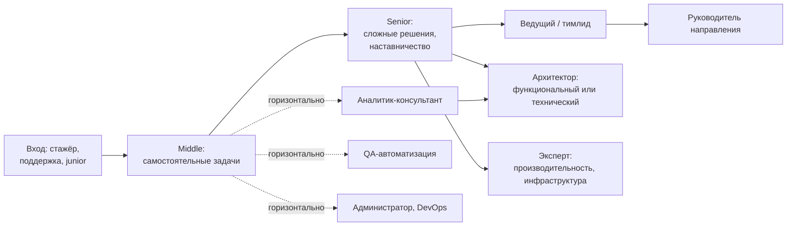

# Первая работа и карьера в 1С

[← Глоссарий](12_Glossary.md) | [🗺 Оглавление](README.md) | [Следующий →](README.md)

> Актуализировано: сентябрь 2026.

Этот файл отвечает на вопросы «куда идти после этапа 4», «сколько это стоит на рынке» и «как не потеряться в первые 90 дней». Здесь же собраны **все зарплатные ориентиры** репозитория: остальные файлы отправляют сюда, чтобы цифры жили в одном месте и обновлялись одним коммитом.

## Содержание

- [Что нужно знать о рынке 2026 года](#-что-нужно-знать-о-рынке-2026-года)
- [Входные позиции](#-входные-позиции)
- [Контексты работы](#-контексты-работы)
- [Спрос по конфигурациям](#-спрос-по-конфигурациям)
- [Зарплаты, сентябрь 2026](#-зарплаты-сентябрь-2026)
- [Резюме и портфолио](#-резюме-и-портфолио)
- [Паспорт квалификации 1С](#-паспорт-квалификации-1с)
- [Где искать работу](#-где-искать-работу)
- [Отклик, тестовое, собеседование](#-отклик-тестовое-собеседование)
- [Онбординг: первые 90 дней](#-онбординг-первые-90-дней)
- [Развитие: вертикально и горизонтально](#-развитие-вертикально-и-горизонтально)
- [Переход из других профессий](#-переход-из-других-профессий)
- [Типичные ошибки соискателя](#-типичные-ошибки-соискателя)
- [Источники](#-источники)

## 📈 Что нужно знать о рынке 2026 года

Коротко и без иллюзий:

- **Это рынок работодателя.** По вторичным данным (пересказы без первоисточника), hh-индекс в ИТ в III квартале 2025 года был 16,1 (годом ранее 8,2), а в марте 2026 года вакансий в ИТ было заметно меньше, чем год назад. Отдельной цифры «резюме на вакансию по 1С» найти не удалось.
- **Вход без опыта узкий.** В выгрузке hh.ru за 10.08–07.09.2026 вакансий «без опыта» среди вакансий 1С 5–7% (23 из 452 после удаления дублей). Больше половины вакансий (53%) просят 3–6 лет опыта, 30% — 1–3 года, 13% — более 6 лет.
- **Но спрос на 1С есть.** Крупные работодатели (Ростелеком, Ozon, ИК СИБИНТЕК, Россети Цифра и другие) стабильно ищут людей на 1С, а проекты миграции (с SAP, с УПП на ERP) видны прямо в текстах вакансий.
- **Половина вакансий допускает удалёнку** (~50%). Это расширяет выбор, но и конкуренция за такие вакансии выше.
- **Реалистичный срок до первой работы** — оценка авторов, не статистика: примерно 6–9 месяцев учёбы при 15–20 часах в неделю до этапа 4 (см. `02_Timeline.md`), плюс от нескольких недель до нескольких месяцев поиска. Готовьтесь к десяткам откликов, а не к трём.

> ⚠️ Все числа ниже — ориентиры по объявлениям третьих лиц, а не официальная статистика Росстата или hh.ru. Методика и ограничения описаны в разделе про зарплаты. Перед переговорами сверяйтесь с калькулятором Хабр Карьеры и живыми вакансиями своего города.

## 🎯 Входные позиции

Прямой вход «программистом на типовые» без опыта случается редко. Чаще первая работа выглядит как одна из позиций ниже. Названия — из реальных объявлений 2025–2026 годов.

| Позиция | Что делают | Зарплата (порядок, на руки) | Куда ведёт |
|---|---|---|---|
| Стажёр-разработчик / «1С разработчик (ученик)» | Мелкие доработки, отчёты, печатные формы под присмотром | 30–60 тыс. ₽ (точки: 50 тыс. Омск, 30–60 тыс. в объявлении стажёра) | Разработчик у франчайзи или в инхаусе |
| Первая линия поддержки, «помощник программиста 1С» | Консультации пользователей, типовые ошибки, мелкие настройки | 30–80 тыс. ₽ до вычета (одно объявление) | Консультант, разработчик, администратор |
| Консультант технической поддержки 1С | Разбор обращений, воспроизведение ошибок, передача разработчикам | ориентир — как выше, по региону | Разработчик, аналитик |
| «Аналитик 1С (стажёр/ученик)» | Обследование, описание процессов, ТЗ, тестирование | 45–60 тыс. ₽ до вычета (по объявлениям) | Аналитик-консультант |
| «Консультант-разработчик 1С» без опыта | Гибрид: и настройка, и код | по объявлению работодателя | Разработчик или консультант |
| Системный администратор 1С (стажёр) | Установка, обновление, резервные копии, серверы 1С | 80–120 тыс. ₽ на руки (одно объявление, Красноярск) | Администратор, DevOps |
| Тестировщик 1С (junior) | Ручное тестирование конфигураций, затем автотесты | по объявлению работодателя | QA-автоматизация |

Три наблюдения:

1. **Большинство «без опыта» — аналитик-стажёр.** В исчерпывающем обходе hh.ru (04.07–11.08.2026, удалёнка, 0–3 года) из 14 вакансий 1С без опыта 8 принадлежали одному работодателю и были «Аналитик 1С (стажёр/ученик)». Не отсекайте аналитику: это нормальный вход в профессию, а код можно догнать позже.
2. **Поддержка — не тупик.** Первая линия даёт то, что не дают курсы: реальные ошибки пользователей, знание типовых и привычку разговаривать с бизнесом. Год на поддержке может сократить путь к роли разработчика (оценка авторов, не статистика).
3. **Гибридные роли на рынке есть** («программист-консультант»). Не нужно выбирать «чистое программирование» раньше, чем поймёте, что вам ближе. Подробнее о ролях — `03_Competencies.md` и `tracks/README.md`.

Что должен уметь кандидат на входную позицию (по уровню Junior официальной модели компетенций MC-6-001, без привязки к срокам, см. `03_Competencies.md`):

- обновить типовую конфигурацию без доработок, сделать резервную копию перед этим;
- написать внешнюю печатную форму, внешний отчёт на СКД, обработку и подключить их через «Дополнительные отчеты и обработки»;
- загрузить данные из Excel/CSV;
- объяснить разницу между файловым и клиент-серверным режимами, локальной и облачной работой;
- знать, что такое ИТС и хотя бы в общих чертах — сервисы («1С-Отчетность», «1С-ЭДО»);
- соблюдать правила ИБ при работе с паролями и персональными данными (152-ФЗ, 98-ФЗ; подробнее в `10_Domain_and_Law.md`).

## 🧩 Контексты работы

Ландшафт сообщества (Landscape1C) выделяет четыре контекста: **франчайзи, инхаус, продукты, проекты**. Не бывает «лучшего» контекста вообще, бывает подходящий на вашем этапе.

| Контекст | Плюсы | Минусы | Кому подходит |
|---|---|---|---|
| Франчайзи (партнёр 1С) | Много разных клиентов и типовых за короткое время, наставники и ИТС «под рукой», сертификация часто поощряется, быстрый рост широты | Спешка и биллинг по часам, «пожарные» задачи, разные клиенты — разное качество баз, часто мало современного инструментария (EDT, CI) | Новичкам: быстрее всего набирается опыт по типовым |
| Инхаус (штатная ИТ-служба компании) | Одна-две базы, глубокое знание предметной области, стабильность, реальные процессы вокруг ИТ, крупные инхаусы дают современный стек и сложные интеграции | Узкий кругозор, меньше разнообразия, бюрократия, бывает «вечная поддержка одной доработанной УПП» | Тем, кому важна предметная глубина и предсказуемость |
| Продукты (тиражные решения на 1С, «отраслевые»/«коробочные») | Код как продукт: EDT, git, тесты, ревью, архитектура, обновления для многих клиентов; строгие стандарты | Вход выше по порогу, конкурс, меньше общения с бизнесом | Тем, кто хочет инженерной культуры |
| Проекты (интегратор, внедрение ERP, консалтинг) | Сложные внедрения, много ролей, рост в аналитику и управление проектами, ERP-экспертиза | Командировки/переработки в пиках, зависимость от проекта, дедлайны заказчика | Тем, кто идёт в ERP и консалтинг |

Заметки о применимости:

- В карточках Landscape1C у франчайзи не отмечено ни одного «продвинутого» инструмента (EDT, GitLab, Jenkins, Vanessa Automation, YAxUnit). Это не значит, что их там нет, но для стартового собеседования знание Конфигуратора, СКД, обновления и обмена важнее, чем CI. Продвинутое пригодится дальше — этапы 5–7, `tracks/developer-product.md`, `tracks/qa-automation.md`.
- Крупные инхаус-работодатели и интеграторы в выгрузке августа–сентября 2026: Ростелеком (36 вакансий 1С), Ozon (14, включая Ozon Банк), ИК СИБИНТЕК (8), «Рт - Вт» (7), Россети Цифра (4). Данные — на дату выгрузки и только по вакансиям с «1С» в названии.
- Сама фирма «1С» публикует вакансии редко (5 в той выгрузке), и это часто не «программист на типовые», а платформенные или облачные роли.
- Контексты можно менять. Типичный маршрут: франчайзи 1–3 года (широта) → инхаус или продукт (глубина) → архитектура или лидерство. Обратный тоже встречается.

## 📊 Спрос по конфигурациям

Методика: единица счёта — вакансия; вакансия относится к 1С, если «1С» есть в названии; конфигурация ищется в названии и навыках; Битрикс исключён. Сравнивайте **ранги**, а не проценты: сниппеты hh.ru обрезаны, и доли — нижняя граница.

Выгрузка hh.ru 10.08–07.09.2026, 452 вакансии 1С без дублей:

| Конфигурация | Вакансий | Доля | Комментарий |
|---|---|---|---|
| 1С:ERP | 127 | 28% | № 1 во всех выборках, но перевес создают аналитики и руководители проектов |
| 1С:УХ (Управление холдингом) | 57 | 13% | ERP.УХ и УХ, миграции с УПП |
| 1С:ЗУП | 51 | 11% | Кадры и зарплата |
| 1С:УТ | 44 | 10% | Торговля |
| 1С:ДО (Документооборот) | 36 | 8% | |
| 1С:БП (Бухгалтерия) | 34 | 8% | |
| 1С:КА | 18 | 4% | |
| 1С:УНФ | 13 | 3% | |
| 1С:УПП | 9 | 2% | Сопровождение и миграции |
| БГУ / ЗКГУ | 7 | 2% | Бюджетный сектор |

Что из этого следует:

- **Для разработчиков картина ровнее.** Среди вакансий разработчиков (n=99 с дублями) УТ 19, ERP 18, ЗУП 17, БП 14, ДО 13, УХ 10. Конфигурацию под первую работу выбирайте по региону и вакансиям, а не по рейтингу ERP.
- **Самые частые требования в текстах вакансий** (по сниппетам, нижняя граница): бухгалтерский и налоговый учёт 27%, BPMN/ТЗ 16%, обмены и интеграции 11%, тестирование и автотесты 9%, сертификат 1С 6%, SQL и запросы 5%. Git, CI/CD, EDT и ИИ упоминаются примерно в 1% сниппетов, но из-за обрезки это нижняя оценка.
- **Предметная область весит больше, чем кажется.** Учёт и ТЗ встречаются чаще, чем любые технологии. См. `10_Domain_and_Law.md`.
- **Сертификат 1С требуют в ~6% сниппетов.** Он не открывает дверь сам, но снимает вопрос «умеет ли кандидат вообще» и особенно ценен, когда опыта нет (`04_Certifications.md`).
- **УПП 1.3 — устаревшая конфигурация на обычных формах.** Новые внедрения идут на ERP и КА, а для перехода есть штатный помощник переноса данных в типовых. Работа с УПП на рынке — сопровождение и миграции (~2% вакансий 1С в августе–сентябре 2026). Сроки «снятия с поддержки» без официального письма 1С не приводим.
- **Импортозамещение видно в вакансиях:** проекты «перехода с SAP на 1С», миграции УПП → ERP.УХ. По вторичным данным (fact-check pack), Росатом переводит на 1С:ERP более 230 предприятий к 2027 году, но первоисточник в сессии проверить не удалось, поэтому цифры не приводим в таблицах.
- **1С:Элемент и мобильная платформа** пока дают единичные вакансии (в выгрузке — одна позиция «Разработчик Java в проект на 1C:Element», одна вакансия программиста с требованием опыта мобильной разработки на 1С и одна вакансия тестировщика с мобильным приложением). Зарплатных данных нет. Это задел на будущее (`tracks/element-and-mobile.md`), а не способ найти первую работу.

## 💼 Зарплаты, сентябрь 2026

### Методика и оговорки

- **Источник:** выгрузка API hh.ru за 10.08–07.09.2026, собранная третьими лицами и опубликованная на GitHub (github.com/kr1p043k/compare_competencies). 452 вакансии «1С» после удаления дублей, зарплата указана у 154 (34%).
- **«На руки»:** суммы пересчитаны из «до вычета НДФЛ» умножением на 0,87. Пересчёт приблизительный.
- **Смещение выборки:** выгрузка ограничена по регионам и профролям, поэтому распределение по ролям перекошено (аналитики представлены сильнее, чем в реальности). Работодатели с указанной вилкой — не весь рынок; сильные специалисты часто находят работу без открытых вакансий.
- **Это зарплаты в объявлениях, а не в договорах.** Итоговое предложение может отличаться от вилки в любую сторону.
- **Подавайте цифры как ориентир, а не как статистику.** Отдельных отчётов Хабр Карьеры и hh.ru именно по 1С за 2026 год в источниках нет. Актуальный калькулятор: career.habr.com/salaries (навык «1С»).

### Медианы по опыту (все роли 1С, тыс. ₽ на руки в месяц)

| Опыт (как в hh.ru) | Вакансий с зарплатой | Медиана | P25–P75 |
|---|---|---|---|
| Без опыта | 19 | ~44 | 35–52 |
| 1–3 года | 67 | ~113 | 87–150 |
| 3–6 лет | 57 | ~220 | 187–244 |
| Более 6 лет | 11 | ~300 | 240–330 |
| Все опыты | 154 | ~146 | 87–220 |

Для «более 6 лет» n=11: цифра шаткая, не стройте на ней решение.

### Регионы и формат

| Срез | 1–3 года | 3–6 лет |
|---|---|---|
| Москва | ~154 (n=20) | ~230 (n=29) |
| Регионы | ~105 (n=42) | ~181 (n=24) |
| Удалёнка разрешена | ~125 (n=21) | ~218 (n=35) |
| Без удалёнки | ~105 (n=46) | ~225 (n=22) |

СПб в выгрузке представлен слабо (n=4–5 по группам), поэтому цифры не приводим как основу. Отдельный срез удалёнки за 04.07–11.08.2026 (только вакансии с зарплатой, 0–3 года): без опыта ~52 тыс. (n=14), 1–3 года ~122 тыс. (n=46), **разработчики на удалёнке с 1–3 годами ~160 тыс.** (n=19, вилка 100–200). Данные региональных вакансий «Работы России» (май 2026, без указания gross/net) — разработчики в регионах около 89 тыс., в Москве около 180 тыс.; выборка смещена к госсектору и даёт «нижнюю границу рынка».

### По ролям

| Роль | Ориентир, тыс. ₽ на руки | Комментарий |
|---|---|---|
| Разработчик, 1–3 года | ~145 (P25–P75 105–185, n=12) | Малая выборка |
| Разработчик, 3–6 лет | ~210 (160–240, n=10) | Малая выборка |
| Аналитик / консультант, 1–3 года | ~109 (87–144, n=46) | У консультантов по учёту в регионах вилки заметно ниже |
| Аналитик / консультант, 3–6 лет | ~222 (187–235, n=28) | ERP-аналитики выше |
| Ведущий аналитик, функциональный архитектор | 250–350+ | По точкам объявлений |
| Архитектор (функциональный и технический) | ~250 (218–304, n=9) | Много вакансий без вилки |
| Руководитель, тимлид, техлид, РП | ~219 (196–275, n=14) | Верх вилок значительно выше |
| Администратор / DevOps 1С | ~100 (100–200, n=7) | Разброс от стажёра до «до 350» |
| Эксперт по производительности | 250–350+ по единичным объявлениям | Вилку «300–500+» данными не подтвердить |

Вывод по ролям осторожный: медиана руководителей и лидов (~219) близка к разработчикам с 3–6 годами (~210), заметнее выше архитекторы (~250) и верхние вилки объявлений, но выборки малые (n=7–14). Рост в архитектуру и лидерство даёт не только деньги, но и ответственность, коммуникации и работу с заказчиком.

### Что ещё стоит знать

- **Скачок 1–3 → 3–6 лет — в два раза.** Это главная цифра для планирования: первые 2–3 года вы «зарабатываете опыт», а не деньги. Не бросайте первую работу через 3 месяца.
- **Москва против регионов:** по 1–3 годам разрыв заметный (~154 против ~105, примерно +47%), по 3–6 лет он меньше в относительном выражении (~230 против ~181, примерно +27%). Удалёнка сглаживает разницу, но конкуренция за неё выше.
- **Деньги — не только оклад.** Для оценки предложения сравнивайте: премию, оплату сертификации и курсов, ДМС, формат работы, наличие наставника, набор проектов (типовые конфигурации или разнородные самописные базы).
- **Инфляция и рост ИТ-зарплат.** По вторичным данным (Хабр Карьера, 1-е полугодие 2026), рост ИТ-зарплат за полугодие около 4%, ниже инфляции; медиана по всему ИТ — Москва 235 тыс., СПб 200 тыс., регионы 160 тыс. ₽, «джуниор по всему ИТ» — около 95 тыс. ₽. Отдельной строки «1С» там нет: не сравнивайте её напрямую с 1С-медианами выше.
- **Нет данных** по зарплатам на 1С:Элемент и мобильной разработке. Не приписывайте им «премию».

### Как самому проверить рынок за 10 минут

- hh.ru: поиск по названию «1С», фильтры «опыт», «формат работы», «регион», «указан доход». Запишите дату сверки.
- Через API hh.ru число вакансий можно получить запросом `https://api.hh.ru/vacancies?text=1С&search_field=name&area=113&per_page=0` (поле `found`); параметры `only_with_salary=true`, `schedule=remote` и `experience` встречаются в открытых сборщиках на GitHub, но в подготовке этого файла не проверялись.
- Хабр Карьера: калькулятор career.habr.com/salaries, навык «1С», фильтры по квалификации и городу.
- Читайте вилку внимательно: «на руки» или «до вычета» (×0,87 — приблизительно, с 2025 года НДФЛ прогрессивный), «от» без верхней границы, премии отдельно.

## 📝 Резюме и портфолио

### Резюме

Резюме 1С-специалиста читают за 30–60 секунд. Рекрутёр ищет **конфигурации, которые вы знаете**, и **что вы делали руками**.

Структура на одну страницу:

1. **Шапка:** имя, город, формат работы (офис, гибрид, удалёнка), контакты, ссылка на GitHub, ссылка на «Паспорт квалификации 1С» (если есть).
2. **Роль и цель в одной строке:** «Разработчик 1С, вход: БП/УТ/ЗУП, доработки, печатные формы, СКД».
3. **Стек и конфигурации:** платформа (8.3.x), конфигурации, СКД, обмены, запросы, БСП, при необходимости EDT, git, Vanessa Automation. Только то, что можете объяснить на собеседовании.
4. **Опыт и проекты:** для каждого места 3–5 пунктов формата «что сделал — результат». Избегайте «участвовал в разработке»: пишите «написал внешнюю печатную форму счёта-фактуры и подключил через Дополнительные отчеты и обработки».
5. **Проекты для новичков без опыта:** 2–3 проекта из P-серии этого роудмапа (ниже) со ссылками на репозиторий.
6. **Сертификаты:** 1С:Профессионал по платформе и другие, со ссылкой на паспорт квалификации.
7. **Образование и курсы:** коротко.

Что не писать: «быстро обучаюсь», «стрессоустойчив», «коммуникабельный» — без подтверждающих фактов. Цифры лучше слов, но выдуманных цифр не пишите: на собеседовании вас спросят.

### Портфолио: какие проекты показывать

Не нужно показывать всё. Подберите 2–3 проекта, которые совпадают с ролью, на которую вы претендуете. Проекты по единым ID (`07_Projects.md`):

| Цель | Что показать |
|---|---|
| Разработчик у франчайзи | P7 (внешняя печатная форма и отчёт для типовой), P8 (расширение типовой), P9 (загрузка из Excel/CSV с поиском дублей), P12 (обмен между двумя базами) |
| Разработчик в продукт / инхаус | P8, P10 (REST HTTP-сервис), P11 (клиент внешнего API с регламентным заданием), P13 (качество и CI) |
| Эксперт по производительности | P14 «Найди и почини» с замерами до и после |
| Аналитик | P4–P6 (взаиморасчёты, себестоимость, бухучёт) с описанием бизнес-логики и ТЗ |
| Безопасность | P15 (RLS и роли) |

Как оформить проект, чтобы его открыли:

- **README:** что решает проект, скриншоты, как запустить, структура; для чего каждая часть.
- **Выгрузка в исходниках:** через EDT или выгрузку конфигурации в файлы (`tracks/developer-product.md`), а не бинарный `.cf`/`.dt` в репозитории; так видны diff и история.
- **Осмысленные коммиты** и хотя бы одно ревью самим собой через pull request.
- **Никаких данных клиентов, логинов и паролей** в репозитории (152-ФЗ, коммерческая тайна, `10_Domain_and_Law.md`).
- **Честность:** учебный проект называйте учебным. Если использовали ИИ-ассистента, скажите и покажите, что проверяли и чинили (P17).

## 🔐 Паспорт квалификации 1С

Сертификаты фирмы «1С» проверяемы: данные хранятся в базе фирмы «1С». В личном кабинете УЦ №1 можно получить публичную ссылку «Паспорт квалификации 1С» (вида `uc1.1c.ru/account/summary/?token=…`) и QR-код к ней; разработчики размещают её в резюме, на hh.ru и в GitHub-профиле. Точный интерфейс кабинета менялся, поэтому в случае затруднений ориентируйтесь на разделы УЦ №1.

Как пользоваться:

1. Сдайте хотя бы один экзамен (обычно первым — 1С:Профессионал по платформе, `04_Certifications.md`).
2. Зайдите в личный кабинет УЦ №1 под своей учётной записью и найдите там паспорт квалификации.
3. Сгенерируйте публичную ссылку и добавьте её в резюме и GitHub. Помните: ссылка **публичная**, кто её знает, тот видит ваши сертификаты и курсы. Не публикуйте ссылку там, где не хотите этого.
4. Если бланк сертификата утерян, порядок восстановления уточняйте на 1c.ru/prof и в УЦ №1: данные о сертификатах хранятся в базе фирмы «1С».

Сертификат — сигнал, а не гарантия. На собеседовании вас всё равно спросят про запросы, блокировки и обмены. Подробнее о форматах экзаменов, оговорках и подготовке — `04_Certifications.md`.

## 🔍 Где искать работу

| Площадка | Что там | Заметки |
|---|---|---|
| hh.ru | Основной поток вакансий 1С; фильтры по опыту, региону, удалёнке | Ищите по «1С» и по названиям конфигураций (УТ, ЗУП, ERP), а также по «ученик», «стажёр», «помощник программиста». Ставьте оповещения |
| Хабр Карьера (career.habr.com) | Вакансии, калькулятор зарплат | Вакансий 1С заметно меньше, чем на hh.ru (в майской выгрузке 2026 года — 45, вилка у 10), поэтому как единственный канал не годится |
| Telegram `@esres_1c` | Канал **вакансий** («1С Работа»: вакансии в штат и аутстаффинг) | Это не канал вопросов. Проверяйте работодателя и условия |
| Telegram `@e1c_community` | Сообщество 1С-разработчиков (чат) | Для вопросов и связей; объявления о работе — с осторожностью |
| Telegram `@yellowclub_official` | «Жёлтый клуб» — сообщество 1С-программистов | Офлайн-встречи в ряде городов, знакомства |
| Telegram `@jobs1c`, `@joboneC` | Каналы вакансий 1С | Проверяйте работодателя и условия, как и везде |
| Инфостарт (infostart.ru) | Публикации, форум, обучение; конференции | Публикация полезной обработки или статьи работает как портфолио |
| Сайты франчайзи и интеграторов | Раздел «Карьера» | Часто вакансии стажёров не попадают на hh.ru |
| Форум Мисты (mista.ru) | Сообщество, вопросы | Помощь и контакты |
| Landscape1C | Каталог инструментов и опрос сообщества | Для понимания стека, а не для вакансий |

Ещё один канал — **знакомства и рекомендации**. Конференции (Infostart Tech Event — 8–10 октября 2026, Санкт-Петербург), чаты, публикации. Многие сильные позиции закрываются по рекомендации.

Осторожно:

- **«Обучение за ваш счёт, потом работа»** и «вакансии» с платным входом — тревожный знак.
- **Требование выполнить большое бесплатное тестовое** на реальных данных компании — тоже. Нормальное тестовое рассчитано на несколько часов и на учебной базе.
- **Копии баз клиентов и чужие лицензии.** Не принимайте задач, где нужно работать в обход лицензирования (`10_Domain_and_Law.md`).

## 🤝 Отклик, тестовое, собеседование

- **Сопроводительное письмо:** три предложения. Что умеете конкретно под эту вакансию (конфигурация, тип работ), ссылка на проект, готовность к тесту. Шаблонное «Заинтересовала ваша вакансия» не работает.
- **Тестовое задание.** По открытым репозиториям тестовых заданий 2021–2026 годов чаще всего проверяют запросы и проводки, контроль остатков, среднюю себестоимость, печатную форму, простой отчёт на СКД. Смотрят на структуру кода, стандарты (`v8std`), отсутствие запросов в цикле, аккуратность. Сдавайте с коротким README: что сделано, допущения, как запустить.
- **Собеседование.** Технические и поведенческие вопросы, задачи на запросы и алгоритмы, вопросы по учёту — в `08_Interview.md`. Там же типовые ошибки и способы подготовки.
- **Обратная связь.** Если отказали — спросите, что подтянуть. Не всегда ответят, но иногда это самая ценная информация на всём поиске.
- **Оффер.** Смотрите на роль (что именно делать), стек (типовые или самописные решения, есть ли git и EDT), наставника, испытательный срок и правила работы с сертификацией. Не соглашайтесь на позицию, где «универсальный специалист» по факту — и программист, и администратор, и бухгалтер, без объяснения границ.

## 🚀 Онбординг: первые 90 дней

План для роли «разработчик у франчайзи». Состав задач взят из уровня Junior официальной модели MC-6-001, а **порядок и сроки — оценка авторов**: в вашей компании они будут другими. Для инхауса сдвигайте акцент на предметную область и внутренние регламенты.

**Дни 1–30. Освоиться.**

- Регламенты компании, роли в проекте, Стандарт ИТС и 1С:ТСВ (из модели компетенций MC-6-001), правила хранения паролей и работы с доступами клиентов.
- Ресурсы ИТС (большая часть — по платной подписке) и сервисы ИТС: что такое «1С-Отчетность», «1С-ЭДО», лицензирование, режимы работы.
- Типовые БП, УТ, ЗУП **на уровне пользователя**: пройдите основные сценарии руками, не читая код.
- Первые задачи: доработка печатной формы, внешний отчёт на СКД, обновление типовой без доработок.
- Привычка № 1: перед любым изменением в базе клиента — резервная копия и тестовая копия.

**Дни 31–60. Стать полезным.**

- Обновление доработанной конфигурации со сравнением и объединением.
- Внешние обработки через «Дополнительные отчеты и обработки».
- Расширение для типовой (P8).
- Загрузка данных из Excel.
- Настройка синхронизации, например БП ↔ ЗУП или УТ ↔ БП (P12).
- Учитесь читать чужой код и объяснять, что и почему сделано.

**Дни 61–90. Взять ответственность.**

- Подключение торгового оборудования через библиотеку подключаемого оборудования (БПО, подсистема «Подключаемое оборудование»).
- Маркировка по инструкции: следуйте документации клиента и `10_Domain_and_Law.md`, не полагайтесь на память.
- Права в типовой через профили групп доступа.
- Сдача 1С:Профессионал по платформе, если ещё не сдан.
- Первая самостоятельная оценка небольшой задачи — формально это уровень Middle, но начните раньше и сверяйте свои оценки с фактом.

Как не потонуть:

- **Задавайте вопросы после 30–40 минут самостоятельной работы**, но с уже проверенными гипотезами: что пробовал, что увидел, что ожидал.
- **Ведите личный журнал:** ошибка → причина → решение. Через полгода это ваша база знаний.
- **Просите код-ревью** и спокойно относитесь к замечаниям.
- **Отдельно фиксируйте** то, чего не знаете, и раз в неделю закрывайте один пункт (по `05_Resources.md`).

## 🧭 Развитие: вертикально и горизонтально

Официальная модель MC-6-001 определяет уровни **Junior / Middle / Senior** через компетенции, а не через годы. Поэтому переход выглядит как «вы закрыли набор компетенций и берёте задачи следующего уровня», а не «прошло два года». Полная матрица — `03_Competencies.md`.

### Вертикальный рост

| Ступень | Что меняется | Что подтягивать |
|---|---|---|
| Junior → Middle | Самостоятельно ведёте типовую задачу от ТЗ до тестирования; оцениваете сроки; пишете код без замечаний по стандартам | Запросы, СКД, обмены, права, обновление доработанных баз; сертификат Профессионал, затем при желании Специалист |
| Middle → Senior | Отвечаете за качество и архитектуру фрагмента, проводите ревью, ведёте сложные интеграции | Производительность, блокировки, автотесты, EDT, git, документирование решений |
| Senior → Ведущий / тимлид | Планирование, приоритеты, наставничество, общение с заказчиком | Оценка, коммуникации, работа с возражениями, управление ожиданиями |
| Senior → Архитектор (функциональный или технический) | Проектирование решений целиком, пресейл, выбор технологий | Предметная область, интеграционные паттерны, инфраструктура, безопасность |
| Senior → Эксперт | Глубокая специализация: расследование производительности, отказоустойчивость | Технологические вопросы, курсы по экспертизе, сертификация Эксперта (`04_Certifications.md`) |

### Горизонтальные переходы

Треки описаны в `tracks/README.md`:

- Аналитик и консультант (`tracks/analyst-consultant.md`): нужен, если больше нравится бизнес-процесс, чем код; по объявлениям вилки аналитиков (1–3 года ~109 тыс., 3–6 лет ~222 тыс. ₽) сопоставимы с разработческими, а аналитика часто становится входом в ERP.
- Разработчик у франчайзи (`tracks/developer-franchise.md`) и продуктовый разработчик (`tracks/developer-product.md`).
- Интеграции (`tracks/integration.md`).
- Эксперт по производительности (`tracks/performance-expert.md`).
- Администратор и оператор (`tracks/administrator-operator.md`).
- QA-автоматизация (`tracks/qa-automation.md`).
- 1С:Элемент и мобильная разработка (`tracks/element-and-mobile.md`).

### Развитие без смены роли

- **Сертификаты** (`04_Certifications.md`): Профессионал по платформе, Специалист по платформе (по желанию), треки консультанта, эксперта, эксплуатации. Не гонитесь за количеством: два релевантных сертификата ценнее шести случайных.
- **ИИ-ассистенты** (`09_AI_Development.md`): умение проверять код ИИ — плюс, слепое копирование — минус.
- **Публикации и сообщество:** статья на Инфостарте, выступление на митапе или конференции (Infostart Tech Event — 8–10.10.2026, Санкт-Петербург), вклад в open source (`05_Resources.md`).
- **Английский:** документация kb.1ci.com и англоязычные форумы полезны, но для российского рынка вторичны.

## 🔄 Переход из других профессий

### Бухгалтер, экономист, кадровик

Ваше преимущество — предметная область, которой не хватает большинству программистов: проводки, себестоимость, НДС, кадровые начисления. Ваша слабость — алгоритмическое мышление и язык. Маршрут:

1. Этапы 0–2 по `02_Timeline.md` — язык, платформа, учётные механизмы.
2. Сначала — аналитик-консультант или «консультант-разработчик» по вашей конфигурации (БП, ЗУП).
3. Код догоняйте параллельно: внешние отчёты, печатные формы, затем расширения.
4. Ваше резюме: «10 лет бухгалтерии + учебные проекты P6, P7 на бухучёте» — рекрутёр видит связку.

### Программист на другом языке (Java, C#, Python, JS)

Ваше преимущество — инженерная культура: git, тесты, ревью. Слабость — непонимание, как устроена платформа 1С (метаданные, проведение, регистры) и предметная область. Частая ловушка — переносить привычки: писать запросы в цикле, обращаться к базе по одному объекту, игнорировать серверный и клиентский контексты.

1. Этапы 1–2 быстро, но обязательно вручную на реальных задачах (P1–P6), а не по конспектам.
2. Читайте стандарты v8std — они ловят ваши привычки (`01_Strategy.md`).
3. Идите в продуктовую разработку, интеграции или QA-автоматизацию: там ваш стек ценится (`tracks/developer-product.md`, `tracks/integration.md`, `tracks/qa-automation.md`).
4. Предметную область прокачивайте отдельно (`10_Domain_and_Law.md`): без неё на собеседовании про проводки вы «плаваете».

### Студент и выпускник

Ваше преимущество — время. Слабость — нет опыта и предметной области.

1. Стажировки и позиции «ученик» и «стажёр» — узкие, но они есть; откликайтесь на все подходящие по региону.
2. Поддержка и первая линия — рабочий вход.
3. Портфолио: P0–P9 и минимум один проект из P10–P13. Сертификат Профессионал по платформе помогает показать уровень, но не заменяет проекты.
4. Пока учитесь, публикуйте что-то полезное на Инфостарте или GitHub — это виднее любого резюме без опыта.

### Системный администратор, тестировщик, аналитик из другой области

- **Админ:** трек `tracks/administrator-operator.md`, сертификация по эксплуатации. Вход — администратор 1С, DevOps.
- **Тестировщик:** `tracks/qa-automation.md`; ручное тестирование 1С — вход, YAxUnit и Vanessa Automation — рост.
- **Бизнес-аналитик:** `tracks/analyst-consultant.md`; ERP и отраслевые ТЗ — ваш козырь, платформу изучите на минимуме P1–P7.

## ❌ Типичные ошибки соискателя

- **Отправлять резюме «на все вакансии подряд».** Лучше 20 точных откликов с письмом, чем 200 шаблонных.
- **Скрывать пробелы.** Скажите, чего не умеете и как будете учить. Врать про конфигурации — быстрый провал на тесте.
- **Игнорировать поддержку и аналитику** как вход и ждать «чистого программиста».
- **Гнаться за самой высокой зарплатой в первом оффере.** Первые два года выигрывает тот, у кого лучше наставник и разнообразнее задачи.
- **Перегружать резюме технологиями**, которыми не работали (Docker, Kubernetes, ИИ), и при этом не показывать простое: запросы, СКД, обмен.
- **Не проверять работодателя.** Отзывы, состав команды, кто ревьюит код, как хранятся доступы клиентов.
- **Считать сертификат заменой опыта.** Он его дополняет.
- **Не вести профиль на hh.ru живым.** Обновляйте резюме, отвечайте на приглашения, даже если сейчас не ищете.

## 🔗 Источники

- Выгрузка API hh.ru за 10.08–07.09.2026 (третьи лица): https://github.com/kr1p043k/compare_competencies — зарплаты, доли конфигураций, структура опыта.
- Обход hh.ru по удалёнке для 0–3 лет (04.07–11.08.2026): https://github.com/Toligrim/jobhunter-remote-analytics
- Вакансии «Работы России», май 2026: https://github.com/redm0-0n/IT-vacancy-analyzer
- Каталог и опрос сообщества Landscape1C (контексты работы, инструменты, модель компетенций MC-6-001): https://github.com/Oxotka/Landscape1C
- Fact-check pack (вторичные данные по hh-индексу и Росатому): https://github.com/scadastrangelove/profgames
- Калькулятор зарплат Хабр Карьеры: https://career.habr.com/salaries (не открывался при подготовке; используйте для сверки)
- Мобильный тренажёр УЦ №1 (вход по учётной записи УЦ, тренажёр платный): https://uc1.1c.ru/mobile/
- Экзамены 1С:Профессионал: https://1c.ru/prof/prof.htm

Подробности про сертификацию — `04_Certifications.md`; про предметную область и законы — `10_Domain_and_Law.md`; про собеседования — `08_Interview.md`; треки — `tracks/README.md`.

[← Глоссарий](12_Glossary.md) | [🗺 Оглавление](README.md) | [Следующий →](README.md)
