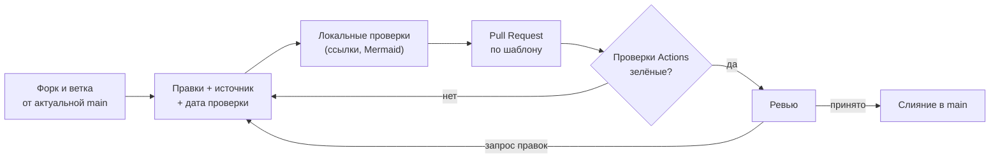

# Руководство для контрибьюторов

[🗺 Оглавление](README.md)

> Актуализировано: сентябрь 2026.

Спасибо, что хотите улучшить **1C-Roadmap**. Этот документ объясняет, как исправить ошибку, обновить устаревший факт или добавить материал так, чтобы изменение приняли с первого раза. Проект держится на проверяемых фактах: у каждого числа, версии и закона должен быть источник и дата проверки.

## Содержание

- [Быстрый старт](#-быстрый-старт)
- [Устройство репозитория](#-устройство-репозитория)
- [Что можно улучшить](#-что-можно-улучшить)
- [Как сообщить о проблеме](#-как-сообщить-о-проблеме)
- [Как предложить изменение](#-как-предложить-изменение)
- [Стандарты контента](#-стандарты-контента)
- [Стандарты кода BSL](#-стандарты-кода-bsl)
- [Проверки перед отправкой](#-проверки-перед-отправкой)
- [Реестр источников и журнал изменений](#-реестр-источников-и-журнал-изменений)
- [Проверка и слияние](#-проверка-и-слияние)
- [Кодекс поведения и вопросы](#-кодекс-поведения-и-вопросы)

## 🚀 Быстрый старт

Опечатку или одну ссылку проще исправить прямо на GitHub: откройте файл, нажмите значок карандаша, GitHub сам создаст форк и Pull Request. Для остального работайте локально.

```bash
# 1. Форкните репозиторий на GitHub (кнопка Fork) и клонируйте свой форк
git clone https://github.com/<ваш-логин>/1C-Roadmap.git
cd 1C-Roadmap
git remote add upstream https://github.com/Kelll31/1C-Roadmap.git

# 2. Создайте ветку от актуальной main основного репозитория
git fetch upstream
git checkout -b fix/8-3-28-not-released upstream/main

# 3. После правок проверьте внутренние ссылки и якоря (нужен только Python 3)
python3 scripts/check_links.py .

# 4. Если меняли диаграммы Mermaid, проверьте и их (нужен Node.js 22)
npm install --no-save --no-package-lock mermaid@12 jsdom@25
node scripts/check_mermaid.mjs .

# 5. Закоммитьте, запушьте и откройте Pull Request
git add .
git commit -m "fix(02_Timeline): 8.3.28 не выходила, ветка 8.3 закончилась на 8.3.27"
git push origin fix/8-3-28-not-released
```

Каталог `node_modules/` указан в `.gitignore`, в коммит он не попадёт. Те же две проверки запускает GitHub Actions на каждый Pull Request.

## 🗂 Устройство репозитория

| Что | Где | Для чего |
|---|---|---|
| Хаб и карта этапов | `README.md` | Точка входа, таблица всех файлов |
| Основные материалы | `01_Strategy.md` … `13_Career.md` | Стратегия, план по этапам, компетенции, сертификация, ресурсы, FAQ, проекты, собеседование, ИИ, законодательство, чек-листы, глоссарий, карьера |
| Треки специализации | `tracks/` | Индекс `tracks/README.md` и по файлу на трек |
| Обзор экосистемы | `all.md` | Длинное чтение с общей картиной. Первичны модульные файлы: правьте сначала их |
| Реестр и журнал | `SOURCES.md`, `CHANGELOG.md` | Источники и даты проверки фактов; что и когда менялось |
| Политики | `SECURITY.md`, `CODE_OF_CONDUCT.md`, `LICENSE` | Безопасность, поведение участников, лицензия |
| Автоматика | `scripts/`, `.github/` | Проверки ссылок и диаграмм, формы Issue, шаблон Pull Request |

Единые правила, которые легко нарушить:

- один факт живёт в одном месте, остальные файлы ссылаются на него по имени файла. Зарплатные ориентиры есть только в `13_Career.md`;
- проекты называются по ID `P0`–`P17`, этапы по номерам «Этап 0»–«Этап 7»; второй вариант нумерации не вводите;
- в тексте платформа называется «8.3.27 и 8.5.1», номера сборок приводят только в `all.md` и `01_Strategy.md`;
- ссылайтесь на файлы целиком (`07_Projects.md`), а не на якоря в чужих файлах: заголовки там меняются.

## 🎯 Что можно улучшить

- 🔴 **Высокий приоритет**: устаревшие данные (версии платформы и типовых, законы, форматы экзаменов), фактические ошибки (выдуманное имя типа или метода, неверный номер закона), битые ссылки.
- 🟡 **Средний**: ошибки в примерах кода, пробелы в содержании, вопросы для FAQ и собеседования.
- 🟢 **Приветствуется**: опечатки, ясность формулировок, структура, ссылки на официальные источники (раздел ИТС, страница 1С, README проекта).

Что не принимается:

- факты без источника и пересказ ответа нейросети без первоисточника;
- копирование текстов из платных материалов (большая часть ИТС, книги, курсы): достаточно ссылки и пересказа своими словами;
- реклама курсов, студий и сервисов; ссылки, которые вы не открывали сами;
- крупные переделки структуры без предварительного Issue с формой «Предложение»; перевод на другие языки тоже сначала обсудите там же.

## 🐛 Как сообщить о проблеме

Сначала поищите в [Issues](https://github.com/Kelll31/1C-Roadmap/issues): возможно, проблема уже описана. Затем выберите форму из `.github/ISSUE_TEMPLATE/`, метка выставится автоматически.

| Форма | Когда использовать | Метка |
|---|---|---|
| Устаревшая информация | Изменились версии, законы, зарплаты, форматы экзаменов. Источник обязателен | `outdated` |
| Фактическая ошибка | Неверный факт, ошибка в BSL-примере или диаграмме, противоречие между файлами | `bug` |
| Битая ссылка | Ссылка не открывается, ведёт не туда или устарела | `broken-link` |
| Предложение | Новая тема, проект для портфолио, вопрос для FAQ или собеседования | `enhancement` |

Ревьюер может дополнительно поставить метки `good first issue` (подходит для первого вклада) и `help wanted` (нужна помощь сообщества).

Вопрос по содержанию можно задать обычным Issue без формы. GitHub Discussions в репозитории не включены. Об уязвимостях и опасных советах читайте `SECURITY.md`, не описывайте детали в открытом Issue.

Хорошее Issue отвечает на четыре вопроса: где, что написано, как правильно и откуда это известно. Пример заполнения формы «Устаревшая информация» (пример вымышленный, факт в нём соответствует действительности):

```text
Файл: 02_Timeline.md
Раздел: Этап 1, список версий платформы

Что написано сейчас:
«Следующая рабочая версия платформы после 8.3.27 — 8.3.28».

Как на самом деле:
Версия 8.3.28 не выходила. Ветка 8.3 закончилась на 8.3.27, новое выходит
в линии 8.5. Верно по состоянию на 29.09.2026.

Источник: https://1c.ru/news/info.jsp?id=32567
```

Для ошибки в коде приложите исправленный фрагмент в блоке ```` ```bsl ```` и ссылку на нарушенный стандарт или раздел документации.

## 🔀 Как предложить изменение



**Ветки** называйте `<тип>/<описание-латиницей>`: `fix/` (ошибка), `update/` (данные, ссылки, законы), `feat/` (новый раздел или проект), `docs/` (оформление, навигация), `chore/` и `ci/` (служебное). Примеры: `fix/8-3-28-not-released`, `update/law-vat-2026-10`, `docs/fix-toc-anchors`.

**Коммиты** оформляйте по [Conventional Commits](https://www.conventionalcommits.org/): `<тип>(<область>): <описание>`. Область — имя файла без расширения или каталог (`02_Timeline`, `tracks`, `SOURCES`, `github`). Типы: `fix`, `feat`, `update`, `docs`, `refactor`, `ci`, `chore`. Описание на русском или английском, одним предложением. Спецификация допускает собственные типы, поэтому `update` и `ci` формат не нарушают.

```text
fix(02_Timeline): 8.3.28 не выходила, ветка 8.3 закончилась на 8.3.27
update(13_Career): обновить зарплатные ориентиры по свежей выгрузке hh.ru
feat(tracks): добавить раздел «Первые 30 дней» в трек аналитика
docs(SOURCES): добавить строки по ФСБУ 10/2026
ci: проверять диаграммы при изменении scripts/
```

Одно изменение, одна тема: «всего понемногу» ревьюить тяжело.

**Описание Pull Request.** GitHub подставит `.github/PULL_REQUEST_TEMPLATE.md`. Заполните «Что изменено», «Зачем», «Источники» (ссылки с датой проверки) и «Чеклист». Заметное для читателя изменение внесите в `CHANGELOG.md`.

## 📝 Стандарты контента

### Факты и источники

- **Всё, что может устареть** (версия, дата, число, закон, цена, зарплата, формат экзамена), пишется с датой проверки и источником. Слова «сейчас», «в последнее время», «многие» заменяйте конкретикой.
- **Не выдумывайте** названия инструментов, людей, каналов, ссылки, версии, номера стандартов и законов. Не уверены: напишите осторожно («уточняйте на странице …» со ссылкой на официальный раздел) или уберите утверждение.
- **Каждая ссылка проверена вами**: вы открыли страницу и убедились, что она подтверждает утверждение. Ранее удалённые выдумки перечислены в `SOURCES.md`, раздел «Удалено при актуализации 2026-09»: не возвращайте их.
- **Возможности платформы** приписывайте версии, в которой они появились; не называйте новинкой 8.5 то, что есть с 8.3.x. Возможности тестовой 8.5.4 подавайте как «заявлено в тестовой версии».
- **Законодательство**: номер закона или приказа и оговорка «проверяйте актуальную редакцию на consultant.ru и nalog.gov.ru».
- **Зарплаты и рыночные данные**: только с источником и периодом, как ориентир, а не статистика рынка. Размещайте их только в `13_Career.md`.

### Подходящие источники

- Платформа и технологии: [ИТС](https://its.1c.ru), [v8.1c.ru](https://v8.1c.ru), [1c.ru](https://1c.ru), англоязычная документация [kb.1ci.com](https://kb.1ci.com). Большая часть ИТС доступна по платной подписке: если ссылка ведёт в закрытый раздел, укажите это.
- Стандарты разработки: [its.1c.ru/db/v8std](https://its.1c.ru/db/v8std), ссылка на конкретный пункт вида `#std657`.
- Открытые проекты: README, релизы и трекер самого репозитория на GitHub.
- Рынок труда: выгрузки и обзоры с указанием источника, даты и размера выборки. Сообщество ([Infostart](https://infostart.ru), [mista.ru](https://mista.ru)): статьи с автором и датой, как вторичный источник.
- Не принимаются: анонимные сообщения в мессенджерах, ответы нейросетей без первоисточника, статьи без даты.

### Разметка Markdown

| Правило | ✅ Правильно | ❌ Неправильно |
|---|---|---|
| Начало файла | `# Заголовок`, строка навигации, строка «Актуализировано» | Файл без навигации |
| Заголовки | `## Раздел` | `## Раздел:` (двоеточие в конце, правило MD026 markdownlint) |
| Эмодзи в заголовках | Одиночные: 🎯 🧭 📝 ✅ 🔗 | С вариационным селектором: ⚠️ 🛠️ 🏛️ 🗺️ ⚙️ ☁️ ℹ️ |
| Списки | Единый маркер `-` | Смесь `-` и `*` |
| Ссылки | `[текст](https://…)` | Голые URL (правило MD034) |
| Таблицы | Без пустых строк внутри | Пустая строка рвёт таблицу |
| Выделение | **Жирный** для ключевых понятий | Капслок для выделения |
| Блоки кода | С языком: `bsl`, `sql`, `bash`, `yaml`, `text` | Блок без языка (правило MD040) |
| Mermaid | `<br/>` для переноса, подписи с пробелами и скобками в кавычках | `\n` в подписи, `:` и `;` без кавычек |

**Почему эмодзи с U+FE0F ломают оглавление.** GitHub строит якорь из текста заголовка: буквы в нижний регистр, пробелы в `-`, знаки препинания и эмодзи убираются. Невидимый селектор U+FE0F остаётся в якоре, и ссылка из оглавления перестаёт работать. Заголовок `## 🚀 Быстрый старт` даёт якорь `#-быстрый-старт` (ведущий `-` появляется из пробела после эмодзи). Проверка файлов:

```bash
LC_ALL=C grep -nP '^#+ .*\xEF\xB8\x8F' *.md tracks/*.md
```

Пустой вывод означает, что селекторов в заголовках нет. В обычном тексте и таблицах ⚠️ допустим.

**Язык и стиль.** Русский; идентификаторы как в документации 1С: `&НаСервере`, `ФоновыеЗадания`, `ТаблицаЗначений`. Тон практичного наставника: версии, команды, критерии «готово», без маркетинга, превосходных степеней и жаргона. Навигационные строки сверху и снизу файла не ломайте: порядок цепочки файлов задан в `README.md`.

## 💻 Стандарты кода BSL

Примеры должны соответствовать [стандартам разработки](https://its.1c.ru/db/v8std), работать на платформе 8.3.27 и 8.5.1 и использовать только существующие типы и методы. Нейросети склонны выдумывать имена вроде `КомпоновщикНастроекDCS` (правильно: `КомпоновщикНастроекКомпоновкиДанных`). Сверяйте каждое имя с синтакс-помощником и прогоняйте пример через BSL Language Server.

### Эталонный пример

Серверная логика с запросом живёт в общем модуле, а модуль формы только вызывает её и возвращает на клиент простые типы. Имена регистра и ресурса учебные.

```bsl
// Общий модуль «ОстаткиТоваров» (флажок «Сервер», без «Вызов сервера»)

// Возвращает остатки номенклатуры, просуммированные по всем складам.
//
// Параметры:
//   СписокНоменклатуры - Массив из СправочникСсылка.Номенклатура - отбор по номенклатуре
//
// Возвращаемое значение:
//   ТаблицаЗначений - колонки: Номенклатура, КоличествоОстаток
//
Функция ОстаткиНоменклатуры(Знач СписокНоменклатуры) Экспорт

    Запрос = Новый Запрос;
    Запрос.Текст =
        "ВЫБРАТЬ
        |    Остатки.Номенклатура КАК Номенклатура,
        |    СУММА(Остатки.КоличествоОстаток) КАК КоличествоОстаток
        |ИЗ
        |    РегистрНакопления.ТоварыНаСкладах.Остатки(, Номенклатура В (&СписокНоменклатуры)) КАК Остатки
        |
        |СГРУППИРОВАТЬ ПО
        |    Остатки.Номенклатура";
    Запрос.УстановитьПараметр("СписокНоменклатуры", СписокНоменклатуры);

    Возврат Запрос.Выполнить().Выгрузить();

КонецФункции
```

```bsl
// Модуль формы: на клиент возвращаем Соответствие, а не ТаблицаЗначений

&НаКлиенте
Процедура ПоказатьОстатки(Команда)
    // ВыбранныеТовары() здесь условно возвращает Массив ссылок на номенклатуру
    Остатки = ОстаткиДляКлиента(ВыбранныеТовары());
    // ... вывод остатков в форму
КонецПроцедуры

&НаСервереБезКонтекста
Функция ОстаткиДляКлиента(Знач СписокНоменклатуры)

    Результат = Новый Соответствие;
    Для Каждого СтрокаОстатка Из ОстаткиТоваров.ОстаткиНоменклатуры(СписокНоменклатуры) Цикл
        Результат.Вставить(СтрокаОстатка.Номенклатура, СтрокаОстатка.КоличествоОстаток);
    КонецЦикла;
    Возврат Результат;

КонецФункции
```

Что здесь важно:

- экспортная функция в общем модуле, а не в модуле формы: в формах экспортными остаются только обработчики оповещений ([#std630](https://its.1c.ru/db/v8std/content/630/hdoc));
- параметры серверных вызовов объявлены с `Знач`: иначе значение пересылается обратно на клиент без необходимости;
- на клиент уходит `Соответствие`: возврат `ТаблицаЗначений` с сервера на тонкий и веб-клиент невозможен;
- условие по номенклатуре передано в параметр виртуальной таблицы `Остатки`, а не в `ГДЕ` ([#std657](https://its.1c.ru/db/v8std/content/657/hdoc));
- значение передано параметром запроса, а не конкатенацией; поля имеют псевдонимы, ключевые слова написаны заглавными ([#std437](https://its.1c.ru/db/v8std/content/437/hdoc));
- группировка только по номенклатуре без остальных измерений регистра допустима для учебного примера; в рабочем коде для быстрого чтения остатков учитывайте рекомендации [#std733](https://its.1c.ru/db/v8std/content/733/hdoc) (во внешнем запросе используются все измерения таблицы).

### Типичные нарушения

```bsl
// ❌ Неправильно (модуль формы)
&НаСервереБезКонтекста
Функция ОстаткиНоменклатуры(СписокНоменклатуры) Экспорт // экспорт в форме, параметр без Знач
    Запрос = Новый Запрос;
    Запрос.Текст =
        "ВЫБРАТЬ
        |    Остатки.Номенклатура,
        |    Остатки.КоличествоОстаток
        |ИЗ
        |    РегистрНакопления.ТоварыНаСкладах.Остатки() КАК Остатки
        |ГДЕ
        |    Остатки.Номенклатура В (&СписокНоменклатуры)"; // условие вне параметров виртуальной таблицы
    Запрос.УстановитьПараметр("СписокНоменклатуры", СписокНоменклатуры);
    Возврат Запрос.Выполнить().Выгрузить(); // ТаблицаЗначений на клиент не вернуть
КонецФункции
```

Запрос в цикле (по одному обращению к СУБД на элемент) заменяйте одним запросом с условием `В (&Список)`, `ОБЪЕДИНИТЬ ВСЕ` или пакетом ([#std436](https://its.1c.ru/db/v8std/content/436/hdoc)).

### Изменение данных

Если пример записывает данные, оформите его по стандартам [#std460](https://its.1c.ru/db/v8std/content/460/hdoc) (управляемый режим блокировок) и [#std783](https://its.1c.ru/db/v8std/content/783/hdoc) (начало и конец транзакции в одном методе). Блокировка ставится до чтения данных, которые затем изменяются, и только на нужные записи. После `ОтменитьТранзакцию` ошибку записывают в журнал регистрации и повторно вызывают исключение: так устроен паттерн из #std783.

```bsl
// Общий серверный модуль (учебный пример: имя регистра и измерения условные)
Процедура ВыполнитьДействиеПоСкладу(Знач Склад) Экспорт

    НачатьТранзакцию();
    Попытка
        Блокировка = Новый БлокировкаДанных;
        ЭлементБлокировки = Блокировка.Добавить("РегистрНакопления.ТоварыНаСкладах");
        ЭлементБлокировки.Режим = РежимБлокировкиДанных.Исключительный;
        ЭлементБлокировки.УстановитьЗначение("Склад", Склад);
        Блокировка.Заблокировать();

        // ... чтение остатков и запись движений
        ЗафиксироватьТранзакцию();
    Исключение
        ОтменитьТранзакцию();

        ЗаписьЖурналаРегистрации(НСтр("ru = 'Действие по складу'"),
            УровеньЖурналаРегистрации.Ошибка,
            ,
            ,
            ОбработкаОшибок.ПодробноеПредставлениеОшибки(ИнформацияОбОшибке()));

        ВызватьИсключение;
    КонецПопытки;

КонецПроцедуры
```

### Чек-лист кода

| Проверка | Стандарт |
|---|---|
| Контекст указан явно (`&НаКлиенте`, `&НаСервере`, `&НаСервереБезКонтекста`), общий код не дублируется; в модулях форм нет экспортных методов, кроме обработчиков оповещений | [#std630](https://its.1c.ru/db/v8std/content/630/hdoc) |
| У параметров серверных методов, вызываемых с клиента, есть `Знач`; `ТаблицаЗначений` на клиент не возвращается (`Массив`, `Структура`, `Соответствие`, реквизит формы) | BSL Language Server, `TransferringParametersBetweenClientAndServer`; Руководство разработчика |
| Нет запросов в цикле | [#std436](https://its.1c.ru/db/v8std/content/436/hdoc) |
| Все условия виртуальной таблицы переданы в её параметры, а не в `ГДЕ` | [#std657](https://its.1c.ru/db/v8std/content/657/hdoc) |
| Нет `ВЫБРАТЬ *`; поля с псевдонимами; ключевые слова заглавными | [#std729](https://its.1c.ru/db/v8std/content/729/hdoc), [#std437](https://its.1c.ru/db/v8std/content/437/hdoc) |
| Данные в запрос передаются параметрами; шаблон `ПОДОБНО` — константа или параметр | [#std726](https://its.1c.ru/db/v8std/content/726/hdoc) |
| Нет модальных вызовов (`Вопрос`, `Предупреждение`, `ОткрытьФормуМодально`, `ВвестиЗначение`): `ПоказатьВопрос` с `ОписаниеОповещения` или `Асинх`/`Ждать`; в Конфигураторе включите проверку «Поиск использования синхронных вызовов» | [#std703](https://its.1c.ru/db/v8std/content/703/hdoc) |
| Транзакция начинается и завершается в одном методе; перед изменением данных управляемая блокировка | [#std783](https://its.1c.ru/db/v8std/content/783/hdoc), [#std460](https://its.1c.ru/db/v8std/content/460/hdoc) |
| У `HTTPСоединение`, `WSПрокси`, `FTPСоединение` задан таймаут | [#std748](https://its.1c.ru/db/v8std/content/748/hdoc) |
| Пароли и ключи не в коде; безопасное хранилище БСП, вызов в привилегированном режиме | [#std740](https://its.1c.ru/db/v8std/content/740/hdoc) |
| Типы и методы существуют в 8.3.27 и 8.5.1; имена информативные, на русском; текст запроса многострочный, не в одну строку | Синтакс-помощник |
| Пример компилируется без ошибок, замечаний BSL Language Server нет | Конфигуратор или EDT, BSL Language Server |

Если пример учебный и намеренно упрощён (нет проверок, нет `Знач`), скажите об этом в тексте рядом: читатель должен понимать, чем он отличается от рабочего варианта.

## ✅ Проверки перед отправкой

| Проверка | Как запустить | Что ловит |
|---|---|---|
| Внутренние ссылки и якоря | `python3 scripts/check_links.py .` | Ссылки на несуществующие файлы и якоря (по правилам якорей GitHub) |
| Диаграммы Mermaid | `node scripts/check_mermaid.mjs .` после `npm install --no-save --no-package-lock mermaid@12 jsdom@25` | Ошибки синтаксиса блоков ```` ```mermaid ````, литерал `\n` в подписях |
| Эмодзи в заголовках | `grep` из раздела «Разметка Markdown» | Селектор U+FE0F, ломающий якоря |

Автоматика в `.github/workflows/`:

- `docs-check.yml` запускает первые две проверки на каждый Pull Request и каждый push в `main`, если менялись `.md`-файлы или `scripts/`. Красную проверку исправьте до ревью;
- `external-links.yml` раз в неделю проверяет внешние ссылки инструментом lychee. Проверка информационная и сборку не роняет: часть российских сайтов недоступна из сетей GitHub или отвечает роботам кодом 403. Отчёт смотрите в Summary запуска; мёртвую ссылку оформите Issue «Битая ссылка».

Скрипты не проверяют внешние URL, правдивость фактов и корректность BSL: это остаётся на вас и ревьюере. Перед отправкой убедитесь, что:

- [ ] ветка от актуальной `main`, изменения касаются одной темы;
- [ ] утверждения подкреплены источниками с датой, ссылки открывали вы;
- [ ] нет выдуманных имён, версий и ссылок;
- [ ] BSL-примеры проходят чек-лист выше;
- [ ] нет опечаток (подойдёт LanguageTool или Яндекс Спеллер);
- [ ] заголовки без двоеточия в конце, в заголовках нет эмодзи с U+FE0F;
- [ ] навигация и оглавление не нарушены, строка «Актуализировано» обновлена, если вы пересмотрели факты файла;
- [ ] записи в `SOURCES.md` и `CHANGELOG.md` добавлены, если требуется.

## 🧭 Реестр источников и журнал изменений

**SOURCES.md** отвечает на вопрос «откуда это известно». Таблицы сгруппированы по темам, строки имеют ID вида `PL-01`, колонки: утверждение, источник (URL), дата проверки, уровень А, Б или В (А — первоисточник или артефакт: код, трекер, схема; Б — вторичные источники, пишите с оговоркой; В — оценка авторов).

- Добавили или изменили ключевой факт (версию, дату, закон, формат экзамена, число) — добавьте или обновите строку: утверждение, первоисточник, дата, честный уровень. Нет первоисточника — уровень В или удалите факт.
- Удаляете выдуманное или неверное утверждение — отметьте его в разделе «Удалено при актуализации 2026-09» или в разделе о неподтверждённом, чтобы оно не вернулось.
- Порядок работы с уровнями описан в самом `SOURCES.md`, раздел «Как обновлять реестр».

**CHANGELOG.md** ведётся по формату Keep a Changelog: записи группируются по версиям или датам, внутри — по типам (добавлено, изменено, исправлено, удалено). Своё изменение добавьте в раздел неопубликованных изменений (`Unreleased`), если оно заметно читателю: новый раздел или проект, исправленный факт, изменение структуры. Опечатки и косметику записывать не нужно. Пишите для читателя («Исправлено: версия 8.3.28 не выходила»), а не для разработчика («поправил строку 121»).

## 🔍 Проверка и слияние

Ориентиры по срокам (не обязательства): опечатка или битая ссылка — 1–3 рабочих дня, фактическое исправление с источником — 3–7, новый раздел или крупное дополнение — 7–14. Если Pull Request завис дольше, оставьте в нём комментарий.

- **Принят**: изменение сливается в `main` без правок или с небольшими.
- **Запрос правок**: ревьюер оставляет комментарии, вы отвечаете и обновляете ту же ветку.
- **Отклонён**: изменение противоречит концепции проекта, дублирует существующее или не подкреплено источником. Причина указывается в комментарии.

Ревьюер проверяет источник и дату у каждого факта, соответствие стандартам кода, навигацию и якоря, отсутствие дублей в других файлах. Если ваш факт противоречит другому файлу, исправьте оба места или откройте Issue «Фактическая ошибка» с типом «Противоречие между файлами». После слияния ваше авторство сохраняется в истории коммитов.

## 🤝 Кодекс поведения и вопросы

Участвуя в проекте, вы соглашаетесь соблюдать [Кодекс поведения](CODE_OF_CONDUCT.md). Коротко: уважайте участников независимо от опыта, критикуйте текст и код, а не человека, при ревью объясняйте причину замечания и предлагайте исправление.

- По содержанию роудмапа: обычный [Issue](https://github.com/Kelll31/1C-Roadmap/issues), форма не обязательна.
- По уязвимостям и опасным советам: `SECURITY.md`.
- По платформе и разработке на 1С: [mista.ru](https://mista.ru), [Infostart](https://infostart.ru), документация [kb.1ci.com](https://kb.1ci.com).

Каждый вклад, даже исправление одной опечатки или ссылки, делает роудмап точнее. Спасибо.

[🗺 Оглавление](README.md)
