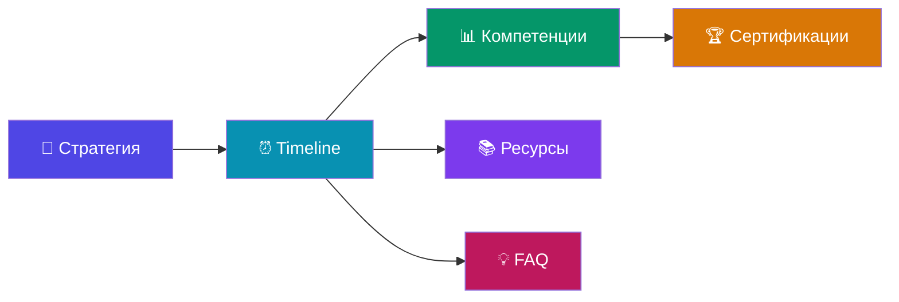

# 🗺️ Roadmap 1С-Разработчика 2026

> **Профессиональный путь от нуля до уверенного инженера** в экосистеме 1С:Предприятие: AI-инструменты, BDD, 1С:Элемент, DevOps, PostgreSQL, строгая архитектурная гигиена.

Репозиторий содержит актуализированную, структурированную дорожную карту профессионального развития 1С-программиста. Материал основан на глубоком исследовании платформы 2026 года, программах Учебного центра №1 и реальных требованиях рынка труда.

> **Целевая аудитория:** Люди с базовыми навыками работы с ПК, желающие войти в профессию 1С-разработчика. Опыт программирования не требуется — но крайне приветствуется.

> **Системные требования для комфортного обучения:** CPU Intel Core i5 / AMD Ryzen 5+, RAM 16 GB, SSD 60+ GB свободного места, ОС Windows 10/11 или Astra Linux.

---

## 📋 Структура Roadmap

| # | Раздел | Содержание |
|---|--------|------------|
| 1 | [🎯 Стратегия](01_Strategy.md) | Ключевые принципы, фокусы 2026 года (AI, 1С:Элемент, PBKDF2, Расширения), целевые результаты |
| 2 | [⏰ Timeline](02_Timeline.md) | Пошаговый помесячный и понедельный план: от установки платформы до подготовки к 1С:Специалист |
| 3 | [📊 Компетенции](03_Competencies.md) | Матрица навыков по 4 карьерным трекам: Разработка, Архитектура, HighLoad/DevOps, Аналитика |
| 4 | [🏆 Сертификации](04_Certifications.md) | Система экзаменов 1С с диаграммой пререквизитов, критериями оценки и треками |
| 5 | [📚 Ресурсы](05_Resources.md) | Книги, YouTube, Telegram, AI-инструменты, Open Source проекты, официальные ссылки |
| 6 | [💡 FAQ и советы](06_FAQ_and_Tips.md) | Ответы на ключевые вопросы, примеры кода (Bad → Good), подводные камни 2026 |

---

## 🚀 Быстрый старт

**Впервые в 1С?** → Начните с [01_Strategy.md](01_Strategy.md), затем следуйте [02_Timeline.md](02_Timeline.md) строго по неделям.

**Уже работаете в 1С?** → Перейдите к [03_Competencies.md](03_Competencies.md), определите свой текущий грейд и целевой трек развития.

**Готовитесь к сертификации?** → Изучите [04_Certifications.md](04_Certifications.md) и выберите правильный порядок экзаменов.

---

## 💡 Философия Roadmap

Современный 1С-разработчик — это **архитектор бизнес-процессов**, а не просто кодер. Вы изучаете:
- **Технику** — платформа, BSL, СКД, EDT, Git, тесты
- **Предметную область** — налоги, маркировка, производство, МСФО
- **Экосистему** — AI-ассистенты, CI/CD, BDD, облачные архитектуры

Следуйте плану, практикуйтесь ежедневно, используйте AI-инструменты с умом — и вы войдёте в одну из наиболее востребованных и защищённых от кризисов IT-специальностей.

---

## 🤝 Contributing

Нашли ошибку или хотите дополнить гайд? Создайте Issue или Pull Request. Особенно приветствуются:
- Актуализация зарплатных вилок и требований рынка
- Исправление устаревших ссылок
- Добавление примеров кода в FAQ

## 📄 License

Distributed under the [MIT License](LICENSE).

---

*Roadmap актуализирован: 2026 год. Основан на исследовании архитектурных парадигм платформы 1С.*
*Полный исходный документ (Source of Truth): [all.md](all.md)*
