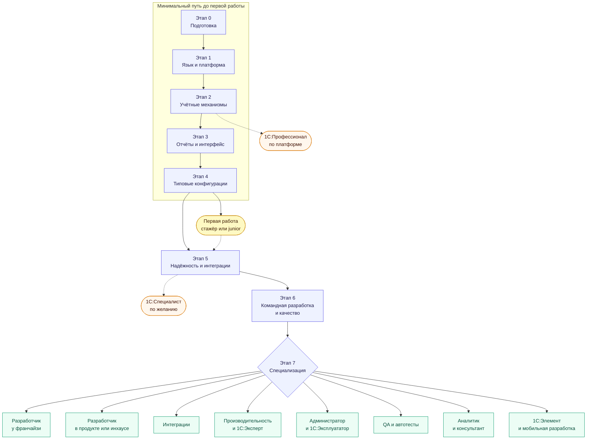

# Роадмап 1С-разработчика 2026

[🗺 Оглавление](#-все-файлы-роадмапа) | [Следующий →](01_Strategy.md)

> Актуализировано: сентябрь 2026. Факты сверены на 29.09.2026, реестр источников — в [SOURCES.md](SOURCES.md).

Это открытый роадмап профессии «разработчик 1С:Предприятия». Он ведёт от нуля до первой работы и дальше, до специализации. Путь разбит на этапы с критериями выхода, к нему прилагаются практические проекты с критериями приёмки, подготовка к собеседованию и экзаменам, предметная область, чек-листы и восемь треков специализации.

**Кому подойдёт:**

- тем, кто начинает с нуля. Опыт программирования не обязателен, но уже от Junior официальная модель 1С ждёт умения объяснить базовые алгоритмы поиска и сортировки: они есть в Этапе 1 и проекте P0;
- бухгалтерам и специалистам по учёту, которые переходят в разработку;
- программистам на других языках, которым нужно быстро разобраться в особенностях платформы: клиент-серверной модели, запросах, регистрах;
- junior-разработчикам, которые выбирают направление роста;
- наставникам и руководителям — для онбординга и оценки кандидатов.

**На чём основан:**

- официальная «Модель профессиональных компетенций Разработчика» фирмы «1С» MC-6-001 (2025);
- система стандартов и методик разработки [its.1c.ru/db/v8std](https://its.1c.ru/db/v8std);
- реальные тестовые задания и вопросы собеседований 2021–2026 годов из открытых репозиториев;
- программы учебных курсов (УЦ №1, Нетология) и каталог инструментов сообщества Landscape1C;
- выгрузка вакансий hh.ru за 10.08–07.09.2026 — как ориентир, а не как статистика рынка.

> ⚠️ Роадмап — независимый проект сообщества, а не официальный документ фирмы «1С». Версии, законы и условия сервисов меняются: где стоит «проверяйте на …», сверяйтесь с первоисточником.

## ⚡ Что нового в сентябре 2026

### 🌐 В мире 1С

- **Ветка 8.3 закончилась на 8.3.27, дальше — 8.5.** Рабочие линии — 8.3.27 и 8.5.1, версии 8.3.28 не было. 8.5 — не новая платформа, а новая нумерация той же платформы: 8.5.1 (финальная версия вышла 25.12.2025) — это возможности 8.3.27 плюс новый интерфейс «Версия 8.5» с тёмной темой, векторными картинками и компактным масштабом. 8.5.4 с 05.05.2026 — тестовая версия, её выход как рабочей на конец сентября не подтверждён.
- **Возможности появлялись по версиям, а не «всё в 8.5».** Выбор алгоритма хеширования паролей (рекомендуется PBKDF2-HMAC-SHA256), вход по QR-коду, завершение сеанса при бездействии и уведомления клиента появились в 8.3.26. WebSocket-клиент и вход по одноразовому коду из почты — в 8.3.27. Немодальный режим существует с 8.3.3, а `Асинх`/`Ждать` — с 8.3.18.
- **Большие типовые остаются на 8.3.27.** БП, ЗУП, УТ, КА, ERP, УХ и ДО в 2026 году работают на 8.3.27. На 8.5 перешли УНФ и «Розница» начиная с 3.0.13. БСП выходит в двух редакциях: 3.1.12 для 8.3.24–8.3.27 и 3.2.1 только для 8.5.1, обе обновлены 23–24.09.2026.
- **Инструменты.** Стабильная ветка 1C:EDT — 2026.1, 2026.2 пока в статусе релиз-кандидата (Eclipse 2025-12, Java 25). Конфигуратор и хранилище конфигурации по-прежнему поддерживаются и массово используются в сопровождении. В Vanessa Automation с версии 1.2.043.12 встроен MCP-сервер.
- **ИИ стал рабочим инструментом, но не заменой разработчику.** 1С:Напарник — ИИ-ассистент разработчика внутри 1C:EDT. Доступ даёт токен на [code.1c.ai](https://code.1c.ai/) по учётной записи ИТС, код обрабатывается в облаке 1С. Открытый бенчмарк PRISM (прогон 25.09.2026, 57 моделей, 35 задач исполняются в 1С 8.3.27) показывает: лучшие модели решают 85–100% задач, GigaChat и YandexGPT — 0–13%. Для ГИС с 01.03.2026 действует приказ ФСТЭК № 117: его п. 60 запрещает передавать разработчику модели ИИ информацию ограниченного доступа.
- **Законы, под которые переделывают типовые.** НДС 22% с 01.01.2026 (425-ФЗ). Порог освобождения от НДС на УСН — 20 млн ₽ по доходам за 2025–2028 годы (228-ФЗ от 04.07.2026). ЭПД обязательны с 01.09.2026, с той же даты начался первый этап цифрового рубля. В маркировке главная тема — разрешительный режим на кассе через ТС ПИоТ. ФСБУ 9/2025 «Доходы» и ФСБУ 10/2026 «Расходы» обязательны с отчётности 2027 года. Подробности — в [10_Domain_and_Law.md](10_Domain_and_Law.md); актуальные редакции проверяйте на consultant.ru и nalog.gov.ru.
- **Рынок и требования.** Рынок ИТ в 2025–2026 годах — рынок работодателя. В выгрузке hh.ru за 10.08–07.09.2026 (452 вакансии «1С») вакансий «без опыта» — 5–7%, удалённый формат допускает около половины. Из конфигураций чаще других упоминается 1С:ERP. Официальная модель компетенций MC-6-001 определяет уровни Junior, Middle и Senior через навыки, а не через стаж.

### 📝 В роадмапе

- **Этапы 0–7 с критериями выхода** вместо плана на 48 недель. Сроки остались, но только как ориентиры.
- **Уровни Junior / Middle / Senior по официальной модели MC-6-001**, без сроков «Junior — 0–6 месяцев».
- **Восемь треков специализации** в папке [tracks/](tracks/README.md), в том числе администратор / 1С:Эксплуататор, QA и аналитик.
- **Новые разделы:** проекты P0–P17 с критериями приёмки, собеседования, ИИ в разработке, предметная область и законодательство, чек-листы, глоссарий, карьера и первая работа.
- **Исправлены ошибки прошлой версии.** Формат 1С:Профессионал — 14 вопросов за 30 минут и не менее 12 верных ответов. Немодальный режим появился в 8.3.3, а не в 8.5. 1С:Напарник — ассистент разработчика, а не пользователя. ЛИФО не было уже в ПБУ 5/01. Удалены несуществующие инструменты и репозитории. Полный список — в [SOURCES.md](SOURCES.md).
- **Зарплаты — только в [13_Career.md](13_Career.md)**, с источником, периодом и методикой. [all.md](all.md) теперь обзор экосистемы, а не «источник истины»: первичны модульные файлы.
- **Появились [SOURCES.md](SOURCES.md) и [CHANGELOG.md](CHANGELOG.md)**, а в CI — проверка ссылок и диаграмм.

## 🧭 Карта роадмапа


```mermaid
flowchart TD
    subgraph MIN["Минимальный путь до первой работы"]
        S0["Этап 0<br/>Подготовка"] --> S1["Этап 1<br/>Язык и платформа"]
        S1 --> S2["Этап 2<br/>Учётные механизмы"]
        S2 --> S3["Этап 3<br/>Отчёты и интерфейс"]
        S3 --> S4["Этап 4<br/>Типовые конфигурации"]
    end
    S2 -.-> PROF(["1С:Профессионал<br/>по платформе"])
    S4 --> JOB(["Первая работа<br/>стажёр или junior"])
    S4 --> S5["Этап 5<br/>Надёжность и интеграции"]
    JOB -.-> S5
    S5 -.-> SPEC(["1С:Специалист<br/>по желанию"])
    S5 --> S6["Этап 6<br/>Командная разработка<br/>и качество"]
    S6 --> S7{"Этап 7<br/>Специализация"}
    S7 --> T1["Разработчик<br/>у франчайзи"]
    S7 --> T2["Разработчик<br/>в продукте или инхаусе"]
    S7 --> T3["Интеграции"]
    S7 --> T4["Производительность<br/>и 1С:Эксперт"]
    S7 --> T5["Администратор<br/>и 1С:Эксплуататор"]
    S7 --> T6["QA и автотесты"]
    S7 --> T7["Аналитик<br/>и консультант"]
    S7 --> T8["1С:Элемент<br/>и мобильная разработка"]
    classDef stage fill:#eef2ff,stroke:#4f46e5,color:#1e1b4b
    classDef exam fill:#fff7ed,stroke:#d97706,color:#431407
    classDef track fill:#ecfdf5,stroke:#059669,color:#064e3b
    class S0,S1,S2,S3,S4,S5,S6,S7 stage
    class PROF,SPEC exam
    class T1,T2,T3,T4,T5,T6,T7,T8 track
    style JOB fill:#fef9c3,stroke:#ca8a04,color:#422006
```

Подробности по каждому этапу — в [02_Timeline.md](02_Timeline.md), проекты — в [07_Projects.md](07_Projects.md), треки — в [tracks/README.md](tracks/README.md).

| Этап | Что осваиваете | Критерий выхода | Проекты |
|---|---|---|---|
| 0. Подготовка | Учебная версия или community-лицензия, файловая ИБ, Конфигуратор, синтакс-помощник, основы Git; бухучёт для программиста: счёт, проводка, дебет и кредит, счета 41, 60, 62, 90 | ИБ создана, репозиторий на GitHub заведён; можете объяснить проводку «оплата поставщику» | — |
| 1. Язык и платформа | Объекты метаданных, модули, типы и коллекции, процедуры и функции, формы и команды, клиент-серверное взаимодействие, немодальный режим | Задачи P0 решены; можете объяснить разницу между четырьмя директивами компиляции | P0 |
| 2. Учётные механизмы | Справочники и документы, проведение, регистры накопления и сведений, назначение регистров бухгалтерии и расчёта, виртуальные таблицы, запросы: соединения, временные таблицы, пакеты | P1 и P2 сделаны; сдан 1С:Профессионал по платформе | P1, P2 |
| 3. Отчёты и интерфейс | СКД, печатные формы, внешние отчёты и обработки, права и роли | P3 и P7 сделаны | P3, P7 |
| 4. Типовые конфигурации | БП и УТ на уровне пользователя, БСП, расширения, обновление доработанной конфигурации, «Дополнительные отчеты и обработки», обмены, загрузка из Excel | P8 и P9 сделаны; резюме и портфолио готовы | P8, P9 |
| 5. Надёжность и интеграции | Транзакции и управляемые блокировки, контроль остатков, регистры бухгалтерии и расчёта, фоновые задания, HTTP-сервисы, JSON, XDTO, OData, КД3 и EnterpriseData | P4–P6 и P10–P12 сделаны; 1С:Специалист — по желанию | P4–P6, P10–P12 |
| 6. Командная разработка и качество | 1C:EDT и Git, код-ревью, стандарты, АПК, BSL Language Server, SonarQube, YAxUnit, Vanessa Automation, CI, ИИ-ассистенты | P13 сделан: pull request проходит CI | P13, P17 (опц.) |
| 7. Специализация | Темы выбранного трека | Проект трека сдан | P14, P15, P16 (опц.) |

## 🎯 Минимальный путь и полный роадмап

Роадмап можно проходить в двух вариантах. Минимальный путь — это кратчайшая дорога к первой работе, полный — к самостоятельной работе в выбранной специализации.

| | Минимальный путь | Полный роадмап |
|---|---|---|
| Этапы | 0–4 | 0–7 и один трек |
| Цель | Первая работа: стажёр, junior у франчайзи, первая линия поддержки | Самостоятельная работа в специализации, темы уровня Middle |
| Ориентир при 15–20 ч/нед | ~6–9 месяцев | ~12–18 месяцев |
| Проекты | P0–P3, P7–P9 | P0–P15, по желанию P16 и P17 |
| Сертификат | 1С:Профессионал по платформе | Плюс 1С:Специалист или экзамен своего трека — по желанию |
| Среда разработки | Конфигуратор; Git — для своих проектов | Плюс 1C:EDT, Git в команде, CI |

Сроки — оценка авторов, а не обещание: реальный темп зависит от опыта, регулярности и объёма практики.

**Что нельзя пропускать даже в минимальном пути:** клиент-серверное разделение кода, запросы без цикла и с параметрами виртуальных таблиц, назначение всех трёх видов учётных регистров, основы бухучёта и типовые проводки, расширения и обновление типовой конфигурации.

**Что можно отложить до первой работы:** EDT и Git в команде, CI и автотесты, нагрузочное тестирование, 1С:Элемент и мобильную разработку.

> 💡 Вакансий «без опыта» мало, поэтому начинайте откликаться уже на Этапе 4 и рассматривайте стажировки, первую линию поддержки и франчайзи в своём городе. Подробности — в [13_Career.md](13_Career.md).

## 🚀 Начни здесь

Совет для любого сценария: сделайте форк репозитория, отмечайте чекбоксы в своей копии [11_Checklists.md](11_Checklists.md) и раз в квартал заглядывайте в [CHANGELOG.md](CHANGELOG.md), чтобы знать, что изменилось в платформе, законах и самом роадмапе.

### 🎓 Я начинаю с нуля

1. Прочитайте [01_Strategy.md](01_Strategy.md): как устроен мир 1С, какие бывают контексты работы и чего ждут от новичка.
2. Подготовьте рабочее место по разделу [«Что понадобится»](#-что-понадобится) ниже.
3. Идите по [02_Timeline.md](02_Timeline.md) этап за этапом. Переходите к следующему этапу, только когда выполнены критерии выхода.
4. Каждую тему закрепляйте проектом из [07_Projects.md](07_Projects.md) и выкладывайте его на GitHub.
5. С первого месяца изучайте учёт по [10_Domain_and_Law.md](10_Domain_and_Law.md): проводки и складские операции спрашивают даже у стажёров.
6. Незнакомый термин ищите в [12_Glossary.md](12_Glossary.md), типичные затруднения разобраны в [06_FAQ_and_Tips.md](06_FAQ_and_Tips.md).
7. После Этапа 4 переходите к [13_Career.md](13_Career.md) и [08_Interview.md](08_Interview.md).

Если вы переходите из бухгалтерии или из другого языка программирования, в [13_Career.md](13_Career.md) есть отдельный раздел о смене профессии.

### 💼 Я уже работаю с 1С

1. Оцените себя по матрице [03_Competencies.md](03_Competencies.md).
2. Пройдите самопроверку по этапам в [11_Checklists.md](11_Checklists.md) и отметьте пробелы.
3. Закройте пробелы проектами уровня Middle: P10–P13 из [07_Projects.md](07_Projects.md).
4. Сверьте свои представления с разделом о мифах в [01_Strategy.md](01_Strategy.md) и с подводными камнями в [06_FAQ_and_Tips.md](06_FAQ_and_Tips.md).
5. Выберите трек в [tracks/README.md](tracks/README.md).

### 🏆 Я готовлюсь к экзамену

- **1С:Профессионал по платформе** — после Этапа 2. Компьютерный тест: 14 вопросов за 30 минут, для сертификата нужно не менее 12 верных ответов. Условия проверяйте на [1c.ru/prof](https://1c.ru/prof/prof.htm). Потренироваться можно в бесплатном [учебном тестировании УЦ №1](https://uc1.1c.ru/uchebnoe-testirovanie/).
- **1С:Специалист по платформе** — по желанию, после Этапа 5. Практическая задача на выдаваемой каркасной конфигурации, около 4–5 часов.
- Экзамены других треков (1С:Эксперт, 1С:Эксплуататор, 1С:Специалист-консультант), план подготовки по неделям и тренажёр 1С:НИК описаны в [04_Certifications.md](04_Certifications.md). Чек-лист подготовки — в [11_Checklists.md](11_Checklists.md).

### 🧭 Я выбираю специализацию

1. В [01_Strategy.md](01_Strategy.md) разберитесь, чем отличаются франчайзи, инхаус, продукт и проектная работа.
2. Сравните треки в [tracks/README.md](tracks/README.md): там есть схема выбора и таблица «для кого, что учить, какой сертификат».
3. Спрос и зарплаты по ролям смотрите в [13_Career.md](13_Career.md).
4. Прежде чем решать, попробуйте направление на практике: P10–P12 для интеграций, P13 для QA и продуктовой разработки, P14 для производительности, P15 для прав доступа, P16 для мобильной разработки.

### 🤖 Я хочу использовать ИИ

1. Прочитайте [09_AI_Development.md](09_AI_Development.md): какие инструменты есть, что они умеют и где ошибаются.
2. Работайте по правилу: черновик от ИИ → BSL Language Server → тесты → ревью. Непроверенный код не коммитьте.
3. Не отправляйте во внешние сервисы персональные данные (152-ФЗ) и код или данные клиента без его согласия (NDA, 98-ФЗ). Для ГИС и информационных систем госорганов п. 60 приказа ФСТЭК № 117 прямо запрещает передавать разработчику модели ИИ информацию ограниченного доступа. Работайте на обезличенных копиях баз и под пользователями с минимальными правами: MCP-сервер — не граница безопасности.
4. Сделайте проект P17 из [07_Projects.md](07_Projects.md): решите P0 и P2 с ИИ-ассистентом и разберите его ошибки.
5. На Этапах 1–2 сначала пишите код сами: иначе ИИ скроет пробелы, которые вскроются на собеседовании.

### 🧠 Я наставник или руководитель

- Для оценки кандидатов и сотрудников используйте матрицу уровней из [03_Competencies.md](03_Competencies.md) и банк вопросов из [08_Interview.md](08_Interview.md).
- Проекты P0–P15 из [07_Projects.md](07_Projects.md) подходят как учебные и тестовые задания: у каждого есть критерии приёмки.
- План первых 90 дней новичка у франчайзи есть в [11_Checklists.md](11_Checklists.md) и [13_Career.md](13_Career.md).

## 🗂 Все файлы роадмапа

### 📚 Основной маршрут

Файлы связаны навигацией «← Предыдущий | Следующий →» и читаются по порядку.

| Файл | Что внутри |
|---|---|
| [01_Strategy.md](01_Strategy.md) | Принципы; ландшафт 1С на сентябрь 2026: платформа, EDT, ИИ, рынок, законодательство; контексты работы и роли; как выбрать трек; мифы, в которые не стоит верить |
| [02_Timeline.md](02_Timeline.md) | Этапы 0–7: цели, темы с метками важности, практика, ресурсы, критерии выхода, вопросы самопроверки; понедельный план для Этапов 0–2; дорожки part-time и full-time |
| [03_Competencies.md](03_Competencies.md) | Матрица компетенций по модели MC-6-001: Junior, Middle, Senior, Senior+; soft skills; самооценка; карьерная лестница и роли |
| [04_Certifications.md](04_Certifications.md) | Четыре трека сертификации 1С, таблица экзаменов, подготовка к 1С:Профессионалу и 1С:Специалисту, 1С:НИК, «Паспорт квалификации 1С» |
| [05_Resources.md](05_Resources.md) | Проверенные ресурсы с тегами: официальные сайты, книги, курсы, open source и DevOps-инструменты, ИИ-инструменты, сообщества, конференции 2026 |
| [06_FAQ_and_Tips.md](06_FAQ_and_Tips.md) | Частые вопросы, советы практиков, подводные камни с примерами BSL «Плохо → Хорошо» |
| [07_Projects.md](07_Projects.md) | Как вести портфолио; проекты P0–P17 с постановкой, критериями приёмки, подсказками и усложнениями |
| [08_Interview.md](08_Interview.md) | Как проходят собеседования, типичные тестовые задания 2021–2026, банк вопросов с краткими ответами и ссылками на стандарты, live-coding, вопросы работодателю |
| [09_AI_Development.md](09_AI_Development.md) | ИИ в разработке 1С: 1С:Напарник, агенты и MCP, данные PRISM, процесс проверки ИИ-кода, типовые ошибки ИИ на BSL, безопасность и право |
| [10_Domain_and_Law.md](10_Domain_and_Law.md) | Предметная область для программиста: бухучёт и проводки, склад, производство, зарплата, налоги, маркировка, ЭДО; регуляторный календарь 2025–2030 |
| [11_Checklists.md](11_Checklists.md) | Чек-листы: самопроверка по этапам, код-ревью, запросы, проведение и блокировки, расширения, обновление, интеграции, безопасность, релиз, первые 90 дней |
| [12_Glossary.md](12_Glossary.md) | Термины 1С с английскими эквивалентами, короткими определениями и ссылками на разделы и стандарты |
| [13_Career.md](13_Career.md) | Первая работа и карьера: резюме, портфолио, где искать, зарплаты на сентябрь 2026 с методикой, контексты работы, онбординг, смена профессии |

### 🧩 Треки специализации

Индекс со схемой выбора — [tracks/README.md](tracks/README.md). Каждый трек построен по одному шаблону: чем занимается специалист, навыки по уровням, инструменты, сертификация, проекты, план входа на 3–6 месяцев.

| Трек | Основные темы | Сертификация |
|---|---|---|
| [Разработчик у франчайзи](tracks/developer-franchise.md) | Сопровождение типовых, обновления, внешние формы, расширения, обмены, сервисы ИТС, маркировка по инструкции | Профессионал → Специалист по платформе |
| [Разработчик в продукте или инхаусе](tracks/developer-product.md) | 1C:EDT, Git, код-ревью, тесты, CI, архитектура | Профессионал → Специалист по платформе |
| [Интеграции](tracks/integration.md) | HTTP и SOAP, OData, КД3 и EnterpriseData, 1С:Шина, брокеры сообщений через внешние компоненты, WebSocket, идемпотентность, мониторинг обменов | — |
| [Производительность и 1С:Эксперт](tracks/performance-expert.md) | Технологический журнал, кластер, СУБД, блокировки, нагрузочное тестирование, APDEX, 1С:КИП | Профессионал по технологическим вопросам → Эксперт по технологическим вопросам |
| [Администратор, DevOps и 1С:Эксплуататор](tracks/administrator-operator.md) | Установка, кластер, Linux, PostgreSQL для 1С, лицензии, резервное копирование, мониторинг, безопасность кластера, IaC | Профессионал по эксплуатации ИС → 1С:Эксплуататор |
| [QA и автотесты](tracks/qa-automation.md) | Vanessa Automation, YAxUnit, 1С:Тестировщик, 1С:Сценарное тестирование, Allure, CI | — |
| [Аналитик и консультант](tracks/analyst-consultant.md) | Процессы, требования, ТЗ, гэп-анализ, методология типовых, 1С:СППР, BDD-сценарии | Профессионал по конфигурации → Специалист-консультант |
| [1С:Элемент и мобильная разработка](tracks/element-and-mobile.md) | Самостоятельная платформа 1С:Предприятие.Элемент, мобильная платформа 1С; ветка на будущее, спрос пока нишевый | см. файл трека |

### 📦 Справочные и служебные файлы

| Файл | Что внутри |
|---|---|
| [all.md](all.md) | «Обзор экосистемы 1С: состояние на сентябрь 2026» — длинное чтение для тех, кто хочет видеть картину целиком |
| [SOURCES.md](SOURCES.md) | Реестр ключевых утверждений: источник, дата проверки, уровень достоверности; список удалённых при актуализации утверждений |
| [CHANGELOG.md](CHANGELOG.md) | История изменений роадмапа |
| [CONTRIBUTING.md](CONTRIBUTING.md) | Как предложить правку: Issue, pull request, стандарты контента и кода, проверка ссылок |
| [SECURITY.md](SECURITY.md) | Как сообщить о проблеме безопасности и справочник по безопасности для разработчика 1С |
| [CODE_OF_CONDUCT.md](CODE_OF_CONDUCT.md) | Правила общения участников |
| [LICENSE](LICENSE) | Лицензия MIT |

## 🔍 Легенда и обозначения

| Обозначение | Значение |
|---|---|
| 🔴 обязательно | Без этого не выполнить типовую задачу этапа и не пройти собеседование на уровень |
| 🟡 желательно | Ускоряет рост и часто встречается в вакансиях, но можно отложить |
| 🔵 по контексту | Нужно в определённом контексте: инхаус, продукт, проект или отрасль |
| Этап 0–7 | Единые номера этапов во всех файлах, подробно — в [02_Timeline.md](02_Timeline.md) |
| P0–P17 | Единые ID практических проектов, подробно — в [07_Projects.md](07_Projects.md) |
| Junior, Middle, Senior | Уровни по модели MC-6-001: определяются компетенциями, а не стажем. Senior+ — архитекторы и эксперты |
| [офиц.] [сообщество] [бесплатно] [платно] [книга] [видео] [курс] | Теги ресурсов в [05_Resources.md](05_Resources.md) |
| стандарт NNN | Стандарт разработки 1С по адресу its.1c.ru/db/v8std/content/NNN/hdoc |
| «проверяйте на …» | Факт быстро меняется или подтверждён только вторичными источниками |

## 🧰 Что понадобится

| Что | Когда | Где взять и условия |
|---|---|---|
| Компьютер | С Этапа 0 | Рекомендация авторов: для Конфигуратора и учебных баз хватает 8 ГБ ОЗУ, для 1C:EDT и крупных типовых нужны 16 ГБ и больше и SSD. По [требованиям EDT](https://edt.1c.ru/docs/intro/requirements.php) — от 8 ГБ, для конфигураций уровня ERP — от 16 ГБ |
| Операционная система | С Этапа 0 | Windows, Linux или macOS: учебная версия платформы есть для всех трёх. Linux пригодится в треках администрирования и производительности |
| Учебная версия платформы | Этапы 0–3 | Бесплатно на [online.1c.ru](https://online.1c.ru/catalog/free/learning.php) после анкеты, описание есть и на [странице УЦ №1](https://uc1.1c.ru/uchebnaya-versiya-1s/). Доступны учебные 8.5.1 и 8.3.27. Ограничения: только файловый вариант, лимиты на число записей, некоммерческое использование |
| Лицензия для разработчиков (community) | Когда упрётесь в ограничения учебной версии | [developer.1c.ru](https://developer.1c.ru), раздел «Лицензии» → «Комьюнити». Лицензия срочная, её нужно продлевать; условия — в лицензионном соглашении на портале |
| 1C:EDT | Представление о среде — к Этапу 4, работа в команде — Этап 6 | Бесплатно после регистрации на [edt.1c.ru](https://edt.1c.ru/docs/new/download.php). Стабильная ветка — 2026.1. До Этапа 6 достаточно Конфигуратора |
| Git и аккаунт на GitHub | С Этапа 0 | Бесплатно. Каждый проект — в отдельном репозитории: исходники, README, скриншоты |
| Редактор для чтения кода | По желанию, с Этапа 1 | VS Code с расширением сообщества [Language 1C (BSL)](https://github.com/1c-syntax/vsc-language-1c-bsl) и [BSL Language Server](https://github.com/1c-syntax/bsl-language-server). Официального расширения VS Code от 1С нет |
| Типовая конфигурация | Этап 4 | Учебная версия [«1С:Бухгалтерии 8»](https://v8.1c.ru/podderzhka-i-obuchenie/uchebnye-versii/1s-bukhgalteriya-8-uchebnaya-versiya/) (условия — на странице продукта), база учебного курса или работодателя |
| Подписка 1С:ИТС | Не нужна для старта | Нужна для полных дистрибутивов на releases.1c.ru, большей части материалов its.1c.ru и для 1С:Напарника. Покупать её для учёбы не обязательно: на старте хватает бесплатных материалов |
| Время | Весь путь | 15–20 часов в неделю: на этот темп рассчитаны ориентиры сроков |

Минимальный путь можно пройти бесплатно: учебная версия, 1C:EDT, open source инструменты и бесплатные ресурсы из [05_Resources.md](05_Resources.md). Платные курсы, книги, экзамены и подписку ИТС мы не оцениваем в рублях: цены меняются, смотрите их на официальных сайтах.

## 💡 Философия роадмапа

- **Критерии вместо календаря.** Этап закончен, когда выполнены его критерии выхода, а не когда прошло N недель.
- **Практика с первого дня.** Каждая тема закрепляется проектом с критериями приёмки. Проекты становятся портфолио.
- **Учёт — часть профессии.** Проводки, остатки и себестоимость проверяют уже в тестовых заданиях для стажёров, поэтому основы учёта идут с Этапа 0, а не после экзамена.
- **Стандарты с первой строки кода.** Разделение клиентского и серверного кода, запросы вне цикла, параметры виртуальных таблиц, отказ от модальных окон, управляемые блокировки — привычки, которые проверяют на собеседовании и на ревью. Первоисточник — [its.1c.ru/db/v8std](https://its.1c.ru/db/v8std).
- **Доработка типовой — по порядку.** Сначала настройки и функциональные опции, затем дополнительные отчёты и обработки БСП, затем расширение. Основную конфигурацию меняют с сохранением поддержки, если расширение не справляется.
- **Контекст решает.** Франчайзи, инхаус, продукт и проект требуют разного. Конфигуратор с хранилищем — рабочая норма сопровождения, EDT с Git — продуктовых и крупных команд. Полезно уметь и то, и другое.
- **ИИ ускоряет, но не думает за вас.** Любой сгенерированный код проходит статический анализ, тесты и ревью. Данные клиента без разрешения не покидают его контур.
- **Первоисточник важнее пересказа.** Синтакс-помощник, ИТС, стандарты и официальные сайты первичны. Каждый изменчивый факт в роадмапе снабжён датой и источником.

## 🔧 Участие и лицензия

Роадмап развивается силами сообщества. Для Issue есть готовые формы: «🔗 Битая ссылка», «🐛 Фактическая ошибка», «🕰️ Устаревшая информация» и «💡 Предложение». Правила pull request, требования к фактам и эталон BSL-кода описаны в [CONTRIBUTING.md](CONTRIBUTING.md). Главные требования:

- один pull request — одна логическая тема;
- у каждого изменчивого факта есть источник и дата проверки; при изменении фактов обновите [SOURCES.md](SOURCES.md), а заметные изменения запишите в [CHANGELOG.md](CHANGELOG.md);
- ссылки на другие файлы роадмапа ведут на файлы, а не на якоря внутри них;
- перед отправкой проверьте ссылки и диаграммы локально, те же проверки запускает CI.

```bash
python3 scripts/check_links.py .
npm install --no-save mermaid@12 jsdom@25
node scripts/check_mermaid.mjs .
```

О проблемах безопасности сообщайте по правилам из [SECURITY.md](SECURITY.md), а не в открытых Issue. Правила общения — в [CODE_OF_CONDUCT.md](CODE_OF_CONDUCT.md).

Материалы распространяются по лицензии MIT, см. [LICENSE](LICENSE). Названия продуктов «1С» принадлежат их правообладателям.

## 🔗 Источники

Ключевые источники фактов этой страницы. Полный реестр с датами проверки — в [SOURCES.md](SOURCES.md).

- Модель компетенций разработчика 1С MC-6-001 (2025), файл xlsx в каталоге Landscape1C: https://github.com/Oxotka/Landscape1C/tree/main/docs/competencies/sources
- Система стандартов и методик разработки: https://its.1c.ru/db/v8std
- Переход с 8.3.28 на линию 8.5: https://1c.ru/news/info.jsp?id=32567
- Финальная версия 8.5.1: https://wonderland.v8.1c.ru/blog/vypushchena-finalnaya-versiya-platformy-1s-predpriyatie-8-5-1/
- Тестовая версия 8.5.4: https://infostart.ru/journal/news/mir-1s/opublikovan-testovyy-reliz-tekhnologicheskoy-platformy-1s-predpriyatie-8-5-4_2683946/
- Типовые конфигурации с интерфейсом 8.5: https://partner.forus.ru/about/news/vypushcheny-konfiguratsii-s-podderzhkoy-interfeysa-8-5/
- Исходники БСП 3.1 и 3.2 (зеркала): https://github.com/1c-syntax/ssl_3_1 , https://github.com/1c-syntax/ssl_3_2
- 1C:EDT 2026.1 и системные требования: https://edt.1c.ru/blog/1c-edt-2026-1-vyshla/ , https://edt.1c.ru/docs/intro/requirements.php
- Vanessa Automation: https://github.com/Pr-Mex/vanessa-automation
- 1С:Напарник: https://code.1c.ai/
- Бенчмарк PRISM: https://github.com/genlab-1c/prism
- Учебная версия платформы: https://online.1c.ru/catalog/free/learning.php
- Сертификация 1С:Профессионал: https://1c.ru/prof/prof.htm
- Налоги 2026 (ФНС): https://www.nalog.gov.ru/new2026/
- Федеральный закон от 04.07.2026 № 228-ФЗ: http://publication.pravo.gov.ru/document/0001202607040017
- Выгрузка вакансий hh.ru за 10.08–07.09.2026: https://github.com/kr1p043k/compare_competencies

---

[🗺 Оглавление](#-все-файлы-роадмапа) | [Следующий →](01_Strategy.md)
