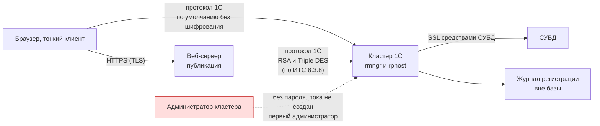

# Политика безопасности и справочник по безопасности 1С

[🗺 Оглавление](README.md)

> Актуализировано: сентябрь 2026. Версии, законы и штрафы сверены 29.09.2026; юридические нормы проверяйте в актуальной редакции на consultant.ru и publication.pravo.gov.ru.

Файл состоит из двух частей. Первая описывает, как сообщить о проблеме в самом репозитории. Вторая — справочник для 1С-разработчика: какие механизмы защиты есть в платформе и БСП, с какой версии они работают и какие советы из старых материалов уже неверны.

- [Как сообщить о проблеме](#-как-сообщить-о-проблеме)
- [Справочник безопасности для 1С-разработчика](#-справочник-безопасности-для-1с-разработчика)
- [Источники](#-источники)

---

## 🚨 Как сообщить о проблеме

Репозиторий — учебный: исполняемого продукта в нём нет, поддерживается только актуальная ветка `main` (исторические коммиты не поддерживаются, используйте последнюю версию). Но «уязвимостью» здесь считается материал, который может привести читателя к небезопасному решению в продуктивной системе.

| Категория | Примеры |
|---|---|
| Опасный совет | Пример кода с обходом прав или RLS, инъекцией в запрос, хранением пароля в открытом виде |
| Ошибочная рекомендация по ИБ | Неверная настройка шифрования, хеширования паролей, прав, профилей безопасности |
| Утечка данных | Реальные логины, ключи, токены, персональные данные, коммерческий код заказчиков в примерах или истории Git |
| Вредоносное содержимое | Ссылка или скрипт, маскирующиеся под легитимный ресурс |

Обычные фактические ошибки (устаревшая версия, битая ссылка) уязвимостью не считаются: для них есть публичные шаблоны Issue (`outdated`, `content_error`, `broken_link`).

### Порядок обращения

1. Откройте вкладку **Security** репозитория: <https://github.com/Kelll31/1C-Roadmap/security>. Если там доступна кнопка **Report a vulnerability** (GitHub Private Vulnerability Reporting), используйте её: отчёт увидит только мейнтейнер. Доступность функции зависит от настроек репозитория, которые выбирает владелец.
2. Если кнопки нет, откройте обычный Issue **без технических деталей**: в заголовке «Вопрос по безопасности», в тексте — только просьба к мейнтейнеру ([@Kelll31](https://github.com/Kelll31)) связаться с вами. Не указывайте файл, строку, пример кода, ключи и персональные данные: Issue публичный. Договоритесь о закрытом канале и передайте детали через него.
3. Не публикуйте проблему в Pull Request, комментариях или соцсетях, пока она не исправлена.

В закрытом сообщении укажите:

```text
Тип:            опасный код / ошибочный совет по ИБ / утечка данных / другое
Где:            файл и раздел (например, 06_FAQ_and_Tips.md, «Подводные камни»)
Что не так:     краткое описание
Чем опасно:     как читатель может пострадать, следуя материалу
Исправление:    предложение (если есть)
Источник:       стандарт its.1c.ru/db/v8std, документация, код БСП
```

### Сроки

Проект ведёт один мейнтейнер без обязательств по SLA. Ориентиры: подтверждение получения — до 72 часов, первичная оценка — до 7 рабочих дней, исправление — 14–30 дней. Раскрытие — после публикации исправления в `main`, по согласованию с автором обращения. Денежных вознаграждений нет; с согласия автора его упоминают в сообщении коммита.

### Что относится не сюда

| Объект | Куда обращаться |
|---|---|
| Уязвимость или ошибка платформы 1С:Предприятие | Каталог ошибок платформы [bugboard.v8.1c.ru](https://bugboard.v8.1c.ru/) (просмотр — по подписке ИТС) и техподдержка 1С через партнёра или ИТС. Адрес `v8.1c.ru/bugtrack` из прежней версии файла подтвердить не удалось |
| Ошибка в БСП или типовой конфигурации | Поддержка 1С через ИТС или партнёра |
| 1C:EDT | Трекер [github.com/1C-Company/1c-edt-issues](https://github.com/1C-Company/1c-edt-issues) (для чувствительных деталей — обращение в поддержку) |
| Vanessa Automation, BSL Language Server и другие сторонние проекты | Их собственные репозитории и политики |

---

## 🧭 Справочник безопасности для 1С-разработчика

Справочник написан по исходному коду БСП 3.2.1, стандартам разработки [its.1c.ru/db/v8std](https://its.1c.ru/db/v8std) и документации ИТС. Рядом с каждым механизмом указана минимальная версия платформы. Официальные ссылки на стандарты имеют вид `its.1c.ru/db/v8std/content/NNN/hdoc`. Темы расписаны шире в [11_Checklists.md](11_Checklists.md) (чек-листы), [09_AI_Development.md](09_AI_Development.md) (ИИ) и [10_Domain_and_Law.md](10_Domain_and_Law.md) (право).

Платформа развивается линиями 8.3.27 и 8.5.1. Все «новинки безопасности», которые приписывали 8.5, появились в 8.3.26–8.3.27.



### Аутентификация и пароли

| Механизм | С версии | Что важно знать |
|---|---|---|
| Второй фактор (`ШаблонНастройкиВторогоФактораАутентификации`) | 8.3.14 | Платформа сама вызывает внешнего провайдера (SMS, push) по HTTP. Встроенного TOTP в найденных источниках нет |
| OpenID Connect | не позже 8.3.14 | Внешний IdP (Keycloak и подобные), настройка в `default.vrd`. Свойство пользователя `АутентификацияOpenIDConnect` — с 8.3.19 |
| Блокировка после неудачных попыток (`БлокировкаАутентификации`) | 8.3.16 | В БСП — «Настройки входа» |
| Политики паролей (`ПолитикиПаролейПользователей`) | 8.3.17 | Длина, сложность, сроки, запрет повторов; имя политики у пользователя — с 8.3.22 |
| JWT (`ТокенДоступа`) | 8.3.21 | Токены доступа для HTTP-интеграций |
| Выбор алгоритма хеширования паролей | 8.3.26 | Таблица ниже |
| Проверка раскрытия пароля | 8.3.26 | Встроенный список, файл или внешний сервис (`ДополнительныеНастройкиАутентификации`) |
| Вход по QR-коду | 8.3.26 | Для решений, опубликованных на веб-сервере; подтверждение в мобильном приложении |
| Время завершения сеанса при бездействии | 8.3.26 | В БСП задаётся в настройках входа |
| Поддержка ЕСИА 3.34 | 8.3.26 | ЕСИА — вход через Госуслуги; это не требование к защите ГИС |
| Вход по одноразовому коду из e-mail | 8.3.27 | Для опубликованных решений |
| Проверка паролей администраторов кластера по списку слабых | 8.5.4 | Заявлено в тестовой версии |

Аутентификация ОС (Kerberos/SSPI) и пароль 1С работают давно. Пароль хранится только в виде хеша.

#### Хеширование паролей

| Алгоритм | Оценка |
|---|---|
| SHA-1 | Значение по умолчанию и единственный вариант до 8.3.26. После теста на копии базы его стоит сменить |
| SHA-256, SHA-512 | Быстрые хеши. OWASP: быстрые алгоритмы вроде SHA-256 для хранения паролей не подходят. Только как промежуточный шаг |
| PBKDF2-HMAC-SHA256 | Рекомендуемый вариант из доступных. OWASP для него называет 600 000 итераций; сколько использует платформа, не проверено |

MD5 в платформе нет. Утверждения вида «база не запустится после перехода на PBKDF2» неверны. Что происходит на самом деле:

- если сменить алгоритм на 8.3.26+ и откатиться на платформу ниже 8.3.26, база открывается, но пользователи с новыми хешами не смогут войти по паролю;
- перед откатом верните SHA-1 и переустановите пароли или оставьте другой способ входа (ОС, OIDC);
- PBKDF2 заметно тяжелее SHA-1 для процессора (по оценке статьи на Инфостарте, порядка 2000 раз): проверьте нагрузку там, где много входов по паролю, например в сервисах с Basic-аутентификацией;
- всё это проверяйте на копии базы.

### Кластер и каналы

- После установки сервера аутентификация администраторов не используется: любой, кто подключился к центральному серверу, получает полные права. Первым делом создайте администраторов центрального сервера и кластера (это разные списки).
- Клиент ↔ кластер и веб-сервер ↔ кластер шифруются собственным протоколом 1С, а не TLS: RSA, затем Triple DES (по документации 8.3.8, для новых версий не сверено). Уровни: «выключено», «только соединение» (пароли не видны), «постоянно» (возможна заметная потеря производительности). **По умолчанию шифрование выключено** (`/seclev 0`, клиентский ключ `/SLev`).
- TLS применяется на участке клиент ↔ веб-сервер (HTTPS-публикация, при необходимости клиентские сертификаты). Канал кластер ↔ СУБД защищает сама СУБД (SSL).
- Служебные файлы кластера должны быть доступны только пользователю `USR1CV8`.
- Профили безопасности кластера — только в лицензии КОРП. Профиль ограничивает для информационной базы файловую систему сервера, COM, внешние компоненты, внешние модули, приложения ОС, интернет-ресурсы и привилегированный режим. В 8.5.4 (тестовая версия) заявлено назначение профиля на весь кластер.
- В программном интерфейсе администрирования профилей безопасности (`АдминистрированиеПрофильБезопасности`) есть свойства `РазрешитьВыполнениеВнешнегоКодаВНебезопасномРежиме` (8.3.14) и `ПолныйПривилегированныйРежим` (8.3.16, разрешает привилегированный режим внутри безопасного).

### Права доступа и RLS

Правила:

- Роли делайте атомарными, назначайте пользователям через профили групп доступа БСП (стандарт #689). В коде проверяйте `ПравоДоступа`, а не `РольДоступна` (#737).
- RLS нужен там, где права зависят от значений в данных: организация, склад, подразделение. Это не «всегда и везде»: ограничения замедляют запросы. Пользователям с неограниченным просмотром условия RLS не задают (#488).
- Привилегированный режим отключает проверку прав и RLS. Допустим для движений документов, служебных регистров и чтения без передачи данных на клиент (#485); включайте точечно.
- Два способа действия ограничения: «все» (при недоступных данных операция падает с ошибкой прав) и «разрешённые» (недоступное считается отсутствующим). В запросах «разрешённые» включает `РАЗРЕШЕННЫЕ`. Объектная техника «разрешённые» не поддерживает.
- `РАЗРЕШЕННЫЕ` нельзя использовать в запросах, влияющих на расчёты и проведение: результат различается у пользователей (#415). Если данных не хватает, прервите операцию с сообщением о нехватке прав.
- Для виртуальных таблиц отбор по ограничиваемым полям накладывайте в том числе в параметрах таблицы, а не только в `ГДЕ`.
- Вызов сервера с клиента не защищён клиентскими проверками (#678): `&НаСервере`-методы форм и экспортные методы общих модулей с «Вызов сервера» можно вызвать в обход интерфейса. Держите бизнес-логику и проверки на сервере, а на клиент отдавайте только итог.

БСП 3.x поддерживает два варианта RLS:

| Вариант | Шаблоны в ролях | Особенности |
|---|---|---|
| Стандартный | `#ПоЗначениям`, `#ПоНаборамЗначений` | Опирается на регистр `НаборыЗначенийДоступа` |
| Производительный (универсальное ограничение) | `#ДляОбъекта`, `#ДляРегистра` | Включается константой `ОграничиватьДоступНаУровнеЗаписейУниверсально`; текст ограничения — в модуле менеджера объекта |

Образец из БСП 3.2.1 (справочник `ПапкиФайлов`, модуль менеджера):

```bsl
Процедура ПриЗаполненииОграниченияДоступа(Ограничение) Экспорт

	Ограничение.Текст =
	"РазрешитьЧтение
	|ГДЕ ЧтениеОбъектаРазрешено(Ссылка)
	|;
	|РазрешитьИзменениеЕслиРазрешеноЧтение
	|ГДЕ ИзменениеОбъектаРазрешено(Ссылка)";

КонецПроцедуры
```

Пустой `Ограничение.Текст` означает «доступ разрешён», пустой `ТекстДляВнешнихПользователей` — «доступ запрещён». Список с ограничением регистрируется в `УправлениеДоступомПереопределяемый.ПриЗаполненииСписковСОграничениемДоступа`. Точная версия БСП, где появился производительный вариант, не проверена (пример в коде указывает на линейку 3.0). В 1С:Элементе RLS тоже есть (ключи доступа). Практика — проект P15 в [07_Projects.md](07_Projects.md).

### Запросы и динамический код

Инъекция возможна везде, где пользовательская строка попадает в **текст** запроса. Язык запросов только читает данные, но этого достаточно: условие обходят, читают лишнее (в том числе через `ОБЪЕДИНИТЬ`), особенно если запрос выполняется в привилегированном режиме, где RLS не действует; тяжёлый запрос даёт отказ в обслуживании.

```bsl
// Серверный код. Плохо: ввод  x" ИЛИ "1" = "1  превращает условие в
// ГДЕ Контрагенты.ИНН = "x" ИЛИ "1" = "1"  и запрос вернёт все записи
Запрос.Текст = "ВЫБРАТЬ Контрагенты.Ссылка ИЗ Справочник.Контрагенты КАК Контрагенты
	|ГДЕ Контрагенты.ИНН = """ + ИНН + """";

// Хорошо: значение передаётся параметром, поля перечислены явно (#729);
// СтрокаПоиска - введённая пользователем строка
Запрос = Новый Запрос;
Запрос.Текст =
"ВЫБРАТЬ ПЕРВЫЕ 100
|	Контрагенты.Ссылка КАК Ссылка,
|	Контрагенты.Наименование КАК Наименование
|ИЗ
|	Справочник.Контрагенты КАК Контрагенты
|ГДЕ
|	Контрагенты.Наименование ПОДОБНО &Шаблон СПЕЦСИМВОЛ ""~""";
// Параметр не экранирует % _ [ ] ^ из пользовательского ввода (#726)
Запрос.УстановитьПараметр("Шаблон",
	"%" + ОбщегоНазначения.СформироватьСтрокуДляПоискаВЗапросе(СтрокаПоиска) + "%");
Результат = Запрос.Выполнить().Выгрузить();
```

- В шаблоне `ПОДОБНО` используйте только литерал или параметр; шаблон из конкатенации внутри текста запроса запрещён (#726). Конкатенация в BSL при формировании **значения** параметра допустима. На PostgreSQL неэкранированные `[` и `]` дают ошибку `invalid regular expression`.
- Тексты запросов и их фрагменты, пришедшие извне, относятся к «внешнему коду» (#669, #678).
- `Выполнить` и `Вычислить` на сервере — только если иначе нельзя, и тогда через обёртки БСП (#770; для клиента #801). Параметры серверных методов не вставляйте в выполняемые строки.

```bsl
Параметры = Новый Структура;
Параметры.Вставить("Значение1", 1);
Параметры.Вставить("Значение2", 10);
// Серверный код. Включает безопасный режим и запрещает опасные методы;
// вызывайте вне транзакции
Результат = ОбщегоНазначения.ВычислитьВБезопасномРежиме(
	"Параметры.Значение1 = Параметры.Значение2", Параметры);
```

- `БезопасныйРежим()` может вернуть **строку** (имя профиля безопасности), поэтому проверяйте `БезопасныйРежим() <> Ложь`, а не `Если БезопасныйРежим() Тогда` (диагностика BSL LS `UnsafeSafeModeMethodCall`).
- При запуске внешних программ отсекайте `$`, `` ` ``, `|`, `;`, `&` и используйте `ФайловаяСистемаКлиент.ОткрытьФайл`, `ОткрытьПроводник`, `ОткрытьНавигационнуюСсылку` (#774).

### Секреты и безопасное хранилище

Не храните пароли и ключи в коде, макетах, константах и реквизитах форм. Лучше всего не хранить их в базе вовсе (в файловой базе файл копируется целиком); если без хранения нельзя, используйте безопасное хранилище БСП (#740).

```bsl
// Серверный код. Привилегированный режим включаем только вокруг вызова,
// а не внутри функций чтения и записи.
Процедура СохранитьТокен(Владелец, Токен)

	УстановитьПривилегированныйРежим(Истина);
	ОбщегоНазначения.ЗаписатьДанныеВБезопасноеХранилище(Владелец, Токен, "ТокенAPI");
	УстановитьПривилегированныйРежим(Ложь);

КонецПроцедуры

Функция ПрочитатьТокен(Владелец)

	УстановитьПривилегированныйРежим(Истина);
	Токен = ОбщегоНазначения.ПрочитатьДанныеИзБезопасногоХранилища(Владелец, "ТокенAPI");
	УстановитьПривилегированныйРежим(Ложь);

	Возврат Токен;

КонецФункции
```

- Владелец — ссылка (справочник, план обмена) или строка до 128 символов. Ключ — идентификатор. Удаление — `УдалитьДанныеИзБезопасногоХранилища(Владелец, Ключи)`.
- Данные лежат в регистре сведений `БезопасноеХранилищеДанных` как сжатое `ХранилищеЗначения` и **не зашифрованы**. Защита обеспечивается правами и привилегированным режимом, из обменов данные исключены. Администратору СУБД они доступны: доступ к серверу СУБД ограничивайте отдельно.
- Пароль не держите в реквизите формы: при маскированном вводе он уходит на клиент открытым текстом. Показывайте `УникальныйИдентификатор`, а значение читайте на сервере перед использованием.
- Ошибки старых советов: «КлючЗначение» — не механизм хранилища; «переменные окружения сервера» для кода конфигурации не подходят (метода чтения в платформе нет, `ПолучитьПеременнуюСреды` — из OneScript). Для скриптов CI на OneScript и vanessa-runner переменные окружения применимы.
- Автопроверки: BSL LS `UsingHardcodeSecretInformation`, EDT v8-code-style `secure-password-storage`.

### Внешние отчёты, обработки, расширения

- Стандарт #669: во «внешний код» входят внешние отчёты и обработки, расширения, внешние компоненты, тексты запросов извне и СКД с внешними функциями. Подключайте его средствами БСП («Дополнительные отчёты и обработки», «Расширения»).
- Интерактивное «Файл → Открыть» для внешних отчётов и обработок отключите всем, включая администраторов (отдельная роль `ИнтерактивноеОткрытиеВнешнихОтчетовИОбработок`, #488).
- В `СведенияОВнешнейОбработке()` параметр `БезопасныйРежим` по умолчанию `Истина`: игнорируется привилегированный режим, запрещены COM, внешние компоненты, запуск приложений, файловая система (кроме временных файлов) и интернет. Недостающее запрашивайте массивом `Разрешения` (`РаботаВБезопасномРежиме.Разрешение…`). Небезопасный режим требует роли «Администратор системы».
- Все внешние ресурсы конфигурации заявляйте в `РаботаВБезопасномРежимеПереопределяемый` (#794).
- Свойство пользователя `ЗащитаОтОпасныхДействий` (8.3.8) включает предупреждения при загрузке внешнего кода. Свойство `РасширениеКонфигурации.БезопасныйРежим` есть с 8.3.6.

### Журнал регистрации и аудит

- Журнал регистрации (формат `.lgd` с 8.3.5) хранится **вне базы**, лежит в каталоге ИБ или кластера и не попадает в выгрузку `.dt`. Копируйте его: `СкопироватьЖурналРегистрации`, `ВыгрузитьЖурналРегистрации`.
- События «Доступ» и «Отказ в доступе» настраиваются через `УстановитьИспользованиеСобытияЖурналаРегистрации`; фиксируют чтение, в том числе из серверного кода. Подсистема БСП «Защита персональных данных» регистрирует доступ к ПДн, помогает со сроками хранения, скрытием и уничтожением.
- Действия администратора кластера пишет технологический журнал (событие `ADMIN`). Это диагностический журнал, а не журнал аудита.
- В 8.5.4 (тестовая версия) заявлена визуализация деталей событий аудита.

### Код и сборка

- BSL Language Server: `UsingHardcodeSecretInformation`, `ExecuteExternalCode`, `ExecuteExternalCodeInCommonModule`, `SetPrivilegedMode`, `PrivilegedModuleMethodCall`, `DisableSafeMode`, `UnsafeSafeModeMethodCall`, `IncorrectUseLikeInQuery`.
- EDT v8-code-style: `secure-password-storage`, `right-interactive-open-external-data-processors`, `right-start-external-connection`. АПК и стандарты v8std — на этапе ревью.
- Эти проверки включайте в CI (см. [11_Checklists.md](11_Checklists.md)).

### ИИ-инструменты и данные

| Что передаём | Рамка |
|---|---|
| Секреты, ключи, токены | Никогда: ни в промпты, ни в `mcp.json`, ни в репозиторий |
| Персональные данные | 152-ФЗ. Передача зарубежному провайдеру — трансграничная (уведомление РКН до начала передачи, ст. 12; вторично). Основная мера — обезличенная копия |
| Код и данные заказчика | NDA и режим коммерческой тайны (98-ФЗ), политика работодателя. «Категорически запрещено» — слишком грубо, «разрешено всё» — тоже |
| Код типовых конфигураций | Условия лицензии 1С в этой проверке не сверялись: согласуйте с политикой работодателя |
| Данные ГИС и ИС госорганов | Прямой запрет: п. 60 Приказа ФСТЭК № 117 |

- 1С:Напарник — облачный сервис: код и контекст уходят на серверы 1С, self-hosted нет. Доступ — токен на code.1c.ai по учётной записи ИТС; условия смотрите там. По пересказу пользовательского соглашения, API предназначен для работы из 1C:EDT; сторонние обёртки используйте на свой риск.
- Главная граница безопасности — права на стороне 1С, а не выбор «локальная или публичная модель». Агенту давайте обезличенную копию и технического пользователя без права записи. Ограничение ставьте правами 1С, а не настройкой агента.
- Стандартный OData 1С не read-only: умеет создавать, изменять и проводить. Докажите запрет негативными тестами POST, PATCH, DELETE.
- MCP — транспорт вызова инструментов, а не граница безопасности. Включайте журналирование и цепочку «dry-run → предпросмотр → подтверждение человеком».
- NDA не отменяет требований 152-ФЗ. ИИ-код допускайте в репозиторий только после ревью, BSL LS и тестов. Подробности — в [09_AI_Development.md](09_AI_Development.md).

### Регуляторика: ФСТЭК № 117 и 152-ФЗ

Данные вторичные, сверяйте с первоисточником (реквизиты опубликованы на publication.pravo.gov.ru).

- **Приказ ФСТЭК № 117 от 11.04.2025** — требования к защите ГИС и иных ИС госорганов, ГУП и госучреждений; действует с 01.03.2026, заменил Приказ № 17. На обычные коммерческие компании не распространяется. Для 1С-подрядчика госзаказчика важны пункты:
  - п. 60: нельзя передавать разработчику модели ИИ информацию ограниченного доступа, в том числе для улучшения модели; п. 61 — меры контроля ответов ИИ-систем;
  - п. 38: критические уязвимости устраняют за 24 часа, высокие — за 7 дней;
  - п. 50: безопасная разработка по ГОСТ Р 56939-2024; п. 58: запрет разработки и тестирования в промышленной среде.
- **8.3z** — защищённая линия платформы. По стандарту #785 для решений госучреждений, оборонных предприятий и корпоративных клиентов минимальная версия платформы не выше версии, на которой основан последний сертифицированный релиз 8.3z (номер публикуется на online.1c.ru). Платформу 8.3z обновили до 8.3.27. Номер и срок сертификата ФСТЭК здесь не приводятся: не подтверждены.
- **152-ФЗ.** С 30.05.2025 (420-ФЗ) за повторную утечку ПДн — оборотный штраф 1–3% выручки, от 20 млн ₽ (от 25 млн ₽ за специальные категории и биометрию) до 500 млн ₽. Уголовная ответственность — ст. 272.1 УК (421-ФЗ). Об инциденте нужно уведомить РКН в течение 24 часов, о результатах расследования — в течение 72 часов. Отсюда практика: **копии баз для разработки и тестов обезличивайте** (ФИО, телефоны, СНИЛС, ИНН, e-mail).
- Действуют также приказы ФСТЭК № 21 (меры защиты ПДн) и № 239 (значимые объекты КИИ).

### Заблуждения из старых материалов

| Утверждение | Как на самом деле |
|---|---|
| «MD5 устарел, взломан» (как опция платформы) | MD5 в платформе нет |
| «Переход на PBKDF2 необратим, база не запустится» | База открывается; при откате ниже 8.3.26 не смогут войти по паролю пользователи с новыми хешами |
| «SHA-256/SHA-512 — приемлемо» | Быстрые хеши; цель — PBKDF2-HMAC-SHA256 |
| «Idle Timeout, QR-вход — новинки 8.5» | 8.3.26; вход по e-mail — 8.3.27. OIDC, 2FA, политики паролей — гораздо раньше |
| «Все соединения кластера — только SSL/TLS» | TLS — на HTTPS и канале к СУБД; клиент ↔ кластер — собственное шифрование, по умолчанию выключено |
| «Безопасное хранилище — КлючЗначение или переменные окружения» | Хранилище БСП в `ОбщегоНазначения`; данные сжаты, не зашифрованы |
| «Всегда применяйте RLS» | Там, где права зависят от данных; с оглядкой на производительность |
| «Нельзя передавать код в ChatGPT/Claude/Gemini» | Зависит от NDA, 152-ФЗ и политики работодателя; для ГИС — запрет п. 60 |
| «Уязвимости платформы — на v8.1c.ru/bugtrack» | Каталог ошибок — bugboard.v8.1c.ru |

### Упражнения

Выполняйте на учебной базе или копии.

1. RLS на БСП: справочник с реквизитом «Организация», `ПриЗаполненииОграниченияДоступа`, проверка под двумя пользователями (динамический список — «разрешённые», `Выбрать()` в коде — «все»).
2. Форма поиска контрагента: показать инъекцию с вводом `x" ИЛИ "1" = "1`, переписать на параметры; затем поиск `ПОДОБНО` по строке `100%` до и после экранирования.
3. Токен внешнего API в безопасном хранилище; пароль на форме не показывать; BSL LS не должен ругаться на `UsingHardcodeSecretInformation`.
4. Внешняя обработка в «Дополнительных отчётах и обработках» с `БезопасныйРежим = Истина`: убедиться, что запись файла вне временного каталога и `Новый COMОбъект` не проходят.
5. Стенд: создать администратора кластера, ИБ с уровнем «только соединение», HTTPS-публикацию; на копии включить PBKDF2-HMAC-SHA256, политику паролей, блокировку и описать откат.
6. Событие «Доступ» для справочника с ИНН и СНИЛС, выгрузка журнала и поиск записи о чтении.
7. Обезличенная копия и технический пользователь без записи: негативный тест OData POST.

Чек-листы для ревью и релиза — в [11_Checklists.md](11_Checklists.md).

---

## 📋 Область действия

Политика относится к файлам репозитория [Kelll31/1C-Roadmap](https://github.com/Kelll31/1C-Roadmap), примерам BSL-кода в них и опубликованным ссылкам. Она не распространяется на сторонние проекты, на которые есть ссылки, и на саму платформу 1С:Предприятие (см. таблицу выше).

## 🔗 Источники

- Стандарты разработки 1С: [its.1c.ru/db/v8std](https://its.1c.ru/db/v8std), в тексте цитируются #415, #485, #488, #669, #678, #689, #726, #729, #737, #740, #770, #774, #785, #794, #801.
- Исходный код БСП 3.2.1 (зеркало): [github.com/1c-syntax/ssl_3_2](https://github.com/1c-syntax/ssl_3_2).
- Документация ИТС для 8.3.8 (RLS, профили безопасности, аутентификация, журнал): [its.1c.ru/db/v838doc/content/78/hdoc](https://its.1c.ru/db/v838doc/content/78/hdoc), [content/59](https://its.1c.ru/db/v838doc/content/59/hdoc), [content/7](https://its.1c.ru/db/v838doc/content/7/hdoc).
- Новое в 8.3.26: [1c-dn.com](https://1c-dn.com/1c_enterprise/new_features_in_version_8_3_26/); в 8.3.27: [1c-dn.com](https://1c-dn.com/news/a_new_version_1c_enterprise_8_3_27_is_available/).
- Откат при смене алгоритма хеширования: [infostart.ru/1c/articles/2480616/](https://infostart.ru/1c/articles/2480616/).
- OWASP Password Storage Cheat Sheet: [github.com/OWASP/CheatSheetSeries](https://github.com/OWASP/CheatSheetSeries/blob/master/cheatsheets/Password_Storage_Cheat_Sheet.md).
- Диагностики: [BSL Language Server](https://github.com/1c-syntax/bsl-language-server), [v8-code-style](https://github.com/1C-Company/v8-code-style).
- Право (вторично): 420-ФЗ — [consultant.ru](https://www.consultant.ru/document/cons_doc_LAW_493063/); Приказ ФСТЭК № 117 — [publication.pravo.gov.ru](https://publication.pravo.gov.ru/document/0001202506170011).
- 8.3z: [infostart.ru](https://infostart.ru/journal/news/mir-1s/firma-1s-obnovila-zashchishchennuyu-platformu-1s-predpriyatie-8-3z-do-versii-8-3-27_2432781/); страница релиза — [online.1c.ru/catalog/files/13352/](http://online.1c.ru/catalog/files/13352/).
- Практика ИИ и 1С: [1c-ai-guide](https://github.com/Aleksandr-Litvinenko/1c-ai-guide), [code.1c.ai](https://code.1c.ai).
- Реестр проверенных утверждений роудмапа: [SOURCES.md](SOURCES.md).

---

[🗺 Оглавление](README.md)
