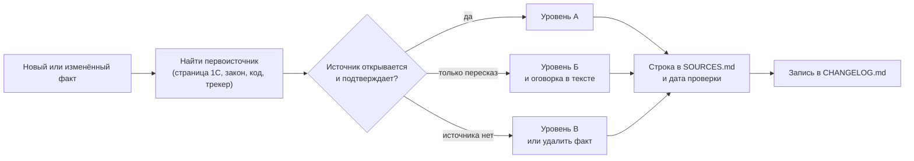

# Реестр источников и проверенных утверждений

[🗺 Оглавление](README.md)

> Актуализировано: сентябрь 2026. Все утверждения реестра сверены 29.09.2026.

Этот файл отвечает на вопрос «откуда это известно». Для ключевых фактов роудмапа (версии, даты, законы, форматы экзаменов, рынок) здесь указаны источник, дата проверки и уровень достоверности. Если факт из роудмапа нельзя найти в реестре, считайте его непроверенным и откройте Issue с меткой `outdated` или `content_error`.

## 🧭 Как читать реестр

| Уровень | Что значит | Как относиться |
|---|---|---|
| А | Первоисточник открыт и прочитан целиком либо факт подтверждён артефактом: исходным кодом, схемой XSD, трекером, README, текстом официальной документации в зеркале | Можно опираться, версии и даты всё равно сверяйте перед важным решением |
| Б | Вторичные источники: новости, пересказы, сниппеты официальных страниц, несколько согласованных блогов. Первоисточник указан, но в ходе проверки не открывался | Писать с оговоркой и ссылкой на официальный раздел |
| В | Оценка авторов роудмапа: рекомендация, инженерный вывод или расчёт по чужим данным | Это мнение, а не факт |

**Ограничения проверки.** При сверке 29.09.2026 сайты 1С (1c.ru, its.1c.ru, v8.1c.ru, online.1c.ru, uc1.1c.ru, releases.1c.ru), Инфостарт, Хабр, hh.ru и российские правовые базы были недоступны для прямого открытия, а лимит веб-поиска исчерпан. Доступными оставались GitHub (код, трекеры, README, релизы), Microsoft Learn и документация Apple и Google. Поэтому:

- официальные страницы 1С чаще всего подтверждены по сниппетам поиска и пересказам, то есть Б, а не А;
- факты о версиях платформы и типовых подтверждены артефактами (перечень рабочих сборок, исходники БСП, трекер EDT), это А;
- законодательство проверено по цитатам норм, номерам публикаций и коду типовых конфигураций, но не по страницам pravo.gov.ru и consultant.ru: уровень не выше Б (исключение — МЧД, подтверждённая схемой XSD);
- поэтому в каждом тексте про закон стоит оговорка «проверяйте актуальную редакцию на consultant.ru и nalog.gov.ru».

Зарплаты и рыночные числа в реестре не повторяются: они приведены только в `13_Career.md`, здесь указаны лишь методика и источник.

## 📌 Платформа 1С:Предприятие

| ID | Утверждение | Источник | Проверено | Ур. |
|---|---|---|---|---|
| PL-01 | Рабочие линии на 29.09.2026: 8.3.27 (последняя найденная сборка 8.3.27.2342, в перечне с 31.08.2026) и 8.5.1 (8.5.1.1529, в перечне с 07.09.2026) | Перечень рабочих сборок releases.1c.ru, который снимает конвейер namespace-forest: [processed-versions.json](https://raw.githubusercontent.com/yellow-hammer/namespace-forest/HEAD/schemas/designer/processed-versions.json), [коммит 1faa668](https://github.com/yellow-hammer/namespace-forest/commit/1faa668) | 29.09.2026 | А |
| PL-02 | Версии 8.3.28 не было: ветка 8.3 закончилась на 8.3.27, задачи 8.3.28 перенесены в линию 8.5 | [1c.ru, новость 32567](https://1c.ru/news/info.jsp?id=32567), [Инфостарт о порядке публикации релизов 8.5](https://infostart.ru/journal/news/mir-1s/firma-1s-menyaet-poryadok-publikatsii-relizov-dlya-platformy-1s-predpriyatie-8-5_2646455/) | 29.09.2026 | Б |
| PL-03 | 8.5 — новая нумерация той же платформы: 8.5.1 включает возможности 8.3.27 и новый интерфейс; финальная 8.5.1 — 25.12.2025 | [1c.ru, новость 32567](https://1c.ru/news/info.jsp?id=32567), [wonderland.v8.1c.ru о финальной 8.5.1](https://wonderland.v8.1c.ru/blog/vypushchena-finalnaya-versiya-platformy-1s-predpriyatie-8-5-1/) | 29.09.2026 | Б |
| PL-04 | 8.5.4 — тестовая версия (с 05.05.2026), рабочей на 29.09.2026 не подтверждена; 8.5.5 — в плане, выход ожидается ближе к 2027 (хедж). Возможности 8.5.4 называем только «заявлено в тестовой версии» | [Инфостарт о тестовой 8.5.4](https://infostart.ru/journal/news/mir-1s/opublikovan-testovyy-reliz-tekhnologicheskoy-platformy-1s-predpriyatie-8-5-4_2683946/), [v8.1c.ru: новое в 8.5.4](https://v8.1c.ru/platforma/news/novoe-v-platforme-8-5-4/), [план задач 8.5.5](https://wonderland.v8.1c.ru/blog/plan-zadach-na-versiyu-8-5-5-platformy-1s-predpriyatie/); отсутствие 8.5.4 в перечне рабочих сборок — PL-01 | 29.09.2026 | Б |
| PL-05 | Даты: 8.3.25 — 22.04.2024; рабочая 8.3.27 — 08.04.2025; 8.3.26 — осень 2024 (точная дата не установлена) | [ct26.ru о 8.3.25](https://www.ct26.ru/novosti/2024/04/22/novaya-versiya-8-3-25-platformy-1s-predpriyatie), [1c-dn.com о 8.3.27](https://1c-dn.com/news/a_new_version_1c_enterprise_8_3_27_is_available/) | 29.09.2026 | Б |
| PL-06 | Новое в интерфейсе 8.5: новый стиль, векторные картинки, тёмная тема, стандартный и компактный масштаб, в веб-клиенте оконная система «В диалоговых окнах»; переходные режимы «Такси. Разрешить Версия 8.5» и «Версия 8.5. Разрешить Такси» | [v8.1c.ru: новый интерфейс 8.5](https://v8.1c.ru/platforma/new-ui-85/), [совместное использование с Такси](https://wonderland.v8.1c.ru/blog/sovmestnoe-ispolzovanie-novogo-interfeysa-i-interfeysa-taksi-v-odnom-prilozhenii/), [ИТС pubnewui85](https://its.1c.ru/db/pubnewui85/content/168/hdoc) | 29.09.2026 | Б |
| PL-07 | Немодальный режим («Режим использования модальности») — с 8.3.3 (это не новинка 8.5); `Асинх` и `Ждать` — с 8.3.18; модальные окна не поддерживаются в веб-клиенте | [ИТС v8nonmodal](https://its.1c.ru/docs/v8nonmodal/), «Руководство разработчика» 8.5.1, §7.9.8, в [зеркале](https://github.com/butbik2025/BSL_8.5.1_dev_docs) | 29.09.2026 | Б |
| PL-08 | Невизуальная доступность и поддержка экранных дикторов (NVDA) — с 8.3.8 (8.3.8.1652), это не новинка 8.5; изменения доступности в 8.5 не проверялись | [Зазеркалье о невизуальной доступности](https://wonderland.v8.1c.ru/blog/nevizualnaya-dostupnost-prikladnykh-resheniy-1s-predpriyatiya/) | 29.09.2026 | Б |
| PL-09 | Второй фактор аутентификации (`ШаблоныНастроекВторогоФактораАутентификации`) — 8.3.14; JWT (`ТокенДоступа`) — 8.3.21 | Синтакс-помощник в копии [comol/1chelp](https://github.com/comol/1chelp/blob/HEAD/objects/Global%20context/properties/SecondAuthenticationFactorSettingsTemplates12079.html), [страница ТокенДоступа](https://github.com/comol/1chelp/blob/HEAD/objects/catalog63/catalog2824/AccessToken.html) | 29.09.2026 | А |
| PL-10 | OpenID Connect — не позже 8.3.14; блокировка аутентификации — 8.3.16; политики паролей — 8.3.17 | [wonderland.v8.1c.ru о развитии аутентификации](https://wonderland.v8.1c.ru/blog/razvitie-mekhanizmov-autentifikatsii/) | 29.09.2026 | Б |
| PL-11 | 8.3.26: выбор алгоритма хеширования паролей (SHA-1 по умолчанию, SHA-256, SHA-512, PBKDF2-HMAC-SHA256) | [1c-dn.com: новое в 8.3.26](https://1c-dn.com/1c_enterprise/new_features_in_version_8_3_26/), [Инфостарт, статья 2480616](https://infostart.ru/1c/articles/2480616/) | 29.09.2026 | Б |
| PL-12 | Откат ниже 8.3.26: база открывается, но пользователи с паролями, захешированными новым алгоритмом, не войдут по паролю; перед откатом вернуть SHA-1 и переустановить пароли. Формулировку «база не запустится» не используем | Те же источники, что PL-11; вывод по досье платформы | 29.09.2026 | Б |
| PL-13 | 8.3.26: проверка раскрытия пароля (встроенный список, файл, внешний сервис); вход по QR-коду; стандарт ЕСИА 3.34 с присоединённой ЭП | [проверка пароля](https://wonderland.v8.1c.ru/blog/mekhanizm-proverki-parolya-po-spisku-skomprometirovannykh-paroley/), [QR-код](https://infostart.ru/journal/news/mir-1s/firma-1s-dobavit-v-1s-predpriyatie-8-3-26-autentifikatsiyu-po-qr-kodu_1976253/), [ЕСИА](https://wonderland.v8.1c.ru/blog/podderzhka-prisoedinennoy-elektronnoy-podpisi-i-podderzhka-novoy-versii-standarta-esia/) | 29.09.2026 | Б |
| PL-14 | 8.3.26: «Время завершения сеанса при бездействии», каталоги данных сервисов кластера; в СВ список и поиск участников больших обсуждений ограничены 3000 | [Инфостарт о завершении сеансов](https://infostart.ru/journal/news/mir-1s/zavershenie-seansov-i-naznachenie-katalogov-dlya-khraneniya-dannykh-servisov-klastera-novoe-dlya-adm_2074368/), [СВ в 8.3.26](https://infostart.ru/journal/news/mir-1s/sistema-vzaimodeystviya-v-8-3-26-bolshe-privatnosti-i-obnovlennaya-integratsiya_2061867/) | 29.09.2026 | Б |
| PL-15 | 8.3.26: уведомления клиента (`УведомленияКлиента.ОтправитьУведомление`, `УведомленияКлиента.ПодключитьОбработчик`); чтение и распаковка архивов GZIP, RAR, 7-ZIP, XZ, TAR; хранение двоичных данных любого размера в базе | [уведомления с сервера](https://wonderland.v8.1c.ru/blog/otpravka-uvedomleniy-s-servera-v-klientskoe-prilozhenie/), [работа с архивами](https://wonderland.v8.1c.ru/blog/novye-vozmozhnosti-programmnoy-raboty-s-arkhivami/); API уведомлений подтверждён кодом БСП 3.1 ([ssl_3_1](https://github.com/1c-syntax/ssl_3_1)) | 29.09.2026 | Б |
| PL-16 | 8.3.27: WebSocket-клиент (объект метаданных), вход по одноразовому коду из электронной почты | [1c-dn.com: обзор 8.3.27](https://1c-dn.com/blog/new-features-in-version-8-3-27-1c-platform-update-review/), [Инфостарт о 8.3.27](https://infostart.ru/journal/news/mir-1s/vyshla-novaya-versiya-tekhnologicheskoy-platformy-1s-predpriyatie-8-3-27_2363428/); форма `ВосстановлениеПаролей` в [ssl_3_2](https://github.com/1c-syntax/ssl_3_2) использует отправку кодов | 29.09.2026 | Б |
| PL-17 | Хранилище двоичных данных — 8.3.23 (анонсировалось для 8.3.22); экспорт и импорт настроек кластера — 8.3.25 | [Инфостарт о хранилище](https://infostart.ru/journal/news/mir-1s/novyy-mekhanizm-khranilishche-dvoichnykh-dannykh-v-1s-predpriyatie-8-3-22_1562699/), [1c-dn.com: новое в 8.3.25](https://1c-dn.com/1c_enterprise/new_features_in_version_8_3_25/) | 29.09.2026 | Б |
| PL-18 | «Фоновое обновление конфигурации БД» — только КОРП, финальная фаза требует монопольного доступа, это не zero-downtime; автопаузы «в часы пик» нет | «Руководство разработчика» 8.5.1, гл. 2.14.3, в [зеркале](https://github.com/butbik2025/BSL_8.5.1_dev_docs) | 29.09.2026 | А |
| PL-19 | Лимиты памяти rphost, балансировка, уровень отказоустойчивости кластера — давние возможности (с 8.3.8), часть только в КОРП; не новинки | [v8.1c.ru об ограничении памяти](https://v8.1c.ru/platforma/ogranichenie-obema-pamyati-rashoduemoy-rabochimi-protsessami/), копия ИТС v838doc ([страница](https://github.com/alex9127git/1c-techsupport-AI-agent/blob/fd5b901ed001db79f208d998398e22c5a5f29c66/out/page_43b9cbac7a72/page.md)) | 29.09.2026 | А |

## 📦 Типовые конфигурации и БСП

| ID | Утверждение | Источник | Проверено | Ур. |
|---|---|---|---|---|
| CF-01 | БСП выходит в двух редакциях, обе обновлены 23–24.09.2026: 3.1.12 (для 8.3.24–8.3.27) и 3.2.1 (только 8.5.1); функционально почти одинаковы | Исходники: [ssl_3_1](https://github.com/1c-syntax/ssl_3_1), [ssl_3_2](https://github.com/1c-syntax/ssl_3_2) | 29.09.2026 | А |
| CF-02 | Большие типовые (БП, ЗУП, УТ, КА, ERP, УХ, ДО) в 2026 году работают на 8.3.27; на 8.5 перешли УНФ и Розница с 3.0.13; официального плана перевода остальных нет | [forus: конфигурации с интерфейсом 8.5](https://partner.forus.ru/about/news/vypushcheny-konfiguratsii-s-podderzhkoy-interfeysa-8-5/); режим совместимости `Version8_3_27` у УТ 11.5.25.105 — в выгрузке, например [GTS-UT-](https://github.com/akuragin23-design/GTS-UT-) | 29.09.2026 | Б |
| CF-03 | УТ 11.5, КА 2.5 и ERP 2.5 — одна кодовая база (синхронные номера сборок) | Сопоставление номеров сборок (УТ 11.5.22.60, КА и ERP 2.5.22.60) во вторичных источниках: [msrv-tech/AI_agent](https://github.com/msrv-tech/AI_agent/blob/main/docs/articles/product_first_publication/article.md) | 29.09.2026 | Б |
| CF-04 | Настройка поведения БСП — общие модули `*Переопределяемый` (78 в БСП 3.2.1) и обработчики `&После` к ним в расширении; «Подписки на события» — объект платформы, а не механизм БСП | Исходники [ssl_3_2](https://github.com/1c-syntax/ssl_3_2) (подсчёт модулей выполнен при проверке по полной выгрузке) | 29.09.2026 | А |
| CF-05 | Аннотации расширений `&Перед`, `&После`, `&Вместо`, `&ИзменениеИКонтроль` (8.3.16+, `#Вставка`/`#Удаление`); `&Вместо` — только когда другие способы не подходят; у методов расширения префикс расширения | [v8-code-style: change-and-validate](https://raw.githubusercontent.com/1C-Company/v8-code-style/master/bundles/com.e1c.v8codestyle.bsl/markdown/ru/change-and-validate-instead-of-around.md), [extension-method-prefix](https://raw.githubusercontent.com/1C-Company/v8-code-style/master/bundles/com.e1c.v8codestyle.bsl/markdown/ru/extension-method-prefix.md), «Руководство разработчика» 8.5.1, §30.4.2.2.4 | 29.09.2026 | А |
| CF-06 | Официальные исправления 1С поставляются как расширения с назначением «Исправление» (имя начинается с `EF`); БСП определяет их в `ОбновлениеКонфигурации.ЭтоИсправление` | Исходники [ssl_3_2](https://github.com/1c-syntax/ssl_3_2) | 29.09.2026 | А |
| CF-07 | Порядок доработки типовой: настройки и функциональные опции, затем дополнительные отчёты и обработки БСП, затем расширение, затем изменение основной конфигурации с сохранением поддержки | Вывод авторов на основе модели MC-6-001 (MK-06) и «Руководства разработчика» | 29.09.2026 | В |

## 🔧 Инструменты 1С и EDT

| ID | Утверждение | Источник | Проверено | Ур. |
|---|---|---|---|---|
| TL-01 | EDT нумеруется ГГГГ.N (год в номере не равен году выхода); стабильная ветка 2026.1 (патч 2026.1.3); 2026.2 — релиз-кандидат (Eclipse 2025-12, Java 25) | [edt.1c.ru: 2026.1 вышла](https://edt.1c.ru/blog/1c-edt-2026-1-vyshla/), [v8.1c.ru: новое в EDT 2026.2](https://v8.1c.ru/platforma/news/novoe-v-1c-edt-2026-2/), трекер [1c-edt-issues](https://github.com/1C-Company/1c-edt-issues) | 29.09.2026 | Б |
| TL-02 | Поддержка проектов 8.5 — с EDT 2025.1; EDT 2026.1 требует 8.5.1.1423+ (сборка существует) | [Инфостарт об EDT 2025.1](https://infostart.ru/journal/news/mir-1s/vyshel-1s-edt-2025-1-rc-s-podderzhkoy-8-5-i-git-lfs_2447759/), [issue 2255](https://github.com/1C-Company/1c-edt-issues/issues/2255) | 29.09.2026 | Б |
| TL-03 | EDT бесплатна после регистрации (edt.1c.ru); для конфигураций уровня ERP нужно 16 ГБ ОЗУ и больше | [требования EDT](https://edt.1c.ru/docs/intro/requirements.php), [скачивание](https://edt.1c.ru/docs/new/download.php), [Инфостарт: EDT бесплатна с 2021.1](https://infostart.ru/journal/news/mir-1s/1c-edt-stanovitsya-polnostyu-besplatnoy-nachinaya-s-reliza-2021-1_1394172/) | 29.09.2026 | Б |
| TL-04 | Командная строка EDT — 1cedtcli; утилита ring для EDT не поддерживается с 2024.1 (ring остаётся для активации программных лицензий) | [EDT 2024.1](https://edt.1c.ru/docs/new/versiya-2024-1/) | 29.09.2026 | Б |
| TL-05 | Конфигуратор жив и развивается; обычные формы правятся только в нём; хранилище конфигурации работает; командная разработка без EDT возможна | [edt.1c.ru/faq](https://edt.1c.ru/faq/), каталог [Landscape1C](https://github.com/Oxotka/Landscape1C) | 29.09.2026 | Б |
| TL-06 | 1С:ГитКонвертер — официальный бесплатный инструмент «хранилище → Git» в формате EDT | [1C-Company/GitConverter](https://github.com/1C-Company/GitConverter) | 29.09.2026 | А |
| TL-07 | 1С:Исполнитель с версии 9.0 переименован в «1С:Предприятие.Элемент Скрипт», распространяется свободно; актуальна линейка 9.x | [Элемент Скрипт](https://1cmycloud.com/console/help/lang/docs/topics/what-is-1c-element-script/), [что нового в 9.0](https://1cmycloud.com/console/help/lang/docs/topics/whats-new-in-9-0/), [v8.1c.ru](https://v8.1c.ru/platforma/1s-ispolnitel-dlya-administratorov/) | 29.09.2026 | Б |
| TL-08 | Учебная версия бесплатна на online.1c.ru после анкеты (учебные 8.5.1 и 8.3.27, только файловый вариант); v8.1c.ru — информационный сайт, не место скачивания | [online.1c.ru](https://online.1c.ru/catalog/free/learning.php), [страница 28765768](https://online.1c.ru/catalog/free/28765768/), [uc1.1c.ru](https://uc1.1c.ru/uchebnaya-versiya-1s/), программы [36179887](https://online.1c.ru/catalog/programs/program/36179887/) и [36179925](https://online.1c.ru/catalog/programs/program/36179925/) | 29.09.2026 | Б |
| TL-09 | Community-лицензия для разработчиков — на developer.1c.ru (срочная); условия соглашения в ходе проверки не читались | [developer.1c.ru: комьюнити](https://developer.1c.ru/applications/Console?state=community) | 29.09.2026 | Б |
| TL-10 | Официального расширения VS Code от 1С нет; есть сообщества: «Language 1C (BSL)» (издатель 1c-syntax) и BSL Language Server | [Marketplace](https://marketplace.visualstudio.com/items?itemName=1c-syntax.language-1c-bsl), [vsc-language-1c-bsl](https://github.com/1c-syntax/vsc-language-1c-bsl) | 29.09.2026 | А |
| TL-11 | 1С:СППР 2.1 работает только на 8.5.1+ | [Инфостарт о СППР 2.1](https://infostart.ru/journal/news/mir-1s/1s-sppr-2-1-novyy-reliz-s-podderzhkoy-interfeysa-8-5_2580312/) | 29.09.2026 | Б |
| TL-12 | 1С:Тестировщик и 1С:Сценарное тестирование — официальные продукты 1С (проекты Tester и STest на releases.1c.ru; Тестировщик в меню v8.1c.ru); версии не называем | [курс УЦ №1 о 1С:Тестировщике](https://uc1.1c.ru/course/znakomstvo-s-1s-testirovschikom/), каталог [Landscape1C](https://github.com/Oxotka/Landscape1C) | 29.09.2026 | Б |
| TL-13 | Стандарты разработки — its.1c.ru/db/v8std; официальный плагин EDT «1C:Code style V8» | [ИТС v8std](https://its.1c.ru/db/v8std), [v8-code-style](https://github.com/1C-Company/v8-code-style), зеркало [zeegin/v8std](https://github.com/zeegin/v8std) | 29.09.2026 | А |

## 🧰 Open source, DevOps и тестирование

Версии и даты сняты с лент релизов GitHub (`releases.atom`), поэтому все строки — уровень А. Версия «на 29.09.2026» не значит «последняя навсегда»: проверяйте страницу релизов.

| ID | Проект и факт | Источник | Проверено | Ур. |
|---|---|---|---|---|
| OS-01 | Vanessa Automation 1.2.043.42 (09.09.2026): BDD и UI-тесты через клиент тестирования; встроенный MCP-сервер с 1.2.043.12 (19.04.2026, [PR 2510](https://github.com/Pr-Mex/vanessa-automation/pull/2510)); отчёты Allure | [Pr-Mex/vanessa-automation](https://github.com/Pr-Mex/vanessa-automation) | 29.09.2026 | А |
| OS-02 | Vanessa ADD — отдельный старый фреймворк (xUnit, BDD, дымовые тесты), релизов с 2023 года нет; в состав Vanessa Automation не входит | [vanessa-opensource/add](https://github.com/vanessa-opensource/add) | 29.09.2026 | А |
| OS-03 | vanessa-runner 3.0.2 (25.09.2026): требует OneScript 2, есть vrunner-mcp. OneScript 2.2.0 (05.09.2026) на .NET 8 | [vanessa-runner](https://github.com/vanessa-opensource/vanessa-runner), [OneScript](https://github.com/EvilBeaver/OneScript) | 29.09.2026 | А |
| OS-04 | BSL Language Server 1.0.7 (в разработке 1.1.0), JDK 21, экспериментальный режим MCP; sonar-bsl-plugin-community 1.20.0 требует SonarQube 25.4+ и Java 21 | [bsl-language-server](https://github.com/1c-syntax/bsl-language-server), [sonar-bsl-plugin-community](https://github.com/1c-syntax/sonar-bsl-plugin-community) | 29.09.2026 | А |
| OS-05 | YAxUnit 25.12 (модульные тесты в EDT); precommit4onec 25.12; jenkins-lib 0.16.2; Coverage41C (замер покрытия) — последний релиз декабрь 2024; onec-docker — Docker-образы для CI (сообщество) | [yaxunit](https://github.com/bia-technologies/yaxunit), [precommit4onec](https://github.com/bia-technologies/precommit4onec), [jenkins-lib](https://github.com/firstBitMarksistskaya/jenkins-lib), [Coverage41C](https://github.com/1c-syntax/Coverage41C), [onec-docker](https://raw.githubusercontent.com/firstBitMarksistskaya/onec-docker/feature/first-bit/README.md) | 29.09.2026 | А |
| OS-06 | gitsync 3.8.0 синхронизирует хранилище конфигурации с Git (каждая версия хранилища — коммит); формат EDT даёт GitConverter (TL-06) | [oscript-library/gitsync](https://github.com/oscript-library/gitsync) | 29.09.2026 | А |
| OS-07 | deployka (oscript-library/deployka) устарел, последний релиз 2021; замена — vanessa-runner | [oscript-library/deployka](https://github.com/oscript-library/deployka) | 29.09.2026 | А |
| OS-08 | В EDT нет встроенной интеграции с Jenkins, GitLab CI и GitHub Actions: CI строят 1cedtcli, ibcmd, vanessa-runner, jenkins-lib | Трекер [1c-edt-issues](https://github.com/1C-Company/1c-edt-issues), [jenkins-lib](https://github.com/firstBitMarksistskaya/jenkins-lib) | 29.09.2026 | Б |
| OS-09 | Официального production-образа Docker для сервера 1С нет; `1C-Company/docker_fresh` — стенд для разработки и тестирования | [docker_fresh README](https://raw.githubusercontent.com/1C-Company/docker_fresh/master/README.md) | 29.09.2026 | А |

## 🤖 ИИ в разработке

| ID | Утверждение | Источник | Проверено | Ур. |
|---|---|---|---|---|
| AI-01 | 1С:Напарник (1C:Workmate) — ИИ-ассистент разработчика в EDT (автодополнение, фоновый анализ, агентный чат, правит код и метаданные); в EDT 2026 входит в поставку, плагин 1.0.8 от 24.09.2026 | Трекер EDT: issues [2359](https://github.com/1C-Company/1c-edt-issues/issues/2359), [2360](https://github.com/1C-Company/1c-edt-issues/issues/2360), [2231](https://github.com/1C-Company/1c-edt-issues/issues/2231); [code.1c.ai/plugin](https://code.1c.ai/plugin/) | 29.09.2026 | А |
| AI-02 | Доступ — токен на code.1c.ai по учётной записи 1С:ИТС (нужна подписка); условия и цены не указываем | [code.1c.ai](https://code.1c.ai), [v8.1c.ru: ИИ](https://v8.1c.ru/platforma/iskusstvennyy-intellekt/), [портал 1С](https://portal.1c.ru/applications/1C-Second-Pilot), [курс УЦ №1](https://uc1.1c.ru/course/znakomstvo-s-1s-naparnik/) | 29.09.2026 | Б |
| AI-03 | Сервис облачный, код уходит на серверы 1С; self-hosted нет; в Конфигураторе Напарника нет | Поиск по трекеру EDT и каталог [Landscape1C](https://github.com/Oxotka/Landscape1C); отсутствие планов подтверждено поиском, не документом | 29.09.2026 | Б |
| AI-04 | Отдельного официального ИИ-ассистента 1С для конечных пользователей не найдено; в типовых есть облачные ИИ-сервисы (распознавание документов, прогнозирование и др.) | Код зеркал типовых (УНФ, УТ, ЗУП), каталог [Landscape1C](https://github.com/Oxotka/Landscape1C) | 29.09.2026 | Б |
| AI-05 | 1c-ai-development-kit (AGPL-3.0) — набор skills для Claude Code (55 в ветке master); не обученные модели, интеграции с Cursor нет | [Arman-Kudaibergenov/1c-ai-development-kit](https://github.com/Arman-Kudaibergenov/1c-ai-development-kit) (клон и история коммитов) | 29.09.2026 | А |
| AI-06 | Реальная экосистема: каталог MCP-серверов Untru/1c-mcp; MCP в Vanessa Automation и экспериментальный MCP в BSL LS; vrunner-mcp; skills и правила сообщества cc-1c-skills и ai_rules_1c | [Untru/1c-mcp](https://github.com/Untru/1c-mcp), [cc-1c-skills](https://github.com/Nikolay-Shirokov/cc-1c-skills), [ai_rules_1c](https://github.com/comol/ai_rules_1c) | 29.09.2026 | А |
| AI-07 | PRISM (прогон 25.09.2026, 57 моделей, 35 задач исполняются в 1С 8.3.27): лучшие модели решают 85–100%, GigaChat и YandexGPT 0–13%, малые локальные 0–27%. Бенчмарк сообщества, не 1С | [genlab-1c/prism](https://github.com/genlab-1c/prism) | 29.09.2026 | А |
| AI-08 | Доступ к Cursor, Claude Code, Codex, Copilot из РФ ограничен (хедж) | Каталог [Landscape1C](https://github.com/Oxotka/Landscape1C) | 29.09.2026 | Б |
| AI-09 | MCP не граница безопасности: доступ ограничивают права пользователя 1С, обезличенная копия базы и read-only учётная запись | Инженерный вывод авторов; разграничение прав — «Руководство разработчика» 8.5.1 | 29.09.2026 | В |

## 🔗 Элемент и интеграции

| ID | Утверждение | Источник | Проверено | Ур. |
|---|---|---|---|---|
| EL-01 | 1С:Предприятие.Элемент — самостоятельная платформа приложений (своя БД, документы, регистры, транзакции, RLS, HTTP- и SOAP-сервисы, планы обмена); актуальна 10.0 (появились расширения); облако 1cmycloud.com или своя установка | [что нового в 10.0](https://1cmycloud.com/console/help/element/10.0/docs/topics/whats-new-in-10-0/), [обзор Элемента](https://1cmycloud.com/console/help/element/docs/topics/1c-element-overview/), [v8.1c.ru](https://v8.1c.ru/platforma/1s-predpriyatie-element/) | 29.09.2026 | Б |
| EL-02 | Язык Элемента (в сообществе xBSL, файлы `.xbsl`) статически типизирован; интерфейс описывается декларативно в YAML, HTML и JS встраиваются через `КонтейнерHtml` | [ИТС pubelementlang](https://its.1c.ru/db/pubelementlang), примеры кода: [keyfire/xbsl](https://github.com/keyfire/xbsl) | 29.09.2026 | Б |
| EL-03 | Спрос на Элемент и мобильную разработку — ниша: по одной вакансии из 452 в выгрузке hh.ru (август–сентябрь 2026) для Элемента и для мобильной разработки на 1С | [compare_competencies](https://github.com/kr1p043k/compare_competencies), расчёт авторов | 29.09.2026 | В |
| EL-04 | Платформа 8 подключается к 1С:Шине через объект «Сервисы интеграции» (8.3.17+, AMQP 1.0); в БСП есть транспорт обмена через 1С:Шину; номер версии Шины не называем | Исходники [ssl_3_2](https://github.com/1c-syntax/ssl_3_2); [ИТС: КД3](https://its.1c.ru/db/metod8dev/content/5846/hdoc) для обмена EnterpriseData | 29.09.2026 | А |
| EL-05 | Kafka и RabbitMQ в платформу 8 не встроены: внешние компоненты Native API, HTTP-шлюз или 1С:Шина | [PinkRabbitMQ](https://github.com/BITERP/PinkRabbitMQ), [Simple-Kafka_Adapter](https://github.com/NuclearAPK/Simple-Kafka_Adapter) | 29.09.2026 | А |
| EL-06 | HTTP-клиент: `HTTPСоединение` (с таймаутом) + `HTTPЗапрос` → `HTTPОтвет`; на клиенте `ВызватьHTTPМетодАсинх`; HTTP-сервис: `HTTPСервисЗапрос` и `HTTPСервисОтвет`. СКД программно: `КомпоновщикНастроекКомпоновкиДанных`, `ПроцессорКомпоновкиДанных` | «Руководство разработчика» 8.5.1 в [зеркале](https://github.com/butbik2025/BSL_8.5.1_dev_docs), [стандарт 748](https://its.1c.ru/db/v8std/content/748/hdoc), код БСП | 29.09.2026 | А |

## 🎓 Сертификация

| ID | Утверждение | Источник | Проверено | Ур. |
|---|---|---|---|---|
| CE-01 | 1С:Профессионал: 14 вопросов, 30 минут, не менее 12 верных ответов; бывает по платформе, конфигурациям, технологическим вопросам, эксплуатации ИС. Сверяйте на 1c.ru/prof/ | Совпадение пяти вторичных источников: [StackTechnologies1C](https://github.com/Oxotka/StackTechnologies1C), [конспект курса УЦ №1](https://github.com/OlSiv/my_notes_leaning); официально: [prof.htm](https://1c.ru/prof/prof.htm), [examred.jsp](https://1c.ru/prof/examred.jsp) (не открывались) | 29.09.2026 | Б |
| CE-02 | 1С:Специалист по платформе: около 4–5 часов; задача решается на выдаваемой каркасной конфигурации; темы — оперативный учёт, бухгалтерский учёт, сложные периодические расчёты, бизнес-процессы, разработка формы. Сдача в EDT и дистанционно не подтверждена | [StackTechnologies1C](https://github.com/Oxotka/StackTechnologies1C), [регламент 1c.ru/spec](https://1c.ru/spec/texts/ekz_1c_spec.htm) (не открывался); XML каркасной конфигурации читался | 29.09.2026 | Б |
| CE-03 | Четыре трека: разработчик (Профессионал по платформе → Специалист по платформе); аналитик (Профессионал по конфигурации → Специалист-консультант); эксперт (Профессионал по ТВ → Эксперт по ТВ); эксплуатация (Профессионал по эксплуатации ИС → 1С:Эксплуататор). Пререквизит Эксперта — не Специалист | [StackTechnologies1C](https://github.com/Oxotka/StackTechnologies1C), [перечень экзаменов УЦ №1](https://uc1.1c.ru/ekzameny-1s/), [курс подготовки к Эксперту](https://uc1.1c.ru/course/podgotovka-k-1s-ekspertu-po-tehnologicheskim-voprosam-osnovnoj-kurs/) | 29.09.2026 | Б |
| CE-04 | 1С:Эксплуататор: практика — не менее 3 из 5 задач; теория — 14 из 20 письменных и 3 из 3 устных вопросов (один источник, хедж). Специалист-консультант: практические задачи по внедрению и сопровождению типового решения, около 3–5 часов | [uc1.1c.ru: Эксплуататор](https://uc1.1c.ru/ekzameny-1s/expluatator/), [спец-консультант](https://uc1.1c.ru/ekzameny-1s/spec-konsultant/) через README StackTechnologies1C | 29.09.2026 | Б |
| CE-05 | 1С:НИК — мобильный тренажёр УЦ №1 (вход по учётной записи УЦ, платный); не «официальная база ответов»; ссылок на сторы не даём | [uc1.1c.ru/mobile](https://uc1.1c.ru/mobile/) | 29.09.2026 | Б |
| CE-06 | «Паспорт квалификации 1С» — публичная ссылка из личного кабинета УЦ №1, её размещают в резюме; ЦСО — центр сертифицированного обучения (курсы), не экзаменационный центр | Примеры в профилях разработчиков, например [johnnyshut.github.io](https://github.com/johnnyshut/johnnyshut.github.io) | 29.09.2026 | Б |
| CE-07 | «1С:Руководитель проекта» после 2016 года в перечнях не встречается; цены экзаменов и квоты партнёрских статусов не называем | [перечень экзаменов УЦ №1](https://uc1.1c.ru/ekzameny-1s/), каталог [StackTechnologies1C](https://github.com/Oxotka/StackTechnologies1C) | 29.09.2026 | Б |

## 📝 Законодательство

Все строки, кроме LW-10, — не выше Б: первоисточники указаны, но страницы pravo.gov.ru, consultant.ru и nalog.gov.ru в ходе проверки не открывались. Перед публикацией и перед применением проверяйте актуальную редакцию.

| ID | Утверждение | Источник | Проверено | Ур. |
|---|---|---|---|---|
| LW-01 | НДС 22% с 01.01.2026 (Федеральный закон № 425-ФЗ от 28.11.2025); ставки 10% и 0% сохранены | [nalog.gov.ru/new2026](https://www.nalog.gov.ru/new2026/); в коде УНФ значение ставки 22% есть ([UNF_BSL_EDT](https://github.com/Iglatypov/UNF_BSL_EDT)) | 29.09.2026 | Б |
| LW-02 | Порог освобождения от НДС на УСН: 20 млн ₽ по доходам за 2025–2028 годы, 15 млн ₽ — за 2029, 10 млн ₽ — за 2030 (№ 228-ФЗ от 04.07.2026); график 425-ФЗ 20→15→10 в 2026–2028 отменён. Годы в законе — годы дохода | [публикация 228-ФЗ](http://publication.pravo.gov.ru/document/0001202607040017), [УФНС о пороге](https://www.nalog.gov.ru/rn50/news/activities_fts/16635909/); дословная цитата нормы и шесть согласованных источников | 29.09.2026 | Б |
| LW-03 | Упрощенцы сверх порога остаются на УСН и платят НДС 5%/7% без вычетов или 22% с вычетами; лимит доходов УСН на 2026 год — 490,5 млн ₽; «массовый переход на ОСНО» неверен | [разъяснения ФНС по НДС на УСН](https://www.nalog.gov.ru/rn77/taxation/taxes/nds_usn/) | 29.09.2026 | Б |
| LW-04 | ЭПД (электронные перевозочные документы) обязательны с 01.09.2026 (140-ФЗ от 07.06.2025); в УНФ и УТ есть обработка `ЭлектронныеПеревозочныеДокументы` | Код типовых: [UNF_BSL_EDT](https://github.com/Iglatypov/UNF_BSL_EDT), [GTS-UT-](https://github.com/akuragin23-design/GTS-UT-); сама дата — вторичные источники | 29.09.2026 | Б |
| LW-05 | Маркировка: тема 2026 года — ТС ПИоТ и разрешительный режим на кассе; протокол с токеном X-API-KEY работает до 01.10.2026; с 01.07.2026 «Честный ЗНАК» фиксирует отклонения | Разъяснение «Честного знака» от 10.09.2026 (раздел «Общие вопросы ГИС» на markirovka.ru, не открывалось); документация ККТ-обработки и ПО FMU-API | 29.09.2026 | Б |
| LW-06 | Радиоэлектроника — реальная товарная группа в коде 1С; обязательная маркировка с 01.05.2026 (ПП № 1954 от 28.11.2025) — хедж, один фактчек | [kontur.ru о маркировке радиоэлектроники](https://kontur.ru/markirovka/spravka/53675-markirovka_radioelektronnoy_produkcii); перечисления `ВидыПродукцииИС` в [GTS-UT-](https://github.com/akuragin23-design/GTS-UT-) | 29.09.2026 | Б |
| LW-07 | Цифровой рубль: с 01.09.2026 первый этап — крупнейшие банки и торговцы с выручкой более 120 млн ₽; порог третьего этапа (01.09.2028) не установлен, не называем | [248-ФЗ в КонсультантПлюс](https://www.consultant.ru/law/hotdocs/90109.html) | 29.09.2026 | Б |
| LW-08 | ФСБУ 9/2025 «Доходы» (приказ Минфина № 56н) и ФСБУ 10/2026 «Расходы» (приказ № 53н от 24.04.2026) обязательны с отчётности 2027 года | [ФСБУ 9/2025](https://www.consultant.ru/document/cons_doc_LAW_511967/), [«РГ», № 56н](https://rg.ru/documents/2025/08/11/minfin-prikaz56-site-dok.html), [Минфин, № 53н](https://minfin.gov.ru/ru/document/?id_4=316957-prikaz_minfina_rossii_ot_24.04.2026__53n_federalnyi_standart_bukhgalterskogo_ucheta_fsbu_102026_raskhody), [«РГ», № 53н](https://rg.ru/documents/2026/07/03/minfin-prikaz53-site-dok.html) | 29.09.2026 | Б |
| LW-09 | ФСБУ 5/2019: оценка запасов при выбытии — по себестоимости каждой единицы, по средней себестоимости, ФИФО; ЛИФО не было уже в ПБУ 5/01 | Учебные и методические источники в досье по законодательству (первоисточник не открывался) | 29.09.2026 | Б |
| LW-10 | МЧД: в XSD единого формата поля «Должность» и ИНН физлица необязательны (`use="optional"`) | [XSD ФНС ON_EMCHD_1](https://github.com/3036662/pdf_scp/blob/5316912352ab2dd21bb335719ad10375470a4e06/test_files/mrpa/valid/ON_EMCHD_1_928_00_01_01_01.xsd) | 29.09.2026 | А |
| LW-11 | 152-ФЗ: оборотные штрафы по 420-ФЗ — от 20 млн ₽ за повторную утечку и от 25 млн ₽ за спецкатегории и биометрию, до 500 млн ₽ | [420-ФЗ, публикация](http://publication.pravo.gov.ru/document/0001202411300011), [КонсультантПлюс](https://www.consultant.ru/document/cons_doc_LAW_493063/) | 29.09.2026 | Б |
| LW-12 | Приказ ФСТЭК № 117 (11.04.2025) действует с 01.03.2026, заменил № 17; касается ГИС и ИС госорганов; п. 60 запрещает передавать разработчику модели ИИ информацию ограниченного доступа | [публикация](https://publication.pravo.gov.ru/document/0001202506170011), [cntd.ru](https://docs.cntd.ru/document/1313142310) | 29.09.2026 | Б |
| LW-13 | ЕФС-1 утверждена приказом СФР № 1462 от 17.11.2025 (действует с 30.12.2025) | [публикация](http://publication.pravo.gov.ru/document/0001202512190019) | 29.09.2026 | Б |
| LW-14 | Страховые взносы IT-компаний с 2026 года: 15% в пределах базы и 7,6% сверх; предельная база — 2 979 000 ₽; пониженный тариф МСП — по перечню ОКВЭД распоряжения № 4125-р | [распоряжение 4125-р](https://www.consultant.ru/law/hotdocs/92298.html); релиз-ноты «БУХта» № 293 | 29.09.2026 | Б |
| LW-15 | «Госключ» — подписи физлиц; КЭП юрлиц и ИП выпускает УЦ ФНС | Пересказ новостей ФНС ([news-registry](https://github.com/elena70semen/dokumenty82-site/blob/16bf14b85bfc1543988ed59cf73c2b860db712fb/internal/news-registry.mjs)); первоисточник не открывался | 29.09.2026 | Б |

## 📈 Рынок труда

| ID | Утверждение | Источник | Проверено | Ур. |
|---|---|---|---|---|
| MK-01 | Данные о зарплатах и спросе: выгрузка API hh.ru за 10.08–07.09.2026 (452 вакансии «1С» без дублей, зарплата указана у 154), пересчёт «на руки» ×0,87. Выгрузка неполная из-за постраничного лимита. Числа — только в `13_Career.md` | [kr1p043k/compare_competencies](https://github.com/kr1p043k/compare_competencies) (сбор третьими лицами), расчёт авторов | 29.09.2026 | В |
| MK-02 | Удалённый формат разрешают около половины вакансий 1С; вакансий «без опыта» 5–7%; гибридные роли («программист-консультант») есть | Та же выгрузка, расчёт авторов | 29.09.2026 | В |
| MK-03 | По упоминаниям конфигураций лидирует ERP; среди вакансий разработчиков УТ, ERP, ЗУП, БП, ДО почти вровень; методика: «1С» в названии, конфигурация в названии и навыках | Выгрузка hh.ru 2026 (MK-01), [hh.ru 2025](https://raw.githubusercontent.com/belyakova-anna/Statistics-of-requirements-in-IT-vacancies/HEAD/docs/data/vacancies.csv) и [Хабр Карьера, май 2026](https://raw.githubusercontent.com/dariapotapova/DWaV_Assignment_Extra/HEAD/data/clean/habr_clean.csv); расчёт авторов | 29.09.2026 | В |
| MK-04 | Рынок ИТ 2025–2026 — рынок работодателя (hh-индекс ИТ 16,1 в III квартале 2025, вторично) | [SENSE IT](https://sense-it.ru/mediacenter/zarplaty-it-spetsialistov-v-rf-osnovnye-trendy-iii-kvartala-2025-goda) в пересказе из вспомогательной сверки фактов | 29.09.2026 | Б |
| MK-05 | Сроки грейдов («Junior 0–6 мес.») не подтверждены; официальная модель определяет уровни компетенциями без сроков. Ориентир «6–9 месяцев до Этапа 4 при 15–20 ч/нед» — оценка авторов | См. MK-06; сроки — `02_Timeline.md` | 29.09.2026 | В |
| MK-06 | Официальная «Модель профессиональных компетенций Разработчика» фирмы 1С (MC-6-001, 2025): три уровня Junior, Middle, Senior, 59 строк, без сроков | xlsx в [Landscape1C](https://github.com/Oxotka/Landscape1C) (docs/competencies/sources), разобран целиком | 29.09.2026 | А |
| MK-07 | Опрос Landscape1C 2026 (313 респондентов на 25.09.2026, самоотбор): 1С:Тестировщиком пользуются 13 человек (4,2%), 1С:Элементом 7,3% | [Landscape1C](https://github.com/Oxotka/Landscape1C) | 29.09.2026 | Б |

## 🧱 Инфраструктура и СУБД

| ID | Утверждение | Источник | Проверено | Ур. |
|---|---|---|---|---|
| IN-01 | PostgreSQL — только в сборках для 1С; официальный стенд 1С с 8.5.1.1302 использует PostgreSQL 18.3-5.1C | [docker_fresh](https://github.com/1C-Company/docker_fresh), [components_config.py](https://github.com/1C-Company/docker_fresh/blob/master/components_config.py) | 29.09.2026 | А |
| IN-02 | Сборки для 1С: Postgres Pro, ALT (`postgresql18-1C` 18.4-alt5, метапакет `1c-preinstall`), managed-сервисы «-1c» (Yandex Cloud) | [spec ALT](https://github.com/altlinux/specs/blob/717002259c0fefaca66b844976795c59da27d9b3/p/postgresql18-1C/postgresql.spec), [1c-preinstall](https://github.com/altlinux/specs/blob/HEAD/1/1c-preinstall/1c-preinstall.spec), [Yandex Cloud](https://github.com/yandex-cloud/docs/blob/master/md-docs/managed-postgresql/tutorials/1c-postgresql.md) | 29.09.2026 | А |
| IN-03 | SQL Server 2016 снят с поддержки Microsoft 14.07.2026; Oracle и IBM Db2 формально поддерживаются в 8.5.1 (ниша) | [Microsoft Learn](https://learn.microsoft.com/sql/sql-server/end-of-support/sql-server-end-of-support-overview), «Руководство разработчика» 8.5.1, Приложение 8, в [зеркале](https://github.com/butbik2025/BSL_8.5.1_dev_docs) | 29.09.2026 | А |
| IN-04 | Серверные лицензии КОРП, ПРОФ, МИНИ; только в КОРП: фоновое обновление БД, события аудита прав доступа, механизм копий БД и др.; «ПРОФ = 12 ядер» не утверждаем | «Руководство разработчика» 8.5.1 в [зеркале](https://github.com/butbik2025/BSL_8.5.1_dev_docs); ИТС [metod8dev 6041](https://its.1c.ru/db/metod8dev/content/6041/hdoc) не читалась | 29.09.2026 | А |
| IN-05 | Шифрование клиент ↔ кластер — собственный протокол (RSA и Triple DES) по уровню безопасности, по умолчанию выключено (`/seclev 0`); TLS — в HTTPS-публикации и на канале к СУБД; сведения из ИТС для 8.3.8, для 8.5 сверяйте | [ИТС v838doc, раздел 80](https://its.1c.ru/db/v838doc/content/80/hdoc) (копия) | 29.09.2026 | А |
| IN-06 | Особенности Linux по ИТС: регистр имён файлов важен, нет UNC-путей, COM и OLE недоступны (внешние компоненты — Native API), нужны шрифты; использовать `ПолучитьРазделительПути()` | ИТС v838doc, раздел о Linux (копия, не открывалась онлайн) | 29.09.2026 | А |
| IN-07 | Экспорт настроек кластера (8.3.25) — не полноценный IaC; IaC строят на Ansible или Terraform вместе с rac, ras, ibcmd | Вывод авторов; PL-17 | 29.09.2026 | В |

## 📱 Мобильная платформа

| ID | Утверждение | Источник | Проверено | Ур. |
|---|---|---|---|---|
| MB-01 | Мобильное приложение = мобильная платформа (среда исполнения) + конфигурация, упакованные сборщиком в .apk/.ipa; в нативный код не компилируется; часть объектов не поддерживается (нет RLS, регламентных заданий, бухгалтерских и расчётных механизмов) | «Руководство разработчика» 8.5.1 в [зеркале](https://github.com/butbik2025/BSL_8.5.1_dev_docs); копия ИТС v838doc, раздел 28 ([страница](https://github.com/alex9127git/1c-techsupport-AI-agent/blob/fd5b901ed001db79f208d998398e22c5a5f29c66/out/page_b25e5dd01b82/page.md)) | 29.09.2026 | А |
| MB-02 | Встроенные покупки — с 8.3.8 (Apple, Google), Huawei — 8.3.24, нативного RuStore Billing нет; реклама — AdMob; iAd закрыт Apple 30.06.2016 | [Apple: закрытие iAd](https://developer.apple.com/news/?id=01152016a); синтакс-помощник | 29.09.2026 | А |
| MB-03 | Требования магазинов 2026: Google Play — API 36 с 31.08.2026; App Store — Xcode 26 с 28.04.2026 и iOS 13+ с 09.09.2026; проверка разработчиков Android в 2027 году распространится на весь мир | [Google Play](https://developer.android.com/google/play/requirements/target-sdk), [Apple](https://developer.apple.com/news/upcoming-requirements/), [Android developer verification](https://developer.android.com/developer-verification) | 29.09.2026 | А |
| MB-04 | ОС «Аврора» заявлена в тестовой 8.5.4; спрос на мобильную разработку — ниша, B2B/B2E | [v8.1c.ru: новое в 8.5.4](https://v8.1c.ru/platforma/news/novoe-v-platforme-8-5-4/); спрос — EL-03 | 29.09.2026 | Б |

## 🔐 Безопасность и стандарты разработки

| ID | Утверждение | Источник | Проверено | Ур. |
|---|---|---|---|---|
| SC-01 | Безопасное хранилище БСП: `ОбщегоНазначения.ЗаписатьДанныеВБезопасноеХранилище`, `ПрочитатьДанныеИзБезопасногоХранилища`, `УдалитьДанныеИзБезопасногоХранилища`; вызывать в привилегированном режиме; данные сжаты, но не зашифрованы | [модуль ОбщегоНазначения](https://raw.githubusercontent.com/1c-syntax/ssl_3_2/master/src/cf/CommonModules/ОбщегоНазначения/Ext/Module.bsl), [стандарт 740](https://its.1c.ru/db/v8std/content/740/hdoc) | 29.09.2026 | А |
| SC-02 | Для паролей рекомендуем только PBKDF2-HMAC-SHA256; SHA-256 и SHA-512 — быстрые хеши, для паролей не подходят; MD5 в платформе нет | [OWASP Password Storage Cheat Sheet](https://github.com/OWASP/CheatSheetSeries/blob/master/cheatsheets/Password_Storage_Cheat_Sheet.md), PL-11 | 29.09.2026 | А |
| SC-03 | Уязвимости платформы и ошибки сообщают на bugboard.v8.1c.ru (не на v8.1c.ru/bugtrack) | [bugboard.v8.1c.ru](https://bugboard.v8.1c.ru/) | 29.09.2026 | Б |
| SC-04 | Стандарты разработки, на которые ссылается роудмап (номера и темы сверены с зеркалом): [415](https://its.1c.ru/db/v8std/content/415/hdoc) `РАЗРЕШЕННЫЕ`, [488](https://its.1c.ru/db/v8std/content/488/hdoc) стандартные роли, [630](https://its.1c.ru/db/v8std/content/630/hdoc) модули форм, [642](https://its.1c.ru/db/v8std/content/642/hdoc) длительные операции (более 8 с), [657](https://its.1c.ru/db/v8std/content/657/hdoc) виртуальные таблицы, [661](https://its.1c.ru/db/v8std/content/661/hdoc) блокирующее чтение остатков, [726](https://its.1c.ru/db/v8std/content/726/hdoc) `ПОДОБНО`, [729](https://its.1c.ru/db/v8std/content/729/hdoc) оптимальные запросы, [740](https://its.1c.ru/db/v8std/content/740/hdoc) пароли, [748](https://its.1c.ru/db/v8std/content/748/hdoc) таймауты, [783](https://its.1c.ru/db/v8std/content/783/hdoc) транзакции, [785](https://its.1c.ru/db/v8std/content/785/hdoc) версия платформы | Зеркало [zeegin/v8std](https://github.com/zeegin/v8std); канонический адрес вида `its.1c.ru/db/v8std/content/NNN/hdoc` | 29.09.2026 | А |
| SC-05 | RLS нужен, когда права зависят от данных; привилегированный режим отключает RLS; `РАЗРЕШЕННЫЕ` нельзя в запросах для расчётов и проведения; параметры не экранируют спецсимволы `ПОДОБНО`; `ВЫБРАТЬ *` противоречит стандарту | Стандарты 415, 488, 726, 729 (SC-04), исходники [ssl_3_2](https://github.com/1c-syntax/ssl_3_2) | 29.09.2026 | А |

## 📚 Ресурсы и сообщество

| ID | Утверждение | Источник | Проверено | Ур. |
|---|---|---|---|---|
| RS-01 | Книги: Радченко «1С:Программирование для начинающих…» (2-е изд.; [ИТС](https://its.1c.ru/db/pubprogforbeginners)); Радченко и Хрусталева «Практическое пособие разработчика. Примеры и типовые приемы» (3-е изд., 2023; [ИТС](https://its.1c.ru/db/pubdevguide83)) и «Используем 1C:EDT» (изд. 2, 2026; [ИТС](https://its.1c.ru/db/pubdevguideedt)); Хрусталева по СКД (2-е изд.; [ИТС](https://its.1c.ru/db/pubcomplexreports)); Филиппов «Настольная книга 1С:Эксперта по технологическим вопросам» (2-е изд.; [online.1c.ru](https://online.1c.ru/books/book/20752408/)) | Выгрузки ЛитРес, страницы ИТС и online.1c.ru через `learning_resources` | 29.09.2026 | Б |
| RS-02 | Telegram: @e1c_community (официальный чат, около 11 тыс. на 05.2025), @yellowclub_official («Жёлтый клуб»), @esres_1c — канал вакансий; хэндл @yellowclub неверный | [реестр SeiOkami/links-one-s](https://github.com/SeiOkami/links-one-s) (данные на 05.2025) | 29.09.2026 | Б |
| RS-03 | Форум Мисты — [mista.ru](https://mista.ru/), не forum.mista.ru; англоязычная документация — kb.1ci.com, новости — 1c-dn.com; постер УЦ №1 для разработчиков — [poster-prog](https://uc1.1c.ru/poster/poster-prog/) (адрес shema-izucheniya-1s не подтверждён) | каталог [StackTechnologies1C](https://github.com/Oxotka/StackTechnologies1C), страницы УЦ №1, ссылки в `05_Resources.md` | 29.09.2026 | Б |
| RS-04 | Конференции 2026: Infostart Tech Event — 8–10.10.2026, Санкт-Петербург; A&PM — 12–14.11; Бизнес-форум ERP — 26.11 | Календарь [OnEvents](https://github.com/bestuzheff/OnEvents) | 29.09.2026 | Б |
| RS-05 | Большая часть ИТС доступна по платной подписке | ИТС (its.1c.ru) | 29.09.2026 | Б |

## ❌ Удалено при актуализации 2026-09

Утверждения ниже были в прежней редакции репозитория или в его черновиках и признаны неверными, выдуманными или недоказанными. Не возвращайте их без нового источника уровня А.

### Выдуманные или несуществующие объекты

| Что было | Почему удалено | Как теперь |
|---|---|---|
| Инструменты `1cca` и `bsp-tools` | На GitHub не существуют (oscript-library/1cca отдаёт 404, поиск пуст) | Реальные: vanessa-runner, YAxUnit, Vanessa Automation, gitsync, precommit4onec, BSL LS и sonar-плагин, jenkins-lib, onec-docker |
| `spremotely-vanessa-app-mcp` как GitHub-проект; команды MCP `create_feature`, `parse_feature`, `generate_steps` | Это слаг каталога LobeHub; у github.com/spremotely такого репозитория нет; команды нигде не найдены | MCP встроен в Vanessa Automation с 1.2.043.12 (OS-01) |
| «Оркестрация через MiniMax M2» | В 1c-ai-development-kit слово MiniMax не встречается | Kit — набор skills для Claude Code (AI-05) |
| `silverbulleters/deployka` | Адрес даёт 404; настоящий проект — oscript-library/deployka, он устарел | vanessa-runner (OS-07) |
| Синтаксис шага Vanessa Automation `&Шаг("...")` | Не подтверждён | Шаги регистрируются через `ПолучитьСписокТестов` и `Ванесса.ДобавитьШагВМассивТестов` |
| `КомпоновщикНастроекDCS` | Типа нет (0 совпадений) | `КомпоновщикНастроекКомпоновкиДанных`, `КомпоновщикМакетаКомпоновкиДанных`, `ПроцессорКомпоновкиДанных` (EL-06) |
| `ОбъектHTTPЗапроса` | Типа нет (0 совпадений) | `HTTPСоединение`, `HTTPЗапрос`, `HTTPОтвет` (EL-06) |
| Поле `Остаток` у виртуальной таблицы остатков | Поля нет | `КоличествоОстаток` |
| `ПолучитьПеременнуюСреды` и «переменные окружения сервера» как хранилище паролей | В платформе такого метода нет (это OneScript) | Безопасное хранилище БСП (SC-01) |
| Ссылки на «1С:НИК» в App Store и Google Play | Не подтверждены | Только [uc1.1c.ru/mobile](https://uc1.1c.ru/mobile/) (CE-05) |
| `1s-element.ru`, адрес курса УЦ №1 по Элементу | Нигде не подтверждены | Документация и облако Элемента (EL-01) |
| «iAd» как рекламная интеграция мобильной платформы | Apple закрыла iAd 30.06.2016 | AdMob (MB-02) |

### Неверные версии и описания платформы

| Что было | Почему удалено | Как теперь |
|---|---|---|
| Хеширование паролей, проверка раскрытия пароля, QR, «время завершения сеанса при бездействии», ЕСИА 3.34, уведомления клиента, архивы как возможности «платформы 8.5» | Всё появилось в 8.3.26; WebSocket-клиент и вход по коду из почты — в 8.3.27 | PL-11, PL-13–PL-16 |
| Немодальный режим, NVDA, OpenID Connect как новинки 8.5 | Немодальный режим — с 8.3.3, NVDA — 8.3.8, OIDC — не позже 8.3.14 | PL-07, PL-08, PL-10 |
| «Платформа 8.5» как отдельный продукт; версия 8.3.28 | 8.5 — новая нумерация той же платформы; 8.3.28 не выходила | PL-02, PL-03 |
| «Новое в 8.5.4»: реструктуризация без прерывания работы, просмотр DOCX/XLSX в клиенте, запись видеозвонков | Пересказы партнёров, первоисточника нет; текстовая расшифровка звонков относится к плану 8.5.5 | PL-04 |
| «После PBKDF2 / ниже 8.3.26 база не запустится» | Преувеличение: не смогут войти по паролю пользователи с новыми хешами | PL-12 |
| MD5 как вариант хеширования; SHA-256 и SHA-512 как «приемлемо, высокая стойкость» | MD5 в платформе нет; быстрые хеши не подходят для паролей по OWASP | SC-02 |
| «В СВ число участников расширено до 3000» | В 8.3.26 список и поиск участников больших обсуждений ограничены 3000 | PL-14 |
| «SSL по умолчанию для всех протоколов», «все соединения кластера только через TLS» | Клиент ↔ кластер шифруется собственным протоколом, по умолчанию выключено | IN-05 |
| «Фоновая реструктуризация без простоя», автопауза «в часы пик», «разрыв соединений на лету», лимиты rphost и балансировка как новинки | Фоновое обновление — давняя возможность КОРП без zero-downtime; остальное с 8.3.8 или без источника | PL-18, PL-19 |
| «Client Notifications API» | Неофициальное название | `УведомленияКлиента` (PL-15) |
| 8.3.27.2074 как последняя сборка | Устарело | PL-01 |
| «Типовые работают на 8.5» без уточнения | На 8.5 перешли УНФ и Розница с 3.0.13 | CF-02 |
| «Исключительно расширения»; переопределение БСП «через подписки на события»; «ядро обновляется автоматически за минуты» | Порядок доработки шире; переопределение — через `*Переопределяемый`; обновление идёт часами | CF-04, CF-07 |
| Серверный экспортный метод формы, возврат `ТаблицаЗначений` на тонкий клиент, параметр без `Знач`, `ГДЕ` по виртуальной таблице остатков, `&Вместо` вместо `&Перед`, собственный метод в `&Вместо` без префикса, Idle Timeout как причина выносить операции в фон | Нарушают стандарты 630, 657, 642 и v8-code-style | SC-04, CF-05 |
| «Фоновое задание нужно из-за Idle Timeout» | Причина — стандарт 642: операции дольше 8 с | SC-04 |
| «Пишите все пути строчными» (Linux) | Не решение: важен регистр, нужен `ПолучитьРазделительПути()` | IN-06 |
| «Абсолютная отказоустойчивость» | Маркетинг; есть уровень отказоустойчивости кластера и не менее двух центральных серверов | IN-04 |
| «ПРОФ = 12 ядер» | Только во вторичных источниках | Не утверждаем (IN-04) |

### Инструменты, ИИ и Элемент

| Что было | Почему удалено | Как теперь |
|---|---|---|
| Напарник как ассистент конечных пользователей; «отчёты и поиск документов текстом и голосом» | Это ассистент разработчика в EDT; пользовательского ассистента 1С не найдено | AI-01, AI-04 |
| Срок бесплатного доступа к Напарнику и цены | Встречаются разные даты (01.10.2026 и 01.02.2027), цены не подтверждены | «Условия смотрите на code.1c.ai» (AI-02) |
| 1c-ai-development-kit как «обученные модели» для Cursor; 52 skills | 55 skills, только Claude Code; каталог `.cursor` удалён 28.02.2026 | AI-05 |
| «Production-ready код», «сокращается на порядки», «MCP позволяет безопасно взаимодействовать» | Преувеличение; MCP не граница безопасности; в PRISM даже лучшие модели решают не 100% | AI-07, AI-09 |
| Ollama «для коммерческого кода ERP» без оговорок | Малые локальные модели слабы на BSL (PRISM) | AI-07 |
| Vanessa Automation = Vanessa ADD + TurboGherkin; аналитик пишет `.feature` через ADD; «BDD вместо UI-тестов»; «изменение UI не ломает сценарий» | VA — самостоятельный фреймворк, шаги идут через клиент тестирования | OS-01, OS-02 |
| gitsync синхронизирует «CF/EDT ↔ Git» | Синхронизирует хранилище конфигурации; формат EDT — у GitConverter | OS-06, TL-06 |
| Встроенная интеграция EDT с Jenkins, GitLab CI, GitHub Actions | Её нет | OS-08 |
| «Без EDT командная разработка невозможна» | Хранилище Конфигуратора работает; Git подключается через gitsync или GitConverter | TL-05 |
| Плагин `1C-Company/ssl-support` как актуальный плагин EDT для БСП | Последний релиз 0.7.0 рассчитан на EDT 2022.1 | Не рекомендуем без проверки совместимости |
| Элемент: «UI на HTML/CSS/JS», «микросервисный фронтенд», «cloud-native», «только для Senior+», «транзакционная логика только в 1С:Предприятии» | У Элемента своя БД и транзакции, интерфейс декларативный в YAML, есть базовый курс УЦ №1 | EL-01, EL-02 |
| Kafka и RabbitMQ как встроенные возможности платформы 8 | Не встроены | EL-05 |
| Webhook в СВ как основной механизм интеграции | Это подключение внешних каналов к обсуждениям | WebSocket-клиент (PL-16), OData, HTTP-сервисы |
| «Мобильная платформа компилирует BSL в нативные приложения»; «только Android и iOS»; «GPS/ГЛОНАСС»; In-App Billing как новинка | Нативной компиляции нет; в 8.5.1 есть Windows и Aurora в перечислении ОС; ГЛОНАСС в API нет; покупки с 8.3.8 | MB-01, MB-02 |

### Сертификация

| Что было | Почему удалено | Как теперь |
|---|---|---|
| «1С:Профессионал — 30 вопросов, порог 90%» | Опровергнуто | 14 вопросов, 30 минут, не менее 12 верных (CE-01) |
| «Эксперт по ТВ после 1С:Специалиста»; отсутствие трека эксплуатации | Пререквизит Эксперта — Профессионал по ТВ; есть трек Эксплуататора | CE-03, CE-04 |
| «1С:Руководитель проектов» (ТКВ, CI/CD, BDD) как актуальный трек | После 2016 года в перечнях не встречается | CE-07 |
| «Специалист — 3–5 часов»; «Эксперт — многодневная процедура», «очная или дистанционная защита» | Формулировки устарели или не подтверждены | CE-02 |
| «Штрафная система баллов», «стандарты v8std обязательны на экзамене», «на экзамене нужны расширения», «авторизованные инфогруппы», «ЦСТ» | Не подтверждены или не встречаются | Только советы по подготовке (`04_Certifications.md`) |
| Бесплатная попытка сдачи 1С:Профессионала в интенсиве УЦ №1 как факт с датой | Условие из письма организаторов конкретному потоку (лето 2026), срок истёк 29.09.2026 | Только обобщённо: в некоторые курсы УЦ №1 и ЦСО входит попытка сдачи, смотрите описание курса (CE-01) |

### Законодательство и рынок

| Что было | Почему удалено | Как теперь |
|---|---|---|
| «МЧД: обязательное поле „Должность“», «блокировка без ИНН представителя» | В XSD поля необязательны | LW-10 |
| «ФСБУ 5/2019 исключил ЛИФО» | ЛИФО не было уже в ПБУ 5/01 | LW-09 |
| «Массовый переход средних компаний на ОСНО»; график порога НДС для УСН 20→15→10 в 2026–2028 | Упрощенцы остаются на УСН; график отменён 228-ФЗ | LW-02, LW-03 |
| «Удалённый выпуск КЭП через Госключ» | Не подтверждено, Госключ — для физлиц | LW-15 |
| Маркировка: «4-я волна одежды», «меховые изделия» как новинки | Не подтверждено; мех маркируется давно | LW-05, LW-06 |
| «С 01.07.2026 X-API-KEY отключён, касса без ТС ПИоТ не пробьёт чек» | Старый протокол работает до 01.10.2026, с 01.07 ЧЗ фиксирует отклонения | LW-05 |
| «ФСБУ 10/2025» и «ЕФС-1 приказ № 1463» | Верно: ФСБУ 10/2026 (№ 53н); ЕФС-1 — № 1462 | LW-08, LW-13 |
| «Себестоимость с учётом НДС 22%» | При праве на вычет НДС не входит в себестоимость | `10_Domain_and_Law.md` |
| «Категорически запрещено передавать код во внешние LLM» | Прямой запрет — для ГИС (п. 60 Приказа ФСТЭК № 117); для коммерции NDA, 98-ФЗ, 152-ФЗ | LW-11, LW-12 |
| «1С занимает 75% рынка ERP»; «УПП снимают с поддержки весной 2027» | Единственный источник — агентский отчёт без атрибуции | Не включаем |
| «В 2–3 раза дороже»; «эпоха универсального программиста-внедренца прошла» | Не подтверждено; гибридные вакансии есть | MK-02 |
| «БП — максимальный спрос» | В выборках hh.ru 2025 и Хабр Карьеры (май 2026) чаще всего упоминается ERP, БП — реже ЗУП и ERP; в вакансиях разработчиков УТ, ERP, ЗУП, БП, ДО идут почти вровень | MK-03 |
| Зарплатные вилки по грейдам из прежней `03_Competencies.md`; «Эксперт 300–500+ тыс.» | Не подтверждены агрегатами; завышены или занижены | `13_Career.md` (MK-01) |
| Сроки грейдов, «работа через 3–4 месяца», «20–25 ч/нед, full-time вдвое быстрее» | Оценки без данных | Ориентиры с оговорками (MK-05) |
| Анонимная цитата «тимлида команды внедрения 1С:ERP» | Не подтверждена | Убрана |
| «12,9% для 1С:Тестировщика» в опросе Landscape1C | Не воспроизводится: 13 из 313 (4,2%) | MK-07 |

### Ресурсы и ссылки

| Что было | Почему удалено | Как теперь |
|---|---|---|
| «Программирование для начинающих» — автор Хрусталева | Автор — М.Г. Радченко | RS-01 |
| Telegram @yellowclub; @esres_1c как «вопросы и быстрые ответы» | Хэндл @yellowclub_official; @esres_1c — вакансии | RS-02 |
| YouTube-канал И. Леонтьева; «Алексей Лапицкий (Code Review 1C)» | Канал переименован и больше не про 1С; название канала другое | В `05_Resources.md` только проверенное |
| forum.mista.ru; `uc1.1c.ru/poster/shema-izucheniya-1s/`; скачивание платформы с v8.1c.ru; `v8.1c.ru/bugtrack`; ссылка на Discussions; `1s-element.ru` | Адреса не подтверждены или ведут в 404 | RS-03, TL-08, SC-03 |

## ❓ Не подтверждено и где уточнять

| Вопрос | Что известно | Где проверить |
|---|---|---|
| Статус 8.5.4 как рабочей; сроки 8.5.5 | Тестовая с 05.05.2026; сборки 8.5.4.1306 и 8.5.4.1683 существуют, в перечне рабочих нет | [v8.1c.ru](https://v8.1c.ru/platforma/news/novoe-v-platforme-8-5-4/), [ИТС updinfo](https://its.1c.ru/db/updinfo) |
| Официальная политика сроков поддержки версий платформы; план перевода больших типовых на 8.5 | Не найдены | [ИТС updinfo](https://its.1c.ru/db/updinfo), страницы релизов типовых |
| Условия доступа к Напарнику: срок бесплатного периода, цены, текст соглашения («API только из EDT» — по пересказу) | Не подтверждены | [code.1c.ai](https://code.1c.ai) |
| Дата выхода рабочей 8.3.26 | Первая рабочая сборка 8.3.26.1498; косвенно вероятнее 28.11.2024 (не 28.10), первоисточника нет, в тексте пишем «конец 2024 года» | Страница релизов платформы |
| Формат 1С:Профессионал и вторая бесплатная попытка | 14/30/12 по вторичным источникам | [1c.ru/prof](https://1c.ru/prof/prof.htm) |
| Сдача 1С:Специалист в EDT и дистанционно; версия платформы и экзамены по 8.5; формат аттестации по Элементу | Не подтверждены | [1c.ru/spec](https://1c.ru/spec/texts/ekz_1c_spec.htm), [УЦ №1](https://uc1.1c.ru/ekzameny-1s/) |
| Официальная матрица «платформа ↔ СУБД и ОС»; условия community-лицензии; лицензирование по ИТС 6041 | Не открыты | [ИТС 6041](https://its.1c.ru/db/metod8dev/content/6041/hdoc), [developer.1c.ru](https://developer.1c.ru/applications/Console?state=community) |
| Код возврата 1cedtcli при ошибке | Расходятся данные: проблема давняя, одно обращение закрыто 09.06.2026; исправлено ли в 2026.1 и 2026.2, неясно | [трекер EDT](https://github.com/1C-Company/1c-edt-issues?q=1cedtcli) |
| Цифровой рубль: порог третьего этапа; предмет приказа СФР № 1463; льгота НДС для реестрового ПО после 425-ФЗ; сертификат ФСТЭК на 8.3z; досрочное применение ФСБУ 10/2026 | Не установлено | consultant.ru, nalog.gov.ru, minfin.gov.ru |
| Версии 1С:Шины, 1С:КИП, 1С:Тестировщика, Сценарного тестирования, 1С:Аналитики | Не установлены, в тексте не называем | [releases.1c.ru](https://releases.1c.ru/project/SSL32) и карточки продуктов |

## 🔧 Как обновлять реестр

1. Нашли ошибку или устаревшее место: откройте Issue (`outdated`, `content_error` или `broken_link`) и приложите ссылку на первоисточник.
2. Исправьте текст файла роудмапа и найдите его строку в этом реестре по ID. Если строки нет, добавьте её в нужный раздел с новым ID.
3. Обновите дату проверки и уровень. Если подтвердить не удалось, понизьте уровень и добавьте оговорку («хедж») в текст файла.
4. Удалённое утверждение перенесите в раздел «Удалено при актуализации» с причиной, а число или версию замените всюду, где они встречаются (`all.md`, `01_Strategy.md`, `13_Career.md` и другие).
5. Добавьте запись в `CHANGELOG.md`, проверьте ссылки командой `python3 scripts/check_links.py .` и диаграммы командой из `CONTRIBUTING.md`.
6. Правила оформления и работы с PR — в `CONTRIBUTING.md`.

Ориентировочная периодичность (рекомендация авторов, уровень В): версии платформы, EDT и open source — раз в месяц; законы и сроки — при вступлении изменений в силу и не реже раза в квартал; зарплаты и спрос — раз в полугодие; форматы экзаменов — перед каждой сессией подготовки. Внешние ссылки CI проверяет еженедельно отдельным отчётом.

## 🔗 Источники

Основные площадки, на которые опирается реестр:

- Стандарты разработки 1С: [its.1c.ru/db/v8std](https://its.1c.ru/db/v8std), зеркало [zeegin/v8std](https://github.com/zeegin/v8std), плагин [1C-Company/v8-code-style](https://github.com/1C-Company/v8-code-style).
- Исходники БСП: [1c-syntax/ssl_3_1](https://github.com/1c-syntax/ssl_3_1), [1c-syntax/ssl_3_2](https://github.com/1c-syntax/ssl_3_2).
- Официальные репозитории 1С: [1C-Company](https://github.com/1C-Company), трекер [1c-edt-issues](https://github.com/1C-Company/1c-edt-issues), стенд [docker_fresh](https://github.com/1C-Company/docker_fresh).
- Перечень рабочих сборок платформы: [namespace-forest](https://github.com/yellow-hammer/namespace-forest).
- Копия «Руководства разработчика» 8.5.1: [butbik2025/BSL_8.5.1_dev_docs](https://github.com/butbik2025/BSL_8.5.1_dev_docs); копия синтакс-помощника: [comol/1chelp](https://github.com/comol/1chelp).
- Каталоги сообщества: [Oxotka/Landscape1C](https://github.com/Oxotka/Landscape1C), [Oxotka/StackTechnologies1C](https://github.com/Oxotka/StackTechnologies1C), [SeiOkami/links-one-s](https://github.com/SeiOkami/links-one-s).
- Выгрузка вакансий hh.ru: [kr1p043k/compare_competencies](https://github.com/kr1p043k/compare_competencies).
- Документация Apple и Google для мобильных требований: ссылки в разделе «Мобильная платформа».

Связанные файлы: [README.md](README.md), [CONTRIBUTING.md](CONTRIBUTING.md), [CHANGELOG.md](CHANGELOG.md).

[🗺 Оглавление](README.md)
