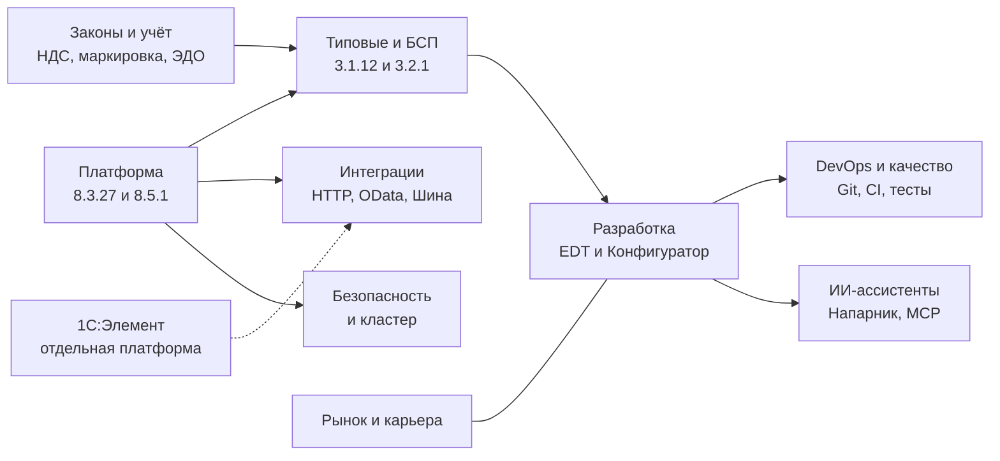
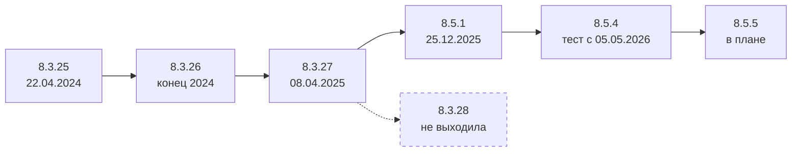
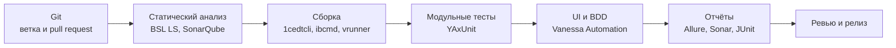
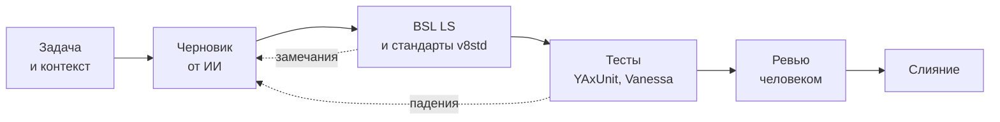

# Обзор экосистемы 1С: состояние на сентябрь 2026

[🗺 Оглавление](README.md)

> Актуализировано: сентябрь 2026. Факты сверены на 29.09.2026, реестр источников и уровни достоверности — в [SOURCES.md](SOURCES.md).

Это длинное чтение для тех, кто хочет увидеть картину целиком: что происходит с платформой, инструментами, ИИ, законами, инфраструктурой и рынком труда и что из этого нужно разработчику. Практика, критерии выхода, проекты и чек-листы вынесены в модульные файлы, карта модулей — в разделе 2.

> ⚠️ Статус документа. Раньше этот файл назывался «Source of Truth» и модули считались его выжимками. Теперь наоборот: первичны модульные файлы (`01_Strategy.md` – `13_Career.md`, папка `tracks/`) и реестр [SOURCES.md](SOURCES.md), а `all.md` — обзор со ссылками на них. При расхождении верьте модулям. Роадмап — независимый проект сообщества, а не документ фирмы «1С».

Как читать факты. Версии платформы и сроки приведены по официальным страницам «1С» там, где они были доступны при проверке, и по первичным артефактам (код БСП, трекер EDT, перечни сборок) там, где не были. Если утверждение держится на вторичных источниках или это оценка авторов, об этом сказано в тексте. Юридические факты нужно сверять с актуальной редакцией на consultant.ru и nalog.gov.ru.

## Содержание

1. [Главное за минуту](#-1-главное-за-минуту)
2. [Карта модулей роадмапа](#-2-карта-модулей-роадмапа)
3. [Платформа: 8.3.27, 8.5.1 и что дальше](#-3-платформа-8327-851-и-что-дальше)
4. [Типовые конфигурации и БСП](#-4-типовые-конфигурации-и-бсп)
5. [Безопасность](#-5-безопасность)
6. [1С:Предприятие 8 и 1С:Элемент](#-6-1спредприятие-8-и-1сэлемент)
7. [Интеграции платформы](#-7-интеграции-платформы)
8. [1C:EDT, Конфигуратор и инструменты](#-8-1cedt-конфигуратор-и-инструменты)
9. [DevOps, тесты и качество](#-9-devops-тесты-и-качество)
10. [ИИ в разработке](#-10-ии-в-разработке)
11. [Законодательство](#-11-законодательство)
12. [Инфраструктура и СУБД](#-12-инфраструктура-и-субд)
13. [Мобильная платформа](#-13-мобильная-платформа)
14. [Сертификация и модель компетенций](#-14-сертификация-и-модель-компетенций)
15. [Рынок труда](#-15-рынок-труда)
16. [Что это значит для разработчика](#-16-что-это-значит-для-разработчика)
17. [Мифы и факты](#-17-мифы-и-факты)
18. [Что не подтверждено](#-18-что-не-подтверждено)
19. [Источники](#-источники)

## 🧭 1. Главное за минуту

1. **Ветка 8.3 закончилась на 8.3.27.** Версии 8.3.28 не было, задачи перенесены в линию 8.5. Рабочие линии на 29.09.2026 — **8.3.27** и **8.5.1**.
2. **8.5 — не отдельная платформа, а новая нумерация той же платформы.** 8.5.1 (финальная версия — 25.12.2025) — это возможности 8.3.27 плюс новый интерфейс «Версия 8.5». Конвертировать базы не нужно, «Такси» остаётся.
3. **8.5.4 — тестовая версия** (с 05.05.2026), рабочей на конец сентября она не подтверждена. 8.5.5 — в плане, выход ожидается ближе к 2027 года (хедж).
4. **Возможности появлялись по версиям, а не «всё в 8.5».** Хеширование паролей, вход по QR-коду, завершение сеанса при бездействии, уведомления клиента — 8.3.26. WebSocket-клиент и вход по коду из почты — 8.3.27. Немодальный режим — с 8.3.3, `Асинх`/`Ждать` — с 8.3.18.
5. **Большие типовые работают на 8.3.27**, на 8.5 перешли УНФ и «Розница» начиная с 3.0.13. БСП выходит в двух редакциях: 3.1.12 (8.3.24–8.3.27) и 3.2.1 (только 8.5.1).
6. **Инструменты.** Стабильная ветка 1C:EDT — 2026.1 (патч 2026.1.3), 2026.2 — релиз-кандидат. Конфигуратор и хранилище конфигурации живы и развиваются. Командная разработка без EDT возможна.
7. **Безопасность.** Для паролей рекомендуется только PBKDF2-HMAC-SHA256. Шифрование «клиент — кластер» по умолчанию выключено, администратор кластера после установки не задан — его нужно создать.
8. **1С:Предприятие.Элемент** — самостоятельная платформа приложений со своим языком, базой и YAML-интерфейсом. Для рынка это ниша.
9. **ИИ.** 1С:Напарник — ассистент разработчика в 1C:EDT, облачный. Вокруг него выросла экосистема MCP-серверов и наборов skills. Бенчмарк PRISM показывает: лучшие модели решают 85–100% задач на BSL, российские облачные — 0–13%. Для ГИС действует прямой запрет по п. 60 приказа ФСТЭК № 117.
10. **Законы.** НДС 22% с 01.01.2026, порог НДС для УСН — 20 млн ₽ по доходам за 2025–2028 годы (228-ФЗ), ЭПД с 01.09.2026, разрешительный режим и ТС ПИоТ в маркировке, ФСБУ 9/2025 и 10/2026 с отчётности 2027 года.
11. **Инфраструктура.** PostgreSQL — только в сборках для 1С. SQL Server 2016 снят с поддержки Microsoft 14.07.2026. Linux — штатная среда сервера, но со своими ограничениями.
12. **Рынок.** Рынок работодателя. По выгрузке hh.ru за 10.08–07.09.2026 вакансий «без опыта» 5–7%, удалённо работать разрешают около половины, чаще всего упоминается 1С:ERP. Зарплаты — только в [13_Career.md](13_Career.md).

## 🗺 2. Карта модулей роадмапа

Обзор не повторяет модули, а связывает их. Таблица показывает, где искать подробности.

| Тема обзора | Где подробно |
|---|---|
| Ландшафт, принципы, выбор контекста и трека, мифы | [01_Strategy.md](01_Strategy.md) |
| Этапы 0–7, критерии выхода, недельные планы | [02_Timeline.md](02_Timeline.md) |
| Уровни Junior / Middle / Senior по модели MC-6-001 | [03_Competencies.md](03_Competencies.md) |
| Экзамены 1С:Профессионал, 1С:Специалист, 1С:Эксперт, 1С:Эксплуататор | [04_Certifications.md](04_Certifications.md) |
| Проверенные ресурсы, книги, курсы, инструменты | [05_Resources.md](05_Resources.md) |
| Вопросы и ответы, подводные камни с кодом | [06_FAQ_and_Tips.md](06_FAQ_and_Tips.md) |
| Практические проекты P0–P17 | [07_Projects.md](07_Projects.md) |
| Собеседования и банк вопросов | [08_Interview.md](08_Interview.md) |
| ИИ в разработке, MCP, безопасность и право | [09_AI_Development.md](09_AI_Development.md) |
| Бухучёт, налоги, маркировка, ЭДО, регуляторный календарь | [10_Domain_and_Law.md](10_Domain_and_Law.md) |
| Чек-листы | [11_Checklists.md](11_Checklists.md) |
| Глоссарий | [12_Glossary.md](12_Glossary.md) |
| Первая работа, зарплаты, карьера | [13_Career.md](13_Career.md) |
| Восемь треков специализации | [tracks/README.md](tracks/README.md) |
| Реестр утверждений, источников и удалённых выдумок | [SOURCES.md](SOURCES.md) |
| История изменений | [CHANGELOG.md](CHANGELOG.md) |



## 🔧 3. Платформа: 8.3.27, 8.5.1 и что дальше

### 3.1 Линии версий и статус

| Версия | Статус на 29.09.2026 | Ключевое |
|---|---|---|
| 8.3.25 | Вышла как рабочая 22.04.2024; для новых задач берите 8.3.27 или 8.5.1 | Экспорт и импорт настроек кластера, синтез речи |
| 8.3.26 | Вышла как рабочая в конце 2024 года (первая рабочая сборка 8.3.26.1498; точная дата в источниках расходится); для новых задач берите 8.3.27 или 8.5.1 | Пакет безопасности, уведомления клиента, архивы, блочное хранение двоичных данных |
| 8.3.27 | Рабочая версия с 08.04.2025, последняя в ветке 8.3. Последняя найденная сборка — 8.3.27.2342 (в перечне рабочих с 31.08.2026) | WebSocket-клиент, вход по коду из почты |
| 8.3.28 | Не выходила | Задачи перенесены в линию 8.5 |
| 8.5.1 | Рабочая версия. Бета — конец декабря 2024, финал — 25.12.2025. Последняя найденная сборка — 8.5.1.1529 (в перечне с 07.09.2026) | Всё из 8.3.27 плюс новый интерфейс «Версия 8.5» |
| 8.5.2, 8.5.3 | Отдельно не выходили | Их задачи вошли в 8.5.4 |
| 8.5.4 | Тестовая версия с 05.05.2026; рабочей на 29.09.2026 не подтверждена | Заявленные возможности см. в 3.3 |
| 8.5.5 | В плане (26 задач, в том числе gRPC); выход ближе к 2027 года (хедж) | См. 3.3 |



Как устроен статус сборок. Перечень рабочих сборок снимает со страниц «Технологическая платформа 8.3/8.5» на releases.1c.ru сторонний конвейер (namespace-forest); по наблюдениям авторов, в него попадают рабочие и ознакомительные сборки, тестовые — нет. По нему на 29.09.2026 рабочие — 8.3.27.2342 и 8.5.1.1529. Сборки 8.5.4.1306 и 8.5.4.1683 существуют и используются, но в перечне рабочих их нет, поэтому 8.5.4 считается тестовой. Сборка 8.5.1.1423 тоже существует (с ней работают пользователи EDT), но в перечне рабочих её нет — вероятно, это тестовая сборка исправлений; это вывод авторов, а не заявление «1С». Если вы сверяетесь с `releases.1c.ru` и видите другое, верьте первоисточнику.

Официальной политики сроков поддержки версий платформы (LTS, число поддерживаемых версий) найти не удалось. Практически минимальную платформу задают прикладные решения и БСП: например, БСП 3.1 работает в режимах совместимости 8.3.24–8.3.27. По коду БСП видно и давление на обновление: часть сервисов требует сборок не ниже 8.3.27.2130 или 8.5.1.1302.

### 3.2 8.5: что это на самом деле

- **Нумерация.** С бета-версии 8.5.1 всё новое выходит как 8.5.x. 8.5.1 включает все возможности 8.3.27. Конфигурации, базы и внешние обработки конвертировать не нужно.
- **Новый интерфейс «Версия 8.5»:** новый визуальный стиль, светлая и тёмная темы, векторные картинки, стандартный и компактный масштаб, в тонком и толстом клиенте — оконная система «В диалоговых окнах» (раньше она была только в веб-клиенте). В финальной 8.5.1 интерфейс сохраняет статус бета-функциональности, но им можно пользоваться.
- **Гибридный режим.** Переходные режимы совместимости «Такси. Разрешить Версия 8.5» и «Версия 8.5. Разрешить Такси» позволяют держать часть пользователей в «Такси», часть — в новом интерфейсе. У формы есть свойство «Использование в режиме совместимости интерфейса», поэтому основную и дополнительную формы можно вести под разные интерфейсы.
- **Конфигуратор.** При включённых переходных режимах в нём можно выбирать, для какого интерфейса («Такси» или «Версия 8.5») создаётся форма или макет. В 8.5.1 есть конвертер, который сканирует конфигурацию и показывает, что нужно переделать под 8.5.
- **Осторожность.** Партнёры советуют тестировать 8.5 параллельно с рабочей 8.3, сообщают о вопросах к использованию экранного пространства и горячим клавишам. Если снять режим совместимости ради новых возможностей, структура базы изменится и вернуться на старую платформу будет нельзя (по сообщениям партнёров). Для обучения ставьте учебную 8.5.1 или 8.3.27, а для конкретной типовой конфигурации смотрите её требования к платформе.

### 3.3 Возможности по версиям появления

Главная ошибка устаревших обзоров — сдвиг возможностей на 8.5. Таблица фиксирует, когда они появились на самом деле.

| Версия | Что появилось | Зачем разработчику |
|---|---|---|
| 8.3.3 | Режим использования модальности (немодальный режим) | `ПоказатьВопрос` с `ОписаниеОповещения` вместо модальных вызовов; модальные окна не поддерживаются в веб-клиенте |
| 8.3.5 | HTTP-сервисы, стандартный интерфейс OData (JSON — с 8.3.6) | Основа REST-интеграций |
| 8.3.8 | Поддержка экранных дикторов (NVDA); встроенные покупки в мобильной платформе. Давние возможности кластера: лимиты памяти rphost, балансировка, уровень отказоустойчивости | Не новинки 8.5 |
| 8.3.14 | Второй фактор аутентификации; OpenID Connect (не позже этой версии) | Корпоративный вход |
| 8.3.16 | Блокировка аутентификации; аннотация `&ИзменениеИКонтроль` | Расширения без `&Вместо` |
| 8.3.17 | Политики паролей; объект «Сервисы интеграции» (AMQP 1.0) | Связь с 1С:Шиной |
| 8.3.18 | `Асинх` / `Ждать` | Асинхронные клиентские вызовы вместо обработчиков оповещений |
| 8.3.21 | JWT (`ТокенДоступа`) | Токены для HTTP-интеграций |
| 8.3.23 | Хранилище двоичных данных (КОРП, клиент-сервер); NFC и сканирование документов в мобильной платформе; работа с речью | Вложения вне базы |
| 8.3.25 | Экспорт и импорт настроек кластера; синтез речи | Воспроизводимые стенды |
| 8.3.26 | Выбор алгоритма хеширования паролей (SHA-1 по умолчанию, SHA-256, SHA-512, PBKDF2-HMAC-SHA256); проверка раскрытия пароля; вход по QR-коду; «Время завершения сеанса при бездействии»; ЕСИА 3.34; уведомления клиента; архивы GZIP, RAR, 7-ZIP, XZ, TAR (чтение и распаковка); хранение двоичных данных любого размера в базе; каталоги данных сервисов кластера | Безопасность, push с сервера, работа с архивами без COM |
| 8.3.27 | WebSocket-клиент (объект метаданных); вход по одноразовому коду из почты | Двусторонние соединения без внешних компонент |
| 8.5.1 | Новый интерфейс «Версия 8.5», переходные режимы | См. 3.2 |
| 8.5.4 (тест) | Заявлено в тестовой версии: «1С:Предприятие — менеджер лицензий», новые метрики HTTP-сервиса метрик кластера, расширенные профили безопасности, проверка паролей администраторов кластера по списку слабых, ОС «Аврора» в мобильной платформе, клиент для Apple Silicon, хеширование по ГОСТ Р 34.11-2012 | Не рассчитывайте на них в продуктиве |
| 8.5.5 (план) | gRPC; мониторинг качества каналов между сервером и клиентами; хранилище двоичных данных для реквизитов табличных частей; текстовая расшифровка звонков Системы взаимодействия | Планы могут измениться |

Чего в списке нет, потому что не подтверждено: «SSL по умолчанию для всех протоколов», «параметры разрыва соединений на лету», «переключение на СУБД при сбое хранилища». Лимит в 3000 участников в Системе взаимодействия — это ограничение списка и поиска участников больших обсуждений в 8.3.26, а не «расширение». Из подтверждённых изменений Системы взаимодействия в 8.3.26: выбор экрана или окна при демонстрации, приватность сообщений, ссылки-приглашения в видеозвонок и передача данных в интеграцию Webhook. Фоновое обновление конфигурации БД — давняя возможность только лицензии КОРП, а не новинка и не обновление без простоя (см. раздел 12). Пункты из пересказов партнёров о реструктуризации без прерывания работы, просмотре DOCX/XLSX в клиенте и записи видеозвонков в 8.5.4 первоисточником не подтверждены.

### 3.4 Пример: уведомление клиента вместо опроса по таймеру

Механизм «уведомления клиента» (8.3.26) позволяет серверу отправить сообщение в выбранные клиентские сеансы. Это экономит нагрузку по сравнению с опросом по `ПодключитьОбработчикОжидания`. Длительные серверные вызовы дольше 8 секунд по стандарту [#642](https://its.1c.ru/db/v8std/content/642/hdoc) выполняют в фоновом задании. В конфигурациях на БСП для этого используют `ДлительныеОперации` и `СерверныеОповещения`, а не прямой вызов платформы.

```bsl
// Общий модуль "ДлительнаяОперацияСервер" (Сервер = Истина, Вызов сервера = Ложь).
// Метод фонового задания выполняется в неглобальном серверном общем модуле.
Процедура ВыполнитьРасчет(Знач НомерСеансаИнициатора) Экспорт

	// ... длительная работа ...

	ДанныеУведомления = Новый Структура("Статус, Сообщение", "Готово", НСтр("ru = 'Расчёт завершён'"));
	НомераСеансов = Новый Массив;
	НомераСеансов.Добавить(НомерСеансаИнициатора);
	УведомленияКлиента.ОтправитьУведомление("МоиОперации", ДанныеУведомления, НомераСеансов);

КонецПроцедуры
```

```bsl
// Модуль управляемой формы
// Вызывается из обработчика команды формы
&НаСервере
Процедура ЗапуститьОперациюНаСервере()
	ПараметрыЗадания = Новый Массив;
	ПараметрыЗадания.Добавить(НомерСеансаИнформационнойБазы());
	ФоновыеЗадания.Выполнить("ДлительнаяОперацияСервер.ВыполнитьРасчет", ПараметрыЗадания, , НСтр("ru = 'Длительная операция'"));
КонецПроцедуры

&НаКлиенте
Процедура ПриОткрытии(Отказ)
	УведомленияКлиента.ПодключитьОбработчик("МоиОперации",
		Новый ОписаниеОповещения("ПриПолученииУведомления", ЭтотОбъект));
КонецПроцедуры

// Экспортный обработчик оповещения допускается стандартом #630
&НаКлиенте
Процедура ПриПолученииУведомления(Данные, ДополнительныеПараметры) Экспорт
	Если Данные.Статус = "Готово" Тогда
		ПоказатьОповещениеПользователя(Данные.Сообщение);
	КонецЕсли;
КонецПроцедуры
```

Замечания. Возвращаемое значение функции фонового задания игнорируется, результат нужно класть во временное хранилище или в данные уведомления. БСП обращается к механизму через `Вычислить("УведомленияКлиента")`, чтобы модуль компилировался и на старых платформах; проверяйте компиляцию в вашем режиме совместимости по синтакс-помощнику. БСП считает уведомления клиента доступными с 8.3.27.2130 в клиент-серверном и с 8.3.27.1935 в файловом варианте (для 8.5.1 — с 1343 и 1119 соответственно), поэтому на более ранних сборках опирайтесь на `ДлительныеОперации`. Название «Client Notifications API» неофициальное. Подробнее о типовых ошибках клиент-серверного кода — в [06_FAQ_and_Tips.md](06_FAQ_and_Tips.md).

## 📦 4. Типовые конфигурации и БСП

| Факт | Содержание |
|---|---|
| Две редакции БСП | **3.1.12** (последняя найденная сборка 3.1.12.335 от 23.09.2026) — режимы совместимости 8.3.24–8.3.27. **3.2.1** (3.2.1.541) — только 8.5.1, запуск от 8.5.1.960. Обе обновлены 23–24.09.2026, функционально почти одинаковы (70 подсистем) |
| Какие типовые на какой платформе | БП, ЗУП, УТ, КА, ERP, УХ и ДО в 2026 году работают на 8.3.27. На 8.5 перешли УНФ и «Розница» начиная с 3.0.13. Официального плана перевода остальных на 8.5 не найдено |
| Одна кодовая база | УТ 11.5, КА 2.5 и ERP 2.5 — одна кодовая база, номера сборок синхронны. Знакомиться с архитектурой ERP полезно уже на уровне Junior+ |
| Настройка БСП | Через общие модули `*Переопределяемый` (78 в БСП 3.2.1) и обработчики `&После` к ним в расширении. «Подписки на события» — объект платформы, а не механизм переопределения БСП |
| Исправления «1С» | Поставляются как расширения с назначением «Исправление» |
| Обновление | После обновления нужно проверять применимость расширений; обновление большой базы может идти часами |

Порядок доработки типовой конфигурации: настройки и функциональные опции → дополнительные отчёты и обработки БСП → расширение → изменение основной конфигурации с сохранением поддержки, если расширение не справляется. Слово «исключительно расширения» неверно: официальная модель компетенций ждёт от Junior и доработки конфигурации, и расширений, и обновления нетиповых конфигураций со сравнением и объединением.

Аннотации расширений: `&Перед`, `&После`, `&Вместо`, `&ИзменениеИКонтроль` (с 8.3.16, блоки `#Вставка` / `#Удаление`). `&Вместо` — только когда другие способы не подходят, и тогда `ПродолжитьВызов` вызывают безусловно. Методы расширения получают префикс расширения.

```bsl
// Модуль объекта заимствованного документа в расширении (префикс расширения "Расш1_")
&Перед("ОбработкаПроведения")
Процедура Расш1_ОбработкаПроведения(Отказ, РежимПроведения)
	Расш1_ПроверитьДополнительныеУсловия(Отказ); // своя логика до типовой
КонецПроцедуры
```

Рекомендации по выбору версии платформы для типовых решений публикуются в разделе ИТС [«Информация об обновлениях»](https://its.1c.ru/db/updinfo). Подробнее о работе у франчайзи, в инхаусе и в продукте — в [tracks/developer-franchise.md](tracks/developer-franchise.md) и [tracks/developer-product.md](tracks/developer-product.md).

## 🔐 5. Безопасность

### 5.1 Аутентификация по версиям

| Механизм | С версии |
|---|---|
| Пароль 1С (хранится только хеш), аутентификация ОС, OpenID 2.0 (провайдер — другая база 1С) | Давно |
| OpenID Connect (внешний провайдер, например Keycloak) | Не позже 8.3.14; свойство пользователя — 8.3.19; сопоставление ключей — 8.3.22 |
| Второй фактор (шаблоны HTTP-провайдера) | 8.3.14 |
| Блокировка аутентификации после неудачных попыток | 8.3.16 |
| Политики паролей | 8.3.17 |
| JWT (`ТокенДоступа`) | 8.3.21 |
| Выбор алгоритма хеширования, проверка раскрытия пароля, вход по QR-коду, завершение сеанса при бездействии, ЕСИА 3.34 | 8.3.26 |
| Вход по одноразовому коду из почты | 8.3.27 |
| Проверка паролей администраторов кластера по списку слабых | 8.5.4 (тестовая) |

### 5.2 Пароли и хеши

- Рекомендуйте **только PBKDF2-HMAC-SHA256**. SHA-256 и SHA-512 — быстрые хеши, OWASP прямо называет такие алгоритмы неподходящими для хранения паролей. SHA-1 остаётся значением по умолчанию. MD5 в платформе нет.
- PBKDF2 заметно тяжелее SHA-1 для процессора (по оценкам практиков, примерно в 2000 раз); учитывайте это при массовом входе, например в веб-сервисах с Basic-аутентификацией.
- Откат на версию ниже 8.3.26: база открывается, но пользователи с новыми хешами не войдут по паролю. Перед откатом верните SHA-1 и переустановите пароли. Формулировка «база не запустится» неверна.
- «Проверка раскрытия пароля» берёт список из встроенной базы слабых паролей, файла или внешнего сервиса (например, Have I Been Pwned).
- Сообщать об уязвимостях платформы нужно на [bugboard.v8.1c.ru](https://bugboard.v8.1c.ru), а не на устаревший адрес `v8.1c.ru/bugtrack`.

### 5.3 Кластер и каналы

| Участок | Чем защищается |
|---|---|
| Клиент — кластер, внутри кластера, веб-сервер — кластер | Собственный протокол с уровнями безопасности: «выключено», «только соединение», «постоянно». **По умолчанию выключено.** В документации 8.3.8 описана схема RSA + Triple DES; актуальность алгоритмов для 8.3.27 и 8.5 не проверена |
| Клиент — веб-сервер | TLS при публикации по HTTPS |
| Кластер — СУБД | Средствами СУБД, SSL поддерживается всеми СУБД из списка |
| Администраторы кластера | После установки не заданы: любой подключившийся к центральному серверу может выполнять административные действия. Аутентификация включается, как только появляется первый администратор |

### 5.4 Права, внешний код, секреты

- **RLS** нужен, когда права зависят от данных. Привилегированный режим отключает RLS. `РАЗРЕШЕННЫЕ` нельзя использовать в запросах для расчётов и проведения ([#415](https://its.1c.ru/db/v8std/content/415/hdoc)). Пользователям с полным просмотром условия RLS не задают ([#488](https://its.1c.ru/db/v8std/content/488/hdoc)). В БСП есть стандартный и производительный (универсальный) варианты ограничения доступа.
- **Внешний код.** Внешние отчёты и обработки подключают средствами БСП «Дополнительные отчеты и обработки» в безопасном режиме; интерактивное открытие через «Файл → Открыть» по умолчанию отключают ([#669](https://its.1c.ru/db/v8std/content/669/hdoc)). **Профили безопасности** кластера доступны только с лицензией КОРП.
- **Секреты.** Пароли интеграций хранят в безопасном хранилище БСП, вызывая его в привилегированном режиме. Данные там хранятся сжатыми, но **не зашифрованными**, поэтому доступ к ним защищают правами. Хранение паролей регулирует стандарт [#740](https://its.1c.ru/db/v8std/content/740/hdoc), а пароли и ключи в тексте модуля ловит диагностика BSL LS `UsingHardcodeSecretInformation`.
- **Запросы.** Инъекции возможны при конкатенации пользовательской строки в текст запроса. Параметры обязательны; но параметры не экранируют спецсимволы шаблона `ПОДОБНО` ([#726](https://its.1c.ru/db/v8std/content/726/hdoc)). `ВЫБРАТЬ *` противоречит стандарту [#729](https://its.1c.ru/db/v8std/content/729/hdoc).

```bsl
// Общий серверный модуль. Владелец — ссылка или строка до 128 символов.
Процедура СохранитьПарольИнтеграции(Знач Владелец, Знач Пароль) Экспорт
	УстановитьПривилегированныйРежим(Истина);
	ОбщегоНазначения.ЗаписатьДанныеВБезопасноеХранилище(Владелец, Пароль, "Пароль");
	УстановитьПривилегированныйРежим(Ложь);
КонецПроцедуры

Функция ПарольИнтеграции(Знач Владелец) Экспорт
	УстановитьПривилегированныйРежим(Истина);
	Пароль = ОбщегоНазначения.ПрочитатьДанныеИзБезопасногоХранилища(Владелец, "Пароль");
	УстановитьПривилегированныйРежим(Ложь);
	Возврат Пароль;
КонецФункции
```

```bsl
// ПЛОХО: введённая пользователем строка попадает в текст запроса, спецсимволы шаблона не экранируются
// Запрос.Текст = "ВЫБРАТЬ Контрагенты.Ссылка ИЗ Справочник.Контрагенты КАК Контрагенты ГДЕ Контрагенты.Наименование ПОДОБНО ""%" + СтрокаПоиска + "%""";

// ХОРОШО: параметр и конкретные поля
Запрос = Новый Запрос;
Запрос.Текст =
	"ВЫБРАТЬ
	|	Контрагенты.Ссылка КАК Ссылка
	|ИЗ
	|	Справочник.Контрагенты КАК Контрагенты
	|ГДЕ
	|	Контрагенты.Наименование ПОДОБНО &Шаблон СПЕЦСИМВОЛ ""~""";
Запрос.УстановитьПараметр("Шаблон",
	"%" + ОбщегоНазначения.СформироватьСтрокуДляПоискаВЗапросе(СтрокаПоиска) + "%");
```

### 5.5 Журналы, ГИС и защищённая платформа

- Журнал регистрации хранится в формате `.lgd` (SQLite) вне базы и не сохраняется при выгрузке и загрузке базы. События «Доступ» и «Отказ в доступе» настраиваются отдельно. БСП предоставляет подсистему «Защита персональных данных» (регистрация доступа к ПДн, уничтожение и скрытие данных).
- Стандарт [#785](https://its.1c.ru/db/v8std/content/785/hdoc): для решений госучреждений, оборонных предприятий и корпоративных клиентов с повышенными требованиями минимальная версия платформы не выше последнего сертифицированного релиза 1С:Предприятие 8.3z. Защищённая платформа 8.3z обновлена до 8.3.27; номер и срок сертификата ФСТЭК в проверке не подтверждены.
- Приказ ФСТЭК № 117 (требования к защите ГИС) действует с 01.03.2026 и заменил № 17. ИИ касается п. 60, подробнее — в разделах 10 и 11.

Развёрнутый справочник для разработчика — в [SECURITY.md](SECURITY.md), чек-листы — в [11_Checklists.md](11_Checklists.md).

## 🧩 6. 1С:Предприятие 8 и 1С:Элемент

Это не конкуренты и не «следующая версия». **1С:Предприятие.Элемент** — самостоятельная платформа приложений: своя база данных, справочники, документы, регистры, транзакции, права по ключам доступа (RLS), HTTP- и SOAP-сервисы, планы обмена. Актуальная версия — **10.0** (в ней появились расширения). Облако — 1cmycloud.com, возможна и собственная установка.

| Критерий | 1С:Предприятие 8.x / 8.5 | 1С:Элемент 10.0 |
|---|---|---|
| Язык | Встроенный язык BSL | «Язык 1С:Элемент» (в сообществе xBSL, файлы `.xbsl`), статическая типизация |
| Интерфейс | Управляемые формы (Такси, «Версия 8.5») | Описывается декларативно в YAML; произвольные HTML и JS встраиваются только через `КонтейнерHtml` |
| Данные | Информационная база: файловая или клиент-серверная | Своя база; справочники, документы, регистры, транзакции (`Транзакции.Начать()`), собственный язык запросов |
| Среда разработки | Конфигуратор, 1C:EDT | Собственная IDE (на Java 17 при локальной установке) и облачная среда |
| Развёртывание | Локально или в облаке | Облако 1cmycloud.com или собственная установка |
| Готовые решения | Огромная база типовых конфигураций и БСП | Типовые конфигурации работают на платформе 8; на технологии Элемента построена 1С:Шина |
| Спрос | Основной рынок | Ниша: в выгрузке hh.ru за 10.08–07.09.2026 одна вакансия из 452 |

Родственные продукты:

- **1С:Предприятие.Элемент Скрипт** (до версии 9.0 — «1С:Исполнитель») — язык и среда для автоматизации администрирования и развёртывания; свободно распространяется, с версии 9.0 имеет встроенную IDE, актуальная линейка — 9.x. Версию «3.0.2.2» в официальном стенде Fresh не принимайте за актуальную: это закреплённый старый дистрибутив 1С:Исполнителя.
- **1С:Шина** — сервисная шина предприятия на технологии Элемента. Платформа 8 подключается к ней через объект «Сервисы интеграции» (8.3.17+, AMQP 1.0); в БСП есть транспорт обмена через 1С:Шину. Номер версии Шины в роадмапе не называется.

Что из этого следует. Ориентируйтесь на 8.x: именно там вакансии и типовые решения. Элемент — опциональная ветка на будущее, не «задача только для Senior+»: его изучают студенты, есть базовый курс УЦ №1, синтаксис близок к BSL. Аттестация «1С:Специалист по технологии 1С:Предприятие.Элемент» упоминается во вторичном каталоге, формат экзамена не проверен. Подробнее — в [tracks/element-and-mobile.md](tracks/element-and-mobile.md).

## 🌐 7. Интеграции платформы

| Механизм | С версии | Заметки |
|---|---|---|
| Веб-сервисы SOAP, WS-ссылки, XDTO | Давно | XDTO — основа формата EnterpriseData |
| HTTP-клиент `HTTPСоединение` + `HTTPЗапрос` → `HTTPОтвет` | Давно | Таймаут обязателен ([#748](https://its.1c.ru/db/v8std/content/748/hdoc)). На клиенте — асинхронно `ВызватьHTTPМетодАсинх`. Типа `ОбъектHTTPЗапроса` не существует |
| HTTP-сервисы `HTTPСервисЗапрос` / `HTTPСервисОтвет` | 8.3.5 | Публикация на веб-сервере или через автономный сервер |
| Стандартный интерфейс OData | 8.3.5 (JSON — 8.3.6) | Умеет не только читать: создаёт, изменяет и проводит документы, доступ ограничивают правами |
| JSON | 8.3.6 | `ЧтениеJSON`, `ЗаписьJSON` |
| Сервисы интеграции (1С:Шина) | 8.3.17 | Каналы, транспорт AMQP 1.0 |
| WebSocket-клиент | 8.3.27 | Объект метаданных; толстый, тонкий, веб-клиент и сервер |
| Интеграции Системы взаимодействия (Telegram, WebChat, Webhook, VK, WhatsApp) | давно; передача данных в Webhook — 8.3.26 | Подключают внешние каналы к обсуждениям, это не основной механизм интеграции |
| Уведомления клиента | 8.3.26 | От сервера к клиентскому сеансу |

**Kafka и RabbitMQ в платформу 8 не встроены.** Их подключают через внешние компоненты Native API, HTTP-шлюз или 1С:Шину. Программная работа с СКД идёт через `КомпоновщикНастроекКомпоновкиДанных`, `КомпоновщикМакетаКомпоновкиДанных`, `ПроцессорКомпоновкиДанных` и `ПроцессорВыводаРезультатаКомпоновкиДанныхВТабличныйДокумент`; типа `КомпоновщикНастроекDCS` не существует.

```bsl
// Общий серверный модуль. Сервер — имя хоста без схемы; таймаут 20 секунд обязателен (#748).
Функция ПолучитьКаталог(Знач Сервер, Знач Путь) Экспорт

	Соединение = Новый HTTPСоединение(Сервер, , , , , 20, ОбщегоНазначенияКлиентСервер.НовоеЗащищенноеСоединение());
	Запрос = Новый HTTPЗапрос(Путь);
	Запрос.Заголовки.Вставить("Accept", "application/json");

	Ответ = Соединение.Получить(Запрос);
	Если Ответ.КодСостояния <> 200 Тогда
		ВызватьИсключение СтрШаблон(НСтр("ru = 'Сервис вернул код состояния %1'"), Ответ.КодСостояния);
	КонецЕсли;

	Чтение = Новый ЧтениеJSON;
	Чтение.УстановитьСтроку(Ответ.ПолучитьТелоКакСтроку());
	Результат = ПрочитатьJSON(Чтение, Истина);
	Чтение.Закрыть();

	Возврат Результат;

КонецФункции
```

Если ваша конфигурация не использует БСП, вместо `ОбщегоНазначенияКлиентСервер.НовоеЗащищенноеСоединение()` создайте `Новый ЗащищенноеСоединениеOpenSSL` и при необходимости задайте сертификаты. Обмены данными: формат EnterpriseData и «Конвертация данных», в БСП — транспорты обмена. Подробный разбор — в [tracks/integration.md](tracks/integration.md).

## 📝 8. 1C:EDT, Конфигуратор и инструменты

### 8.1 1C:EDT

| Факт | Содержание |
|---|---|
| Нумерация | `ГГГГ.N`: год в номере не равен году выхода (например, 2025.2 вышла 25.02.2026) |
| Стабильная ветка | **2026.1** (патч 2026.1.3). Требует платформы 8.5.1.1423+ для проектов 8.5 и 8.3.27.2025+ для проектов 8.3.27 |
| Релиз-кандидат | **2026.2**: Eclipse 2025-12 и Java 25, требует 8.3.27.2202+ |
| Поддержка 8.5 | С EDT 2025.1 (23.10.2025) |
| Лицензия | Бесплатно после регистрации на [edt.1c.ru](https://edt.1c.ru/), без активной подписки ИТС |
| Командная строка | **1cedtcli**. Утилита `ring` для EDT не поддерживается с версии 2024.1 (для активации программных лицензий `ring` по-прежнему нужен) |
| Требования | Для крупных конфигураций уровня ERP — от 16 ГБ ОЗУ и SSD, по документации EDT |
| Известные проблемы | По публичному трекеру: импорт в 2026.2 медленнее, чем в 2026.1.2; на JRE 25 без модуля `jdk.jshell` не стартует 1С:Напарник. Новичкам ставить последний стабильный патч, а не RC |

Совет: перед обновлением EDT просмотрите [трекер 1c-edt-issues](https://github.com/1C-Company/1c-edt-issues). Известна давняя проблема, когда 1cedtcli возвращает код 0 при ошибке (#1344; похожее обращение #2119 закрыто 09.06.2026), поэтому в CI проверяйте результат отдельно. В EDT нет встроенной интеграции с Jenkins, GitLab CI и GitHub Actions: CI строят внешними средствами (1cedtcli, ibcmd, vanessa-runner, jenkins-lib).

### 8.2 Конфигуратор, хранилище, Git

- **Конфигуратор жив и развивается.** Обычные формы редактируются только в нём; хранилище конфигурации работает и остаётся основой командной работы у многих франчайзи. Позиция «1С»: EDT содержит большинство, но не все возможности Конфигуратора. Фразу «без EDT командная разработка невозможна» не используйте.
- **Хранилище → Git.** Официальный бесплатный инструмент — **1С:ГитКонвертер** ([GitConverter](https://github.com/1C-Company/GitConverter)): переносит историю хранилища в Git в формате EDT. Сообщество использует **gitsync** (3.8.0): синхронизирует хранилище конфигурации с Git, каждая версия хранилища — коммит.
- **Автономный сервер** (`ibsrv`) и утилита **ibcmd** дают клиент-серверный режим без полноценного кластера и выгрузку конфигурации в XML.
- **Учебная версия** скачивается бесплатно на [online.1c.ru](https://online.1c.ru/catalog/free/learning.php) после анкеты (учебные 8.5.1 и 8.3.27; Windows, Linux, macOS). У неё есть ограничения: только файловый вариант, некоммерческое использование, лимиты на число записей (проверяйте на странице загрузки). **Community-лицензия** для разработчиков — на developer.1c.ru (срочная). Полные дистрибутивы — releases.1c.ru по подписке ИТС. `v8.1c.ru` — информационный сайт, не место скачивания.
- **Стандарты и проверки.** Система стандартов — [its.1c.ru/db/v8std](https://its.1c.ru/db/v8std). В EDT встроен официальный плагин «1C:Code style V8» ([v8-code-style](https://github.com/1C-Company/v8-code-style)). Есть и 1С:АПК (автоматизированная проверка конфигураций) — версию и статус развития в роадмапе не указываем.
- **VS Code.** Официального расширения от 1С нет. Сообщество предлагает расширение «Language 1C (BSL)» ([vsc-language-1c-bsl](https://github.com/1c-syntax/vsc-language-1c-bsl)) и BSL Language Server.
- **1С:СППР 2.1** (проектирование прикладных решений) работает только на 8.5.1+. 1С:Тестировщик и 1С:Сценарное тестирование — официальные продукты «1С» (releases.1c.ru).

Выбор инструмента зависит от контекста работы: у франчайзи базой остаются Конфигуратор и хранилище, в продуктовой разработке — EDT, Git и CI. Это разбирается в [01_Strategy.md](01_Strategy.md) и [tracks/developer-product.md](tracks/developer-product.md).

## ⚡ 9. DevOps, тесты и качество

| Проект | Факт на сентябрь 2026 |
|---|---|
| [Vanessa Automation](https://github.com/Pr-Mex/vanessa-automation) | 1.2.043.42 (09.09.2026). BDD и UI-тесты через клиент тестирования; с 1.2.043.12 (19.04.2026) встроен MCP-сервер; отчёты Allure |
| [Vanessa ADD](https://github.com/vanessa-opensource/add) | Отдельный старый фреймворк (xUnit, BDD, дымовые тесты), релизов с 2023 года нет |
| [vanessa-runner](https://github.com/vanessa-opensource/vanessa-runner) (vrunner) | 3.0.2 (25.09.2026), требует OneScript 2, есть `vrunner-mcp` |
| [OneScript](https://github.com/EvilBeaver/OneScript) | 2.2.0 (05.09.2026), на .NET 8 |
| [BSL Language Server](https://github.com/1c-syntax/bsl-language-server) | 1.0.7 (в разработке 1.1.0), нужен JDK 21, экспериментальный режим MCP |
| [sonar-bsl-plugin-community](https://github.com/1c-syntax/sonar-bsl-plugin-community) | 1.20.0, требует SonarQube 25.4+ и Java 21 |
| [YAxUnit](https://github.com/bia-technologies/yaxunit) | 25.12, модульные тесты в виде расширения, запуск из EDT |
| [gitsync](https://github.com/oscript-library/gitsync) | 3.8.0, хранилище конфигурации → Git |
| [precommit4onec](https://github.com/bia-technologies/precommit4onec) | 25.12 |
| [jenkins-lib](https://github.com/firstBitMarksistskaya/jenkins-lib) | 0.16.2 |
| [Coverage41C](https://github.com/1c-syntax/Coverage41C) | Замер покрытия кода, последний релиз — декабрь 2024 |
| [onec-docker](https://github.com/firstBitMarksistskaya/onec-docker) | Docker-образы для CI (сообщество) |



Что важно помнить.

- **Лицензии и агенты.** Шагам CI нужны установленная платформа и лицензии, поэтому используют self-hosted-агенты или собственные образы. Облачные раннеры годятся для задач без платформы (BSL LS, SonarScanner, утилиты OneScript). Официального production-образа сервера 1С нет: `1C-Company/docker_fresh` — стенд для разработки и тестирования.
- **BDD в Vanessa Automation** — это UI/E2E-тесты через клиент тестирования. Аналитик пишет `.feature` для Vanessa Automation, а не для Vanessa ADD. Турбо-Gherkin — термин сообщества. Обещание «изменение интерфейса не ломает сценарий» не используйте.
- **Устаревшее:** `deployka` ([oscript-library/deployka](https://github.com/oscript-library/deployka), последний релиз 2021) заменён vanessa-runner.
- **Что реально используют.** По открытому опросу [Landscape1C](https://github.com/Oxotka/Landscape1C) (снимок 06.09.2026, выборка смещена к активной части сообщества) работали с VS Code 84,2%, Git — 77,8%, GitHub — 82,6%, EDT — 67,9%, SonarQube — 56,4%, Vanessa Automation — 53,6%, плагином Напарника — 48,9%, OneScript — 45,5%. Это ориентир, а не статистика отрасли; у франчайзи «продвинутые» инструменты в карточках каталога чаще не отмечены.

Проект «Качество и CI» — P13 в [07_Projects.md](07_Projects.md), роль QA — [tracks/qa-automation.md](tracks/qa-automation.md).

## 🤖 10. ИИ в разработке

**1С:Напарник (1C:Workmate)** — ИИ-ассистент **разработчика** в 1C:EDT. Плагин входит в поставку EDT 2026: автодополнение, фоновый анализ кода, агентный чат, который правит код и метаданные. Доступ — токен на [code.1c.ai](https://code.1c.ai/) по учётной записи 1С:ИТС (нужна подписка ИТС). Условия, цены и сроки бесплатного периода меняются и в источниках расходятся, поэтому смотрите на code.1c.ai. Сервис облачный: код уходит на серверы 1С, self-hosted-варианта нет. В Конфигураторе Напарника нет.

Отдельного официального ИИ-ассистента 1С для конечных пользователей найти не удалось. В типовых есть облачные ИИ-сервисы 1С (распознавание документов, прогнозирование и др.), а в платформе — работа с речью (8.3.23) и синтез речи (8.3.25).

| Класс инструментов сообщества | Примеры (проверяйте актуальность и лицензию) |
|---|---|
| Наборы skills и правил для агентов | [1c-ai-development-kit](https://github.com/Arman-Kudaibergenov/1c-ai-development-kit) (AGPL-3.0, skills для Claude Code), cc-1c-skills, ai_rules_1c |
| MCP к среде разработки | [EDT-MCP](https://github.com/DitriXNew/EDT-MCP), встроенный MCP в Vanessa Automation, `vrunner-mcp`, экспериментальный MCP в BSL LS |
| MCP-справка платформы | [mcp-bsl-platform-context](https://github.com/alkoleft/mcp-bsl-platform-context): поиск по синтакс-помощнику, чтобы агент не выдумывал методы |
| MCP к живой базе | Каталог [Untru/1c-mcp](https://github.com/Untru/1c-mcp) |
| Бенчмарк | [PRISM](https://github.com/genlab-1c/prism) |

Что показывает **PRISM** (прогон 25.09.2026, 57 моделей, 35 задач исполняются в 1С 8.3.27): лучшие модели решают 85–100% задач; GigaChat и YandexGPT — 0–13%; малые локальные модели — 0–27%. Сильные open-weight-модели требуют серверного GPU. Оговорка авторов: банк задач небольшой, рейтинг меняется с каждым прогоном. Доступ к Cursor, Claude Code, Codex и Copilot из России ограничен (хедж).



Типичные ошибки ИИ на BSL: выдуманные методы и типы (`ОбъектHTTPЗапроса`, `КомпоновщикНастроекDCS`), запросы в цикле, условия в `ГДЕ` вместо параметров виртуальной таблицы, модальные вызовы, возврат `ТаблицаЗначений` на клиент, `&Вместо` вместо `&Перед`. Поэтому ИИ-код проходит те же ворота, что и человеческий.

Право и безопасность.

- Персональные данные во внешние LLM — трансграничная передача (152-ФЗ). Код и данные клиента — вопрос NDA и коммерческой тайны (98-ФЗ): согласуйте с договором и политикой работодателя.
- Для ГИС и ИС госорганов — прямой запрет по п. 60 приказа ФСТЭК № 117 (действует с 01.03.2026): не допускается передача лицу, разработавшему модель ИИ, информации ограниченного доступа (по вторичному тексту, сверяйте на pravo.gov.ru).
- **MCP не является границей безопасности.** Доступ ограничивают правами пользователя 1С, обезличенной копией базы и учётной записью только на чтение. Стандартный OData не read-only. Мосты к Напарнику, вызывающие его API не из EDT, по сообщениям сообщества нарушают пользовательское соглашение сервиса.
- Не используйте формулировки «production-ready код», «сокращается на порядки», «ИИ обучен BSL».

Подробный разбор и упражнения (проект P17) — в [09_AI_Development.md](09_AI_Development.md).

## ⚖ 11. Законодательство

Таблица — ориентир для разработчика: какие изменения превращаются в задачи по типовым конфигурациям. Все факты нужно сверять с актуальной редакцией на consultant.ru и nalog.gov.ru.

| Тема | Что установлено | Как касается 1С |
|---|---|---|
| НДС | Основная ставка **22%** с 01.01.2026, Федеральный закон № 425-ФЗ от 28.11.2025. Ставки 10% и 0% сохранены | Ставки в проводках, документах, ККТ (в чеках — отдельные значения реквизита ставки) |
| УСН и НДС | Порог освобождения: 20 млн ₽ по доходам за 2025–2028 годы, 15 млн ₽ — за 2029 год, 10 млн ₽ — за 2030 год (№ 228-ФЗ от 04.07.2026; график 20→15→10 в 2026–2028 из 425-ФЗ отменён). Упрощенцы сверх порога остаются на УСН и платят НДС 5% / 7% без вычетов или 22% с вычетами. Лимит доходов для УСН на 2026 год — 490,5 млн ₽ | Законодательные пороги в коде оформляют функцией от периода; фраза «массовый переход на ОСНО» неверна |
| Страховые взносы | Для IT-компаний с 2026 года — 15% в пределах базы и 7,6% сверх; предельная база — 2 979 000 ₽ | Зарплатный контур (ЗУП, БП, УНФ) |
| Отчётность | ЕФС-1: приказ СФР № 1462 от 17.11.2025 | Выгрузки и форматы |
| ЭПД | Электронные перевозочные документы обязательны с 01.09.2026 (140-ФЗ) | ЭТрН и обмен через операторов |
| Маркировка «Честный ЗНАК» | Главная тема 2026 года — ТС ПИоТ и разрешительный режим на кассе. Старый протокол с токеном X-API-KEY работает до 01.10.2026; с 01.07.2026 «Честный ЗНАК» фиксирует отклонения. Радиоэлектроника — с 01.05.2026 (хедж) | Интеграция кассы и ИС МП, обновления типовых |
| Цифровой рубль | С 01.09.2026 — первый этап: крупнейшие банки и торговцы с выручкой более 120 млн ₽ | Поддержку в типовых проверяйте по релиз-нотам, не утверждайте заранее |
| ФСБУ | ФСБУ 9/2025 «Доходы» и ФСБУ 10/2026 «Расходы» (приказ Минфина № 53н от 24.04.2026) обязательны с отчётности 2027 года. ФСБУ 5/2019: способы оценки запасов при выбытии — по себестоимости каждой единицы, по средней себестоимости, ФИФО (ЛИФО не было уже в ПБУ 5/01) | Учётная политика, себестоимость |
| МЧД | В XSD единого формата поля «Должность» и ИНН физлица необязательные | Выгрузки, формат доверенностей |
| 152-ФЗ | Оборотные штрафы по 420-ФЗ — от 20 млн ₽ за повторную утечку и от 25 млн ₽ за специальные категории и биометрию, до 500 млн ₽ | Обезличивание копий баз для разработки и тестов |
| ФСТЭК № 117 | Требования к защите ГИС, действует с 01.03.2026 (заменил № 17); п. 60 касается ИИ | Разработка для ГИС |
| КЭП | «Госключ» — для подписей физлиц; КЭП юрлиц и ИП выпускает УЦ ФНС | Не утверждайте «удалённый выпуск КЭП через Госключ» |

Как «1С» отвечает на законы. Изменения оформляются обновлениями типовых конфигураций и БСП; рекомендации по выбору версий — в разделе ИТС «Информация об обновлениях». Для разработчика это значит три вещи: законодательные константы нельзя «зашивать» в код (в типовых это функции от периода, например порог освобождения от НДС), нетиповые базы нужно обновлять процедурой со сравнением и объединением, а после накатки обновлений нужны регрессионные проверки выгрузок (ЭДО, банк, отчётность). Предметную область и практикумы — в [10_Domain_and_Law.md](10_Domain_and_Law.md).

## 🧱 12. Инфраструктура и СУБД

| Тема | Состояние на сентябрь 2026 |
|---|---|
| PostgreSQL | **Только в сборках для 1С**: от «1С», Postgres Pro, ALT, managed-сервисы «-1c». Ванильный PostgreSQL не используют. Официальный стенд «1С» с 8.5.1.1302 использует PostgreSQL 18.3-5.1C |
| MS SQL Server | Используется. SQL Server 2016 снят с поддержки Microsoft 14.07.2026; SQL Server 2025 вышел 18.11.2025; на практике с ним проходят прогоны `ibcmd` на 8.3.27.2214 (сентябрь 2026), но официальный статус поддержки платформой не подтверждён |
| Oracle и IBM Db2 | Формально поддерживаются в 8.5.1 (описаны в документации и БСП 3.2), на практике — ниша |
| Linux | Astra Linux, РЕД ОС, Альт (метапакет `1c-preinstall`), Debian, Ubuntu; есть ARM-сборки. Официальный стенд «1С» собран на Debian |
| Особенности Linux (по ИТС) | Регистр имён файлов важен; нет UNC-путей; COM и OLE недоступны (внешние компоненты — Native API); пути собирают через `ПолучитьРазделительПути()`; нужны шрифты. Совет «пишите все пути строчными» не работает |
| Лицензии сервера | КОРП, ПРОФ, МИНИ; программные лицензии активирует утилита `ring`. Только в КОРП: фоновое обновление конфигурации БД, события аудита прав доступа, механизм копий БД, профили безопасности кластера |
| Кластер | Процессы ragent, rmngr, rphost, RAS; уровень отказоустойчивости, число центральных серверов (не меньше двух), лимиты памяти и балансировка — давние возможности (с 8.3.8), часть только КОРП |
| Фоновое обновление БД | Только КОРП; финальная фаза («принятие изменений») требует монопольного доступа, пауза ставится вручную. Это **не zero-downtime**, автопауз «в часы пик» нет |
| Контейнеры | Официального production-образа сервера 1С нет; про Kubernetes в продуктиве заявлений «1С» не найдено |
| Мониторинг | Технологический журнал (по данным сообщества, с 8.3.25 может писаться в JSON), APDEX и «Оценка производительности» в БСП, 1С:КИП (ЦУП, ЦКК, Тест-центр; версию не называем), экспортёры для Prometheus и Zabbix от сообщества |
| «Экспорт настроек кластера» (8.3.25) | Не полноценный IaC; инфраструктуру как код строят на Ansible или Terraform плюс `rac`, `ras`, `ibcmd` |

Эксплуатационные факты, которые часто путают. Шифрование «клиент — кластер» по умолчанию выключено. Сервер взаимодействия — отдельный сервис на Java. Поддержка Oracle и Db2 не отменялась. Лимит «ПРОФ = 12 ядер» первоисточником не подтверждён, не используйте его. Подробнее — в [tracks/administrator-operator.md](tracks/administrator-operator.md) и [tracks/performance-expert.md](tracks/performance-expert.md).

## 📱 13. Мобильная платформа

- **Что это.** Мобильное приложение — мобильная платформа (среда исполнения) плюс конфигурация, упакованные «Сборщиком мобильных приложений» в `.apk` или `.ipa`. В нативный код ничего не компилируется. Варианты: мобильная платформа, мобильное приложение, мобильный клиент, мобильный клиент с автономным режимом.
- **Ограничения.** Часть объектов не поддерживается: нет RLS, регламентных заданий, бухгалтерских и расчётных механизмов; на iOS не работают `Выполнить()` и `Вычислить()`. Использовать веб-сервисы можно, создавать их в мобильном решении — нельзя.
- **Синхронизация.** В мобильном приложении обмен пишет разработчик (план обмена плюс веб- или HTTP-сервис); в мобильном клиенте с автономным режимом синхронизацию выполняет механизм платформы.
- **Возможности устройства** (с версиями): геопозиционирование (с 8.3.3), сканирование штрихкодов (8.3.5), push (8.3.6), встроенные покупки (8.3.8; HUAWEI — 8.3.24), биометрия (8.3.15), NFC и сканирование документов (8.3.23), геозоны (объект — с 8.3.10, функциональность Geofences в сборщике — 8.3.24). Реклама строится на AdMob; iAd закрыт Apple 30.06.2016. Нативного RuStore Billing нет. ОС «Аврора» заявлена в тестовой 8.5.4.
- **Магазины в 2026.** Google Play требует API 36 для новых приложений и обновлений с 31.08.2026; App Store — Xcode 26 с 28.04.2026 и минимум iOS 13 с 09.09.2026 ([Google Play](https://developer.android.com/google/play/requirements/target-sdk), [Apple](https://developer.apple.com/news/upcoming-requirements/)). Совместимость конкретных сборок платформы и сборщика с этими требованиями не проверена, сверяйтесь с описанием сборщика на ИТС. Учебная версия не позволяет собирать мобильные приложения для публикации.
- **Спрос — ниша:** реальное применение — B2B и B2E (торговые агенты, склад, выездные сотрудники); в выгрузке вакансий мобильная разработка почти не встречается.

Проект P16 «Мобильное приложение „Торговый агент“» опционален; детали — в [tracks/element-and-mobile.md](tracks/element-and-mobile.md).

## 🎓 14. Сертификация и модель компетенций

| Сертификат | Формат |
|---|---|
| 1С:Профессионал | 14 вопросов, 30 минут, не менее 12 верных ответов (совпадает в пяти вторичных источниках; сверяйте на [1c.ru/prof](https://www.1c.ru/prof/)). Бывает по платформе, по конфигурациям, по технологическим вопросам, по эксплуатации ИС |
| 1С:Специалист по платформе | Около 4–5 часов; задача решается на выдаваемой каркасной конфигурации; темы — оперативный учёт, бухгалтерский учёт, сложные периодические расчёты, бизнес-процессы, разработка формы. Сдача в EDT и дистанционно не подтверждена |
| 1С:Эксперт по технологическим вопросам | Пререквизит — Профессионал по технологическим вопросам (не Специалист). Сложные практические задания и защита решений перед комиссией |
| 1С:Эксплуататор | Пререквизит — Профессионал по эксплуатации ИС. Практика — не менее 3 из 5 задач; теория — 14 из 20 письменных и 3 из 3 устных вопросов (единственный источник, хедж) |

Четыре трека: разработчик (Профессионал по платформе → Специалист по платформе), аналитик (Профессионал по конфигурации → Специалист-консультант), эксперт, эксплуатация. «1С:Руководитель проекта» после 2016 года в перечнях не встречается. Цены экзаменов и квоты партнёрских статусов не называем. «1С:НИК» — платный мобильный тренажёр УЦ №1 ([uc1.1c.ru/mobile](https://uc1.1c.ru/mobile/)), а не официальная база ответов.

Уровни Junior / Middle / Senior определяет официальная «Модель профессиональных компетенций Разработчика» MC-6-001 (2025) через навыки, без сроков: от Junior она ждёт Git в режиме исполнителя, расширений и внешних отчётов через БСП, СКД, HTTP-сервисов и OData, маркировки по инструкции, обновления конфигураций со сравнением и объединением, знания процессов клиента, 152-ФЗ и 98-ФЗ. Сроки вида «Junior — 0–6 месяцев» не подтверждены. Подробно — [03_Competencies.md](03_Competencies.md) и [04_Certifications.md](04_Certifications.md).

## 📈 15. Рынок труда

Источник чисел — выгрузка API hh.ru за 10.08–07.09.2026 (452 вакансии «1С» после удаления дублей, зарплата указана у 154), собранная третьими лицами и опубликованная на [GitHub](https://github.com/kr1p043k/compare_competencies). Это ориентир, а не статистика рынка.

- **Рынок работодателя.** Рынок ИТ в 2025–2026 годах — рынок работодателя (hh-индекс ИТ 16,1 в III квартале 2025, вторичный источник). Вакансий «без опыта» — 5–7%.
- **Удалёнка.** Удалённый формат разрешают около 50% вакансий 1С.
- **Конфигурации.** По упоминаниям лидирует ERP. Среди вакансий разработчиков УТ, ERP, ЗУП, БП и ДО идут почти вровень (в выборке разработчиков, n=99: УТ — 19, ERP — 18, ЗУП — 17, БП — 14, ДО — 13 вакансий). Утверждение «БП — максимальный спрос» не подтверждается.
- **Гибридные роли.** Гибридные названия вроде «Программист-аналитик 1С» и «Разработчик-аналитик 1С» встречаются (9 из 452); фразу «эпоха универсального программиста-внедренца прошла» не используйте.
- **Ниши.** Элемент — одна вакансия из 452, мобильная разработка — единицы (одна вакансия разработчика и одна QA).
- **Роли помимо разработчика:** QA 1С, администратор или DevOps 1С, методолог, функциональный и технический архитектор, руководитель проекта, разработчик интеграций.
- **Входные позиции:** стажёр или ученик, первая линия поддержки, сопровождение у франчайзи.
- **Зарплаты.** Здесь они не приводятся намеренно: актуальные цифры с методикой, периодом и разрезами по опыту, региону и роли — только в [13_Career.md](13_Career.md).

Не используйте непроверенные утверждения: «1С занимает 75% рынка ERP», «УПП снимают с поддержки весной 2027», «в 2–3 раза дороже».

## 🚀 16. Что это значит для разработчика

Метки: 🔴 обязательно, 🟡 желательно, 🔵 по контексту (инхаус, продукт, проект). Детальная разметка по уровням — в [03_Competencies.md](03_Competencies.md).

| Что | Метка | Комментарий |
|---|---|---|
| Язык BSL, клиент-сервер, запросы, регистры, проведение и блокировки на платформе 8.3.27 или 8.5.1 | 🔴 | Основа этапов 1–2, см. [02_Timeline.md](02_Timeline.md) |
| Стандарты разработки `its.1c.ru/db/v8std` и БСП | 🔴 | Запросы без циклов, параметры, контекстные директивы, немодальные вызовы |
| Расширения и порядок доработки типовой | 🔴 | `&Перед`, `&ИзменениеИКонтроль`, префиксы |
| Git на уровне исполнителя | 🔴 | Требуется уже от Junior по модели MC-6-001 |
| Предметная область: бухучёт, склад, зарплата, налоги | 🔴 | [10_Domain_and_Law.md](10_Domain_and_Law.md) |
| 1C:EDT, BSL Language Server | 🟡 | У франчайзи база — Конфигуратор, в продукте — EDT |
| Модульные тесты и CI | 🟡 | YAxUnit, vanessa-runner, [11_Checklists.md](11_Checklists.md) |
| ИИ-ассистенты с обязательной проверкой | 🟡 | Не требование рынка, а полезный навык |
| Интеграции: HTTP, OData, обмены | 🟡 | [tracks/integration.md](tracks/integration.md) |
| Кластер, ТЖ, СУБД, Linux | 🔵 | [tracks/administrator-operator.md](tracks/administrator-operator.md), [tracks/performance-expert.md](tracks/performance-expert.md) |
| 1С:Элемент, мобильная платформа | 🔵 | [tracks/element-and-mobile.md](tracks/element-and-mobile.md) |

Что сделать в первую очередь.

1. Поставить учебную версию платформы (8.5.1 или 8.3.27) и EDT стабильной ветки 2026.1 — или остаться в Конфигураторе, если ваш контекст этого требует.
2. Прочитать «Новое в платформе» по версиям 8.3.25–8.3.27 и 8.5.1: многие возможности, считающиеся новыми, появились в них.
3. Пройти этапы 0–4 в [02_Timeline.md](02_Timeline.md), выполнять проекты P0–P6 из [07_Projects.md](07_Projects.md).
4. Выбрать трек по [tracks/README.md](tracks/README.md) и планировать сертификацию по [04_Certifications.md](04_Certifications.md).

Как следить за изменениями: страницы «Новое в платформе» на [v8.1c.ru](https://v8.1c.ru/platforma/news/novoe-v-platforme-8-5-4/), раздел ИТС [«Информация об обновлениях»](https://its.1c.ru/db/updinfo), блог [wonderland.v8.1c.ru](https://wonderland.v8.1c.ru/blog/plan-zadach-na-versiyu-8-5-5-platformy-1s-predpriyatie/), англоязычные обзоры на 1c-dn.com, трекер [1c-edt-issues](https://github.com/1C-Company/1c-edt-issues), каталог [Landscape1C](https://github.com/Oxotka/Landscape1C). Конференции осени 2026: Infostart Tech Event (8–10.10.2026, Санкт-Петербург), остальные — в [05_Resources.md](05_Resources.md).

## ❌ 17. Мифы и факты

| Миф | Что на самом деле |
|---|---|
| «8.5 — новая платформа» | Новая нумерация той же платформы: 8.5.1 = 8.3.27 + новый интерфейс |
| «Немодальность, NVDA, PBKDF2, завершение сеанса — новинки 8.5» | Немодальность — 8.3.3, NVDA — 8.3.8, хеширование и завершение сеанса — 8.3.26 |
| «После перехода на PBKDF2 база не запустится на старой платформе» | База откроется, но пользователи с новыми хешами не войдут по паролю; перед откатом вернуть SHA-1 |
| «Все протоколы по умолчанию работают поверх SSL» | Шифрование «клиент — кластер» по умолчанию выключено; TLS — в HTTPS-публикации и на канале к СУБД |
| «Фоновое обновление БД — без простоя, с автопаузой» | Только КОРП, финальная фаза монопольная, пауза ручная |
| «Без EDT командная разработка невозможна» | Конфигуратор и хранилище работают; Git подключают через gitsync или 1С:ГитКонвертер |
| «Дорабатывать типовые можно исключительно расширениями» | Порядок: настройки → дополнительные отчёты и обработки → расширение → изменение с сохранением поддержки |
| «Напарник — ассистент конечных пользователей» | Ассистент разработчика в EDT, облачный |
| «ИИ заменит 1С-разработчика» или «ИИ пишет production-ready код» | Даже лучшие модели решают на PRISM не все задачи; результат проходит BSL LS, тесты и ревью |
| «Элемент — UI на HTML, CSS и JS, микросервисы, только для Senior+» | Интерфейс в YAML, язык статически типизирован, есть своя база; изучают и студенты |
| «Мобильная платформа компилирует BSL в нативный код» | Платформа и конфигурация упаковываются сборщиком; не всё поддерживается |
| «Kafka и RabbitMQ встроены в платформу» | Подключаются через Native API, HTTP-шлюз или 1С:Шину |
| «Упрощенцы массово переходят на ОСНО» | Они остаются на УСН и платят НДС 5% / 7% или 22% |
| «БП — самый востребованный» | По упоминаниям лидирует ERP |
| «Junior — 0–6 месяцев, Middle — 1–2 года» | Модель MC-6-001 определяет уровни навыками, сроки не подтверждены |

## 🔍 18. Что не подтверждено

Эти пункты нужно проверять по первоисточнику перед использованием в работе.

- **Статус 8.5.4.** Выход рабочей версии на 29.09.2026 не подтверждён; перечень рабочих сборок построен сторонним конвейером. Проверяйте на [releases.1c.ru](https://releases.1c.ru/) и в информационных письмах «1С».
- **Бесплатный период 1С:Напарника.** Даты в источниках расходятся (01.10.2026 и 01.02.2027), цены не подтверждены — смотрите на code.1c.ai.
- **Сертификация.** Все данные об экзаменах получены из вторичных источников (первоисточники 1c.ru при проверке были недоступны); сверяйте на 1c.ru/prof и 1c.ru/spec. Допуск EDT и дистанционный формат на 1С:Специалисте не подтверждены.
- **Законодательство.** Часть фактов уровня «вторичный источник»: ТС ПИоТ и календарь маркировки, цифровой рубль (последующие этапы), п. 60 приказа ФСТЭК № 117. Первоисточники: [nalog.gov.ru/new2026](https://www.nalog.gov.ru/new2026/), [публикация 228-ФЗ](http://publication.pravo.gov.ru/document/0001202607040017), [приказ ФСТЭК № 117](https://publication.pravo.gov.ru/document/0001202506170011).
- **Платформа ↔ СУБД и ОС.** Официальная матрица совместимости (версии PostgreSQL, SQL Server, Astra, РЕД ОС, Альт) не открывалась.
- **Платформа.** Дата рабочей 8.3.26 (вероятнее конец ноября 2024), политика сроков поддержки версий, алгоритмы шифрования канала «клиент — кластер» в 8.3.27 и 8.5, число итераций PBKDF2, номер сертификата ФСТЭК на 8.3z.
- **Инструменты.** Версии 1С:КИП, 1С:АПК, 1С:Шины; дата финала EDT 2026.1; статус и версии 1С:Тестировщика и 1С:Сценарного тестирования.
- **Мобильная платформа.** Минимальные версии Android и iOS; совместимость сборок с API 36 и Xcode 26.
- **Удалено при актуализации.** В прошлой версии обзора были несуществующие инструменты и команды (`1cca`, `bsp-tools`, MCP `spremotely-vanessa-app-mcp` с командами `create_feature`, `parse_feature`, `generate_steps`, «оркестрация через MiniMax M2»), неверные API (`ОбъектHTTPЗапроса`, `КомпоновщикНастроекDCS`) и версии, приписанные 8.5. Полный список — в [SOURCES.md](SOURCES.md).

Нашли ошибку или устаревший факт — заведите Issue по шаблону из [CONTRIBUTING.md](CONTRIBUTING.md).

## 🔗 Источники

Платформа и БСП.

- [1c.ru: новая нумерация, бета 8.5.1](https://1c.ru/news/info.jsp?id=32567)
- [Новое в платформе 8.3.25](https://v8.1c.ru/platforma/news/novoe-v-platforme-8-3-25/), [8.3.26](https://v8.1c.ru/platforma/news/novoe-v-platforme-8-3-26/), [8.3.27](https://v8.1c.ru/platforma/news/novoe-v-platforme-8-3-27/), [8.5.1](https://v8.1c.ru/platforma/news/novoe-v-platforme-8-5-1/), [8.5.4](https://v8.1c.ru/platforma/news/novoe-v-platforme-8-5-4/)
- [Новый интерфейс 8.5](https://v8.1c.ru/platforma/new-ui-85/), [совместное использование интерфейсов 8.5 и «Такси»](https://wonderland.v8.1c.ru/blog/sovmestnoe-ispolzovanie-novogo-interfeysa-i-interfeysa-taksi-v-odnom-prilozhenii/), [финальная 8.5.1](https://wonderland.v8.1c.ru/blog/vypushchena-finalnaya-versiya-platformy-1s-predpriyatie-8-5-1/)
- [1c-dn.com: New Features 8.3.25](https://1c-dn.com/1c_enterprise/new_features_in_version_8_3_25/), [8.3.26](https://1c-dn.com/1c_enterprise/new_features_in_version_8_3_26/), [8.3.27](https://1c-dn.com/1c_enterprise/new_features_in_version_8_3_27/)
- [Отправка уведомлений с сервера в клиентское приложение](https://wonderland.v8.1c.ru/blog/otpravka-uvedomleniy-s-servera-v-klientskoe-prilozhenie/), [проверка раскрытия пароля](https://wonderland.v8.1c.ru/blog/mekhanizm-proverki-parolya-po-spisku-skomprometirovannykh-paroley/), [план задач 8.5.5](https://wonderland.v8.1c.ru/blog/plan-zadach-na-versiyu-8-5-5-platformy-1s-predpriyatie/)
- [Режим без модальности на ИТС](https://its.1c.ru/docs/v8nonmodal/), [Информация об обновлениях](https://its.1c.ru/db/updinfo), [БСП 3.1: режимы совместимости](https://its.1c.ru/db/content/updlib/src/bsp/3.1/updatessl_3.1.html)
- [Всё об аутентификации в 1С (откат после PBKDF2)](https://infostart.ru/1c/articles/2480616/)
- [Сборки 8.5.1.1302 и 8.5.1.1529 в трекере EDT](https://github.com/1C-Company/1c-edt-issues/issues/2336), [перечень рабочих сборок (namespace-forest)](https://raw.githubusercontent.com/yellow-hammer/namespace-forest/HEAD/schemas/designer/processed-versions.json)
- Код БСП: [ssl_3_1](https://github.com/1c-syntax/ssl_3_1), [ssl_3_2](https://github.com/1c-syntax/ssl_3_2)
- Стандарты: [its.1c.ru/db/v8std](https://its.1c.ru/db/v8std) (разделы #415, #488, #642, #669, #726, #729, #740, #748, #785 — по адресу `its.1c.ru/db/v8std/content/NNN/hdoc`)

Инструменты, DevOps и ИИ.

- [Сайт 1C:EDT](https://edt.1c.ru/), [что нового в EDT 2026.1](https://edt.1c.ru/docs/new/versiya-2026-1/), [EDT 2026.2](https://v8.1c.ru/platforma/news/novoe-v-1c-edt-2026-2/), [FAQ EDT](https://edt.1c.ru/faq/), [требования EDT](https://edt.1c.ru/docs/intro/requirements.php)
- [Трекер 1c-edt-issues](https://github.com/1C-Company/1c-edt-issues), [GitConverter](https://github.com/1C-Company/GitConverter), [v8-code-style](https://github.com/1C-Company/v8-code-style), [docker_fresh](https://github.com/1C-Company/docker_fresh)
- [Учебная версия на online.1c.ru](https://online.1c.ru/catalog/free/learning.php)
- Проекты сообщества: ссылки на репозитории — в таблице раздела 9, каталог — [Landscape1C](https://github.com/Oxotka/Landscape1C), [результаты опроса 06.09.2026](https://github.com/Oxotka/Landscape1C/blob/main/docs/survey-comparison-2026-09-06.md)
- [1С:Напарник (code.1c.ai)](https://code.1c.ai/), [PRISM](https://github.com/genlab-1c/prism), [Untru/1c-mcp](https://github.com/Untru/1c-mcp), [EDT-MCP](https://github.com/DitriXNew/EDT-MCP), [1c-ai-development-kit](https://github.com/Arman-Kudaibergenov/1c-ai-development-kit), [1c-ai-guide (базовая безопасность)](https://github.com/Aleksandr-Litvinenko/1c-ai-guide)

Элемент, инфраструктура, мобильная платформа.

- [1С:Предприятие.Элемент](https://v8.1c.ru/platforma/1s-predpriyatie-element/), [облако 1cmycloud.com](https://1cmycloud.com/welcome/), [книга по языку Элемента на ИТС](https://its.1c.ru/db/pubelementlang), [1С:Шина](https://v8.1c.ru/static/1s-shina/)
- [PostgreSQL для 1С](https://v8.1c.ru/platforma/postgresql/), [жизненный цикл SQL Server](https://learn.microsoft.com/sql/sql-server/end-of-support/sql-server-end-of-support-overview), [документация 1С:КИП](https://its.1c.ru/db/kip)
- [Требования Google Play](https://developer.android.com/google/play/requirements/target-sdk), [требования App Store](https://developer.apple.com/news/upcoming-requirements/)

Законодательство, сертификация, рынок.

- [Налоги 2026 на nalog.gov.ru](https://www.nalog.gov.ru/new2026/), [228-ФЗ от 04.07.2026](http://publication.pravo.gov.ru/document/0001202607040017), [420-ФЗ](http://publication.pravo.gov.ru/document/0001202411300011), [приказ СФР о форме ЕФС-1](http://publication.pravo.gov.ru/document/0001202512190019), [приказ ФСТЭК № 117](https://publication.pravo.gov.ru/document/0001202506170011), [248-ФЗ (цифровой рубль)](https://www.consultant.ru/law/hotdocs/90109.html)
- [1С:Профессионал](https://www.1c.ru/prof/), [1С:Специалист](https://www.1c.ru/spec/), [мобильный тренажёр УЦ №1](https://uc1.1c.ru/mobile/)
- [Выгрузка вакансий hh.ru за 10.08–07.09.2026](https://github.com/kr1p043k/compare_competencies)

[🗺 Оглавление](README.md)
