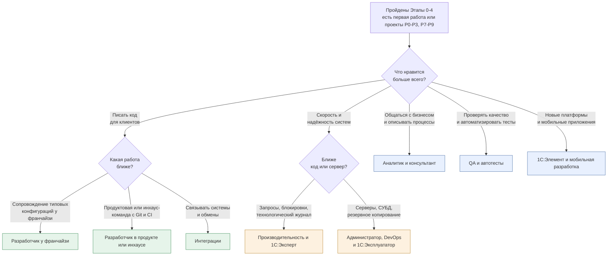

# Треки специализации

[🗺 Оглавление](../README.md) | [Разработчик у франчайзи →](developer-franchise.md)

> Актуализировано: сентябрь 2026.

Трек — это выбор направления на Этапе 7 (см. [02_Timeline.md](../02_Timeline.md)). Пока вы не прошли Этапы 0–4 («Минимальный путь до первой работы»), трек выбирать рано: базовые навыки нужны во всех восьми, а присмотреться к направлениям можно заранее. Этот файл помогает сравнить треки и выбрать первый. Подробности по каждому направлению лежат в отдельном файле.

## 🧭 Как пользоваться

1. Пройдите Этапы 0–4 и сделайте проекты «Минимального пути»: P0–P3 и P7–P9 (описания и критерии приёмки — в [07_Projects.md](../07_Projects.md)).
2. Ответьте на вопросы схемы ниже и выберите один трек. Второй берите только после первого.
3. Откройте файл трека. Все треки построены по одному шаблону: чем занимается специалист, где работает, навыки по уровням, инструменты, сертификация, проекты, план входа на 3–6 месяцев, ресурсы.
4. Трек не отменяет базу: он расширяет её. Треки пересекаются, поэтому перейти из одного в другой проще, чем начинать с нуля (оценка авторов).

## 🎯 Как выбрать трек

Цвета: зелёные — направления разработки, оранжевые — эксплуатация и производительность, синие — смежные роли и опциональная ветка. Схема — подсказка для первого выбора, а не тест: в реальной работе направления смешиваются.

## 📊 Сводная таблица треков

| Трек | Для кого | Ключевые темы | Сертификаты | Спрос |
|---|---|---|---|---|
| [Разработчик у франчайзи](developer-franchise.md) | Первая работа, сопровождение клиентов | Типовые (БП, УТ, ЗУП), обновления, внешние формы, расширения, обмены, сервисы ИТС, маркировка по инструкции | Профессионал по платформе → Специалист по платформе | Основной вход в профессию: стажёр, ученик, первая линия поддержки |
| [Разработчик в продукте или инхаусе](developer-product.md) | Команды с Git и CI | 1C:EDT, Git, код-ревью, YAxUnit, Vanessa Automation, SonarQube, CI, архитектура | Профессионал по платформе → Специалист по платформе (по желанию) | Вакансий без опыта мало, сюда приходят с опытом работы |
| [Интеграции](integration.md) | Middle и выше | HTTP и SOAP, OData, КД3 и EnterpriseData, 1С:Шина, брокеры через внешние компоненты или HTTP, идемпотентность | Отдельного экзамена нет | Навык нужен во многих проектах, а отдельных вакансий немного |
| [Производительность и 1С:Эксперт](performance-expert.md) | Опытные разработчики (Middle–Senior) | Технологический журнал, кластер, планы запросов PostgreSQL и MS SQL, блокировки, нагрузочное тестирование, APDEX | Профессионал по технологическим вопросам → Эксперт по технологическим вопросам | Узкий, вакансий мало, вилки публикуют редко |
| [Администратор, DevOps и 1С:Эксплуататор](administrator-operator.md) | Смежная роль | Кластер, PostgreSQL для 1С, Linux, лицензии, резервное копирование, мониторинг, безопасность | Профессионал по эксплуатации ИС → 1С:Эксплуататор | Чаще входит в роль сисадмина или ведущего разработчика; тренд — Linux и PostgreSQL (оценка авторов) |
| [QA и автотесты](qa-automation.md) | Смежная роль | Vanessa Automation и Turbo Gherkin, YAxUnit, 1С:Тестировщик, 1С:Сценарное тестирование, Allure | Отдельного экзамена нет | Нишевый: продукты и крупные команды |
| [Аналитик и консультант](analyst-consultant.md) | Смежная роль, гибридные позиции | Процессы, BPMN, ТЗ, гэп-анализ, методология типовых конфигураций, 1С:СППР | Профессионал по конфигурации → Специалист-консультант | Постоянный, заметнее в проектах ERP и УХ; гибридные роли на рынке есть |
| [1С:Элемент и мобильная разработка](element-and-mobile.md) | Опциональная ветка | Элемент: язык, права, RLS, HTTP-сервисы; мобильная платформа: автономный режим | Аттестация УЦ №1 по Элементу (формат не подтверждён), см. файл трека | Нишевый, вакансии единичные |

Столбец «Спрос» качественный, это оценка авторов по материалам обзора вакансий, а не статистика. Числа по вакансиям и зарплатам — только в [13_Career.md](../13_Career.md), с источником и периодом. Сертификаты подробно описаны в [04_Certifications.md](../04_Certifications.md): формат экзаменов и порядок сдачи уточняйте на официальных страницах 1С.

## 🧩 Что общего у всех треков

- База платформы: язык, запросы, регистры, формы, отчёты на СКД, права. Без неё ни один трек не работает.
- Стандарты разработки 1С (its.1c.ru/db/v8std): общая точка отсчёта для всех направлений.
- Чтение чужого кода и типовых конфигураций: даже аналитик и QA постоянно работают с ними.
- Практика в открытых проектах и портфолио: см. [07_Projects.md](../07_Projects.md) и [13_Career.md](../13_Career.md).
- Работа с ИИ-ассистентами и проверка их ответов: см. [09_AI_Development.md](../09_AI_Development.md).

## 🔗 Как треки связаны с этапами и проектами

| Трек | Основа на Этапах | Проекты трека и смежные |
|---|---|---|
| Разработчик у франчайзи | Этапы 4–5, затем Этап 7 | P7, P8, P9, P12; P14 и P15 на Этапе 7; P13 по желанию |
| Разработчик в продукте или инхаусе | Этапы 5–6 | P13 (главный), P8, P14, P15; P17 по желанию |
| Интеграции | Этап 5 | P10, P11, P12 |
| Производительность и 1С:Эксперт | Этапы 5–7 | P14 (главный), P13 |
| Администратор, DevOps и 1С:Эксплуататор | Этап 5, затем Этап 7 | Единых проектов нет; полезны P13 (автоматизация), P14 (замеры и журнал), P15 (права) |
| QA и автотесты | Этап 6 | P13 (главный); объекты тестирования P2, P3, P5, P10, P12; P14, P15, P17 |
| Аналитик и консультант | Этапы 4–5 | Отдельного проекта нет; P4–P6 (предметная область), P7–P9, P12, P15 как объекты анализа; P17 по желанию |
| 1С:Элемент и мобильная разработка | Этап 7 | P16 (мобильное приложение, опционально); для Элемента проекта в общем списке нет |

Привязка проектов ориентировочная: номера этапов у проектов указаны в [07_Projects.md](../07_Projects.md) (например, P14–P16 отнесены к Этапу 7, P13 и P17 — к Этапу 6), там же критерии приёмки; рекомендации по трекам смотрите в файле выбранного трека.

## 🏢 Контексты работы и треки

По каталогу Landscape1C работа специалиста 1С делится на четыре контекста: франчайзи, инхаус, продукты и проекты. Каталог сообщественный, а не официальная классификация 1С.

| Контекст | Какие треки встречаются чаще |
|---|---|
| Франчайзи | [Разработчик у франчайзи](developer-franchise.md), [аналитик и консультант](analyst-consultant.md), [интеграции](integration.md) |
| Инхаус | [Разработчик в продукте или инхаусе](developer-product.md), [администратор](administrator-operator.md), [производительность](performance-expert.md), [QA](qa-automation.md) |
| Продукты | [Разработчик в продукте](developer-product.md), [QA и автотесты](qa-automation.md), [интеграции](integration.md) |
| Проекты | [Аналитик и консультант](analyst-consultant.md), [интеграции](integration.md), [производительность](performance-expert.md) |

Это ориентир, а не правило. В каталоге Конфигуратор и хранилище конфигурации отнесены к базовым инструментам во всех контекстах, а EDT, Git, CI и тесты Vanessa Automation и YAxUnit — к продвинутым для инхауса и продуктов. Поэтому «без EDT командная разработка невозможна» — неверно. Подробнее о контекстах и их плюсах и минусах — в [13_Career.md](../13_Career.md).

## 💡 Типичные вопросы при выборе

- «Можно ли выбрать сразу Эксперта?» Для новичка нет: направление рассчитано на разработчиков с опытом (Middle–Senior). Путь к сертификату идёт через 1С:Профессионала по технологическим вопросам. Пререквизитом Эксперта не является 1С:Специалист.
- «Нужен ли сертификат, чтобы войти в трек?» Нет. В вакансиях сертификаты чаще «желательны» или «приветствуются», чем обязательны, а умение решать задачи и портфолио проверяют на собеседовании. Подробности — в [04_Certifications.md](../04_Certifications.md).
- «Что, если трек не подошёл?» Смена трека нормальна: база одинакова, а интеграции, производительность и тесты естественно вырастают из работы разработчика.
- «С чего начать при выходе на рынок?» Реальные входы — стажировки, первая линия поддержки и франчайзи; вакансий «без опыта» немного. Специализируйтесь после первой работы. Рынок ИТ в 2025–2026 годах называют рынком работодателя, поэтому портфолио и проекты особенно важны (см. [13_Career.md](../13_Career.md)).
- «Гибридные роли существуют?» Да, «программист-консультант» и подобные позиции на рынке есть. Треки аналитика и разработчика можно сочетать.

## 📚 Что читать дальше

- Таймлайн этапов: [02_Timeline.md](../02_Timeline.md)
- Матрица компетенций по уровням: [03_Competencies.md](../03_Competencies.md)
- Сертификаты: [04_Certifications.md](../04_Certifications.md)
- Проекты: [07_Projects.md](../07_Projects.md)
- Собеседование: [08_Interview.md](../08_Interview.md)
- Карьера и рынок: [13_Career.md](../13_Career.md)
- Реестр источников: [SOURCES.md](../SOURCES.md)

## 🔗 Источники

- Каталог инструментов и контекстов работы, опрос сообщества: [github.com/Oxotka/Landscape1C](https://github.com/Oxotka/Landscape1C).
- Официальная модель компетенций разработчика 1С MC-6-001 (2025): xlsx в `docs/competencies/sources` того же репозитория.
- Выгрузка вакансий hh.ru за 10.08–07.09.2026 (третьи лица): [github.com/kr1p043k/compare_competencies](https://github.com/kr1p043k/compare_competencies); методика и оговорки — в [13_Career.md](../13_Career.md).
- Стандарты разработки: [its.1c.ru/db/v8std](https://its.1c.ru/db/v8std). Сертификация: 1c.ru/prof/ и [uc1.1c.ru](https://uc1.1c.ru).

[🗺 Оглавление](../README.md) | [Разработчик у франчайзи →](developer-franchise.md)
