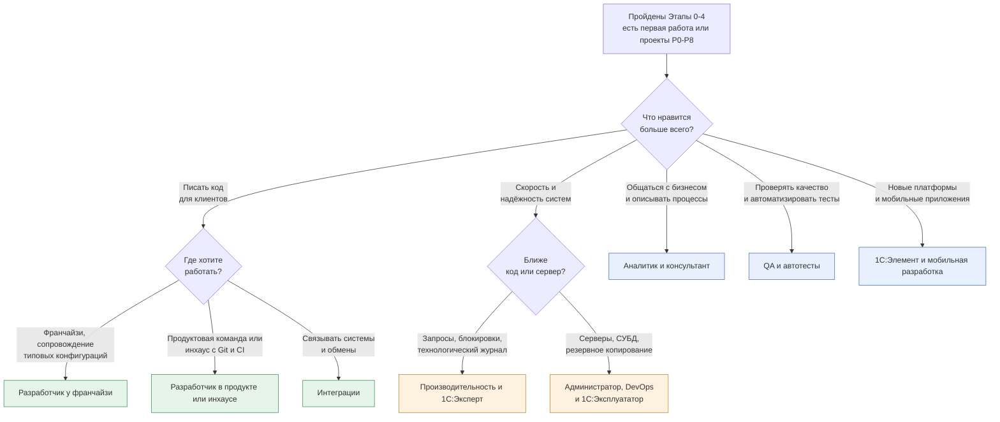

# Треки специализации

[🗺 Оглавление](../README.md) | [Разработчик у франчайзи →](developer-franchise.md)

> Актуализировано: сентябрь 2026.

Трек — это выбор направления на Этапе 7 (см. [02_Timeline.md](../02_Timeline.md)). Пока вы не прошли Этапы 0–4 («Минимальный путь до первой работы»), трек выбирать рано: базовые навыки нужны во всех восьми. Этот файл помогает сравнить треки и выбрать первый. Подробности по каждому направлению лежат в отдельном файле.

## 🧭 Как пользоваться

1. Пройдите Этапы 0–4 и сдайте проекты P0–P8 (список — в [07_Projects.md](../07_Projects.md)).
2. Ответьте на вопросы схемы ниже и выберите один трек. Второй берите только после первого.
3. Откройте файл трека. Все треки построены по одному шаблону: чем занимается специалист, где работает, навыки по уровням, инструменты, сертификация, проекты, план входа на 3–6 месяцев, ресурсы.
4. Трек не отменяет базу: он расширяет её. Треки пересекаются, и переход между ними обычно занимает месяцы, а не годы.

## 🎯 Как выбрать трек

Цвета: зелёные — направления разработки, оранжевые — эксплуатация и производительность, синие — смежные роли и ветка на будущее.

## 📊 Сводная таблица треков

| Трек | Для кого | Ключевые темы | Сертификаты | Спрос |
|---|---|---|---|---|
| [Разработчик у франчайзи](developer-franchise.md) | Первая работа, сопровождение клиентов | Типовые (БП, УТ, ЗУП), обновления, внешние формы, расширения, обмены, сервисы ИТС, маркировка по инструкции | Профессионал по платформе → Специалист по платформе | Самый массовый вход в профессию |
| [Разработчик в продукте или инхаусе](developer-product.md) | Команды с Git и CI | 1C:EDT, Git, код-ревью, YAxUnit, Vanessa Automation, SonarQube, CI, архитектура | Профессионал → Специалист по платформе | Стабильный, требования выше |
| [Интеграции](integration.md) | Middle и выше | HTTP и SOAP, OData, КД3 и EnterpriseData, 1С:Шина, брокеры через внешние компоненты или HTTP, идемпотентность | Отдельного экзамена нет | Растёт вместе с числом систем |
| [Производительность и 1С:Эксперт](performance-expert.md) | Senior и выше | Технологический журнал, кластер, планы запросов PostgreSQL и MS SQL, блокировки, нагрузочное тестирование, APDEX | Профессионал по технологическим вопросам → Эксперт по технологическим вопросам | Узкий, вакансий мало, вилки публикуют редко |
| [Администратор, DevOps и 1С:Эксплуататор](administrator-operator.md) | Смежная роль | Кластер, PostgreSQL для 1С, Linux, лицензии, резервное копирование, мониторинг, безопасность | Профессионал по эксплуатации ИС → 1С:Эксплуататор | Постоянный, особенно при переходе на Linux |
| [QA и автотесты](qa-automation.md) | Смежная роль | Vanessa Automation и Turbo Gherkin, YAxUnit, 1С:Тестировщик, 1С:Сценарное тестирование, Allure | Отдельного экзамена нет | Нишевый, встречается в крупных командах |
| [Аналитик и консультант](analyst-consultant.md) | Смежная роль, гибридные позиции | Процессы, BPMN, ТЗ, гэп-анализ, методология типовых конфигураций, 1С:СППР | Профессионал по конфигурации → Специалист-консультант | Постоянный, гибридные роли на рынке есть |
| [1С:Элемент и мобильная разработка](element-and-mobile.md) | Опциональная ветка | Элемент: язык, права, RLS, HTTP-сервисы; мобильная платформа: автономный режим | Аттестация по Элементу, см. файл трека | Пока нишевый |

Столбец «Спрос» качественный. Числа по вакансиям и зарплатам — только в [13_Career.md](../13_Career.md), с источником и периодом. Сертификаты подробно описаны в [04_Certifications.md](../04_Certifications.md): формат экзаменов и порядок сдачи уточняйте на официальных страницах 1С.

## 🧩 Что общего у всех треков

- База платформы: язык, запросы, регистры, формы, отчёты на СКД, права. Без неё ни один трек не «держится».
- Стандарты разработки 1С на its.1c.ru/db/v8std: одинаковы для всех направлений.
- Чтение чужого кода и типовых конфигураций: даже аналитик и QA работают с ними каждый день.
- Практика в открытых проектах и портфолио: см. [07_Projects.md](../07_Projects.md) и [13_Career.md](../13_Career.md).
- Работа с ИИ-ассистентами и проверка их ответов: см. [09_AI_Development.md](../09_AI_Development.md).

## 🔗 Как треки связаны с этапами и проектами

| Трек | Основа на Этапах | Проекты трека и смежные |
|---|---|---|
| Разработчик у франчайзи | Этапы 4–5 | P7, P8, P9, P12, P15 |
| Разработчик в продукте или инхаусе | Этапы 5–6 | P8, P13, P15 |
| Интеграции | Этап 5 | P10, P11, P12 |
| Производительность и 1С:Эксперт | Этапы 5–7 | P14, P13 |
| Администратор, DevOps и 1С:Эксплуататор | Этап 5, затем Этап 7 | P14 (замеры и журнал), P13 (автоматизация) |
| QA и автотесты | Этап 6 | P13 |
| Аналитик и консультант | Этапы 4–5 | P4, P5, P6 (предметная область), P17 |
| 1С:Элемент и мобильная разработка | Этап 7 | P16 (мобильное приложение), P10 |

Привязка проектов ориентировочная: точные критерии приёмки и рекомендации по трекам смотрите в [07_Projects.md](../07_Projects.md) и в файле выбранного трека.

## 💡 Типичные вопросы при выборе

- «Можно ли выбрать сразу Эксперта?» Нет: направление рассчитано на опытных разработчиков (Senior и выше). Путь к нему идёт через Профессионала по технологическим вопросам. Пререквизитом Эксперта не является 1С:Специалист.
- «Нужен ли сертификат, чтобы войти в трек?» Нет. Сертификаты подтверждают уровень и помогают в отборе, но портфолио и умение решать задачи весят больше. Подробности — в [04_Certifications.md](../04_Certifications.md).
- «Что, если трек не подошёл?» Смена трека нормальна: база одинакова, а интеграции, производительность и тесты естественно вырастают из работы разработчика.
- «Что брать при выходе на рынок?» Начните с франчайзи или инхауса: вход в профессию идёт именно так. Дальше специализируйтесь. Рынок IT в 2025–2026 годах — рынок работодателя, поэтому портфолио и проекты особенно важны (см. [13_Career.md](../13_Career.md)).
- «Гибридные роли существуют?» Да, «программист-консультант» и подобные позиции на рынке есть. Треки аналитика и разработчика можно сочетать.

## 🔗 Что читать дальше

- Таймлайн этапов: [02_Timeline.md](../02_Timeline.md)
- Матрица компетенций по уровням: [03_Competencies.md](../03_Competencies.md)
- Сертификаты: [04_Certifications.md](../04_Certifications.md)
- Проекты: [07_Projects.md](../07_Projects.md)
- Собеседование: [08_Interview.md](../08_Interview.md)
- Карьера и рынок: [13_Career.md](../13_Career.md)
- Реестр источников: [SOURCES.md](../SOURCES.md)

[🗺 Оглавление](../README.md) | [Разработчик у франчайзи →](developer-franchise.md)
