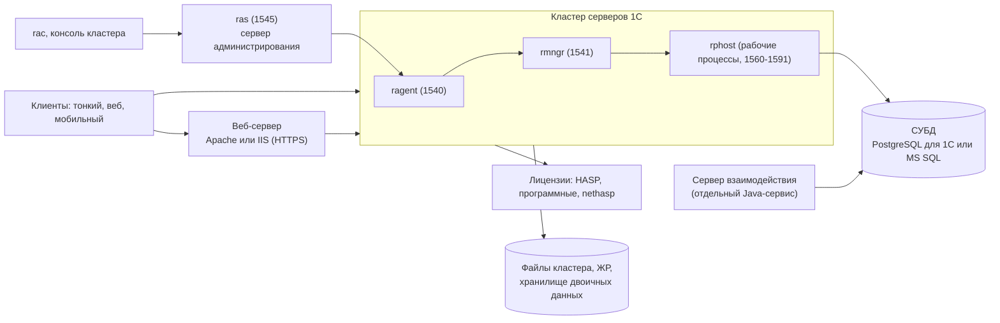
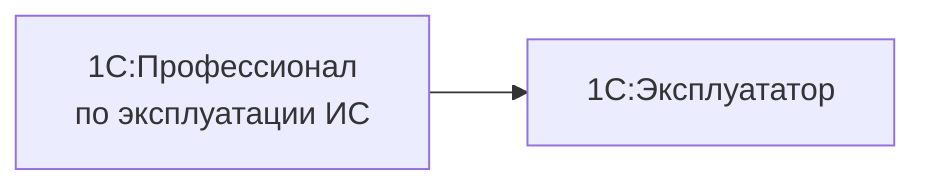

# Администратор, DevOps и 1С:Эксплуататор

[← Все треки](README.md) | [🗺 Оглавление](../README.md)

> Актуализировано: сентябрь 2026.

Трек для тех, кто отвечает за то, чтобы **система 1С работала, восстанавливалась и обновлялась предсказуемо**: сервер и кластер, СУБД, веб-публикация, лицензии, резервные копии, мониторинг, безопасность, автоматизация. Это смежная роль: она не требует глубокого программирования, но опирается на понимание того, как платформа устроена изнутри (клиент-серверное взаимодействие, транзакции, фоновые задания, расширения). Поэтому разработчикам с Этапами 0–4 из [02_Timeline.md](../02_Timeline.md) он даётся легче, чем «чистым» системным администраторам, а тем, в свою очередь, полезно пройти Этап 1 (язык и платформа), чтобы читать конфигурацию и понимать жалобы разработчиков.

Чем отличается от [трека производительности](performance-expert.md): эксперт по производительности ищет **причину** медленной работы и меняет код и структуру данных. Администратор отвечает за **сервис целиком**: установка, отказоустойчивость, копии, лицензии, обновления, безопасность. На практике роли пересекаются на уровне СУБД, кластера и технологического журнала; подробные приёмы работы с ТЖ, запросами и блокировками вынесены в трек производительности и здесь не дублируются.

## 🎯 Кто это и чем занимается

- Устанавливает и обновляет платформу (8.3.27 и 8.5.1), сервер приложений, веб-сервер и СУБД на Windows или Linux; ведёт несколько версий платформы рядом.
- Создаёт и сопровождает кластер серверов 1С: администраторы кластера, рабочие серверы, требования назначения функциональности, лимиты памяти, отказоустойчивость.
- Развёртывает PostgreSQL в сборке для 1С (реже MS SQL), настраивает резервное копирование, репликацию, обслуживание (статистика, очистка), следит за ростом.
- Управляет лицензиями: серверные и клиентские, программные и аппаратные, community-лицензии для разработчиков.
- Публикует базы на веб-сервере по HTTPS, настраивает аутентификацию (пароль, OIDC, Kerberos, второй фактор).
- Строит мониторинг и оповещения, хранит и разбирает журналы (ЖР и ТЖ), отвечает на инциденты по регламенту.
- Автоматизирует всё повторяемое: Ansible, Terraform для managed-PostgreSQL, скрипты `rac`, `ibcmd`, CI-пайплайны развёртывания.
- Обеспечивает требования безопасности: роли администраторов, профили безопасности, шифрование каналов, обезличенные копии для разработки, требования регуляторов.

## 🧭 Где работает и какой спрос

| Контекст | Что делает | Особенность |
|---|---|---|
| Инхаус-ИТ компании | Полный цикл эксплуатации: сервер, СУБД, копии, обновления, поддержка пользователей | Широкий профиль; часто совмещается с ролью системного администратора |
| Франчайзи и ИТ-аутсорсинг | Обслуживание баз клиентов, установка и обновление, перенос на Linux и PostgreSQL | Много разных сред и версий; нужны регламенты и документация |
| Хостинг и облако (Фреш, ГРМ, IaaS, managed PostgreSQL) | Эксплуатация парка баз, шаблоны, автоматизация, мониторинг | Масштаб и автоматизация важнее ручной настройки |
| Продуктовая и DevOps-команда | Стенды, CI/CD, тестовые базы, обезличенные копии | Пересекается с [треком разработчика в продукте](developer-product.md) и [QA](qa-automation.md) |
| Госсектор и КИИ | Защищённая платформа, отечественные ОС и СУБД, требования ФСТЭК | Свои ограничения на ПО и ИИ-инструменты (см. раздел про безопасность) |

- Спрос: оценка авторов, не статистика. Вакансий с названием «DevOps для 1С» немного; чаще администрирование входит в роль системного администратора или ведущего разработчика. Рынок и вилки — только в [13_Career.md](../13_Career.md), здесь цифр нет намеренно.
- Тренды, которые определяют работу (по нашей оценке): импортозамещение ОС и СУБД (Astra Linux, РЕД ОС, Альт, PostgreSQL в сборках для 1С), уход от MS SQL как основной СУБД, постепенный переход части решений на 8.5.1 (большие типовые конфигурации в 2026 году работают на 8.3.27, УНФ и Розница с 3.0.13 перешли на 8.5), облака и managed-сервисы.
- Гибридный профиль (разработчик, который умеет развернуть и обновить стенд) ценится сильнее, чем «только админ». Это сильный путь для разработчиков в продуктовых командах.

## 📊 Навыки по уровням

Легенда: 🔴 обязательно · 🟡 желательно · 🔵 по контексту. Уровни Junior, Middle, Senior здесь задают глубину работы с эксплуатацией, а не сроки; модель компетенций разработчика MC-6-001 и сопоставление с вашей ролью — в [03_Competencies.md](../03_Competencies.md).

| Область | Junior (вход в трек) | Middle | Senior |
|---|---|---|---|
| ОС и сеть | 🔴 Администрирование Linux или Windows Server: пользователи, права, службы, диски, брандмауэр, DNS | 🔴 `systemd`, журналы, SSH, ограничения ресурсов, регистр имён файлов, монтирование сетевых ресурсов | 🟡 Укрепление ОС (hardening), отечественные ОС в сертифицированном исполнении, Kerberos |
| Установка платформы | 🔴 Установка сервера и клиента, учебная версия и community-лицензия | 🔴 Несколько версий платформы рядом, службы сервера и RAS, обновление платформы по регламенту | 🔴 Автоматизированная установка, ARM-сборки сервера и клиенты для Linux ARM64 и «Эльбрус», миграция 8.3.27 → 8.5.1 |
| Кластер 1С | 🔴 Состав процессов и порты, создание кластера и базы, администратор кластера | 🔴 `rac` и `ras`, рабочие серверы, память, требования назначения, блокировка сеансов и заданий | 🔴 Отказоустойчивость, балансировка, расчёт оборудования, экспорт и импорт настроек |
| Веб-публикация | 🟡 Публикация базы на Apache или IIS | 🔴 HTTPS, `default.vrd`, публикация HTTP-сервисов, OIDC | 🔴 Балансировщик и обратный прокси, клиентские сертификаты, отдельные пулы |
| СУБД | 🟡 Подключение к PostgreSQL для 1С, `psql` | 🔴 Установка PostgreSQL для 1С, `initdb`, `postgresql.conf` по методике, обслуживание | 🔴 Репликация, Patroni, пулер, миграция с MS SQL |
| Резервное копирование | 🔴 Выгрузка `.dt`, копия файловой базы | 🔴 Копии СУБД с архивом WAL, проверка восстановления, перечень «что копировать» | 🔴 RPO и RTO, регламент учений, копии в изолированном хранилище |
| Лицензирование | 🔴 Виды лицензий, программные и аппаратные, `ring` | 🔴 Серверные КОРП, ПРОФ, МИНИ и что доступно только в КОРП | 🔵 Менеджер лицензий (8.5.4 в тесте), облачные схемы аренды |
| Безопасность | 🔴 Администраторы кластера, пароли и политики, минимальные права | 🔴 Уровни безопасности соединений, HTTPS, профили безопасности (КОРП), ЖР и аудит | 🔴 Приказ ФСТЭК № 117, 8.3z, 152-ФЗ, обезличивание копий, SIEM |
| Мониторинг | 🟡 Загрузка CPU, памяти, диска, число сеансов | 🔴 Zabbix или Prometheus с экспортёром, оповещения, хранение ТЖ | 🔴 Постоянный разбор ТЖ в ClickHouse, SLO и оповещения «для пользователя» |
| Автоматизация | 🟡 Скрипты `bash` или PowerShell | 🔴 Ansible-роли, `rac` и `ibcmd` в скриптах, `vanessa-runner` | 🔴 IaC для кластера и СУБД, пайплайны развёртывания, стенды в Docker |
| Процессы | 🟡 Заявки, инциденты, база знаний | 🔴 Регламент обновлений, runbook, окна работ | 🔴 Управление изменениями, планирование мощностей, межкомандная коммуникация |

## 🧩 Ядро трека

### Архитектура: что где живёт



- Порты по умолчанию: `ragent` — 1540, `rmngr` — 1541, `rphost` — диапазон 1560:1591, RAS — 1545. Подключайтесь к ним только из доверенных сегментов сети и закрывайте остальное межсетевым экраном.
- **Сервер взаимодействия** — отдельный Java-сервис со своей базой PostgreSQL, а не часть `rphost`. В официальном стенде `docker_fresh` он собран из компонентов `1c-cs-server-small`, `1c-cs-hazelcast`, `1c-cs-elasticsearch`, использует Java 17; проверка здоровья в стенде — `http://localhost:8087/rs/health`. Условия лицензирования локальной установки не подтверждены: уточняйте у 1С.
- Режимы работы: файловый (малое число пользователей, без сервера), клиент-серверный (кластер плюс СУБД), **автономный сервер** `ibsrv` (клиент-серверный режим без полноценного кластера: используют EDT и стенды разработчиков; поддерживает тонкий, веб-клиент и мобильное приложение, с 8.3.23 — толстый клиент и Конфигуратор), облако.
- Облака: **1С:Фреш** — облако фирмы «1С» для конечных пользователей; **1С:ГРМ** — конструктор облака для **партнёров** 1С (они продают облако под своим брендом); Selectel («Готовое облако 1С», аренда лицензий ПРОФ и КОРП; МИНИ и временные бесплатные лицензии там не поддерживаются) и Yandex Cloud (managed PostgreSQL для 1С).

### Системные требования и ОС

- Официальные требования публикует 1С на странице [системных требований](https://v8.1c.ru/tekhnologii/sistemnye-trebovaniya-1s-predpriyatiya-8/): версии ОС, СУБД и браузеров меняются от сборки к сборке, поэтому перед проектом сверяйтесь именно с ней и фиксируйте дату проверки. Перечни из старых глав документации (Windows XP, Astra 1.4) для 2026 года не используйте.
- Сервер работает на Windows и Linux x86-64; есть ARM-сборки сервера для Linux (по крайней мере с 8.3.26). Клиенты: Windows, Linux (включая ARM64 и «Эльбрус»), macOS.
- Linux-дистрибутивы, которые встречаются в практике: Astra Linux, РЕД ОС, Альт, Debian, Ubuntu. Официальный перечень сертифицированных ОС (версии Astra, РЕД ОС, Альт) мы не проверяли: смотрите страницу требований и требования вашего заказчика. В Альт есть метапакет `1c-preinstall` (ветка 8.5 проверена с 8.5.1.1302); официальный стенд 1С собран на Debian.
- Windows Server 2012 и 2012 R2: расширенная поддержка Microsoft закончилась 10.10.2023, платные ESU третьего года идут до 13.10.2026 ([Microsoft Learn](https://learn.microsoft.com/lifecycle/announcements/windows-server-2012-r2-end-of-support)). Заявлений 1С о прекращении поддержки Windows 7/8 и Server 2012 в 8.5 мы не нашли: планируйте обновление ОС исходя из политики Microsoft и официальной страницы требований.
- Для госзаказчиков: защищённая линия «1С:Предприятие 8.3z» и стандарт #785 (минимальная версия платформы в решениях не выше последнего сертифицированного релиза 8.3z; номер публикуется на [online.1c.ru](https://online.1c.ru/catalog/files/13352/)). Номер, уровень доверия и срок сертификата в нашем досье не подтверждены.

**Особенности Linux (по ИТС, глава «Кроссплатформенные решения»)**, которые администратор обязан знать, потому что на них падают миграции с Windows:

- имена файлов и каталогов **регистрозависимы** (`file.txt` и `File.txt` — разные файлы); нет дисков и UNC-путей `\\server\share`: сетевой ресурс монтируют;
- COM, OLE и ActiveDocument **недоступны**: интеграции через COM переписывают на HTTP, файловый обмен или внешние компоненты Native API;
- маска `*.*` означает «файлы с точкой в имени»; разделители путей разные: в коде используют `ПолучитьРазделительПути()` и `ПолучитьМаскуВсеФайлы()`;
- нужны шрифты (стилевые или MS Core Fonts); `ПолеHTMLДокумента` работает на WebKit;
- Kerberos-аутентификация на Linux-сервере требует keytab-файла (описана в руководстве администратора; в промышленных Ansible-ролях под неё есть отдельная роль);
- аппаратные ключи HASP: драйвер `haspd`; в контейнерах и LXC ключ пробрасывается, на практике используют USB-over-IP.

Совет «пишите все пути строчными» решением не является: это допустимая договорённость внутри команды, но проблему регистра и разделителей она не снимает.

### Установка сервера на Linux

Официальный стенд 1С устанавливает платформу универсальным инсталлятором `setup-full-<версия>-x86_64.run` в режиме `--mode unattended` с перечнем компонентов `--enable-components` (сервер, веб-расширения, русский язык и так далее). Набор компонентов и параметров смотрите в руководстве администратора вашей версии. Дистрибутивы скачиваются с [releases.1c.ru](https://releases.1c.ru) по учётной записи ИТС.

```bash
# Схема: компоненты уточняйте для своей версии. Установка выполняется от root.
./setup-full-<версия>-x86_64.run --mode unattended \
    --enable-components server,ws,ru

# Службы сервера и RAS по образцу практиков: по одной службе на версию платформы
# (имя вида srv1cv8-<версия>@default и ras-<версия>@<экземпляр>);
# unit-файл может потребовать подключения (systemctl link) - проверьте на своей версии.
systemctl enable --now srv1cv8-<версия>@default.service
systemctl status srv1cv8-<версия>@default.service
journalctl -u srv1cv8-<версия>@default.service --since "10 min ago"
```

Рекомендации по эксплуатации:

- служба сервера работает от отдельной непривилегированной учётной записи (на Linux её создаёт установщик; служебные файлы кластера должны быть доступны только ей);
- каталоги кластера, ТЖ и копий держите на отдельных томах: переполнение диска остановит работу сильнее, чем нехватка CPU;
- после установки **администраторы центрального сервера и кластера не заданы**: пока список пуст, любой, кто может подключиться к центральному серверу, получает полные административные права. Первое действие после установки — создать администраторов (см. ниже);
- новую версию платформы ставьте **рядом** со старой и переключайте базы по очереди (на сервере служба на версию), а не «поверх».

### Кластер: `ras`, `rac`, администраторы

RAS (сервер администрирования) запускается отдельно и принимает команды консоли `rac`. Схема команд ниже; точный синтаксис, указание адреса RAS на другом хосте и параметры сверяйте по справке `rac` и руководству администратора своей версии. Идентификаторы кластера и базы подставляйте из вывода предыдущих команд.

```bash
# Запуск RAS (порт 1545), агент на этом же сервере (порт 1540)
ras cluster --daemon --port=1545 localhost:1540

# Список кластеров; дальше подставляйте идентификатор в --cluster
rac cluster list

# Администраторы центрального сервера и кластера: два разных списка
rac agent admin register --name=ops --pwd='<пароль>' --auth=pwd
rac cluster admin register --cluster=<id> --name=ops --pwd='<пароль>' --auth=pwd \
    --agent-user=ops --agent-pwd='<пароль>'

# Обзор: базы, процессы, сеансы, блокировки (после создания администратора нужны учётные данные)
rac infobase summary list --cluster=<id> --cluster-user=ops --cluster-pwd='<пароль>'
rac process list --cluster=<id> --cluster-user=ops --cluster-pwd='<пароль>'
rac session list --cluster=<id> --infobase=<id_базы> --cluster-user=ops --cluster-pwd='<пароль>'
rac lock list --cluster=<id> --infobase=<id_базы> --cluster-user=ops --cluster-pwd='<пароль>'

# Окно обслуживания: запретить новые сеансы и регламентные задания
rac infobase update --cluster=<id> --infobase=<id_базы> \
    --infobase-user=<админ> --infobase-pwd='<пароль>' \
    --cluster-user=ops --cluster-pwd='<пароль>' \
    --sessions-deny=on --scheduled-jobs-deny=on \
    --denied-message='Плановые работы до 22:00' --permission-code=<код>
```

Что нужно понимать про кластер:

- `rac` принимает пароль параметром командной строки, а он виден в списке процессов и истории оболочки. Запускайте такие скрипты от выделенной учётной записи, храните пароли в хранилище секретов, а не в самих скриптах, и не вставляйте реальные пароли в репозиторий.
- RAS не должен быть доступен из пользовательской сети: ограничьте порт 1545 адресами администраторов и серверов мониторинга.
- Параметры памяти рабочих серверов существуют давно (с 8.3.8): «Допустимый объём памяти» с интервалом превышения (при постоянном превышении процесс перезапускается) и, только в КОРП, «Безопасный расход памяти за один вызов», «Максимальный объём памяти рабочих процессов», «Объём памяти, до которого сервер считается производительным», «Количество ИБ на процесс».
- **Требования назначения функциональности** задают, на каком рабочем сервере выполняются те или иные сервисы и задания (например, вынести регламентные задания и обмены на отдельный сервер). Балансировка и расширенное управление распределением — давние возможности, часть из них только в КОРП.
- **Уровень отказоустойчивости** кластера — сколько рабочих серверов может одновременно выйти из строя без аварийного завершения сеансов; рост уровня стоит производительности, потому что серверы синхронизируют данные сервисов. Новые соединения возможны, пока жив хотя бы один **центральный** сервер, поэтому нужно не менее двух центральных серверов. Отказоустойчивость СУБД кластер не обеспечивает: для неё нужны репликация и Patroni (см. раздел про СУБД).
- Из недавнего: экспорт и импорт настроек кластера (8.3.25), назначение каталогов данных сервисов кластера (8.3.26). В тестовой 8.5.4 заявлены улучшенный мониторинг памяти кластера, индикатор применения требований назначения функциональности, новые метрики в HTTP-сервисе метрик кластера (сеансовые данные, управляемые блокировки, рабочие процессы) и расширенные профили безопасности; на 29.09.2026 рабочей версией 8.5.4 не подтверждена, поэтому в проектах опирайтесь на 8.3.27 и 8.5.1.
- Экспорт настроек кластера — это не полноценный IaC. Инфраструктуру описывают через Ansible или Terraform плюс `rac`, `ras`, `ibcmd`.

Расчёт серверного оборудования ведётся по методике ИТС (раздел [методических материалов](https://its.1c.ru/db/metod8dev); по вторичным источникам это статья 5810, номера статей проверяйте при открытии). Универсальных цифр «столько-то ядер на сто пользователей» не существует: нагрузка зависит от конфигурации, регламентных операций и объёмов данных.

### Автономный сервер и `ibcmd`

`ibsrv` даёт клиент-серверный режим без кластера, `ibcmd` — командную утилиту для работы с базой: создание и выгрузка базы, выгрузка и загрузка конфигурации, пакетные операции (группа команд `infobase` выполняется без остановки сервера). Его часто используют в CI и автоматизации: он не требует RAS. Параметры и примеры выгрузки конфигурации в файлы — в главе «Автономный сервер» [руководства администратора](https://kb.1ci.com/1C_Enterprise_Platform/Guides/Administrator_Guides/1C_Enterprise_8.3.27_Administrator_Guide/Chapter_7.Standalone_server/7.4._Examples_of_managing_and_starting_the_standalone_server/7.4.13._Dumping_configurations_to_files_Restoring_configurations_from_files/).

```bash
# Схема выгрузки базы в .dt прямым подключением к СУБД; параметры уточняйте в справке ibcmd
ibcmd infobase dump --dbms=PostgreSQL --db-server=localhost --db-name=erp \
    --db-user=<пользователь> --db-pwd='<пароль>' \
    --user=<админ_1С> --password='<пароль_1С>' /backup/erp.dt
```

### Веб-публикация

- Публикация выполняется на Apache или IIS (утилита `webinst` или диалог Конфигуратора); результат — каталог с файлом `default.vrd`, в котором описаны публикуемые HTTP-сервисы, OIDC и прочие параметры.
- Наружу публикуйте **только HTTPS**. TLS в платформе работает на участке «клиент — веб-сервер» (в том числе с клиентскими сертификатами); канал «веб-сервер — кластер» шифруется собственным протоколом платформы по уровню безопасности информационной базы.
- Отдельная публикация для интеграций (HTTP-сервисы) и для пользователей упрощает ограничение доступа, лимиты и мониторинг. Эндпоинт мониторинга (см. ниже) не выставляйте в интернет.
- Linux-клиент не использует хранилище сертификатов Windows: проверяйте цепочку доверия на самих клиентских машинах.

### Лицензирование

Слово «ПРОФ» и «КОРП» имеет **два разных смысла**: редакции прикладных решений (базовая, ПРОФ, КОРП) и серверные лицензии платформы (МИНИ, обычная, КОРП). Администратору нужны вторые.

| Лицензия | Что даёт (по ИТС) |
|---|---|
| Клиентская | Право подключения клиента; бывает «обычная» (все возможности) и «базовая» (1 пользователь, без Конфигуратора, клиент-сервера и веб-клиента) |
| Серверная обычная (ПРОФ) | Клиент-серверный вариант без ряда возможностей, перечисленных ниже |
| Серверная КОРП | Все возможности платформы, только 64-битный сервер |
| Серверная МИНИ | Ограничения обычной плюс не больше 1 рабочего сервера, 5 клиентских сеансов и 1 сеанса Конфигуратора; продукт «Сервер МИНИ на 5 подключений» продаётся |

- У обычной (ПРОФ) лицензии нет (по ИТС 8.3.8; перечень сверяйте с [разделом о видах лицензий](https://its.1c.ru/db/v851doc/bookmark/adm/TI000000551) в документации 8.5.1): фонового обновления конфигурации БД, расширенного управления распределением по серверам, гибкого управления памятью, стратегии балансировки, внешнего управления сеансами, профилей безопасности, обновления тонкого клиента с сервера, публикации списка баз.
- Только с КОРП (по руководству разработчика 8.5.1): фоновое обновление конфигурации БД, индексы объектов метаданных, события аудита прав доступа, механизм копий базы данных, более одного процесса Дата акселератора.
- Ограничение ПРОФ «12 ядер» первоисточником не подтверждено: его приводят практики. Считайте это «по данным практиков» и проверяйте у поставщика лицензий.
- Хранение: **аппаратные** ключи HASP (локальные или сетевые, `nethasp.ini` с `ServerName=`) и **программные** лицензии. Программные лицензии активирует утилита `ring` из «Инструментов для работы с лицензиями» (в официальном стенде версия 0.15.1.7), файлы лежат в `/var/1C/licenses`; программная лицензия привязывается к оборудованию и «слетает» при его изменении, поэтому перед миграцией ВМ предупредите владельца лицензий.

```bash
# Схема активации программной лицензии (остальные параметры - по справке ring)
ring license activate --first-name <Имя> --serial <рег_номер> --pin <пин_код>
```

- **Community-лицензия** (в документации «лицензия для разработчиков»): учётная запись на developer.1c.ru или 1c-dn.com, владелец — только физическое лицо, привязка — только к компьютеру, перед активацией принимается лицензионное соглашение, срок действия ограничен, поэтому её регулярно переактивируют (скрипты сообщества делают это автоматически). Условия использования берите только из текста соглашения. Она нужна для учебных и тестовых стендов: см. [портал разработчика](https://developer.1c.ru/applications/Console?state=community).
- **Менеджер лицензий** («1С:Предприятие — менеджер лицензий») заявлен в тестовой 8.5.4: распределение лицензий по базам, продуктам и «пространствам лицензирования»; на ИТС есть инструкция «Особенности лицензирования при переходе на версии платформы 8.5.4» (см. [методические материалы](https://its.1c.ru/db/metod8dev/content/6041/hdoc)). Официального продукта «Центр лицензирования» мы не нашли.

### СУБД: PostgreSQL для 1С

**Ванильный PostgreSQL для 1С не используют**: нужна сборка с патчами и расширениями для 1С (`mchar`, `fulleq`, `fasttrun`, `online_analyze`, `plantuner`).

| Вариант | Где взять | Заметки |
|---|---|---|
| PostgreSQL от 1С | releases.1c.ru, проект `AddCompPostgre`; [страница](https://v8.1c.ru/platforma/postgresql/) | Официальный стенд 1С с платформой 8.5.1.1302 использует 18.3-5.1C; по описанию 1С, бесплатна в промышленных системах |
| Postgres Professional для 1С | форма на 1c.postgres.ru; пакеты `postgrespro-1c-17`, `postgrespro-1c-18` | Бесплатная сборка «Postgresql for 1C»; поддерживает Astra, Альт, РЕД ОС и другие ОС |
| Альт | пакет `postgresql18-1C` (18.4-alt5 от 16.08.2026) | Собирается самим Альтом с патчем 1С |
| Коммерческие СУБД на базе PostgreSQL | Postgres Pro, Tantor SE 1C, Platform V Pangolin | Статус «одобрено для 1С» по вторичным источникам: уточняйте у вендора |
| Managed-сервисы | Yandex Managed PostgreSQL: кластеры 14-1c … 18-1c | Расширения для 1С включены; Terraform-модуль `yc-postgresql-1c`; подключение через порт 6432; для отказоустойчивости не меньше двух дополнительных хостов в разных зонах |

Официальной матрицы «версия платформы — версия PostgreSQL» открыть не удалось: сверяйтесь с документацией выбранной сборки и страницей системных требований. Практика 2026 года: 8.3.27 и 8.5.1 проверены с PostgreSQL 18.

Минимальный стенд (см. [практикум А](#-проекты-трека)):

```bash
# Каталог данных и пути зависят от пакета (например, pg-setup initdb в сборке Postgres Pro).
# Ручная инициализация, которую советуют практики:
initdb -D <каталог_данных> --encoding=UTF8 --locale=ru_RU.UTF-8 --data-checksums
```

Что обязано быть настроено в эксплуатации (подробная диагностика и тюнинг запросов — в [треке производительности](performance-expert.md)):

- параметры памяти и автоочистка по методике ИТС (раздел [методических материалов](https://its.1c.ru/db/metod8dev), «настройки PostgreSQL»; по вторичным источникам это статья 5866); проверяйте номера статей: они меняются;
- мониторинг роста баз, «долгих» транзакций и очистки:

```sql
-- Размеры баз
SELECT datname, pg_size_pretty(pg_database_size(datname)) AS size
FROM pg_database
ORDER BY pg_database_size(datname) DESC;

-- Долгие транзакции (мешают очистке мёртвых версий строк)
SELECT pid, now() - xact_start AS age, state, left(query, 120) AS query
FROM pg_stat_activity
WHERE xact_start IS NOT NULL
ORDER BY xact_start
LIMIT 10;

-- Отставание реплик
SELECT application_name, state, replay_lag
FROM pg_stat_replication;
```

- отказоустойчивость СУБД: потоковая репликация и Patroni (у практиков есть стенды Patroni на PostgreSQL для 1С) либо managed-кластер; «механизм копий БД» платформы (КОРП) — это не отказоустойчивость, а отдельная функция;
- **MS SQL Server** — «наследие и миграции». Он остаётся поддерживаемой СУБД, но SQL Server 2016 снят с поддержки Microsoft 14.07.2026, SQL Server 2025 вышел 18.11.2025 ([Microsoft Learn](https://learn.microsoft.com/sql/sql-server/end-of-support/sql-server-end-of-support-overview)). Практики запускали 8.3.27 на SQL Server 2025, но официальная поддержка платформой не подтверждена. Oracle и IBM Db2 формально описаны в документации 8.5.1, на рынке редки: достаточно знать, что они есть.

### Резервное копирование и восстановление

Копия, которую не пробовали восстанавливать, копией не считается. Начните с **RPO** (сколько данных можно потерять) и **RTO** (за сколько нужно вернуть сервис), от них зависят способы.

| Что копировать | Как | Замечания |
|---|---|---|
| База в СУБД | Физическая копия PostgreSQL с архивом WAL (`pg_basebackup`, pgBackRest или WAL-G); для малых баз и переносов — выгрузка `.dt` | `.dt` не заменяет копию СУБД на большой базе: долго и требует остановки работы пользователей |
| Журнал регистрации | Копирование каталога `1Cv8Log`; программно `СкопироватьЖурналРегистрации` и `ВыгрузитьЖурналРегистрации` | ЖР лежит **вне базы** (для клиент-сервера — в каталоге кластера) и **не входит** в выгрузку `.dt` |
| Конфигурация кластера | Экспорт настроек (8.3.25), список баз, профили безопасности, администраторы | Храните в Git без секретов |
| Файлы публикации и настройки | `default.vrd`, конфигурация веб-сервера, `logcfg.xml`, `nethasp.ini`, unit-файлы служб | Идеально — через Ansible, тогда это код |
| Лицензии | Программные: файлы в `/var/1C/licenses` и учёт пин-кодов; HASP: учёт ключей | Без учёта лицензий восстановление может остановиться на активации |
| Хранилище двоичных данных | Каталог или S3 (само хранилище — только КОРП, клиент-серверный режим) | Копируется согласованно с базой, иначе ссылки «повиснут» |
| База Сервера взаимодействия | Копия его PostgreSQL | Отдельная база, отдельный регламент |

```ini
# /etc/pgbackrest.conf: пример для PostgreSQL в сборке для 1С (пути зависят от пакета)
[global]
repo1-path=/var/lib/pgbackrest
repo1-retention-full=2
start-fast=y

[1c]
pg1-path=/var/lib/pgpro/1c-17/data
```

```bash
# В postgresql.conf: archive_mode = on
#                    archive_command = 'pgbackrest --stanza=1c archive-push %p'
pgbackrest --stanza=1c stanza-create
pgbackrest --stanza=1c check
pgbackrest --stanza=1c backup --type=full
pgbackrest --stanza=1c info
# Восстановление на другой хост (учения): сервис остановлен, каталог данных пуст или --delta
pgbackrest --stanza=1c restore --delta
```

Минимальный регламент: полная копия по расписанию, ежедневные инкрементальные, непрерывный архив WAL, копия во второе хранилище (желательно изолированное от основной сети), **учения по восстановлению раз в квартал** с замером реального RTO и записью шагов в runbook. После восстановления проверяйте не только запуск, но и целостность: «Тестирование и исправление» в Конфигураторе, проведение тестового документа, отчёт из регламентных заданий.

### Обновление платформы и конфигураций

1. Прочитайте информационное письмо 1С о версии. Новая версия платформы и версия конфигурации — разные изменения: сначала платформа, потом конфигурация, или наоборот, определяется требованиями конфигурации.
2. Сделайте копию (см. выше) и **проверьте её восстановлением** на тестовом стенде.
3. Разверните стенд с новой платформой (рядом со старой), обновите на копии, проверьте применимость расширений и внешних обработок, прогоните регресс (дымовые тесты, а при наличии BDD-сценарии Vanessa Automation).
4. Определите окно работ и откат. Обновление большой базы может идти часами: «автоматически за минуты» не бывает.
5. На время работ запретите сеансы и регламентные задания (`rac infobase update …`, см. выше, или `СоединенияИБ` из БСП).
6. «Фоновое обновление конфигурации БД» — только КОРП: большая часть работы идёт без монопольного режима, но финальная фаза принятия изменений требует монопольного доступа. Это **не zero-downtime** и автопауз «в часы пик» нет; пауза ставится вручную не более чем на 48 часов (по ИТС).
7. Откат платформы: если вы меняли алгоритм хеширования паролей на PBKDF2 (8.3.26+), при откате ниже 8.3.26 база открывается, но пользователи с новыми хешами не войдут по паролю. Перед откатом верните SHA-1 и переустановите пароли (подробности — на [Инфостарте](https://infostart.ru/1c/articles/2480616/)). Проверяйте на копии.
8. Линии платформы: 8.3.27 (ветка 8.3 закончилась, 8.3.28 не выходила) и 8.5.1 (то же ядро плюс новый интерфейс). 8.5.4 — тестовая. Большие типовые конфигурации в 2026 году работают на 8.3.27; УНФ и Розница с 3.0.13 перешли на 8.5. Официальной политики сроков поддержки версий платформы мы не нашли: ориентируйтесь на требования конфигурации и информационные письма 1С.

Блокировку сеансов на время работ можно включать не только через `rac`, но и из конфигурации: в БСП для этого есть общий модуль `СоединенияИБ` (установка и снятие блокировки соединений, ключ `/UC` с кодом разрешения для входа администратора); без БСП используются платформенные `УстановитьБлокировкуСеансов` и `ПолучитьБлокировкуСеансов` с объектом `БлокировкаСеансов`. Для установки блокировки нужны права администратора.

### Безопасность кластера и данных

Подробный справочник безопасности разработчика — в [SECURITY.md](../SECURITY.md). Для администратора важно следующее.

- **Администраторы.** Заведите администраторов центрального сервера и кластера (разные списки). Аутентификация включается автоматически, как только в списке появляется первый администратор. Личные учётные записи, а не одна общая.
- **Каналы.** Клиент — кластер: собственный протокол платформы (RSA, затем симметричное шифрование); уровни «выключено» (по умолчанию), «только соединение» (пароли не видны), «постоянно» (шифруется весь поток; возможно заметное снижение производительности). Клиент — веб-сервер: HTTPS. Кластер — СУБД: SSL средствами СУБД. Совет «все соединения кластера только через TLS» технически неточен. Используемые алгоритмы в 8.3.2x и 8.5 мы не проверяли: смотрите руководство администратора своей версии.
- **Профили безопасности кластера (КОРП).** Ограничивают файловую систему, COM, внешние компоненты, внешние модули, приложения ОС и интернет-ресурсы для каждой базы; назначаются базе и, отдельно, для безопасного режима. В БСП внешние ресурсы заявляются через `РаботаВБезопасномРежимеПереопределяемый` (стандарт #794). В тестовой 8.5.4 заявлено назначение профиля на весь кластер.
- **Пароли и вход.** Политики паролей (8.3.17), блокировка после неудачных попыток (8.3.16), второй фактор через HTTP-провайдера (8.3.14), OIDC (не позже 8.3.14; Keycloak, Avanpost и другие), JWT (8.3.21). С 8.3.26: выбор алгоритма хеширования (рекомендуется только PBKDF2-HMAC-SHA256, SHA-256 и SHA-512 для паролей не рекомендуются [OWASP](https://github.com/OWASP/CheatSheetSeries/blob/master/cheatsheets/Password_Storage_Cheat_Sheet.md)), проверка раскрытия пароля, вход по QR-коду, завершение сеансов по бездействию (по вторичному источнику может требовать КОРП: проверьте). С 8.3.27: вход по коду из электронной почты. PBKDF2 заметно тяжелее SHA-1: учитывайте при массовом входе, например в HTTP-сервисах с Basic-аутентификацией. Откат — см. раздел про обновление.
- **Аудит.** Журнал регистрации хранится вне базы: копируйте его (см. резервное копирование). События «Доступ» и «Отказ в доступе» настраиваются для персональных данных (отдельный механизм «события аудита прав доступа» доступен только в КОРП); ТЖ с событием `admin` фиксирует действия администратора кластера. Выгрузка ЖР и ТЖ в ClickHouse или Elasticsearch позволяет подключить SIEM.
- **Копии для разработки.** Обезличивайте (ФИО, телефоны, СНИЛС) и выдавайте разработчикам и ИИ-инструментам только их. Это требование 152-ФЗ и NDA. Оборотные штрафы за повторную утечку персональных данных по 420-ФЗ: от 20 млн ₽, до 500 млн ₽ (проверяйте актуальную редакцию на consultant.ru).
- **Регуляторика.** Приказ ФСТЭК № 117 (действует с 01.03.2026, заменил № 17) касается ГИС и ИС госорганов; п. 60 запрещает передавать информацию ограниченного доступа разработчику модели ИИ. Для значимых объектов КИИ действует запрет на иностранное ПО (Указ № 166 от 30.03.2022, по вторичным источникам; сверяйте с первичным текстом). Подробнее — в [10_Domain_and_Law.md](../10_Domain_and_Law.md).
- Уязвимости платформы сообщайте на bugboard.v8.1c.ru.

### Мониторинг

Метрики должны отвечать на вопрос «что сломалось для пользователя», а не только «загружен ли процессор». Минимум: доступность (эндпоинт здоровья), время ключевых операций (APDEX из [трека производительности](performance-expert.md)), CPU, память и диск серверов, память и перезапуски `rphost`, число сеансов и лицензий, размер и рост баз, свободное место, возраст последней копии, отставание реплик, ошибки ЖР.

| Задача | Инструмент (проверяйте актуальность перед внедрением) |
|---|---|
| Метрики кластера через `rac` | [prometheus_1C_exporter](https://github.com/LazarenkoA/prometheus_1C_exporter) (Prometheus и Grafana; последняя ветка релизов 2024 года) |
| Zabbix | [1c_zabbix_template_ce](https://github.com/slothfk/1c_zabbix_template_ce): рабочий сервер, сервер лицензирования, центральный сервер |
| HASP | [v8hasp-exporter](https://github.com/komarovps/v8hasp-exporter) |
| ТЖ в ClickHouse | [logt](https://github.com/rdv-team/logt), [OneSwiss](https://github.com/akpaevj/oneswiss) (в том числе экспорт ЖР и MCP-сервер для ИИ-ассистентов) |
| Официальный пакет | 1С:КИП (ЦКК, ЦУП, Тест-центр), [документация](https://its.1c.ru/db/kip); версию не называем |
| Централизованное управление парком | 1С:Управление ландшафтом, [документация](https://its.1c.ru/db/landscapedoc) |
| Коммерческие системы | перечень смотрите в каталоге [Landscape1C](https://github.com/Oxotka/Landscape1C) (сообщественный каталог) |

С 8.3.25 технологический журнал можно писать в JSON: учтите, что в нём могут быть дубли ключей, и простой десериализацией он не читается; для разбора см. [tech-log-parser](https://github.com/medigor/tech-log-parser). В ТЖ ограничивайте срок хранения (`history`) и диск: журнал «всего» создаёт нагрузку и заполняет диск. Шаблоны настройки — в [треке производительности](performance-expert.md).

Простой эндпоинт здоровья для внешнего мониторинга. Общий серверный модуль `ПроверкаРаботоспособности` (флаг «Сервер», без вызова сервера; привилегированный режим не используется, поэтому все проверки идут с правами пользователя сервиса; для конфигурации без БСП замените служебный регистр на любой небольшой объект):

```bsl
#Область ПрограммныйИнтерфейс

// Выполняет базовые проверки и возвращает результат для внешнего мониторинга.
//
// Возвращаемое значение:
//   Структура:
//     * Статус - Строка - "ok" или "fail"
//     * ВерсияПлатформы - Строка
//     * Сеансов - Число
//     * ФоновыхЗаданийАктивных - Число
//     * Проверки - Массив из Структура:
//         ** Имя - Строка
//         ** Успешно - Булево
//
Функция РезультатПроверки() Экспорт

	Проверки = Новый Массив;
	Проверки.Добавить(ПроверитьДоступностьБазы());

	Успешно = Истина;
	Для Каждого Проверка Из Проверки Цикл
		Успешно = Успешно И Проверка.Успешно;
	КонецЦикла;

	Результат = Новый Структура;
	Результат.Вставить("Статус", ?(Успешно, "ok", "fail"));
	Результат.Вставить("ВерсияПлатформы", СистемнаяИнформация.ВерсияПриложения);
	Результат.Вставить("Сеансов", ПолучитьСеансыИнформационнойБазы().Количество());
	Результат.Вставить("ФоновыхЗаданийАктивных", КоличествоАктивныхФоновыхЗаданий());
	Результат.Вставить("Проверки", Проверки);
	Возврат Результат;

КонецФункции

#КонецОбласти

#Область СлужебныеПроцедурыИФункции

Функция ПроверитьДоступностьБазы()

	Проверка = Новый Структура("Имя, Успешно", "База данных", Ложь);

	Попытка
		Запрос = Новый Запрос;
		Запрос.Текст =
			"ВЫБРАТЬ ПЕРВЫЕ 1
			|	ВерсииПодсистем.ИмяПодсистемы КАК ИмяПодсистемы
			|ИЗ
			|	РегистрСведений.ВерсииПодсистем КАК ВерсииПодсистем";
		Проверка.Успешно = Не Запрос.Выполнить().Пустой();
	Исключение
		// Подробности только в журнале регистрации, наружу они не уходят
		ЗаписьЖурналаРегистрации("Мониторинг.ПроверкаБазы", УровеньЖурналаРегистрации.Ошибка,
			, , ПодробноеПредставлениеОшибки(ИнформацияОбОшибке()));
	КонецПопытки;

	Возврат Проверка;

КонецФункции

Функция КоличествоАктивныхФоновыхЗаданий()

	Отбор = Новый Структура("Состояние", СостояниеФоновогоЗадания.Активно);
	Возврат ФоновыеЗадания.ПолучитьФоновыеЗадания(Отбор).Количество();

КонецФункции

#КонецОбласти
```

Модуль HTTP-сервиса `Здоровье` (шаблон URL `/health`, метод `GET`, обработчик `ПроверкаGET`). Сервис публикуйте во внутренней сети. Пользователю сервиса дайте минимальную роль: использование этого HTTP-сервиса и чтение регистра сведений `ВерсииПодсистем` (без права на чтение запрос вызовет исключение, и проверка всегда вернёт `fail`); достаточность прав проверьте под этим пользователем:

```bsl
Функция ПроверкаGET(Запрос)

	Результат = ПроверкаРаботоспособности.РезультатПроверки();

	Если Результат.Статус = "ok" Тогда
		Ответ = Новый HTTPСервисОтвет(200);
	Иначе
		Ответ = Новый HTTPСервисОтвет(503);
	КонецЕсли;

	Ответ.Заголовки.Вставить("Content-Type", "application/json; charset=utf-8");
	Ответ.Заголовки.Вставить("Cache-Control", "no-store");
	Ответ.УстановитьТелоИзСтроки(ВСтрокуJSON(Результат), КодировкаТекста.UTF8,
		ИспользованиеByteOrderMark.НеИспользовать);

	Возврат Ответ;

КонецФункции

Функция ВСтрокуJSON(Знач Значение)

	ЗаписьJSON = Новый ЗаписьJSON;
	ЗаписьJSON.УстановитьСтроку(Новый ПараметрыЗаписиJSON(ПереносСтрокJSON.Нет));
	ЗаписатьJSON(ЗаписьJSON, Значение);
	Возврат ЗаписьJSON.Закрыть();

КонецФункции
```

### Автоматизация, IaC и контейнеры

- **Ansible.** Готовые сообщественные роли: [magnit-ansible-linux-1c](https://github.com/magnit-tech/magnit-ansible-linux-1c) (установка платформы, службы, публикация, keytab) и [app1c.ansible](https://github.com/biguxuzz/app1c.ansible). Берите как образец, а не как готовое решение: проверяйте под свою версию платформы.
- **Terraform.** Для managed-PostgreSQL в Yandex Cloud есть модуль `yandex-cloud-examples/yc-postgresql-1c`.
- **Что нельзя автоматизировать «в лоб».** Дистрибутивы платформы скачиваются по учётной записи ИТС, поэтому их кладут во внутренний репозиторий артефактов и устанавливают оттуда; пароли — только из хранилища секретов.

```yaml
# Схема роли: установка сервера 1С из внутреннего репозитория артефактов
- name: Сервер 1С
  hosts: onec_servers
  become: true
  vars:
    onec_version: "<версия платформы>"
  tasks:
    - name: Скопировать установщик
      ansible.builtin.copy:
        src: "files/setup-full-{{ onec_version }}-x86_64.run"
        dest: "/tmp/setup-full-{{ onec_version }}-x86_64.run"
        mode: "0755"

    - name: Установить платформу
      ansible.builtin.command:
        cmd: "/tmp/setup-full-{{ onec_version }}-x86_64.run --mode unattended --enable-components server,ws,ru"
        creates: "/opt/1cv8/x86_64/{{ onec_version }}"  # типовой каталог установки

    - name: Включить службу сервера (unit-файл может потребовать systemctl link)
      ansible.builtin.systemd:
        name: "srv1cv8-{{ onec_version }}@default.service"
        enabled: true
        state: started
```

- **Docker и Kubernetes.** Официальных образов сервера 1С нет. Сама 1С публикует [docker_fresh](https://github.com/1C-Company/docker_fresh) — стенд облачной подсистемы Фреш (8 образов, 11 контейнеров, от 12 ГБ памяти) для **разработки и тестирования**. Заявления об официальной поддержке продуктивного кластера в Kubernetes мы не нашли: решение принимает команда под свою ответственность (лицензии, stateful-природа, память `rphost`). Для учёбы и CI подойдут сообщественные [onec-docker](https://github.com/firstBitMarksistskaya/onec-docker) и [onec-community-docker](https://github.com/alexandermyasnikov123/onec-community-docker) на community-лицензиях; лаборатория [1c-k8s-lab](https://github.com/cloudnative-1c/1c-k8s-lab) показывает запуск в kind. Лицензии в контейнер доставляют тремя путями: проброс HASP, программная лицензия через `ring`, сетевой сервер ключей через `nethasp.ini`.
- **Язык автоматизации 1С.** Для администрирования баз и кластеров 1С есть «1С:Предприятие.Элемент Скрипт» (ранее «1С:Исполнитель», свободно распространяется, актуальная линейка 9.x); из сообщества — OneScript и [vanessa-runner](https://github.com/vanessa-opensource/vanessa-runner) (группы команд `infobase`, `cluster` и др.).

### Типовые инциденты и первые действия

| Симптом | Что проверить сначала | Типовая причина |
|---|---|---|
| «Не найдена лицензия» при входе | `rac license list`, доступность ключа и `nethasp.ini`, срок community-лицензии, слёт программной лицензии после изменения оборудования | Ключ недоступен, лимит исчерпан, лицензия привязана к другому оборудованию |
| Все тормозит у всех | Ресурсы серверов и СУБД, память `rphost`, диск, очередь блокировок | Нехватка памяти или диска, долгие транзакции, переполненный каталог ТЖ |
| Сервис недоступен после обновления | Статус служб, `journalctl`, версия платформы в строке публикации, права на каталоги | Другая версия платформы в публикации, потеря прав, не подключён unit-файл |
| В Linux «не найден файл» после миграции | Регистр имён, разделители, UNC-пути, шрифты | Различия регистра и путей между Windows и Linux |
| Пользователи не входят после отката платформы | Алгоритм хеширования паролей | Хеши PBKDF2 не поддерживаются версией ниже 8.3.26; вернуть SHA-1 и переустановить пароли |
| Диск сервера заполнен | Каталоги ТЖ, ЖР, копий, архив WAL | ТЖ без `history`, непрерывный архив WAL без очистки |
| Резервная копия «есть, но не восстанавливается» | Журнал восстановления, согласованность файлов и базы | Копию никогда не проверяли учениями |

## 🧰 Инструменты

| Задача | Инструменты |
|---|---|
| Кластер и база | `ras`, `rac`, консоль кластера, `ibcmd`, `ibsrv`, `ring` |
| ОС | `systemd`, `journalctl`, SSH, `bash`, PowerShell (Windows) |
| Веб-публикация | Apache, IIS, `webinst`, `default.vrd` |
| СУБД | PostgreSQL для 1С, `psql`, `pg_stat_activity`, `pg_stat_replication`, pgBackRest, WAL-G, `pg_basebackup`, Patroni |
| Мониторинг | Prometheus и Grafana, Zabbix, ClickHouse, 1С:КИП |
| Автоматизация | Ansible, Terraform, OneScript, `vanessa-runner`, Элемент Скрипт |
| Стенды | `docker_fresh`, onec-docker, onec-community-docker, Proxmox или LXC |
| Лицензии | `ring`, `nethasp.ini`, community-лицензия с developer.1c.ru |

## 🎓 Сертификация



- **1С:Профессионал по эксплуатации информационных систем** — тестовая ступень (общий формат 1С:Профессионал: 14 вопросов, 30 минут, не менее 12 верных; для вида «по эксплуатации» сверяйте на 1c.ru/prof/). Это формальный пререквизит Эксплуататора.
- **1С:Эксплуататор** — экзамен по настройке и поддержке крупных информационных систем на базе 1С. Формат по одному источнику (хедж): практика — решить не менее 3 из 5 задач; теория — 14 из 20 письменных и 3 из 3 устных вопросов. Описание на [странице УЦ №1](https://uc1.1c.ru/ekzameny-1s/expluatator/); пример билета ([exam_expl.docx](https://static.1c.ru/rus/partners/training/files/exam_expl.docx)) мы не открывали. Уточняйте формат, цену и порядок записи у учебного центра: цены не называем.
- Подготовка: курс УЦ №1 [«Эксплуатация крупных информационных систем»](https://uc1.1c.ru/course/ekspluatatsiya-krupnyh-informatsionnyh-sistem/); база знаний [kb.1c.ru](https://kb.1c.ru) ([старый адрес](http://v8.1c.ru/expert/kb.htm)); технология 1cFresh ([releases.1c.ru](https://releases.1c.ru/project/FreshPublic)); «Методическое пособие по эксплуатации крупных ИС на платформе 1С:Предприятие 8» (изд. 2, [online.1c.ru](https://online.1c.ru/books/book/25227623/), по сторонним перечням).
- Это отдельная ветка: ни Профессионал по платформе, ни 1С:Специалист не обязательны. Ветка «Эксперт по технологическим вопросам» (производительность) — другая, см. [трек производительности](performance-expert.md). Общая картина — в [04_Certifications.md](../04_Certifications.md).
- Не утверждается: «многодневная процедура» и обязательность стандартов v8std на экзаменах, цены и квоты партнёров.

## 🚀 Проекты трека

Единых проектов P0–P17 для администратора нет: общая нумерация ([07_Projects.md](../07_Projects.md)) ориентирована на разработку. Полезны **P13 «Качество и CI»** (пайплайн развёртывания и проверок, смыкается с DevOps), **P14 «Найди и почини»** (производительность, диагностика на стенде) и **P15 «RLS и роли»** (права, которые администратор настраивает и аудирует). Практикумы ниже не имеют отдельных ID; результат каждого — репозиторий на GitHub с README, командами и проверками.

| Практикум | Что делаете | Результат |
|---|---|---|
| А. Linux-стенд за выходные | ВМ или LXC на Debian, Ubuntu, Astra или Альт; платформа, службы `srv1cv8-*` и `ras-*`; PostgreSQL для 1С (`initdb` с `ru_RU.UTF-8` и `--data-checksums`); публикация на Apache; community-лицензия; выгрузка через `ibcmd`, управление через `rac` | README стенда с командами и проверками |
| Б. Две платформы рядом | Поставить 8.3.27 и 8.5.1, запустить одну базу в режиме совместимости 8.3.27 на обеих, затем копию на 8.5.1 с новым интерфейсом; зафиксировать, что сломалось | Протокол миграции и откат |
| В. Копии и учения | pgBackRest с архивом WAL, выгрузка `.dt`, копия ЖР; восстановление на чистом хосте с замером RTO | Runbook и таблица «что копировать» |
| Г. Безопасность стенда | Администратор кластера, уровень безопасности «только соединение», HTTPS-публикация, политика паролей и блокировка после неудачных попыток, PBKDF2 на копии с описанием отката | Чек-лист hardening и протокол проверки |
| Д. Мониторинг | Prometheus и Grafana с экспортёром (или Zabbix с шаблоном), эндпоинт здоровья из этого файла, три оповещения с обоснованием порогов; ТЖ в ClickHouse через `logt` или OneSwiss | Дашборд и описание оповещений |
| Е. IaC | Ansible-роль установки сервера и публикации по образцу, Terraform для managed-PostgreSQL (если есть доступ к облаку) | Репозиторий с ролью и CI-проверкой |
| Ж. Отказоустойчивость | Кластер из двух серверов 1С и репликация PostgreSQL с Patroni; сценарий отключения узла; фиксация поведения сеансов | Отчёт: что пережило отказ, что нет |

Для стендов подойдут `docker_fresh` и onec-community-docker; помните: они не для продуктива.

## 📝 План входа на 3–6 месяцев

Ориентир по времени: при 10–15 часах в неделю; это оценка авторов, а не факт. Предусловие: вы уверенно работаете с Linux или Windows Server и понимаете клиент-серверную архитектуру платформы (Этап 1 из [02_Timeline.md](../02_Timeline.md)); для разработчиков — Этапы 0–4.

| Период | Что делаете | Критерий «готово» |
|---|---|---|
| Месяц 1 | Платформа 8.3.27 и 8.5.1 на стенде, кластер, `rac`, администраторы; практикум А | Рабочий стенд в Git, вы создали базу и пользователя из консоли |
| Месяц 2 | PostgreSQL для 1С: установка, подключение, обслуживание; веб-публикация по HTTPS; практикум Г | Объясните, зачем нужна именно сборка для 1С и где лежат данные |
| Месяц 3 | Копии и учения (практикум В), лицензирование (виды, `ring`, community) | Восстановление на чистом хосте с замером RTO |
| Месяц 4 | Мониторинг (практикум Д), ЖР и ТЖ, оповещения; обновление платформы по регламенту (практикум Б) | Дашборд и оповещения, протокол миграции |
| Месяц 5 | Ansible и пайплайны (практикум Е), репликация и Patroni (практикум Ж) | Развёртывание стенда одной командой |
| Месяц 6 | Подготовка к Профессионалу по эксплуатации ИС: курс, `kb.1c.ru`, пособие; оформление портфолио | Экзамен сдан или назначен; кейсы в README |

## ✅ Первые шаги на этой неделе

1. Получите community-лицензию ([developer.1c.ru](https://developer.1c.ru/applications/Console?state=community)) и поднимите сервер на ВМ. Учебной версии для этого недостаточно: она работает только в файловом варианте.
2. Создайте администратора кластера и убедитесь, что без пароля консоль больше не пускает.
3. Выгрузите базу в `.dt` (Конфигуратором и через `ibcmd`), восстановите на другой машине, запишите шаги.
4. Откройте страницу [системных требований](https://v8.1c.ru/tekhnologii/sistemnye-trebovaniya-1s-predpriyatiya-8/) и выпишите, что поддерживается для 8.3.27 и 8.5.1: СУБД, ОС, браузеры, с датой проверки.
5. Выпишите из раздела про лицензирование, чем ПРОФ отличается от КОРП, и найдите в вашей среде, какая лицензия используется.

## 📚 Ресурсы

- Официальное: руководство администратора платформы (глава «Автономный сервер» на [kb.1ci.com](https://kb.1ci.com/1C_Enterprise_Platform/Guides/Administrator_Guides/1C_Enterprise_8.3.27_Administrator_Guide/Chapter_7.Standalone_server/7.4._Examples_of_managing_and_starting_the_standalone_server/7.4.13._Dumping_configurations_to_files_Restoring_configurations_from_files/)), методические материалы ИТС ([metod8dev](https://its.1c.ru/db/metod8dev)), документация [КИП](https://its.1c.ru/db/kip), стандарты ([v8std](https://its.1c.ru/db/v8std)), [kb.1c.ru](https://kb.1c.ru). Большая часть ИТС доступна по платной подписке.
- СУБД: [PostgreSQL для 1С](https://v8.1c.ru/platforma/postgresql/), документация Postgres Professional для 1С, [руководство Yandex Cloud](https://github.com/yandex-cloud/docs/blob/master/md-docs/managed-postgresql/tutorials/1c-postgresql.md).
- Практики и стенды: [work-on-linux](https://github.com/rsyuzyov/work-on-linux) (установка сервера и PostgreSQL), [docker_fresh](https://github.com/1C-Company/docker_fresh), Ansible-роли Магнита и app1c.
- Смежные roadmap.sh: linux, postgresql-dba, docker, devops (по каталогу в [05_Resources.md](../05_Resources.md)).
- Подготовка к экзамену — см. раздел «Сертификация». Вопросы для собеседований — в [08_Interview.md](../08_Interview.md), чек-листы (обновление, безопасность, перед релизом) — в [11_Checklists.md](../11_Checklists.md), общие ресурсы и сообщества — в [05_Resources.md](../05_Resources.md).

## 🗂 Связанные треки

- [Производительность и 1С:Эксперт](performance-expert.md): ТЖ, запросы, блокировки, нагрузочное тестирование; общая зона — СУБД и кластер.
- [Разработчик в продукте и инхаусе](developer-product.md): CI/CD, стенды, обезличенные копии, требования к окружению.
- [QA и автотесты](qa-automation.md): стенды для автотестов, нагрузочные сценарии.
- [Интеграции](integration.md): веб-публикация, HTTP-сервисы, безопасность обменов, мониторинг.
- [Разработчик у франчайзи](developer-franchise.md): обновления типовых, перенос баз клиентов.

Компетенции и уровни: [03_Competencies.md](../03_Competencies.md). Карьерные ориентиры: [13_Career.md](../13_Career.md).

## 🔗 Источники

- [Системные требования 1С:Предприятия 8](https://v8.1c.ru/tekhnologii/sistemnye-trebovaniya-1s-predpriyatiya-8/) (официальная страница; в досье не открывалась, сверяйте при использовании)
- [1C-Company/docker_fresh](https://github.com/1C-Company/docker_fresh), [PostgreSQL для 1С (v8.1c.ru)](https://v8.1c.ru/platforma/postgresql/), [Yandex Cloud: PostgreSQL для 1С](https://github.com/yandex-cloud/docs/blob/master/md-docs/managed-postgresql/tutorials/1c-postgresql.md)
- [ИТС: методические материалы](https://its.1c.ru/db/metod8dev) (лицензирование при переходе на 8.5.4 — [статья 6041](https://its.1c.ru/db/metod8dev/content/6041/hdoc)), [1С:КИП](https://its.1c.ru/db/kip), [1С:Управление ландшафтом](https://its.1c.ru/db/landscapedoc), [виды лицензий (документация 8.5.1)](https://its.1c.ru/db/v851doc/bookmark/adm/TI000000551), [стандарты v8std](https://its.1c.ru/db/v8std) (#785, #794)
- Документация платформы 8.3.8 (ИТС) в копии сообщества — кластер, лицензии, профили безопасности; руководство разработчика 8.5.1 (копия сообщества) — функции КОРП. Это зеркала, а не сайт 1С: перед применением сверяйте с документацией вашей версии
- [Microsoft Learn: жизненный цикл SQL Server](https://learn.microsoft.com/sql/sql-server/end-of-support/sql-server-end-of-support-overview), [Windows Server 2012 R2](https://learn.microsoft.com/lifecycle/announcements/windows-server-2012-r2-end-of-support)
- [OWASP Password Storage Cheat Sheet](https://github.com/OWASP/CheatSheetSeries/blob/master/cheatsheets/Password_Storage_Cheat_Sheet.md), [8.3.26 (1c-dn.com)](https://1c-dn.com/1c_enterprise/new_features_in_version_8_3_26/), [PBKDF2 и откат (Инфостарт)](https://infostart.ru/1c/articles/2480616/)
- Сертификация: [Эксплуататор](https://uc1.1c.ru/ekzameny-1s/expluatator/), [курс УЦ №1](https://uc1.1c.ru/course/ekspluatatsiya-krupnyh-informatsionnyh-sistem/), [Landscape1C](https://github.com/Oxotka/Landscape1C)
- Мониторинг и автоматизация: ссылки в тексте разделов «Мониторинг» и «Автоматизация, IaC и контейнеры»
- Факты сверены по досье highload_infra, gap_requirements_licensing_infra, security, certification на 29.09.2026 (реестр — [SOURCES.md](../SOURCES.md)). Ряд сведений о СУБД, лицензиях и кластере опирается на вторичные источники и копии документации 8.3.8: перед применением сверяйте с ИТС для вашей версии платформы.

[← Все треки](README.md) | [🗺 Оглавление](../README.md)
