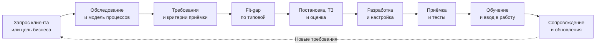
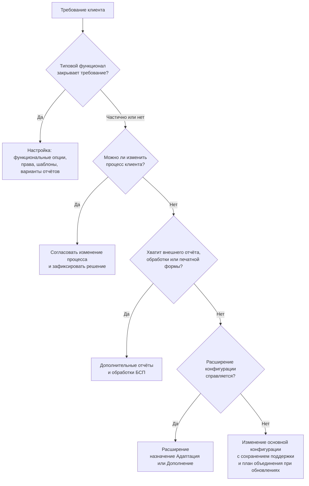

# Аналитик и консультант

[← Все треки](README.md) | [🗺 Оглавление](../README.md)

> Актуализировано: сентябрь 2026.

Трек для тех, кто работает между бизнесом клиента и командой, которая настраивает и дорабатывает 1С: разбирает процессы, формулирует требования, решает, закрывает ли задачу типовая конфигурация, ставит задачи разработчикам, принимает результат и учит пользователей. Роль смежная с разработкой. В неё приходят из разработки, из учёта (бухгалтер, экономист, кадровик, см. [../13_Career.md](../13_Career.md)) и из поддержки. Базу платформы трек не отменяет: аналитик, который не читает метаданные и не пишет простые запросы, зависит от разработчика в каждой мелочи. Поэтому трек надстраивается над Этапами 0–4 из [../02_Timeline.md](../02_Timeline.md), в основном опирается на Этапы 4–5 и является одним из вариантов Этапа 7.

Оговорка об источниках. Официальная модель компетенций 1С MC-6-001 (2025) написана для разработчика, отдельной официальной модели аналитика в проверенных источниках найти не удалось. Уровни Junior, Middle и Senior ниже собраны авторами: это строки модели, относящиеся к аналитической работе (требования, СКД, СППР, процессы клиента, оценка работ), плюс требования вакансий. Это ориентир, а не аттестационная шкала, и сроков у него нет.

## 🎯 Кто это и чем занимается

| Задача | Что делает специалист | Результат |
|---|---|---|
| Обследование | Интервью, наблюдение за работой, изучение документов и учётной политики | Описание процессов «как есть», список проблем, роли и участники |
| Требования | Формулирует, детализирует, приоритизирует; отделяет функциональные требования от нефункциональных | Реестр требований с критериями приёмки |
| Fit-gap (гэп-анализ) | Сопоставляет требования с возможностями типовой и выбирает способ закрыть разрыв | Таблица fit-gap и решение по каждому разрыву |
| Настройка типовой | Функциональные опции, справочники, права, печатные формы, варианты отчётов | Рабочая настройка на тестовой базе и протокол настроек |
| ТЗ и постановка | Описывает поведение, данные, отчёты, права, обмены; отвечает на вопросы разработчика | Постановка, которую можно оценить, реализовать и принять |
| Перенос данных | Состав переносимых данных, правила сопоставления, сверка | План миграции и протокол сверки |
| Приёмка и тесты | Сценарии, чек-листы, приёмочные испытания, регрессия после обновления | Протокол приёмки и список дефектов |
| Обучение и документация | Инструкции, обучение пользователей, пилот | Обученные пользователи и инструкции |
| Сопровождение | Разбор обращений, оценка влияния релизов и новых законов | Решения по обращениям и карточки изменений |

Названия ролей в вакансиях условные. Три типичных «лица»:

| Вариант | Фокус | Где сильнее всего |
|---|---|---|
| Консультант по внедрению | Настройка типовой, обучение, сервисы ИТС, лицензирование, поддержка клиента | Франчайзи |
| Бизнес- или системный аналитик | Требования, ТЗ, постановка разработчикам, приёмка | Инхаус, проекты, продукт |
| Функциональный архитектор | Решение целиком: ERP и УХ, ограничения, обмены, миграции | Крупные проекты |

Гибридные роли на рынке есть: 9 из 452 вакансий в выгрузке hh.ru за 10.08–07.09.2026 названы «Программист-аналитик 1С» или «Разработчик-аналитик 1С», а «программист-консультант» встречается и на Хабр Карьере. Чем отличается от соседних треков: разработчик ([developer-franchise.md](developer-franchise.md), [developer-product.md](developer-product.md)) отвечает за реализацию, QA ([qa-automation.md](qa-automation.md)) за проверку, аналитик за то, что вообще нужно сделать и как будет принято.

## 🧭 Где работает и какой спрос

| Контекст | Что делает аналитик | Особенности |
|---|---|---|
| Франчайзи | Внедрение и сопровождение типовых у многих клиентов, обучение, сервисы ИТС, лицензии | Много разных типовых и клиентов, обычная точка входа и стажировок; в модели MC-6-001 это онбординг (продукция, франчайзинг, процессы клиента) |
| Инхаус | Развитие единой системы компании: ERP, ЗУП, ДО, законодательные изменения, перенос из старых систем | Один заказчик, глубокое знание его процессов |
| Продукт | Требования рынка, пользовательская документация, сценарии приёмки для тиража | Тесная работа с командой разработки и тестирования |
| Проект | Крупное внедрение ERP и УХ, миграции (SAP → 1С:ERP, УПП → ERP), пресейл | Функциональные архитекторы, этапность, риски |

- Спрос качественно: постоянный, высокий в проектах ERP и УХ. Среди вакансий 1С в выгрузке hh.ru за 10.08–07.09.2026 (452 после удаления дублей) 13 функциональных и 5 технических архитекторов, 40 руководящих позиций. Выгрузку собрали третьи лица, она неполная, аналитики в ней перепредставлены: долю ролей по ней считать нельзя ([источник](https://github.com/kr1p043k/compare_competencies)).
- По упоминаниям конфигураций 1С:ERP на первом месте во всех выборках 2025–2026, и перевес создают аналитики и руководители проектов. Второй эшелон: ЗУП, УХ, УТ, ДО, БП. Сравнивать можно ранги, а не проценты.
- Что просят в текстах вакансий (по обрезанным сниппетам, поэтому это нижняя граница): учёт БУ и НУ около 27%, BPMN и ТЗ около 16%, обмены и интеграции около 11%, тестирование около 9%, сертификат 1С около 6%, SQL и запросы около 5%. Git, CI/CD, EDT и ИИ встречаются примерно в 1%.
- Вход без опыта узкий: вакансии «без опыта» составляют 5–7% вакансий 1С. Реальные входы: «Аналитик 1С (стажёр или ученик)», консультант технической поддержки, первая линия, «Помощник программиста 1С». В 2025–2026 годах рынок ИТ называют рынком работодателя, поэтому портфолио и понимание учёта имеют вес.
- Импортозамещение видно в вакансиях: проекты перехода с SAP на 1С, миграции УПП → ERP. По данным Росатома (пересказ, первоисточник сверяйте), к 2027 году планируется более 230 предприятий на 1С:ERP, центр компетенций 1С — 850 сотрудников ([новость](https://www.atomic-energy.ru/news/2026/03/27/164698)).
- Зарплаты по ролям, регионам и опыту — только в [../13_Career.md](../13_Career.md), с методикой и оговорками. Здесь их намеренно нет.

## 📊 Навыки по уровням

Легенда: 🔴 обязательно · 🟡 желательно · 🔵 по контексту.

| Тема | Junior | Middle | Senior |
|---|---|---|---|
| Процессы и роли клиента | 🔴 Основные (производство, услуги, торговля) и вспомогательные (бухгалтерский и налоговый учёт, кадры, зарплата, логистика, ИТ, юридическое сопровождение) процессы; для каждого называет административную и исполнительскую роль | 🔴 Описывает процессы «как есть» и «как будет», находит узкие места, согласует с владельцами процессов | 🔴 Целевая модель процессов организации или холдинга |
| Учёт и налоги | 🔴 Двойная запись, план счетов, проводки 60/41/19/68/62/90/50/51/70/69, НДС 22%, УСН. Партионный и серийный учёт, резервы, себестоимость, многофирменность — на уровне пользовательских настроек | 🔴 То же на уровне объектов и модулей: читает проведение и движения, понимает, откуда берутся суммы | 🟡 ФСБУ, МСФО и бюджетирование (УХ), управленческий учёт в ERP |
| Типовые конфигурации | 🔴 Одна типовая (БП, УТ или ЗУП) глубоко: разделы, справочники, документы, отчёты | 🔴 Линейка УТ → КА → ERP, ЗУП; связи между конфигурациями | 🔴 ERP и УХ целиком; подбор конфигурации под клиента |
| Требования к ИС | 🟡 Представление о функциональных и нефункциональных требованиях | 🔴 Анализирует реализуемость, приоритизирует, закрывает функциональные разрывы | 🔴 Проверяет требования на противоречия между собой и с архитектурой |
| Fit-gap и способ доработки | 🔴 Различает настройку, внешнюю обработку, расширение и изменение основной конфигурации; по «замочку» отличает изменённую типовую | 🔴 Выбирает способ закрытия разрыва с учётом обновляемости | 🔴 Архитектура доработок, план обновления и перехода |
| ТЗ и постановка | 🔴 ТЗ на небольшую доработку по шаблону, ответы на вопросы разработчика | 🔴 Сложные постановки: расчёты, обмены, отчёты, права; согласование | 🔴 Постановка по проекту, трассировка требований до тестов |
| Данные и миграция | 🔴 Выгрузка и загрузка данных XML, терминология КД2 и КД3, чистка НСИ | 🔴 Правила сопоставления, пробные загрузки, протокол сверки | 🔴 Методология миграции (SAP → ERP, УПП → ERP) |
| Запросы и консоль | 🔴 Простые запросы, консоль запросов, проверка данных | 🔴 Соединения, объединения, вложенные и временные таблицы для сверок | 🟡 Оценка влияния требований на производительность |
| СКД и 1С:Аналитика | 🔴 Схема, настройки, макет; отчёты типовой без программирования; язык выражений СКД. 🔵 Дашборды в 1С:Аналитике | 🔴 Проектирует отчёт: запросы, макет, хранилища вариантов и настроек | 🟡 Архитектура отчётности |
| Права и доступ | 🔴 Профили и группы доступа БСП, дата запрета изменений, защита персональных данных | 🟡 Шаблоны ограничения доступа (стандартный и производительный варианты) | 🔴 Модель доступа большой системы |
| Интеграции, маркировка, ЭДО | 🔴 Синхронизация типовых, регистрация изменений, расписание. 🟡 Назначение OData и HTTP-сервисов, правила маркировки | 🔴 Ставит задачи на обмены: объекты, формат, расписание, ошибки и повторы | 🔴 Схема обменов, 1С:Шина, решение по прослеживаемости |
| Обновления и сопровождение | 🔴 Источники обновлений, резервная копия, конфигурация БД и поставщика, правила поддержки | 🔴 План проверки обновления, регрессия на копии, влияние релиза | 🔴 План обновления и перехода на новые версии |
| Приёмка и тесты | 🔴 Тест-кейсы, чек-листы, приёмка по критериям. 🟡 Сценарии автотестов, пользовательская документация | 🔴 Сложные сценарии, регрессия | 🟡 Определяет, что тестировать |
| Лицензии, режимы, сервисы ИТС | 🔴 ПРОФ и КОРП, файловый и клиент-серверный режимы, облачный и локальный, сервисы минимального пакета | 🔴 Влияние лицензий на решение (функции только КОРП) | 🟡 Состав поставки в проекте |
| Законодательство | 🔴 Календарь изменений, 152-ФЗ и 98-ФЗ | 🔴 Анализ влияния закона на клиента, план проверки | 🔴 Стратегия обновлений под регуляторику |
| Оценка работ | 🔵 В модели требований нет | 🔴 Оценивает ТЗ по трудозатратам | 🔴 Выбирает метод, оценивает сложные работы |
| Коммуникации | 🔴 Уточняющие вопросы, письменная фиксация допущений, эскалация | 🔴 Интервью, ведение встреч, управление ожиданиями | 🔴 Переговоры, работа с возражениями, пресейл |
| 1С:СППР | 🔵 Получает проектные материалы, тестирует по сценариям, регистрирует ошибки | 🔵 Разрабатывает проектные материалы по модели СППР | 🔵 Логическое проектирование |
| ИИ-ассистенты | 🟡 Черновики с проверкой | 🟡 Встроены в процесс, правила по данным | 🔵 Правила команды, см. [../09_AI_Development.md](../09_AI_Development.md) |

Общая матрица компетенций и самооценка: [../03_Competencies.md](../03_Competencies.md). Личностные компетенции вынесены в отдельную модель MC-2-001 (consulting.1c.ru/knowledge_base/10/, адрес взят из файла модели, сайт не открывался).

## 🧩 Ядро трека

### Как устроена работа



Аналитик ведёт цепочку целиком, а не только этап «написать ТЗ». Основной риск возникает на стыках: требование без критерия приёмки превращается в спор о «готово», а ТЗ без учёта обновлений превращается в проблему на следующем релизе.

### Обследование и модель процессов

- Начинайте с процессов, а не с экранов. По модели MC-6-001 нужно уметь назвать основные процессы клиента (производство, услуги, торговля), вспомогательные (бухгалтерский и налоговый учёт, кадровое делопроизводство, расчёт зарплаты, логистика, ИТ, юридическое сопровождение) и для каждого административную и исполнительскую роли.
- Нотации. BPMN встречается в требованиях вакансий для аналитиков; в 1С:СППР есть IDEF0. Выбор инструмента для диаграмм остаётся за командой, важнее договориться, что считается достаточным описанием.
- Вопросы для интервью: какой документ запускает процесс, кто и в какой момент его создаёт, какие данные берутся из каких систем, что бывает при ошибке, какие исключения случаются чаще всего, какие отчёты нужны руководителю и как часто.
- Фиксируйте допущения письменно и возвращайте их клиенту на подтверждение: это дешевле, чем исправлять после разработки.

### Требования

| Что описываем | Пример формулировки | Как проверить |
|---|---|---|
| Функциональное требование | При проведении реализации система проверяет остаток и при нехватке сообщает, сколько не хватает по каждой строке | Сценарий приёмки с данными |
| Нефункциональное | Проведение документа на 500 строк не дольше согласованного времени при заданном числе пользователей | Замер на тестовых данных, см. [performance-expert.md](performance-expert.md) |
| Право и ограничение | Менеджер видит только своих контрагентов и их документы | Проверка под пользователем с ролью менеджера |
| Обмен | Повторная загрузка того же сообщения не создаёт дублей | Двукратная загрузка тестового файла |
| Законодательное | Ставка НДС по дате документа: до 01.01.2026 и после | Документы на границе даты |

Каждому требованию нужны идентификатор, источник (кто заказал), приоритет, критерий приёмки и статус. Хорошее требование описывает поведение и результат, а не способ реализации: «как сделать» решает разработчик с учётом стандартов.

### Fit-gap и выбор способа закрыть разрыв

Порядок из практики типовых конфигураций: сначала возможности, которые уже есть, затем самый дешёвый в сопровождении способ. Слова «только расширения» писать не нужно: расширение предпочтительно, но не всегда достаточно.



Иллюстрация таблицы fit-gap (функциональность проверяйте в своей конфигурации и релизе):

| № | Требование | Типовой функционал | Разрыв | Способ | Влияние на обновления |
|---|---|---|---|---|---|
| 1 | Менеджер видит только своих клиентов | Профили и группы доступа БСП, ограничение доступа | Нет | Настройка | Не влияет |
| 2 | Печатная форма счёта с реквизитами филиала | Типовая форма печати | Частичный | Внешняя печатная форма через «Дополнительные отчёты и обработки» | Основная конфигурация не меняется; макеты проверять после релиза |
| 3 | Дополнительная проверка реквизита при проведении | Нет | Да | Расширение, перехват проведения | После релиза проверить применимость расширения |
| 4 | Расчёт, который расширением не перехватить | Нет | Да | Изменение основной конфигурации с сохранением поддержки | Ручное сравнение и объединение при каждом обновлении, крайний случай |

Что выяснить до выбора способа:

- Какая платформа, конфигурация и релиз, какие расширения уже подключены, кто и как обновляет базу.
- Файловый или клиент-серверный режим, облачная ли база (в 1С:Фреш доработки поставляются расширениями; публикуются через Менеджер сервиса, по данным практиков).
- Какая лицензия: часть функций работает только в КОРП (фоновое обновление конфигурации БД, события аудита прав доступа, механизм копий БД). Фоновое обновление не даёт нулевого простоя: финальная фаза требует монопольного доступа. Не обещайте клиенту «обновление без остановки».
- Официальные исправления 1С поставляются расширениями с назначением «Исправление»; их надо учитывать в плане обновления.
- Обновление большой базы может идти часами, а расширения после него проверяют на применимость. Фразу «обновится автоматически за минуты» не используйте.
- В ТЗ и инструкциях указывайте платформу, релиз и режим интерфейса: в 8.5 есть интерфейс «Версия 8.5», «Такси» и переходные режимы совместимости, скриншоты различаются.

### Методология типовых

| Конфигурация | Для чего | Что запомнить аналитику |
|---|---|---|
| 1С:Бухгалтерия предприятия (БП) | Бухгалтерский и налоговый учёт, регламентированная отчётность | Удобная база для изучения учёта, широко распространена у франчайзи |
| 1С:Зарплата и управление персоналом (ЗУП) | Кадры и зарплата | Законодательные изменения по взносам и НДФЛ приходят релизами |
| 1С:Управление торговлей (УТ) | Торговля, склад, маркировка | УТ 11.5, КА 2.5 и ERP 2.5 — одна кодовая база, значительная часть логики и объектов у них общая |
| 1С:Комплексная автоматизация (КА) | Комплексный учёт на общей с ERP кодовой базе | То же |
| 1С:ERP | Производство, финансы, закупки и продажи, регламентный и управленческий учёт | Чаще других упоминается в вакансиях; перевес дают аналитики |
| 1С:ERP. Управление холдингом (УХ) | Холдинг, МСФО, бюджетирование | Консолидация и управленческий учёт |
| 1С:УНФ и 1С:Розница | Малый бизнес и розница | С версии 3.0.13 работают на 8.5.1 |
| 1С:Документооборот (ДО) | Документооборот и согласования | Типовая ветка корпоративных проектов |

- БП, ЗУП, УТ, КА, ERP, УХ и ДО в 2026 году работают на 8.3.27 (с БСП 3.1.12 для платформ 8.3.24–8.3.27); УНФ и Розница начиная с 3.0.13 — на 8.5.1 (БСП 3.2.1, только 8.5.1). Официального плана перевода остальных на 8.5 нет. 8.5 — не отдельная платформа, а новая нумерация той же платформы с новым интерфейсом.
- УПП 1.3 — устаревшая конфигурация на обычных формах. Новые внедрения идут на ERP и КА, а для перехода в типовых есть штатный помощник переноса данных. Срок прекращения поддержки смотрите в информационных письмах 1С.
- Поставка состоит из слоёв. Кроме БСП это библиотеки интернет-поддержки (БИП), электронных документов (БЭД), подключаемого оборудования (БПО) и интеграции с ГосИС: из них складываются ЭДО, оборудование и маркировка. Версии библиотек видны в «Описании изменений системы» конкретной типовой.
- Номера релизов не фиксируйте: актуальные смотрите на releases.1c.ru и в «Информации об обновлениях» (its.1c.ru/db/updinfo). Большая часть ИТС доступна по платной подписке.
- Сервисы минимального пакета, о которых консультант говорит клиенту: «1С-Отчетность», «1С-ЭДО», «1С:Контрагент», «1СПАРК Риски», «1С:Кабинет сотрудника», «1С-ОФД», «1С:Распознавание первичных документов». Модель MC-6-001 также ждёт знания Стандарта ИТС и 1С:ТСВ, 1С:ТКВ, 1С:ТКС (основы ITIL, ITSM, SLA).

### Постановка и ТЗ

Состав ТЗ на небольшую доработку:

1. Контекст: конфигурация, релиз, платформа, режим интерфейса, подключённые расширения.
2. Цель и бизнес-обоснование: какую проблему решаем и для кого.
3. Процесс: кто, когда и что делает, исключения.
4. Функциональные требования: поведение, условия, сообщения пользователю.
5. Данные: какие объекты затронуты, обязательные реквизиты и ограничения заполнения.
6. Отчёты и печатные формы: состав полей, отборы, итоги, эскиз макета.
7. Права: кто видит и делает.
8. Обмены и миграция, если затронуты: формат, периодичность, поведение при повторе и ошибке.
9. Нефункциональные требования: объёмы, число пользователей, допустимое время.
10. Способ реализации и причина выбора (настройка, расширение и так далее), влияние на обновления.
11. Критерии приёмки: сценарии с данными.
12. Допущения, риски, оценка.

Требование, которое трогает остатки, должно отвечать на вопросы, от которых зависит техническое решение: когда проверяется остаток (при проведении), что делать при нехватке, нужен ли контроль при перепроведении задним числом, допустимы ли отрицательные остатки. От этого зависит схема блокировок: контроль остатков делают по стандарту [661](https://its.1c.ru/db/v8std/content/661/hdoc), и ошибка в постановке часто обходится дороже ошибки в коде. Подробнее о такой связке см. [../07_Projects.md](../07_Projects.md) (проекты P2 и P5).

### Перенос данных

1. Инвентаризация: что переносим (НСИ, остатки, документы за период, история) и откуда.
2. Чистка НСИ в источнике: дубли, пустые обязательные реквизиты, устаревшие записи.
3. Правила сопоставления: «источник → приёмник», значения по умолчанию, обработка неоднозначностей.
4. Пробные загрузки на копии, протокол ошибок.
5. Сверка: число объектов, остатки по складам и счетам, обороты за период; каждое расхождение объяснено.
6. Боевая загрузка в согласованное окно, резервная копия и план отката.
7. Пилот и параллельная работа.

Инструменты по модели MC-6-001: «Выгрузка и загрузка данных XML», 1С:Конвертация данных 2.x и 3.x (в КД3 — правила обмена и обработка «Универсальный обмен данными»), для типовых — штатные помощники переноса. Пример запроса для консоли запросов (язык запросов 1С), с которого начинают профилирование НСИ:

```sql
// Дубли ИНН среди действующих контрагентов
ВЫБРАТЬ
	Контрагенты.ИНН КАК ИНН,
	КОЛИЧЕСТВО(*) КАК Количество
ИЗ
	Справочник.Контрагенты КАК Контрагенты
ГДЕ
	НЕ Контрагенты.ПометкаУдаления
	И Контрагенты.ИНН <> ""
СГРУППИРОВАТЬ ПО
	Контрагенты.ИНН
ИМЕЮЩИЕ
	КОЛИЧЕСТВО(*) > 1
УПОРЯДОЧИТЬ ПО
	Количество УБЫВ
```

Совпадение ИНН не всегда ошибка: у юрлица с обособленными подразделениями ИНН один, КПП разные. Что считать дублем, решают вместе с бухгалтером клиента, а правило вписывают в протокол. Для постоянной защиты от дублей нужна проверка при вводе (см. P1 и P9 в [../07_Projects.md](../07_Projects.md)).

### СКД и аналитика на уровне пользователя

- Аналитик настраивает отчёты типовой без программирования: пользовательские поля, отборы, группировки, условное оформление, варианты отчётов, быстрые настройки. Если нужен новый набор данных, пишется постановка для разработчика с эскизом макета и примером ожидаемых цифр.
- 1С:Аналитика — отдельно поставляемая BI-компонента: платформа публикует «систему аналитики» (флажок публикации, право `КлиентСистемыАналитики`), объект `МенеджерСистемыАналитики` доступен с 8.3.17; типовые поставляют готовые панели. Лицензирование и доступность в 2026 году не подтверждены, условия уточняйте у 1С и партнёра.
- При сверке цифр сначала договоритесь, на какой момент сравниваются остатки и за какой период обороты: расхождение часто объясняется разными точками отсчёта, а не ошибкой.

### Законодательство для аналитика

Закон — это требование, которое клиент не выбирает. Аналитик переводит его в карточку изменения: что меняется, какие процессы и конфигурации затронуты, в каком релизе 1С это реализовано, что настроить, что проверить на копии, о чём предупредить пользователей. Все факты ниже проверяйте по актуальной редакции на consultant.ru и nalog.gov.ru; подробности и практикумы: [../10_Domain_and_Law.md](../10_Domain_and_Law.md).

| Дата | Изменение | Что проверить |
|---|---|---|
| С 01.01.2026 | НДС 22% (425-ФЗ от 28.11.2025), расчётная ставка 22/122 | Ставки в номенклатуре и документах, печатные формы, касса, договоры и цены |
| 2025–2030 | УСН: порог освобождения от НДС 20 млн ₽ за 2025–2028, 15 млн ₽ за 2029, 10 млн ₽ за 2030 (228-ФЗ от 04.07.2026); сверх порога НДС 5% и 7% без вычетов или 22% с вычетами | Режим клиента, выбор ставки; «массового перехода на ОСНО» нет |
| 2026 | Страховые взносы IT-компаний: 15% в пределах базы и 7,6% сверх; предельная база 2 979 000 ₽ | Настройки ЗУП у клиентов-IT |
| С 01.09.2026 | ЭПД обязательны (140-ФЗ) | ЭДО-логистика, цепочка титулов, оператор |
| 2026 | Маркировка: ТС ПИоТ и разрешительный режим на кассе; по разъяснению «Честного знака» протокол с токеном X-API-KEY работает до 01.10.2026 | Версии типовой и оборудования, текущий статус на сайте оператора |
| С 01.09.2026 | Цифровой рубль, первый этап: крупнейшие банки и торговцы с выручкой более 120 млн ₽ | Поддержку приёма в вашей конфигурации не предполагайте: смотрите релиз-ноты |
| С отчётности 2027 | ФСБУ 9/2025 «Доходы» и ФСБУ 10/2026 «Расходы» (приказ Минфина № 53н от 24.04.2026) | Учётная политика, отчёты, план обновлений |
| Постоянно | 152-ФЗ: оборотные штрафы по 420-ФЗ за повторную утечку от 20 млн ₽, для спецкатегорий и биометрии от 25 млн ₽, до 500 млн ₽ | Обезличенные копии для тестов, права доступа |

Чего не писать в требованиях: «обязательное поле Должность в МЧД» (в XSD поля «Должность» и ИНН физлица необязательны), «ФСБУ 5/2019 исключил ЛИФО» (ЛИФО не было и в ПБУ 5/01; ФСБУ 5/2019 допускает оценку по себестоимости единицы, по средней и ФИФО), «удалённый выпуск КЭП через Госключ» (КЭП юрлиц и ИП выпускает УЦ ФНС), «ПРОФ ограничен 12 ядрами» (не подтверждено).

### Приёмка и сценарии

Приёмочный сценарий — это требование, записанное так, чтобы его можно было проверить. Удобный формат: Gherkin на русском. Сценарии, которые пишет аналитик, остаются бизнес-языком, а разработчик или тестировщик сопоставляет шаги с библиотекой шагов Vanessa Automation (VA) или пишет свои. BDD в VA — это UI-тесты через клиент тестирования платформы: они медленнее модульных и чувствительны к смене интерфейса, обещание «изменение интерфейса не ломает сценарий» неверно. Автоматизация и CI — в [qa-automation.md](qa-automation.md).

```gherkin
# language: ru

Функционал: Контроль остатков при реализации товаров

Контекст:
	Дано на складе "Основной" остаток товара "Стул" равен 5 штукам

Сценарий: Реализация в пределах остатка проводится
	Когда менеджер проводит реализацию 5 штук товара "Стул" со склада "Основной"
	Тогда документ проведён
	И остаток товара "Стул" на складе "Основной" равен 0

Структура сценария: Реализация сверх остатка не проводится
	Когда менеджер проводит реализацию <Количество> штук товара "Стул" со склада "Основной"
	Тогда документ не проведён
	И пользователь видит сообщение о нехватке <Нехватка> штук

Примеры:
	| Количество | Нехватка |
	| 6          | 1        |
	| 10         | 5        |
```

- Берите границы (ровно остаток и на единицу больше), состояния документа (не проведён, проведён, проведение отменено), права (пользователь без роли), даты (31 декабря и 1 января для ставок и режимов).
- Критерий приёмки должен содержать конкретные данные и ожидаемый результат: «документ проводится» без суммы и количества критерием не является.
- Предусловия данных готовьте отдельно от сценария, а не кликами по интерфейсу.
- Вендорские средства: 1С:Сценарное тестирование и 1С:Тестировщик (официальные, версии не называем; условия на releases.1c.ru).
- 1С:СППР 2.1 — конфигурация для проектных материалов (требования, функциональная модель, IDEF0, тестирование, ошибки и доработки); платная, требует платформу 8.5.1 и выше, документация: [its.1c.ru/db/sppr2doc](https://its.1c.ru/db/sppr2doc).

### Документация, обучение и сопровождение

- Инструкция пользователя отвечает на вопрос «как сделать мою задачу», а не «что есть в меню». Хороший источник — те же сценарии приёмки; тема пересекается с курсом УЦ №1 «Тестирование в 1С и создание документации с использованием Vanessa-Automation».
- Пилот: небольшая группа, фиксированный срок, список критериев перехода на полную эксплуатацию.
- Обращения после запуска: воспроизвести, определить, ошибка это, пожелание или недостаток обучения, зафиксировать решение. Для регулярного сопровождения модель MC-6-001 упоминает Стандарт ИТС, 1С:ТСВ и 1С:ТКВ (основы ITIL, ITSM, SLA).
- Оценка работ. Модель ждёт оценку по ТЗ от Middle, метод выбирает Senior. Практический минимум: декомпозиция на обследование, ТЗ, настройку, разработку, тестирование, миграцию, обучение и пилот; риски и неизвестные отдельной строкой; буфер; список допущений, согласованный с клиентом.

### ИИ в работе аналитика

- Можно: черновик протокола встречи, список вопросов к интервью, заготовка тест-кейсов и таблицы fit-gap, перефразирование ТЗ. Нельзя доверять без проверки: любые утверждения о возможностях типовой, номерах релизов, законах и датах. ИИ уверенно «находит» несуществующие настройки, поэтому проверка идёт по «Описанию изменений системы», документации и тестовой базе.
- Персональные данные во внешние LLM — трансграничная передача (152-ФЗ); код и данные клиента — NDA и коммерческая тайна (98-ФЗ); для ГИС и информационных систем госорганов действует прямой запрет по п. 60 Приказа ФСТЭК № 117 (с 01.03.2026). Обезличивайте материалы до загрузки.
- 1С:Напарник — ассистент разработчика в 1C:EDT, а не аналитика. Отдельного официального ИИ-ассистента 1С для конечных пользователей найти не удалось; в типовых есть облачные ИИ-сервисы 1С (распознавание документов, прогнозирование и др.).
- Подробно: [../09_AI_Development.md](../09_AI_Development.md).

### Типичные ошибки

- Требование без критерия приёмки и без источника.
- В ТЗ описано решение («добавить кнопку»), а потребность не названа.
- Не изучена типовая: «доработка» там, где достаточно настройки.
- Не оценено влияние на обновления: расширение или правка основной конфигурации выбраны без плана на следующий релиз.
- Обещание «обновление за минуты» или «без простоя» без учёта лицензии и объёма базы.
- Законодательные факты взяты из блога без первоисточника и без даты проверки.
- Для тестов взята копия боевой базы с персональными данными.
- Смешаны требования, решения и оценка в одном списке без статусов.

## 🧰 Инструменты

| Инструмент | Для чего аналитику | Состояние на сентябрь 2026 |
|---|---|---|
| Конфигуратор и 1C:EDT | Читать метаданные, формы, права: «где в типовой это живёт» | Конфигуратор жив; EDT стабильная ветка 2026.1, скачивается бесплатно после регистрации (edt.1c.ru) |
| Консоль запросов | Проверка данных, сверки, профилирование НСИ | В навыках Junior по MC-6-001 |
| «Описание изменений системы», «Информация об обновлениях» | Что нового в релизе, версии библиотек, влияние на клиента | Источник — типовая и its.1c.ru/db/updinfo |
| 1С:СППР 2.1 | Проектные материалы, IDEF0, тестирование | Платная, платформа 8.5.1+ |
| 1С:Аналитика | Дашборды и интерактивный анализ | Отдельная BI-компонента, условия уточнять |
| Vanessa Automation | Приёмочные сценарии `.feature`, отчёты Allure | 1.2.043.42 (09.09.2026), встроен MCP-сервер с 1.2.043.12 |
| 1С:Сценарное тестирование, 1С:Тестировщик | Вендорская автоматизация приёмки | Версии не называем, смотреть releases.1c.ru |
| Редактор диаграмм и трекер задач | BPMN-схемы, реестр требований | Выбор команды, имена инструментов не навязываем |
| Landscape1C | Карта инструментов по ролям и контекстам | [github.com/Oxotka/Landscape1C](https://github.com/Oxotka/Landscape1C) |

## 🎓 Сертификация

Трек сертификации: **1С:Профессионал по прикладному решению** → **1С:Специалист-консультант**. Подробно и с оговорками: [../04_Certifications.md](../04_Certifications.md).

- 1С:Профессионал: 14 вопросов, 30 минут, нужно не менее 12 верных ответов (по пяти вторичным источникам; сверяйте на 1c.ru/prof/prof.htm). Экзамены привязаны к редакциям конфигураций, актуальный список редакций — 1c.ru/prof/examred.jsp. Бесплатное учебное тестирование — uc1.1c.ru/uchebnoe-testirovanie/.
- 1С:Специалист-консультант: практические задачи по внедрению и сопровождению типового решения, около 3–5 часов (один источник, 2025); страница экзамена — uc1.1c.ru/ekzameny-1s/spec-konsultant/. Пререквизит — 1С:Профессионал (по какому решению, уточняйте в регламенте). Собеседование в составе экзамена не подтверждено.
- Направления, по которым есть сообщества подготовки: БП, ЗУП, УТ, УНФ, ДО, БГУ, ЗКГУ, УХ и ERP (регламентированный учёт, управленческий учёт, бюджетирование, управление производством и ремонтами). Актуальность и перечень проверяйте у УЦ №1.
- Сертификаты в вакансиях чаще «желательны», чем обязательны. Партнёры 1С указывают число сертификатов как преимущество, квоты партнёрских статусов не приводим. Подтверждение для резюме — «Паспорт квалификации 1С» из личного кабинета УЦ №1.
- Отдельных сертификаций для аналитиков и архитекторов (кроме Специалиста-консультанта) в источниках 2024–2026 найти не удалось. Цены не называем.

## 🚀 Проекты трека

Отдельного проекта «для аналитика» среди P0–P17 нет. Проекты из [../07_Projects.md](../07_Projects.md) служат объектом анализа, а ваш результат — пакет документов в портфолио: схемы, ТЗ, fit-gap, сценарии, протокол сверки. Все материалы вымышленные и без данных клиентов.

| Проект | Что даёт аналитику |
|---|---|
| P4. Взаиморасчёты и история статусов клиента | Предметная область: долг по договорам, статусы с историей, ведомость |
| P5. Себестоимость и рентабельность | Требование на расчёт, момент времени, перепроведение задним числом |
| P6. Бухучёт на плане счетов | Проводки, субконто, ОСВ: язык бухгалтера |
| P7. Внешняя печатная форма и отчёт для типовой | Подключение через «Дополнительные отчёты и обработки», постановка макета |
| P8. Расширение типовой | Постановка на расширение и проверка влияния на обновления |
| P9. Загрузка из Excel/CSV с поиском дублей | Перенос данных, правила дублей, протокол сверки |
| P12. Обмен между двумя базами | Требования на обмен: идемпотентность, коллизии |
| P15. RLS и роли | Модель доступа, проверка под пользователем |
| P17. Решение с ИИ-ассистентом (опц.) | Проверка ИИ-черновиков требований и сценариев |

Задания трека (результат оформите в одном публичном репозитории):

1. **Процесс.** Опишите «закупка → продажа → оплата» из P2–P4: схема «как есть» и «как будет», роли (административная и исполнительская). Проверка: стороннему человеку понятно, кто что делает и где возникают расхождения.
2. **Fit-gap.** Возьмите 10 вымышленных требований и сопоставьте с типовой (демо-база БП или УТ). Для каждого: найденная настройка, разрыв, способ закрытия, влияние на обновления. Проверка: не менее трёх разрывов закрыты настройкой, а не доработкой.
3. **ТЗ.** Напишите ТЗ на небольшую доработку по шаблону выше и реализуйте её как P8. Проверка: разработчик (или вы) реализует без вопросов, критерии приёмки выполнимы.
4. **Сценарии.** Запишите шесть приёмочных сценариев в формате `.feature` с границами и негативными случаями. Проверка: у каждого сценария есть шаг проверки результата.
5. **Миграция.** План переноса НСИ и остатков для P9: правила сопоставления, запрос профилирования, протокол сверки. Проверка: любое расхождение объяснимо.
6. **Закон.** Карточка изменения «НДС 22%»: затронутые документы, граница 31.12.2025 и 01.01.2026, план проверки. Практикум «Ставка НДС по дате» в [../10_Domain_and_Law.md](../10_Domain_and_Law.md) даёт данные для проверки.
7. **Рынок.** Выгрузите 30–50 вакансий аналитиков своего города или удалённых, выпишите требования, сравните со своими навыками и закройте три главных пробела (идея совпадает с практикой анализа рынка из [../13_Career.md](../13_Career.md)).

## 📝 План входа на 3–6 месяцев

Ориентир для тех, кто прошёл Этапы 0–4 и учится 15–20 часов в неделю. Сроки — оценка авторов, а не факт; критерии важнее календаря.

| Месяц | Цель | Результат |
|---|---|---|
| 1 | Учёт и типовая как пользователь | Проводки 60/41/19/68/62/90/50/51/70/69 без шпаргалки; одна типовая (БП или УТ) пройдена по основному циклу |
| 2 | Процессы и требования | Задание 1 и реестр из 20 требований с критериями приёмки |
| 3 | Fit-gap и ТЗ | Задания 2 и 3; запросы и консоль на уровне Junior |
| 4 | Приёмка и данные | Задания 4 и 5; один сценарий запущен в Vanessa Automation (с помощью разработчика или QA) |
| 5 | Законодательство и обновления | Задание 6; разбор «Описания изменений системы» одного релиза |
| 6 | Портфолио и рынок | Репозиторий с README, задание 7, отклики; 1С:Профессионал по выбранной типовой |

Если вы из учёта: больше времени на Этапы 1–2 (читать код проведения, писать запросы), иначе зависимость от разработчика останется. Если вы разработчик: начните с месяцев 1–2, потому что привычка «сразу делать» мешает обследованию. Реальные входные позиции и переходы — в [../13_Career.md](../13_Career.md).

## ✅ Первые шаги на этой неделе

1. Получите тестовую базу типовой (у работодателя или франчайзи, на курсе, по подписке ИТС через releases.1c.ru). Учебная версия платформы с online.1c.ru (учебные 8.5.1 и 8.3.27, только файловый вариант) годится для P2–P6.
2. Опишите один процесс (например, «продажа с оплатой») на одной странице: роли, документы, исключения.
3. Напишите 10 требований к нему и к каждому — критерий приёмки.
4. Найдите в типовой, как закрывается каждое: настройка, отчёт, печатная форма или разрыв.
5. Откройте «Описание изменений системы» последнего релиза и выпишите три изменения, которые повлияют на клиента.

## 📚 Ресурсы

- [офиц.] [платно] ИТС (its.1c.ru): документация, стандарты, «Информация об обновлениях» (its.1c.ru/db/updinfo), БСП 3.2.1 (its.1c.ru/db/bsp321doc). Большая часть доступна по подписке.
- [офиц.] Релизы и дистрибутивы: releases.1c.ru (по подписке ИТС).
- [офиц.] 1С:СППР: [описание](https://v8.1c.ru/tekhnologii/sistema-proektirovaniya-prikladnykh-resheniy/), [документация](https://its.1c.ru/db/sppr2doc).
- [офиц.] [бесплатно] Модель компетенций MC-6-001 (xlsx в репозитории [Landscape1C](https://github.com/Oxotka/Landscape1C), docs/competencies/sources).
- [курс] УЦ №1: учебное тестирование (uc1.1c.ru/uchebnoe-testirovanie/), «Тестирование в 1С и создание документации с использованием Vanessa-Automation» (uc1.1c.ru/course/testirovanie-v-1s-i-sozdanie-dokumentatsii-c-ispolzovaniem-vanessa-automation).
- [книга] Е.Ю. Хрусталева, «Разработка сложных отчётов в 1С:Предприятии 8. Система компоновки данных» (2-е изд.), «Язык запросов 1С:Предприятия 8» (3-е изд.); её же книга «1С:Аналитика. BI-система в 1С:Предприятии 8» — издание не проверено. Проверенных книг именно по бизнес-анализу в 1С в источниках этого роудмапа нет: общие книги по требованиям и BPMN выбирайте по своему вкусу.
- [сообщество] Telegram: @analyst_1c («1С АНАЛИТИК / АРХИТЕКТОР»), @SPPR1c (СППР), группы подготовки к аттестации консультантов (каталог SeiOkami, актуальность не проверена; список в [../04_Certifications.md](../04_Certifications.md)).
- [сообщество] Форумы и порталы (Миста, Инфостарт), общий обзор ресурсов: [../05_Resources.md](../05_Resources.md).
- Конференции: Infostart A&PM Event 2026 для аналитиков и руководителей проектов, 12–14.11.2026, Санкт-Петербург ([infostart.ru/event/apm2026/](https://infostart.ru/event/apm2026/)); 13-й Бизнес-форум 1С:ERP, 26.11.2026, Москва ([1c.ru/bf/](https://1c.ru/bf/)); INFOSTART TEAM EVENT 2026 уже прошёл (12–14.03.2026). Календарь: onevents.ru.
- Смежные роадмапы на [roadmap.sh](https://roadmap.sh): `sql`, `software-architect`, `api-design`.
- Глоссарий и проекты: [../12_Glossary.md](../12_Glossary.md), [../07_Projects.md](../07_Projects.md).

## 🗂 Связанные треки

- [Разработчик у франчайзи](developer-franchise.md): реализация доработок, обновления, расширения.
- [Разработчик в продукте и инхаусе](developer-product.md): процессы команды, код-ревью.
- [QA и автотесты](qa-automation.md): сценарии как общий язык, автоматизация приёмки.
- [Интеграции](integration.md): постановка и проверка обменов.
- [Производительность и 1С:Эксперт](performance-expert.md): нефункциональные требования и замеры.
- [Администратор, DevOps и 1С:Эксплуататор](administrator-operator.md): лицензии, режимы работы, тестовые контуры.
- [1С:Элемент и мобильная разработка](element-and-mobile.md): опциональная ветка.

## 🔗 Источники

- Модель компетенций MC-6-001 (2025): [Landscape1C](https://github.com/Oxotka/Landscape1C); опрос и каталог — там же.
- Рынок: выгрузка hh.ru за 10.08–07.09.2026, [compare_competencies](https://github.com/kr1p043k/compare_competencies); Росатом: [atomic-energy.ru](https://www.atomic-energy.ru/news/2026/03/27/164698) (не открывалась, сверить).
- Конфигурации и БСП: зеркала [ssl_3_1](https://github.com/1c-syntax/ssl_3_1) и [ssl_3_2](https://github.com/1c-syntax/ssl_3_2).
- Сертификация: [README Oxotka](https://raw.githubusercontent.com/Oxotka/StackTechnologies1C/main/README.md); официальные страницы: 1c.ru/prof/prof.htm, 1c.ru/prof/examred.jsp, uc1.1c.ru/ekzameny-1s/spec-konsultant/ (при актуализации не открывались).
- СППР: [v8.1c.ru](https://v8.1c.ru/tekhnologii/sistema-proektirovaniya-prikladnykh-resheniy/), [Инфостарт: СППР 2.1](https://infostart.ru/journal/news/mir-1s/1s-sppr-2-1-novyy-reliz-s-podderzhkoy-interfeysa-8-5_2580312/).
- 1С:Аналитика: [документация 8.5.1](https://github.com/butbik2025/BSL_8.5.1_dev_docs), гл. 34.
- Законодательство: [228-ФЗ от 04.07.2026](http://publication.pravo.gov.ru/document/0001202607040017), [ФНС «Налоги 2026»](https://www.nalog.gov.ru/new2026/); остальное — по досье о законодательстве, проверяйте на consultant.ru и nalog.gov.ru.
- Стандарт разработки [661](https://its.1c.ru/db/v8std/content/661/hdoc).
- Факты сверены по досье roadmap_design, market, gap_market_salaries_2026, law_2026, configurations, certification (репозиторий SOURCES.md).

[← Все треки](README.md) | [🗺 Оглавление](../README.md)
