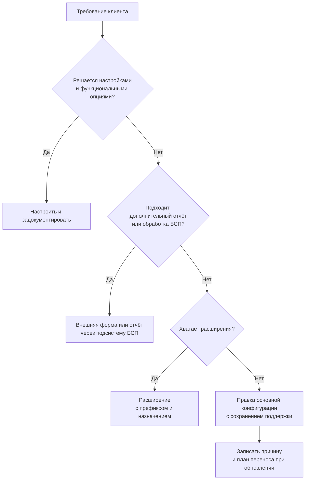
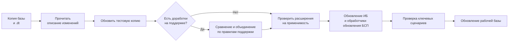

# Трек: разработчик у франчайзи

[← Все треки](README.md) | [🗺 Оглавление](../README.md)

> Актуализировано: сентябрь 2026.

Трек для тех, кто идёт на первую работу или уже работает в компании-франчайзи и хочет расти в сопровождении типовых конфигураций. Это самый массовый вход в профессию: работа у франчайзи не требует продвинутого DevOps-стека (см. ниже), зато требует хорошего знания типовых, БСП и обновлений. Предполагается, что вы прошли этапы 0–4 из [../02_Timeline.md](../02_Timeline.md) хотя бы в объёме «минимального пути».

## 🎯 Кто это и чем занимается

Разработчик у франчайзи — программист «на стыке» клиента и типового продукта. Он не пишет конфигурации с нуля, а настраивает, дорабатывает и поддерживает тиражные решения фирмы «1С» у десятков клиентов.

Типичный набор задач (по уровню Junior официальной модели компетенций MC-6-001 и практике рынка):

| Задача | Что именно делает разработчик | Чем измеряется результат |
|---|---|---|
| Обновление типовых и доработанных конфигураций | Резервная копия, обновление, сравнение и объединение, проверка доработок и расширений | База работает, доработки применимы, пользователи не потеряли функции |
| Внешние печатные формы, отчёты, обработки | Разработка и подключение через подсистему «Дополнительные отчёты и обработки» БСП | Форма печатается из нужных документов, без правки типовой |
| Расширения конфигурации | Доработка типовой без изменения её кода: реквизиты, формы, перехваты методов | Расширение переживает обновление типовой |
| Загрузка и выгрузка данных | Из Excel/CSV, через XML, настройка обменов между типовыми | Данные без дублей, есть отчёт об ошибках |
| Синхронизация между типовыми | Например, БП и ЗУП или УТ и БП: правила, конфликты, разбор расхождений | Обмен идёт по расписанию, расхождения объяснимы |
| Подключаемое оборудование | Настройка ККТ, сканеров, весов через библиотеку подключаемого оборудования (БПО) | Оборудование работает на рабочем месте клиента |
| Маркировка и ЭДО по инструкции | Настройка по официальным инструкциям, разбор типовых ошибок | Документы уходят в систему, ошибки классифицированы |
| Консультации по сервисам ИТС | «1С-Отчётность», «1С-ЭДО» и др., лицензирование, режимы работы | Клиент понимает, что и зачем подключено |
| Права и роли в типовой | Профили групп доступа вместо ручных ролей | Права выдаются по профилям, не по пользователям |
| Оценка небольших задач | Формально уровень Middle, но начинать полезно рано | Оценка сходится с фактом |

Кроме кода вы регулярно делаете то, что в резюме не пишут: воспроизводите ошибку клиента, читаете «Описание изменений системы», отвечаете на письма, оформляете задачу так, чтобы её можно было принять.

## 🏢 Где работает и как устроена работа

Каталог Landscape1C делит работу специалиста на четыре контекста: франчайзи, инхаус, продукты, проекты. По данным этого каталога (обновлён 26.08.2026), базовые инструменты общие для всех контекстов: встроенный язык, язык запросов, СКД, Конфигуратор, БСП, консоль запросов, хранилище, стандарты разработки, 1С:Профессионал. Продвинутые инструменты (1C:EDT, Git-платформы, Jenkins и GitLab CI, Vanessa Automation и YAxUnit, Шина и брокеры) у франчайзи в каталоге не отмечены. Это не значит, что они не нужны вовсе, но входным требованием для этого контекста они по данным каталога не выглядят.

Из этого следует практический приоритет:

- 🔴 Конфигуратор, хранилище конфигурации, консоль запросов, типовые, БСП, обновления, обмены, расширения;
- 🟡 EDT и Git: полезны при переходе в проектную команду, но не обязательны для входа (утверждение «без EDT командная разработка невозможна» неверно; подробнее в [developer-product.md](developer-product.md));
- 🔵 CI, автотесты, интеграционные шины: по контексту проекта клиента.

Рабочий процесс обычно такой: задача приходит из трекера или от консультанта, вы уточняете постановку, делаете на копии базы, проверяете, передаёте на приёмку, при необходимости переносите на рабочую базу клиента. Онбординг на первые 90 дней разобран в [../13_Career.md](../13_Career.md), чек-лист — в [../11_Checklists.md](../11_Checklists.md).

## 📈 Спрос и вход в профессию

- Входные вакансии, которые встречаются в выгрузках hh.ru 2025 и на Хабр Карьере 2026: «Стажёр-программист 1С», «1С разработчик (ученик)», «Консультант технической поддержки 1С», «Начинающий специалист 1С (первая линия поддержки)».
- Совет сообщества, не факт: после пособия Радченко и Хрусталевой и курса пробовать устроиться во франчайзи своего города и параллельно сдавать 1С:Профессионал.
- В вакансиях сертификаты чаще «желательны» или «приветствуются», а не обязательны.
- Гибридные роли («программист-консультант») на рынке существуют: знание бухучёта и процессов клиента ценится прямо, это видно по требованиям вакансий.
- Рынок ИТ в 2025–2026 годах называют рынком работодателя: конкуренция на входе высокая, портфолио и понимание учёта помогают.
- По упоминаниям в вакансиях лидирует 1С:ERP, но среди вакансий разработчиков (выгрузка hh.ru, авг.–сен. 2026) УТ, ERP, ЗУП, БП и ДО идут почти вровень. Для входа во франчайзи это не отменяет БП и УТ как первых учебных баз.

Зарплатные ориентиры собраны в одном месте: [../13_Career.md](../13_Career.md) (с методикой и оговорками). Здесь их нет намеренно.

## 🧭 Ландшафт: платформы, типовые и БСП

Актуально на сентябрь 2026:

| Линия платформы | Что на ней работает | БСП |
|---|---|---|
| 8.3.27 | БП, ЗУП, УТ, КА, ERP, УХ, ДО (большие типовые) | 3.1.12 (для платформ 8.3.24–8.3.27) |
| 8.5.1 | УНФ и «Розница» начиная с 3.0.13 | 3.2.1 (только 8.5.1) |

- 8.5 не отдельная платформа, а новая нумерация той же платформы с новым интерфейсом; 8.3.28 не выходила. Официального плана перевода остальных типовых на 8.5 нет: не обещайте клиенту конкретных дат.
- Практический вывод: держите установленными обе линии, 8.3.27 и 8.5.1. Учебные версии доступны бесплатно на online.1c.ru (только файловый вариант, некоммерческое использование), полные дистрибутивы, релизы типовых и БСП — на releases.1c.ru по подписке ИТС.
- УТ 11.5, КА 2.5 и ERP 2.5 — одна кодовая база (номера сборок синхронны). Изучая УТ, вы изучаете архитектуру КА и ERP. УНФ и «Розница» 3.0 выходят синхронно.
- БСП 3.1.12 и 3.2.1 функционально почти одинаковы; 3.2 адаптирована к 8.5. Читать код БСП без подписки можно в зеркалах сообщества (см. «Источники»).

Библиотеки внутри типовых, которые вы будете встречать в «Описании изменений системы»:

| Библиотека | За что отвечает |
|---|---|
| БСП | Пользователи и права, печать, варианты отчётов, обмены, электронная подпись, МЧД, обновление ИБ |
| БИП (интернет-поддержка) | Подключение к ИТС, обновления, классификаторы, сервисы 1С |
| БЭД (электронные документы) | ЭДО, форматы ФНС, МЧД в документах |
| БПО (подключаемое оборудование) | ККТ, сканеры, весы, эквайринг |
| Библиотека интеграции ГосИС | Маркировка «Честный ЗНАК», ЕГАИС, «Меркурий» и др. |
| БТС (технология сервиса) | Работа в модели сервиса 1С:Фреш |
| БРО (регламентированная отчётность) | Отчётность в ФНС, СФР, Росстат |

Номера релизов типовых в роудмапе намеренно не фиксируются: смотрите актуальные на releases.1c.ru и its.1c.ru/db/updinfo.

Порядок изучения конфигураций: БП 3.0 (учёт, самая массовая у франчайзи) → УТ 11.5 (архитектура линейки УТ → КА → ERP, маркировка, ЭДО, оборудование) → ЗУП 3.1 или ERP 2.5 по выбранному направлению → УНФ 3.0 (начиная с 3.0.13 работает на 8.5.1) как пример типовой с новым интерфейсом. Глубокая специализация по ERP обычно приходит позже, но знакомиться с архитектурой можно уже на Junior+.

## 🧩 Навыки по уровням

Легенда: 🔴 обязательно · 🟡 желательно · 🔵 по контексту. Уровни Junior / Middle / Senior — по компетенциям MC-6-001, без привязки к срокам ([../03_Competencies.md](../03_Competencies.md)).

| Область | Junior | Middle | Senior |
|---|---|---|---|
| Язык и запросы | 🔴 Стандарты, запросы без циклов, параметры виртуальных таблиц | 🔴 Оптимизация запросов, временные таблицы | 🟡 Анализ плана запроса, разбор чужого тяжёлого кода |
| Типовые | 🔴 БП/УТ/ЗУП на уровне пользователя, где проведение, печать, права | 🔴 Устройство проведения и механизмов БСП, поиск точки доработки | 🟡 Архитектура линейки УТ → КА → ERP, перенос доработок между релизами |
| Обновление | 🔴 Копия, обновление без доработок | 🔴 Сравнение и объединение, правила поддержки, отложенные обработчики обновления БСП | 🟡 Стратегия обновления больших баз, перевод доработок на 8.5 и БСП 3.2 |
| Расширения | 🔴 Префиксы, `&Перед`/`&После`, реквизиты и формы | 🔴 `&ИзменениеИКонтроль`, применимость после обновления, свои роли | 🟡 Разбиение доработок на расширения, аудит расширений |
| Внешние отчёты и обработки | 🔴 Печатные формы, СКД-отчёты, подключение через БСП | 🔴 Безопасный режим, команды, настройки | 🟡 Стандарты поставки и аудита |
| Обмены | 🔴 Загрузка из Excel и XML, настройка готовой синхронизации | 🔴 Разбор конфликтов, правила регистрации, универсальный формат | 🔵 Проектирование обмена, КД3 (см. [integration.md](integration.md)) |
| ИТС-сервисы, оборудование, маркировка | 🔴 Настройка по инструкции, диагностика типовых ошибок | 🟡 Взаимодействие с поддержкой 1С, анализ причин | 🔵 Консультирование по схеме внедрения |
| Права и безопасность | 🔴 Профили групп доступа, хранение паролей | 🔴 RLS, безопасный режим, внешний код по аудиту | 🟡 Модель доступа для клиента |
| Предметная область | 🔴 Основные процессы, основные проводки, роли клиента | 🔴 Партионный учёт, себестоимость, резервы | 🟡 Отраслевая специализация |
| Коммуникации | 🔴 Эскалация проблем, соблюдение сроков | 🔴 Оценка ТЗ, диалог с клиентом | 🟡 Управление приоритетами и сроками группы |
| Инструменты | 🔴 Конфигуратор, хранилище, консоль запросов | 🟡 EDT и Git, BSL Language Server | 🟡 Автоматизация сборки обновлений |

## 🔧 Ключевые практики

### Порядок доработки типовой

Не «расширение или ничего»: расширения рекомендованы, но не единственный путь. Порядок такой:



Правило: чем выше по схеме решение, тем дешевле обновление. Для клиента с постоянно меняющейся конфигурацией это важнее красоты кода.

### Расширения: минимальный рабочий набор

Что проверяют инструменты и ревью:

- у объектов, методов и переменных расширения есть префикс (например, `Расш1_`); собственные роли добавляются в расширение (стандарт [#488](https://its.1c.ru/db/v8std/content/488/hdoc));
- аннотации: `&Перед`, `&После`, `&Вместо`, `&ИзменениеИКонтроль` (с 8.3.16, директивы `#Вставка` и `#Удаление`). `&Вместо` без `ПродолжитьВызов` заменяйте на `&ИзменениеИКонтроль`;
- назначение расширения: «Исправление», «Адаптация» или «Дополнение». Официальные исправления 1С поставляет расширениями с назначением «Исправление»;
- настройка БСП — через общие модули `*Переопределяемый` (78 в БСП 3.2.1), в расширении пишут обработчики `&После` к ним. Стандарт [#553](https://its.1c.ru/db/v8std/content/553/hdoc) не рекомендует вызывать процедуры переопределяемых модулей напрямую. «Подписки на события» — объект платформы, а не механизм переопределения БСП.

Пример: значение по умолчанию при записи и доступность поля на форме. Имена реквизитов и ролей условные.

```bsl
// Модуль объекта документа. Расширение «Расш1», назначение «Адаптация».
&После("ПередЗаписью")
Процедура Расш1_ПередЗаписью(Отказ, РежимЗаписи, РежимПроведения)

	Если Отказ Или ОбменДанными.Загрузка Тогда
		Возврат;
	КонецЕсли;

	Если Не ЗначениеЗаполнено(Расш1_КанальПродаж) Тогда
		Расш1_КанальПродаж = Расш1_Продажи.КанальПродажПоУмолчанию();
	КонецЕсли;

КонецПроцедуры
```

```bsl
// Модуль формы документа. Расширение «Расш1».
// Роль «Расш1_РедактированиеКаналаПродаж» не даёт прав на объекты метаданных
// и служит только маркером, поэтому её наличие проверяется через БСП.
&НаСервере
&После("ПриСозданииНаСервере")
Процедура Расш1_ПриСозданииНаСервере(Отказ, СтандартнаяОбработка)

	Элементы.Расш1_КанальПродаж.ТолькоПросмотр =
		Не Пользователи.РолиДоступны("Расш1_РедактированиеКаналаПродаж");

КонецПроцедуры
```

Примечание: в первом примере проверка `ОбменДанными.Загрузка` защищает от побочных эффектов при загрузке из обмена (стандарт [#773](https://its.1c.ru/db/v8std/content/773/hdoc)). Права на объекты проверяйте методом `ПравоДоступа`; `РольДоступна` (в БСП — `Пользователи.РолиДоступны`) допустима для роли-маркера, которая не даёт прав на объекты метаданных (стандарт [#737](https://its.1c.ru/db/v8std/content/737/hdoc)). После первого запуска проверьте, что расширение подключено с нужным назначением и что после обновления типовой перехваченные методы не изменили сигнатуру.

### Обновление типовой и доработанной



Что важно:

- обновление большой базы может идти часами: планируйте окно, не обещайте «несколько минут»;
- правила поддержки объектов: «не редактируется», «редактируется с сохранением поддержки», «снят с поддержки». Снимать с поддержки без явной причины нельзя, иначе объект перестаёт обновляться;
- после обновления проверяйте применимость расширений: методы, которые вы перехватывали, могли измениться;
- обработчики обновления ИБ БСП, включая отложенные, выполняются после смены версии; о требованиях к ним — стандарт [#690](https://its.1c.ru/db/v8std/content/690/hdoc);
- сделайте копию до обновления. Полная выгрузка, в том числе для сценария отката, делается средствами Конфигуратора (`.dt`) или СУБД.

Пример пакетного обновления для файловой базы (Windows). Пути условные, проверьте параметры в справке «Запуск 1С:Предприятия» вашей версии платформы.

```bash
1cv8.exe DESIGNER /F "D:\Bases\Client1" /DumpIB "D:\Backup\Client1_before.dt" /Out "D:\Backup\dump.log"
1cv8.exe DESIGNER /F "D:\Bases\Client1" /UpdateCfg "D:\Update\1cv8.cfu" /UpdateDBCfg /Out "D:\Backup\update.log"
```

Пакетный режим удобен для тестового стенда и автоматизации; для рабочих клиент-серверных баз выбирайте способ по регламенту вашей компании.

### Внешние печатные формы, отчёты, обработки

Разработанная внешняя форма подключается через подсистему БСП «Дополнительные отчёты и обработки». Регистрация выглядит так (версию интерфейса регистрации, точные константы и сигнатуру печатной процедуры берите из шаблона в демо-конфигурации БСП или документации `its.1c.ru/db/bsp321doc`).

```bsl
// Модуль объекта внешней обработки (печатная форма).
Функция СведенияОВнешнейОбработке() Экспорт

	ПараметрыРегистрации = ДополнительныеОтчетыИОбработки.СведенияОВнешнейОбработке("3.1.4.0");
	ПараметрыРегистрации.Вид = ДополнительныеОтчетыИОбработкиКлиентСервер.ВидОбработкиПечатнаяФорма();
	ПараметрыРегистрации.Версия = "1.0";
	ПараметрыРегистрации.БезопасныйРежим = Истина;
	ПараметрыРегистрации.Информация = НСтр("ru = 'Печатная форма акта выполненных работ'");
	ПараметрыРегистрации.Назначение.Добавить("Документ.РеализацияТоваровУслуг");

	Команда = ПараметрыРегистрации.Команды.Добавить();
	Команда.Представление = НСтр("ru = 'Акт выполненных работ'");
	Команда.Идентификатор = "АктВыполненныхРабот";
	Команда.Использование = ДополнительныеОтчетыИОбработкиКлиентСервер.ТипКомандыВызовСерверногоМетода();
	Команда.ПоказыватьОповещение = Ложь;
	Команда.Модификатор = "ПечатьMXL";

	Возврат ПараметрыРегистрации;

КонецФункции
```

Правила:

- внешний код на сервере в небезопасном режиме нельзя запускать без аудита (стандарт [#669](https://its.1c.ru/db/v8std/content/669/hdoc)): внешние обработки клиентов запускайте в безопасном режиме и только из проверенных источников;
- при использовании БСП внешний код подключают только средствами БСП: внешние отчёты и обработки через подсистему «Дополнительные отчёты и обработки», расширения через механизм базовой функциональности (тот же стандарт #669); произвольное выполнение кода через `Выполнить` и `Вычислить` на сервере ограничено стандартом [#770](https://its.1c.ru/db/v8std/content/770/hdoc);
- макеты и тексты запросов держите в самой обработке и не полагайтесь на объекты, которых может не быть у другого клиента (есть в УТ, нет в БП): наличие объекта проверяйте через `Метаданные.Документы.Найти("Имя") <> Неопределено`, а подсистемы БСП — через `ОбщегоНазначения.ПодсистемаСуществует`.

### Запросы, проведение, остатки

Типовая задача франчайзи: отчёт по остаткам или контроль перед проведением. Не читайте регистры в цикле и не фильтруйте виртуальную таблицу условием `ГДЕ`:

```bsl
// Общий серверный модуль расширения. Регистр из учебного проекта P2, имена условные.
Функция Расш1_ОстаткиПоСкладу(Знач Склад, Знач НаДату) Экспорт

	Запрос = Новый Запрос;
	Запрос.УстановитьПараметр("Склад", Склад);
	Запрос.УстановитьПараметр("НаДату", НаДату);
	Запрос.Текст =
	"ВЫБРАТЬ
	|	Остатки.Номенклатура КАК Номенклатура,
	|	Остатки.КоличествоОстаток КАК Количество
	|ИЗ
	|	РегистрНакопления.ТоварыНаСкладах.Остатки(&НаДату, Склад = &Склад) КАК Остатки";

	Возврат Запрос.Выполнить().Выгрузить();

КонецФункции
```

Пояснения: значения передаются параметрами запроса, а не конкатенацией в текст; условие по измерению передаётся в параметры виртуальной таблицы (стандарт [#657](https://its.1c.ru/db/v8std/content/657/hdoc)); выбираются только нужные поля, без `ВЫБРАТЬ *` (стандарт [#729](https://its.1c.ru/db/v8std/content/729/hdoc)); однотипные данные получают одним запросом, а не в цикле (стандарт [#436](https://its.1c.ru/db/v8std/content/436/hdoc)). Если вы доработали проведение и контролируете остатки, читайте стандарт [#661](https://its.1c.ru/db/v8std/content/661/hdoc): блокирующее чтение остатков ближе к концу транзакции, одинаковый порядок записи регистров. При работе с блокировками см. [#460](https://its.1c.ru/db/v8std/content/460/hdoc).

### Обмены данными

- 🔴 Готовые синхронизации между типовыми (БП ↔ ЗУП, УТ ↔ БП): настройка, расписание, разбор конфликтов и ошибок.
- 🔴 Выгрузка и загрузка через XML, загрузка из Excel и CSV с поиском дублей (проект P9).
- 🟡 Формат EnterpriseData и правила регистрации изменений: прежде чем править готовый обмен, прочитайте его код и планы обмена; правила обмена по этому формату разрабатываются в 1С:Конвертации данных 3 (см. [integration.md](integration.md)).
- 🔵 1С:Конвертация данных 3, шины, HTTP-сервисы: см. [integration.md](integration.md) и [../07_Projects.md](../07_Projects.md).

### ИТС-сервисы, оборудование и маркировка

- Сервисы ИТС («1С-Отчётность», «1С-ЭДО» и др.): вы объясняете клиенту, что подключено, где смотреть статус и кому писать при сбое.
- Оборудование: настройка через БПО; при сбое сначала проверьте драйвер и версию библиотеки, потом код.
- Маркировка по инструкции: главная тема 2026 года — ТС ПИоТ и разрешительный режим на кассе. Старый протокол с токеном X-API-KEY, по данным на 29.09.2026, работает до 01.10.2026 (после этой даты проверьте актуальность), с 01.07.2026 «Честный ЗНАК» фиксирует отклонения. Точные сроки по товарным группам уточняйте в релиз-нотах типовой и на сайте оператора: законодательство меняется быстро. Обзор регуляторики — в [../10_Domain_and_Law.md](../10_Domain_and_Law.md); проверяйте актуальную редакцию на consultant.ru и nalog.gov.ru.

### Облачные варианты

- 1С:Фреш: типовые работают в режиме сервиса, доработки поставляются расширениями через Менеджер сервиса. Требования к расширениям для Фреш проверяйте в актуальной документации сервиса.
- 1С:ГРМ: конструктор, на котором партнёр строит собственный облачный сервис.
- Навык для трека: поставить расширение в облачную базу клиента.

### ИИ-помощники и данные клиента

Код и данные клиента подпадают под NDA и коммерческую тайну; персональные данные нельзя отправлять во внешние языковые модели без правового основания. 1С:Напарник работает в EDT (в Конфигураторе его нет). Правила и процесс проверки ИИ-кода — в [../09_AI_Development.md](../09_AI_Development.md).

## 🛠 Инструменты

| Инструмент | Зачем у франчайзи | Метка |
|---|---|---|
| Конфигуратор | Основной инструмент; обычные формы правятся только в нём | 🔴 |
| Хранилище конфигурации | Командная работа, захват объектов, история версий | 🔴 |
| Консоль запросов, отладчик, технологический журнал | Разбор ошибок и тяжёлых запросов | 🔴 |
| Учебная версия, полные дистрибутивы | Учёба на online.1c.ru; рабочие версии на releases.1c.ru | 🔴 |
| Сравнение/объединение конфигураций | Обновление доработанных баз | 🔴 |
| BSL Language Server и расширение «Language 1C (BSL)» для VS Code | Проверка кода, стандарты | 🟡 |
| 1C:EDT | Переход в команды с Git; бесплатен после регистрации на edt.1c.ru | 🟡 |
| ГитКонвертер (официальный, бесплатный) | Перенос хранилища в Git в формате EDT | 🔵 |
| Vanessa Automation, YAxUnit | Автотесты; во франчайзи-контексте редкость | 🔵 |

Официального расширения VS Code от 1С нет; есть расширение сообщества.

## 🏆 Сертификация

Трек «Разработчик»: 1С:Профессионал по платформе → 1С:Специалист по платформе. Подробности и подготовка — в [../04_Certifications.md](../04_Certifications.md).

- 1С:Профессионал: 14 вопросов, 30 минут, нужно не менее 12 верных ответов (сверяйте на 1c.ru/prof/). Разумно сдавать после этапа 2, на этапе входа в работу.
- 1С:Специалист по платформе: около 4–5 часов, практическая задача на выданной каркасной конфигурации; по желанию после этапа 5.
- Для франчайзи сертификаты сотрудников учитываются в партнёрских статусах (без цифр квот). В вакансиях они чаще «желательны».
- Если ваш путь ближе к консалтингу: «Профессионал по конфигурации» и «Специалист-консультант» (см. [analyst-consultant.md](analyst-consultant.md)).

## 🧪 Проекты для трека

Сквозные проекты P0–P17 описаны в [../07_Projects.md](../07_Projects.md). Для этого трека важны:

| ID | Что тренирует у франчайзи | Критерий готовности |
|---|---|---|
| P2–P6 | Учётные механизмы: регистры, проведение, себестоимость, бухучёт | Проведение без запросов в цикле, контроль остатков по стандарту |
| P7 | Внешняя печатная форма и отчёт для типовой | Подключено через БСП, работает в демо-базе УТ и в БП |
| P8 | Расширение типовой | Префиксы, `&Перед`/`&После`, переживает обновление демо-базы |
| P9 | Загрузка из Excel/CSV с поиском дублей | Отчёт об ошибках, повторная загрузка не создаёт дублей |
| P12 | Обмен между двумя базами | Расписание, разбор конфликтов, протокол ошибок |
| P13 | Качество и CI (опционально) | BSL Language Server без критических замечаний |
| P14 | Найди и почини (производительность) | Найден и исправлен тяжёлый запрос, есть замер до и после |
| P15 | RLS и роли | Профили групп доступа, тесты доступа |

Хорошее портфолио для этого трека: репозиторий с расширением и внешней формой, README «как подключить», скриншоты, `.dt` или исходники в Releases.

## ⏰ План на 3–6 месяцев входа в трек

Порядок задач взят из уровня Junior модели MC-6-001; сроки — ориентир авторов, не факт. Предполагается, что вы уже прошли «минимальный путь» ([../02_Timeline.md](../02_Timeline.md)).

| Период | Что делаем | Критерий «готово» |
|---|---|---|
| Месяц 1 | Регламенты компании, Стандарт ИТС, ресурсы ИТС, правила хранения паролей, лицензирование и режимы работы; БП, УТ, ЗУП на уровне пользователя; первые задачи: печатная форма (P7), обновление типовой без доработок | Вы обновили тестовую базу и подключили свою печатную форму |
| Месяц 2 | Обновление доработанной конфигурации со сравнением и объединением; внешние обработки через БСП; первое расширение (P8); загрузка из Excel (P9) | Расширение работает в демо-базе и переживает её обновление |
| Месяц 3 | Синхронизация БП ↔ ЗУП или УТ ↔ БП (P12); оборудование через БПО; маркировка по инструкции; права через профили; сдача 1С:Профессионал по платформе | Сертификат получен или назначена дата; обмен настроен на стенде |
| Месяцы 4–5 | Первые самостоятельные оценки задач; диагностика производительности (P14); RLS (P15); консультации клиентов по ИТС-сервисам | Вы сравнили свою оценку с фактическим временем и разобрали расхождение |
| Месяц 6 | Разбор ошибок обновления, наставничество для новичка; решение по специализации; при желании подготовка к 1С:Специалист | Есть выбор следующего трека (см. ниже) |

## 🧠 Типичные ошибки

| Ошибка | Как правильно |
|---|---|
| Правка типового модуля «на месте» без записи причины | Сначала настройки, БСП, расширение; правка с сохранением поддержки только при необходимости и с планом переноса |
| Расширение без префиксов, свои методы без префикса | Префикс у всех объектов, методов и переменных расширения |
| Обновление рабочей базы без копии и без тестовой копии | Копия и `.dt`, тест на копии, только потом рабочая база |
| Запрос в цикле, `ВЫБРАТЬ *`, условие `ГДЕ` по виртуальной таблице | Пакетный запрос, явные поля, параметры виртуальной таблицы |
| Внешняя обработка клиента запущена в небезопасном режиме | Безопасный режим, внешний код только после аудита |
| Ответ «обновляется автоматически» | Обновление большой базы может идти часами; проверяйте расширения после обновления |
| Отправка кода и данных клиента во внешний ИИ | Только по NDA и разрешению клиента; см. [../09_AI_Development.md](../09_AI_Development.md) |

Вопросы для собеседования по этому треку — в [../08_Interview.md](../08_Interview.md); частые вопросы и примеры «плохо → хорошо» — в [../06_FAQ_and_Tips.md](../06_FAQ_and_Tips.md).

## 📚 Ресурсы

- Официальные: ИТС (платная подписка) — стандарты `its.1c.ru/db/v8std`, документация БСП `its.1c.ru/db/bsp321doc`, информация об обновлениях `its.1c.ru/db/updinfo`; `releases.1c.ru` — дистрибутивы; `online.1c.ru` — учебная версия; `developer.1c.ru` — community-лицензия.
- Книги: М.Г. Радченко, Е.Ю. Хрусталева «1С:Предприятие 8.3. Практическое пособие разработчика. Примеры и типовые приемы» (3-е изд., 2023); Е.Ю. Хрусталева «Разработка сложных отчетов в 1С:Предприятии 8. Система компоновки данных» (2-е изд.).
- Постер УЦ №1 для разработчиков: `uc1.1c.ru/poster/poster-prog/`.
- Сообщество: Telegram @e1c_community и «Жёлтый клуб» (@yellowclub_official); вакансии — @esres_1c; форум mista.ru; Инфостарт.
- Официальные проверки стандартов в EDT: `github.com/1C-Company/v8-code-style`.
- Полный список проверенных ресурсов — [../05_Resources.md](../05_Resources.md).

## 🚀 Первые шаги

1. Установите платформы 8.3.27 и 8.5.1 из учебных версий; откройте демо-базу УТ.
2. Найдите в демо-базе УТ, где проведение, печать, права; прочитайте «Описание изменений системы» и найдите версии БСП, БИП, БЭД, БПО.
3. Сделайте внешнюю печатную форму для документа и подключите через «Дополнительные отчёты и обработки» (P7).
4. Сделайте расширение (P8): реквизит, форма, `&После`, `&Перед`; обновите базу и проверьте применимость.
5. Пройдите чек-лист «Первые 90 дней» из [../11_Checklists.md](../11_Checklists.md).
6. Назначьте дату 1С:Профессионал по платформе.

## 🧭 Связанные треки

- [developer-product.md](developer-product.md): EDT, Git, тесты, CI; следующий шаг, если проект растёт.
- [integration.md](integration.md): обмены, HTTP-сервисы, КД3, шины.
- [performance-expert.md](performance-expert.md): когда вы часто разбираете тяжёлые запросы и блокировки.
- [analyst-consultant.md](analyst-consultant.md): если вам ближе постановки и методология.
- [administrator-operator.md](administrator-operator.md): кластер, СУБД, резервирование.
- [qa-automation.md](qa-automation.md): автотесты для типовых и доработок.
- [element-and-mobile.md](element-and-mobile.md): опциональная ветка, спрос ниша.

Термины — в [../12_Glossary.md](../12_Glossary.md).

## 🔗 Источники

- Модель компетенций разработчика 1С MC-6-001 (2025) и каталог Landscape1C: https://github.com/Oxotka/Landscape1C
- Данные каталога о контекстах и инструментах: https://raw.githubusercontent.com/Oxotka/Landscape1C/main/app/data.js
- Стандарты разработки: https://its.1c.ru/db/v8std
- Проверки `v8-code-style`: https://github.com/1C-Company/v8-code-style , правило префикса методов: https://raw.githubusercontent.com/1C-Company/v8-code-style/master/bundles/com.e1c.v8codestyle.bsl/markdown/ru/extension-method-prefix.md , `&ИзменениеИКонтроль`: https://raw.githubusercontent.com/1C-Company/v8-code-style/master/bundles/com.e1c.v8codestyle.bsl/markdown/ru/change-and-validate-instead-of-around.md
- Зеркала БСП: https://github.com/1c-syntax/ssl_3_1 , https://github.com/1c-syntax/ssl_3_2 , https://github.com/1c-syntax/ssl_3_2_edt
- Обновления типовых: https://its.1c.ru/db/updinfo , релизы: https://releases.1c.ru
- Экзамен 1С:Профессионал: https://1c.ru/prof/prof.htm , https://1c.ru/prof/examred.jsp ; экзамены УЦ №1: https://uc1.1c.ru/ekzameny-1s/
- Учебная версия: https://online.1c.ru/catalog/free/learning.php
- Досье репозитория: roadmap_design, market, configurations, certification (сентябрь 2026)

[← Все треки](README.md) | [🗺 Оглавление](../README.md)
