# Разработчик в продукте и инхаусе

[← Все треки](README.md) | [🗺 Оглавление](../README.md)

> Актуализировано: сентябрь 2026.

Трек для тех, кто пишет и сопровождает **собственную кодовую базу** в команде: тиражное отраслевое решение, доработанную систему компании или большой проект с несколькими разработчиками. Здесь важен не только код, но и процесс вокруг него: Git, ревью, тесты, автоматическая проверка, релизы, архитектура. Базу (Этапы 0–4) трек не заменяет, а надстраивает: он соответствует Этапам 5–6 из [02_Timeline.md](../02_Timeline.md).

## 🎯 Кто это и чем занимается

- Ведёт задачи через ветки и pull request, а не правкой «в общей базе». Читает чужие pull request и получает замечания на свои.
- Работает в 1C:EDT или в Конфигураторе с хранилищем (см. раздел про Git и EDT) и понимает разницу моделей.
- Пишет модульные и сценарные тесты, поддерживает автоматическую проверку каждого изменения.
- Отвечает за релизы: нумерация версий, исправительные и плановые выпуски, совместимость с версиями платформы и библиотек (БСП).
- Проектирует структуру решения: подсистемы, общие модули, границы между своим кодом и типовыми библиотеками, расширения.
- Держит техдолг под контролем: стандарты, статический анализ, рефакторинг под защитой тестов.

Чем отличается от [трека у франчайзи](developer-franchise.md): там центр работы — типовые конфигурации клиентов, обновления и сопровождение, часто через Конфигуратор и хранилище. В продукте и инхаусе больше ответственности за архитектуру, качество и процесс, а требования к инструментам выше.

## 🧭 Где работает и какой спрос

| Контекст | Что за кодовая база | Типичный стек процесса |
|---|---|---|
| Продуктовая команда | Тиражное решение или отраслевая конфигурация, выпускаемая нескольким клиентам | EDT, Git, ревью, CI, автотесты, разветвлённые релизы |
| Инхаус-команда | Своя ИС компании: доработанная типовая или собственная конфигурация | От хранилища и Конфигуратора до EDT, Git и CI: сильно зависит от команды |
| Крупный проект | ERP/УХ-внедрение с несколькими исполнителями | Регламент ветвления, ревью, интеграции, тестовые контуры |

- В каталоге Landscape1C EDT, GitLab и GitHub, Jenkins и GitLab CI, Vanessa Automation и YAxUnit помечены как «продвинутые» инструменты для контекстов «продукты» и «инхаус». Landscape1C — каталог сообщества, а не официальная классификация.
- Открытый опрос Landscape1C (волна на 06.09.2026, выборка смещена к активной части сообщества, использовать как ориентир): «работал» с git — 77,8%, с EDT — 67,9%, с SonarQube — 56,4%, с Vanessa Automation — 53,6%, с Jenkins — 38,4%.
- Утверждение «без EDT командная разработка невозможна» неверно: многие команды работают на хранилище конфигурации. Но в продуктовых и инхаус-командах Git и EDT — частый стандарт, и на собеседовании их спросят.
- Спрос и зарплаты: качественно — рынок ИТ в 2025–2026 годах остаётся рынком работодателя; числа с источником и периодом — только в [13_Career.md](../13_Career.md). Вакансий «без опыта» в этом треке, скорее всего, мало (оценка авторов, не статистика): сюда обычно приходят из франчайзи или с предыдущего места работы.

## 📊 Навыки по уровням

Легенда: 🔴 обязательно · 🟡 желательно · 🔵 по контексту. Уровни Junior / Middle / Senior — по официальной модели компетенций 1С MC-6-001 (2025): она задаёт их компетенциями, без сроков.

| Тема | Junior | Middle | Senior |
|---|---|---|---|
| Git | 🔴 термины, работа над своими задачами по чужому процессу | 🔴 совместная работа: ветки, конфликты, pull request | 🔴 организует групповую разработку, модель ветвления |
| 1C:EDT | 🟡 представление, открыть и собрать проект | 🔴 создаёт проект, групповая разработка с Git, отладка | 🔴 организует разработку в EDT, переход команды |
| Хранилище конфигурации | 🔴 захват, помещение, сравнение, история | 🔴 то же (в модели уровень не меняется); на практике — ещё и отличия от Git | 🟡 организует групповую и разветвлённую разработку (стандарт 709) |
| Стандарты и статический анализ | 🔴 проверяет код через АПК, EDT и SonarQube (в практике сообщества — ещё BSL LS), читает ссылки на v8std | 🔴 добавляет стандарты по запросам и блокировкам | 🔴 организует групповой статанализ (АПК, SonarQube) |
| Код-ревью | 🟡 понимает замечания и исправляет | 🔴 ревьюит чужие изменения по чек-листу | 🔴 задаёт правила ревью, принимает задачи, сливает ветки |
| Тесты | 🟡 запускает готовые, создаёт простые сценарии автотестов | 🔴 более сложные сценарии: YAxUnit, Vanessa Automation, моки, тестовые данные | 🔴 определяет, что и на каком уровне тестировать (в модели — «определяет, что тестировать») |
| CI | 🔵 знает, что такое пайплайн | 🔴 поддерживает пайплайн, разбирает падения | 🔴 проектирует пайплайн и тестовые контуры |
| Архитектура | 🟡 подбирает объекты метаданных | 🔴 проектирует метаданные под нетиповые задачи | 🔴 проектирует решение целиком, границы модулей, библиотеки |
| Расширения и БСП | 🔴 создаёт и подключает расширения | 🔴 встраивает библиотеку в нетиповую конфигурацию | 🔴 расследует ошибки кода и архитектуры |
| Релизы и обновления | 🟡 делает копии, сравнение и объединение | 🔴 пишет код, обеспечивающий корректное обновление | 🔴 составляет план обновления и перехода |
| ИИ-ассистенты | 🟡 использует с проверкой | 🟡 встраивает в процесс ревью | 🔵 задаёт правила команды, см. [09_AI_Development.md](../09_AI_Development.md) |

Нюанс. В общей матрице грейдов Landscape1C EDT, CI/CD и нагрузочное тестирование даже на уровне Senior отмечены как «желательно»: рынок в целом ещё не требует их везде. В этом треке они обязательны, потому что вы сознательно выбираете команды, где работа устроена через Git и автоматическую проверку.

## 🧩 Ядро трека

### Git и 1C:EDT

**Что знать.** Проект EDT — это набор файлов на диске, Git встроен в EDT (EGit). Конфигуратор с хранилищем работает иначе: пессимистичные захваты объектов и линейная история.

| Вопрос | Хранилище и Конфигуратор | Git и EDT |
|---|---|---|
| Модель работы | Захват объекта, помещение в хранилище | Ветка на задачу, слияние, pull request |
| История | Линейная | Ветвящаяся, с ревью изменений |
| Обычные формы | Правятся | Не редактируются, нужен Конфигуратор |
| Ревью изменений | Через сравнение версий, вручную | Diff и pull request на платформе Git |
| Автоматизация | Скрипты сообщества | Внешние средства: `1cedtcli`, `ibcmd`, vanessa-runner |

- EDT не заменяет Конфигуратор полностью: по FAQ EDT в ней реализовано большинство, но не все возможности Конфигуратора, а обычные формы редактируются только в Конфигураторе. Заявлений 1С о прекращении развития Конфигуратора не найдено, поэтому знать его и хранилище конфигурации обязательно и в этом треке.
- Версии: нумерация `ГГГГ.N.P`, год в номере не равен году выхода. Для работы ставьте **стабильную ветку 2026.1 (патч 2026.1.3)**. Ветка 2026.2 — релиз-кандидат (Eclipse 2025-12, Java 25): для экспериментов. Поддержка проектов 8.5 — с EDT 2025.1. Установка и обновление — через лаунчер 1C:EDT Start. Скачивание бесплатное после регистрации на edt.1c.ru.
- Перед обновлением просмотрите трекер [1c-edt-issues](https://github.com/1C-Company/1c-edt-issues): за август–сентябрь 2026 там открыты обращения по 2026.2 (медленнее импорт, падения Java, проблемы синтакс-помощника под Wayland).
- Железо: минимум 8 ГБ ОЗУ, для крупных конфигураций уровня ERP — от 16 ГБ (EDT выделять 10 ГБ и больше) и SSD. Это по документации EDT, она может отставать от версий 2026.x.
- Перевод команды с хранилища на Git: официальный **1С:ГитКонвертер** переносит историю хранилища в Git в формате EDT (расширения поддерживает). **gitsync** (проект сообщества) синхронизирует хранилище с Git постоянно (каждая версия хранилища — коммит), выгрузка в формат EDT — через плагин `edtExport`. Официальная методика постепенного перехода есть в документации EDT на ИТС.
- Что не коммитить: рабочую область EDT (`.metadata`), артефакты сборки, бинарные `.cf` и `.dt`, пароли и адреса лицензионных серверов. Точный `.gitignore` сверьте с документацией EDT и своим проектом.
- Модель ветвления: короткие ветки на задачу от основной, слияние только через pull request с зелёной проверкой, отдельные ветки релизов для выпусков. Для команд на хранилище есть официальная «Технология разветвлённой разработки конфигураций» ([стандарт 709](https://its.1c.ru/db/v8std/content/709/hdoc)): плановые и исправительные версии, технический проект.
- Коммиты: одно логическое изменение, понятное сообщение (удобен формат Conventional Commits), ссылка на задачу.

**Как проверить себя.** Конфликт слияния в модуле формы разрешён без потери чужих правок. Вы объясняете, почему `1cedtcli` в CI нельзя считать успешным только по коду возврата (в трекере EDT известны случаи нулевого кода при ошибке команды экспорта, #1344 и #2119): результат проверяется отдельно.

### Код-ревью

Ревью — главный механизм передачи знаний в команде. Автоматика ловит формальное, человек смотрит на смысл.

| Что проверяет автоматика | Что оставить человеку |
|---|---|
| Оформление, именование, тексты модулей и запросов | Соответствует ли изменение задаче и модели данных |
| Запрос в цикле, обращения к виртуальным таблицам, разыменование составных типов | Не ломает ли изменение проведение, обмены, права |
| Экспорт в командных модулях, лишний «Вызов сервера» | Границы модулей, понятность, тестируемость |
| Синтаксис, дубли, когнитивная сложность | Транзакции и блокировки в реальном сценарии, побочные эффекты |

Чек-лист ревьюера с привязкой к стандартам (полный вариант — в [11_Checklists.md](../11_Checklists.md)):

- нет запросов в цикле, однотипные запросы объединены ([436](https://its.1c.ru/db/v8std/content/436/hdoc));
- в виртуальные таблицы передаются параметры, а не отбор после них ([657](https://its.1c.ru/db/v8std/content/657/hdoc)); нет разыменования полей составного типа ([654](https://its.1c.ru/db/v8std/content/654/hdoc));
- серверных вызовов минимум ([487](https://its.1c.ru/db/v8std/content/487/hdoc)); код клиента минимален ([629](https://its.1c.ru/db/v8std/content/629/hdoc));
- транзакции и перехват исключений по правилам ([783](https://its.1c.ru/db/v8std/content/783/hdoc), [499](https://its.1c.ru/db/v8std/content/499/hdoc)); управляемые блокировки на месте ([460](https://its.1c.ru/db/v8std/content/460/hdoc)), остатки читаются блокирующим чтением в начале транзакции ([661](https://its.1c.ru/db/v8std/content/661/hdoc));
- привилегированный режим только там, где это оправдано ([485](https://its.1c.ru/db/v8std/content/485/hdoc));
- `Выполнить` и `Вычислить` не исполняют код из данных клиента, базы или пользовательского ввода; формулы вычисляются в безопасном режиме ([770](https://its.1c.ru/db/v8std/content/770/hdoc));
- есть тест на исправленную ошибку или новое правило; в описании pull request — что и зачем изменено.

Правила хорошего ревью: небольшие изменения, критерии приёмки известны заранее, комментарии про код, а не про человека, спорные вопросы решаются стандартом или тестом. Официальный плагин EDT «1C:Code style V8» ([v8-code-style](https://github.com/1C-Company/v8-code-style)) проверяет многие стандарты автоматически; в его документации и в самих стандартах на its.1c.ru у проверок есть обратные ссылки друг на друга.

### Тесты

Уровни, от дешёвого к дорогому:

1. **Статический анализ:** BSL Language Server, проверки EDT, при необходимости 1С:АПК. Работает без запуска платформы.
2. **Модульные тесты:** YAxUnit. Быстрые, проверяют функции и процедуры общих модулей.
3. **Дымовые тесты:** проверяют, что формы открываются и основные сценарии стартуют.
4. **Сценарные тесты (BDD/E2E):** Vanessa Automation. Это UI-тесты через клиент тестирования, а не замена модульным: они медленнее и чувствительнее к изменению интерфейса.

Официальные продукты 1С для этой темы: «1С:Тестировщик» и «1С:Сценарное тестирование» (releases.1c.ru; версии не указываем), «1С:Автоматическое тестирование конфигураций» и АПК. В опросе Landscape1C с ними работали заметно реже, чем с Vanessa Automation.

Пример. Функция в серверном общем модуле, которую легко тестировать:

```bsl
// Серверный общий модуль РаспределениеСумм

#Область ПрограммныйИнтерфейс

// Распределяет сумму пропорционально коэффициентам.
// Остаток от округления добавляется к элементу с наибольшим коэффициентом.
//
// Параметры:
//  Сумма - Число - распределяемая сумма
//  Коэффициенты - Массив из Число - базы распределения
//  Точность - Число - количество знаков после запятой
//
// Возвращаемое значение:
//  Массив из Число - доли в порядке коэффициентов
//
Функция РаспределитьПропорционально(Знач Сумма, Знач Коэффициенты, Знач Точность = 2) Экспорт

	Результат = Новый Массив;
	Если Коэффициенты.Количество() = 0 Тогда
		Возврат Результат;
	КонецЕсли;

	ОбщийКоэффициент = 0;
	Для Каждого Коэффициент Из Коэффициенты Цикл
		ОбщийКоэффициент = ОбщийКоэффициент + Коэффициент;
	КонецЦикла;
	Если ОбщийКоэффициент = 0 Тогда
		ВызватьИсключение НСтр("ru = 'Сумма коэффициентов распределения равна нулю.'");
	КонецЕсли;

	Распределено = 0;
	ИндексМаксимума = 0;
	Для Индекс = 0 По Коэффициенты.ВГраница() Цикл
		Доля = Окр(Сумма * Коэффициенты[Индекс] / ОбщийКоэффициент, Точность);
		Результат.Добавить(Доля);
		Распределено = Распределено + Доля;
		Если Коэффициенты[Индекс] > Коэффициенты[ИндексМаксимума] Тогда
			ИндексМаксимума = Индекс;
		КонецЕсли;
	КонецЦикла;

	Результат[ИндексМаксимума] = Результат[ИндексМаксимума] + (Сумма - Распределено);
	Возврат Результат;

КонецФункции

#КонецОбласти
```

Тесты YAxUnit пишутся в расширении: экспортная процедура `ИсполняемыеСценарии` перечисляет тесты (в платформе нет рефлексии), сами тесты — экспортные процедуры того же модуля. Структура по [документации YAxUnit](https://github.com/bia-technologies/yaxunit); точные имена методов проверяйте по её актуальной версии (последний релиз 25.12).

```bsl
// Серверный общий модуль расширения с тестами: ОМ_РаспределениеСумм
// Тестируемый модуль РаспределениеСумм находится в основной конфигурации

Процедура ИсполняемыеСценарии() Экспорт

	ЮТТесты
		.ДобавитьТест("СуммаЧастейРавнаИсходнойСумме")
			.СПараметрами(100, 3)
			.СПараметрами(0.05, 2)
			.СПараметрами(10, 7)
		.ДобавитьТест("ПустойНаборКоэффициентовДаетПустойРезультат")
	;

КонецПроцедуры

Процедура СуммаЧастейРавнаИсходнойСумме(Сумма, КоличествоЧастей) Экспорт

	Коэффициенты = Новый Массив;
	Для Индекс = 1 По КоличествоЧастей Цикл
		Коэффициенты.Добавить(1);
	КонецЦикла;

	Части = РаспределениеСумм.РаспределитьПропорционально(Сумма, Коэффициенты);

	Итого = 0;
	Для Каждого Часть Из Части Цикл
		Итого = Итого + Часть;
	КонецЦикла;

	ЮТест.ОжидаетЧто(Части.Количество()).Равно(КоличествоЧастей);
	ЮТест.ОжидаетЧто(Итого).Равно(Сумма);

КонецПроцедуры

Процедура ПустойНаборКоэффициентовДаетПустойРезультат() Экспорт

	Части = РаспределениеСумм.РаспределитьПропорционально(100, Новый Массив);

	ЮТест.ОжидаетЧто(Части.Количество()).Равно(0);

КонецПроцедуры
```

Что важно про YAxUnit: это расширение конфигурации (платформа 8.3.10+, Windows и Linux, **веб-клиент не поддерживается**); после загрузки расширения с движком сбросьте у него признаки «Безопасный режим» и «Защита от опасных действий»; в EDT тесты запускает и отлаживает плагин [edt-test-runner](https://github.com/bia-technologies/edt-test-runner); есть моки, тестовые данные, отчёты jUnit и Allure.

Сценарий Vanessa Automation на **Turbo Gherkin** (расширенный диалект Gherkin, на котором пишутся сценарии VA). Это иллюстрация: имена шагов сверяйте с библиотекой шагов VA, а имена объектов берите из своего проекта (P2, P3):

```gherkin
# language: ru

@tree
Функционал: Расход при нехватке остатка

Сценарий: Документ не проводится, если товара на складе меньше, чем в документе
	Дано Я открываю навигационную ссылку "e1cib/list/Документ.РасходТовара"
	И я нажимаю на кнопку с именем 'ФормаСоздать'
	# ... заполнение шапки и строки с количеством больше остатка ...
	И я нажимаю на кнопку с именем 'ФормаПровести'
	Тогда в логе сообщений TESTCLIENT есть строка по шаблону "*недостаточно*"
```

Шаги выполняются в клиенте тестирования платформы. VA сама не «стабилизирует» сценарии при смене интерфейса: снижают стоимость поддержки переиспользуемые шаги и библиотеки шагов. С апреля 2026 (релиз 1.2.043.12) в VA встроен MCP-сервер для ИИ-агентов; правило то же, что везде: ИИ пишет сценарий, человек ревьюит, CI прогоняет.

**Как проверить себя.** Вы объясняете, зачем нужны все четыре уровня и почему сценарные тесты не заменяют модульные. Тест падает при намеренной поломке функции и проходит при исправлении.

### CI

В EDT нет встроенной интеграции с Jenkins, GitLab CI или GitHub Actions. Пайплайн строят внешними средствами: `1cedtcli` (import, export, build), `ibcmd`, vanessa-runner, готовая библиотека jenkins-lib. Всем шагам с платформой нужны установленная платформа 1С и лицензии.

```mermaid
flowchart LR
    A["Коммит<br/>или pull request"] --> B["Проверки без платформы<br/>BSL LS, SonarScanner"]
    B --> C["Сборка и загрузка<br/>тестовой базы"]
    C --> D["Синтаксический контроль<br/>и проверки EDT"]
    D --> E["Модульные тесты<br/>YAxUnit"]
    E --> F["Дымовые и сценарные тесты<br/>Vanessa Automation"]
    F --> G["Покрытие и Quality Gate<br/>SonarQube"]
    G --> H["Отчёт Allure<br/>и решение о слиянии"]
    style B fill:#e6f4ea,stroke:#3f8f5a
    style C fill:#fdf1e0,stroke:#b8862f
    style D fill:#fdf1e0,stroke:#b8862f
    style E fill:#fdf1e0,stroke:#b8862f
    style F fill:#fdf1e0,stroke:#b8862f
```



Зелёный шаг идёт на любом раннере. Оранжевые требуют платформы и лицензий: нужен свой (self-hosted) агент или собственные образы. Облачные раннеры годятся только для BSL LS, SonarScanner и утилит на OneScript.

Схема (не готовый рабочий файл) для GitLab CI на своём раннере с платформой и OneScript 2. Команды и опции vanessa-runner 3 сверяйте с документацией репозитория: в 3.0 команды сгруппированы (`cf`, `cfe`, `infobase`, `test`, `validate`, `cluster`), настройки переехали в `autumn-properties.json`, префикс переменных сменился на `VRUNNER_*`.

```yaml
stages: [lint, build, test, quality]

lint:
  stage: lint
  script:
    - java -jar bsl-language-server.jar --analyze --srcDir src --reporter sarif   # флаги сверьте с документацией BSL LS

build:
  stage: build
  script:
    - vrunner infobase ...            # создать тестовую базу и загрузить проект, аргументы по документации

unit:
  stage: test
  script:
    - vrunner test yaxunit ... --coverage-report

bdd:
  stage: test
  script:
    - vrunner test vanessa ...
  artifacts:
    when: always
    paths: [build/allure]

sonar:
  stage: quality
  script:
    - sonar-scanner
```

- **Лицензии в контейнерах.** Варианты: проброс ключа HASP, программные лицензии через `ring`, сетевой сервер лицензий через `nethasp.ini`. Для одноразовых контейнеров чаще выбирают сетевой вариант (это практический вывод, а не правило вендора).
- **Готовые решения:** [jenkins-lib](https://github.com/firstBitMarksistskaya/jenkins-lib) 0.16.2 (Jenkins 2.524+, стадии `edtValidate`, `syntaxCheck`, `smoke`, `yaxunit`, `bdd`, `sonarqube`, отчёты Allure и JUnit; обратная совместимость не гарантируется) и [onec-docker](https://github.com/firstBitMarksistskaya/onec-docker) (образы сообщества; в README упомянута только платформа 8.3, поддержка 8.5 не подтверждена). Официального production-образа сервера 1С нет.
- **SonarQube.** Плагин [sonar-bsl-plugin-community](https://github.com/1c-syntax/sonar-bsl-plugin-community) 1.20.0 требует SonarQube 25.4+ и Java 21. В бесплатной редакции нет анализа веток и pull request: сообщество закрывает это сторонним плагином, но SonarSource его не поддерживает.
- **Не проверено:** поддерживает ли action `otymko/setup-onescript` OneScript 2.x (в его README упоминается только 1.x): для vrunner 3 проверьте отдельно.

**Как проверить себя.** Красный пайплайн блокирует слияние; отчёт Allure сохраняется как артефакт; вы объясняете, какие стадии можно вынести на облачный раннер, а какие нет.

### Архитектура и релизы

- **Общие модули и границы.** Следуйте [469](https://its.1c.ru/db/v8std/content/469/hdoc) (правила создания общих модулей), [486](https://its.1c.ru/db/v8std/content/486/hdoc) (что класть в модуль объекта, менеджера и общие модули), [544](https://its.1c.ru/db/v8std/content/544/hdoc) (нет экспортных процедур в модулях команд и общих команд), [679](https://its.1c.ru/db/v8std/content/679/hdoc) (признак «Вызов сервера» — не по умолчанию).
- **Подсистемы и библиотеки.** Структура решения — по [543](https://its.1c.ru/db/v8std/content/543/hdoc); повторное использование общего кода и настройка библиотек — [551](https://its.1c.ru/db/v8std/content/551/hdoc) и [553](https://its.1c.ru/db/v8std/content/553/hdoc). Поведение БСП настраивается через общие модули `*Переопределяемый`; «Подписки на события» — объект платформы, а не механизм переопределения БСП.
- **Доработка типовой.** Порядок: настройки и функциональные опции, дополнительные отчёты и обработки БСП, расширение, изменение основной конфигурации с сохранением поддержки, если расширение не справляется. `&Вместо` — когда другие способы не подходят; `&ИзменениеИКонтроль` доступна с 8.3.16.
- **Данные прежде кода.** Регистры и структура метаданных — самое дорогое в изменении решение. Тяжёлую обработку выносят в фоновые и регламентные задания; требования к запуску и содержанию регламентных заданий — [539](https://its.1c.ru/db/v8std/content/539/hdoc) и [540](https://its.1c.ru/db/v8std/content/540/hdoc).
- **Версия платформы и совместимость.** Минимальную версию платформы задаёт стандарт [785](https://its.1c.ru/db/v8std/content/785/hdoc); в 2026 году рабочие линии — 8.3.27 и 8.5.1 (8.5 — новая нумерация той же платформы, не отдельная платформа). БСП выходит в двух редакциях: 3.1.12 для 8.3.24–8.3.27 и 3.2.1 только для 8.5.1. Большие типовые конфигурации пока работают на 8.3.27; УНФ и Розница перешли на 8.5.
- **Решения записывайте.** Короткие архитектурные записи (контекст, варианты, решение, последствия) в репозитории экономят месяцы споров. Это практика, а не требование 1С.
- **Ошибки и техдолг.** Правило скаута: оставляйте код чище; рефакторинг делайте только под тестами; замечания анализатора не «глушите», а исправляете или обосновываете.

Инструмент для документирования и проектирования решения — платная «1С:СППР» (редакция 2.1 работает только на платформе 8.5.1 и выше): требования, проектные решения, тестирование.

## 🧰 Инструменты

| Инструмент | Для чего | Состояние на сентябрь 2026 |
|---|---|---|
| [1C:EDT](https://edt.1c.ru/) + `1cedtcli` | Разработка, командная строка для CI | Стабильно 2026.1.3, 2026.2 — RC; Конфигуратор остаётся в работе |
| `ibcmd`, `ibsrv` | Выгрузка и загрузка конфигурации, автономный сервер | Официальные утилиты платформы |
| [1С:ГитКонвертер](https://github.com/1C-Company/GitConverter) | Хранилище → Git в формате EDT | Официальный, бесплатный |
| [v8-code-style](https://github.com/1C-Company/v8-code-style) | Проверки стандартов в EDT | Официальный плагин, 0.8.0 |
| [BSL Language Server](https://github.com/1c-syntax/bsl-language-server) | Статический анализ, LSP | 1.0.7 (в разработке 1.1.0), JDK 21 |
| [sonar-bsl-plugin-community](https://github.com/1c-syntax/sonar-bsl-plugin-community) | BSL в SonarQube | 1.20.0, SonarQube 25.4+ |
| [YAxUnit](https://github.com/bia-technologies/yaxunit) | Модульные тесты | 25.12 |
| [Vanessa Automation](https://github.com/Pr-Mex/vanessa-automation) | Сценарные и UI-тесты, MCP | 1.2.043.42 (09.09.2026) |
| [vanessa-runner](https://github.com/vanessa-opensource/vanessa-runner) | Единый CLI для CI | 3.0.2 (25.09.2026), OneScript 2 |
| [OneScript](https://github.com/EvilBeaver/OneScript) | Скрипты на языке 1С без платформы | 2.2.0 (05.09.2026), .NET 8 |
| [gitsync](https://github.com/oscript-library/gitsync) | Хранилище → Git непрерывно | 3.8.0 |
| [precommit4onec](https://github.com/bia-technologies/precommit4onec) | Проверки при коммите | 25.12 |
| [Coverage41C](https://github.com/1c-syntax/Coverage41C) | Покрытие через сервер отладки | Последний релиз декабрь 2024; в vrunner 3 есть `--coverage-report` |
| [jenkins-lib](https://github.com/firstBitMarksistskaya/jenkins-lib), [onec-docker](https://github.com/firstBitMarksistskaya/onec-docker) | Пайплайн Jenkins, образы | 0.16.2; сообщество |
| Vanessa ADD | Старый фреймворк (xUnit, BDD) | Релизов с 2023 нет, для новых проектов не выбирайте |
| `deployka` | Доставка | Устарел (релиз 2021), замена — vanessa-runner |

VS Code: официального расширения 1С нет; есть расширение сообщества «Language 1C (BSL)» с BSL Language Server. Напарник (1С) встроен в EDT (доступ — токен на code.1c.ai, нужна подписка ИТС; условия доступа смотрите на code.1c.ai; сервис облачный, код уходит на серверы 1С); правила обращения с кодом и данными клиента — в [09_AI_Development.md](../09_AI_Development.md).

## 🎓 Сертификация

- Основной путь: **1С:Профессионал по платформе** (после Этапа 2), затем по желанию **1С:Специалист по платформе** (после Этапа 5). Формат и порядок — в [04_Certifications.md](../04_Certifications.md), актуальные условия — на 1c.ru/prof/.
- Для этого трека сертификат не требуется, но помогает отбору. Экзамены проверяют платформу и учёт; про сдачу в EDT подтверждения нет, по умолчанию готовьтесь в Конфигураторе, а вопрос про EDT задайте центру сертификации.
- Навыки Git, CI и тестов в описаниях экзаменов не упоминаются (проверяйте актуальные программы на 1c.ru/prof/): их подтверждают портфолио и открытые репозитории.

## 🚀 Проекты трека

Полные постановки и критерии приёмки — в [07_Projects.md](../07_Projects.md).

| Проект | Что тренирует в этом треке |
|---|---|
| P8. Расширение типовой | Заимствование, `&Перед`/`&После`, порядок работы с БСП; оформите как отдельный EDT-проект с тестами |
| P13. Качество и CI | Главный проект трека: EDT + Git, pull request, BSL LS, YAxUnit, Vanessa Automation, Allure, красный пайплайн блокирует слияние |
| P14. Найди и почини | Замеры и диагностика; оформляйте исправление как pull request с тестом |
| P15. RLS и роли | Права и ограничение доступа как часть архитектуры, тесты на права |
| P17. ИИ-ассистент (опц.) | Проверка ИИ-кода через BSL LS, тесты и ревью |

Усложнение для портфолио: настройте Quality Gate на новый код, добавьте precommit4onec, опишите в README, как воспроизвести пайплайн.

## 📝 План входа на 3–6 месяцев

Ориентир для тех, кто прошёл Этапы 0–4 и учится по 15–20 часов в неделю. Сроки — оценка авторов, не факт; критерии важнее календаря.

| Месяц | Цель | Результат |
|---|---|---|
| 1 | Git и EDT | Конфигурация из P2–P5 переведена в проект EDT (2026.1.3), работа идёт в ветках; конфликт слияния разрешён; пробная конвертация учебного хранилища через 1С:ГитКонвертер |
| 2 | Качество | BSL LS и «1C:Code style V8» подключены; исправлено 10 замечаний со ссылками на v8std; чек-лист ревью применён к своему pull request |
| 3 | Тесты | 10+ тестов YAxUnit на общий модуль (включая один мок); 3 сценария Vanessa Automation; отчёт Allure |
| 4 | CI | Пайплайн на своём агенте: BSL LS, синтаксический контроль, тесты, отчёт; красный пайплайн блокирует слияние (P13) |
| 5 | Архитектура и релизы | P8 и P15 в новом процессе; архитектурные записи; описан процесс релиза и исправительных версий (стандарт 709) |
| 6 | Портфолио и рынок | Репозиторий с README и пайплайном; issue или pull request в открытый проект; подготовка к собеседованию по [08_Interview.md](../08_Interview.md); по желанию Специалист |

## ✅ Первые шаги на этой неделе

1. Установите EDT 2026.1.x через 1C:EDT Start и откройте демо-конфигурацию `1C-Company/dt-demo-configuration`.
2. Выгрузите свою учебную конфигурацию в XML через Конфигуратор, импортируйте в EDT, закоммитьте, внесите правку и посмотрите diff.
3. Прогоните проект через BSL Language Server, исправьте три замечания и запишите, какой стандарт за каждым стоит.
4. Прочитайте стандарт [709](https://its.1c.ru/db/v8std/content/709/hdoc) и [785](https://its.1c.ru/db/v8std/content/785/hdoc): это основа релизного процесса.

## 📚 Ресурсы

- Книга М.Г. Радченко, Е.Ю. Хрусталевой «Практическое пособие разработчика. Используем 1C:EDT» (изд. 2, 2026): размещена в ИТС: [its.1c.ru/db/pubdevguideedt](https://its.1c.ru/db/pubdevguideedt) (на сентябрь 2026 открыта бесплатно; условия доступа к ИТС уточняйте).
- Документация EDT: [edt.1c.ru](https://edt.1c.ru/); в ИТС — [«Групповая разработка и система контроля версий Git»](https://its.1c.ru/db/content/edtdoc/src/topics/t000159.html) и [методика постепенного перехода](https://its.1c.ru/db/content/edtdoc/src/topics/t000219.html).
- Курсы УЦ №1: [работа в EDT от установки до командной разработки](https://uc1.1c.ru/course/kurs-po-rabote-v-edt-ot-ustanovki-do-komandnoj-razrabotki/), [из Конфигуратора в EDT](https://uc1.1c.ru/course/iz-konfiguratora-v-edt-organizatsiya-protsessa-podgotovki-i-perehoda/).
- Стандарты разработки: [its.1c.ru/db/v8std](https://its.1c.ru/db/v8std); изменения — раздел «Новые и измененные разделы».
- Каталог инструментов и модель компетенций: [Landscape1C](https://github.com/Oxotka/Landscape1C).
- Трекер EDT: [1c-edt-issues](https://github.com/1C-Company/1c-edt-issues).
- Обзор ресурсов: [05_Resources.md](../05_Resources.md).

## 🗂 Связанные треки

- [QA и автотесты](qa-automation.md): глубже про Vanessa Automation, YAxUnit и Allure.
- [Администратор, DevOps и 1С:Эксплуататор](administrator-operator.md): серверы, лицензии, инфраструктура для CI.
- [Производительность и 1С:Эксперт](performance-expert.md): замеры и диагностика; P14.
- [Интеграции](integration.md): обмены и API как часть архитектуры продукта.
- [Разработчик у франчайзи](developer-franchise.md): типовые конфигурации и сопровождение.

## 🔗 Источники

- [1C:EDT: требования, версии, FAQ](https://edt.1c.ru/docs/intro/requirements.php), [FAQ](https://edt.1c.ru/faq/), [версия 2026.1](https://edt.1c.ru/docs/new/versiya-2026-1/)
- [Трекер 1c-edt-issues](https://github.com/1C-Company/1c-edt-issues)
- [1С:ГитКонвертер](https://github.com/1C-Company/GitConverter), [gitsync](https://github.com/oscript-library/gitsync)
- [Стандарты разработки v8std](https://its.1c.ru/db/v8std)
- [YAxUnit: документация](https://github.com/bia-technologies/yaxunit)
- [Vanessa Automation](https://github.com/Pr-Mex/vanessa-automation), [vanessa-runner](https://github.com/vanessa-opensource/vanessa-runner)
- [jenkins-lib](https://github.com/firstBitMarksistskaya/jenkins-lib), [onec-docker](https://github.com/firstBitMarksistskaya/onec-docker)
- [Опрос Landscape1C, 06.09.2026](https://github.com/Oxotka/Landscape1C/blob/main/docs/survey-comparison-2026-09-06.md)
- Реестр утверждений с датами проверки: [SOURCES.md](../SOURCES.md).

[← Все треки](README.md) | [🗺 Оглавление](../README.md)
