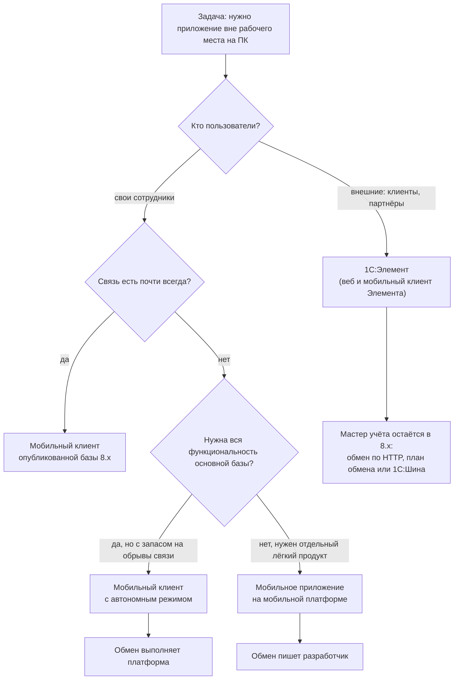
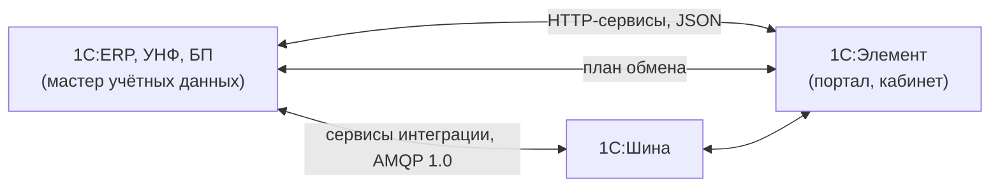

# Трек: 1С:Элемент и мобильная разработка

[← Все треки](README.md) | [🗺 Оглавление](../README.md)

> Актуализировано: сентябрь 2026.

Опциональная ветка на Этапе 7 для тех, кто уже уверенно работает на платформе 1С:Предприятие 8 (Этапы 0–4 пройдены). Здесь две независимые технологии, которые объединяет одно: обе расположены «рядом» с основной платформой и расширяют её на внешних пользователей и на выездные сценарии.

- **1С:Предприятие.Элемент** — отдельная платформа для веб- и мобильных приложений: порталы, кабинеты, сервисы. Свой язык, своя база, своя среда разработки.
- **Мобильная платформа 1С:Предприятие 8** — та же платформа 8.x, запущенная на телефоне или планшете: мобильный клиент, автономный режим, мобильное приложение.

Для первой работы эта ветка не нужна: на рынке это ниша (см. раздел о спросе). Берите её, если в вашей компании или проекте уже есть такая задача, либо если вам интересно расширить кругозор после того, как закрыты базовые этапы. Проект P16 из [../07_Projects.md](../07_Projects.md) относится именно к мобильной части этого трека.

## 🎯 Кто это и чем занимается

| Направление | Что делает разработчик | Типичный результат |
|---|---|---|
| Элемент | Проектирует справочники, документы и регистры приложения, описывает формы декларативно, пишет логику на языке 1С:Элемент, публикует HTTP-сервисы, настраивает обмен с учётными системами на 8.x | Портал или кабинет для внешних пользователей, который обменивается данными с ERP или УНФ |
| Мобильный клиент и автономный режим | Адаптирует управляемые формы под телефон, настраивает публикацию базы, определяет состав автономной конфигурации | Сотрудник работает с базой со смартфона, а при потере связи не теряет возможность вводить данные |
| Мобильное приложение | Делает отдельную мобильную конфигурацию, пишет обмен с центральной базой, подключает камеру, геопозицию и push, собирает и подписывает пакет | Приложение торгового агента, кладовщика или курьера, работающее без постоянной связи |

## 🧭 Как выбрать технологию



## 🏢 Где работает

- **Франчайзи и проектные компании.** Мобильные сценарии в складских и торговых внедрениях (ТСД, торговые агенты, курьеры, мобильная касса), порталы заказчиков на Элементе по запросу клиента.
- **Инхаус.** Приложение для выездных сотрудников и склада, кабинет сотрудника или клиента рядом с основной учётной системой.
- **Продуктовые команды.** Собственные мобильные клиенты и приложения под брендом продукта. Сама фирма «1С» публикует мобильные клиенты своих типовых (УНФ, «Розница», «БизКуб») и ряд мобильных продуктов: «1С:Кладовщик», «1С:Мобильная касса», «1С:Проверка ценников», «1С:Заказы» (по коду открытой выгрузки УНФ). Для перевозок по ЭПД (обязательны с 01.09.2026, 140-ФЗ; проверяйте актуальную редакцию на consultant.ru) в УНФ и УТ есть модуль сервиса взаимодействия мобильного приложения для водителей, но точное название продукта не проверено.

## 📈 Спрос

Качественно: ниша. В выборке hh.ru за 10.08–07.09.2026 (452 вакансии 1С, собрана третьими лицами) Элемент встретился в одной вакансии, опыт разработки мобильных приложений на 1С требовался в одной вакансии разработчика, ещё одна вакансия тестировщика упоминала мобильное приложение. В более ранних выборках (hh.ru 2025, Хабр Карьера, май 2026) вакансий с «мобильной разработкой» в названии или навыках не нашлось, хотя выборки небольшие и полных текстов описаний в них нет. В опросе сообщества Landscape1C 2026 (313 респондентов, самоотбор) Элемент назвали 23 человека (около 7%), это ориентир, а не статистика рынка. Мобильные компетенции востребованы внутри внедрений в ритейле, логистике и на складах. Числа по вакансиям и методика сбора — в [../13_Career.md](../13_Career.md); зарплаты здесь не приводятся.

Практический вывод: это не отдельная профессия, а надстройка над ролью разработчика ([developer-franchise.md](developer-franchise.md), [developer-product.md](developer-product.md)) или интегратора ([integration.md](integration.md)).

## 🌐 1С:Предприятие.Элемент

### Что это

Самостоятельная платформа приложений: своя БД, справочники, документы, регистры сведений и накопления, транзакции, ключи доступа (аналог RLS), HTTP- и SOAP-сервисы, планы обмена, регламентные задания, отчёты. Актуальная версия — **10.0** (главная новинка — расширения); приложения работают в браузере и в мобильном клиенте. Развёртывание: облако `1cmycloud.com` или собственная установка (устанавливаемая IDE; страница проекта на releases.1c.ru). Точная дата финального релиза 10.0 не подтверждена: облачная сборка называется `10.0.2-19`, инструменты сообщества перешли на 10.0 в конце сентября 2026 года.

Элемент не заменяет 8.x и не является «фронтендом для 1С»: у него своя база и своя бизнес-логика. Типичная схема: ERP остаётся мастер-системой учёта, а Элемент хранит данные портала и обменивается с ERP.

### Сравнение с платформой 8.x

| Критерий | 1С:Предприятие 8.3 / 8.5 | 1С:Предприятие.Элемент 10.0 |
|---|---|---|
| Назначение | Учётные системы (ERP, БП, ЗУП, УТ), back-office | Веб- и мобильные приложения для конечных и внешних пользователей: порталы, кабинеты, сервисы, боты |
| Язык | Встроенный язык 1С, динамическая типизация | Язык 1С:Элемент (в сообществе «xBSL», файлы `.xbsl`), статическая типизация |
| Метаданные | Конфигурация (Конфигуратор или EDT) | Проект: YAML-описания и `.xbsl`-модули, `Проект.yaml`; библиотеки `.xlib`, расширения (10.0) |
| Интерфейс | Управляемые формы, «Такси» и «Версия 8.5» | Декларативные формы и компоненты в YAML; HTML и JS встраиваются только через `КонтейнерHtml` |
| Среда разработки | Конфигуратор, 1C:EDT | Веб-IDE в облаке, устанавливаемая IDE; плагины VS Code от сообщества (неофициальные) |
| Развёртывание | Файловый или клиент-серверный вариант, кластер, веб-сервер | Облако или собственная установка |
| Интеграции | HTTP- и Web-сервисы, OData, XDTO и JSON, сервисы интеграции, WebSocket-клиент (8.3.27+), внешние компоненты | `HttpСервис`, `SoapСервис`, `КлиентHttp`, `КлиентSoapСервиса`, планы обмена, процессы интеграции |

Про контейнеры, Kubernetes, горизонтальное масштабирование, цены и лицензирование Элемента открытых подтверждений нет: уточняйте на `1cmycloud.com/welcome/` и у вендора.

### Язык

Статическая типизация с опциональной динамикой (тип `неизвестно`, приведение `как`). Блоки закрываются символом `;`. Основные конструкции: `метод`, `знч` (неизменяемое значение), `пер` (переменная), `конст`, аннотации `@НаСервере`, `@НаКлиенте`, `@Глобально`, обобщённые типы (`Соответствие<Строка, Число>`), nullable-типы (`Строка?`), `импорт`. Язык и документация русскоязычные, английская нотация — опция, поэтому английский для Элемента не критичен. Обоснование статической типизации приводится в официальной книге по языку на ИТС (по цитатам из проектов сообщества; сами страницы не проверялись, ссылка в ресурсах).

Фрагмент из открытого проекта сообщества (`korolevpavel/xbsl-tbank-pay`, эквайринг), сокращён. Он показывает, как выглядит логика: типизированный запрос, JSON, возврат типизированного ответа.

```text
импорт Служебные

@Глобально
метод ИнициироватьПлатеж(ЗапросБезТокена: TBankInitRequest): TBankInitResponse
    знч Запрос = новый TBankInitRequest(TerminalKey = ЗапросБезТокена.TerminalKey, ...)
    знч ТелоОтвета = ВыполнитьJsonЗапрос("/v2/Init", СериализацияJson.ЗаписатьОбъект(Запрос))
    знч Ответ = СериализацияJson.ПрочитатьОбъект(ТелоОтвета, Тип<TBankInitResponse>)
    возврат Ответ
;
```

Исходящий HTTP в Элементе строится цепочкой `КлиентHttp.СБазовымUrl(...).СТаймаутомЗапроса(...)`, затем `Клиент.ЗапросPost(Путь).УстановитьЗаголовок(...).УстановитьТело(...).Выполнить()`. Входящий — `HttpСервис` с маршрутами и правами `HttpСервисПраво.*`, обработчик получает `HttpСервисЗапрос`. Принцип «таймаут у каждого внешнего вызова» действует и здесь, он описан в [integration.md](integration.md).

### Связка с 8.x



Правила проектирования:

1. Для каждого объекта назначьте мастер-систему. Не дублируйте учётную логику ERP в Элементе.
2. Синхронные вызовы — для операций с немедленным ответом (остаток, цена). Массовые и несрочные обмены — через планы обмена или очередь.
3. Из открытых примеров: проект «УНФ и Элемент», где Элемент публикует `HttpСервис` и ведёт узел плана обмена `ОбменУНФ`, а УНФ вызывает эти сервисы. Обмен в Элементе строится на `ПланОбмена` и `ИнтегрируемоеПриложение` (адрес и учётные данные задаются в работающем приложении, а не в YAML).
4. `ПроцессИнтеграции` описывает обмен между информационными системами в понятиях Шины: источники, преобразования, маршруты.
5. **1С:Шина** построена на той же технологии, что и Элемент. Со стороны 8.x подключается объектом «Сервисы интеграции» (8.3.17+, AMQP 1.0). Номер версии и цены не называем; подробности — в [integration.md](integration.md).

### 1С:Предприятие.Элемент Скрипт

Бывший «1С:Исполнитель», переименован с версии 9.0, распространяется свободно, имеет встроенную IDE с отладчиком; язык тот же. Это самый простой способ попробовать язык Элемента без развёртывания проекта: скрипты работы с файлами и HTTP. Онлайн-среда: `1cmycloud.com/console/play`.

### Неофициальные инструменты сообщества

Проекты на GitHub, их нужно оценивать как сторонние (лицензия, активность, совместимость с вашей версией):

- `bia-technologies/vscode-xbslplugin` — плагин VS Code;
- `keyfire/xbsl` — линтер, LSP и MCP-сервер; `keyfire/elemctl` — CLI для Console API облака (сборка, запуск и остановка приложений);
- `korolevpavel/xbsl-ai-skills`, `korolevpavel/xbsl-mcp-docs` — наборы для ИИ-агентов; относитесь к ним как к вспомогательным, результат проверяйте компиляцией и тестами (см. [../09_AI_Development.md](../09_AI_Development.md));
- `deplatoon/element_components` — библиотека компонентов.

## 📱 Мобильная платформа 1С:Предприятие 8

Отдельной «версии мобильной платформы 2026» нет: она выходит вместе с платформой 8.x. На сентябрь 2026 рабочие линии — 8.3.27 и 8.5.1; 8.5.4 существует как тестовая, и именно в ней заявлена поддержка ОС «Аврора» (мобильная платформа, push, сборка сборщиком). Нумерация сборок мобильной платформы отличается от десктопной; номер актуальной мобильной сборки подтвердить не удалось, смотрите `releases.1c.ru`. По документации 8.5.1 мобильная платформа и мобильный клиент работают на iOS, Android и Windows (актуальность Windows в 2026 году не проверена). Возможности десктопной платформы автоматически в мобильную не переносятся: новое для мобильной версии описано в `V8Update.htm`, раздел «Мобильная версия».

### Варианты

Для платформы 8 различают мобильную платформу (среду исполнения) и три способа её использовать: мобильный клиент, мобильный клиент с автономным режимом и мобильное приложение. Четвёртая строка таблицы относится к смежной технологии Элемента.

| Вариант | Где данные | Нужна ли связь | Кто пишет синхронизацию | Распространение |
|---|---|---|---|---|
| Мобильный клиент | В опубликованной базе на сервере (работа как тонкий клиент через веб-сервер) | Да | Не нужна | Клиент из магазина или отдельное брендированное приложение под конфигурацию |
| Мобильный клиент с автономным режимом | В основной базе и в автономной базе на устройстве | Работает и при обрывах | Механизм платформы по плану обмена и «составу автономной конфигурации» | Как у мобильного клиента |
| Мобильное приложение | В локальной файловой ИБ на устройстве | Постоянная связь не нужна | Разработчик: план обмена (кроме РИБ) плюс веб- или HTTP-сервис | «Сборщик мобильных приложений» создаёт `.apk` или `.ipa`; магазины, прямая установка, MDM |
| Мобильный клиент Элемента | В приложении Элемента | Да | Определяется проектом | Браузер и мобильный клиент Элемента |

Важно: мобильное приложение — это мобильная платформа (среда исполнения) плюс конфигурация, упакованные вместе. В нативный код оно **не компилируется**. Автономный режим мобильного клиента — отдельная тема от мобильного приложения: механизм обмена там встроен в платформу.

### Что не поддерживается в мобильном приложении

Поддерживаются: подсистемы, константы, справочники, документы, журналы, регистры сведений и накопления (без разделения итогов и агрегатов), обработки, перечисления, роли и права (с ограничениями), функциональные опции, параметры сеанса, **планы обмена (кроме РИБ)**, управляемые блокировки, подписки на события, запросы, динамический список (с ограничениями), использование веб-сервисов (создавать их в мобильном решении нельзя), общие модули, формы, макеты, СКД, XDTO, полнотекстовый поиск, фоновые задания.

**Не поддерживаются:** бухгалтерский учёт, периодические расчёты, бизнес-процессы и задачи, общие реквизиты, **ограничения доступа к данным (RLS)**, хранилища настроек, внешние источники данных, **регламентные задания**, пользовательская настройка форм, `Состояние()`, `ПоказатьОповещениеПользователя()`, справочная система. На iOS не работают `Выполнить()` и `Вычислить()`. Следствие для проектирования: отбор данных «только свои клиенты» делает план обмена на стороне центра, а не RLS на устройстве. Расширения в автономном режиме использовать можно, но включать их в состав автономной конфигурации нельзя.

### Синхронизация

В мобильном приложении данные уходят в центр через план обмена и сервис. В официальной демо-конфигурации 1С это план обмена «Мобильные» и веб-сервис `MAExchange`. В мобильном клиенте с автономным режимом обмен выполняет платформа по тому же плану обмена. Поведение команд при недоступности основного сервера задаёт перечисление `ПоведениеПриНедоступностиОсновногоСервера` (с 8.3.16).

Главное правило синхронизации: идентификатор объекта назначается на устройстве, и повторная доставка не должна создавать дубль. Ниже серверная сторона в центральной базе (серверный общий модуль без флагов «Клиент»). Имена объектов (`ЗаказКлиента`, `Клиенты`) условные, замените их именами из проекта P1–P3.

```bsl
// Принимает заказ, созданный на устройстве. Идентификатор документа назначен на устройстве
// и приходит в данных, поэтому повторная доставка находит уже созданный документ.
//
// Параметры:
//  ДанныеЗаказа - Структура - Идентификатор (Строка), Дата (Дата), Клиент (Строка, идентификатор),
//                 Товары (Массив из Структура: Номенклатура - СправочникСсылка.Номенклатура, Количество, Цена).
//
// Возвращаемое значение:
//  Структура - Ссылка и Создан (Ложь при повторной доставке).
//
Функция ПринятьЗаказАгента(Знач ДанныеЗаказа) Экспорт

	Ссылка = Документы.ЗаказКлиента.ПолучитьСсылку(Новый УникальныйИдентификатор(ДанныеЗаказа.Идентификатор));
	Клиент = Справочники.Клиенты.ПолучитьСсылку(Новый УникальныйИдентификатор(ДанныеЗаказа.Клиент));
	Если Не ОбщегоНазначения.СсылкаСуществует(Клиент) Тогда
		ВызватьИсключение НСтр("ru = 'Клиент не найден в центральной базе.'");
	КонецЕсли;

	Создан = Ложь;
	НачатьТранзакцию();
	Попытка
		Блокировка = Новый БлокировкаДанных;
		ЭлементБлокировки = Блокировка.Добавить("Документ.ЗаказКлиента");
		ЭлементБлокировки.УстановитьЗначение("Ссылка", Ссылка);
		Блокировка.Заблокировать();

		Если Не ОбщегоНазначения.СсылкаСуществует(Ссылка) Тогда
			Документ = Документы.ЗаказКлиента.СоздатьДокумент();
			Документ.УстановитьСсылкуНового(Ссылка);
			Документ.Дата = ДанныеЗаказа.Дата;
			Документ.Клиент = Клиент;
			Для Каждого Товар Из ДанныеЗаказа.Товары Цикл
				ЗаполнитьЗначенияСвойств(Документ.Товары.Добавить(), Товар);
			КонецЦикла;
			Документ.Записать(РежимЗаписиДокумента.Проведение);
			Создан = Истина;
		КонецЕсли;

		ЗафиксироватьТранзакцию();
	Исключение
		ОтменитьТранзакцию();
		ЗаписьЖурналаРегистрации(НСтр("ru = 'Заказы агентов.Приём'", ОбщегоНазначения.КодОсновногоЯзыка()),
			УровеньЖурналаРегистрации.Ошибка, , Ссылка, ПодробноеПредставлениеОшибки(ИнформацияОбОшибке()));
		ВызватьИсключение;
	КонецПопытки;

	Возврат Новый Структура("Ссылка, Создан", Ссылка, Создан);

КонецФункции
```

Замечания. Блокировка по ссылке нужна, чтобы две одновременные доставки одного заказа не создали документ дважды (стандарт [#460](https://its.1c.ru/db/v8std/content/460/hdoc)). Ссылки на номенклатуру в строках также проверьте перед записью, но одним запросом с параметром-массивом, а не `СсылкаСуществует` в цикле. Данные клиента, дошедшие с устройства, считайте недоверенными и проверяйте так же, как вход HTTP-сервиса.

### Форма под мобильный клиент

Режим запуска различают инструкции препроцессора: `МобильныйКлиент`, `МобильноеПриложениеКлиент`, `МобильноеПриложениеСервер` и `МобильныйАвтономныйСервер` (проверяется отдельным проходом). Пример для клиентского кода формы:

```bsl
&НаКлиенте
Процедура ПриОткрытии(Отказ)

#Если МобильныйКлиент Тогда
	// Только для мобильного клиента: убираем второстепенные элементы с узкого экрана.
	Элементы.ГруппаДополнительно.Видимость = Ложь;
#КонецЕсли

КонецПроцедуры
```

Пишите формы немодально (стандарт [#703](https://its.1c.ru/db/v8std/content/703/hdoc), `ОписаниеОповещения`, `Асинх` и `Ждать` с 8.3.18) и минимизируйте серверные вызовы ([#487](https://its.1c.ru/db/v8std/content/487/hdoc)): на мобильной сети они дороже. Пакетная проверка модулей во всех мобильных режимах: `/CheckModules` с ключами `-MobileClient`, `-MobileClientStandalone`, `-MobileAppClient`, `-MobileAppServer`; это удобно подключить в CI.

### Возможности устройства

Перечень «используемых функциональностей мобильного приложения» задаётся в метаданных (в XSD 8.5.1 их 36, в метамодели EDT 2026.1 — 38, добавлены распознавание и синтез речи). Проверить поддержку на конкретном устройстве можно методом `ПоддерживаетсяФункциональностьМобильногоПриложения`. Точные сигнатуры методов смотрите в синтакс-помощнике.

| Возможность | Объект или метод | Доступно с |
|---|---|---|
| Геопозиционирование, фоновое отслеживание | `СредстваГеопозиционирования` | 8.3.3 |
| Геозоны | `Геозона`, `ВключитьОтслеживаниеГеозон` | 8.3.10 (как функциональность — 8.3.24) |
| Фото, видео, аудио | `СредстваМультимедиа` | 8.3.3 |
| Сканирование штрихкодов камерой | `ПоказатьСканированиеШтрихКодов` | 8.3.5 |
| Сканирование документов | `ПоказатьСканированиеДокументов`, `СканироватьДокументыАсинх` | 8.3.23 |
| NFC | `СредстваNFC` | 8.3.23 |
| Телефония, SMS, журнал звонков | `СредстваТелефонии` | 8.3.5 |
| Биометрия | `СпособБиометрическойПроверки` | 8.3.15 |
| Push-уведомления | `ДоставляемыеУведомления`, `ОтправкаДоставляемыхУведомлений` | 8.3.6 |
| Встроенные покупки | `ВстроенныеПокупки`, `СервисВстроенныхПокупок` | 8.3.8 |
| Реклама | `ОтображениеРекламы` | 8.3.8 |
| Распознавание и синтез речи | `РаботаСРечью` | 8.3.23 |
| Видеоконференции | `СистемаВзаимодействия.ВидеоконференцияАсинх` | 8.3.18 (в мобильном приложении — 8.3.22) |

Внешние компоненты поддерживаются и в мобильном приложении (пример из сообщества — компонента для ТСД ATOL Smart Lite). Для ТСД это частый путь получения штрихкодов с аппаратного сканера.

### Push, покупки, реклама: что есть и чего нет

- **Push:** APNS (Apple), FCM (Google), WNS (Windows), HUAWEI Push Kit (с 8.3.24). GCM устарел с 8.3.13. Отправка — `ОтправкаДоставляемыхУведомлений.Отправить(...)`, можно через промежуточный сервис. Для «Авроры» push заявлен в тестовой 8.5.4. Нативного типа подписчика для RuStore Push в синтакс-помощнике 8.3.25 нет.
- **Встроенные покупки** — давняя возможность, не новинка: Apple и Google Play с 8.3.8, Windows с 8.3.14, HUAWEI с 8.3.24. Нативного RuStore Billing в `СервисВстроенныхПокупок` нет (8.5.4 на этот счёт не проверялась). Для аудитории в РФ оплата через Google Play и App Store ограничена с 2022 года (по вторичным источникам), реалистичный рынок — корпоративные приложения.
- **Реклама:** `ОтображениеРекламы` построено на Google AdMob (видео с вознаграждением с 8.3.14). Apple закрыла iAd 30.06.2016, ссылаться на него как на актуальную возможность нельзя. Отечественных рекламных SDK в платформе не найдено.

### Сборка и публикация в 2026 году

**Сборщик мобильных приложений** — конфигурация в составе дистрибутива мобильной платформы: хранит версии мобильных конфигураций, пакеты графики и версии платформы, собирает под Android, а для iOS при наличии Mac с Xcode выполняет полный цикл и создаёт `.ipa`. Описание в ИТС относится к 8.3.8 (2016): детали про магазины и инструменты сборки сверяйте с документацией вашей версии. Для сборки и подписи под iOS нужен Mac, для Android — нет. В учебной версии платформы собирать мобильные приложения для публикации нельзя (по каталогу online.1c.ru, уточняйте).

**Отладка:** Android — через ADB из Конфигуратора (нужны каталог Android SDK и мобильная платформа разработчика `1cem-arm.apk` или `1cem-x86.apk`, подойдёт эмулятор); iOS — только ручной запуск решения на устройстве. Формы можно предпросматривать по профилям мобильных устройств.

**Требования магазинов в 2026 году** (по официальным страницам; сверяйте перед релизом):

| Магазин | Требование | Срок |
|---|---|---|
| Google Play | Новые приложения и обновления нацеливаются на Android 16 (API 36) | с 31.08.2026 |
| App Store | Сборка в Xcode 26 с SDK iOS 26 | с 28.04.2026 |
| App Store | Минимальная целевая версия iOS 13 | с 09.09.2026 |
| Android | Верификация разработчиков: с 30.09.2026 в Бразилии, Индонезии, Сингапуре и Таиланде, в 2027 году — по всему миру на сертифицированных устройствах | 30.09.2026 и 2027 |

Совместимость конкретных сборок мобильной платформы и сборщика с API 36 и Xcode 26 в источниках не подтверждена: сверяйте с `V8Update.htm` и описанием сборщика. Как верификация разработчиков затронет в 2027 году установку APK вне Google Play (RuStore, MDM, прямая установка) в России, не проверено. Минимальные версии Android и iOS для мобильной платформы 8.5.x не подтверждены: смотрите раздел системных требований на `v8.1c.ru`.

**Каналы публикации.** Фирма «1С» в 2025–2026 годах публикует свои мобильные клиенты параллельно в RuStore, Google Play и App Store (по коду выгрузки УНФ). Для устройств Huawei платформа поддерживает HUAWEI Push Kit и HUAWEI In-App Purchases, но требования AppGallery не проверялись. Условия Apple Developer Program для разработчиков из РФ не проверены: уточняйте для своей юрисдикции. Для внутренних приложений (ТСД, торговые агенты) часто хватает прямой установки или MDM.

**Тестирование.** Vanessa Automation умеет тестировать мобильный клиент (подключение Android-устройства через `adb`, инструкция `docs/mobile/mobile.md` в репозитории). У способа есть ограничения (в документации — «не работает в SQL базах», проверено на 8.3.19).

## 🧠 Навыки по уровням

Легенда: 🔴 обязательно, 🟡 желательно, 🔵 по контексту (см. [../README.md](../README.md)). Метки относятся к выбранной ветке: берите навыки либо Элемента, либо мобильной разработки, не обе ветки сразу.

| Уровень | Ветка | Навыки |
|---|---|---|
| Junior+ | Элемент | 🔴 Язык Элемента: типы, коллекции, аннотации `@НаСервере`, `@НаКлиенте`; Элемент Скрипт для практики |
| Junior+ | Элемент | 🔴 Первый проект в облаке: справочник, документ, формы списка и элемента, `Проект.yaml`, сборка и запуск |
| Junior+ | Мобильная | 🔴 Публикация базы на веб-сервере, работа с мобильным клиентом, настройка вида форм для телефона |
| Middle | Элемент | 🔴 Регистры, запросы, транзакции, ключи доступа, регламентные задания |
| Middle | Элемент | 🔴 `HttpСервис`, `КлиентHttp`, `СериализацияJson`, таймауты, обмен с учебной базой 8.3 |
| Middle | Элемент | 🟡 `ПланОбмена`, `ИнтегрируемоеПриложение`, Git и плагин VS Code, деплой через Console API (`elemctl`) |
| Middle | Мобильная | 🔴 Адаптация форм: препроцессор `МобильныйКлиент`, немодальные вызовы (#703), экономия серверных вызовов (#487) |
| Middle | Мобильная | 🔴 Ограничения мобильного приложения: нет RLS, регламентных заданий, бухучёта; проверка `/CheckModules` |
| Middle | Мобильная | 🟡 Автономный режим: состав автономной конфигурации, `ПоведениеПриНедоступностиОсновногоСервера` |
| Senior | Элемент | 🔴 Архитектура: мастер-система, граница между 8.x и Элементом, синхронные и асинхронные обмены |
| Senior | Элемент | 🟡 Расширения (10.0), процессы интеграции, 1С:Шина, CI-деплой |
| Senior | Мобильная | 🔴 Мобильное приложение целиком: обмен через план обмена и сервис, идемпотентный приём, отбор по узлу |
| Senior | Мобильная | 🟡 Сборщик, подпись (Android keystore; сертификаты и профили Apple), push (FCM, APNS, HPK) |
| Senior | Мобильная | 🔵 Внешние компоненты для ТСД, публикация в RuStore, Google Play и App Store, автотесты в Vanessa Automation |
| Senior+ | Обе | 🔵 Выбор технологии под задачу и стоимость владения: мобильный клиент, автономный режим, приложение или Элемент |

## 🔧 Инструменты

| Инструмент | Для чего | Заметки |
|---|---|---|
| Веб-IDE Элемента (`1cmycloud.com`) | Разработка приложений Элемента, сборка, запуск | Облачная; есть устанавливаемая IDE |
| Элемент Скрипт | Знакомство с языком | Бесплатный, встроенная IDE с отладчиком |
| Конфигуратор | Отладка мобильного клиента и приложения через ADB, предпросмотр форм | Мобильная конфигурация поддерживается и в EDT |
| 1C:EDT | Разработка мобильных конфигураций, предпросмотр форм под интерфейс 8.5 и мобильные | Версии и ветки — в [developer-product.md](developer-product.md) |
| Сборщик мобильных приложений | Пакет `.apk` или `.ipa` | Входит в дистрибутив мобильной платформы |
| Android SDK, эмулятор, ADB | Отладка на Android | Для iOS — Mac и Xcode |
| Vanessa Automation | Тесты мобильного клиента | Ограничения — выше; общие вопросы — [qa-automation.md](qa-automation.md) |
| `elemctl`, `keyfire/xbsl`, плагины VS Code | Деплой и разработка для Элемента вне веб-IDE | Сторонние, не поддерживаются фирмой «1С» |

## 🎓 Сертификация

Для Элемента существует сертификационный экзамен (издан сборник вопросов по версии «Элемент 5.0», май 2024) и аттестация «1С:Специалист по технологии 1С:Предприятие.Элемент» у УЦ №1. Точное официальное название экзамена, формат и порядок сдачи подтвердить не удалось: смотрите страницу аттестации УЦ №1 (ссылка ниже). Для мобильной разработки отдельного экзамена нет; базой служат 1С:Профессионал и 1С:Специалист по платформе, общая картина — в [../04_Certifications.md](../04_Certifications.md). Курс УЦ №1 по мобильной разработке не подтверждён.

## 🧪 Проекты

| ID | Проект | Что тренирует |
|---|---|---|
| P16 | Мобильное приложение «Торговый агент» (опционально) | Мобильная платформа, адаптация форм, синхронизация через план обмена, отладка на устройстве |

Подробная постановка, критерии приёмки и «звёздочки» — в [../07_Projects.md](../07_Projects.md). Для Элемента отдельного проекта в общем списке нет, ниже ориентиры для самостоятельной работы:

- Портал заявок или кабинет клиента на Элементе: справочники, документ заявки, ключи доступа, форма списка и карточки.
- Обмен Элемента с учебной базой 8.3: `HttpСервис` и `КлиентHttp` на стороне Элемента, HTTP-сервис в 8.3, план обмена между ними (по образцу открытого проекта «УНФ и Элемент»).
- Для P16: сканирование штрихкодов камерой и геометка заказа; режим «автономный» с составом автономной конфигурации; автотест в Vanessa Automation.
- Изучить код: демо-конфигурацию 1С (`MAExchange`, модули `ОбменМобильные*`, «Путеводитель» → «Мобильный клиент») и демо-план обмена `_ДемоМобильныйКлиент` в БСП.

## 📅 План на 3–6 месяцев входа в трек

Ориентир при 15–20 часах в неделю; сроки — оценка авторов, а не факт. Выберите одну ветку.

**Ветка «Элемент»**

| Период | Цель | Результат |
|---|---|---|
| Неделя 1 | Элемент Скрипт: синтаксис, типы, коллекции, `импорт`; скрипт с файлами и HTTP | Работающий скрипт в репозитории |
| Неделя 2 | Облако `1cmycloud.com`: первый проект, формы, `Проект.yaml`, сборка и запуск | Приложение со справочником и документом |
| Неделя 3 | Регистры, запросы, ключи доступа, регламентное задание | Права «видит только своё» проверены тестом |
| Неделя 4 | `HttpСервис` и `КлиентHttp`, `СериализацияJson`; обмен с учебной базой 8.3 | Двусторонний обмен с таймаутами и логом |
| Недели 5–6 | Пет-проект (портал заявок, кабинет, Telegram-бот), расширения 10.0, Git и деплой через `elemctl` | Репозиторий с README и скриншотами |
| После недели 6 (до месяца 6) | Аттестация по Элементу (по желанию), чтение чужих проектов, участие в сообществе, второй пет-проект | Портфолио из 1–2 приложений |

**Ветка «Мобильная разработка»**

| Период | Цель | Результат |
|---|---|---|
| Месяц 1 | Мобильный клиент: публикация базы, адаптация 2–3 форм, `/CheckModules -MobileClient` | Учебная база работает с телефона |
| Месяц 2 | Основа P16: справочники клиентов и номенклатуры, документ заказа, штрихкоды, фото, ADB и эмулятор | Приложение запускается на эмуляторе |
| Месяц 3 | Обмен: план обмена, сервис, идемпотентный приём заказов (код выше) | Повторная синхронизация не создаёт дублей |
| Месяц 4 | Автономный режим, push (FCM, для Huawei — HPK), геометка | Сценарий «без связи» проверен |
| Месяцы 5–6 | Сборщик, подпись, пробная публикация или MDM-установка; автотест в Vanessa Automation | Подписанный пакет и отчёт о тесте |

Критерии готовности: вы объясняете, что произойдёт при обрыве связи посреди синхронизации и при повторной доставке; называете, чего нет в выбранном варианте (RLS, регламентные задания, РИБ), и как это обошли; у проекта есть README и воспроизводимая сборка.

## 📚 Ресурсы

**Элемент.** Официальное: `1cmycloud.com/welcome/`, `v8.1c.ru/platforma/1s-predpriyatie-element/`, документация и «что нового в 10.0» (ссылки ниже), книга по языку `its.1c.ru/db/pubelementlang` (часть ИТС по подписке), документация Элемента Скрипт, базовый курс УЦ №1 (учебный проект «Чирикер»), курс УЦ №1 по Элементу Скрипт. Сообщество: официальная Telegram-группа `t.me/e1c_element`, открытые проекты (`badyanov/chiriker`, `AlexanderKulikov/elementunf`, `PavelShilkin78/EmployeeCabinetDemo`).

**Мобильная платформа.** Официальная демо-конфигурация 1С (`1C-Company/dt-demo-configuration`); «Руководство разработчика» документации 8.5 на ИТС (мобильная платформа, Приложение 7 о поведении в разных режимах, глава «Сервисные возможности»); `V8Update.htm`; книга Е.Ю. Хрусталевой «Знакомство с разработкой мобильных приложений на платформе 1С:Предприятие 8» (по данным сообщества, написана для ранних версий 8.3, примеры сверяйте с актуальной платформой); портал `mobile.1c.ru` и конференция «Мобильная среда» (содержимое не проверялось); документация Vanessa Automation по мобильному клиенту; страницы требований магазинов (ссылки ниже).

Стандарты по теме: [#703](https://its.1c.ru/db/v8std/content/703/hdoc) (модальность), [#487](https://its.1c.ru/db/v8std/content/487/hdoc) (серверные вызовы), [#701](https://its.1c.ru/db/v8std/content/701/hdoc) (планы обмена с отборами), [#460](https://its.1c.ru/db/v8std/content/460/hdoc) (управляемые блокировки). Общие ресурсы и сообщества: [../05_Resources.md](../05_Resources.md).

## ❌ Частые заблуждения

- «Мобильная платформа компилирует код в нативные приложения». Нет: это среда исполнения плюс конфигурация в одном пакете.
- «Встроенные покупки появились недавно» и «реклама через iAd». Покупки есть с 8.3.8, iAd закрыт в 2016 году.
- «Элемент — это интерфейс к 1С на веб-технологиях». Нет: у него своя база, язык и транзакции; интерфейс описывается декларативно.
- «Осваивать Элемент могут только опытные». Это не подтверждается: платформу изучают в вузовских треках и дипломных проектах, есть базовый курс УЦ №1. Другое дело, что статическая типизация и YAML-описание интерфейса требуют отдельного обучения.
- «В 8.5 появилась мобильная разработка» или «Аврора уже в рабочей 8.5». Мобильная платформа есть давно, поддержка «Авроры» заявлена в тестовой 8.5.4.
- «Мобильное приложение можно сделать из любой конфигурации без доработки». Часть объектов не поддерживается, а обмен нужно проектировать.

## 🚀 Первые шаги

1. Решите, какая ветка нужна вам: Элемент или мобильная платформа. Не начинайте обе сразу.
2. Для Элемента: установите или откройте Элемент Скрипт и напишите скрипт, который запрашивает данные по HTTP и пишет файл. Затем соберите первый проект в облаке.
3. Для мобильной ветки: опубликуйте учебную базу на веб-сервере, откройте её мобильным клиентом и адаптируйте две формы.
4. Прочитайте в документации главу про мобильную платформу и Приложение о различиях режимов, составьте для себя список «чего нет».
5. Склонируйте демо-конфигурацию 1С и разберите обмен `MAExchange`.
6. Прочтите стандарты #703, #487, #460 и проверьте свой код.

## 🔗 Связанные треки

- [integration.md](integration.md): HTTP, обмены, 1С:Шина, идемпотентность, очередь.
- [developer-product.md](developer-product.md): EDT, Git, CI для мобильных и Элемент-проектов.
- [developer-franchise.md](developer-franchise.md): складские и торговые внедрения, где чаще всего нужны мобильные сценарии.
- [qa-automation.md](qa-automation.md): автотесты мобильного клиента.
- [administrator-operator.md](administrator-operator.md): публикация базы на веб-сервере для мобильного клиента.

## 🔗 Источники

Элемент (часть адресов найдена через сторонние проекты и в документации цитируется, прямое открытие не проверялось):

- https://1cmycloud.com/welcome/
- https://v8.1c.ru/platforma/1s-predpriyatie-element/
- https://1cmycloud.com/console/help/element/docs/topics/1c-element-overview/
- https://1cmycloud.com/console/help/element/10.0/docs/topics/whats-new-in-10-0/
- https://1cmycloud.com/console/help/lang/docs/topics/what-is-1c-element-script/
- https://1cmycloud.com/console/help/lang/docs/topics/whats-new-in-9-0/
- https://1cmycloud.com/console/play
- https://its.1c.ru/db/pubelementlang
- https://uc1.1c.ru/course/attestatsiya-1s-spetsialist-po-tehnologii-1s-predpriyatie-element/
- https://uc1.1c.ru/course/1c-predpriyatie-element-skript-znakomstvo-so-vstroennym-yazykom-krossplatformennogo-instrumenta-na-prostyh-primerah/
- https://t.me/e1c_element
- https://github.com/keyfire/xbsl
- https://github.com/keyfire/elemctl
- https://github.com/korolevpavel/xbsl-ai-skills
- https://github.com/korolevpavel/xbsl-ai-skills/blob/master/docs/element-10-audit.md
- https://github.com/korolevpavel/xbsl-mcp-docs
- https://github.com/korolevpavel/xbsl-tbank-pay
- https://github.com/bia-technologies/vscode-xbslplugin
- https://github.com/deplatoon/element_components
- https://github.com/AlexanderKulikov/elementunf
- https://github.com/PavelShilkin78/EmployeeCabinetDemo
- https://github.com/badyanov/chiriker
- https://github.com/verDenoise/prof-element
- https://github.com/Oxotka/StackTechnologies1C

Мобильная платформа:

- https://github.com/1C-Company/dt-demo-configuration
- https://github.com/butbik2025/BSL_8.5.1_dev_docs (копия «Руководства разработчика» 8.5.1)
- https://github.com/yellow-hammer/namespace-forest (XSD-схемы выгрузки по сборкам платформы)
- https://github.com/legioner9/d1cv8 (дамп синтакс-помощника 8.3.25)
- https://github.com/Iglatypov/UNF_BSL_EDT (выгрузка УНФ: мобильные клиенты и продукты)
- https://github.com/VasiliiPRO1C/ssl_3_1_11_189 (БСП: демо-план обмена мобильного клиента)
- https://github.com/Pr-Mex/vanessa-automation/blob/master/docs/mobile/mobile.md
- https://github.com/innovait-rus/AtolSmartLiteUtils
- https://v8.1c.ru/platforma/news/novoe-v-platforme-8-5-4/
- https://v8.1c.ru/metod/books/42725.htm
- https://mobile.1c.ru/sreda/
- https://developer.android.com/google/play/requirements/target-sdk
- https://developer.apple.com/news/upcoming-requirements/
- https://developer.android.com/developer-verification
- https://developer.apple.com/news/?id=01152016a
- https://its.1c.ru/db/v8std/content/703/hdoc, https://its.1c.ru/db/v8std/content/487/hdoc, https://its.1c.ru/db/v8std/content/701/hdoc, https://its.1c.ru/db/v8std/content/460/hdoc

Досье репозитория element_integration, mobile, market, platform (сентябрь 2026).

[← Все треки](README.md) | [🗺 Оглавление](../README.md)
