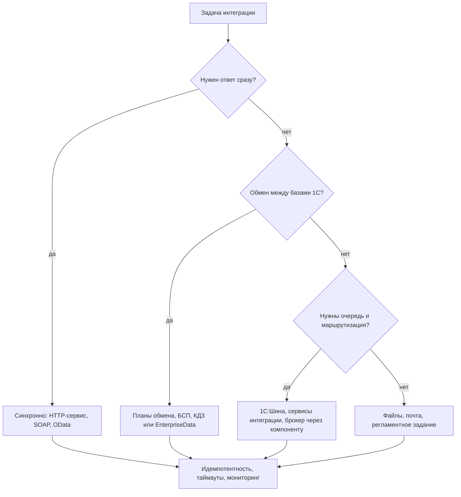

# Трек: интеграции

[← Все треки](README.md) | [🗺 Оглавление](../README.md)

> Актуализировано: сентябрь 2026.

Трек для тех, кто уже уверенно пишет на 1С (Этапы 0–4 пройдены) и хочет заниматься связями между системами: 1С с 1С, 1С с сайтом, банком, маркетплейсом, CRM, брокером сообщений. Формально это Middle и выше: в модели компетенций MC-6-001 интеграции (SOAP, REST, XML, JSON) добавляются к требованиям с уровня Middle. По Этапам из [../02_Timeline.md](../02_Timeline.md) трек продолжает Этап 5 («Надёжность и интеграции») и может стать специализацией на Этапе 7. Отдельного экзамена «по интеграциям» нет, базой служат 1С:Профессионал и 1С:Специалист по платформе (см. [../04_Certifications.md](../04_Certifications.md)).

## 🎯 Кто это и чем занимается

Интегратор проектирует и сопровождает обмен данными так, чтобы он переживал обрывы связи, повторные доставки, обновление типовых и смену версий формата. Код здесь составляет меньшую часть работы: основное время уходит на контракты, ошибки и диагностику.

| Задача | Что делает разработчик | Чем измеряется результат |
|---|---|---|
| Публикация API | HTTP-сервисы, SOAP, стандартный интерфейс OData; версионирование, авторизация, описание контракта | Внешняя команда интегрируется по документации без вашей помощи |
| Клиент внешнего API | `HTTPСоединение`, JSON, таймауты, повторы, очередь исходящих | Сбой чужого сервиса не блокирует пользователей и не теряет сообщения |
| Обмен между базами 1С | Планы обмена, БСП, «Конвертация данных 3.1», EnterpriseData, РИБ | Расхождений нет, а если есть, их можно объяснить по журналу |
| Обмен через шину и брокеры | Сервисы интеграции 1С:Шины, внешние компоненты для RabbitMQ и Kafka, HTTP-шлюзы | Сообщения доставляются как минимум один раз, дубли безопасны |
| Мониторинг и разбор инцидентов | Журнал регистрации, статусы сообщений, отчёты по очередям, алерты | Инцидент находится по идентификатору сообщения за минуты |
| Безопасность обмена | Секреты, TLS, права технического пользователя, ограничение состава публикуемых объектов | Технический пользователь может ровно то, что нужно обмену |

## 🏢 Где работает

- **Франчайзи и проектные компании.** Обмены между типовыми (БП и ЗУП, УТ и БП, УНФ и Розница), подключение сайтов и маркетплейсов, банков и сервисов.
- **Инхаус в крупной компании.** Холдинговые контуры: несколько баз ERP, учётные системы соседних подразделений, шина предприятия.
- **Продуктовые команды.** Собственные API продукта, коннекторы к популярным сервисам, интеграция с облаком и мобильными клиентами.
- **Проекты импортозамещения.** Мосты между 1С и другими системами при поэтапной миграции.

Спрос и зарплаты не приводятся здесь: актуальные данные с методикой и оговорками собраны в [../13_Career.md](../13_Career.md). Качественно: интеграционные навыки повышают ценность Middle и почти обязательны для Senior, а отдельных «чистых» вакансий по 1С-интеграциям немного.

## 🗺 Карта технологий



Версии появления механизмов (по документации платформы и обзорам сообщества; приписывать их 8.5 нельзя, это возможности линии 8.3, которые есть и в 8.5.1):

| Механизм | С версии | Ключевые объекты | Замечания |
|---|---|---|---|
| Web-сервисы (SOAP), WS-ссылки | давно | `WebСервисы`, `WSСсылки`, `WSПрокси`, `WSОпределения`, XDTO | Поддерживается MTOM; таймаут обязателен (стандарт #748) |
| HTTP-клиент | давно | `HTTPСоединение`, `HTTPЗапрос`, `HTTPОтвет` | Типа `ОбъектHTTPЗапроса` не существует. На клиенте асинхронно: `ВызватьHTTPМетодАсинх` |
| HTTP-сервисы | 8.3.5 (в расширениях с 8.3.6) | `HTTPСервисЗапрос`, `HTTPСервисОтвет`, шаблоны URL | Публикация на веб-сервере (Apache, IIS) или через автономный сервер |
| Стандартный интерфейс OData | 8.3.5 (OData v3, Atom); JSON с 8.3.6 | `УстановитьСоставСтандартногоИнтерфейсаOData` | Нужна публикация и явный состав объектов. Не read-only: запись ограничивается правами |
| JSON | 8.3.6 | `ЧтениеJSON`, `ЗаписьJSON`, `ПрочитатьJSON`, `ЗаписатьJSON` | До 8.3.6 модуль не компилируется |
| Сервисы интеграции (1С:Шина) | 8.3.17 | `СервисыИнтеграции`, каналы, `ВыполнитьОбработку()` | Транспорт AMQP 1.0; в БСП есть транспорт обмена через 1С:Шину |
| Уведомления клиента | 8.3.26 | `УведомленияКлиента.ОтправитьУведомление` | Сервер пишет клиентским сеансам; не замена очереди между системами |
| WebSocket-клиент | 8.3.27 (и 8.5.1) | Объект метаданных «WebSocket-клиенты», тип `WebSocketКлиентСоединение` | Только клиентская сторона; сервер нужно писать отдельно |
| Внешние компоненты | давно | `ПодключитьВнешнююКомпоненту`, Native API | Native API кроссплатформенна, COM только Windows |
| gRPC | в плане 8.5.5 (хедж) | нет | Сегодня через сторонние компоненты |

Важно: **Kafka и RabbitMQ в платформу 8 не встроены**. Варианты: внешняя компонента Native API, HTTP-шлюз или 1С:Шина.

## 🧠 Навыки по уровням

Легенда: 🔴 обязательно, 🟡 желательно, 🔵 по контексту (см. [../README.md](../README.md)).

| Уровень | Навыки |
|---|---|
| Middle | 🔴 HTTP-клиент и HTTP-сервис на `HTTPСоединение` и `HTTPСервисЗапрос`, JSON, коды ответов, таймауты по стандарту #748 |
| Middle | 🔴 Планы обмена, регистрация изменений, БСП «Обмен данными», разбор конфликтов; стандарты #701 и #799 |
| Middle | 🔴 Журнал регистрации с осмысленными событиями (стандарт #498), обработка исключений (#499) |
| Middle | 🔴 Транзакции и управляемые блокировки на записи входящих данных (#460) |
| Middle | 🟡 SOAP и XDTO, OData со стандартным интерфейсом, XML |
| Middle | 🟡 Тестирование сервиса через curl, Postman или собственные скрипты; автотест на YAxUnit или Vanessa Automation |
| Senior | 🔴 Идемпотентность, паттерн «исходящий ящик» (outbox), повторы с нарастающей паузой, «ядовитые» сообщения |
| Senior | 🔴 Проектирование контрактов: версионирование, обратная совместимость, обработка неизвестных полей |
| Senior | 🔴 Безопасность: секреты, TLS, изоляция технического пользователя, RLS, безопасный режим внешнего кода |
| Senior | 🟡 «Конвертация данных 3.1» и формат EnterpriseData, патчи правил обмена расширениями |
| Senior | 🟡 1С:Шина и сервисы интеграции, брокеры через компоненты, мок Шины для отладки |
| Senior | 🔵 Внешние компоненты Native API, WebSocket-клиент, gRPC через сторонние решения |
| Senior+ | 🔵 Архитектура интеграционного ландшафта: мастер-системы, шина против точка-точка, наблюдаемость, нагрузка и отказоустойчивость |
| Senior+ | 🔵 Элемент как отдельная платформа рядом с 8.x (см. [element-and-mobile.md](element-and-mobile.md)) |

## 🔧 Надёжная интеграция: принципы

1. **Определите мастер-систему** для каждого справочника и документа. Не размножайте учётную логику по системам.
2. **Синхронно только то, что требует немедленного ответа** (остатки, цена). Массовые и необязательные по срочности обмены делайте асинхронно через очередь.
3. **Таймаут у каждого внешнего вызова.** Без него зависший сервис блокирует сеансы и регламентные задания (#748).
4. **Доставка «как минимум один раз» плюс идемпотентный приём.** Повтор сообщения не должен создавать второй документ.
5. **Не ждите в цикле.** Для повторов запишите время следующей попытки в очередь и выйдите, а не «спите» внутри задания.
6. **Каждое сообщение имеет идентификатор**, который виден в журнале регистрации, в очереди и в ответе. По нему ищется инцидент.
7. **Секреты не хранятся в коде и константах в открытом виде.** Безопасное хранилище БСП хранит данные сжатыми, но не зашифрованными: ограничивайте доступ правами и профилем.
8. **Внешний вызов не делайте внутри длинной транзакции проведения.** Поставьте сообщение в очередь в той же транзакции, отправляйте отдельным заданием.

### Клиент внешнего API

Общий серверный модуль (без флага «Клиент»). Один вызов, один таймаут, результат возвращается структурой, исключения превращаются в понятный код для очереди.

```bsl
// Серверный общий модуль ИнтеграцияСервер.
// Возвращает Структуру: Успех, КодОтвета, Тело, Повторяемая (можно ли повторить попытку).
Функция ВыполнитьЗапрос(Знач Метод, Знач Адрес, Знач ТелоЗапроса, Знач ИдентификаторСообщения) Экспорт

	Результат = Новый Структура("Успех, КодОтвета, Тело, Повторяемая", Ложь, 0, "", Истина);

	Попытка
		URI = ОбщегоНазначенияКлиентСервер.СтруктураURI(Адрес);
		Защита = ?(URI.Схема = "https", Новый ЗащищенноеСоединениеOpenSSL(), Неопределено);
		// URI.Порт уже число или Неопределено: платформа подставит порт по умолчанию для схемы.
		Соединение = Новый HTTPСоединение(URI.Хост, URI.Порт, , , , 30, Защита); // таймаут 30 секунд, стандарт #748

		Запрос = Новый HTTPЗапрос(URI.ПутьНаСервере);
		Запрос.Заголовки.Вставить("Content-Type", "application/json; charset=utf-8");
		Запрос.Заголовки.Вставить("Idempotency-Key", ИдентификаторСообщения);
		Запрос.УстановитьТелоИзСтроки(ТелоЗапроса, КодировкаТекста.UTF8, ИспользованиеByteOrderMark.НеИспользовать);

		Ответ = Соединение.ВызватьHTTPМетод(Метод, Запрос);

		Результат.КодОтвета = Ответ.КодСостояния;
		Результат.Тело = Ответ.ПолучитьТелоКакСтроку();
		Результат.Успех = Ответ.КодСостояния >= 200 И Ответ.КодСостояния < 300;
		// Повторять имеет смысл при 429 и 5xx; ошибки 4xx повтор не исправит.
		Результат.Повторяемая = Ответ.КодСостояния = 429 Или Ответ.КодСостояния >= 500;

	Исключение
		// Таймаут, обрыв связи, DNS: повторяемая ошибка.
		Результат.Тело = КраткоеПредставлениеОшибки(ИнформацияОбОшибке());
		ЗаписьЖурналаРегистрации("Интеграция.ВызовВнешнегоСервиса", УровеньЖурналаРегистрации.Предупреждение, ,
			ИдентификаторСообщения, ПодробноеПредставлениеОшибки(ИнформацияОбОшибке()));
	КонецПопытки;

	Возврат Результат;

КонецФункции
```

Если пароль нужен для доступа, не пишите его в код: используйте `ОбщегоНазначения.ПрочитатьДанныеИзБезопасногоХранилища` в привилегированном режиме и не логируйте значение. Готовая обёртка с JSON, multipart и gzip есть в открытой библиотеке «Коннектор» (ссылка в источниках).

### Исходящая очередь (outbox)

Идея: документ и сообщение о нём записываются в одной транзакции, а отправляет сообщение регламентное задание. Регистр сведений `ОчередьИсходящихСообщений`: измерение `Идентификатор` (УникальныйИдентификатор), ресурсы `Статус` (перечисление: Новое, Отправлено, Ошибка, Отложено), `КоличествоПопыток`, `СледующаяПопытка` (Дата), `Адрес`, `ТелоСообщения` (Строка неограниченной длины), `ТекстОшибки`.

```bsl
// Вызывается из ПриЗаписи или ОбработкаПроведения внутри той же транзакции.
Процедура ПоставитьВОчередь(Знач Адрес, Знач ТелоСообщения) Экспорт

	Запись = РегистрыСведений.ОчередьИсходящихСообщений.СоздатьМенеджерЗаписи();
	Запись.Идентификатор = Новый УникальныйИдентификатор;
	Запись.Статус = Перечисления.СтатусыИсходящихСообщений.Новое;
	Запись.СледующаяПопытка = ТекущаяУниверсальнаяДата();
	Запись.Адрес = Адрес;
	Запись.ТелоСообщения = ТелоСообщения;
	Запись.Записать();

КонецПроцедуры

// Обработчик регламентного задания. Один экземпляр задания не выполняется параллельно сам с собой.
Процедура ОтправитьСообщенияИзОчереди() Экспорт

	Запрос = Новый Запрос;
	Запрос.Текст =
	"ВЫБРАТЬ ПЕРВЫЕ 50
	|	Очередь.Идентификатор КАК Идентификатор,
	|	Очередь.Адрес КАК Адрес,
	|	Очередь.ТелоСообщения КАК ТелоСообщения,
	|	Очередь.КоличествоПопыток КАК КоличествоПопыток
	|ИЗ
	|	РегистрСведений.ОчередьИсходящихСообщений КАК Очередь
	|ГДЕ
	|	Очередь.Статус В (&Статусы)
	|	И Очередь.СледующаяПопытка <= &Сейчас
	|УПОРЯДОЧИТЬ ПО
	|	Очередь.СледующаяПопытка";
	Запрос.УстановитьПараметр("Статусы", СтатусыКОтправке());
	Запрос.УстановитьПараметр("Сейчас", ТекущаяУниверсальнаяДата());
	Очередь = Запрос.Выполнить().Выгрузить();

	Для Каждого Сообщение Из Очередь Цикл
		Идентификатор = Строка(Сообщение.Идентификатор);
		Результат = ИнтеграцияСервер.ВыполнитьЗапрос("POST", Сообщение.Адрес, Сообщение.ТелоСообщения, Идентификатор);
		ЗафиксироватьРезультат(Сообщение, Результат);
	КонецЦикла;

КонецПроцедуры

Процедура ЗафиксироватьРезультат(Сообщение, Результат)

	НачатьТранзакцию();
	Попытка
		Блокировка = Новый БлокировкаДанных;
		Элемент = Блокировка.Добавить("РегистрСведений.ОчередьИсходящихСообщений");
		Элемент.УстановитьЗначение("Идентификатор", Сообщение.Идентификатор);
		Блокировка.Заблокировать();

		Запись = РегистрыСведений.ОчередьИсходящихСообщений.СоздатьМенеджерЗаписи();
		Запись.Идентификатор = Сообщение.Идентификатор;
		Запись.Прочитать();
		Запись.КоличествоПопыток = Запись.КоличествоПопыток + 1;

		Если Результат.Успех Тогда
			Запись.Статус = Перечисления.СтатусыИсходящихСообщений.Отправлено;
			Запись.ТекстОшибки = "";
		ИначеЕсли Результат.Повторяемая И Запись.КоличествоПопыток < 8 Тогда
			// Нарастающая пауза: 30 c, 60 c, 120 c ... не больше часа.
			Пауза = Мин(3600, 30 * Pow(2, Запись.КоличествоПопыток - 1));
			Запись.Статус = Перечисления.СтатусыИсходящихСообщений.Отложено;
			Запись.СледующаяПопытка = ТекущаяУниверсальнаяДата() + Пауза;
			Запись.ТекстОшибки = Результат.Тело;
		Иначе
			// Неповторяемая ошибка или попытки исчерпаны: ждёт ручного разбора.
			Запись.Статус = Перечисления.СтатусыИсходящихСообщений.Ошибка;
			Запись.ТекстОшибки = Результат.Тело;
		КонецЕсли;
		Запись.Записать();

		ЗафиксироватьТранзакцию();
	Исключение
		ОтменитьТранзакцию();
		ЗаписьЖурналаРегистрации("Интеграция.Фиксация результата отправки", УровеньЖурналаРегистрации.Ошибка, , Строка(Сообщение.Идентификатор),
			ПодробноеПредставлениеОшибки(ИнформацияОбОшибке()));
		ВызватьИсключение;
	КонецПопытки;

КонецПроцедуры
```

Функция `СтатусыКОтправке()` возвращает массив статусов «Новое» и «Отложено». Запрос выполняется один раз для пачки, вызовы HTTP идут в цикле (это допустимо: запросов к базе внутри цикла нет), а результат фиксируется короткой транзакцией с управляемой блокировкой (#460). Внешний вызов находится вне транзакции. В примере сбой фиксации прерывает пачку: необработанные сообщения останутся в очереди до следующего запуска задания. Отправленные сообщения периодически удаляйте отдельным заданием, иначе очередь вырастет, а выборка замедлится; при большом объёме проверьте план запроса и индексы.

### Идемпотентный HTTP-сервис

Клиент присылает заголовок `Idempotency-Key`. Сервис записывает ключ и ответ в регистр сведений `ОбработанныеВходящиеСообщения` (измерение `КлючСообщения`, ресурсы `КодОтвета`, `ТелоОтвета`, `Дата`). Повтор с тем же ключом возвращает тот же ответ, не создавая документ второй раз.

```bsl
// Модуль HTTP-сервиса: шаблон URL /orders, метод POST.
Функция ЗаказыPOST(Запрос)

	Ключ = ЗначениеЗаголовка(Запрос, "Idempotency-Key");
	Если Не ЗначениеЗаполнено(Ключ) Тогда
		Возврат ОтветСОшибкой(400, "Не задан заголовок Idempotency-Key");
	КонецЕсли;

	// Разбор тела до транзакции: некорректный JSON - это ошибка клиента (4xx), а не сбой сервера.
	Попытка
		ЧтениеJSON = Новый ЧтениеJSON;
		ЧтениеJSON.УстановитьСтроку(Запрос.ПолучитьТелоКакСтроку());
		Данные = ПрочитатьJSON(ЧтениеJSON, Истина);
		ЧтениеJSON.Закрыть();
	Исключение
		Возврат ОтветСОшибкой(400, "Тело запроса не является корректным JSON");
	КонецПопытки;

	НачатьТранзакцию();
	Попытка
		Блокировка = Новый БлокировкаДанных;
		Элемент = Блокировка.Добавить("РегистрСведений.ОбработанныеВходящиеСообщения");
		Элемент.УстановитьЗначение("КлючСообщения", Ключ);
		Элемент.Режим = РежимБлокировкиДанных.Исключительный;
		Блокировка.Заблокировать();

		Запись = РегистрыСведений.ОбработанныеВходящиеСообщения.СоздатьМенеджерЗаписи();
		Запись.КлючСообщения = Ключ;
		Запись.Прочитать();

		Если Запись.Выбран() Тогда
			// Повторная доставка: возвращаем сохранённый результат.
			КодОтвета = Запись.КодОтвета;
			ТелоОтвета = Запись.ТелоОтвета;
		Иначе
			// Возвращает Структуру: Номер, ОшибкаДанных (текст для клиента, пустой при успехе).
			// Непредвиденные сбои здесь остаются исключениями и попадают в ветку Исключение.
			Результат = ИнтеграцияСервер.СоздатьЗаказИзДанных(Данные);
			Если ЗначениеЗаполнено(Результат.ОшибкаДанных) Тогда
				ОтменитьТранзакцию();
				Возврат ОтветСОшибкой(422, Результат.ОшибкаДанных);
			КонецЕсли;

			КодОтвета = 201;
			ТелоОтвета = ТелоJSON(Новый Структура("number", Результат.Номер));

			Запись.КлючСообщения = Ключ;
			Запись.КодОтвета = КодОтвета;
			Запись.ТелоОтвета = ТелоОтвета;
			Запись.Дата = ТекущаяУниверсальнаяДата();
			Запись.Записать();
		КонецЕсли;

		ЗафиксироватьТранзакцию();
	Исключение
		ОтменитьТранзакцию();
		ЗаписьЖурналаРегистрации("Интеграция.Приём заказа", УровеньЖурналаРегистрации.Ошибка, , Ключ,
			ПодробноеПредставлениеОшибки(ИнформацияОбОшибке()));
		Возврат ОтветСОшибкой(500, "Внутренняя ошибка");
	КонецПопытки;

	Возврат Ответ(КодОтвета, ТелоОтвета);

КонецФункции

Функция ЗначениеЗаголовка(Запрос, Имя)
	// Не полагаемся на регистр имён заголовков.
	Для Каждого Заголовок Из Запрос.Заголовки Цикл
		Если ВРег(Заголовок.Ключ) = ВРег(Имя) Тогда
			Возврат Заголовок.Значение;
		КонецЕсли;
	КонецЦикла;
	Возврат "";
КонецФункции

Функция ТелоJSON(Данные)
	ЗаписьJSON = Новый ЗаписьJSON;
	ЗаписьJSON.УстановитьСтроку();
	ЗаписатьJSON(ЗаписьJSON, Данные);
	Возврат ЗаписьJSON.Закрыть();
КонецФункции

Функция ОтветСОшибкой(КодСостояния, Текст)
	Возврат Ответ(КодСостояния, ТелоJSON(Новый Структура("error", Текст)));
КонецФункции

Функция Ответ(КодСостояния, Тело)
	Результат = Новый HTTPСервисОтвет(КодСостояния);
	Результат.Заголовки.Вставить("Content-Type", "application/json; charset=utf-8");
	Результат.УстановитьТелоИзСтроки(Тело, КодировкаТекста.UTF8, ИспользованиеByteOrderMark.НеИспользовать);
	Возврат Результат;
КонецФункции
```

Замечания. Ошибки данных клиента (неизвестный товар, не заполнено обязательное поле) `СоздатьЗаказИзДанных` возвращает текстом в `ОшибкаДанных`, а сервис отвечает 422; некорректный JSON даёт 400. Текст непредвиденного исключения наружу не отдавайте: он может раскрыть структуру конфигурации, поэтому в ответ уходит только «Внутренняя ошибка», а подробности пишутся в журнал регистрации. Для сервиса создайте технического пользователя с минимальной ролью и не публикуйте его пароль в коде. Не глотайте исключение молча (#499): в примере оно записано в журнал и превращено в ответ 500. Ключ хранится вместе с результатом, поэтому периодически удаляйте записи старше срока, в течение которого клиент может повторить запрос.

## 🔁 Обмены данными между базами

Порядок изучения:

1. Планы обмена, регистрация изменений, узлы, номера сообщений, «состав» плана. Правила регистрации: #799, планы с отборами: #701.
2. Подсистема БСП «Обмен данными»: настройка синхронизации в интерфейсе типовых, журнал обмена, конфликты и коллизии.
3. Транспорты обмена в БСП 3.1.x: `FILE`, `FTP`, `EMAIL`, `COM`, `WS`, `HTTP`, `ESB1C` (1С:Шина), `GoogleDrive`, `ЯндексДиск`, `SM`, `ПассивныйРежим`. Список приведён по коду БСП 3.1.x; состав зависит от конфигурации и версии БСП (в том числе 3.2.x), проверяйте в своей базе. Транспорт «1С:Шина» не поддерживается для базовых версий, для РИБ и для стандартного обмена без правил конвертации.
4. **Формат EnterpriseData** и **«1С:Конвертация данных 3.1» (КД3)** для типового обмена между разными конфигурациями. Термины правил: ПКО, ПКС, ПКПД, ПОД. Самую свежую версию формата на 2026 год подтвердить не удалось (в БСП встречаются версии до 1.17): смотрите на официальной странице формата.
5. Распределённая информационная база (РИБ): когда нужна и чем отличается от обмена с правилами.
6. Исправления ошибок в правилах обмена поставляйте расширениями (патчами), стандарт #799.

Типовые ловушки: обмен без идентификатора «источник и приёмник» и зацикливание изменений, различие справочников в базах, обработка удалений, различия версий формата, обновление одной базы без второй.

## 🚌 1С:Шина, сервисы интеграции и брокеры

- **1С:Шина** относится к классу «сервисная шина предприятия»: асинхронный обмен сообщениями между системами с маршрутизацией. Построена на технологии Элемента. Номер версии продукта в роудмапе не называется, лицензирование и цены не подтверждены, уточняйте на официальной странице продукта.
- **Подключение платформы 8.x** к Шине: объект метаданных «Сервисы интеграции» (8.3.17+), каналы входящие и исходящие, транспорт AMQP 1.0, обработка `СервисыИнтеграции.ВыполнитьОбработку()`, регламентное задание «Обработка сервисов интеграции».
- **Отладка без покупки Шины:** мок `1cServiceIntegrationMock` (Artemis плюс Node.js), ссылка в источниках.
- **RabbitMQ:** внешняя Native API компонента PinkRabbitMQ (`BITERP`); для RabbitMQ Streams есть компонента на Rust от `medigor`.
- **Kafka:** сообщество предлагает Native-компоненты (`NuclearAPK/Simple-Kafka_Adapter`, `ShadobaAI/kafka-adapter`) и HTTP-шлюз (`SergeSavel/kafka-1c`). Это сторонние проекты: перед использованием проверьте лицензию (Apache 2.0 или AGPL 3.0 у первого, читайте условия), поддержку вашей ОС и версии платформы.
- **Поддержка Kafka в самой 1С:Шине не подтверждена** (только неофициальный текст сообщества).
- **Свои компоненты:** шаблоны на C++ (`lintest/AddinTemplate`) и Rust (`medigor/addin1c`). Подключение: `ПодключитьВнешнююКомпоненту` с типом `Native`. Стандарт #794 требует сначала использовать средства платформы вместо внешних компонент, а внешние ресурсы заявлять в `РаботаВБезопасномРежимеПереопределяемый`: компонента оправдана, когда платформа задачу не решает.
- **Открытый пакет интеграций (OpenIntegrations)** покрывает 30+ сервисов (Telegram, VK, Bitrix24, S3 и др.) и протоколы HTTP, WebSocket, gRPC, SSH, TCP, ZeroMQ. Внимательно читайте лицензию и исходники, прежде чем подключать в продуктивную базу.
- **Webhook в Системе взаимодействия** служит для подключения внешних каналов к обсуждениям, а не основной способ интеграции.

## 📊 Мониторинг обменов

Обмен, за которым никто не следит, ломается незаметно. Минимум, который стоит сделать в любом интеграционном проекте:

- **Журнал регистрации.** События группируются по смыслу (`Интеграция.ВызовВнешнегоСервиса`, `Интеграция.Приём заказа`), идентификатор сообщения передаётся в параметр `Данные`, уровень соответствует важности (#498). Данные клиентов и секреты в журнал не пишите.
- **Статусы в очереди.** По регистру очереди видно, сколько сообщений новых, отложенных и в ошибке, и как давно ждёт самое старое. Для этого достаточно сводного запроса.
- **Метрики для алертов.** Возраст самого старого неотправленного сообщения, число сообщений в статусе «Ошибка», доля повторов, время ответа внешнего сервиса. Пороги согласуйте с владельцем процесса, а не придумывайте сами.
- **Ручной разбор.** Для сообщений в «Ошибке» нужна обработка или отчёт: посмотреть текст, исправить причину, вернуть в «Новое». Без неё очередь превращается в кладбище.
- **Журнал обмена БСП.** Для обменов между базами смотрите журнал и состояние синхронизации в интерфейсе подсистемы «Обмен данными», а также сообщения об ошибках и конфликтах по узлам.

```bsl
ВЫБРАТЬ
	Очередь.Статус КАК Статус,
	КОЛИЧЕСТВО(*) КАК Количество,
	МИНИМУМ(Очередь.СледующаяПопытка) КАК СамоеРаннееВремя
ИЗ
	РегистрСведений.ОчередьИсходящихСообщений КАК Очередь
СГРУППИРОВАТЬ ПО
	Очередь.Статус
```

Запрос выводится в отчёте или проверяется регламентным заданием: если по статусам «Новое» и «Отложено» `СамоеРаннееВремя` старше установленного порога или есть записи в статусе «Ошибка», задание пишет событие уровня «Ошибка» в журнал регистрации и отправляет уведомление ответственному. Если в компании есть внешняя система мониторинга, отдавайте метрики очереди в неё, например через небольшой HTTP-сервис.

## 🌐 Элемент и связь с 8.x

1С:Предприятие.Элемент (актуальная версия 10.0) поднимает `HttpСервис` и `КлиентHttp`, обмен строится на `ПланОбмена` и `ИнтегрируемоеПриложение`, а `ПроцессИнтеграции` описывает маршруты в понятиях Шины. Реальный пример связки с 8.x в открытом доступе: проект «УНФ и Элемент», где Элемент публикует HTTP-сервис, а УНФ вызывает его. Подробности, язык и план изучения: [element-and-mobile.md](element-and-mobile.md). Спрос на Элемент на рынке пока нишевый (см. [../13_Career.md](../13_Career.md)).

## 🧰 Инструменты

| Инструмент | Для чего | Заметки |
|---|---|---|
| EDT | Разработка сервисов и обменов, отладка | Работа с репозиторием: [developer-product.md](developer-product.md) |
| Коннектор (`vbondarevsky/Connector`) | Удобный HTTP-клиент | Сторонний, проверяйте совместимость |
| swagger-1c (`zerobig`) | Описание HTTP-сервисов в OpenAPI | Сторонний |
| OpenIntegrations | Клиенты к десяткам сервисов | Сторонний, MIT |
| curl, Postman | Ручная проверка контрактов | Не входят в 1С |
| YAxUnit, Vanessa Automation | Автотесты сервисов и обменов | Версии — в [qa-automation.md](qa-automation.md) |
| Мок Шины | Отладка сервисов интеграции | `1cServiceIntegrationMock` |
| Docker | RabbitMQ, Artemis и другие стенды на ПК | Общий инструмент |

Полезные смежные роадмапы на roadmap.sh: api-design, docker, code-review (см. [../05_Resources.md](../05_Resources.md)).

## 🎓 Сертификация

Специального экзамена по интеграциям нет. Опирайтесь на 1С:Профессионал по платформе и 1С:Специалист по платформе: в обеих ветках встречаются вопросы про обмены и сервисы (см. [../04_Certifications.md](../04_Certifications.md)). Для Элемента у УЦ №1 есть отдельная аттестация («1С:Специалист по технологии 1С:Предприятие.Элемент»; условия и актуальность уточняйте в каталоге курсов УЦ №1: https://uc1.1c.ru/course/attestatsiya-1s-spetsialist-po-tehnologii-1s-predpriyatie-element/).

## 🧪 Проекты

| ID | Проект | Что тренирует |
|---|---|---|
| P10 | REST HTTP-сервис каталога с пагинацией | Контракты, коды ответов, права технического пользователя |
| P11 | Клиент внешнего API с регламентным заданием | Таймауты, повторы, очередь исходящих |
| P12 | Обмен между двумя базами | Планы обмена, БСП, регистрация изменений |

Подробные постановки, критерии приёмки и «звёздочки» — в [../07_Projects.md](../07_Projects.md). Для самостоятельного усложнения после P10–P12:

- REST API «Заказы» с идемпотентным приёмом и автотестом (код выше).
- Обмен двух учебных баз через EnterpriseData (БСП, транспорт «каталог»).
- Мини-брокер: RabbitMQ в Docker, компонента PinkRabbitMQ, публикация событий о проведении документа через outbox.
- WebSocket-чат: сервер на Node.js и WebSocket-клиент 8.3.27.
- Отладка сервисов интеграции на моке Шины.

## 📅 План на 3–6 месяцев входа в трек

Ориентир при 15–20 часах в неделю; сроки — оценка авторов, а не факт.

| Период | Цель | Результат |
|---|---|---|
| Месяц 1 | HTTP-клиент и HTTP-сервисы, JSON, таймауты, журнал регистрации | P10 и P11 с описанным контрактом и автотестами |
| Месяц 2 | Планы обмена, БСП «Обмен данными», регистрация изменений | P12: два стенда с двусторонним обменом и разбором конфликта |
| Месяц 3 | Идемпотентность и очередь, транзакции и блокировки | Outbox и идемпотентный приём в проекте, тест повторной доставки |
| Месяцы 4–5 | EnterpriseData и КД3, SOAP и OData | Правила обмена для двух конфигураций, патч правил расширением |
| Месяцы 5–6 | Брокер через компоненту или сервисы интеграции на моке Шины | Стенд с RabbitMQ или Artemis, метрики и алерты по очереди |

Критерии готовности к роли интегратора: вы объясняете, что произойдёт при повторной доставке, обрыве связи посреди обмена и обновлении одной из баз; сервис имеет документацию и автотест; любое сообщение находится по идентификатору.

## 📚 Ресурсы

- Стандарты разработки: [#748](https://its.1c.ru/db/v8std/content/748/hdoc) (таймауты), [#460](https://its.1c.ru/db/v8std/content/460/hdoc) (управляемые блокировки), [#498](https://its.1c.ru/db/v8std/content/498/hdoc) (журнал регистрации), [#499](https://its.1c.ru/db/v8std/content/499/hdoc) (перехват исключений), [#701](https://its.1c.ru/db/v8std/content/701/hdoc) (планы обмена с отборами), [#799](https://its.1c.ru/db/v8std/content/799/hdoc) (правила регистраций), [#794](https://its.1c.ru/db/v8std/content/794/hdoc) (внешние ресурсы), [#700](https://its.1c.ru/db/v8std/content/700/hdoc) (внешние компоненты).
- Документация по КД3: https://its.1c.ru/db/metod8dev/content/5846/hdoc
- Формат EnterpriseData (официальная страница): https://v8.1c.ru/tekhnologii/obmen-dannymi-i-integratsiya/standarty-i-formaty/format-enterprisedata/
- Сервисы интеграции и Шина на ИТС: https://its.1c.ru/db/esbdoc4 (часть ИТС по платной подписке).
- Каталог технологий сообщества: https://github.com/Oxotka/StackTechnologies1C
- Общие ресурсы, книги и сообщества: [../05_Resources.md](../05_Resources.md).

## 🚀 Первые шаги

1. Пройдите P10 и P11 и опубликуйте оба на GitHub с описанием контракта.
2. Добавьте в клиент таймауты и регистр очереди по образцу выше.
3. Разверните два стенда с типовыми конфигурациями и настройте обмен через БСП.
4. Прочтите стандарты #748, #460, #498, #499 и проверьте свой код.
5. Напишите автотест повторной доставки одного и того же сообщения.
6. Поднимите RabbitMQ в Docker и отправьте сообщение из 1С через внешнюю компоненту.

## 🔗 Связанные треки

- [developer-franchise.md](developer-franchise.md): обмены между типовыми и ИТС-сервисы как основа.
- [developer-product.md](developer-product.md): EDT, Git, CI для интеграционных проектов.
- [qa-automation.md](qa-automation.md): автотесты сервисов и обменов.
- [performance-expert.md](performance-expert.md): очереди, блокировки и нагрузка на сервер.
- [administrator-operator.md](administrator-operator.md): публикация сервисов, TLS, веб-серверы.
- [element-and-mobile.md](element-and-mobile.md): Элемент и мобильная платформа.

## 🔗 Источники

- Официальная модель компетенций разработчика 1С MC-6-001 (2025): https://github.com/Oxotka/Landscape1C (docs/competencies/sources)
- https://its.1c.ru/db/v8std/content/748/hdoc и остальные стандарты выше
- https://github.com/vbondarevsky/Connector
- https://github.com/zerobig/swagger-1c
- https://github.com/Bayselonarrend/OpenIntegrations
- https://github.com/BITERP/PinkRabbitMQ
- https://github.com/medigor/addin-rabbitmq-stream
- https://github.com/medigor/addin1c
- https://github.com/lintest/AddinTemplate
- https://github.com/NuclearAPK/Simple-Kafka_Adapter
- https://github.com/ShadobaAI/kafka-adapter
- https://github.com/SergeSavel/kafka-1c
- https://github.com/rzateev/1cServiceIntegrationMock
- https://github.com/dsdred/WebSocketIn1C
- https://1c-dn.com/blog/new-features-in-version-8-3-27-1c-platform-update-review/
- https://infostart.ru/journal/news/mir-1s/opublikovana-pervaya-versiya-plana-zadach-dlya-platformy-1s-predpriyatie-8-5-5_2515347/
- https://github.com/1c-syntax/ssl_3_1
- https://github.com/1c-syntax/ssl_3_2
- https://github.com/AlexanderKulikov/elementunf

[← Все треки](README.md) | [🗺 Оглавление](../README.md)
