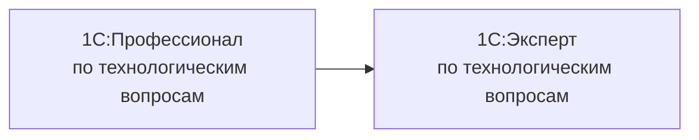

# Производительность и 1С:Эксперт

[← Все треки](README.md) | [🗺 Оглавление](../README.md)

> Актуализировано: сентябрь 2026.

Трек для тех, кто разбирается, **почему система тормозит, блокируется или падает под нагрузкой**, и умеет это доказать замерами, а не догадками. Это специализация для Senior и выше: она опирается на Этапы 0–5 из [02_Timeline.md](../02_Timeline.md) (запросы, транзакции, блокировки, регистры) и соответствует Этапу 7. Трек не заменяет базу: без уверенного языка запросов и понимания проведения документов диагностика превращается в гадание по чужим отчётам.

## 🎯 Кто это и чем занимается

- Принимает жалобу «всё медленно» и превращает её в проверяемую гипотезу: какая операция, у кого, когда, при какой нагрузке.
- Включает и разбирает технологический журнал (ТЖ), смотрит планы запросов в СУБД, находит источник блокировок и взаимоблокировок.
- Меняет код (запросы, транзакции, блокировки, фоновые задания) и структуру данных (индексы, режим разделения итогов), а не «докручивает железо».
- Настраивает кластер серверов 1С и СУБД совместно с администратором, оценивает нужное оборудование.
- Строит контур мониторинга и нагрузочного тестирования, чтобы регрессия производительности обнаруживалась до пользователей.
- Считает и объясняет метрики: APDEX по ключевым операциям, время отклика, доля ошибок и таймаутов.

Чем отличается от [администратора и 1С:Эксплуататора](administrator-operator.md): администратор отвечает за установку, резервирование, лицензии, отказоустойчивость и работоспособность сервиса. Эксперт по производительности отвечает за причины медленной работы и за то, что нужно изменить в коде, данных и настройках, чтобы её устранить. На практике роли пересекаются, особенно на уровне СУБД и кластера.

## 🧭 Где работает и какой спрос

| Контекст | Что делает | Особенность |
|---|---|---|
| Крупный внедренец (ERP, УХ, большие торговые и производственные базы) | Разбор жалоб на проведение, закрытие месяца, отчёты; приёмка производительности в проекте | Главная зона: много пользователей, тяжёлые регламентные операции |
| Инхаус большой компании | Постоянный мониторинг, плановая оптимизация, подготовка к пиковым нагрузкам | Есть доступ к промышленной среде и ТЖ в динамике |
| Продукт | Нагрузочные тесты релизов, контроль регрессии, тюнинг типовых сценариев клиента | Нужны воспроизводимые нагрузочные сценарии |
| Консалтинг и аудит | Разовые расследования и аудит архитектуры с отчётом | Работа по методикам, много общения с заказчиком |

- Спрос узкий: вакансий с явным названием «эксперт по производительности» мало, а зарплатные вилки публикуют редко. Ориентиры по рынку — только в [13_Career.md](../13_Career.md), здесь цифр нет намеренно.
- Обычно в трек приходят из разработки: сначала становятся «главным по тормозам» в команде, потом получают отдельную роль (наблюдение авторов, не статистика).
- Гибридный профиль (разработчик с пониманием СУБД и кластера), по оценке авторов, полезнее и чистого администратора, и чистого «оптимизатора запросов»: причину обычно приходится искать и в коде, и в настройках.

## 📊 Навыки по уровням

Легенда: 🔴 обязательно · 🟡 желательно · 🔵 по контексту.

| Область | Middle (вход в трек) | Senior | Эксперт |
|---|---|---|---|
| Запросы и данные | 🔴 Запросы без цикла, параметры виртуальных таблиц, индексы по стандартам | 🔴 Планы запросов в СУБД, временные таблицы, разыменование составных типов, соединения | 🔴 Проектирование структуры данных и регистров под нагрузку |
| Транзакции и блокировки | 🔴 Управляемые блокировки, порядок блокировок, короткие транзакции | 🔴 Разбор TLOCK, TTIMEOUT, TDEADLOCK, режим разделения итогов | 🔴 Архитектура проведения под параллельность, избыточные блокировки |
| Технологический журнал | 🟡 Включить ТЖ по шаблону и прочитать события | 🔴 `logcfg.xml` под задачу, разбор больших ТЖ, парсеры в ClickHouse или Elasticsearch | 🔴 ТЖ как постоянный источник мониторинга |
| СУБД PostgreSQL | 🟡 `EXPLAIN`, `pg_stat_activity` | 🔴 `pg_stat_statements`, `pg_locks`, `auto_explain`, статистика, VACUUM и ANALYZE, настройки | 🔴 Репликация, резервирование, обслуживание под нагрузкой |
| СУБД MS SQL | 🔵 Читать план запроса | 🔵 DMV, Extended Events, Query Store, статистики и индексы | 🔵 Миграция с MS SQL на PostgreSQL |
| Кластер 1С | 🟡 Состав процессов, `rac` | 🔴 Память рабочих процессов, балансировка, требования назначения функциональности | 🔴 Расчёт оборудования, отказоустойчивость, профили нагрузки |
| Метрики и оценка | 🟡 Понимает APDEX | 🔴 Ключевые операции, подсистема БСП «Оценка производительности», ЦКК и ЦУП из 1С:КИП | 🔴 Целевые показатели и приёмка производительности в контракте |
| Нагрузочное тестирование | 🔵 Прогон сценария в нескольких сеансах | 🔴 Профиль нагрузки, Тест-центр из КИП или Vanessa Automation в N сеансах | 🔴 Сценарии на реальных объёмах, сравнение конфигураций |
| ОС и Linux | 🟡 Основы Linux, `top`, `iostat` | 🟡 `bash`, `grep`, `awk` для ТЖ, счётчики ОС | 🟡 Тюнинг ОС под кластер и СУБД |
| Коммуникация | 🟡 Отчёт «было — стало» | 🔴 Объяснить бизнесу цену и эффект изменения | 🔴 Защита решений перед комиссией и заказчиком |

## 🧩 Ядро трека

### Методика: от жалобы к причине

Главное правило: **сначала классифицировать, потом измерять, потом менять**. Типичная классификация из методик ИТС — «медленно всё», «медленна одна операция», «медленно у отдельных пользователей».

```mermaid
flowchart TD
    A["Жалоба: медленно"] --> B{"Что именно медленно?"}
    B -->|"Всё и у всех"| C["Ресурсы сервера и СУБД:<br/>CPU, память, диск, сеть"]
    B -->|"Одна операция"| D["ТЖ и замер:<br/>CALL, DBPOSTGRS или DBMSSQL"]
    B -->|"Отдельные пользователи"| E["Клиент, сеть, права,<br/>RLS, различия в данных"]
    C --> F{"Есть очереди<br/>и ожидания?"}
    F -->|"Блокировки"| G["TLOCK, TTIMEOUT, TDEADLOCK"]
    F -->|"Тяжёлые запросы"| H["План запроса, индексы, статистика"]
    F -->|"Ресурсы кластера"| I["Память rphost, балансировка"]
    D --> H
    D --> G
    G --> J["Исправление, повторный замер"]
    H --> J
    I --> J
    E --> J
```



Порядок работы в расследовании:

1. Зафиксировать ключевую операцию, пользователя, время и ожидаемое время выполнения.
2. Собрать данные: метрики ОС и СУБД, ТЖ за нужный интервал, замеры APDEX, версии платформы и конфигурации.
3. Выдвинуть одну-две гипотезы и проверить их данными.
4. Изменить ровно одну вещь и повторить замер на сопоставимых данных.
5. Записать вывод: причина, изменение, метрика «до» и «после».

Официальные методики ИТС: «Методика расследования проблем производительности», «…ошибок блокировок», «…причин медленной работы операции», «…на уровне СУБД PostgreSQL», «Анализ технологических журналов с помощью инструментов bash», «Настройка ТЖ с целью мониторинга» (раздел ИТС [`metod8dev`](https://its.1c.ru/db/metod8dev), доступ по подписке ИТС). Номера статей, приведённые во вторичных перечнях, перед использованием откройте и проверьте: они могли смениться.

### Технологический журнал

ТЖ настраивается файлом `logcfg.xml` в каталоге `conf` платформы (путь зависит от ОС и установки, сверяйте по ИТС). События, с которых стоит начать: `DBPOSTGRS` или `DBMSSQL` (запросы к СУБД), `TLOCK`, `TTIMEOUT`, `TDEADLOCK` (блокировки), `CALL` и `SCALL` (вызовы), `EXCP` (исключения).

```xml
<?xml version="1.0" encoding="UTF-8"?>
<config xmlns="http://v8.1c.ru/v8/tech-log">
  <!-- Блокировки: ожидания дольше 1 с (TLOCK), таймауты, взаимоблокировки и исключения; отдельный каталог, хранение 24 часа -->
  <log location="/var/log/1c/tj/locks" history="24">
    <event>
      <eq property="name" value="TLOCK"/>
      <ge property="duration" value="1000000"/>
    </event>
    <event>
      <eq property="name" value="TTIMEOUT"/>
    </event>
    <event>
      <eq property="name" value="TDEADLOCK"/>
    </event>
    <event>
      <eq property="name" value="EXCP"/>
    </event>
    <property name="all"/>
  </log>
  <!-- Долгие запросы к СУБД: длительность указывается в микросекундах -->
  <log location="/var/log/1c/tj/slow" history="24">
    <event>
      <eq property="name" value="DBPOSTGRS"/>
      <ge property="duration" value="1000000"/>
    </event>
    <property name="all"/>
  </log>
</config>
```

Правила гигиены ТЖ:

- пишите в отдельный каталог на отдельном диске и ограничивайте срок хранения атрибутом `history`;
- фильтруйте по длительности и имени события: журнал «всего» на боевой системе сам создаёт нагрузку и переполняет диск;
- события `TLOCK` многочисленны: оставляйте фильтр по длительности ожидания (как в примере) и включайте их на время расследования;
- единицы измерения `duration` и набор свойств событий проверяйте по документации вашей версии платформы;
- с 8.3.25 ТЖ можно писать в JSON (по вторичным источникам): удобно, но ключи в записях могут дублироваться, поэтому простая десериализация не подходит (используйте специализированные парсеры);
- ТЖ содержит тексты запросов и значения параметров: это защищаемые данные, держите его под теми же правами доступа, что и базу.

Разбор больших журналов: `bash`, `grep`, `awk` (методика ИТС) для быстрых срезов и парсеры с загрузкой в ClickHouse или Elasticsearch для постоянного анализа ([rdv-team/logt](https://github.com/rdv-team/logt), [go-techLog1C](https://github.com/NuclearAPK/go-techLog1C), [OneSTools.TechLog](https://github.com/akpaevj/OneSTools.TechLog), [OneSLogExporter](https://github.com/DarkSailas/OneSLogExporter), [oneswiss](https://github.com/akpaevj/oneswiss), [tech-log-parser](https://github.com/medigor/tech-log-parser)). Это инструменты сообщества: перед боевым применением прочитайте лицензию и состояние репозитория.

### Запросы и стандарты оптимизации

Три причины, на которые приходится большинство разборов «одна операция медленная»: запрос в цикле, обращение к виртуальным таблицам без параметров, разыменование составных типов. Эталон по стандартам [its.1c.ru/db/v8std](https://its.1c.ru/db/v8std): #436 (однотипные запросы), #657 (виртуальные таблицы), #654 (разыменование составных типов), #658 и #652 (условия и индексы), #777 (временные таблицы), #729 (общие требования к запросам), #791 (дополнительные индексы).

Плохо: запрос к регистру на каждую строку табличной части.

```bsl
// Запрос в цикле: N обращений к СУБД (нарушение стандарта 436)
Для Каждого Строка Из Товары Цикл
	Запрос = Новый Запрос(
		"ВЫБРАТЬ
		|	ТоварыОстатки.КоличествоОстаток КАК Количество
		|ИЗ
		|	РегистрНакопления.ТоварыНаСкладах.Остатки(, Склад = &Склад И Номенклатура = &Номенклатура) КАК ТоварыОстатки");
	Запрос.УстановитьПараметр("Склад", Склад);
	Запрос.УстановитьПараметр("Номенклатура", Строка.Номенклатура);
	// ...
КонецЦикла;
```

Хорошо: один запрос на весь набор, условия передаются параметрами виртуальной таблицы, результат возвращается соответствием. Код лежит в общем серверном модуле.

```bsl
// Общий модуль ОстаткиТоваровСервер (Сервер, без привилегированного режима)
#Область ПрограммныйИнтерфейс

// Возвращает остатки по списку номенклатуры одним запросом.
//
// Параметры:
//  Склад - СправочникСсылка.Склады
//  Номенклатура - Массив из СправочникСсылка.Номенклатура
//
// Возвращаемое значение:
//  Соответствие из КлючИЗначение:
//   * Ключ - СправочникСсылка.Номенклатура
//   * Значение - Число
//
Функция ОстаткиПоНоменклатуре(Знач Склад, Знач Номенклатура) Экспорт

	Запрос = Новый Запрос;
	Запрос.Текст =
		"ВЫБРАТЬ
		|	ТоварыОстатки.Номенклатура КАК Номенклатура,
		|	ТоварыОстатки.КоличествоОстаток КАК Количество
		|ИЗ
		|	РегистрНакопления.ТоварыНаСкладах.Остатки(
		|			,
		|			Склад = &Склад
		|				И Номенклатура В (&Номенклатура)) КАК ТоварыОстатки";
	Запрос.УстановитьПараметр("Склад", Склад);
	Запрос.УстановитьПараметр("Номенклатура", Номенклатура);

	Результат = Новый Соответствие;
	Выборка = Запрос.Выполнить().Выбрать();
	Пока Выборка.Следующий() Цикл
		Результат.Вставить(Выборка.Номенклатура, Выборка.Количество);
	КонецЦикла;

	Возврат Результат;

КонецФункции

#КонецОбласти
```

Что проверить в плане и данных: используется ли индекс, нет ли сканирования всей таблицы, не блокируется ли запрос из-за `РАЗРЕШЕННЫЕ` и RLS (стандарт #415 запрещает `РАЗРЕШЕННЫЕ` в запросах для проведения и расчётов), не читаются ли лишние поля (`ВЫБРАТЬ *` противоречит стандарту #729). Регламентное сопровождение индексов и статистики важно не меньше, чем правка запросов.

### Транзакции и блокировки

Основа: короткие транзакции, управляемый режим блокировок, единый порядок захвата ресурсов, минимум блокировок «на всякий случай». Стандарты [v8std](https://its.1c.ru/db/v8std): #460 (управляемый режим), #783 (правила транзакций), #659 (избыточные блокировки), #661 (блокирующее чтение остатков), #792 (многократная запись регистров).

Проведение с явной управляемой блокировкой регистра: сначала блокируем ровно те срезы, которые собираемся читать и менять, потом читаем и пишем.

```bsl
// Модуль документа. Проведение внутри транзакции платформы.
Процедура ОбработкаПроведения(Отказ, РежимПроведения)

	Блокировка = Новый БлокировкаДанных;
	ЭлементБлокировки = Блокировка.Добавить("РегистрНакопления.ТоварыНаСкладах");
	ЭлементБлокировки.Режим = РежимБлокировкиДанных.Исключительный;
	ЭлементБлокировки.ИсточникДанных = Товары;
	ЭлементБлокировки.ИспользоватьИзИсточникаДанных("Номенклатура", "Номенклатура");
	ЭлементБлокировки.УстановитьЗначение("Склад", Склад);
	Блокировка.Заблокировать();

	// Дальше: прочитать остатки запросом, проверить, записать движения.
	// Вариант с записью регистров с контролем в конце транзакции — по стандарту 661.

КонецПроцедуры
```

Практические правила:

- явную управляемую блокировку устанавливают **перед чтением** данных, которые затем будут изменяться (стандарт #460), и блокируют только записи, которые реально обрабатываются; блокировку «на всякий случай» и «на всю таблицу» не берут;
- ресурсы блокируются в одном и том же порядке во всех документах и обработках (разный порядок — типичная причина `TDEADLOCK`);
- нельзя повышать разделяемую блокировку до исключительной внутри транзакции;
- контроль остатков по стандарту #661 строят так, чтобы блокирующее чтение держалось как можно короче: движения регистров, где контроль не нужен, пишут в начале транзакции, а регистры с контролем записывают в самом конце (`БлокироватьДляИзменения = Истина`) и сразу проверяют запросом отрицательные остатки; при ошибке транзакцию отменяют; порядок записи регистров во всех документах одинаковый;
- режим разделения итогов регистров накопления и бухгалтерии включают там, где важна параллельность записи (#663, #664);
- долгие операции выносят в фоновые задания, чтобы не держать транзакцию и сеанс пользователя (клиентские вызовы внутри транзакции недопустимы).

Чтение блокировок в ТЖ: `TLOCK` показывает, кто и какую блокировку запросил, `TTIMEOUT` — что не дождалось, `TDEADLOCK` — участников цикла. Для блокировок СУБД (не управляемых) картину дополняют `pg_locks` и `pg_stat_activity` (PostgreSQL) или `sys.dm_exec_requests` (MS SQL).

### СУБД: PostgreSQL для 1С

- Для 1С используются **только сборки PostgreSQL для 1С**: «PostgreSQL от 1С» (`AddCompPostgre`), бесплатная сборка Postgres Professional «Postgresql for 1C» (форма на 1c.postgres.ru), коммерческие Postgres Pro, Tantor SE 1C и Platform V Pangolin (статус «одобрено для 1С» известен по каталогу сообщества, уточняйте у вендора), managed-варианты (например, Yandex Managed PostgreSQL «-1c»). Ванильный PostgreSQL для 1С не подходит: сборки содержат патчи и расширения `mchar`, `fulleq`, `fasttrun`, `online_analyze`, `plantuner`.
- Официальный стенд «1С» (`docker_fresh`) с платформой 8.5.1.1302 использует PostgreSQL 18.3-5.1C (по состоянию репозитория на 28.08.2026). Официальная матрица «версия платформы — версия СУБД» в сессии проверки не подтверждена: берите её на v8.1c.ru и ИТС для своей версии.
- Кластер инициализируют с локалью `ru_RU.UTF-8`, практики рекомендуют `--data-checksums` (сверьте со сборкой и её документацией).

Топ запросов по суммарному времени (расширение `pg_stat_statements` должно быть подключено, названия столбцов — для PostgreSQL 13 и выше):

```sql
SELECT calls,
       round(total_exec_time::numeric, 0) AS total_ms,
       round(mean_exec_time::numeric, 2)  AS mean_ms,
       rows,
       left(query, 200)                   AS query
FROM pg_stat_statements
ORDER BY total_exec_time DESC
LIMIT 20;
```

Кто кого блокирует прямо сейчас (блокировки на уровне СУБД):

```sql
SELECT a.pid,
       pg_blocking_pids(a.pid)      AS blocked_by,
       a.state,
       a.wait_event_type,
       a.wait_event,
       now() - a.xact_start         AS xact_age,
       left(a.query, 200)           AS query
FROM pg_stat_activity AS a
WHERE cardinality(pg_blocking_pids(a.pid)) > 0;
```

План запроса: `EXPLAIN (ANALYZE, BUFFERS)` на копии базы или в согласованное окно, потому что `ANALYZE` реально выполняет запрос. Запросы, которые платформа шлёт в СУБД, отличаются от текста на языке 1С (временные таблицы, соединения, преобразования типов): искать нужно по тексту из ТЖ (`DBPOSTGRS`), а не по исходнику на BSL. Дополнительно изучите `auto_explain`, статистику и автоочистку (`VACUUM`, `ANALYZE`), настройки памяти (`shared_buffers`, `work_mem`, `effective_cache_size`) и резервное копирование (`pg_basebackup`, WAL-G, pgBackRest).

### СУБД: MS SQL Server как наследие

MS SQL остаётся поддерживаемой СУБД и встречается в существующих системах, но новые проекты чаще выбирают PostgreSQL. SQL Server 2016 снят с поддержки Microsoft 14.07.2026, SQL Server 2025 вышел 18.11.2025 ([Microsoft Learn](https://learn.microsoft.com/sql/sql-server/end-of-support/sql-server-end-of-support-overview)). Поддержка SQL Server 2025 платформой 8.5 не подтверждена: проверяйте перед планированием обновления. Oracle и IBM Db2 формально поддерживаются платформой, но это ниша: достаточно знать, что они есть.

Минимальный набор для сопровождения: топ запросов по времени и чтениям, текущие блокировки, планы, статистики, `tempdb`.

```sql
SELECT TOP (20)
       qs.execution_count,
       qs.total_elapsed_time / qs.execution_count AS avg_elapsed_us,
       qs.total_logical_reads,
       st.text AS query_text
FROM sys.dm_exec_query_stats AS qs
CROSS APPLY sys.dm_exec_sql_text(qs.sql_handle) AS st
ORDER BY qs.total_elapsed_time DESC;
```

Углубляться дальше (Extended Events, Query Store, индексы) стоит, если ваши проекты работают на MS SQL. Ценным навыком остаётся миграция таких систем на PostgreSQL.

### Кластер серверов 1С

- Процессы: `ragent` (порт 1540), `rmngr` (1541), `rphost` (рабочие процессы, по умолчанию диапазон 1560:1591), RAS (1545). Управление и мониторинг — утилита `rac`.
- Параметры памяти рабочих серверов существуют давно (с 8.3.8), а не появились недавно: «Допустимый объём памяти» с интервалом превышения (процесс автоматически перезапускается) и, только в КОРП, «Безопасный расход памяти за один вызов», «Максимальный объём памяти рабочих процессов», «Объём памяти, до которого сервер считается производительным», «Количество ИБ на процесс».
- Балансировка и требования назначения функциональности — тоже давние возможности, часть настроек доступна только в КОРП. Уровень отказоустойчивости кластера задаёт, сколько рабочих серверов может выйти из строя без аварийного завершения сеансов. Рост уровня снижает производительность (серверы синхронизируют данные сервисов), а чтобы новые соединения принимались при отказе, нужны не менее двух центральных серверов.
- Из недавнего: экспорт и импорт настроек кластера (8.3.25), каталоги данных сервисов кластера (8.3.26). Улучшенный мониторинг памяти и новые метрики кластера заявлены в тестовой 8.5.4. Экспорт настроек кластера не заменяет полноценный IaC: инфраструктуру описывают через Ansible или Terraform плюс `rac`, `ras`, `ibcmd`.
- «Фоновое обновление конфигурации БД» — только КОРП. Финальная фаза требует монопольного доступа, так что это не zero-downtime. Автоматической паузы «в часы пик» нет.
- Лицензии сервера: КОРП, ПРОФ, МИНИ. Что доступно только в КОРП, смотрите в документации платформы (подробности — в [треке администратора](administrator-operator.md)).

### Метрики: APDEX, ключевые операции, 1С:КИП

**APDEX** — интегральная оценка «доля довольных пользователей» по ключевой операции: сама методика описана на ИТС, а в типовых конфигурациях есть подсистема БСП «Оценка производительности». По методике Apdex операции делятся на быстрые (не дольше целевого времени T), терпимые (до 4T) и медленные, а индекс равен (быстрые + терпимые/2) / все; целевое время выбирается отдельно для каждой ключевой операции, точные параметры сверяйте по методике 1С.

Ключевые операции выбирают вместе с бизнесом: 5–15 действий, от которых зависит работа людей (проведение основного документа, открытие списка, формирование ключевого отчёта). Без ключевых операций APDEX превращается в «средний по больнице».

**1С:КИП** («Корпоративный инструментальный пакет 8», на releases.1c.ru проект `ETP`) включает три продукта; версию не называем, доступ через ИТС, документация — [its.1c.ru/db/kip](https://its.1c.ru/db/kip):

| Компонент | Для чего |
|---|---|
| ЦКК (Центр контроля качества) | Регламентный мониторинг: APDEX, ошибки, доступность |
| ЦУП (Центр управления производительностью) | Глубокий разбор: долгие запросы, блокировки, счётчики |
| Тест-центр | Многопользовательское нагрузочное тестирование |

Смежный продукт — 1С:Управление ландшафтом ([документация](https://its.1c.ru/db/landscapedoc)) для централизованного управления множеством баз и серверов.

### Нагрузочное тестирование

1. Профиль: какие операции, в какой пропорции, сколько параллельных пользователей, какие объёмы данных.
2. Стенд: копия боевой структуры и сопоставимые объёмы (обезличенные данные, если используете реальные).
3. Инструмент: Тест-центр КИП или сценарии Vanessa Automation в N сеансах; сообщество уже соединяет Тест-центр с Vanessa Automation.
4. Прогон с включённым ТЖ по шаблону мониторинга и сбором метрик ОС и СУБД.
5. Сравнение: одна прогонка — один изменённый параметр. Фиксируйте APDEX, время операций, ресурсы.
6. Отчёт: узкое место, изменение, эффект, остаточный риск.

Vanessa Automation — UI/E2E-инструмент через клиент тестирования, а не специализированный нагрузочный генератор: для больших нагрузок считайте ресурсы стенда и лимиты клиентских лицензий заранее.

### Мониторинг и наблюдаемость

Открытый стек из GitHub (проверяйте актуальность перед внедрением):

| Инструмент | Что даёт |
|---|---|
| [prometheus_1C_exporter](https://github.com/LazarenkoA/prometheus_1C_exporter) | Метрики кластера через `rac`: сеансы, соединения, память и CPU процессов, лицензии; дашборды Grafana. Последняя ветка релизов датируется 2024 годом |
| [1c_zabbix_template_ce](https://github.com/slothfk/1c_zabbix_template_ce) | Zabbix-шаблоны: рабочий сервер, сервер лицензирования, центральный сервер |
| [1C_PrometheusExporter](https://github.com/ValentinKozlov/1C_PrometheusExporter) | Расширение 1С с отправкой метрик в Pushgateway |
| [1c_prometheus_exporter](https://github.com/ChernyakAI/1c_prometheus_exporter) | Экспорт APDEX |
| [v8hasp-exporter](https://github.com/komarovps/v8hasp-exporter) | Экспортёр HASP License Manager |
| ТЖ в ClickHouse или Elasticsearch | Постоянный разбор журнала (перечень парсеров выше) |

Коммерческие системы мониторинга есть у ряда вендоров, а обзор смотрите в каталоге [Landscape1C](https://github.com/Oxotka/Landscape1C) (каталог сообщества, не официальная классификация). Главное правило: метрики и алерты должны отвечать на вопрос «что сломалось для пользователя», а не только «загружен ли процессор».

## 🧰 Инструменты

| Задача | Инструменты |
|---|---|
| Замер и оценка | Подсистема БСП «Оценка производительности», 1С:КИП (ЦКК, ЦУП), замер производительности в отладчике |
| Технологический журнал | `logcfg.xml`, `bash`, парсеры ТЖ, ClickHouse, Elasticsearch |
| PostgreSQL | `pg_stat_statements`, `pg_stat_activity`, `pg_locks`, `EXPLAIN`, `auto_explain` |
| MS SQL | DMV, Extended Events, Query Store, план выполнения |
| Кластер | `rac`, `ras`, консоль кластера, `ibcmd` |
| Нагрузка | Тест-центр КИП, Vanessa Automation |
| Мониторинг | Prometheus и Grafana, Zabbix, ClickHouse |
| Код | 1C:EDT или Конфигуратор, BSL Language Server, стандарты v8std |
| Инфраструктура | Ansible, Terraform (для managed-PostgreSQL и установки серверов) |

## 🎓 Сертификация



- **1С:Профессионал по технологическим вопросам** — формальный пререквизит Эксперта; это не 1С:Специалист. Формат 1С:Профессионал: 14 вопросов, 30 минут, для сдачи нужно не менее 12 верных ответов (сверяйте актуальные условия на 1c.ru/prof/).
- **1С:Эксперт по технологическим вопросам** — «сложные практические задания и защита решений перед комиссией». Длительность, число этапов и возможность дистанционной защиты не подтверждены: уточняйте на официальных страницах 1С и у учебного центра.
- Подготовка: книга Е.В. Филиппова «Настольная книга 1С:Эксперта по технологическим вопросам» (2-е изд., [online.1c.ru](https://online.1c.ru/books/book/20752408/)), курсы УЦ №1 [«Основной курс»](https://uc1.1c.ru/course/podgotovka-k-1s-ekspertu-po-tehnologicheskim-voprosam-osnovnoj-kurs/) и [«Применение методик»](https://uc1.1c.ru/course/podgotovka-k-1s-ekspertu-po-tehnologicheskim-voprosam-primenenie-metodik/), база знаний [kb.1c.ru](https://kb.1c.ru), [разбор задач с экзамена Эксперта](https://developer.1c.ru/applications/Console?state=expertcourse) (по каталогу Landscape1C), рассказ участника: [«Как я стал Экспертом по технологическим вопросам за 3 месяца»](https://infostart.ru/1c/articles/2027654/) (личный опыт, не гарантия сроков).
- Чат сообщества по подготовке: [t.me/OneC_Expert](https://t.me/OneC_Expert) (по каталогу сообщества, актуальность на 2025 год).
- Ветку «Профессионал по эксплуатации ИС → 1С:Эксплуататор» разбирает [трек администратора](administrator-operator.md). Общая картина — в [04_Certifications.md](../04_Certifications.md). Цены экзаменов и квоты партнёров не называем.
- Стандарты v8std не заявлены как обязательные на экзамене; но темы трека (методики ИТС, стандарты оптимизации запросов) полезно знать и для работы, и для подготовки: сверяйте программу курсов УЦ №1.

## 🚀 Проекты трека

Базовый проект — **P14 «Найди и почини»** (описание и критерии приёмки — в [07_Projects.md](../07_Projects.md)). Постановка в сжатом виде: дана база с запросом в цикле, разыменованием составного типа и взаимоблокировкой при параллельном проведении двух документов. Результат — замеры «до и после», фрагменты ТЖ с `TLOCK` и `TDEADLOCK`, исправление порядком блокировок и блокирующим чтением в начале транзакции (стандарт #661).

Практикумы для сборки портфолио эксперта (не имеют отдельных ID в общей нумерации):

| Практикум | Что делаете | Результат |
|---|---|---|
| А. Linux-стенд за выходные | ВМ или LXC на Debian, Ubuntu, Astra или Альт; установка платформы, служб `srv1cv8-*` и `ras-*`; PostgreSQL для 1С, `initdb` с `ru_RU.UTF-8`; публикация на Apache; community-лицензия с developer.1c.ru; выгрузка через `ibcmd`, управление через `rac` | README стенда в Git с командами и проверками |
| Б. Мониторинг | Prometheus и Grafana с экспортёром (или Zabbix с шаблоном); ТЖ по шаблону мониторинга загрузить в ClickHouse через `logt` или OneSwiss | Дашборд и три алерта с порогами и обоснованием |
| В. Воспроизведение блокировок | Смоделировать взаимоблокировку и таймаут на учебной базе; найти их в ТЖ, в `pg_locks` и `pg_stat_statements` | Разбор: цепочка событий, причина, исправление |
| Г. APDEX и нагрузка | Посчитать APDEX по трём ключевым операциям подсистемой БСП; прогнать сценарий Vanessa Automation в N сеансах; сравнить изменения настроек СУБД по одной | Отчёт «было — стало» с таблицей метрик |

Для практикумов подойдёт официальный стенд `docker_fresh` (для разработки и тестирования, не для продуктива) или образ сообщества [onec-community-docker](https://github.com/alexandermyasnikov123/onec-community-docker) на community-лицензиях. Готовых официальных образов сервера 1С для промышленной эксплуатации нет, а позиции 1С по Kubernetes в продуктиве не найдено.

## 📝 План входа на 3–6 месяцев

Ориентир по времени: при 10–15 часах в неделю; это оценка авторов, а не факт. Предусловие: вы уверенно пишете запросы, проводите документы с движениями по регистрам и понимаете транзакции (Этапы 2–5).

| Период | Что делаете | Критерий «готово» |
|---|---|---|
| Месяцы 1–2 | Стандарты запросов (#436, #654, #657, #658, #652), планы запросов, индексы; ТЖ: настройка и чтение `DBPOSTGRS`, `CALL`, `EXCP`; P14 | P14 решён, есть замеры «до и после» и фрагменты ТЖ |
| Месяц 3 | Блокировки: управляемый режим, #661, #659, `TLOCK`, `TTIMEOUT`, `TDEADLOCK`; практикум В | Сможете объяснить и исправить взаимоблокировку по ТЖ |
| Месяц 4 | PostgreSQL для 1С: `pg_stat_statements`, `pg_locks`, статистика, настройки; практикум А | Работающий стенд в Git, вы читаете план запроса |
| Месяц 5 | Кластер, память, балансировка; APDEX, ключевые операции; практикумы Б и Г | Дашборд, отчёт «было — стало» |
| Месяц 6 | Подготовка к Профессионалу по ТВ, книга и курс; оформление портфолио | Экзамен сдан или назначен; кейсы в README |

## ✅ Первые шаги на этой неделе

1. Откройте стандарты v8std #436, #657, #654 и найдите в своём коде по одному нарушению. Замерьте время до и после исправления.
2. Настройте ТЖ по шаблону выше на **учебной** базе, воспроизведите блокировку двух сеансов и найдите её в `TLOCK` или `TTIMEOUT`.
3. Прочитайте в ИТС методики расследования проблем производительности и ошибок блокировок; выпишите шаги и превратите в свой чек-лист (см. [11_Checklists.md](../11_Checklists.md), раздел про производительность).
4. Поставьте PostgreSQL для 1С на стенд и включите `pg_stat_statements`.
5. Выберите три ключевые операции вашей рабочей системы и запишите ожидаемое время.

## 📚 Ресурсы

- Официальное: методики ИТС ([metod8dev](https://its.1c.ru/db/metod8dev)), документация КИП ([its.1c.ru/db/kip](https://its.1c.ru/db/kip)), стандарты ([v8std](https://its.1c.ru/db/v8std)), база знаний [kb.1c.ru](https://kb.1c.ru). Большая часть ИТС доступна по платной подписке.
- Книга: Е.В. Филиппов, «Настольная книга 1С:Эксперта по технологическим вопросам» (2-е изд.). Методическое пособие по эксплуатации крупных ИС на платформе 1С:Предприятие 8 (изд. 2) — смотрите в [05_Resources.md](../05_Resources.md).
- СУБД: страница сборки [PostgreSQL от 1С](https://v8.1c.ru/platforma/postgresql/), документация Postgres Professional для 1С, [руководство Yandex Cloud по PostgreSQL для 1С](https://github.com/yandex-cloud/docs/blob/master/md-docs/managed-postgresql/tutorials/1c-postgresql.md).
- Стенды и примеры: [docker_fresh](https://github.com/1C-Company/docker_fresh) (официальный стенд), Ansible-роли [magnit-ansible-linux-1c](https://github.com/magnit-tech/magnit-ansible-linux-1c) и [app1c.ansible](https://github.com/biguxuzz/app1c.ansible) (сообщество).
- Вопросы по теме для собеседований — в [08_Interview.md](../08_Interview.md), общие материалы и сообщества — в [05_Resources.md](../05_Resources.md).

## 🗂 Связанные треки

- [Администратор, DevOps и 1С:Эксплуататор](administrator-operator.md): кластер, СУБД, лицензии, резервирование.
- [Разработчик в продукте и инхаусе](developer-product.md): нагрузочные тесты и контроль регрессии в CI.
- [QA и автотесты](qa-automation.md): Vanessa Automation и сценарии для нагрузки.
- [Интеграции](integration.md): обмены как источник нагрузки, блокировок и очередей.
- [Разработчик у франчайзи](developer-franchise.md): типовые конфигурации и их «тяжёлые» места.

Компетенции и уровни: [03_Competencies.md](../03_Competencies.md). Карьерные ориентиры: [13_Career.md](../13_Career.md).

## 🔗 Источники

- [Стандарты разработки v8std](https://its.1c.ru/db/v8std) (#415, #436, #460, #652, #654, #657, #658, #659, #661, #663, #664, #729, #777, #783, #791, #792)
- [ИТС: методические материалы](https://its.1c.ru/db/metod8dev), [1С:КИП](https://its.1c.ru/db/kip), [1С:Управление ландшафтом](https://its.1c.ru/db/landscapedoc)
- [PostgreSQL для 1С (v8.1c.ru)](https://v8.1c.ru/platforma/postgresql/), [1C-Company/docker_fresh](https://github.com/1C-Company/docker_fresh)
- [Microsoft Learn: жизненный цикл SQL Server](https://learn.microsoft.com/sql/sql-server/end-of-support/sql-server-end-of-support-overview)
- [Yandex Cloud: PostgreSQL для 1С](https://github.com/yandex-cloud/docs/blob/master/md-docs/managed-postgresql/tutorials/1c-postgresql.md)
- Сертификация и подготовка: [книга](https://online.1c.ru/books/book/20752408/), [курс «Основной курс»](https://uc1.1c.ru/course/podgotovka-k-1s-ekspertu-po-tehnologicheskim-voprosam-osnovnoj-kurs/), [курс «Применение методик»](https://uc1.1c.ru/course/podgotovka-k-1s-ekspertu-po-tehnologicheskim-voprosam-primenenie-metodik/), [Landscape1C](https://github.com/Oxotka/Landscape1C)
- Инструменты мониторинга и разбора ТЖ: ссылки в тексте разделов «Технологический журнал» и «Мониторинг и наблюдаемость»
- Факты сверены по досье highload_infra, gap_requirements_licensing_infra, certification, roadmap_design на 29.09.2026 (репозиторий SOURCES.md). Ряд сведений о СУБД, КИП и кластере опирается на вторичные источники и копии документации 8.3.8: перед применением сверяйте с ИТС для вашей версии платформы.

[← Все треки](README.md) | [🗺 Оглавление](../README.md)
