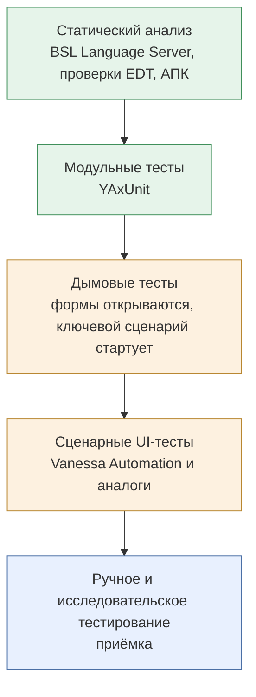
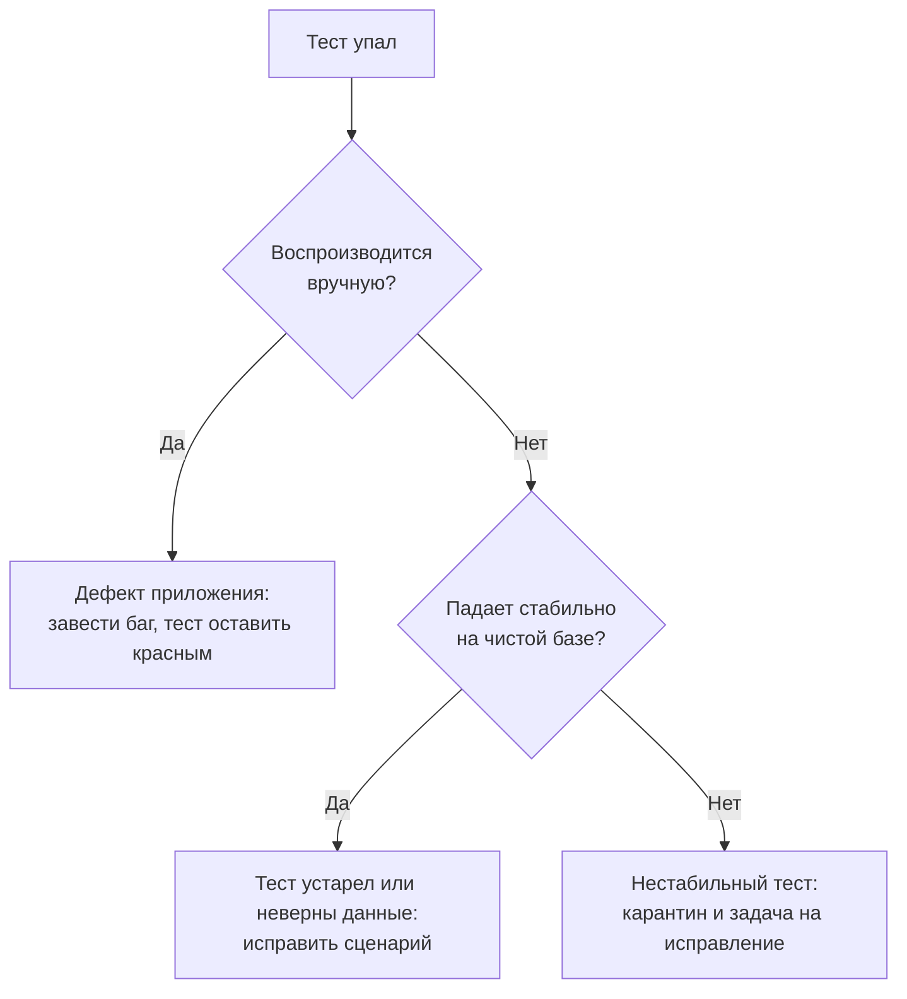

# QA и автотесты

[← Все треки](README.md) | [🗺 Оглавление](../README.md)

> Актуализировано: сентябрь 2026.

Трек для тех, кто отвечает за **качество решений на 1С**: придумывает, что и как проверять, пишет и поддерживает автоматические тесты, разбирает падения и приёмку. Это смежная роль: её можно занять как со стороны тестирования (вы знаете тестирование, но не знаете 1С), так и со стороны 1С (вы разработчик или аналитик и хотите автоматизировать проверки). Базу платформы трек не заменяет: чтобы тестировать конфигурацию, надо понимать, как в ней проведение, регистры, права и обмены. Поэтому он надстраивается над Этапами 0–4 и опирается на тему качества из Этапа 6 ([02_Timeline.md](../02_Timeline.md)); как специализация относится к Этапу 7.

## 🎯 Кто это и чем занимается

- Разбирает требования и задание, составляет тест-кейсы и чек-листы, определяет, что проверять вручную, а что автоматизировать.
- Пишет **сценарные тесты** (UI и end-to-end через клиент тестирования платформы), **модульные тесты** процедур и функций, **дымовые тесты** («формы открываются, ключевой сценарий стартует»).
- Готовит тестовые данные и окружения: тестовые базы, обезличенные копии, развёртывание «с нуля».
- Встраивает прогон тестов в CI, публикует отчёты, следит за стабильностью набора.
- Проверяет обновления: типовой конфигурации, расширений, версии платформы, релиза своего продукта.
- Ведёт дефекты: воспроизводит, оформляет, проверяет исправление.
- Использует сценарии как **живую документацию** и как общий язык с аналитиком. В строке модели компетенций 1С MC-6-001 про автотесты на уровне Junior указана и подготовка пользовательской документации.

Три «лица» роли на рынке (названия условные):

| Вариант | Чем занят | Что нужно от 1С |
|---|---|---|
| Функциональный тестировщик | Ручная проверка, приёмка, регрессия по чек-листам, баг-репорты | Понимать типовую конфигурацию как пользователь и знать предметную область ([10_Domain_and_Law.md](../10_Domain_and_Law.md)) |
| Автотестировщик | Сценарии Vanessa Automation, поддержка наборов, отчёты | Читать формы и метаданные, понимать клиент-сервер и проведение документов |
| Разработчик с упором на тесты | Модульные тесты YAxUnit, CI, тестируемая архитектура | Всё, что у разработчика ([developer-product.md](developer-product.md)) |

Чем отличается от [трека разработчика в продукте](developer-product.md): там тесты — одна из практик процесса, здесь — главный предмет. Повторяться не будем: общий конвейер CI описан там, а здесь про то, **что и как проверять**.

## 🧭 Где работает и какой спрос

| Контекст | Что проверяют | Типичная картина |
|---|---|---|
| Франчайзи | Приёмка внедрения, регрессия после обновления типовой, проверка доработок по ТЗ клиента | Чаще ручная проверка и чек-листы; автотесты появляются в крупных проектах |
| Инхаус | Регрессия перед релизом своей конфигурации, расчёты и проведение, обмены | Автотесты критичных процессов, иногда одним человеком на команду |
| Продукт | Тиражное решение: матрица версий платформы и библиотек, каждый коммит | YAxUnit, Vanessa Automation, CI, отчёты |
| Проект | Крупное внедрение: тест-план, интеграционные и приёмочные испытания | Выделенные тестировщики, ручное и автоматическое тестирование |

- Спрос качественно: нишевый, встречается в крупных командах. Отдельные вакансии «Тестировщик 1С» и «QA Engineer 1С» есть, но их заметно меньше, чем вакансий разработчиков; чаще автотесты входят в обязанности разработчика или аналитика. Числа с источником и периодом — только в [13_Career.md](../13_Career.md).
- Распространённость инструментов по открытому опросу Landscape1C (снимок 06.09.2026, выборка смещена к активной части сообщества, это ориентир, а не статистика): с Vanessa Automation «работали» 53,6%, с 1С:Сценарное тестирование 22,6%, с 1С:Тестировщиком 12,9% (опрос продолжается, доли в более поздних выгрузках отличаются). Из трёх инструментов Vanessa Automation самый распространённый, поэтому с неё и начинаем. Источник: [опрос Landscape1C](https://github.com/Oxotka/Landscape1C/blob/main/docs/survey-comparison-2026-09-06.md).
- Рынок ИТ в 2025–2026 годах остаётся рынком работодателя, а чистых вакансий QA по 1С мало. Практичная стратегия: развивайте навык как **надстройку** к разработке или аналитике, пока не найдёте команду, где автотесты ведутся всерьёз.

## 📊 Навыки по уровням

Легенда: 🔴 обязательно · 🟡 желательно · 🔵 по контексту. Уровни Junior / Middle / Senior — по официальной модели компетенций 1С MC-6-001 (2025): она задаёт их компетенциями, без сроков. Строка модели про автотесты: Junior создаёт сценарии автотестов и готовит пользовательскую документацию; Middle делает более сложные сценарии; Senior определяет, что тестировать.

| Тема | Junior | Middle | Senior |
|---|---|---|---|
| Основы платформы и предметной области | 🔴 справочники, документы, регистры, проводки на уровне пользователя и чтения метаданных | 🔴 читает код проведения, запросы, права | 🔴 понимает архитектуру решения и риски |
| Тест-дизайн | 🔴 тест-кейсы, чек-листы, классы эквивалентности, границы | 🔴 таблицы решений, приоритизация по риску | 🔴 стратегия тестирования, что и на каком уровне проверять |
| Сценарии Vanessa Automation | 🔴 пишет простые сценарии на Turbo Gherkin, запускает, читает отчёт | 🔴 структуры сценариев, переиспользование, свои шаги, теги | 🔴 архитектура набора, соглашения, поддержка |
| Модульные тесты YAxUnit | 🟡 запускает готовые, пишет простые | 🔴 утверждения, моки, тестовые данные, запуск в EDT и CI | 🔴 тестируемая архитектура, границы модульных и сценарных тестов |
| Тестовые данные и окружения | 🟡 готовит данные вручную | 🔴 воспроизводимые базы, обезличенные копии | 🔴 контуры, изоляция, матрица версий |
| CI и отчёты | 🔵 понимает пайплайн, читает отчёт Allure | 🔴 подключает набор к CI, разбирает падения | 🔴 проектирует прогоны: на коммит, ночные, перед релизом |
| Дефекты и коммуникация | 🔴 воспроизводимый баг-репорт | 🔴 приоритет и риск, общение с разработчиками и аналитиком | 🔴 процессы качества, приёмка, метрики |
| Вендорские инструменты | 🔵 1С:Тестировщик, 1С:Сценарное тестирование, АПК (по контексту) | 🔵 то же, глубже | 🔵 выбор инструмента под задачу |
| Нагрузочное тестирование | 🔵 знает, что это отдельная дисциплина | 🔵 участвует в подготовке сценариев | 🔵 см. [performance-expert.md](performance-expert.md) |
| ИИ-ассистенты | 🟡 использует с проверкой | 🟡 встраивает в процесс написания сценариев | 🔵 задаёт правила команды, см. [09_AI_Development.md](../09_AI_Development.md) |

Нюанс. В отметочной матрице грейдов Landscape1C для программистов EDT, CI/CD и нагрузочное тестирование на уровне Senior отмечены только как «желательно»: рынок в целом ещё не требует их везде. В этом треке они основные, потому что вы выбираете роль, где качество — предмет работы.

## 🧩 Ядро трека

### Уровни тестирования в 1С

Уровни, от дешёвого и быстрого к дорогому и медленному:



Чем ближе уровень к началу схемы, тем больше таких проверок и тем они быстрее и дешевле в поддержке; чем ближе к концу, тем их меньше и тем они дороже. Зелёные уровни быстрые и не ходят по формам: статический анализ идёт без платформы, а YAxUnit всё же запускается в клиентском приложении, поэтому ему нужны платформа и лицензия. Оранжевые уровни идут через клиент тестирования платформы и требуют лицензий.

| Уровень | Что ловит | Скорость | Цена поддержки | Инструмент |
|---|---|---|---|---|
| Статический анализ | Нарушения стандартов, потенциальные ошибки, запросы в цикле | Секунды-минуты | Низкая | BSL LS, EDT с «1C:Code style V8», АПК |
| Модульный | Ошибки расчётов и логики общих модулей | Секунды | Низкая | YAxUnit |
| Дымовой | «Сломалось всё»: форма не открывается, проведение падает | Минуты | Средняя | Vanessa Automation, YAxUnit (дымовые тесты) |
| Сценарный (UI, E2E) | Поломки бизнес-процессов целиком | Минуты на сценарий | Высокая | Vanessa Automation, 1С:Сценарное тестирование |
| Ручной | То, что не автоматизировано: юзабилити, новые функции | Часы | — | Чек-листы, исследовательское тестирование |

Важная оговорка. Сценарии Vanessa Automation — это **UI-тесты через клиент тестирования платформы**, а не «замена модульным». Они медленнее и чувствительнее к смене интерфейса. Обещание «изменение интерфейса не ломает сценарий» неверно: переиспользуемые шаги и библиотеки шагов лишь снижают стоимость поддержки.

**Как проверить себя.** Вы объясняете, почему расчёт округления проверяют модульным тестом, а не сценарием через форму, и что именно вы оставите ручной проверке.

### Что автоматизировать, а что нет

| Хорошие кандидаты | Плохие кандидаты |
|---|---|
| Ключевые процессы с деньгами и остатками: проведение, расчёты, закрытие | Одноразовые проверки |
| Регрессия после каждого обновления типовой или релиза | Свежий интерфейс, который меняется каждый день |
| Расчёты с множеством граничных случаев (округление, скидки, ставки) | Визуальная вёрстка, расположение элементов |
| Обмены: выгрузка, загрузка, повторная загрузка без дублей | Проверки, зависящие от внешних сервисов без тестового контура (ЭДО, маркировка, банк) |
| Права: «менеджер не видит чужое» | Конкурентные сценарии с гонкой двух сеансов (это исследование под нагрузкой, см. P14) |
| Дымовой набор на каждый коммит | «Всё через UI», когда логику можно проверить модульно |

### Тест-дизайн для 1С

Техники те же, что и в любом тестировании, меняется материал:

| Техника | Пример на 1С |
|---|---|
| Классы эквивалентности | Вид операции документа, тип контрагента (юрлицо, ИП, физлицо), способ оплаты: по одному представителю каждого класса |
| Граничные значения | Количество ровно равно остатку и на единицу больше; сумма, которая не делится на три части без копейки; дата документа на границе закрытого периода (дата запрета изменений) |
| Дата и время | Документы 31 декабря и 1 января: ставка НДС меняется на границе года (22% с 01.01.2026, 425-ФЗ; проверяйте актуальную редакцию на consultant.ru и nalog.gov.ru). Тесты не должны зависеть от текущей даты |
| Таблица решений | Скидки и цены: вид цены × признак клиента × период действия |
| Состояния | Документ: не проведён → проведён → проведение отменено → помечен на удаление. Что при этом происходит с движениями регистров |
| Права | Роль × действие: негативные тесты («менеджер не может провести чужой документ»), см. P15 |
| Обновление | Одни и те же эталонные отчёты до и после обновления: сравниваются итоги |

Принципы хорошего теста (применимы и к сценарию, и к модульному тесту):

- **Независимость:** тест сам готовит данные и не опирается на результат соседнего. Порядок запуска не влияет на результат.
- **Повторяемость:** два прогона на чистой базе дают одинаковый результат. Фиксированные даты вместо «сегодня».
- **Одна причина падения:** тест проверяет одно, и по имени ясно, что сломалось.
- **Есть проверка:** сценарий без шага «Тогда» ничего не проверяет. Ему нельзя доверять, даже если он зелёный.
- **Читаемость:** сценарий читает аналитик. Названия описывают поведение, а не клики.

Проверка самого теста: сломайте код намеренно, тест должен упасть; верните как было, тест должен пройти. Если тест остался зелёным при поломке, он бесполезен.

### Тестируемый код на BSL

Сложно тестировать код, в котором запрос, расчёт и вывод сообщений перемешаны. Модульный тест на таком коде невозможен без базы с данными. Решение: отделить чистую логику от доступа к данным. Пример на учебном регистре из P2 (имена объектов условные).

Плохо: запрос в цикле, расчёт и сообщение перемешаны.

```bsl
// Проверить можно только на базе с данными и только через интерфейс.
Процедура ПроверитьОстатки(Объект, Отказ)

	Для Каждого Строка Из Объект.Товары Цикл
		Запрос = Новый Запрос;
		Запрос.Текст =
		"ВЫБРАТЬ
		|	Остатки.ВНаличииОстаток КАК Остаток
		|ИЗ
		|	РегистрНакопления.ТоварыНаСкладах.Остатки(
		|			,
		|			Склад = &Склад
		|				И Номенклатура = &Номенклатура) КАК Остатки";
		Запрос.УстановитьПараметр("Склад", Объект.Склад);
		Запрос.УстановитьПараметр("Номенклатура", Строка.Номенклатура);
		Выборка = Запрос.Выполнить().Выбрать();
		Остаток = ?(Выборка.Следующий(), Выборка.Остаток, 0);
		Если Строка.Количество > Остаток Тогда
			ОбщегоНазначения.СообщитьПользователю(НСтр("ru = 'Недостаточно товара на складе.'"));
			Отказ = Истина;
		КонецЕсли;
	КонецЦикла;

КонецПроцедуры
```

Хорошо: один запрос (стандарт [436](https://its.1c.ru/db/v8std/content/436/hdoc)), условия в параметрах виртуальной таблицы ([657](https://its.1c.ru/db/v8std/content/657/hdoc)), расчёт вынесен в функцию без обращений к базе. Серверный общий модуль `КонтрольНаличия`:

```bsl
#Область ПрограммныйИнтерфейс

// Возвращает остатки товаров на складе одним запросом.
//
// Параметры:
//  Склад - СправочникСсылка.Склады - склад
//  МассивНоменклатуры - Массив из СправочникСсылка.Номенклатура - проверяемые позиции
//
// Возвращаемое значение:
//  Соответствие из КлючИЗначение:
//   * Ключ - СправочникСсылка.Номенклатура - позиция
//   * Значение - Число - остаток в наличии
//
Функция ОстаткиТоваровНаСкладе(Склад, МассивНоменклатуры) Экспорт

	Запрос = Новый Запрос;
	Запрос.Текст =
	"ВЫБРАТЬ
	|	Остатки.Номенклатура КАК Номенклатура,
	|	Остатки.ВНаличииОстаток КАК Остаток
	|ИЗ
	|	РегистрНакопления.ТоварыНаСкладах.Остатки(
	|			,
	|			Склад = &Склад
	|				И Номенклатура В (&МассивНоменклатуры)) КАК Остатки";
	Запрос.УстановитьПараметр("Склад", Склад);
	Запрос.УстановитьПараметр("МассивНоменклатуры", МассивНоменклатуры);

	Остатки = Новый Соответствие;
	Выборка = Запрос.Выполнить().Выбрать();
	Пока Выборка.Следующий() Цикл
		Остатки.Вставить(Выборка.Номенклатура, Выборка.Остаток);
	КонецЦикла;

	Возврат Остатки;

КонецФункции

// Рассчитывает нехватку по каждой позиции. Не обращается к базе данных.
//
// Параметры:
//  Требуется - Соответствие из КлючИЗначение:
//   * Ключ - Произвольный - идентификатор позиции
//   * Значение - Число - требуемое количество
//  Остатки - Соответствие из КлючИЗначение:
//   * Ключ - Произвольный - идентификатор позиции
//   * Значение - Число - доступный остаток
//
// Возвращаемое значение:
//  Соответствие из КлючИЗначение:
//   * Ключ - Произвольный - идентификатор позиции
//   * Значение - Число - нехватка, только для позиций, где её не хватает
//
Функция РассчитатьНехватку(Знач Требуется, Знач Остатки) Экспорт

	Нехватка = Новый Соответствие;

	Для Каждого ТребуемаяПозиция Из Требуется Цикл
		Доступно = Остатки.Получить(ТребуемаяПозиция.Ключ);
		Если Доступно = Неопределено Тогда
			Доступно = 0;
		КонецЕсли;
		Если ТребуемаяПозиция.Значение > Доступно Тогда
			Нехватка.Вставить(ТребуемаяПозиция.Ключ, ТребуемаяПозиция.Значение - Доступно);
		КонецЕсли;
	КонецЦикла;

	Возврат Нехватка;

КонецФункции

#КонецОбласти
```

Эта проверка годится для подсказки в форме (подбор по остаткам). Окончательный контроль остатков при проведении делается иначе: по стандарту [661](https://its.1c.ru/db/v8std/content/661/hdoc) движения записываются, затем выполняется запрос на отрицательные остатки, при их наличии транзакция отменяется. Модульный тест YAxUnit на чистую функцию (структура по документации [YAxUnit](https://github.com/bia-technologies/yaxunit), последний релиз 25.12; точные имена методов проверяйте по актуальной версии):

```bsl
// Общий модуль расширения с тестами: ОМ_КонтрольНаличия

Процедура ИсполняемыеСценарии() Экспорт

	ЮТТесты
		.ДобавитьТест("НехваткаРавнаРазнице")
		.ДобавитьТест("НетНехваткиКогдаТребуетсяРовноОстаток")
		.ДобавитьТест("ОтсутствиеОстаткаСчитаетсяНулевымОстатком")
	;

КонецПроцедуры

Процедура НехваткаРавнаРазнице() Экспорт

	Требуется = Новый Соответствие;
	Требуется.Вставить("Позиция1", 10);
	Остатки = Новый Соответствие;
	Остатки.Вставить("Позиция1", 7);

	Нехватка = КонтрольНаличия.РассчитатьНехватку(Требуется, Остатки);

	ЮТест.ОжидаетЧто(Нехватка.Количество()).Равно(1);
	ЮТест.ОжидаетЧто(Нехватка.Получить("Позиция1")).Равно(3);

КонецПроцедуры

Процедура НетНехваткиКогдаТребуетсяРовноОстаток() Экспорт

	Требуется = Новый Соответствие;
	Требуется.Вставить("Позиция1", 5);
	Остатки = Новый Соответствие;
	Остатки.Вставить("Позиция1", 5);

	Нехватка = КонтрольНаличия.РассчитатьНехватку(Требуется, Остатки);

	ЮТест.ОжидаетЧто(Нехватка.Количество()).Равно(0);

КонецПроцедуры

Процедура ОтсутствиеОстаткаСчитаетсяНулевымОстатком() Экспорт

	Требуется = Новый Соответствие;
	Требуется.Вставить("Позиция1", 4);

	Нехватка = КонтрольНаличия.РассчитатьНехватку(Требуется, Новый Соответствие);

	ЮТест.ОжидаетЧто(Нехватка.Получить("Позиция1")).Равно(4);

КонецПроцедуры
```

Функция `ОстаткиТоваровНаСкладе` проверяется уже **интеграционным** тестом на базе с данными: сначала создаются данные, затем вызывается функция. Как YAxUnit создаёт и удаляет тестовые данные, смотрите в его документации. Идея: чистой логики много, она проверяется быстро, обращений к базе мало, и их проверяют отдельно.

**Как проверить себя.** Тесты падают при намеренной поломке `РассчитатьНехватку` (например, замените `>` на `>=`) и проходят после возврата.

### YAxUnit: модульные тесты

- Это расширение конфигурации с открытым исходным кодом (Apache 2.0). Платформа 8.3.10+, Windows и Linux. Работает в тонком, толстом управляемом и обычном клиентах. **Веб-клиент не поддерживается.** Релиз 25.12 (31.12.2025), разработка идёт и осенью 2026.
- Возможности: утверждения (`ЮТест.ОжидаетЧто`), моки («Мокито»), тестовые данные, дымовые тесты, отчёты jUnit и Allure.
- Запуск: плагин [edt-test-runner](https://github.com/bia-technologies/edt-test-runner) в EDT, в CI через vanessa-runner (`vrunner test yaxunit`).
- Расширение с движком подключается к тестируемой базе. Требования к его свойствам (безопасный режим, защита от опасных действий) смотрите в разделе установки документации YAxUnit; подключайте его только к тестовым базам.
- Покрытие кода: опция `--coverage-report` у команд тестов в vanessa-runner 3; отдельный инструмент Coverage41C (последний релиз v2.7.3 в декабре 2024, развитие почти остановилось, но он остаётся в стеке). Покрытие показывает, что **выполнялось**, а не что **проверялось**.

### Vanessa Automation: сценарные тесты

Vanessa Automation (VA) — самый популярный open-source-фреймворк BDD и UI-тестирования для 1С (лицензия BSD). Сценарии пишутся на **Turbo Gherkin**: расширенном диалекте Gherkin, который используют VA. Шаги выполняются в клиенте тестирования платформы (механизм платформы: менеджер и клиент тестирования; ключи командной строки и параметры смотрите в документации платформы и VA). Версия на 09.09.2026 — 1.2.043.42. Документация: [pr-mex.github.io/vanessa-automation](https://pr-mex.github.io/vanessa-automation/dev). Поставка включает архивы `vanessa-automation` и `vanessa-automation-single` и расширение `VAExtension`.

Vanessa ADD — отдельный более старый фреймворк (xUnit, BDD, дымовые тесты), релизов с 2023 года нет. Для новых проектов выбирайте YAxUnit и VA. Формула «VA = ADD + Turbo Gherkin» неверна.

Иллюстрация. Имена шагов и объектов сверяйте с библиотекой шагов VA и своим проектом (P2): шаги этого примера показывают идею, а не готовый файл.

```gherkin
# language: ru

@tree

Функционал: Расход товара: граница остатка

Контекст:
	Дано Я запускаю сценарий открытия TestClient или подключаю уже существующий
	# Предусловие (остаток 5 шт) создайте программно или отдельным сценарием, а не кликами в этом сценарии

Сценарий: Расход ровно в размере остатка проводится
	Когда Я открываю навигационную ссылку "e1cib/list/Документ.РасходТовара"
	И я нажимаю на кнопку с именем 'ФормаСоздать'
	# ... склад, номенклатура, количество 5 ...
	И я нажимаю на кнопку с именем 'ФормаПровести'
	Тогда в логе сообщений TESTCLIENT нет строки по шаблону "*Недостаточно товара*"

Сценарий: Расход на единицу больше остатка не проводится
	Когда Я открываю навигационную ссылку "e1cib/list/Документ.РасходТовара"
	И я нажимаю на кнопку с именем 'ФормаСоздать'
	# ... склад, номенклатура, количество 6 ...
	И я нажимаю на кнопку с именем 'ФормаПровести'
	Тогда в логе сообщений TESTCLIENT есть строка по шаблону "*Недостаточно товара*"
```

Что нужно знать про VA в работе:

- **Структура.** Функционал, Контекст (общий старт), Сценарий, Структура сценария с таблицей «Примеры» для данных. Теги (например, `@tree`) управляют запуском и деревом сценариев.
- **Шаги** стандартной библиотеки обращаются к элементам форм по заголовкам и именам. Изменение интерфейса может сломать много сценариев сразу: выносите повторяющиеся действия во вложенные сценарии и свои шаги.
- **Свои шаги** реализуются на встроенном языке во внешних обработках или расширениях (сверьте с документацией VA).
- **Данные.** Предусловия создавайте программно (выполнение кода на сервере, загрузка набора данных), а не кликами: так тест быстрее и устойчивее.
- **Стабильность.** Используйте явные ожидания шагов, а не «пауза N секунд».
- **Сценарии как документация.** Описание шагов можно использовать для пользовательской инструкции; этой теме посвящён курс УЦ №1 о тестировании и документации с VA.
- **Отчёты:** Allure 2, jUnit, CucumberJSON.
- **Новое в 2026.** С релиза 1.2.043.12 (19.04.2026) в VA встроен MCP-сервер для ИИ-агентов (порт по умолчанию 8888; инструменты вроде `runScenario`, `executeStep`, `checkSyntax`, `searchSteps`, `takeScreenshot`; часть требует подключённого клиента тестирования). Подробнее ниже, в разделе про ИИ.
- **Совместимость.** Поддержку платформы 8.5.1 и интерфейса «Версия 8.5» проверяйте по заметкам к релизу VA и на своей конфигурации. Тестирование мобильного клиента описано в документации VA с оговорками (проверялось на 8.3.19), см. [element-and-mobile.md](element-and-mobile.md).

Пример того, как это применить к граничным значениям: два сценария выше проверяют границу `количество = остаток` и `количество = остаток + 1`. Границы обычно ценнее десятка сценариев со «средними» значениями: это общий принцип тест-дизайна.

**Как проверить себя.** Три сценария проходят на чистой базе при любом порядке запуска; шаг предусловия не кликает по интерфейсу; отчёт Allure показывает шаги и причину падения.

### Вендорские средства

| Продукт | Что известно | Что не установлено |
|---|---|---|
| 1С:Сценарное тестирование | Официальный продукт; в составе Корпоративного инструментального пакета (КИП), в каталоге releases.1c.ru; документация: [its.1c.ru/db/kip/content/66/hdoc](https://its.1c.ru/db/kip/content/66/hdoc); проверка функциональности через сценарии без программирования | Актуальная версия и условия поставки |
| 1С:Тестировщик | Официальный упрощённый инструмент автоматизации функционального тестирования; есть курс УЦ №1 «Знакомство с 1С:Тестировщиком» | Версия, условия получения (бесплатно или по ИТС) |
| 1С:Автоматическое тестирование конфигураций | Официальный продукт: синтаксический контроль, проверка конфигурации, вызов событий форм | Версия, статус развития |
| 1С:АПК (Автоматизированная проверка конфигураций) | Статический анализ на соответствие стандартам; замечания импортируются в SonarQube | Версия, статус развития |

Версии не называем: на 2026 год они не установлены. Условия смотрите на releases.1c.ru, на страницах КИП на v8.1c.ru и у партнёров. Вендорские средства имеет смысл знать, если вы работаете у франчайзи или в организации, где КИП уже куплен. Open-source-альтернативы: Vanessa Automation и YAxUnit; независимый «Тестер» ([grumagargler/tester](https://github.com/grumagargler/tester), BSD-2: запись действий пользователя в код, видео прохождения) — **не** продукт фирмы «1С»; независимый фреймворк [TestingTool-3](https://github.com/ivanov660/TestingTool-3) — тоже не продукт фирмы «1С» и не 1С:Сценарное тестирование 3.0.

### Тестовые данные и окружения

- **Изоляция.** Варианты: чистая база на каждый прогон (из выгрузки конфигурации и набора данных; медленнее, но надёжнее), уникальные данные с префиксом и очисткой после теста, вложенные сценарии подготовки.
- **Копия боевой базы** годится как источник данных для регресса, но содержит персональные данные. Обезличивайте (ФИО, телефоны, СНИЛС), ограничивайте доступ, не выкладывайте копии в публичные репозитории. Правовая сторона: [10_Domain_and_Law.md](../10_Domain_and_Law.md), 152-ФЗ.
- **Побочные эффекты.** После развёртывания копии отключите регламентные задания и обмены, чтобы тестовая база не отправляла письма, документы в ЭДО и данные во внешние системы.
- **Лицензии.** Клиент тестирования занимает лицензию. Параллельные прогоны требуют нужного числа клиентских лицензий, в контейнерах нужны серверная и клиентские лицензии (проброс HASP, программные через `ring`, сетевой сервер через `nethasp.ini`; для одноразовых контейнеров удобен сетевой вариант: это практика, а не правило вендора).
- **Матрица версий.** Продукт, который поддерживает обе линии, проверяйте на 8.3.27 и 8.5.1 (БСП 3.1.12 для 8.3.24–8.3.27 и 3.2.1 только для 8.5.1). Образы [onec-docker](https://github.com/firstBitMarksistskaya/onec-docker): в README упомянута платформа 8.3, поддержка 8.5 не подтверждена.
- **Развёртывание.** В vanessa-runner 3 (3.0.2 от 25.09.2026, нужен OneScript 2) команды сгруппированы: `cf`, `cfe`, `infobase`, `test`, `validate`, `cluster`; EDT-проект принимается напрямую. В CI подробно: [developer-product.md](developer-product.md).

### Прогоны: что и когда запускать

| Когда | Что | Зачем |
|---|---|---|
| На каждый коммит или pull request | Статический анализ, синтаксический контроль, модульные и дымовые тесты | Быстрая обратная связь, минуты |
| Ночью | Полный набор сценариев, покрытие, SonarQube | Широкая регрессия без ожидания разработчиком |
| Перед релизом | Полная регрессия на обезличенной копии, матрица версий платформы | Решение о выпуске |
| После обновления типовой | Регрессия критичных процессов на копии боевой базы | Найти конфликты до продуктива |

Схема (иллюстрация, аргументы по документации vanessa-runner 3):

```bash
# Модульные тесты и покрытие
vrunner test yaxunit ... --coverage-report

# Сценарии Vanessa Automation, результаты для отчёта Allure
vrunner test vanessa ...
```

Отчёт Allure сохраняйте как артефакт сборки, красный прогон должен блокировать слияние. Подробный пример пайплайна и разбор self-hosted-агентов — в [developer-product.md](developer-product.md). Готовые решения: [jenkins-lib](https://github.com/firstBitMarksistskaya/jenkins-lib) 0.16.2 и [onec-docker](https://github.com/firstBitMarksistskaya/onec-docker).

### Нестабильные тесты

Нестабильный (flaky) тест то проходит, то падает без изменения кода. Он разрушает доверие к набору: красный цвет перестают замечать. Частые причины в 1С: окна «Вопрос» и асинхронные операции формы, фоновые задания, зависимость от порядка и общих данных, текущая дата, нехватка лицензий, тайм-ауты клиента тестирования.



Правила: карантин — это тег и задача со сроком, а не молчаливое отключение; не добавляйте «повтор до зелёного» без разбора причин; следите за долей карантина.

### Регрессия при обновлении типовой

Для франчайзи и инхауса это главный ежедневный сценарий. Обновление большой базы может идти часами, поэтому репетируйте на копии.

| Шаг | Что делаем |
|---|---|
| 1 | Резервная копия и обезличенная тестовая копия, отключение регламентных заданий и обменов |
| 2 | Обновление на копии, проверка применимости расширений |
| 3 | Синтаксический контроль, статический анализ своих доработок |
| 4 | Дымовой набор: ключевые формы открываются, документы проводятся |
| 5 | Регрессия критичных процессов (проведение, закрытие периода, печать, обмены, отчёты) |
| 6 | Сравнение эталонных итогов отчётов до и после |
| 7 | Фиксация результата и список расхождений для разработчика |

Закрытие месяца и регламентные расчёты хорошо автоматизируются сценарием «выполнить и сравнить итоги», но только на данных, где ожидаемый результат известен. Чек-лист обновления: [11_Checklists.md](../11_Checklists.md).

### Интеграции и права

- **Обмены.** Выгрузка из базы A, загрузка в базу B, повторная загрузка не создаёт дублей (идемпотентность), коллизии описаны. Проект P12; детали: [integration.md](integration.md).
- **HTTP-сервисы.** Коллекция запросов с проверками (например, в Postman): ожидаемые коды ответов, 400 при неверных параметрах, 404 для неизвестного объекта (проект P10). Вне 1С такой набор запускается в CI без платформы.
- **Права.** Сценарий под пользователем с ограниченной ролью: действие запрещено, чужие данные не видны (проект P15). Привилегированный режим отключает RLS, учитывайте это при подготовке данных.
- **Нагрузка.** Отдельная дисциплина: КИП включает Тест-центр, процесс и метрики (APDEX) описаны в [performance-expert.md](performance-expert.md).

### Дефекты

Хороший баг-репорт воспроизводится без вопросов:

- заголовок: что сломалось и в каком месте;
- окружение: версия платформы (8.3.27 или 8.5.1), версия конфигурации и библиотеки (БСП), список расширений, клиент (тонкий, веб, мобильный);
- шаги воспроизведения, ожидаемый и фактический результат;
- данные, на которых воспроизводится; скриншот, фрагмент журнала регистрации;
- серьёзность (риск для бизнеса) отдельно от приоритета (срочность исправления).

Куда сообщать об ошибках не в вашем коде: ошибки платформы — на [bugboard.v8.1c.ru](https://bugboard.v8.1c.ru/), ошибки EDT — в трекер [1c-edt-issues](https://github.com/1C-Company/1c-edt-issues). Уязвимости платформы тоже сообщают на bugboard, а не в публичные чаты.

### ИИ и MCP в тестировании

- Встроенный MCP-сервер VA позволяет агенту запускать сценарии, выполнять шаги, анализировать формы и проверять синтаксис `.feature`. Есть MCP у vanessa-runner (`vrunner-mcp`) и экспериментальный режим MCP у BSL LS 1.0.
- Правило: **ИИ пишет черновик, человек ревьюит, CI прогоняет**. Каждое утверждение сценария проверьте сами: ИИ любит писать зелёные тесты без проверок.
- **MCP не граница безопасности.** Подключайте агента только к тестовой базе с обезличенными данными и техническим пользователем без права записи там, где запись не нужна; права ставьте в 1С, а не в настройках агента. Не отправляйте данные клиента и персональные данные во внешние модели (152-ФЗ, 98-ФЗ, для ГИС — п. 60 Приказа ФСТЭК № 117). Подробно: [09_AI_Development.md](../09_AI_Development.md).
- Инструмент хорош для генерации вариантов данных и каркаса сценария; поддержку и выбор того, что проверять, он за вас не сделает.

### Типичные ошибки

- Автоматизируют всё через UI, хотя расчёт проверяется модульным тестом на порядок быстрее.
- Сценарий зависит от данных в общей базе и от порядка запуска.
- Нет проверки в конце сценария, либо проверяется «сообщение появилось», а не результат (движения, остатки, суммы).
- Тесты завязаны на текущую дату и ломаются 1 января или на границе квартала.
- Тест запущен на копии боевой базы с включёнными обменами и регламентными заданиями.
- Тестируют код типовой конфигурации вместо своей доработки.
- Не учтены лицензии: параллельные прогоны ждут свободную лицензию и падают по тайм-ауту.
- Тесты YAxUnit пытаются запустить в веб-клиенте (он не поддерживается).

## 🧰 Инструменты

| Инструмент | Для чего | Состояние на сентябрь 2026 |
|---|---|---|
| [Vanessa Automation](https://github.com/Pr-Mex/vanessa-automation) | Сценарные UI/E2E-тесты, Turbo Gherkin, MCP | 1.2.043.42 (09.09.2026); Allure 2, jUnit, CucumberJSON |
| [YAxUnit](https://github.com/bia-technologies/yaxunit) + [edt-test-runner](https://github.com/bia-technologies/edt-test-runner) | Модульные и дымовые тесты | 25.12; платформа 8.3.10+; без веб-клиента |
| [vanessa-runner](https://github.com/vanessa-opensource/vanessa-runner) | Единый CLI для CI: сборка, база, тесты, покрытие, `vrunner-mcp` | 3.0.2 (25.09.2026), OneScript 2; ветка 2.6 — LTS |
| [OneScript](https://github.com/EvilBeaver/OneScript) | Скрипты на языке 1С без платформы | 2.2.0 (05.09.2026), .NET 8 |
| [BSL Language Server](https://github.com/1c-syntax/bsl-language-server) | Статический анализ, отчёты SARIF, JUnit | 1.0.7 (в разработке 1.1.0), JDK 21 |
| [sonar-bsl-plugin-community](https://github.com/1c-syntax/sonar-bsl-plugin-community) | BSL в SonarQube, импорт замечаний АПК и EDT | 1.20.0; SonarQube 25.4+, Java 21 |
| [Coverage41C](https://github.com/1c-syntax/Coverage41C) | Покрытие через сервер отладки | Последний релиз v2.7.3, декабрь 2024 |
| [jenkins-lib](https://github.com/firstBitMarksistskaya/jenkins-lib), [onec-docker](https://github.com/firstBitMarksistskaya/onec-docker) | Готовый пайплайн Jenkins и образы 1С | 0.16.2; образы сообщества, платформа 8.3 |
| Allure Report | Отчёты о прогонах: шаги, история, вложения | Формируется из данных VA и YAxUnit |
| 1С:Сценарное тестирование, 1С:Тестировщик, АПК | Вендорские средства | Версии не называем, условия — на releases.1c.ru |
| Vanessa ADD | Старый фреймворк | Релизов с 2023 нет, для новых проектов не выбирайте |
| `deployka` | Доставка | Устарел (релиз 2021), замена — vanessa-runner |

В бесплатном SonarQube нет анализа веток и pull request; сообщество закрывает это сторонним плагином, но SonarSource его не поддерживает. VS Code: официального расширения 1С нет, есть сообщественное «Language 1C (BSL)». Infostart Toolkit — коммерческий набор инструментов, не open source.

## 🎓 Сертификация

- Отдельного экзамена по тестированию 1С нет. Для подтверждения базы подходят **1С:Профессионал по платформе** (после Этапа 2) или **1С:Профессионал по конфигурации** (если вы ближе к аналитику и предметной области). Формат и порядок — в [04_Certifications.md](../04_Certifications.md), условия — на 1c.ru/prof/.
- Навыки Vanessa Automation, YAxUnit и CI не входят в описанные темы этих экзаменов (уточняйте на 1c.ru/prof/): их подтверждают портфолио и открытые репозитории.
- Курсы УЦ №1: «Знакомство с 1С:Тестировщиком» и курс про тестирование и создание документации с Vanessa Automation (ссылки в разделе «Ресурсы»). Условия, цены и состав курсов уточняйте на uc1.1c.ru.

## 🚀 Проекты трека

Полные постановки и критерии приёмки — в [07_Projects.md](../07_Projects.md).

| Проект | Что тренирует в этом треке |
|---|---|
| P13. Качество и CI | Главный проект трека: модульные тесты YAxUnit, сценарий Vanessa Automation, отчёт Allure, красный пайплайн блокирует слияние |
| P2, P3, P5 | Объекты тестирования (остатки, цены, себестоимость): границы, округление, состояния документа |
| P10. REST HTTP-сервис | Коллекция запросов с проверками кодов ответов |
| P12. Обмен между базами | Идемпотентность и коллизии как тест-кейсы |
| P14. Найди и почини | Воспроизведение дефектов, замеры до и после |
| P15. RLS и роли | Негативные тесты прав «под пользователем» |
| P17. Решение с ИИ-ассистентом (опц.) | Генерация сценария через MCP и ревью результата |

Упражнения трека (не отдельные проекты, их результаты оформите в репозитории P13):

1. **Первый зелёный пайплайн.** BSL Language Server в CLI-режиме с отчётом, пайплайн падает при ошибках уровня error (флаги сверьте с документацией BSL LS).
2. **Модульные тесты.** Десять тестов YAxUnit на общий модуль, включая один мок; запуск в EDT и в CI, отчёт jUnit или Allure.
3. **BDD-регресс.** Три сценария VA: создать документ, провести, проверить движения; отчёт Allure.
4. **Покрытие и качество.** `--coverage-report` или Coverage41C, загрузка покрытия и замечаний в SonarQube, Quality Gate на новый код.
5. **Матрица версий.** Тот же набор тестов на двух версиях платформы (например, 8.3.27 и учебной 8.5.1), список различий.
6. **Баг-репорт и карантин.** Намеренно сделайте тест нестабильным, найдите причину, оформите по правилам раздела про нестабильные тесты.

## 📝 План входа на 3–6 месяцев

Ориентир для тех, кто прошёл Этапы 0–4 и учится по 15–20 часов в неделю. Сроки — оценка авторов, не факт; критерии важнее календаря.

| Месяц | Цель | Результат |
|---|---|---|
| 1 | Тест-дизайн и чтение 1С | 20 тест-кейсов на проект P2 или P3 с границами и состояниями; умеете открыть метаданные и найти код проведения |
| 2 | Vanessa Automation | Установлена VA, написаны 3 сценария на Turbo Gherkin; предусловия созданы программно; отчёт Allure |
| 3 | YAxUnit | 10+ тестов на общий модуль, мок, запуск в EDT; тестируемый код (разделение запроса и логики) |
| 4 | CI | Пайплайн: статический анализ, модульные и дымовые тесты, сценарии; отчёт как артефакт; красный блокирует слияние (P13) |
| 5 | Окружения и регрессия | Обезличенная копия, матрица версий, репетиция обновления типовой по чек-листу |
| 6 | Портфолио и рынок | Репозиторий с README, пайплайном и описанием стратегии тестирования; вопросы по [08_Interview.md](../08_Interview.md) |

Если вы пришли из QA без 1С: потратьте больше времени на Этапы 1–2 (хотя бы чтение кода, запросы, проведение и регистры), иначе вы будете писать тесты, не понимая, что проверяете. Если вы 1С-разработчик или аналитик: начните с месяца 1 (тест-дизайн) и месяца 2, не пропускайте тест-дизайн, даже если вы уверенно пишете код.

## ✅ Первые шаги на этой неделе

1. Откройте проект P2 или P3 и выпишите 10 тест-кейсов: по два на границу, состояние документа и право доступа.
2. Установите Vanessa Automation с GitHub (раздел релизов) и запустите готовый пример на учебной базе.
3. Напишите сценарий из двух шагов с проверкой результата. Сломайте код проведения и убедитесь, что сценарий упал.
4. Откройте документацию YAxUnit и сделайте первый тест на функцию без обращения к базе (как `РассчитатьНехватку` выше).
5. Почитайте отчёт Allure чужого проекта и опишите, что вы поняли о причине падения.

## 📚 Ресурсы

- Vanessa Automation: [репозиторий](https://github.com/Pr-Mex/vanessa-automation), [документация](https://pr-mex.github.io/vanessa-automation/dev). Чат авторов VA в Telegram: [@testspro1c](https://t.me/testspro1c).
- YAxUnit: [репозиторий и документация](https://github.com/bia-technologies/yaxunit), плагин [edt-test-runner](https://github.com/bia-technologies/edt-test-runner).
- УЦ №1: [«Знакомство с 1С:Тестировщиком»](https://uc1.1c.ru/course/znakomstvo-s-1s-testirovschikom/), [«Тестирование в 1С и создание документации с использованием Vanessa-Automation»](https://uc1.1c.ru/course/testirovanie-v-1s-i-sozdanie-dokumentatsii-c-ispolzovaniem-vanessa-automation).
- Статья «Создание и модификация тестов в 1С:Тестировщик» на [Инфостарте](https://infostart.ru/1c/articles/2022869/) (по каталогу Landscape1C), онлайн-курс по автотестированию на [Инфостарте](https://infostart.ru/va-course).
- Документация 1С:Сценарное тестирование: [its.1c.ru/db/kip/content/66/hdoc](https://its.1c.ru/db/kip/content/66/hdoc) (доступ через ИТС).
- Стандарты разработки: [its.1c.ru/db/v8std](https://its.1c.ru/db/v8std).
- Конференции: Infostart Tech Event 08–10.10.2026, Санкт-Петербург (для разработчиков, архитекторов и тестировщиков), см. [05_Resources.md](../05_Resources.md).
- Каталог инструментов и модель компетенций: [Landscape1C](https://github.com/Oxotka/Landscape1C).
- Смежный роадмап на [roadmap.sh](https://roadmap.sh): `qa` (общее тестирование ПО, не про 1С).
- Общий обзор ресурсов: [05_Resources.md](../05_Resources.md).

## 🗂 Связанные треки

- [Разработчик в продукте и инхаусе](developer-product.md): процесс, CI, архитектура.
- [Аналитик и консультант](analyst-consultant.md): сценарии как язык с аналитиком, приёмка по ТЗ.
- [Производительность и 1С:Эксперт](performance-expert.md): нагрузочное тестирование, замеры.
- [Администратор, DevOps и 1С:Эксплуататор](administrator-operator.md): серверы, лицензии, инфраструктура для CI.
- [Интеграции](integration.md): тестирование обменов и API.
- [1С:Элемент и мобильная разработка](element-and-mobile.md): тесты мобильного клиента.

## 🔗 Источники

- [Vanessa Automation](https://github.com/Pr-Mex/vanessa-automation): релизы, [PR #2510 «MCP в Vanessa Automation»](https://github.com/Pr-Mex/vanessa-automation/pull/2510)
- [Vanessa ADD](https://github.com/vanessa-opensource/add)
- [YAxUnit](https://github.com/bia-technologies/yaxunit), [edt-test-runner](https://github.com/bia-technologies/edt-test-runner)
- [vanessa-runner](https://github.com/vanessa-opensource/vanessa-runner), [OneScript](https://github.com/EvilBeaver/OneScript)
- [BSL Language Server](https://github.com/1c-syntax/bsl-language-server), [sonar-bsl-plugin-community](https://github.com/1c-syntax/sonar-bsl-plugin-community), [Coverage41C](https://github.com/1c-syntax/Coverage41C)
- [turbo-gherkin-parser](https://github.com/1c-syntax/turbo-gherkin-parser), [vscode-turbogherkin-support](https://github.com/ChernyakAI/vscode-turbogherkin-support)
- [jenkins-lib](https://github.com/firstBitMarksistskaya/jenkins-lib), [onec-docker](https://github.com/firstBitMarksistskaya/onec-docker), [docker_fresh](https://github.com/1C-Company/docker_fresh)
- [Тестер](https://github.com/grumagargler/tester), [TestingTool-3](https://github.com/ivanov660/TestingTool-3)
- [Landscape1C](https://github.com/Oxotka/Landscape1C), [опрос Landscape1C, 06.09.2026](https://github.com/Oxotka/Landscape1C/blob/main/docs/survey-comparison-2026-09-06.md)
- [Документация КИП: 1С:Сценарное тестирование](https://its.1c.ru/db/kip/content/66/hdoc)
- Стандарты разработки: [436](https://its.1c.ru/db/v8std/content/436/hdoc), [657](https://its.1c.ru/db/v8std/content/657/hdoc), [661](https://its.1c.ru/db/v8std/content/661/hdoc)
- [bugboard.v8.1c.ru](https://bugboard.v8.1c.ru/), [1c-edt-issues](https://github.com/1C-Company/1c-edt-issues)
- Реестр утверждений и дат проверки: [SOURCES.md](../SOURCES.md).

[← Все треки](README.md) | [🗺 Оглавление](../README.md)
